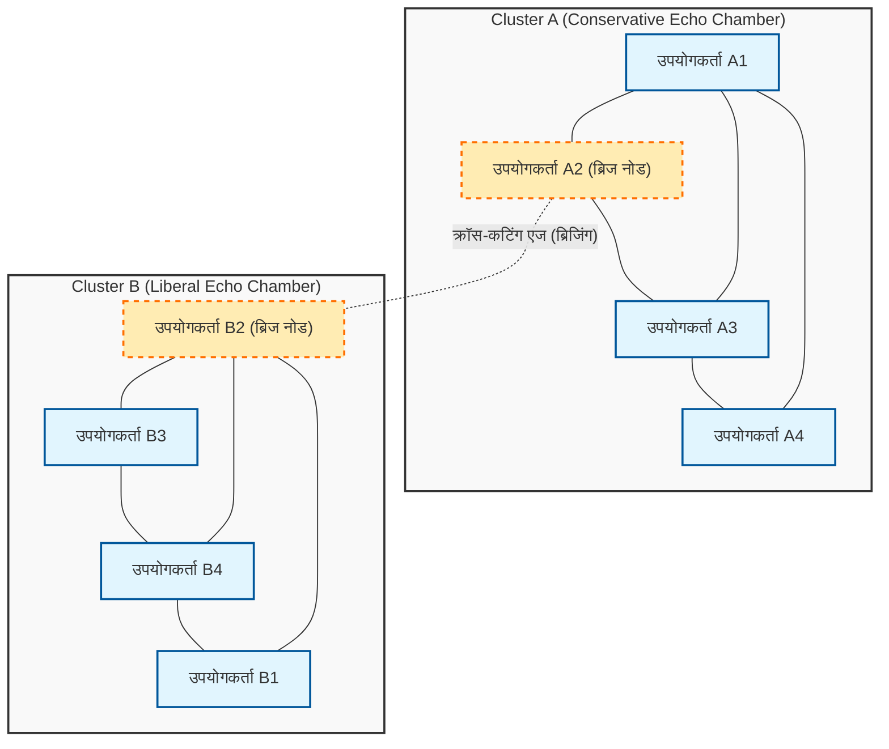
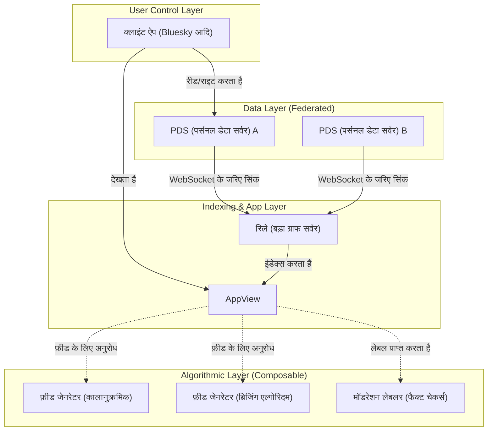

# परिचय: 100वें स्मरणीय लेख के अवसर पर

इस ब्लॉग को शुरू किए हुए कई साल हो गए हैं, और मैंने तकनीकी व्याख्याओं, दैनिक विकास के नोट्स, और कभी-कभी तकनीक और समाज के बीच के संबंधों पर विचार साझा किए हैं। और इस बार, यह लेख 100वां स्मरणीय पोस्ट है। यहाँ तक पढ़ने वाले सभी पाठकों का मैं हृदय से धन्यवाद करता हूँ।

इस 100वें मील के पत्थर पर, एक विषय है जिसे मैं निश्चित रूप से लिखना चाहता था। वह है, "क्या तकनीक सामाजिक विभाजन को पाट सकती है?", जो आधुनिक समाज में एक अत्यंत महत्वपूर्ण और मौलिक प्रश्न है।

शुरुआती इंटरनेट (Web 1.0) को "ज्ञान के लोकतंत्रीकरण" के एक यूटोपिया के रूप में बताया गया था, जहाँ कोई भी स्वतंत्र रूप से जानकारी प्रकाशित कर सकता था और उस तक पहुँच सकता था। इसके बाद सोशल मीडिया के युग (Web 2.0) को दुनिया भर के लोगों को जोड़ने और एक "समतल दुनिया" को साकार करने वाला माना गया था। हालांकि, 2026 में आज, हम जिस वास्तविकता का सामना कर रहे हैं, वह कैसी है? राजनीतिक ध्रुवीकरण, साजिश के सिद्धांतों का प्रसार, फर्जी खबरों का फैलाव, और "इको चेंबर" (गूंज कक्ष) और "फ़िल्टर बबल" का निर्माण जो आपसी समझ को नकारते हैं। लोगों को जोड़ने के बजाय, तकनीक सामाजिक विभाजन (Social Divide) को तेज करने वाले एक शक्तिशाली इंजन में बदलती दिख रही है।

हम इंजीनियर सिर्फ कोड लिखने और सिस्टम बनाने वाले लोग नहीं हैं। हम जो आर्किटेक्चर डिज़ाइन करते हैं, जो एल्गोरिदम चुनते हैं, और जिस ऑब्जेक्टिव फंक्शन (Objective Function) को ऑप्टिमाइज़ करते हैं, उसके पीछे ऐसे "नियम" छिपे होते हैं जो समाज की प्रकृति को निर्धारित करते हैं। इस लेख में, एक इंजीनियर के दृष्टिकोण से, मैं गणितीय और नेटवर्क थ्योरी के माध्यम से यह स्पष्ट करना चाहता हूँ कि वर्तमान सामाजिक विभाजन तकनीकी रूप से कैसे उत्पन्न हो रहा है, और साथ ही, इसे पार पाने के लिए विशिष्ट तकनीकी दृष्टिकोण (ब्रिजिंग एल्गोरिदम, विकेंद्रीकृत SNS प्रोटोकॉल) पर गहराई से चर्चा करूँगा।

---

# अध्याय 1: नेटवर्क थ्योरी से देखा गया "इको चेंबर" की गणितीय संरचना

सामाजिक विभाजन पर चर्चा करते समय, नेटवर्क थ्योरी ([Graph Theory](https://kenji.blog/hi/p/graph-theory-dijkstra-a-star/)) का उपयोग करके कम्युनिटी संरचना का विश्लेषण करना अनिवार्य है। सोशल मीडिया पर मानवीय रिश्तों को एक विशाल ग्राफ के रूप में मॉडल किया जा सकता है, जहाँ उपयोगकर्ता "नोड्स" (शीर्ष) होते हैं और उपयोगकर्ताओं के बीच फॉलो या इंटरैक्शन "किनारे" (Edges) होते हैं।

विभाजन को दर्शाने वाले सबसे महत्वपूर्ण संकेतकों में से एक "क्लस्टरिंग गुणांक (Clustering Coefficient)" है। किसी उपयोगकर्ता $i$ का क्लस्टरिंग गुणांक $C_i$ इस संभावना को दर्शाता है कि उपयोगकर्ता $i$ के दोस्त एक-दूसरे के भी दोस्त हैं, और इसे निम्नलिखित सूत्र द्वारा परिभाषित किया गया है:

$$ C_i = \frac{2e_i}{k_i(k_i - 1)} $$

यहाँ, $k_i$ उपयोगकर्ता $i$ की डिग्री (दोस्तों की संख्या) है, और $e_i$ उन $k_i$ दोस्तों के बीच मौजूद वास्तविक किनारों (Edges) की संख्या है। सोशल मीडिया पर, वह घटना जहाँ असामान्य रूप से उच्च क्लस्टरिंग गुणांक वाले स्थानीय नेटवर्क (घने उप-ग्राफ) बनते हैं, जिसे "इको चेंबर" कहा जाता है, की नींव बन जाती है।

इको चेंबर बनने के पीछे समाजशास्त्र में "होमोफिली (Homophily: समरूपता)" का सिद्धांत काम कर रहा है। जैसा कि कहावत है "समान पंखों वाले पक्षी एक साथ झुंड बनाते हैं", मनुष्य उन लोगों से जुड़ने की प्रवृत्ति रखते हैं जिनकी विशेषताएँ या विचार उनके समान होते हैं। इसे एक संभाव्य मॉडल के रूप में व्यक्त करते हुए, यह माना जा सकता है कि उपयोगकर्ता $u$ और उपयोगकर्ता $v$ के बीच एक किनारा (Edge) बनने की संभावना $P(u, v)$ उनकी वैचारिक दूरी $d(u,v)$ के व्युत्क्रमानुपाती होती है:

$$ P(u, v) \propto e^{-\beta \cdot d(u,v)} $$

पैरामीटर $\beta > 0$ होमोफिली की ताकत को दर्शाने वाला एक स्थिरांक है। जब प्लेटफ़ॉर्म का अनुशंसा एल्गोरिदम (Recommendation Algorithm) "उस सामग्री या उपयोगकर्ताओं को जो उपयोगकर्ता पसंद करता है (= खुद के समान)" प्रस्तुत करना जारी रखता है, तो यह $\beta$ का मान कृत्रिम रूप से बढ़ जाता है। नतीजतन, विभिन्न वैचारिक समूहों (कमजोर संबंध: Weak Ties) के बीच किनारे (Edges) काफी कम हो जाते हैं, और संपूर्ण नेटवर्क कई अलग-अलग क्लस्टरों में विभाजित हो जाता है जो एक-दूसरे से अलग-थलग होते हैं।

नीचे दिया गया Mermaid आरेख एक विभाजित नेटवर्क और उसे जोड़ने वाले ब्रिजिंग की अवधारणा की कल्पना करता है।

इस प्रकार, जब तक एल्गोरिदम एक ऐसे ऑब्जेक्टिव फंक्शन $J(\theta) = \sum \log P(\text{engage} | \text{user}, \text{content})$ का उपयोग करना जारी रखता है जो केवल एंगेजमेंट (क्लिक-थ्रू रेट, बिताया गया समय) को ऑप्टिमाइज़ करता है, सिस्टम एक स्थानीय इष्टतम (इको चेंबर का सुदृढ़ीकरण) में फंस जाता है, और यह वैश्विक इष्टतम (एक स्वस्थ सार्वजनिक स्थान का निर्माण) से दूर हो जाता है।

---

# अध्याय 2: एल्गोरिदम के कारण ध्रुवीकरण की गति और सूचना प्रसार मॉडल

यह विचार करने के लिए कि इको चेंबर के भीतर जानकारी कैसे फैलती है, आइए एक संक्रामक रोग के गणितीय मॉडल "SIR मॉडल" को सूचना प्रसार पर लागू करें।
- $S$ (Susceptible) : वे उपयोगकर्ता जिन्हें अभी तक जानकारी नहीं मिली है
- $I$ (Infected) : वे उपयोगकर्ता जो जानकारी पर विश्वास करते हैं और उसे फैला रहे हैं
- $R$ (Recovered/Removed) : वे उपयोगकर्ता जिन्होंने जानकारी में रुचि खो दी है या जिन्होंने महसूस किया है कि यह फर्जी है और इसे फैलाना बंद कर दिया है

सूचना प्रसार के विभेदक समीकरणों (Differential equations) को इस प्रकार व्यक्त किया जाता है:

$$ \frac{dS}{dt} = -\alpha S I $$
$$ \frac{dI}{dt} = \alpha S I - \gamma I $$
$$ \frac{dR}{dt} = \gamma I $$

यहाँ, $\alpha$ "संक्रमण दर (सूचना के फैलने में आसानी)" है, और $\gamma$ "पुनर्प्राप्ति दर (सूचना की संतृप्ति / भूलना)" है।
दिलचस्प बात यह है कि अनुभवजन्य अध्ययनों से पता चलता है कि क्रोध और भय को भड़काने वाली चरम सामग्री (Polarizing Content) के लिए $\alpha$ सामान्य जानकारी की तुलना में काफी अधिक होता है। इसके अलावा, चूंकि इको चेंबर के भीतर विरोधी जानकारी का सामना करने के कम अवसर होते हैं, इसलिए $\gamma$ अत्यंत कम हो जाता है। दूसरे शब्दों में, यदि एल्गोरिदम एंगेजमेंट को अधिकतम करने की कोशिश करता है, तो यह अनिवार्य रूप से ऐसी सामग्री को प्राथमिकता देना सीख जाएगा जिसके लिए $\alpha$ उच्च है और $\gamma$ कम है, यानी "चरम विचार और फर्जी खबरें"। यह वह तंत्र है जिसके द्वारा AI अनजाने में सामाजिक विभाजन को तेज कर रहा है।

---

# अध्याय 3: तकनीकी समाधान (1) ब्रिजिंग एल्गोरिदम और कम्युनिटी नोट्स

तो, हमें इस संरचनात्मक दोष का सामना कैसे करना चाहिए? पहला दृष्टिकोण "ब्रिजिंग एल्गोरिदम (Bridging Algorithm)" का परिचय है।

यदि एंगेजमेंट पर आधारित अनुशंसा एल्गोरिदम "समरूपता" को पुरस्कृत करता है, तो ब्रिजिंग एल्गोरिदम "विषमता के बीच पुल बनाने" को पुरस्कृत करता है। इसका एक प्रमुख सफल उदाहरण "कम्युनिटी नोट्स (Community Notes)" का एल्गोरिदम है जिसे X (पूर्व में Twitter) पर पेश किया गया है।

कम्युनिटी नोट्स केवल बहुमत का नियम नहीं है। यदि यह केवल बहुमत का नियम होता, तो बड़ी संख्या वाले इको चेंबर की राय हमेशा जीत जाती। कम्युनिटी नोट्स का अभिनव पहलू यह है कि यह उन नोट्स को अत्यधिक महत्व देता है जिन्हें "वे लोग जो आमतौर पर असहमत होते हैं (विभिन्न क्लस्टरों से संबंधित होते हैं) संयोग से सहमत होते हैं कि वे 'उपयोगी' हैं।"

इसे प्राप्त करने के लिए, "मैट्रिक्स फ़ैक्टराइज़ेशन (Matrix Factorization)" नामक मशीन लर्निंग तकनीक का उपयोग किया जाता है। पूर्वानुमानित स्कोर $\hat{r}_{u,n}$ जो उपयोगकर्ता $u$ नोट $n$ को देता है (उपयोगी है या नहीं) उसे इस प्रकार मॉडल किया गया है:

$$ \hat{r}_{u,n} = \mu + i_u + i_n + \mathbf{f}_u \cdot \mathbf{f}_n $$

- $\mu$ : समग्र बेसलाइन (औसत मूल्यांकन प्रवृत्ति)
- $i_u$ : उपयोगकर्ता $u$ का मूल्यांकन पूर्वाग्रह (उदा. जो हमेशा उच्च रेटिंग देता है)
- $i_n$ : नोट $n$ की सामान्य गुणवत्ता (क्या यह किसी के लिए भी समझने में आसान है)
- $\mathbf{f}_u$ : उपयोगकर्ता $u$ का अव्यक्त विशेषता वेक्टर (Latent feature vector) (वैचारिक स्थिति, आदि)
- $\mathbf{f}_n$ : नोट $n$ का अव्यक्त विशेषता वेक्टर

एल्गोरिदम वास्तविक मूल्यांकन डेटा और पूर्वानुमानित स्कोर के बीच की त्रुटि को कम करने के लिए प्रत्येक पैरामीटर को सीखता है।
यहाँ जो बात महत्वपूर्ण है वह यह है कि नोट के अंतिम प्रदर्शन का निर्धारण करने के लिए जिसका उपयोग किया जाता है वह केवल औसत रेटिंग नहीं है, बल्कि "पैरामीटर $i_n$ जो नोट की सामान्य गुणवत्ता को दर्शाता है।"

यदि कोई नोट किसी विशिष्ट पक्षपाती समूह (उदाहरण के लिए, केवल दक्षिणपंथी, या केवल वामपंथी) से बड़ी संख्या में उच्च रेटिंग प्राप्त करता है, तो वे उच्च रेटिंग अव्यक्त वेक्टर $\mathbf{f}_u \cdot \mathbf{f}_n$ के पद में अवशोषित हो जाती हैं, और $i_n$ उच्च नहीं होता है। हालाँकि, यदि इसे दक्षिणपंथी ($\mathbf{f}_u > 0$) और वामपंथी ($\mathbf{f}_u < 0$) दोनों से उच्च रेटिंग मिलती है, तो इसे केवल अव्यक्त वैक्टर के डॉट उत्पाद द्वारा नहीं समझाया जा सकता है, और परिणामस्वरूप, यह सीखता है कि "यह नोट अपने आप में सार्वभौमिक रूप से उत्कृष्ट है (उच्च $i_n$ है)।"

इस तरह के गणितीय दृष्टिकोण के माध्यम से, एल्गोरिथम रूप से "इको चेंबर से परे आम सहमति निर्माण" की खोज करना और उसका मूल्यांकन करना संभव हो जाता है। सामाजिक विभाजन को पाटने के लिए यह एक बहुत ही शक्तिशाली तकनीकी सफलता है।

---

# अध्याय 4: तकनीकी समाधान (2) विकेंद्रीकृत SNS प्रोटोकॉल (AT प्रोटोकॉल / ActivityPub)

ब्रिजिंग एल्गोरिदम शक्तिशाली हैं, लेकिन यह संरचनात्मक मुद्दा बना रहता है कि एक भी विशाल कंपनी (केंद्रीकृत मंच) एल्गोरिदम पर एकाधिकार रखती है। मंच की प्रबंधन नीति के आधार पर एल्गोरिदम को कभी भी बदला जा सकता है।

इसका दूसरा दृष्टिकोण "विकेंद्रीकृत SNS प्रोटोकॉल (Decentralized Social Protocols)" के माध्यम से आर्किटेक्चरल स्तर पर एक प्रतिमान बदलाव (Paradigm Shift) है। वर्तमान में, ActivityPub (Mastodon आदि द्वारा अपनाया गया) और AT Protocol (Bluesky द्वारा अपनाया गया) बहुत ध्यान आकर्षित कर रहे हैं।

विशेष रूप से AT Protocol (Authenticated Transfer Protocol) में "डेटा और एल्गोरिदम के पृथक्करण" का एक बहुत ही सुंदर डिज़ाइन दर्शन है।

AT Protocol की सबसे बड़ी उपलब्धि यह है कि इसने "फ़ीड जनरेशन (एल्गोरिदम)" और "मॉडरेशन (लेबलिंग)" को प्लेटफ़ॉर्म से अलग कर दिया है, जिससे उपयोगकर्ता उन्हें स्वतंत्र रूप से चुन सकते हैं और जोड़ सकते हैं (Composable) (Custom Feeds / Stackable Moderation)।

अब तक, हम चुन सकते थे कि "किस SNS का उपयोग करना है", लेकिन हम यह नहीं चुन सकते थे कि "किस एल्गोरिदम से जानकारी प्राप्त करनी है"। AT Protocol की दुनिया में, एक व्यक्ति "कालानुक्रमिक (Chronological)" फ़ीड चुन सकता है, दूसरा "एक शैक्षणिक फ़ीड स्थापित कर सकता है जो उनके विचारों के विरुद्ध तर्क प्रस्तुत करता है", और कोई अन्य "अनुचित शब्दों को छिपाने के लिए एक तृतीय-पक्ष मॉडरेशन लेबल" की सदस्यता ले सकता है।

क्रिप्टोग्राफ़िक तकनीक (DID: Decentralized Identifiers) और डेटा संरचनाओं (Merkle Search Trees: MST) द्वारा समर्थित यह प्रोटोकॉल, उपयोगकर्ताओं को "सूचना के आत्मनिर्णय का अधिकार" वापस देता है। एल्गोरिदम के ब्लैक बॉक्स के बजाय खुले बाजार में प्रतिस्पर्धा करने और चुने जाने से, यह प्रोत्साहन संरचना को एंगेजमेंट-संचालित एल्गोरिदम से ऐसे एल्गोरिदम में बदलने की क्षमता रखता है जो उपयोगकर्ताओं के मानसिक स्वास्थ्य और समाज की भलाई को महत्व देते हैं।

---

# अध्याय 5: ओपन सोर्स का दर्शन और इंजीनियरों की सामाजिक जिम्मेदारी

अब तक, हमने नेटवर्क सिद्धांत का उपयोग करके विश्लेषण और इसे दूर करने के लिए विशिष्ट तकनीकों (कम्युनिटी नोट्स में मैट्रिक्स फ़ैक्टराइज़ेशन, एटी प्रोटोकॉल का विकेन्द्रीकृत आर्किटेक्चर) पर चर्चा की है। हालाँकि, अंततः जो सामाजिक विभाजन को पाटेगा वह केवल कोड या गणितीय सूत्र नहीं है। यह इसे बनाने वाले "मनुष्यों की इच्छा और दर्शन" है।

सॉफ़्टवेयर इंजीनियरिंग की दुनिया में, "ओपन सोर्स (Open Source)" की एक महान संस्कृति है। Linux से शुरू होकर, इंटरनेट का निर्माण करने वाली अधिकांश बुनियादी तकनीक दुनिया भर के अजनबियों द्वारा बनाई गई है जो सहयोग करते हैं, चर्चा करते हैं, और विचारधाराओं और राष्ट्रीय सीमाओं के पार कोड को मर्ज करते हैं। संघर्ष (Conflict) को खत्म करने के बजाय, ओपन सोर्स समुदाय के पास इसे "पुल रिक्वेस्ट (Pull Request)" और "कोड रिव्यू (Code Review)" के माध्यम से रचनात्मक आम सहमति निर्माण में बदलने का एक तंत्र है।

मेरा मानना है कि यह ओपन सोर्स दर्शन विभाजित आधुनिक समाज को सुधारने का एक सुराग हो सकता है। सिस्टम को पारदर्शी बनाना, उपयोगकर्ताओं को एल्गोरिदम चुनने का अधिकार देना, और एक विकेन्द्रीकृत सार्वजनिक स्थान (Public Square) डिज़ाइन करना जहाँ विविध मूल्य सह-अस्तित्व में रह सकें। यह आधुनिक इंजीनियरों पर थोपी गई एक अत्यंत महत्वपूर्ण सामाजिक जिम्मेदारी है।

कोड कानून है, और आर्किटेक्चर राजनीति है। हमारे द्वारा लिखी गई कोड की एक पंक्ति, एक API एंडपॉइंट जिसे हम परिभाषित करते हैं, या डेटाबेस स्कीमा जिसे हम डिज़ाइन करते हैं, लाखों या करोड़ों उपयोगकर्ताओं की धारणा को आकार दे सकता है, और कभी-कभी सामाजिक विभाजन को तेज कर सकता है या संवाद को प्रोत्साहित करने के लिए पुल बना सकता है।

---

# निष्कर्ष: 100वां लेख समाप्त होने पर

"क्या तकनीक सामाजिक विभाजन को पाट सकती है?"

इस प्रश्न का मेरा उत्तर है, "तकनीक अकेले इसे पाट नहीं सकती है, लेकिन सही ढंग से डिज़ाइन की गई तकनीक मनुष्यों के लिए विभाजन को दूर करने के लिए एक 'आधार' (Scaffolding) बन सकती है।"

मानवीय मूलभूत पूर्वाग्रहों (होमोफिली और पुष्टिकरण पूर्वाग्रह) को पूरी तरह से समाप्त करना असंभव है। हालाँकि, केवल एंगेजमेंट का पीछा करने वाले एल्गोरिदम को रोकना, कम्युनिटी नोट्स जैसे गणितीय मॉडल को पेश करना जो "पुल बनाने" को पुरस्कृत करते हैं, और AT Protocol जैसे स्वायत्त विकेन्द्रीकृत आर्किटेक्चर के माध्यम से उपयोगकर्ताओं को विकल्प लौटाना संभव है।

यह ब्लॉग अपने 100वें एपिसोड में पहुँच गया है। पिछले लेखों में, हमने भाषा विनिर्देशों और रूपरेखाओं का उपयोग करने के तरीके जैसे तथाकथित "कैसे (How)" पर ध्यान केंद्रित किया है। हालांकि, भविष्य में जहां AI स्वचालित रूप से कोड उत्पन्न करता है और सभी प्रौद्योगिकियां कमोडिटीकृत हो जाती हैं, हम इंजीनियरों के लिए सबसे महत्वपूर्ण चीज "क्या (What - क्या बनाना है)" और "क्यों (Why - इसे क्यों बनाना है)" के नैतिक और दार्शनिक प्रश्न हैं।

तकनीक कोई जादू नहीं है। यह इंसान का आईना है। यदि समाज विभाजित है, तो इसका कारण यह है कि हमारे द्वारा बनाए गए सिस्टम विभाजन को प्रतिबिंबित और प्रवर्धित कर रहे हैं। इसीलिए मेरा मानना है कि सिस्टम को फिर से लिखकर, हम समाज के स्वरूप को थोड़ा-थोड़ा करके, लेकिन निश्चित रूप से बेहतर दिशा में बदल सकते हैं।

101वें लेख से भी, एक इंजीनियर के रूप में, मैं कोड और समाज के चौराहे पर खड़ा रहूँगा, और अपने विचारों को गहरा करूँगा। अंत तक इस लंबे लेख को पढ़ने के लिए आपका बहुत-बहुत धन्यवाद। आशा है कि भविष्य का नेटवर्क हमें विभाजित करने वाली दीवार नहीं, बल्कि एक-दूसरे को समझने का पुल बनेगा।

(समाप्त)

