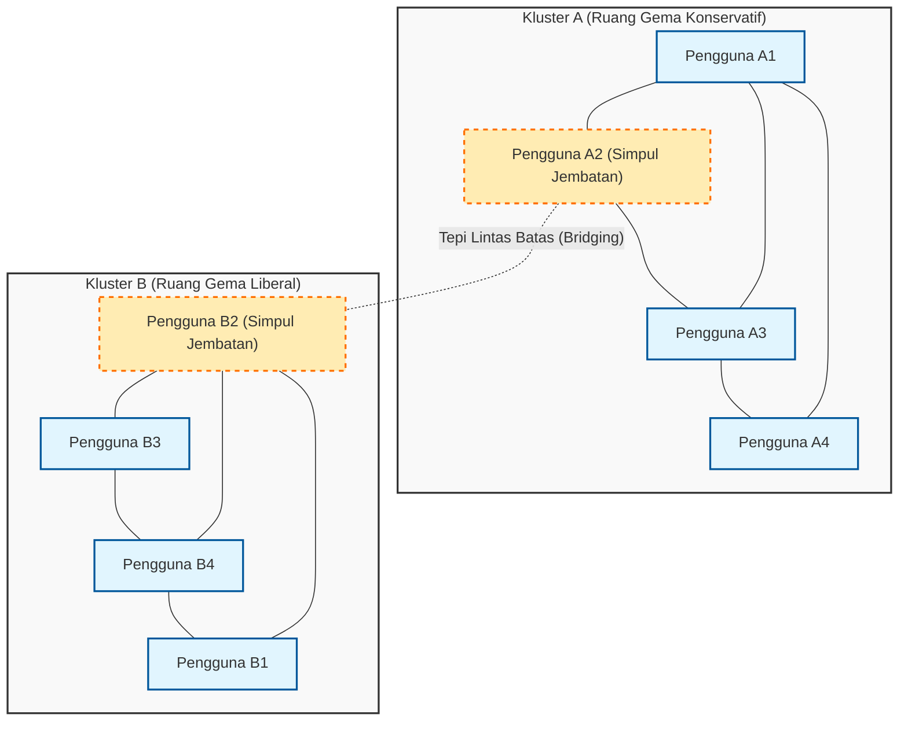
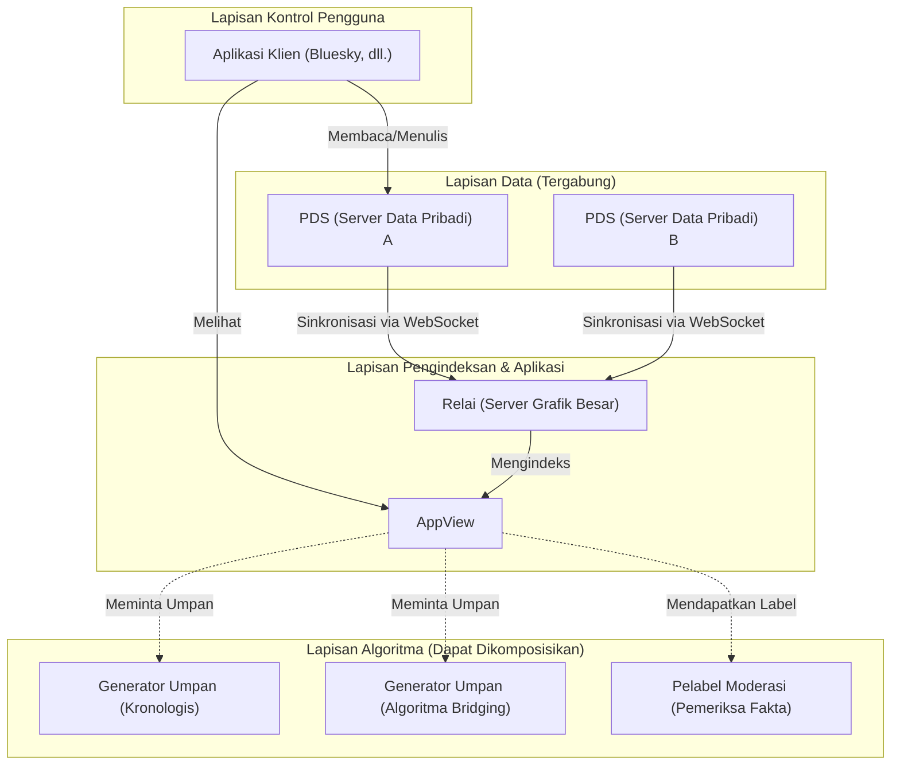

# Pengantar: Menyambut Artikel ke-100 yang Bersejarah

Beberapa tahun setelah meluncurkan blog ini, saya telah mengumpulkan penjelasan teknis, catatan harian pengembangan, dan terkadang refleksi mendalam mengenai hubungan antara teknologi dan masyarakat. Dan kini, artikel ini menjadi postingan "ke-100" yang bersejarah. Saya ingin mengucapkan terima kasih yang tulus kepada semua pembaca yang telah terus membaca sejauh ini.

Pada titik balik ke-100 ini, ada satu tema yang sangat ingin saya tulis. Tema tersebut adalah pertanyaan yang sangat penting dan mendasar dalam masyarakat modern: "Apakah teknologi mampu menjembatani kesenjangan sosial?"

Internet awal (Web 1.0) diceritakan sebagai utopia "demokratisasi pengetahuan" di mana siapa pun dapat secara bebas menyebarkan dan mengakses informasi. Era media sosial yang mengikutinya (Web 2.0) seharusnya menghubungkan orang-orang di seluruh dunia dan mewujudkan "dunia yang datar". Namun, pada tahun 2026 saat ini, bagaimana kenyataan yang kita hadapi? Polarisasi politik, penyebaran teori konspirasi, berita palsu, serta pembentukan "ruang gema" (Echo Chamber) dan "gelembung filter" (Filter Bubble) yang menolak pemahaman bersama. Alih-alih menghubungkan orang, teknologi tampaknya justru menjadi mesin yang kuat dalam mempercepat kesenjangan sosial (Social Divide).

Kita, para teknisi, bukanlah sekadar eksistensi yang hanya menulis kode dan membangun sistem. Di balik arsitektur yang kita rancang, algoritma yang kita pilih, dan fungsi objektif (Objective Function) yang kita optimalkan, tersembunyi "aturan-aturan" yang menentukan tatanan masyarakat. Dalam artikel ini, dari sudut pandang seorang teknisi, saya ingin menjelaskan secara matematis dan teoretis jaringan tentang bagaimana kesenjangan sosial saat ini diciptakan secara teknis, dan sekaligus membahas secara mendalam tentang pendekatan teknis konkret (algoritma bridging, protokol SNS terdesentralisasi) untuk mengatasinya.

---

# Bab 1: Struktur Matematis "Ruang Gema" dari Perspektif Teori Jaringan

Dalam membahas kesenjangan sosial, pertama-tama kita tidak bisa menghindari analisis struktur komunitas menggunakan "teori jaringan" (Graph Theory). Hubungan manusia di media sosial dapat dimodelkan sebagai grafik raksasa dengan pengguna sebagai "simpul" (node) dan tindakan mengikuti atau interaksi antar pengguna sebagai "tepi" (edge).

Salah satu indikator paling penting yang menjadi ciri khas perpecahan adalah "Koefisien Pengelompokan" (Clustering Coefficient). Koefisien pengelompokan $C_i$ dari seorang pengguna $i$ menunjukkan probabilitas bahwa teman-teman dari pengguna $i$ juga berteman satu sama lain, dan didefinisikan dengan rumus berikut:

$$ C_i = \frac{2e_i}{k_i(k_i - 1)} $$

Di sini, $k_i$ adalah derajat (jumlah teman) dari pengguna $i$, dan $e_i$ adalah jumlah tepi aktual yang ada di antara $k_i$ teman tersebut. Di media sosial, fenomena di mana jaringan lokal (subgraf padat) dengan koefisien pengelompokan yang sangat tinggi ini terbentuk adalah apa yang menjadi dasar dari apa yang disebut "ruang gema".

Di balik terbentuknya ruang gema, bekerja prinsip "homofili" (Homophily) dalam sosiologi. Seperti pepatah "burung yang sama bulunya berkumpul bersama", manusia cenderung mudah terhubung dengan orang lain yang memiliki atribut atau pemikiran serupa dengan dirinya. Jika ini dinyatakan sebagai model probabilistik, probabilitas $P(u, v)$ bahwa sebuah tepi terbentuk antara pengguna $u$ dan pengguna $v$ dapat diasumsikan berbanding terbalik dengan jarak ideologis mereka $d(u,v)$.

$$ P(u, v) \propto e^{-\beta \cdot d(u,v)} $$

Parameter $\beta > 0$ adalah konstanta yang menunjukkan kekuatan homofili. Ketika algoritma rekomendasi platform terus menyajikan "konten atau pengguna yang disukai pengguna (= yang mirip dengan dirinya)", nilai $\beta$ ini secara artifisial ditingkatkan. Akibatnya, tepi antar kelompok dengan ideologi yang berbeda (hubungan lemah: Weak Ties) berkurang secara drastis, dan seluruh jaringan terpecah menjadi beberapa kluster yang saling terisolasi.

Diagram Mermaid berikut adalah visualisasi dari jaringan yang terbagi dan konsep bridging yang menghubungkannya.

Dengan cara ini, selama algoritma terus menggunakan fungsi objektif $J(\theta) = \sum \log P(\text{engage} | \text{user}, \text{content})$ yang hanya mengoptimalkan keterlibatan (rasio klik, waktu tinggal), sistem akan jatuh ke dalam solusi lokal (penguatan ruang gema) dan menjauh dari optimalisasi keseluruhan (pembentukan ruang publik yang sehat).

---

# Bab 2: Percepatan Polarisasi oleh Algoritma dan Model Difusi Informasi

Untuk memahami bagaimana informasi menyebar di dalam ruang gema, mari terapkan "Model SIR", sebuah model matematika untuk penyakit menular, ke dalam penyebaran informasi.
- $S$ (Susceptible) : Pengguna yang belum terpapar informasi
- $I$ (Infected) : Pengguna yang mempercayai dan menyebarkan informasi
- $R$ (Recovered/Removed) : Pengguna yang kehilangan minat terhadap informasi, atau menyadari bahwa itu berita palsu dan berhenti menyebarkannya

Persamaan diferensial dari transmisi informasi direpresentasikan sebagai berikut.

$$ \frac{dS}{dt} = -\alpha S I $$
$$ \frac{dI}{dt} = \alpha S I - \gamma I $$
$$ \frac{dR}{dt} = \gamma I $$

Di sini, $\alpha$ adalah "tingkat infeksi (kemudahan penyebaran informasi)", dan $\gamma$ adalah "tingkat pemulihan (saturasi/lupa akan informasi)".
Yang menarik adalah, ada studi empiris yang menunjukkan bahwa konten ekstrem yang memicu kemarahan atau ketakutan (Polarizing Content) memiliki $\alpha$ yang jauh lebih tinggi dibandingkan informasi biasa. Selain itu, karena minimnya kesempatan untuk terpapar informasi sanggahan di dalam ruang gema, $\gamma$ menjadi sangat rendah. Dengan kata lain, ketika algoritma mencoba memaksimalkan keterlibatan, secara alami ia akan belajar untuk memprioritaskan penyebaran konten dengan $\alpha$ tinggi dan $\gamma$ rendah, yaitu "opini ekstrem atau berita palsu". Inilah mekanisme di mana AI tanpa sengaja mempercepat kesenjangan sosial.

---

# Bab 3: Solusi Teknis (1) Algoritma Bridging dan Catatan Komunitas

Lalu, bagaimana seharusnya kita menghadapi kelemahan struktural ini? Pendekatan pertama adalah pengenalan "Algoritma Bridging" (Bridging Algorithm).

Jika algoritma rekomendasi berbasis keterlibatan memberikan imbalan untuk "homogenitas", maka algoritma bridging memberikan imbalan untuk "penjembatanan heterogenitas". Salah satu contoh keberhasilannya adalah algoritma "Community Notes" (Catatan Komunitas) yang diperkenalkan di X (sebelumnya Twitter).

Community Notes bukanlah sekadar suara mayoritas. Jika itu hanya suara mayoritas, pendapat dari ruang gema dengan jumlah anggota yang lebih besar akan selalu menang. Poin terobosan dari Community Notes terletak pada kenyataan bahwa ia memberikan penilaian tinggi pada "catatan yang secara kebetulan dinilai 'bermanfaat' oleh orang-orang yang biasanya tidak sependapat (berasal dari kluster yang berbeda)".

Untuk mewujudkannya, digunakan metode pembelajaran mesin yang disebut faktorisasi matriks (Matrix Factorization). Skor prediksi $\hat{r}_{u,n}$ dari penilaian (apakah bermanfaat atau tidak) yang diberikan oleh pengguna $u$ untuk catatan $n$ dimodelkan sebagai berikut.

$$ \hat{r}_{u,n} = \mu + i_u + i_n + \mathbf{f}_u \cdot \mathbf{f}_n $$

- $\mu$ : Garis dasar keseluruhan (kecenderungan evaluasi rata-rata)
- $i_u$ : Bias evaluasi pengguna $u$ (misalnya, orang yang selalu memberikan penilaian tinggi)
- $i_n$ : Kualitas umum catatan $n$ (apakah mudah dipahami oleh siapa saja)
- $\mathbf{f}_u$ : Vektor fitur laten pengguna $u$ (seperti posisi ideologis)
- $\mathbf{f}_n$ : Vektor fitur laten catatan $n$

Algoritma mempelajari setiap parameter untuk meminimalkan kesalahan antara data penilaian aktual dan skor prediksi.
Yang penting di sini adalah bahwa yang digunakan untuk menentukan visibilitas akhir dari catatan bukanlah sekadar rata-rata penilaian, melainkan "parameter $i_n$ yang menunjukkan kualitas umum catatan".

Jika suatu catatan mendapatkan banyak penilaian tinggi dari kelompok yang sangat bias (misalnya sayap kanan saja, atau sayap kiri saja), penilaian tinggi tersebut akan diserap oleh istilah vektor laten $\mathbf{f}_u \cdot \mathbf{f}_n$, sehingga $i_n$ tidak akan menjadi tinggi. Namun, jika catatan tersebut mendapat penilaian tinggi dari sayap kanan ($\mathbf{f}_u > 0$) maupun sayap kiri ($\mathbf{f}_u < 0$), hal tersebut tidak lagi bisa dijelaskan hanya dengan produk titik (dot product) dari vektor laten, sehingga hasilnya adalah catatan tersebut dipelajari sebagai "catatan yang memang secara universal sangat baik ($i_n$ tinggi)".

Melalui pendekatan matematis semacam ini, dimungkinkan untuk secara algoritmik menemukan dan mengevaluasi "pembentukan konsensus melampaui ruang gema". Ini merupakan terobosan teknis yang sangat kuat untuk menjembatani kesenjangan sosial.

---

# Bab 4: Solusi Teknis (2) Protokol SNS Terdesentralisasi (AT Protocol / ActivityPub)

Meskipun algoritma bridging sangat kuat, masalah struktural di mana satu perusahaan raksasa (platform tersentralisasi) memonopoli algoritma tetap ada. Tergantung pada satu kebijakan manajemen platform, algoritma dapat diubah kapan saja.

Pendekatan kedua untuk mengatasi ini adalah pergeseran paradigma pada tingkat arsitektur melalui "Protokol SNS Terdesentralisasi" (Decentralized Social Protocols). Saat ini, ActivityPub (yang diadopsi oleh Mastodon, dll.) dan AT Protocol (yang diadopsi oleh Bluesky) mendapatkan banyak perhatian.

Secara khusus, AT Protocol (Authenticated Transfer Protocol) memiliki filosofi desain yang sangat indah tentang "pemisahan data dan algoritma".

Pencapaian terbesar AT Protocol adalah memisahkan "pembuatan umpan (algoritma)" dan "moderasi (pelabelan)" dari entitas platform utama, dan membuatnya agar pengguna dapat secara bebas memilih dan menggabungkannya (Composable) sesuai keinginan (Custom Feeds / Stackable Moderation).

Sebelumnya, kita mungkin bisa memilih "SNS mana yang akan digunakan", tetapi kita tidak bisa memilih "algoritma mana yang menjejali kita dengan informasi". Di dunia AT Protocol, seseorang dapat memilih umpan "berdasarkan urutan kronologis", orang lain mungkin menginstal "umpan akademis yang menyajikan argumen tandingan terhadap opini sendiri", dan ada pula yang dapat berlangganan "label moderasi dari lembaga pihak ketiga yang menyembunyikan kata-kata tidak pantas".

Protokol ini, yang didukung oleh teknologi kriptografi (DID: Decentralized Identifiers) dan struktur data (Merkle Search Trees: MST), mengembalikan "hak penentuan nasib sendiri atas informasi" kepada pengguna. Dengan membiarkan algoritma bersaing dan dipilih di pasar terbuka yang bukan kotak hitam, ia memiliki potensi untuk mengubah struktur insentif dari algoritma yang mengutamakan keterlibatan menjadi algoritma yang menghargai kesehatan mental pengguna dan kesehatan masyarakat.

---

# Bab 5: Filosofi Sumber Terbuka dan Tanggung Jawab Sosial Teknisi

Sejauh ini, kita telah membahas analisis berdasarkan teori jaringan dan teknologi spesifik (faktorisasi matriks di Community Notes, arsitektur terdesentralisasi dari AT Protocol) untuk mengatasinya. Namun, pada akhirnya yang akan menjembatani kesenjangan sosial bukanlah sekadar kode atau rumus matematika. Melainkan "kehendak dan filosofi manusia" yang membuatnya.

Di dunia rekayasa perangkat lunak, terdapat budaya hebat yang disebut "Sumber Terbuka" (Open Source). Dimulai dengan Linux, sebagian besar teknologi dasar yang membangun internet diciptakan melalui kerja sama, diskusi, dan penggabungan kode oleh orang-orang tak saling kenal di seluruh dunia yang melampaui ideologi dan batas negara. Komunitas sumber terbuka tidak mengeliminasi konflik, melainkan memiliki mekanisme untuk mengubahnya menjadi pembentukan konsensus yang konstruktif melalui "pull request" dan "code review".

Saya percaya bahwa filosofi sumber terbuka inilah yang bisa menjadi petunjuk untuk memperbaiki masyarakat modern yang terpecah ini. Membuat sistem menjadi transparan, menyerahkan hak untuk memilih algoritma kepada pengguna, dan merancang ruang publik (Public Square) terdesentralisasi di mana beragam nilai dapat hidup berdampingan. Hal ini merupakan tanggung jawab sosial yang sangat penting bagi para teknisi modern.

Kode adalah hukum, dan arsitektur adalah politik. Satu baris kode yang kita tulis, satu titik akhir API yang kita definisikan, dan skema basis data yang kita rancang dapat membentuk kognisi jutaan hingga ratusan juta pengguna, yang terkadang bisa mempercepat pembelahan masyarakat, namun juga bisa membangun jembatan yang mendorong dialog.

---

# Penutup: Menyelesaikan Artikel ke-100

"Apakah teknologi mampu menjembatani kesenjangan sosial?"

Jawaban saya untuk pertanyaan ini adalah, "Teknologi secara mandiri tidak bisa menjembataninya, tetapi teknologi yang dirancang dengan benar bisa menjadi 'pijakan' bagi manusia untuk mengatasi kesenjangan tersebut."

Tidak mungkin untuk sepenuhnya menghapus bias mendasar manusia (homofili atau bias konfirmasi). Namun, sangat mungkin untuk menghentikan pelarian algoritma yang hanya mengejar keterlibatan, memperkenalkan model matematis yang mengevaluasi "penjembatanan" seperti Community Notes, dan mengembalikan hak memilih kepada pengguna melalui arsitektur otonom dan terdesentralisasi seperti AT Protocol.

Blog ini telah mencapai artikelnya yang ke-100 kali ini. Dalam artikel-artikel sebelumnya, saya fokus pada apa yang disebut "How" (Bagaimana), seperti spesifikasi bahasa dan cara menggunakan framework. Namun, di era mendatang di mana AI menghasilkan kode secara otomatis dan semua teknologi menjadi komoditas, hal yang paling penting bagi kita para teknisi adalah pertanyaan tentang etika dan filosofi: "What (Apa yang dibuat)" dan "Why (Mengapa membuatnya)".

Teknologi bukanlah sihir. Ia adalah cermin dari manusia. Jika masyarakat terbelah, itu karena sistem yang kita buat mencerminkan dan memperkuat perpecahan tersebut. Oleh karena itu, saya percaya bahwa dengan menulis ulang sistem, kita perlahan tapi pasti bisa mengubah tatanan masyarakat ke arah yang lebih baik.

Mulai artikel ke-101 dan seterusnya, sebagai seorang teknisi, saya ingin terus berdiri di persimpangan antara kode dan masyarakat, untuk terus memperdalam pemikiran saya. Terima kasih banyak telah menemani membaca tulisan panjang ini sampai akhir. Berharap agar jaringan masa depan tidak menjadi dinding yang memisahkan kita, melainkan jembatan untuk memahami satu sama lain.

(Selesai)

