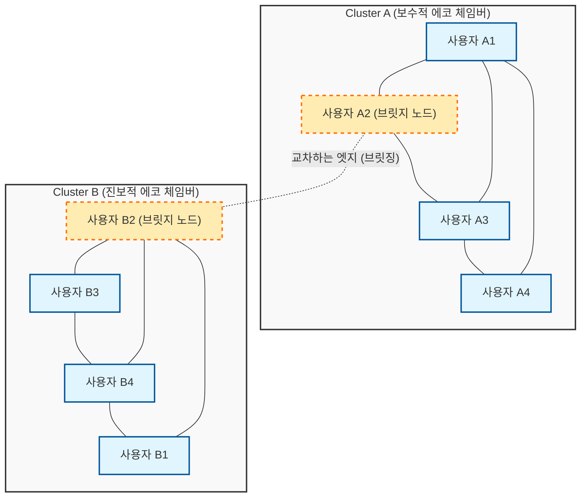
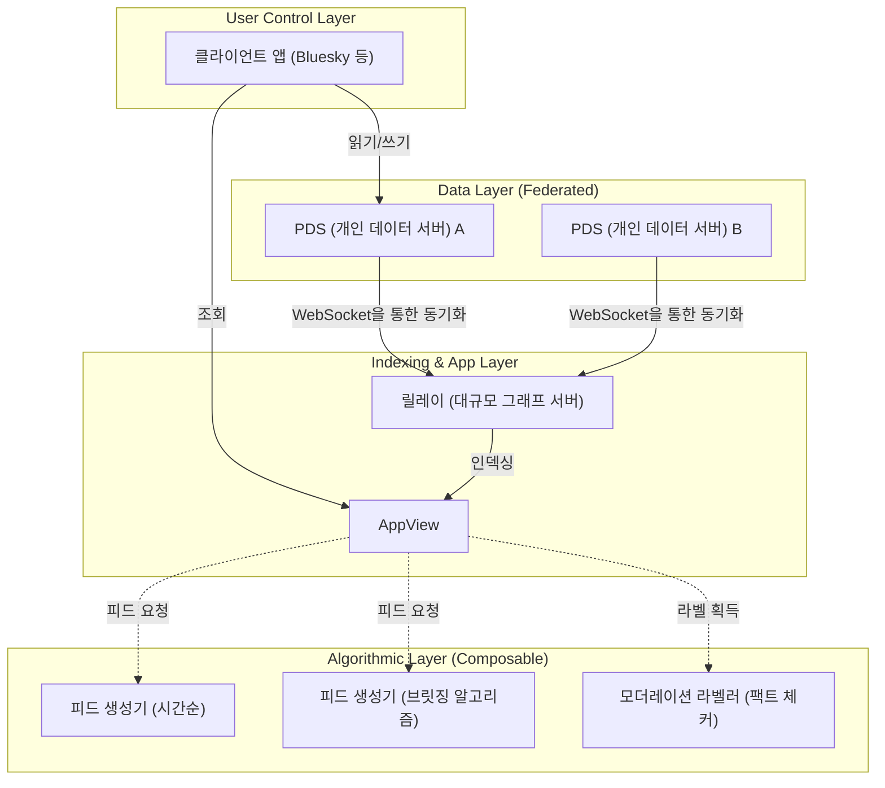

# 들어가며: 뜻깊은 100번째 글을 맞이하여

본 블로그를 개설한 지 수년, 기술적인 해설이나 매일의 개발 비망록, 그리고 때로는 테크놀로지와 사회의 관계성에 대해 고찰을 거듭해 왔습니다. 그리고 이번에, 이 글이 기념비적인 '제100회' 포스팅이 되었습니다. 여기까지 계속 읽어주신 독자 여러분께 진심으로 감사드립니다.

이 100회라는 전환점을 맞이하여, 제가 어떻게든 적어두고 싶었던 주제가 있습니다. 그것은 '테크놀로지는 사회의 분단을 메울 수 있을까?'라는, 현대 사회에 있어 지극히 중대하고 본질적인 질문입니다.

초기 인터넷(Web 1.0)은 누구나 자유롭게 정보를 발신하고 접근할 수 있는 '지식의 민주화'의 유토피아로 이야기되었습니다. 그에 이어진 소셜 미디어 시대(Web 2.0)는 전 세계 사람들을 연결하고, '평평한 세계(Flat World)'를 실현할 터였습니다. 하지만 2026년 현재, 우리가 직면하고 있는 현실은 어떨까요. 정치적 양극화, 음모론의 만연, 가짜 뉴스의 확산, 그리고 상호 이해를 거부하는 듯한 '에코 체임버(반향실)'와 '필터 버블'의 형성. 테크놀로지는 사람들을 연결하기는커녕, 오히려 사회의 분단(Social Divide)을 가속하는 강력한 엔진이 되어버린 것처럼 보입니다.

우리 기술자들은 단지 코드를 작성하고 시스템을 구축하기만 하는 존재가 아닙니다. 우리가 설계하는 아키텍처, 선택하는 알고리즘, 그리고 최적화하는 목적 함수(Objective Function)의 이면에는 사회의 형태를 규정하는 '규칙'이 숨어 있습니다. 본고에서는 한 명의 기술자로서의 관점에서, 현재의 사회적 분단이 어떻게 기술적으로 만들어지고 있는지를 수학적·네트워크 이론적으로 밝혀내고, 동시에 이를 극복하기 위한 구체적인 기술적 접근법(브릿징 알고리즘, 분산형 SNS 프로토콜)에 대해 깊이 파고들어 논하고자 합니다.

---

# 제1장: 네트워크 이론으로 보는 '에코 체임버'의 수학적 구조

사회의 분단을 논함에 있어 우선 피할 수 없는 것이 '네트워크 이론([Graph Theory](https://kenji.blog/ko/p/graph-theory-dijkstra-a-star/))'을 이용한 커뮤니티의 구조 해석입니다. 소셜 미디어 상의 인간관계는 사용자를 '노드(정점)', 사용자 간의 팔로우나 상호작용을 '엣지(간선)'로 하는 거대한 그래프로 모델화할 수 있습니다.

분단을 특징짓는 가장 중요한 지표 중 하나가 '클러스터 계수(Clustering Coefficient)'입니다. 어떤 사용자 $i$의 클러스터 계수 $C_i$는 사용자 $i$의 친구들끼리 서로 친구일 확률을 나타내며, 다음의 수식으로 정의됩니다.

$$ C_i = \frac{2e_i}{k_i(k_i - 1)} $$

여기서 $k_i$는 사용자 $i$의 차수(친구의 수), $e_i$는 그 $k_i$명의 친구들 사이에 존재하는 실제 엣지의 수입니다. 소셜 미디어에 있어 이 클러스터 계수가 비정상적으로 높은 국소적인 네트워크(밀집된 부분 그래프)가 형성되는 현상이 이른바 '에코 체임버'의 토대가 됩니다.

에코 체임버가 형성되는 이면에는 사회학에서 말하는 '동질성(Homophily: 동류 결집성)'의 원리가 작용하고 있습니다. '유유상종'이라는 말대로, 인간은 자신과 비슷한 속성이나 사상을 가진 타인과 연결되기 쉬운 경향이 있습니다. 이를 확률 모델로 표현하면, 사용자 $u$와 사용자 $v$ 사이에 엣지가 형성될 확률 $P(u, v)$는 양자의 이데올로기적 거리 $d(u,v)$에 반비례한다고 가정할 수 있습니다.

$$ P(u, v) \propto e^{-\beta \cdot d(u,v)} $$

파라미터 $\beta > 0$은 동질성의 강도를 나타내는 상수입니다. 플랫폼의 추천 알고리즘이 '사용자가 좋아하는(= 자신과 비슷한) 콘텐츠나 사용자'를 계속해서 제시하면, 이 $\beta$의 값이 인위적으로 상승하게 됩니다. 결과적으로 다른 이데올로기를 가진 집단 간의 엣지(약한 유대: Weak Ties)가 극단적으로 감소하고, 네트워크 전체가 서로 고립된 여러 클러스터로 분열해 버리는 것입니다.

다음의 Mermaid 다이어그램은 분단된 네트워크와, 그것을 연결하는 브릿징의 개념을 시각화한 것입니다.

이처럼 알고리즘이 인게이지먼트(클릭률, 체류 시간)만을 최적화하는 목적 함수 $J(\theta) = \sum \log P(\text{engage} | \text{user}, \text{content})$를 계속 채택하는 한, 시스템은 국소해(에코 체임버의 강화)에 빠지게 되고, 전체 최적화(건전한 공공 공간의 형성)에서는 멀어지게 됩니다.

---

# 제2장: 알고리즘에 의한 양극화의 가속과 정보 확산 모델

에코 체임버 내에서 정보가 어떻게 확산되는지를 생각하기 위해, 감염병의 수리 모델인 'SIR 모델'을 정보 확산에 응용해 봅시다.
- $S$ (Susceptible) : 아직 정보를 접하지 않은 사용자
- $I$ (Infected) : 정보를 믿고 확산하고 있는 사용자
- $R$ (Recovered/Removed) : 정보에 대한 흥미를 잃었거나 가짜임을 깨닫고 확산을 멈춘 사용자

정보 전파의 미분 방정식은 다음과 같이 표현됩니다.

$$ \frac{dS}{dt} = -\alpha S I $$
$$ \frac{dI}{dt} = \alpha S I - \gamma I $$
$$ \frac{dR}{dt} = \gamma I $$

여기서 $\alpha$는 '감염률(정보가 확산되기 쉬운 정도)', $\gamma$는 '회복률(정보의 포화·망각)'입니다.
흥미로운 점은 분노나 공포를 조장하는 극단적인 콘텐츠(Polarizing Content)는 일반적인 정보에 비해 $\alpha$가 현저히 높다는 실증 연구가 있다는 것입니다. 게다가 에코 체임버 내에서는 반증 정보를 접할 기회가 적기 때문에 $\gamma$가 극도로 낮아집니다. 즉, 알고리즘이 인게이지먼트를 극대화하려고 하면 필연적으로 $\alpha$가 높고 $\gamma$가 낮은 콘텐츠, 다시 말해 '극단적 주장이나 가짜 뉴스'를 우선적으로 전송하도록 학습하게 되는 것입니다. 이것이 AI가 의도치 않게 사회적 분단을 가속하는 메커니즘입니다.

---

# 제3장: 기술적 해결책 (1) 브릿징 알고리즘과 Community Notes

그렇다면 우리는 이 구조적 결함에 맞서 어떻게 대처해야 할까요? 첫 번째 접근법이 '브릿징 알고리즘(Bridging Algorithm)'의 도입입니다.

인게이지먼트에 기반한 추천 알고리즘이 '동질성'을 보상으로 삼는다면, 브릿징 알고리즘은 '이질성의 연결'을 보상으로 삼습니다. 그 대표적인 성공 사례가 X(구 트위터)에 도입되어 있는 'Community Notes(커뮤니티 노트)' 알고리즘입니다.

Community Notes는 단순한 다수결이 아닙니다. 다수결이라면 인원수가 많은 에코 체임버의 의견이 항상 이겨버리게 됩니다. Community Notes의 획기적인 점은 '평소에는 의견이 맞지 않는(다른 클러스터에 속하는) 사람들이 우연히 일치하여 "도움이 된다"고 평가한 노트'를 높게 평가한다는 점에 있습니다.

이를 실현하기 위해 행렬 분해(Matrix Factorization)라는 머신러닝 기법이 사용되고 있습니다. 사용자 $u$가 노트 $n$에 부여하는 평가(도움이 되었는지 여부)의 예측 점수 $\hat{r}_{u,n}$를 다음과 같이 모델화합니다.

$$ \hat{r}_{u,n} = \mu + i_u + i_n + \mathbf{f}_u \cdot \mathbf{f}_n $$

- $\mu$ : 전체의 베이스라인(평균적인 평가 경향)
- $i_u$ : 사용자 $u$의 평가 편향(항상 높은 평가를 주는 사람 등)
- $i_n$ : 노트 $n$의 일반적인 품질(누가 보아도 이해하기 쉬운가)
- $\mathbf{f}_u$ : 사용자 $u$의 잠재 특징 벡터(이데올로기적인 입장 등)
- $\mathbf{f}_n$ : 노트 $n$의 잠재 특징 벡터

알고리즘은 실제 평가 데이터와 예측 점수의 오차를 최소화하도록 각 파라미터를 학습합니다.
여기서 중요한 것은 노트의 최종적인 표시 판정에 사용되는 것이 단순한 평균 평가가 아니라 '노트의 일반적인 품질을 나타내는 파라미터 $i_n$'이라는 점입니다.

만약 어떤 노트가 특정하게 편향된 집단(예를 들어 우파만, 혹은 좌파만)으로부터 대량의 높은 평가를 얻은 경우, 그 높은 평가는 잠재 벡터 $\mathbf{f}_u \cdot \mathbf{f}_n$의 항에 흡수되어 $i_n$은 높아지지 않습니다. 하지만 우파($\mathbf{f}_u > 0$)와 좌파($\mathbf{f}_u < 0$) 모두로부터 높은 평가를 얻은 경우, 잠재 벡터의 내적만으로는 설명할 수 없게 되어, 결과적으로 '이 노트 자체가 보편적으로 우수하다($i_n$이 높다)'고 학습하게 되는 것입니다.

이러한 수학적 접근을 통해 '에코 체임버를 넘어선 합의 형성'을 알고리즘적으로 발견하고 평가하는 것이 가능해집니다. 이는 사회적 분단을 메우기 위한 매우 강력한 기술적 돌파구입니다.

---

# 제4장: 기술적 해결책 (2) 분산형 SNS 프로토콜 (AT Protocol / ActivityPub)

브릿징 알고리즘은 강력하지만, 단일 거대 기업(중앙집권형 플랫폼)이 알고리즘을 독점하고 있다는 구조적 과제는 남습니다. 플랫폼의 경영 방침 하나로 알고리즘은 언제든 변경될 수 있습니다.

이에 대한 두 번째 접근법이 '분산형 SNS 프로토콜(Decentralized Social Protocols)'에 의한 아키텍처 수준에서의 패러다임 전환입니다. 현재 ActivityPub(Mastodon 등이 채택)이나 AT Protocol(Bluesky가 채택)이 큰 주목을 받고 있습니다.

특히 AT Protocol(Authenticated Transfer Protocol)은 '데이터와 알고리즘의 분리'라는 매우 아름다운 설계 사상을 가지고 있습니다.

AT Protocol의 최대 공적은 '피드 생성(알고리즘)'과 '모더레이션(라벨링)'을 플랫폼 본체에서 떼어내어 사용자 스스로가 자유롭게 선택·조합 가능(Composable)하게 만들었다는 것입니다(Custom Feeds / Stackable Moderation).

지금까지 우리는 '어떤 SNS를 사용할 것인가'를 선택할 수는 있어도 '어떤 알고리즘으로 정보를 접할 것인가'를 선택할 수는 없었습니다. AT Protocol의 세계에서는 어떤 사람은 '시간순' 피드를 선택하고, 어떤 사람은 '자신의 의견에 반론을 제공하는 학술적인 피드'를 설치하며, 또 어떤 사람은 '부적절한 단어를 숨기는 제3자 기관의 모더레이션 라벨'을 구독할 수 있습니다.

암호 기술(DID: Decentralized Identifiers)과 데이터 구조(Merkle Search Trees: MST)로 뒷받침되는 이 프로토콜은 사용자에게 '정보의 자기 결정권'을 되찾아줍니다. 알고리즘이 블랙박스가 아니라 열린 시장에서 경쟁·선택되도록 함으로써, 인게이지먼트 지상주의 알고리즘에서 사용자의 정신적 건강이나 사회의 건전성을 중시하는 알고리즘으로 인센티브 구조를 전환할 수 있는 가능성을 품고 있습니다.

---

# 제5장: 오픈 소스의 철학과 기술자의 사회적 책임

지금까지 네트워크 이론을 통한 분석과 이를 극복하기 위한 구체적인 기술(Community Notes의 행렬 분해, AT Protocol의 분산 아키텍처)에 대해 서술했습니다. 하지만 궁극적으로 사회의 분단을 메우는 것은 단순한 코드나 수식이 아닙니다. 그것을 만드는 '인간의 의지와 철학'입니다.

소프트웨어 엔지니어링의 세계에는 '오픈 소스(Open Source)'라는 위대한 문화가 있습니다. Linux에서 시작하여 인터넷을 구축하는 기반 기술의 대부분은 전 세계의 모르는 사람들이 이데올로기나 국경을 넘어 협조하고, 토론하고, 코드를 병합(merge)함으로써 만들어져 왔습니다. 오픈 소스 커뮤니티는 대립(충돌)을 배제하는 것이 아니라, 그것을 '풀 리퀘스트(Pull Request)'와 '코드 리뷰'라는 형태로 건설적인 합의 형성으로 승화시키는 메커니즘을 가지고 있습니다.

저는 이 오픈 소스의 철학이야말로 분단된 현대 사회를 치유하기 위한 힌트가 된다고 믿습니다. 시스템을 투명화하고, 알고리즘의 선택권을 사용자에게 위임하며, 다양한 가치관이 공존할 수 있는 분산형 공공 공간(Public Square)을 설계하는 것. 그것은 현대의 엔지니어에게 부여된 지극히 중요한 사회적 책임입니다.

코드는 법률이며, 아키텍처는 정치입니다. 우리가 작성하는 1줄의 코드, 정의하는 1개의 API 엔드포인트, 설계하는 데이터베이스의 스키마가 수백만, 수억 명의 사용자의 인지를 형성하고, 사회의 분단을 가속할 때도 있고, 대화를 촉진하는 다리를 놓을 때도 있습니다.

---

# 맺음말: 100번째 글을 마치며

'테크놀로지는 사회의 분단을 메울 수 있을까?'

이 질문에 대한 저의 대답은 '테크놀로지 단독으로는 메울 수 없지만, 올바르게 설계된 테크놀로지는 인간이 분단을 극복하기 위한 "발판"이 된다'는 것입니다.

인간의 근원적인 편향(동질성이나 확증 편향)을 완전히 없애는 것은 불가능합니다. 하지만 인게이지먼트만을 추구하는 알고리즘의 폭주를 멈추고, Community Notes와 같은 '연결'을 평가하는 수학적 모델을 도입하며, AT Protocol과 같은 자율 분산형 아키텍처를 통해 사용자에게 선택권을 돌려주는 것은 가능합니다.

본 블로그는 이번에 100회째를 맞이했습니다. 지금까지의 글에서는 언어의 사양이나 프레임워크의 사용법 등 이른바 'How(어떻게)'에 초점을 맞춰 왔습니다. 하지만 AI가 코드를 자동 생성하고, 모든 기술이 범용화(Commoditization)되어 가는 앞으로의 시대에 있어, 우리 기술자들에게 가장 중요한 것은 'What(무엇을 만들 것인가)' 그리고 'Why(왜 그것을 만드는가)'라는 윤리와 철학의 질문입니다.

테크놀로지는 마법이 아닙니다. 그것은 인간의 거울입니다. 만약 사회가 분단되어 있다면, 그것은 우리가 만든 시스템이 분단을 비추어 증폭하고 있기 때문입니다. 그렇기 때문에 시스템을 다시 작성함으로써 사회의 모습을 조금씩, 하지만 확실하게 좋은 방향으로 바꾸어 나갈 수 있다고 저는 믿습니다.

101회째부터도 한 사람의 기술자로서 코드와 사회의 교차점에 계속 서서, 사색을 깊이 해나가고자 합니다. 긴 글을 끝까지 함께해 주셔서 진심으로 감사드립니다. 미래의 네트워크가 우리를 분단하는 벽이 아니라 서로를 이해하기 위한 다리가 되기를 바라며.

(끝)

