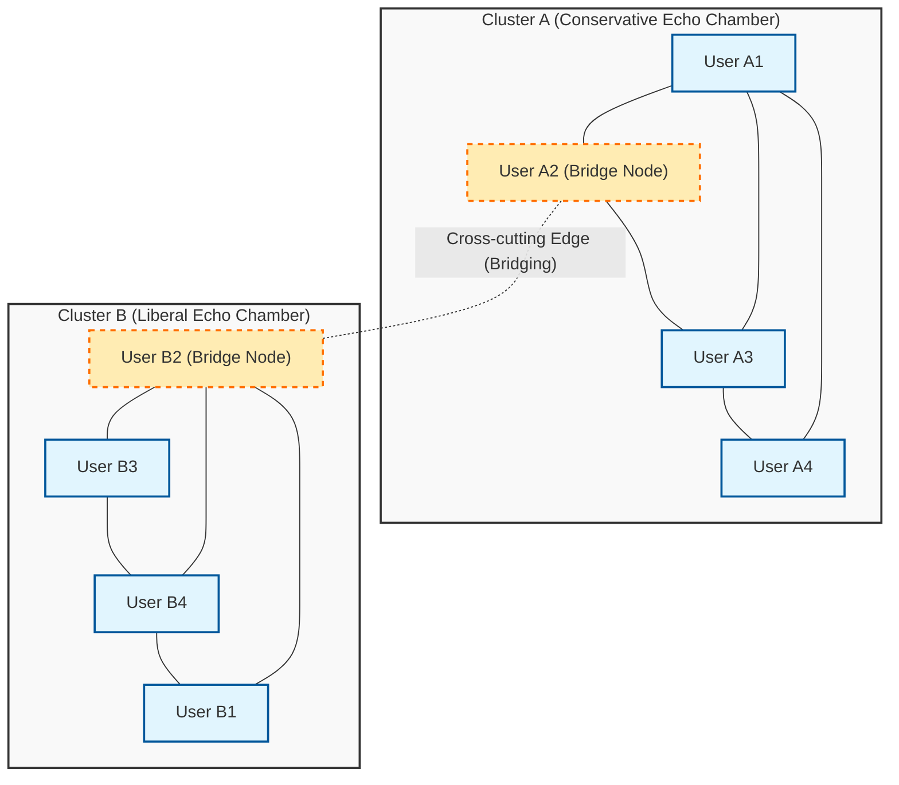
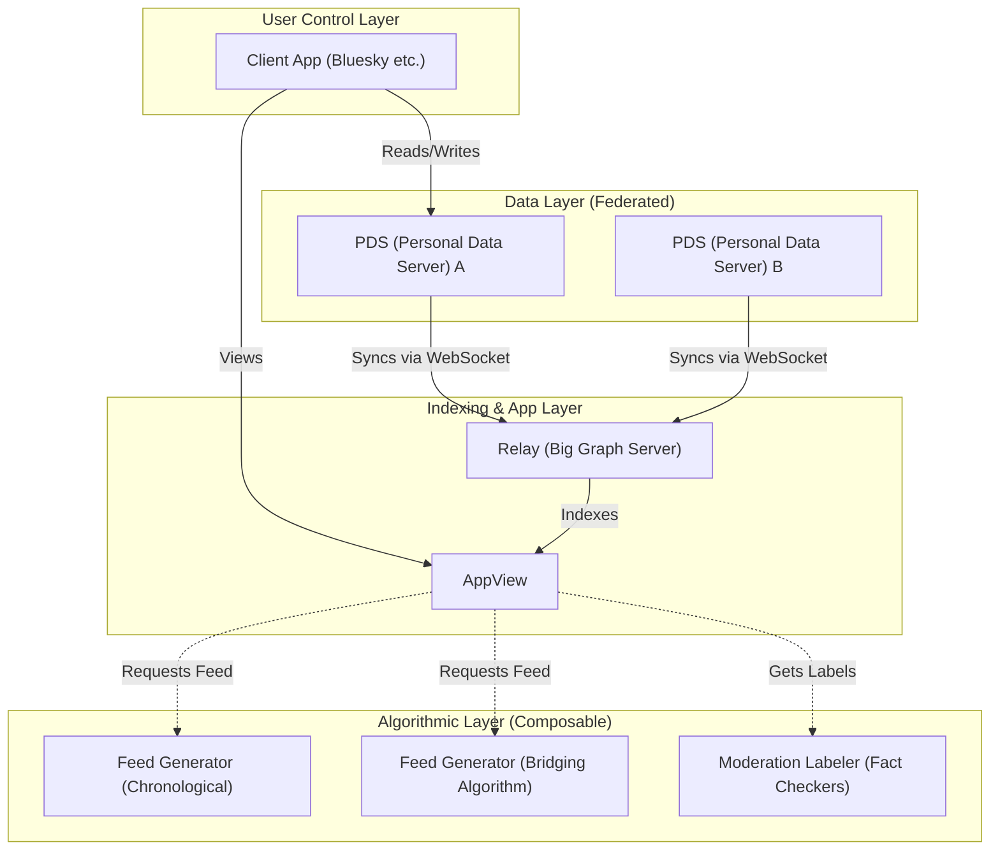

# はじめに：記念すべき100回目の記事によせて

本ブログを立ち上げてから数年、技術的な解説や日々の開発の備忘録、そして時にはテクノロジーと社会の関係性について考察を重ねてきました。そして今回、この記事が記念すべき「第100回目」の投稿となります。ここまで読み続けてくださった読者の皆様には、心より感謝申し上げます。

この100回目という節目にあたり、私がどうしても書き留めておきたかったテーマがあります。それは、「テクノロジーは社会の分断を埋められるか？」という、現代社会における極めて重大かつ本質的な問いです。

初期のインターネット（Web 1.0）は、誰もが自由に情報を発信し、アクセスできる「知識の民主化」のユートピアとして語られました。それに続くソーシャルメディアの時代（Web 2.0）は、世界中の人々を繋ぎ、「フラットな世界」を実現するはずでした。しかし、2026年現在、私たちが直面している現実はどうでしょうか。政治的二極化、陰謀論の蔓延、フェイクニュースの拡散、そして相互理解を拒むような「エコーチェンバー（反響室）」と「フィルターバブル」の形成。テクノロジーは人々を繋ぐどころか、むしろ社会の分断（Social Divide）を加速させる強力なエンジンとなってしまっているように見えます。

私たち技術者は、ただコードを書き、システムを構築するだけの存在ではありません。私たちが設計するアーキテクチャ、選択するアルゴリズム、そして最適化する目的関数（Objective Function）の背後には、社会のあり方を規定する「ルール」が潜んでいます。本稿では、一人の技術者としての視点から、現在の社会的分断がいかにして技術的に生み出されているのかを数学的・ネットワーク理論的に解き明かし、同時にそれを乗り越えるための具体的な技術的アプローチ（ブリッジング・アルゴリズム、分散型SNSプロトコル）について、深く掘り下げて論じたいと思います。

---

# 第1章：ネットワーク理論から見る「エコーチェンバー」の数学的構造

社会の分断を論じる上で、まず避けて通れないのが「ネットワーク理論（Graph Theory）」を用いたコミュニティの構造解析です。ソーシャルメディア上の人間関係は、ユーザーを「ノード（頂点）」、ユーザー間のフォローや相互作用を「エッジ（辺）」とする巨大なグラフとしてモデル化することができます。

分断を特徴づける最も重要な指標の一つが、「クラスタ係数（Clustering Coefficient）」です。あるユーザー $i$ のクラスタ係数 $C_i$ は、ユーザー $i$ の友人同士が互いに友人である確率を示し、以下の数式で定義されます。

$$ C_i = \frac{2e_i}{k_i(k_i - 1)} $$

ここで、$k_i$ はユーザー $i$ の次数（友人の数）、$e_i$ はその $k_i$ 人の友人間に存在する実際のエッジの数です。ソーシャルメディアにおいて、このクラスタ係数が異常に高い局所的なネットワーク（密な部分グラフ）が形成される現象が、いわゆる「エコーチェンバー」の土台となります。

エコーチェンバーが形成される背後には、社会学でいう「ホモフィリー（Homophily：同類結集性）」の原理が働いています。「類は友を呼ぶ」という言葉の通り、人間は自分と似た属性や思想を持つ他者と繋がりやすい傾向があります。これを確率モデルとして表現すると、ユーザー $u$ とユーザー $v$ の間にエッジが形成される確率 $P(u, v)$ は、両者のイデオロギー的な距離 $d(u,v)$ に反比例すると仮定できます。

$$ P(u, v) \propto e^{-\beta \cdot d(u,v)} $$

パラメータ $\beta > 0$ は、ホモフィリーの強さを示す定数です。プラットフォームの推奨アルゴリズムが「ユーザーが好む（＝自分と似た）コンテンツやユーザー」を提示し続けると、この $\beta$ の値が人工的に押し上げられます。結果として、異なるイデオロギーを持つ集団間のエッジ（弱いつながり：Weak Ties）が極端に減少し、ネットワーク全体が互いに孤立した複数のクラスタへと分裂してしまうのです。

以下のMermaid図は、分断されたネットワークと、それを繋ぐブリッジングの概念を視覚化したものです。

このように、アルゴリズムがエンゲージメント（クリック率、滞在時間）のみを最適化する目的関数 $J(\theta) = \sum \log P(\text{engage} | \text{user}, \text{content})$ を採用し続ける限り、システムは局所解（エコーチェンバーの強化）に陥り、全体最適（健全な公共空間の形成）から遠ざかることになります。

---

# 第2章：アルゴリズムによる分極化の加速と情報拡散モデル

エコーチェンバー内で情報がどのように拡散するかを考えるために、感染症の数理モデルである「SIRモデル」を情報拡散に応用してみましょう。
- $S$ (Susceptible) : まだ情報に触れていないユーザー
- $I$ (Infected) : 情報を信じ、拡散しているユーザー
- $R$ (Recovered/Removed) : 情報に対する興味を失った、あるいはフェイクと気づいて拡散をやめたユーザー

情報伝播の微分方程式は以下のように表されます。

$$ \frac{dS}{dt} = -\alpha S I $$
$$ \frac{dI}{dt} = \alpha S I - \gamma I $$
$$ \frac{dR}{dt} = \gamma I $$

ここで、$\alpha$ は「感染率（情報の拡散しやすさ）」、$\gamma$ は「回復率（情報の飽和・忘却）」です。
興味深いのは、怒りや恐怖を煽る極端なコンテンツ（Polarizing Content）は、一般的な情報に比べて $\alpha$ が著しく高いという実証研究があることです。さらに、エコーチェンバー内では反証情報に触れる機会が少ないため、$\gamma$ が極めて低くなります。つまり、アルゴリズムがエンゲージメントを最大化しようとすると、必然的に $\alpha$ が高く $\gamma$ が低いコンテンツ、すなわち「極論やフェイクニュース」を優先的に配信するよう学習してしまうのです。これが、AIが意図せず社会的分断を加速させているメカニズムです。

---

# 第3章：技術的解決策(1) ブリッジング・アルゴリズムとCommunity Notes

では、我々はこの構造的欠陥に対してどのように立ち向かえば良いのでしょうか。第一のアプローチが、「ブリッジング・アルゴリズム（Bridging Algorithm）」の導入です。

エンゲージメントに基づく推奨アルゴリズムが「同質性」を報酬とするならば、ブリッジング・アルゴリズムは「異質性の橋渡し」を報酬とします。その代表的な成功例が、X（旧Twitter）で導入されている「Community Notes（コミュニティノート）」のアルゴリズムです。

Community Notesは、単なる多数決ではありません。多数決であれば、人数の多いエコーチェンバーの意見が常に勝ってしまいます。Community Notesの画期的な点は、「普段は意見が合わない（異なるクラスタに属する）人々が、偶然一致して『役に立つ』と評価したノート」を高く評価する点にあります。

これを実現するために、行列分解（Matrix Factorization）という機械学習の手法が用いられています。ユーザー $u$ がノート $n$ に与える評価（役に立ったか否か）の予測スコア $\hat{r}_{u,n}$ を以下のようにモデル化します。

$$ \hat{r}_{u,n} = \mu + i_u + i_n + \mathbf{f}_u \cdot \mathbf{f}_n $$

- $\mu$ : 全体のベースライン（平均的な評価傾向）
- $i_u$ : ユーザー $u$ の評価バイアス（常に高評価をつける人など）
- $i_n$ : ノート $n$ の一般的な質（誰が見てもわかりやすいか）
- $\mathbf{f}_u$ : ユーザー $u$ の潜在特徴ベクトル（イデオロギー的な立ち位置など）
- $\mathbf{f}_n$ : ノート $n$ の潜在特徴ベクトル

アルゴリズムは、実際の評価データと予測スコアの誤差を最小化するように、各パラメータを学習します。
ここで重要なのは、ノートの最終的な表示判定に使用されるのが、単なる平均評価ではなく、「ノートの一般的な質を示すパラメータ $i_n$」である点です。

もしあるノートが、特定の偏った集団（例えば右派だけ、あるいは左派だけ）から大量の高評価を得た場合、その高評価は潜在ベクトル $\mathbf{f}_u \cdot \mathbf{f}_n$ の項で吸収され、$i_n$ は高くなりません。しかし、右派（$\mathbf{f}_u > 0$）と左派（$\mathbf{f}_u < 0$）の両方から高評価を得た場合、潜在ベクトルの内積だけでは説明がつかなくなり、結果として「このノート自体が普遍的に優れている（$i_n$ が高い）」と学習されるのです。

このような数学的アプローチによって、「エコーチェンバーを越えた合意形成」をアルゴリズム的に発見し、評価することが可能になります。これは社会的分断を埋めるための非常に強力な技術的ブレイクスルーです。

---

# 第4章：技術的解決策(2) 分散型SNSプロトコル（AT Protocol / ActivityPub）

ブリッジング・アルゴリズムは強力ですが、単一の巨大企業（中央集権型プラットフォーム）がアルゴリズムを独占しているという構造的課題は残ります。プラットフォームの経営方針一つで、アルゴリズムはいつでも変更され得ます。

これに対する第二のアプローチが、「分散型SNSプロトコル（Decentralized Social Protocols）」によるアーキテクチャレベルでのパラダイムシフトです。現在、ActivityPub（Mastodon等が採用）や、AT Protocol（Blueskyが採用）が大きな注目を集めています。

特にAT Protocol（Authenticated Transfer Protocol）は、「データとアルゴリズムの分離」という非常に美しい設計思想を持っています。

AT Protocolの最大の功績は、「フィード生成（アルゴリズム）」と「モデレーション（ラベリング）」を、プラットフォーム本体から切り離し、ユーザー自身が自由に選択・組み合わせ可能（Composable）にしたことです（Custom Feeds / Stackable Moderation）。

これまで私たちは、「どのSNSを使うか」を選ぶことはできても、「どのアルゴリズムで情報を浴びるか」を選ぶことはできませんでした。AT Protocolの世界では、ある人は「時系列順」のフィードを選び、ある人は「自分の意見に反論を提供する学術的なフィード」をインストールし、またある人は「不適切な言葉を非表示にする第三者機関のモデレーションラベル」を購読することができます。

暗号技術（DID: Decentralized Identifiers）とデータ構造（Merkle Search Trees: MST）に裏打ちされたこのプロトコルは、ユーザーに「情報の自己決定権」を取り戻させます。アルゴリズムがブラックボックスではなく、オープンな市場で競争・選択されるようになることで、エンゲージメント至上主義のアルゴリズムから、ユーザーの精神的健康や社会の健全性を重視するアルゴリズムへと、インセンティブの構造を転換できる可能性を秘めています。

---

# 第5章：オープンソースの哲学と技術者の社会的責任

ここまで、ネットワーク理論による分析と、それを乗り越えるための具体的な技術（Community Notesの行列分解、AT Protocolの分散アーキテクチャ）について述べてきました。しかし、最終的に社会の分断を埋めるのは、単なるコードや数式ではありません。それを作る「人間の意志と哲学」です。

ソフトウェアエンジニアリングの世界には、「オープンソース（Open Source）」という偉大な文化があります。Linuxから始まり、インターネットを構築する基盤技術のほとんどは、世界中の見知らぬ人々が、イデオロギーや国境を越えて協調し、議論し、コードをマージすることで作り上げられてきました。オープンソースコミュニティは、対立（コンフリクト）を排除するのではなく、それを「プルリクエスト」と「コードレビュー」という形で建設的な合意形成へと昇華させるメカニズムを持っています。

私は、このオープンソースの哲学こそが、分断された現代社会を修復するためのヒントになると信じています。システムを透明化し、アルゴリズムの選択権をユーザーに委ね、多様な価値観が共存できる分散型の公共空間（Public Square）を設計すること。それは、現代のエンジニアに課せられた極めて重要な社会的責任です。

コードは法律であり、アーキテクチャは政治です。私たちが書く1行のコード、定義する1つのAPIエンドポイント、設計するデータベースのスキーマが、数百万、数億のユーザーの認知を形作り、社会の分断を加速させることもあれば、対話を促す橋を架けることもあります。

---

# 結び：100回目の記事を終えて

「テクノロジーは社会の分断を埋められるか？」

この問いに対する私の答えは、「テクノロジー単体では埋められないが、正しく設計されたテクノロジーは、人間が分断を乗り越えるための『足場』になる」というものです。

人間の根源的なバイアス（ホモフィリーや確証バイアス）を完全に消し去ることは不可能です。しかし、エンゲージメントのみを追求するアルゴリズムの暴走を止め、Community Notesのような「橋渡し」を評価する数学的モデルを導入し、AT Protocolのような自律分散型のアーキテクチャによってユーザーに選択権を返すことは可能です。

本ブログは、今回で100回目を迎えました。これまでの記事では、言語の仕様やフレームワークの使い方など、いわゆる「How」に焦点を当ててきました。しかし、AIがコードを自動生成し、あらゆる技術がコモディティ化していくこれからの時代において、我々技術者にとって最も重要なのは「What（何を作るか）」そして「Why（なぜそれを作るのか）」という倫理と哲学の問いです。

テクノロジーは魔法ではありません。それは人間の鏡です。もし社会が分断されているなら、それは私たちの作ったシステムが分断を映し出し、増幅しているからです。だからこそ、システムを書き換えることで、社会のあり方を少しずつ、しかし確実に良い方向へ変えていくことができると私は信じています。

101回目からも、一人の技術者として、コードと社会の交差点に立ち続け、思索を深めていきたいと思います。長文に最後までお付き合いいただき、本当にありがとうございました。未来のネットワークが、私たちを分断する壁ではなく、互いを理解するための橋となることを願って。

（了）

