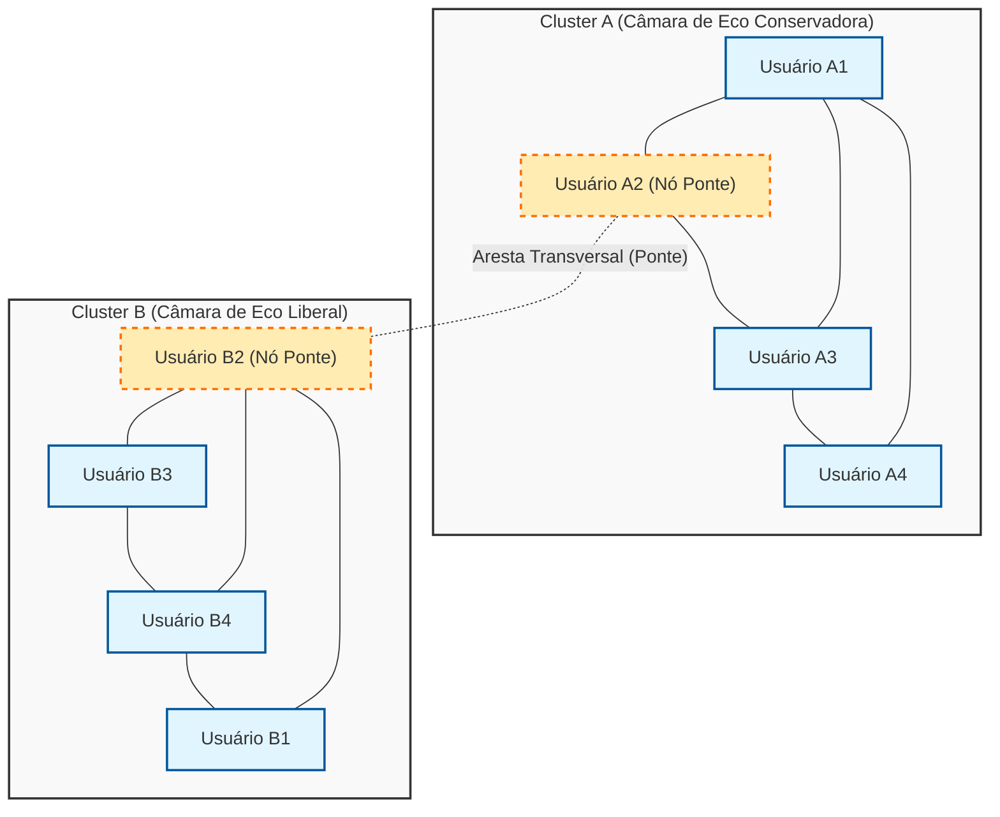
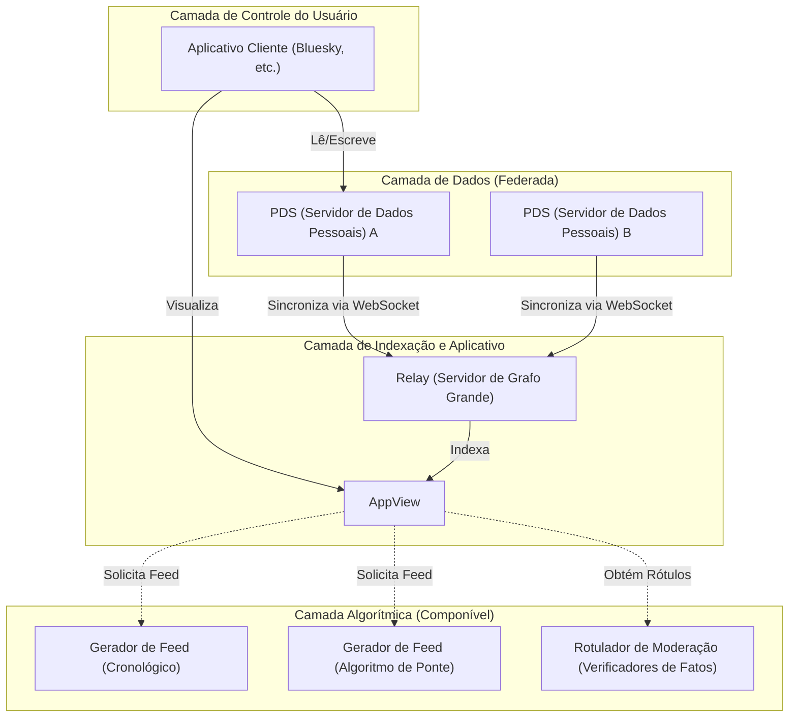

# Introdução: Uma reflexão para comemorar o 100º artigo

Desde a criação deste blog há alguns anos, tenho acumulado reflexões sobre explicações técnicas, notas de desenvolvimento diárias e, ocasionalmente, a relação entre tecnologia e sociedade. E agora, este artigo marca o memorável "100º" post. A todos os leitores que continuaram lendo até aqui, expresso a minha mais profunda gratidão.

Neste marco que é o 100º post, há um tema que eu queria registrar a todo custo. É a pergunta: "A tecnologia pode superar a divisão social?", uma questão extremamente importante e fundamental na sociedade moderna.

A internet em seus primórdios (Web 1.0) foi descrita como uma utopia de "democratização do conhecimento", onde qualquer um poderia publicar e acessar informações livremente. A era das mídias sociais que se seguiu (Web 2.0) deveria ter conectado pessoas ao redor do mundo e realizado um "mundo plano". No entanto, em 2026, qual é a realidade que enfrentamos? Polarização política, a disseminação de teorias da conspiração, a propagação de notícias falsas e a formação de "câmaras de eco" (Echo Chambers) e "bolhas de filtro" que recusam a compreensão mútua. Longe de conectar as pessoas, a tecnologia parece ter se tornado um motor poderoso que acelera a divisão social (Social Divide).

Nós, engenheiros, não somos apenas seres que escrevem códigos e constroem sistemas. Por trás das arquiteturas que projetamos, dos algoritmos que selecionamos e das funções objetivo (Objective Functions) que otimizamos, escondem-se "regras" que definem como a sociedade deve ser. Neste artigo, a partir da perspectiva de um único engenheiro, gostaria de desvendar matemática e teoricamente (através da teoria das redes) como a atual divisão social está sendo criada tecnologicamente e, ao mesmo tempo, discutir profundamente abordagens tecnológicas específicas (algoritmos de ponte, protocolos descentralizados de redes sociais) para superá-la.

---

# Capítulo 1: A estrutura matemática das "câmaras de eco" sob a ótica da teoria das redes

Ao discutir a divisão social, o primeiro passo inevitável é a análise da estrutura da comunidade usando a "[Teoria dos Grafos](/pt/p/graph-theory-dijkstra-a-star/)" ([Graph Theory](https://kenji.blog/pt/p/graph-theory-dijkstra-a-star/)). As relações humanas nas mídias sociais podem ser modeladas como um grafo gigantesco, onde os usuários são "nós" (vértices) e as interações ou o ato de seguir entre usuários são "arestas" (bordas).

Um dos indicadores mais importantes que caracterizam a divisão é o "Coeficiente de Aglomeração" (Clustering Coefficient). O coeficiente de aglomeração $C_i$ de um usuário $i$ indica a probabilidade de que os amigos do usuário $i$ também sejam amigos entre si, e é definido pela seguinte fórmula:

$$ C_i = \frac{2e_i}{k_i(k_i - 1)} $$

Aqui, $k_i$ é o grau do usuário $i$ (número de amigos), e $e_i$ é o número de arestas reais existentes entre esses $k_i$ amigos. Nas mídias sociais, o fenômeno em que redes locais (subgrafos densos) se formam com coeficientes de aglomeração anormalmente altos torna-se a base para o que chamamos de "câmara de eco".

Por trás da formação das câmaras de eco, opera o princípio sociológico da "homofilia" (Homophily: agregação de semelhantes). Como diz o ditado "pássaros da mesma plumagem voam juntos", os seres humanos tendem a se conectar com outras pessoas que têm atributos e ideologias semelhantes. Expressando isso como um modelo probabilístico, podemos assumir que a probabilidade $P(u, v)$ de uma aresta se formar entre o usuário $u$ e o usuário $v$ é inversamente proporcional à distância ideológica $d(u,v)$ entre os dois.

$$ P(u, v) \propto e^{-\beta \cdot d(u,v)} $$

O parâmetro $\beta > 0$ é uma constante que indica a força da homofilia. Quando os algoritmos de recomendação da plataforma continuam apresentando "conteúdos e usuários que o usuário prefere (= semelhantes a ele)", o valor desse $\beta$ é artificialmente inflado. Como resultado, as arestas (laços fracos: Weak Ties) entre grupos com ideologias diferentes diminuem drasticamente, e a rede como um todo se fragmenta em múltiplos clusters isolados uns dos outros.

O diagrama Mermaid abaixo visualiza o conceito de uma rede dividida e a ponte (bridging) que a conecta.

Dessa forma, enquanto o algoritmo continuar adotando uma função objetivo $J(\theta) = \sum \log P(\text{engage} | \text{user}, \text{content})$ que otimiza apenas o engajamento (taxa de cliques, tempo de permanência), o sistema cairá em uma solução local (fortalecimento das câmaras de eco) e se distanciará da otimização global (formação de um espaço público saudável).

---

# Capítulo 2: Aceleração da polarização por algoritmos e o modelo de difusão de informações

Para entender como a informação se difunde dentro de uma câmara de eco, vamos aplicar o modelo matemático de doenças infecciosas, o "Modelo SIR", à difusão de informações.
- $S$ (Susceptible) : Usuários que ainda não foram expostos à informação
- $I$ (Infected) : Usuários que acreditam na informação e a estão espalhando
- $R$ (Recovered/Removed) : Usuários que perderam o interesse na informação, ou que perceberam que é falsa e pararam de espalhá-la

As equações diferenciais de propagação de informação são expressas da seguinte forma:

$$ \frac{dS}{dt} = -\alpha S I $$
$$ \frac{dI}{dt} = \alpha S I - \gamma I $$
$$ \frac{dR}{dt} = \gamma I $$

Aqui, $\alpha$ é a "taxa de infecção (facilidade de difusão da informação)", e $\gamma$ é a "taxa de recuperação (saturação/esquecimento da informação)".
O interessante é que estudos empíricos mostram que conteúdos extremos (Polarizing Content) que incitam raiva ou medo têm um $\alpha$ significativamente mais alto do que as informações em geral. Além disso, dentro de uma câmara de eco, como há poucas oportunidades de entrar em contato com informações contraditórias, $\gamma$ torna-se extremamente baixo. Em outras palavras, quando um algoritmo tenta maximizar o engajamento, ele inevitavelmente aprende a priorizar a entrega de conteúdos com um $\alpha$ alto e um $\gamma$ baixo, ou seja, "opiniões extremas e notícias falsas". Este é o mecanismo pelo qual a IA está, sem intenção, acelerando a divisão social.

---

# Capítulo 3: Solução Tecnológica (1) Algoritmos de Ponte e Notas da Comunidade

Então, como devemos enfrentar essa falha estrutural? A primeira abordagem é a introdução de "Algoritmos de Ponte" (Bridging Algorithms).

Se um algoritmo de recomendação baseado em engajamento recompensa a "homogeneidade", um algoritmo de ponte recompensa a "construção de pontes entre a heterogeneidade". Um exemplo representativo de sucesso disso é o algoritmo de "Notas da Comunidade" (Community Notes) introduzido no X (antigo Twitter).

As Notas da Comunidade não são um simples voto da maioria. Se fosse pela maioria, a opinião da câmara de eco com o maior número de pessoas sempre venceria. O ponto revolucionário das Notas da Comunidade é que elas valorizam muito as "notas que pessoas que normalmente discordam (pertencentes a clusters diferentes) coincidentemente avaliaram como 'úteis'".

Para alcançar isso, utiliza-se uma técnica de aprendizado de máquina chamada "Fatoração de Matrizes" (Matrix Factorization). O escore previsto $\hat{r}_{u,n}$ para a avaliação (se foi útil ou não) que o usuário $u$ dá à nota $n$ é modelado da seguinte forma:

$$ \hat{r}_{u,n} = \mu + i_u + i_n + \mathbf{f}_u \cdot \mathbf{f}_n $$

- $\mu$ : Linha de base geral (tendência média de avaliação)
- $i_u$ : Viés de avaliação do usuário $u$ (como alguém que sempre dá avaliações altas)
- $i_n$ : Qualidade geral da nota $n$ (se é fácil de entender para qualquer pessoa)
- $\mathbf{f}_u$ : Vetor de características latentes do usuário $u$ (como a posição ideológica)
- $\mathbf{f}_n$ : Vetor de características latentes da nota $n$

O algoritmo aprende os parâmetros para minimizar o erro entre os dados de avaliação reais e as pontuações previstas.
O que é importante aqui é que o que é usado para a determinação final da exibição da nota não é uma simples avaliação média, mas "o parâmetro $i_n$ que indica a qualidade geral da nota".

Se uma nota recebe um grande número de avaliações altas de um grupo enviesado específico (por exemplo, apenas da direita ou apenas da esquerda), essas avaliações altas são absorvidas pelo termo do vetor latente $\mathbf{f}_u \cdot \mathbf{f}_n$, e $i_n$ não aumenta. No entanto, se recebe avaliações altas tanto da direita ($\mathbf{f}_u > 0$) quanto da esquerda ($\mathbf{f}_u < 0$), isso já não pode ser explicado apenas pelo produto escalar dos vetores latentes e, como resultado, aprende-se que "esta nota em si é universalmente excelente (tem um alto $i_n$)".

Essa abordagem matemática torna possível descobrir e avaliar algoritmicamente a "construção de consenso que transcende as câmaras de eco". Este é um avanço tecnológico extremamente poderoso para superar a divisão social.

---

# Capítulo 4: Solução Tecnológica (2) Protocolos Descentralizados de Redes Sociais (AT Protocol / ActivityPub)

Os algoritmos de ponte são poderosos, mas o problema estrutural de uma única gigante (plataforma centralizada) monopolizar os algoritmos permanece. Dependendo de uma simples diretriz de gestão da plataforma, o algoritmo pode ser alterado a qualquer momento.

A segunda abordagem para isso é uma mudança de paradigma em nível de arquitetura por meio de "Protocolos Descentralizados de Redes Sociais" (Decentralized Social Protocols). Atualmente, o ActivityPub (adotado pelo Mastodon e outros) e o AT Protocol (adotado pelo Bluesky) estão atraindo grande atenção.

O AT Protocol (Authenticated Transfer Protocol), em particular, possui uma filosofia de design muito bonita de "separação entre dados e algoritmos".

A maior conquista do AT Protocol é ter separado a "geração de feeds (algoritmo)" e a "moderação (rotulagem)" da própria plataforma, tornando-as passíveis de serem escolhidas e combinadas livremente (Composable) pelos próprios usuários (Custom Feeds / Stackable Moderation).

Até agora, podíamos escolher "qual rede social usar", mas não podíamos escolher "com qual algoritmo seríamos bombardeados de informações". No mundo do AT Protocol, uma pessoa pode escolher um feed "em ordem cronológica", outra pode instalar um "feed acadêmico que oferece refutações às suas opiniões", e ainda outra pode se inscrever em um "rótulo de moderação de uma agência terceirizada que oculta palavras inadequadas".

Este protocolo, apoiado por criptografia (DID: Decentralized Identifiers) e estruturas de dados (Merkle Search Trees: MST), devolve aos usuários o "direito à autodeterminação da informação". Ao permitir que os algoritmos sejam não mais caixas-pretas, mas entrem em concorrência e sejam selecionados em um mercado aberto, ele tem o potencial de transformar a estrutura de incentivos de algoritmos baseados na supremacia do engajamento para algoritmos que valorizam a saúde mental do usuário e a saúde da sociedade.

---

# Capítulo 5: A Filosofia do Código Aberto e a Responsabilidade Social dos Engenheiros

Até aqui, discuti a análise por meio da teoria das redes e as tecnologias específicas para superá-la (fatoração de matrizes das Notas da Comunidade, arquitetura descentralizada do AT Protocol). No entanto, o que acabará unindo a sociedade dividida não são apenas códigos ou fórmulas matemáticas. É "a vontade e a filosofia humanas" que os criam.

No mundo da engenharia de software, existe a grande cultura do "Código Aberto" (Open Source). Começando pelo Linux, a maioria das tecnologias fundamentais que constroem a Internet foram criadas por estranhos ao redor do mundo, superando ideologias e fronteiras, colaborando, discutindo e fundindo (merging) códigos. A comunidade de código aberto tem o mecanismo de não eliminar os conflitos (conflicts), mas elevá-los a uma construção construtiva de consenso por meio de "Pull Requests" e "Code Reviews".

Acredito que é exatamente essa filosofia de código aberto que servirá de pista para reparar nossa moderna sociedade fragmentada. Tornar os sistemas transparentes, confiar a escolha de algoritmos aos usuários e projetar uma praça pública descentralizada (Public Square) onde valores diversos possam coexistir. Essa é uma responsabilidade social de extrema importância imposta aos engenheiros de hoje.

Código é lei, e arquitetura é política. Uma única linha de código que escrevemos, um único endpoint de API que definimos, o esquema de banco de dados que projetamos moldam a cognição de milhões, centenas de milhões de usuários, e podem tanto acelerar a divisão social quanto construir pontes que incentivam o diálogo.

---

# Conclusão: Após o 100º Artigo

"A tecnologia pode superar a divisão social?"

A minha resposta a esta pergunta é: "A tecnologia por si só não pode superá-la, mas a tecnologia projetada corretamente será o 'andaime' para os humanos superarem essa divisão."

É impossível apagar completamente os vieses fundamentais humanos (homofilia e viés de confirmação). No entanto, é possível parar a corrida descontrolada de algoritmos que buscam apenas o engajamento, introduzir modelos matemáticos que valorizam as "pontes" como as Notas da Comunidade, e devolver aos usuários o poder de escolha através de arquiteturas autônomas descentralizadas como o AT Protocol.

Este blog chega hoje ao seu 100º post. Nos artigos anteriores, concentrei-me no chamado "How" (como), como especificações de linguagem e como usar frameworks. Contudo, nesta nova era em que a IA gera códigos automaticamente e todas as tecnologias são comoditizadas, o mais importante para nós, engenheiros, é a questão ética e filosófica do "What" (o que construir) e do "Why" (por que construir).

A tecnologia não é mágica. Ela é um espelho humano. Se a sociedade está dividida, é porque os sistemas que criamos estão refletindo e amplificando essa divisão. É por isso que acredito que, ao reescrever os sistemas, podemos mudar gradualmente, mas com certeza, o curso da sociedade para melhor.

A partir do 101º post, continuarei a me posicionar na interseção entre o código e a sociedade, como um simples engenheiro, aprofundando minhas reflexões. Muito obrigado por me acompanhar neste longo texto até o fim. Espero que a rede do futuro não seja um muro que nos divide, mas uma ponte para nos entendermos.

(Fim)

