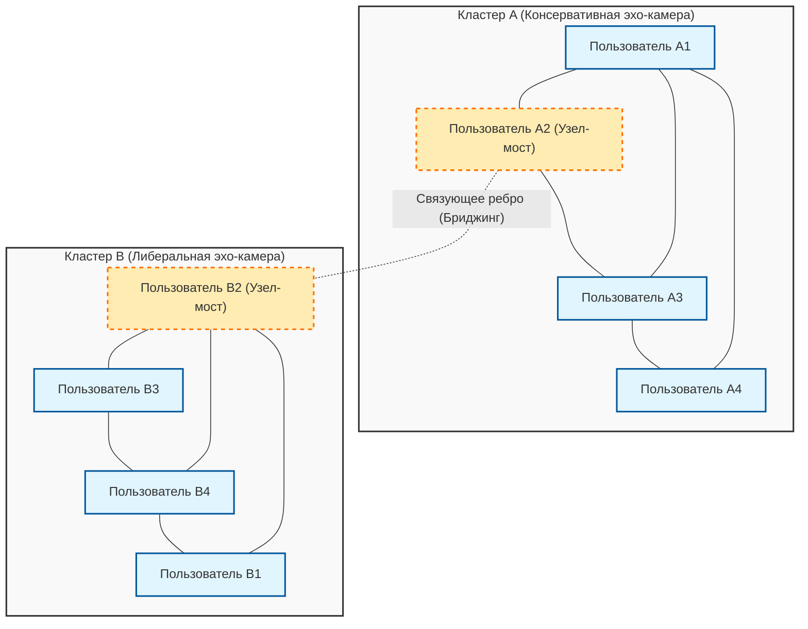
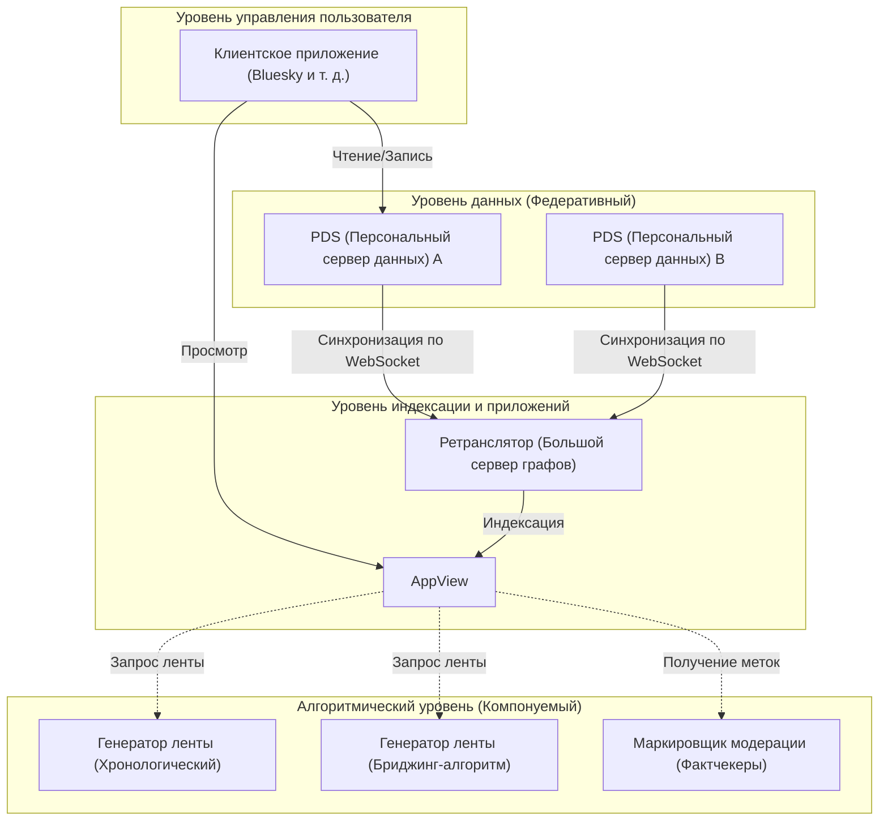

# Введение: К 100-й юбилейной статье

За несколько лет с момента запуска этого блога я накопил множество технических пояснений, повседневных заметок о разработке, а иногда и размышлений о взаимосвязи между технологиями и обществом. И вот этот пост стал юбилейным, «100-м». Я хочу выразить искреннюю благодарность всем читателям, которые продолжают меня читать.

К этому 100-му рубежу я подошел с темой, о которой мне непременно хотелось написать. Это чрезвычайно важный и фундаментальный вопрос в современном обществе: «Могут ли технологии преодолеть социальный раскол?»

Ранний интернет (Web 1.0) воспринимался как утопия «демократизации знаний», где каждый мог свободно публиковать информацию и получать к ней доступ. Последующая эпоха социальных сетей (Web 2.0) должна была объединить людей по всему миру и создать «плоский мир». Однако какова реальность, с которой мы сталкиваемся в 2026 году? Политическая поляризация, распространение теорий заговора, фейковых новостей и формирование «эхо-камер» и «пузырей фильтров», отвергающих взаимопонимание. Кажется, что технологии не только не объединяют людей, но, напротив, стали мощным двигателем, ускоряющим социальный раскол (Social Divide).

Мы, инженеры, — это не просто те, кто пишет код и создает системы. За архитектурой, которую мы проектируем, алгоритмами, которые мы выбираем, и целевыми функциями (Objective Function), которые мы оптимизируем, скрываются «правила», определяющие то, каким должно быть общество. В этой статье, с точки зрения инженера, я хотел бы глубоко рассмотреть, как с помощью математики и теории сетей создается нынешний социальный раскол, и одновременно обсудить конкретные технические подходы (бриджинг-алгоритмы, децентрализованные протоколы социальных сетей) для его преодоления.

---

# Глава 1: Математическая структура «эхо-камеры» с точки зрения теории сетей

При обсуждении социального раскола невозможно обойти стороной структурный анализ сообществ с использованием «теории сетей» (Graph Theory). Человеческие отношения в социальных сетях можно смоделировать как гигантский граф, где пользователи являются «узлами» (вершинами), а подписки или взаимодействия между ними — «ребрами» (связями).

Одним из наиболее важных показателей, характеризующих раскол, является «коэффициент кластеризации» (Clustering Coefficient). Коэффициент кластеризации $C_i$ пользователя $i$ показывает вероятность того, что друзья пользователя $i$ также являются друзьями между собой, и определяется следующей формулой:

$$ C_i = \frac{2e_i}{k_i(k_i - 1)} $$

Здесь $k_i$ — степень пользователя $i$ (количество друзей), а $e_i$ — фактическое количество ребер, существующих между этими $k_i$ друзьями. Явление, при котором в социальных сетях формируются локальные сети (плотные подграфы) с аномально высоким коэффициентом кластеризации, становится фундаментом для так называемых «эхо-камер».

За формированием эхо-камер стоит социологический принцип «гомофилии» (Homophily: объединение подобных). Как гласит пословица «рыбак рыбака видит издалека», люди склонны связываться с другими людьми, имеющими схожие атрибуты или взгляды. Если выразить это через вероятностную модель, можно предположить, что вероятность $P(u, v)$ формирования ребра между пользователем $u$ и пользователем $v$ обратно пропорциональна их идеологическому расстоянию $d(u,v)$.

$$ P(u, v) \propto e^{-\beta \cdot d(u,v)} $$

Параметр $\beta > 0$ — это константа, показывающая силу гомофилии. Когда рекомендательные алгоритмы платформы продолжают предлагать «контент и пользователей, которые нравятся пользователю (то есть похожих на него)», значение этого $\beta$ искусственно завышается. В результате количество ребер (слабых связей: Weak Ties) между группами с разной идеологией резко сокращается, и вся сеть распадается на множество изолированных друг от друга кластеров.

Следующая диаграмма Mermaid визуализирует концепцию разделенной сети и объединяющего их моста (Bridging).

Таким образом, до тех пор, пока алгоритмы продолжают использовать целевую функцию $J(\theta) = \sum \log P(\text{engage} | \text{user}, \text{content})$, оптимизирующую только вовлеченность (кликабельность, время пребывания на сайте), система будет застревать в локальном оптимуме (усиление эхо-камер) и отдаляться от глобального оптимума (формирование здорового общественного пространства).

---

# Глава 2: Ускорение поляризации алгоритмами и модель распространения информации

Чтобы понять, как информация распространяется внутри эхо-камеры, давайте применим математическую модель инфекционных заболеваний, «модель SIR», к распространению информации.
- $S$ (Susceptible) : Пользователи, еще не контактировавшие с информацией
- $I$ (Infected) : Пользователи, поверившие в информацию и распространяющие ее
- $R$ (Recovered/Removed) : Пользователи, потерявшие интерес к информации, или те, кто понял, что это фейк, и прекратил распространение

Дифференциальные уравнения распространения информации выглядят следующим образом:

$$ \frac{dS}{dt} = -\alpha S I $$
$$ \frac{dI}{dt} = \alpha S I - \gamma I $$
$$ \frac{dR}{dt} = \gamma I $$

Здесь $\alpha$ — «коэффициент заражения» (легкость распространения информации), а $\gamma$ — «коэффициент выздоровления» (насыщение/забывание информации).
Интересно, что существуют эмпирические исследования, показывающие, что поляризующий контент (Polarizing Content), разжигающий гнев и страх, имеет значительно более высокий коэффициент $\alpha$ по сравнению с обычной информацией. Более того, поскольку внутри эхо-камеры мало возможностей столкнуться с опровергающей информацией, $\gamma$ становится крайне низким. Другими словами, когда алгоритм пытается максимизировать вовлеченность, он неизбежно учится отдавать приоритет контенту с высоким $\alpha$ и низким $\gamma$, то есть «радикальным мнениям и фейковым новостям». Именно этот механизм непреднамеренно ускоряет социальный раскол с помощью ИИ.

---

# Глава 3: Техническое решение (1) Бриджинг-алгоритмы и Community Notes

Итак, как же нам противостоять этому структурному дефекту? Первый подход — внедрение «бриджинг-алгоритмов» (Bridging Algorithm).

Если рекомендательные алгоритмы, основанные на вовлеченности, вознаграждают за «гомогенность», то бриджинг-алгоритмы вознаграждают за «наведение мостов между гетерогенностью». Ярким примером успеха является алгоритм «Community Notes» (Заметки сообщества), внедренный в X (ранее Twitter).

Community Notes — это не просто голосование большинством. При голосовании большинством всегда побеждало бы мнение более многочисленной эхо-камеры. Инновационность Community Notes заключается в том, что высоко оцениваются те заметки, которые «люди, обычно не согласные друг с другом (принадлежащие к разным кластерам), случайным образом сочли полезными».

Для реализации этого используется метод машинного обучения, называемый матричной факторизацией (Matrix Factorization). Прогнозируемая оценка $\hat{r}_{u,n}$ того, посчитает ли пользователь $u$ заметку $n$ полезной (полезно или нет), моделируется следующим образом:

$$ \hat{r}_{u,n} = \mu + i_u + i_n + \mathbf{f}_u \cdot \mathbf{f}_n $$

- $\mu$ : Общий базовый уровень (средняя тенденция оценивания)
- $i_u$ : Систематическая ошибка оценивания пользователя $u$ (например, человек, который всегда ставит высокие оценки)
- $i_n$ : Общее качество заметки $n$ (понятно ли она всем)
- $\mathbf{f}_u$ : Вектор скрытых признаков пользователя $u$ (идеологическая позиция и т. д.)
- $\mathbf{f}_n$ : Вектор скрытых признаков заметки $n$

Алгоритм обучает каждый параметр, чтобы минимизировать ошибку между фактическими данными об оценках и прогнозируемыми оценками.
Здесь важно то, что для определения окончательного отображения заметки используется не просто средняя оценка, а «параметр $i_n$, показывающий общее качество заметки».

Если определенная заметка получает большое количество высоких оценок от специфической предвзятой группы (например, только от правых или только от левых), эти высокие оценки поглощаются членом вектора скрытых признаков $\mathbf{f}_u \cdot \mathbf{f}_n$, и $i_n$ не становится высоким. Однако, если заметка получает высокие оценки как от правых ($\mathbf{f}_u > 0$), так и от левых ($\mathbf{f}_u < 0$), это уже невозможно объяснить одним лишь скалярным произведением векторов скрытых признаков, и в результате система усваивает, что «сама по себе эта заметка универсально превосходна ($i_n$ высок)».

Благодаря такому математическому подходу алгоритмически становится возможным обнаруживать и оценивать «формирование консенсуса, выходящего за пределы эхо-камеры». Это невероятно мощный технологический прорыв в преодолении социального раскола.

---

# Глава 4: Техническое решение (2) Децентрализованные протоколы социальных сетей (AT Protocol / ActivityPub)

Бриджинг-алгоритмы сильны, но структурная проблема монополизации алгоритмов одной гигантской корпорацией (централизованной платформой) остается. Алгоритм может быть изменен в любой момент решением руководства платформы.

Второй подход к этому — сдвиг парадигмы на уровне архитектуры с помощью «децентрализованных протоколов социальных сетей» (Decentralized Social Protocols). В настоящее время большое внимание привлекают ActivityPub (используется Mastodon и др.) и AT Protocol (используется Bluesky).

В частности, AT Protocol (Authenticated Transfer Protocol) обладает очень красивой философией проектирования, заключающейся в «разделении данных и алгоритмов».

Величайшим достижением AT Protocol является то, что он отделил «генерацию ленты (алгоритм)» и «модерацию (маркировку)» от самой платформы, позволив пользователям свободно выбирать и комбинировать их (Composable) (Custom Feeds / Stackable Moderation).

До сих пор мы могли выбирать «какую социальную сеть использовать», но не «какой алгоритм будет формировать наш информационный поток». В мире AT Protocol кто-то выберет «хронологическую» ленту, кто-то установит «академическую ленту, предлагающую контраргументы к собственному мнению», а кто-то подпишется на «метки модерации сторонней организации, скрывающие неподобающие слова».

Этот протокол, опирающийся на криптографические технологии (DID: Decentralized Identifiers) и структуры данных (Merkle Search Trees: MST), возвращает пользователям «право на самоопределение в отношении информации». Когда алгоритмы перестают быть «черным ящиком», а конкурируют и выбираются на открытом рынке, появляется потенциал изменить структуру стимулов от алгоритмов, стремящихся исключительно к максимальной вовлеченности, к алгоритмам, в приоритете у которых психическое здоровье пользователей и благополучие общества.

---

# Глава 5: Философия открытого исходного кода и социальная ответственность инженеров

До сих пор я говорил об анализе с точки зрения теории сетей и конкретных технологиях для преодоления проблем (матричная факторизация в Community Notes, децентрализованная архитектура AT Protocol). Однако в конечном счете социальный раскол преодолевают не просто код или формулы. Его преодолевают «человеческая воля и философия», которые их создают.

В мире разработки программного обеспечения существует великая культура «открытого исходного кода» (Open Source). Начиная с Linux, большинство базовых технологий, на которых построен интернет, создавались незнакомыми людьми со всего мира, сотрудничающими, спорящими и объединяющими свой код поверх идеологических барьеров и государственных границ. Сообщество открытого исходного кода обладает механизмом не устранения конфликтов, а сублимации их в конструктивный поиск консенсуса в форме «пулл-реквестов» и «ревью кода».

Я верю, что именно эта философия открытого исходного кода станет ключом к исцелению нашего разделенного современного общества. Сделать системы прозрачными, предоставить пользователям право выбора алгоритмов и спроектировать децентрализованное публичное пространство (Public Square), где могут сосуществовать различные ценности. Это чрезвычайно важная социальная ответственность, возложенная на современных инженеров.

Код — это закон, а архитектура — это политика. Одна строка кода, которую мы пишем, один API-эндпоинт, который мы определяем, или схема базы данных, которую мы проектируем, формируют восприятие миллионов и сотен миллионов пользователей и могут как ускорять социальный раскол, так и строить мосты для диалога.

---

# Заключение: Завершая 100-ю статью

«Могут ли технологии преодолеть социальный раскол?»

Мой ответ на этот вопрос таков: «Сами по себе технологии не могут его преодолеть, но правильно спроектированные технологии станут 'опорой', чтобы люди могли преодолеть этот раскол».

Невозможно полностью устранить фундаментальные человеческие предрассудки (гомофилию и склонность к подтверждению своей точки зрения). Тем не менее, возможно остановить алгоритмы, бесконтрольно стремящиеся только к вовлеченности, внедрить математические модели, поощряющие «наведение мостов», подобные Community Notes, и вернуть право выбора пользователям с помощью автономных децентрализованных архитектур, таких как AT Protocol.

Сегодня в этом блоге выходит 100-я статья. В предыдущих статьях мы фокусировались на вопросах «как», таких как спецификации языков программирования и способы использования фреймворков. Однако в наступающую эпоху, когда ИИ автоматически генерирует код, а любые технологии становятся общедоступными (комодитизация), наиболее важным для нас, инженеров, становятся этические и философские вопросы «что (мы создаем)» и «почему (мы это создаем)».

Технология — это не магия. Это зеркало человечества. Если общество расколото, то это потому, что системы, которые мы создаем, отражают и усиливают этот раскол. Именно поэтому я верю, что, переписывая системы, мы сможем постепенно, но верно изменить общество в лучшую сторону.

Начиная со 101-й статьи, я хочу продолжить стоять на пересечении кода и общества как инженер и углублять свои размышления. Огромное спасибо за то, что дочитали этот длинный текст до конца. Я надеюсь, что сети будущего станут не стенами, разделяющими нас, а мостами для взаимопонимания.

(Конец)

