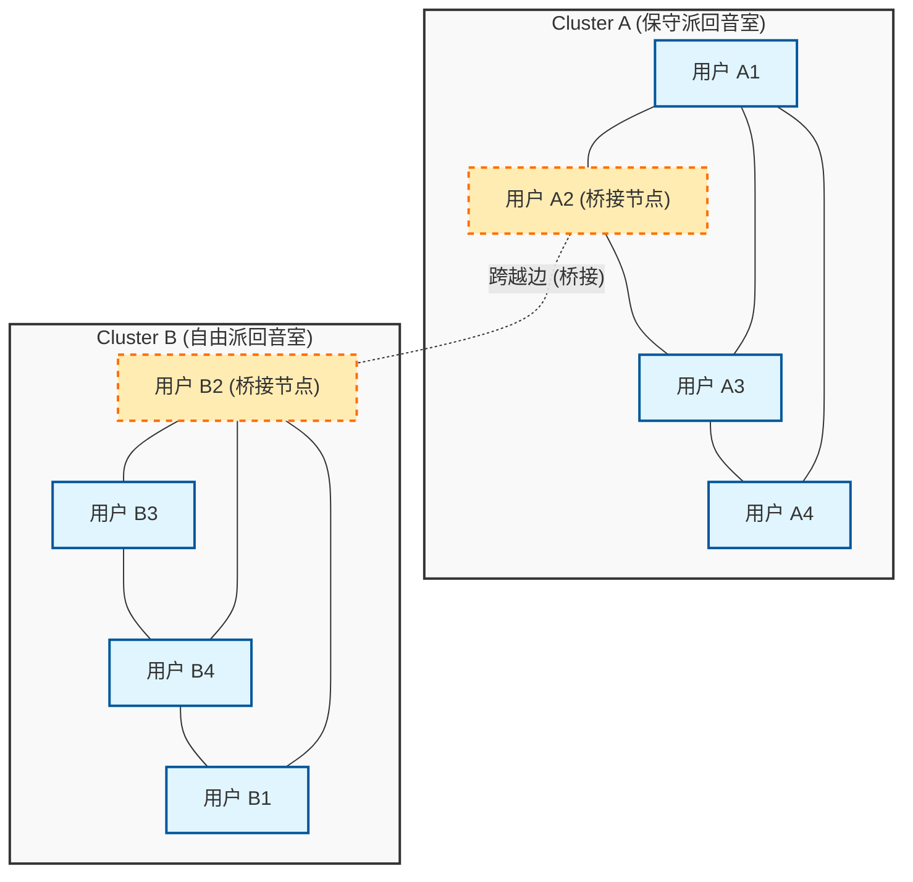
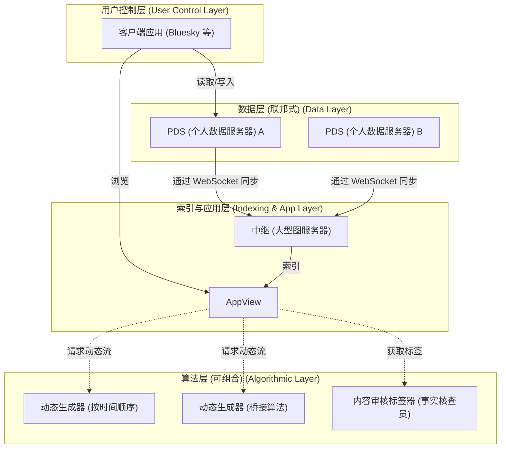

# 引言：写在值得纪念的第100篇文章之际

自本博客创立以来的几年里，我不断地撰写技术解说、日常开发的备忘录，有时也会对技术与社会的关系进行深入的思考。而这次，这篇文章将是值得纪念的“第100篇”文章。对于一直阅读到这里的读者们，我表示由衷的感谢。

在这个第100篇的节点上，有一个我无论如何都想记录下来的主题。那就是，“技术能否弥合社会分歧？”这是现代社会中一个极其重大且本质的问题。

早期的互联网（Web 1.0）被描述为“知识民主化”的乌托邦，任何人都可以自由地发布和获取信息。随后的社交媒体时代（Web 2.0）本应连接世界各地的人们，实现一个“扁平的世界”。然而，到了2026年的今天，我们所面临的现实又是如何呢？政治两极分化、阴谋论的蔓延、假新闻的扩散，以及拒绝相互理解的“回音室（Echo Chamber）”和“过滤气泡（Filter Bubble）”的形成。技术不仅没有连接人们，反而似乎成了加速社会分歧（Social Divide）的强大引擎。

我们技术人员并不仅仅是编写代码、构建系统的人。我们设计的架构、选择的算法，以及优化的目标函数（Objective Function）背后，潜藏着规定社会形态的“规则”。本文中，我将从一名技术人员的视角出发，运用数学和网络理论，揭示当前社会分歧是如何在技术上被制造出来的，同时深入探讨克服这一问题的具体技术途径（桥接算法、去中心化社交协议）。

---

# 第一章：从网络理论看“回音室”的数学结构

在探讨社会分歧时，首先无法避开的是使用“网络理论（Graph Theory）”对社区结构进行的分析。社交媒体上的人际关系可以被建模为一个巨大的图，其中用户是“节点（Node）”，用户之间的关注和互动是“边（Edge）”。

特征化分歧的最重要指标之一是“聚类系数（Clustering Coefficient）”。某个用户 $i$ 的聚类系数 $C_i$ 表示用户 $i$ 的朋友们彼此之间也是朋友的概率，由以下公式定义：

$$ C_i = \frac{2e_i}{k_i(k_i - 1)} $$

这里，$k_i$ 是用户 $i$ 的度（朋友的数量），$e_i$ 是这 $k_i$ 个朋友之间实际存在的边的数量。在社交媒体中，这种聚类系数异常高的局部网络（密集的子图）的形成现象，便构成了所谓“回音室”的基础。

在回音室形成的背后，起作用的是社会学中的“同质性（Homophily：物以类聚）”原理。正如“物以类聚”这句话所说，人们倾向于与自己具有相似属性或思想的他人建立联系。如果将其表达为概率模型，可以假设用户 $u$ 和用户 $v$ 之间形成边 $P(u, v)$ 的概率，与两人在意识形态上的距离 $d(u,v)$ 成反比：

$$ P(u, v) \propto e^{-\beta \cdot d(u,v)} $$

参数 $\beta > 0$ 是表示同质性强度的常数。当平台的推荐算法持续推荐“用户喜欢的（=与自己相似的）内容和用户”时，这个 $\beta$ 的值就会被人为地推高。结果，具有不同意识形态的群体之间的边（弱关系：Weak Ties）会急剧减少，整个网络就会分裂成多个互不相连、孤立的聚类。

下面的Mermaid图可视化了分化的网络以及连接它们的桥接概念：

就这样，只要算法继续采用仅优化用户参与度（点击率、停留时间）的目标函数 $J(\theta) = \sum \log P(\text{engage} | \text{user}, \text{content})$，系统就会陷入局部最优解（强化回音室），从而远离全局最优（形成健康的公共空间）。

---

# 第二章：算法对极化的加速与信息传播模型

为了思考信息在回音室中是如何传播的，我们尝试将传染病的数学模型“SIR模型”应用到信息传播中。
- $S$ (Susceptible) : 尚未接触到信息的用户
- $I$ (Infected) : 相信并传播信息的用户
- $R$ (Recovered/Removed) : 对信息失去兴趣，或意识到是假新闻而停止传播的用户

信息传播的微分方程可以表示如下：

$$ \frac{dS}{dt} = -\alpha S I $$
$$ \frac{dI}{dt} = \alpha S I - \gamma I $$
$$ \frac{dR}{dt} = \gamma I $$

这里，$\alpha$ 是“感染率（信息传播的容易程度）”，$\gamma$ 是“恢复率（信息的饱和与遗忘）”。
有趣的是，实证研究表明，煽动愤怒或恐惧的极端内容（Polarizing Content），其 $\alpha$ 值比一般信息显著更高。此外，由于在回音室内很少有机会接触到反证信息，因此 $\gamma$ 会变得极低。换句话说，如果算法试图最大化参与度，它必然会学习优先推送 $\alpha$ 高而 $\gamma$ 低的内容，即“极端言论和假新闻”。这就是AI在无意中加速社会分歧的机制。

---

# 第三章：技术解决方案(1) 桥接算法与Community Notes

那么，我们应该如何应对这种结构性缺陷呢？第一种方法是引入“桥接算法（Bridging Algorithm）”。

如果基于参与度的推荐算法以“同质性”为奖励，那么桥接算法则是以“搭建异质性的桥梁”为奖励。其最具代表性的成功案例，就是X（原Twitter）中引入的“Community Notes（社区笔记）”算法。

Community Notes不仅仅是简单的多数决。如果是多数决的话，人数多的回音室的意见就会永远获胜。Community Notes的突破性在于，它对“平时意见不合（属于不同聚类的）人们偶然一致评价为‘有帮助’的笔记”给予很高的评价。

为了实现这一点，使用了被称为矩阵分解（Matrix Factorization）的机器学习方法。将用户 $u$ 对笔记 $n$ 给出的评价（是否有帮助）的预测得分 $\hat{r}_{u,n}$ 建模如下：

$$ \hat{r}_{u,n} = \mu + i_u + i_n + \mathbf{f}_u \cdot \mathbf{f}_n $$

- $\mu$ : 整体的基准线（平均评价倾向）
- $i_u$ : 用户 $u$ 的评价偏差（例如总是给高分的人等）
- $i_n$ : 笔记 $n$ 的普遍质量（是否任何人看了都容易理解）
- $\mathbf{f}_u$ : 用户 $u$ 的潜在特征向量（意识形态立场等）
- $\mathbf{f}_n$ : 笔记 $n$ 的潜在特征向量

算法通过最小化实际评价数据与预测得分之间的误差来学习各个参数。
这里的关键是，用于笔记最终显示判定的并不是简单的平均评价，而是“表示笔记普遍质量的参数 $i_n$”。

如果某个笔记从特定的偏向群体（例如只有右翼或只有左翼）获得了大量的好评，那么这些好评会被潜在向量 $\mathbf{f}_u \cdot \mathbf{f}_n$ 这一项吸收，而 $i_n$ 不会变高。然而，如果它同时获得了右翼（$\mathbf{f}_u > 0$）和左翼（$\mathbf{f}_u < 0$）的好评，仅仅通过潜在向量的内积就无法解释了，结果算法就会学习到“这篇笔记本身就普遍优秀（$i_n$ 很高）”。

通过这种数学方法，就可以在算法上发现并评价“跨越回音室的共识”。这是弥合社会分歧的一个极其强大的技术突破。

---

# 第四章：技术解决方案(2) 去中心化社交协议（AT Protocol / ActivityPub）

虽然桥接算法很强大，但仍遗留了一个结构性问题：由单一科技巨头（中心化平台）垄断算法。仅凭平台的一项经营方针，算法随时都可能被更改。

对此的第二种方法是，通过“去中心化社交协议（Decentralized Social Protocols）”在架构层面上进行范式转换。目前，ActivityPub（被Mastodon等采用）和AT Protocol（被Bluesky等采用）正备受瞩目。

特别是AT Protocol（Authenticated Transfer Protocol），拥有“数据与算法分离”的非常优美的设计理念。

AT Protocol 最大的功绩在于，将“动态流生成（算法）”和“内容审核（打标签）”从平台主体中分离出来，让用户可以自由选择和组合（Composable）（即 Custom Feeds / Stackable Moderation）。

过去我们只能选择“使用哪个SNS”，却无法选择“通过哪种算法来接收信息”。在AT Protocol的世界里，有人可以选择“按时间顺序排列”的动态流，有人可以安装“为自己的观点提供反驳的学术性动态流”，还有人可以订阅“隐藏不当词汇的第三方机构审核标签”。

这一协议由加密技术（DID: Decentralized Identifiers）和数据结构（Merkle Search Trees: MST）作为支撑，让用户重新夺回了“信息的自我决定权”。当算法不再是黑盒，而是能够在公开的市场上被竞争和选择时，激励的结构就有可能发生转变，从至高无上的参与度算法，转向重视用户心理健康和社会健全性的算法。

---

# 第五章：开源哲学与技术人员的社会责任

到目前为止，我们已经探讨了基于网络理论的分析，以及克服这些问题的具体技术（Community Notes的矩阵分解、AT Protocol的去中心化架构）。然而，最终弥合社会分歧的并不是单纯的代码或数学公式，而是创造它们的“人类的意志和哲学”。

在软件工程的世界里，有一种伟大的文化叫做“开源（Open Source）”。从Linux开始，构建互联网的基础技术大部分都是由世界各地素不相识的人们，跨越意识形态和国界，通过协作、讨论和合并代码创造出来的。开源社区并不是消除冲突（Conflict），而是拥有通过“合并请求（Pull Request）”和“代码审查（Code Review）”将其升华为建设性共识的机制。

我相信，这种开源哲学正是修复分化的现代社会的一个启示。让系统透明化，将算法的选择权交还给用户，设计一个包容多元价值观的去中心化公共空间（Public Square）。这是赋予现代工程师的极其重要的社会责任。

代码就是法律，架构就是政治。我们编写的一行代码、定义的一个API端点、设计的数据库模式，都可能塑造数百万乃至数亿用户的认知；它们有时会加速社会的分化，有时也会架起促进对话的桥梁。

---

# 结语：写在第100篇文章之后

“技术能否弥合社会分歧？”

我对这个问题的回答是：“技术本身无法弥合，但设计正确的技术可以成为人类跨越分歧的‘垫脚石’。”

人类根本上的偏见（同质性或确认偏误）是不可能完全消除的。但是，我们可以阻止只追求参与度的算法的失控，可以引入像Community Notes那样评价“桥接”的数学模型，可以通过像AT Protocol那样自主去中心化的架构将选择权交还给用户。

本博客迎来了第100篇文章。在之前的文章中，我一直将焦点放在语言的规范或框架的使用等所谓的“How（怎么做）”上。然而，在AI自动生成代码、所有技术日益商品化的未来时代，对于我们技术人员来说，最重要的将是“What（做什么）”和“Why（为什么做）”这种关乎伦理和哲学的考量。

技术不是魔法。它是人类的一面镜子。如果社会处于分化的状态，那是因为我们创造的系统倒映并放大了这种分歧。正因为如此，我相信通过重写系统，我们能够一点一点地、但切实地让社会的形态朝着更好的方向改变。

从第101篇开始，作为一名技术人员，我将继续站在代码与社会的十字路口，不断深化我的思考。非常感谢大家能读到最后这篇长文。希望未来的网络不会成为将我们隔离的高墙，而是成为让我们相互理解的桥梁。

（完）
