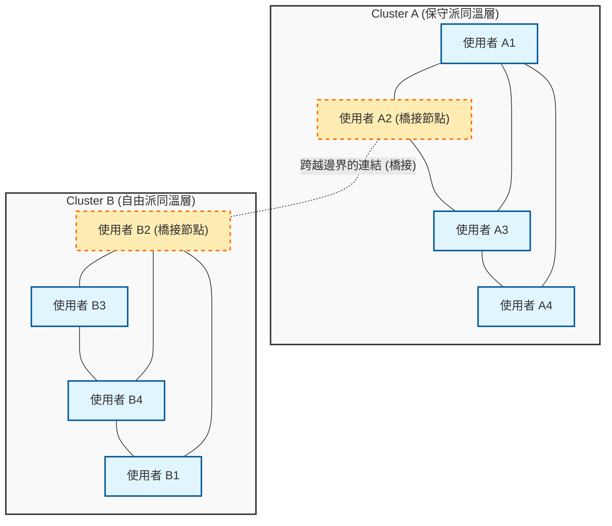
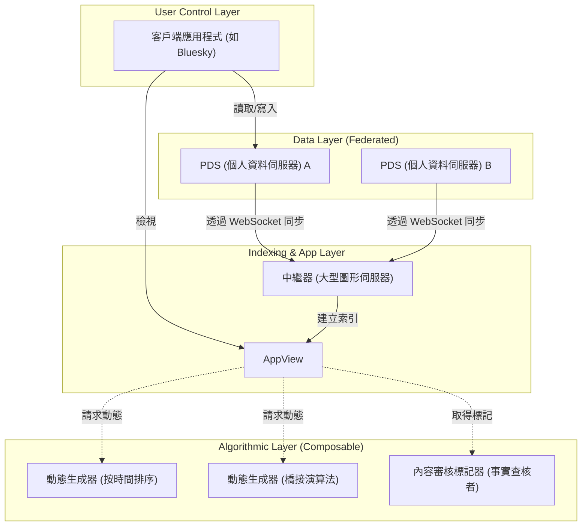

# 前言：寫在值得紀念的第100篇文章之際

自本部落格建立以來的這幾年裡，我反覆撰寫了技術解說、日常開發的備忘錄，有時也探討科技與社會之間的關係。而這次，這篇文章將是值得紀念的「第100篇」文章。在此，我要向一直閱讀到這裡的各位讀者表達最誠摯的感謝。

在這個第100篇的里程碑，有一個我無論如何都想記錄下來的主題。那就是：「科技能彌合社會的裂痕嗎？」這是在現代社會中極為重大且本質性的問題。

早期的網際網路（Web 1.0）被譽為一個「知識民主化」的烏托邦，任何人都可以在此自由地發佈和獲取資訊。隨後的社群媒體時代（Web 2.0）本應連結世界各地的人們，實現一個「平坦的世界」。然而，在 2026 年的今天，我們所面臨的現實又是如何呢？政治的兩極化、陰謀論的蔓延、假新聞的散布，以及形成阻礙相互理解的「同溫層（Echo Chamber）」與「過濾氣泡（Filter Bubble）」。科技非但沒有將人們連結在一起，反而似乎成了加速社會分歧（Social Divide）的強大引擎。

我們技術人員並不僅僅是寫寫程式碼、建構系統的存在。我們所設計的架構、選擇的演算法，以及優化的目標函數（Objective Function）背後，都潛藏著規定社會運作方式的「規則」。在本文中，我將以一名技術人員的視角，從數學與網路理論的角度，解析目前的社會分歧是如何在技術層面上被製造出來的，同時也將深入探討為了克服這一問題的具體技術途徑（橋接演算法、去中心化 SNS 協定）。

---

# 第1章：從網路理論看「同溫層」的數學結構

在探討社會分歧時，首先無法迴避的就是運用「網路理論（Graph Theory）」進行的社群結構分析。社群媒體上的人際關係，可以被模型化為一個巨大的圖，其中使用者是「節點（Node）」，使用者之間的追蹤或互動則是「邊（Edge）」。

描述分歧特徵的最重要指標之一是「群聚係數（Clustering Coefficient）」。某位使用者 $i$ 的群聚係數 $C_i$，表示使用者 $i$ 的朋友們彼此之間也是朋友的機率，其定義如下公式：

$$ C_i = \frac{2e_i}{k_i(k_i - 1)} $$

這裡，$k_i$ 是使用者 $i$ 的分支度（朋友的數量），$e_i$ 是這 $k_i$ 位朋友之間實際存在的邊的數量。在社群媒體中，這種群聚係數異常高的局部網路（密集的子圖）形成的現象，便構成了所謂「同溫層」的基礎。

在同溫層形成的背後，運作著社會學所說的「同質性（Homophily：物以類聚）」原理。正如「物以類聚，人以群分」這句話所說，人類傾向於與和自己有著相似屬性或思想的他人建立連結。如果將這表示為機率模型，可以假設使用者 $u$ 與使用者 $v$ 之間形成邊的機率 $P(u, v)$，與兩者在意識形態上的距離 $d(u,v)$ 成反比。

$$ P(u, v) \propto e^{-\beta \cdot d(u,v)} $$

參數 $\beta > 0$ 是表示同質性強度的常數。當平台的推薦演算法持續向使用者展示「使用者喜歡的（＝與自己相似的）內容或使用者」時，這個 $\beta$ 的值就會被人工地推高。結果導致擁有不同意識形態群體之間的邊（弱連結：Weak Ties）急劇減少，整個網路便分裂成多個相互孤立的叢集。

以下的 Mermaid 圖表將分裂的網路以及連結它們的橋接概念進行了視覺化。

像這樣，只要演算法持續採用僅優化參與度（點擊率、停留時間）的目標函數 $J(\theta) = \sum \log P(\text{engage} | \text{user}, \text{content})$，系統就會陷入局部最佳解（強化同溫層），從而遠離全域最佳解（形成健全的公共空間）。

---

# 第2章：演算法加速極化與資訊傳播模型

為了探討資訊如何在同溫層內傳播，讓我們將傳染病的數學模型「SIR模型」應用於資訊傳播上。
- $S$ (Susceptible) : 尚未接觸該資訊的使用者
- $I$ (Infected) : 相信並正在散布該資訊的使用者
- $R$ (Recovered/Removed) : 對資訊失去興趣，或察覺是假新聞而停止散布的使用者

資訊傳播的微分方程式可表示如下：

$$ \frac{dS}{dt} = -\alpha S I $$
$$ \frac{dI}{dt} = \alpha S I - \gamma I $$
$$ \frac{dR}{dt} = \gamma I $$

這裡，$\alpha$ 是「感染率（資訊散布的容易程度）」，$\gamma$ 是「恢復率（資訊的飽和與遺忘）」。
有趣的是，有實證研究指出，煽動憤怒或恐懼的極端內容（Polarizing Content），其 $\alpha$ 值明顯高於一般資訊。此外，在同溫層內，接觸反證資訊的機會很少，因此 $\gamma$ 值極低。也就是說，當演算法試圖最大化參與度時，必然會學習到優先推播 $\alpha$ 高且 $\gamma$ 低的內容，亦即「極端言論和假新聞」。這就是 AI 在無意中加速社會分歧的機制。

---

# 第3章：技術解決方案(1) 橋接演算法與社群筆記 (Community Notes)

那麼，我們該如何應對這種結構性的缺陷呢？第一種方法就是導入「橋接演算法（Bridging Algorithm）」。

如果基於參與度的推薦演算法是以「同質性」為獎勵，那麼橋接演算法就是以「異質性的橋接」為獎勵。其具代表性的成功案例，就是 X（前身為 Twitter）所導入的「社群筆記（Community Notes）」演算法。

社群筆記不僅僅是簡單的多數決。如果是多數決，人數眾多的同溫層意見將永遠獲勝。社群筆記的劃時代之處在於，它對「平時意見不合（屬於不同叢集）的人們，偶然一致認為『有幫助』的筆記」給予高度評價。

為了實現這一點，他們使用了稱為矩陣分解（Matrix Factorization）的機器學習技術。將使用者 $u$ 給予筆記 $n$ 的評分（是否有幫助）的預測分數 $\hat{r}_{u,n}$ 模型化如下：

$$ \hat{r}_{u,n} = \mu + i_u + i_n + \mathbf{f}_u \cdot \mathbf{f}_n $$

- $\mu$ : 整體的基準線（平均評價趨勢）
- $i_u$ : 使用者 $u$ 的評價偏差（例如總是給高分的人）
- $i_n$ : 筆記 $n$ 的一般品質（是否任何人都能輕易看懂）
- $\mathbf{f}_u$ : 使用者 $u$ 的潛在特徵向量（意識形態立場等）
- $\mathbf{f}_n$ : 筆記 $n$ 的潛在特徵向量

演算法會學習各個參數，以最小化實際評分數據與預測分數之間的誤差。
這裡的重點是，用於決定筆記最終是否顯示的，並不是單純的平均評分，而是「表示筆記一般品質的參數 $i_n$」。

如果某則筆記從特定有偏見的群體（例如只有右派或只有左派）那裡獲得了大量的高分，這些高分將被潛在向量 $\mathbf{f}_u \cdot \mathbf{f}_n$ 的項目吸收，而 $i_n$ 並不會變高。然而，如果它同時獲得了右派（$\mathbf{f}_u > 0$）和左派（$\mathbf{f}_u < 0$）的高分，光靠潛在向量的內積將無法解釋這個結果，演算法最終便會學習到「這則筆記本身具有普遍的優越性（$i_n$ 很高）」。

透過這樣的數學方法，使得透過演算法發現並評估「跨越同溫層的共識形成」成為可能。這是彌合社會分歧的一項非常強大的技術突破。

---

# 第4章：技術解決方案(2) 去中心化 SNS 協定 (AT Protocol / ActivityPub)

橋接演算法雖然強大，但仍然存在一個單一巨頭企業（中心化平台）壟斷演算法的結構性問題。只要平台的經營方針一改變，演算法隨時都可能被更改。

針對這個問題的第二種方法，是透過「去中心化 SNS 協定（Decentralized Social Protocols）」在架構層面上進行典範轉移。目前，ActivityPub（被 Mastodon 等採用）和 AT Protocol（被 Bluesky 採用）正受到廣泛的關注。

特別是 AT Protocol（Authenticated Transfer Protocol），它擁有「資料與演算法分離」這個非常優美的設計思想。

AT Protocol 最大的貢獻在於，它將「動態生成（演算法）」和「內容審核（標記）」從平台主體中分離出來，讓使用者可以自由選擇並組合（Composable）（即自訂動態 / 可疊加的內容審核）。

過去，我們可以選擇「使用哪個 SNS」，卻無法選擇「要接收哪個演算法推播的資訊」。在 AT Protocol 的世界裡，有人可以選擇「按時間排序」的動態，有人可以安裝「提供反對自己意見的學術動態」，還有人可以訂閱「隱藏不當詞彙的第三方機構審核標籤」。

在密碼學技術（DID: 去中心化識別碼）和資料結構（Merkle Search Trees: 默克爾搜尋樹）的支撐下，這項協定讓使用者重新獲得了「資訊的自決權」。由於演算法不再是黑箱，而能在開放市場中競爭與被選擇，這潛藏著改變誘因結構的可能性：從參與度至上的演算法，轉向重視使用者心理健康與社會健全度的演算法。

---

# 第5章：開源哲學與技術人員的社會責任

到目前為止，我們探討了網路理論的分析，以及為了克服這一問題的具體技術（社群筆記的矩陣分解、AT Protocol 的去中心化架構）。然而，最終能彌合社會分歧的，不僅僅是程式碼或數學公式，而是創造它們的「人類意志與哲學」。

在軟體工程的世界中，有一種偉大的文化叫做「開源（Open Source）」。從 Linux 開始，建構網際網路的大部分基礎技術，都是由世界各地素未謀面的人們，跨越意識形態和國界，透過協作、討論和合併程式碼所共同創造出來的。開源社群並非排除衝突（Conflict），而是擁有將其昇華為建設性共識形成的機制，其形式便是「拉取請求（Pull Request）」和「程式碼審查（Code Review）」。

我相信，這種開源哲學正是修復當今分裂社會的線索。將系統透明化，把演算法的選擇權交還給使用者，設計一個能讓多元價值觀共存的去中心化公共空間（Public Square）。這是賦予現代工程師極為重要的社會責任。

程式碼即法律，架構即政治。我們所寫下的每一行程式碼、定義的每一個 API 端點、設計的資料庫綱要，都在形塑著數百萬、數億使用者的認知；它們既可能加速社會的分歧，也可能架起促進對話的橋樑。

---

# 結語：寫在第100篇文章之後

「科技能彌合社會的裂痕嗎？」

我對這個問題的答案是：「單靠科技本身無法彌合，但設計得當的科技，能成為人類克服分歧的『墊腳石』。」

要完全消除人類根本的偏見（如物以類聚和確認偏誤）是不可能的。然而，我們有可能阻止僅追求參與度的演算法暴走，導入像社群筆記那樣能評估「橋接」的數學模型，並透過像 AT Protocol 這種自主去中心化架構，將選擇權還給使用者。

本部落格在這次迎來了第 100 篇文章。在過去的文章中，我們一直聚焦於語言規格或框架的使用方法等所謂的「如何做（How）」。但在 AI 會自動生成程式碼、所有技術都逐漸商品化的未來時代，對我們技術人員來說最重要的，將是「做什麼（What）」和「為什麼做（Why）」這種有關倫理與哲學的探討。

科技不是魔法。它是人類的鏡子。如果社會是分裂的，那是因為我們所創造的系統映照並放大了這種分裂。正因為如此，我相信透過改寫系統，我們可以一點一滴、卻也切實地將社會導向更好的方向。

從第 101 篇文章開始，作為一名技術人員，我仍將繼續站在程式碼與社會的交會點上，加深我的思索。非常感謝您耐心閱讀這篇長文到最後。期盼未來的網路不再是阻隔我們的牆，而是我們相互理解的橋樑。

（完）

