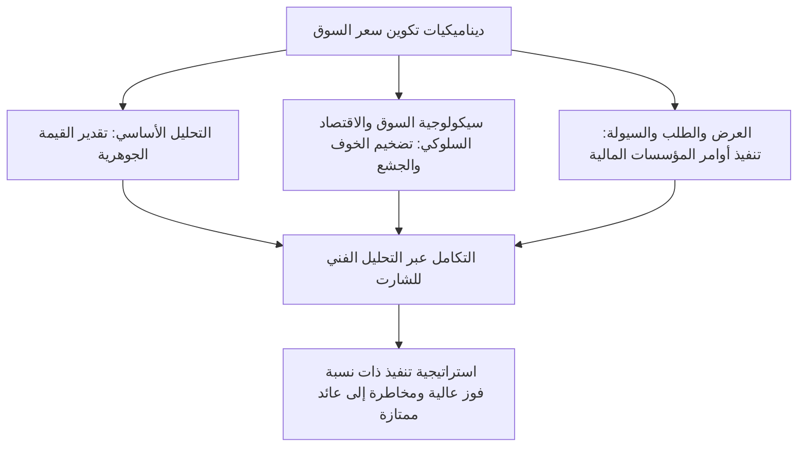
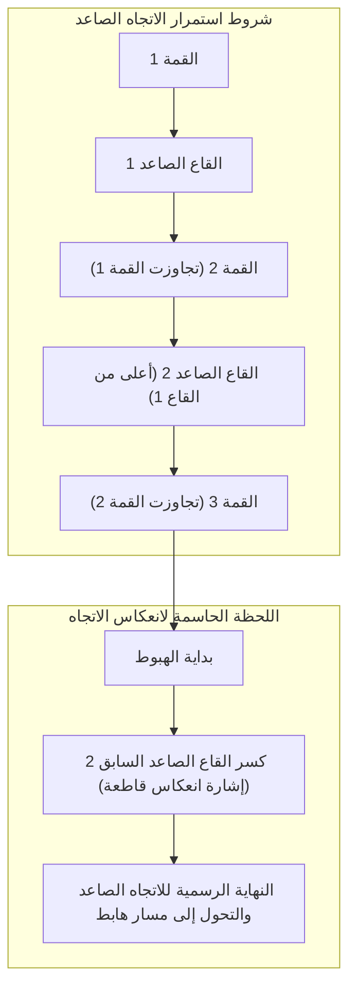
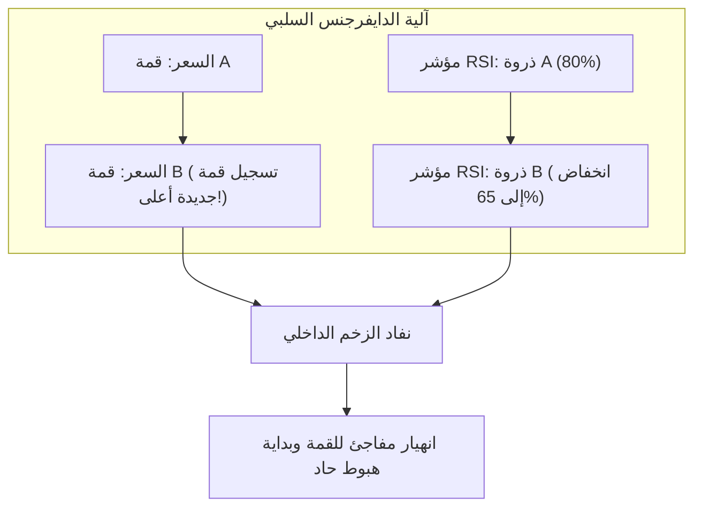
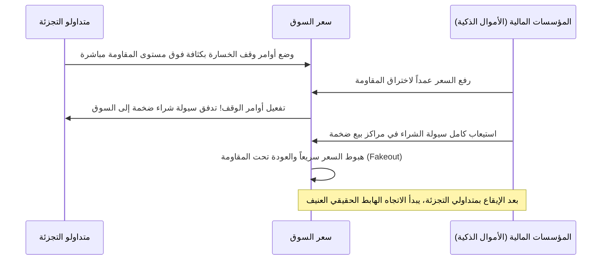
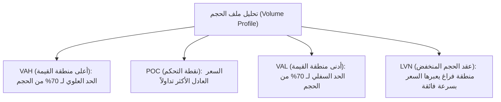

## 1. المقدمة: الأسس الفلسفية للتحليل الفني وجوهر السوق

### 1.1 الصراع والتوفيق الجدلي (Aufheben) بين التحليل الأساسي والتحليل الفني

لتفسير آليات تسعير الأصول في الأسواق المالية والتنبؤ بالتحركات السعرية المستقبلية، انقسمت المناهج عبر التاريخ المالي إلى تيارين رئيسيين: "التحليل الأساسي (Fundamental Analysis)" و"التحليل الفني (Technical Analysis)".

يركز التحليل الأساسي على احتساب "القيمة الجوهرية (Intrinsic Value)" للأصل عبر فحص القوائم المالية للشركات، والتدفقات النقدية، ومعدلات الفائدة، ونمو الناتج المحلي الإجمالي، ومعدلات التضخم، والمخاطر الجيوسياسية؛ بهدف اتخاذ القرارات الاستثمارية بناءً على الفجوة بين سعر السوق الحالي والقيمة النظرية العادلة. يفترض هذا التوجه أنه على الرغم من لا عقلانية الأسعار في المدى القصير، إلا أنها ستتقارب حتماً في الأجل الطويل وتستقر عند نقطة التوازن المحددة بالعوامل الأساسية والاقتصاد الكلي.

في المقابل، يتمحور التحليل الفني بالكامل حول دراسة المسار التاريخي واللحظي لثلاثة عناصر أساسية: "السعر (Price)"، و"حجم التداول (Volume)"، و"الزمن (Time)". ينطلق المحلل الفني من قناعة راسخة بأن المحرك الحقيقي للأسعار ليس البيانات الاقتصادية بحد ذاتها، بل كيفية إدراك المشاركين لتلك البيانات من خلال "سيكولوجية الإنسان، ومشاعر الخوف، والجشع، والتحيزات المعرفية، والتدفق الفعلي لرؤوس الأموال (السيولة / Liquidity)".

في التداول المؤسسي المعاصر فائق الاحترافية، لا يُنظر إلى هذين المنهجين كخصمين متنافرين، بل يجب دمجهما في إطار تركيبي توفيقي وفق مفهوم "التجاوز الجدلي (Aufheben)". يخبرنا التحليل الأساسي "بماذا يجب أن نتداول (انتقاء الأصول)"، بينما يرشدنا التحليل الفني إلى "متى يجب أن نتداول وأين نحصر المخاطر بدقة (التوقيت الزمني وإدارة المخاطر)". فحتى أكثر الشركات متانة من الناحية المالية قد تهوي أسهمها لسنوات متتالية إذا كانت محاصرة في اتجاه هابط كاسح للسوق بأكمله؛ وتجريد وتوضيح تلك الديناميكيات الهابطة هو جوهر قوة التحليل الفني.



---

### 1.2 "السعر يعكس كل شيء": نقد فرضية كفاءة السوق (EMH) والاقتصاد السلوكي

تتمثل البديهية الأولى في التحليل الفني في المبدأ القائل بأن: **"سعر السوق يمتص ويستوعب فوراً كل معلومة متاحة (ليس فقط البيانات العامة، بل والمعلومات الداخلية، والشائعات، والكوارث الطبيعية، والمخاطر الجيوسياسية، والحالة النفسية لجموع المتداولين)."**

وفقاً للصيغة الضعيفة (Weak-Form) لـ "فرضية كفاءة السوق (Efficient Market Hypothesis: EMH)" التي هيمنت على الاقتصاد المالي الأكاديمي لعقود طويلة، يُزعم أن "جميع بيانات الأسعار والأحجام التاريخية تنعكس بالكامل في السعر الحالي؛ وبالتالي يستحيل تحقيق عوائد استثنائية (ألفا / Alpha) تفوق متوسط السوق بالاعتماد على التحليل الفني".

إلا أن التطور الهائل في مجالي "الاقتصاد السلوكي (Behavioral Economics)" و"المالية السلوكية (Behavioral Finance)" منذ ثمانينيات القرن الماضي أثبت تجريبياً ونفسياً بطلان الفرضية الجوهرية لنظرية كفاءة السوق، والقائلة بأن "المتعاملين في الأسواق يتصرفون دوماً بعقلانية ورشد تامين".
- كشفت **"نظرية الاحتمالات (Prospect Theory)"** التي طورها دانيال كانمان (Daniel Kahneman) وآموس تفيرسكي (Amos Tversky) عن تحيز إدراكي غير متماثل في العقل البشري؛ حيث يميل الإنسان إلى "تجنب المخاطرة (Risk-Averse)" عند جني الأرباح، بينما يتحول إلى "عاشق للمخاطرة (Risk-Seeking)" عند تكبد الخسائر لتجنب الاعتراف بها.
- إن التحيزات النفسية مثل أثر التثبيت (Anchoring Effect)، وسلوك القطيع (Herding Behavior)، والانحياز التأكيدي (Confirmation Bias)، والثقة المفرطة (Overconfidence) تُولّد حتماً في الأسواق دورات منتظمة ومتكررة من "الإفراط في الشراء (الفقاعات / Bubbles)" و"الإفراط في البيع (حالات الذعر / Panics)".

لذا، فإن التحليل الفني ليس كرة بلورية سحرية للتنجيم وسط ضوضاء عشوائية، بل هو **"فك تشفير إحصائي للأنماط الهندسية المتكررة التي ترسمها السلوكيات الجماعية للمتداولين بدافع من تحيزاتهم المعرفية الفطرية"**.

---

### 1.3 فرضية البنية الكسورية (الفركتالية) لماندلبروت مقابل نظرية السير العشوائي

من الاعتراضات الأكاديمية الكلاسيكية الأخرى "نظرية السير العشوائي (Random Walk Theory)". وتدعي هذه النظرية أن التوزيع الاحتمالي لتغيرات الأسعار يتبع التوزيع الطبيعي الغاوسي (Gaussian Normal Distribution)، وأنه لا يوجد أي ارتباط ذاتي (Autocorrelation) بين تحركات الأسعار السابقة والتحركات المستقبلية.

جاء الرد القاطع والنهائي على هذه الفرضية القديمة من قِبل مؤسس الهندسة الكسورية بينوا ماندلبروت (Benoit Mandelbrot). أجرى ماندلبروت تحليلاً رياضياً معمقاً لبيانات تاريخية تمتد لعشرات السنين لأسعار القطن وأسعار صرف العملات، وأثبت رياضياً الحقائق الحاسمة التالية:

1. **الذيول السميكة (Fat Tails)**: لا تخضع تقلبات الأسعار المالية للتوزيع الطبيعي، بل تتبع "قانون القوة (Power Law)"؛ حيث تتكرر التحركات السعرية المتطرفة (أحداث البجعة السوداء / Black Swan Events) بمعدل يفوق توقعات التوزيع الطبيعي بآلاف المرات.
2. **تكتل التقلبات (Volatility Clustering)**: الفترات ذات التقلبات العالية تعقبها فترات تقلبات عالية، والفترات الهادئة تعقبها فترات هادئة؛ مما يؤكد وجود ارتباط ذاتي قوي في التباين السعري.
3. **التشابه الذاتي (Self-Similarity)**: إذا تم عرض شارت دقيقة وشارت يومي وشارت شهري بعد إخفاء مؤشرات الفاصل الزمني، فلن يتمكن حتى كبار المتداولين المحترفين من التمييز بينها، نظراً لتطابق خصائصها الهندسية.

هذه "البنية الكسورية (الفركتالية) للأسواق" هي السند الرياضي الموضوعي الذي يمنح التحليل الفني فاعليته عبر جميع الأطر الزمنية. فالتريند في الأطر الزمنية العليا يحتوي بداخله على تريندات الأطر الزمنية الأدنى في بنية متداخلة متطابقة، وفي اللحظة التي تتناغم فيها هذه الاتجاهات معاً، ينطلق في السوق زخم سعري جارف.

---

## 2. حجر الزاوية في تحليل الشارت الحديث: المبادئ الستة لنظرية داو وإعادة تفسيرها المعاصر

ترجع أصول جميع نظريات التحليل الفني الحديث (موجات إليوت، قوانين غرانفيل، برايس أكشن المعاصر) إلى "نظرية داو (Dow Theory)" التي أسسها تشارلز داو (Charles H. Dow, 1851–1902)، مؤسس صحيفة وول ستريت جورنال. على الرغم من أن داو لم يؤلف كتاباً مستقلاً بل دون أفكاره في مقالات افتتاحية، فقد تولى كل من صامويل نيلسون، وويليام هاملتون، وروبرت ريا تنظيمها وتدوينها بعد وفاته في المبادئ الستة الشهيرة.


---

### 2.1 المبدأ الأول: المؤشرات (أسعار السوق) تعكس جميع الأحداث

تعكس مؤشرات الأسواق العامة (مثل مؤشر داو جونز الصناعي) بدقة متناهية الدورات الاقتصادية، وأرباح الشركات، وسياسات البنوك المركزية وأسعار الفائدة، والكوارث، والحروب، فضلاً عن الحالة النفسية الإجمالية لجميع المتداولين. ولأن أي بيان اقتصادي أو خبر عاجل يُستوعب فوراً في الأسعار بمجرد صدوره، فإن انتظار الأخبار الأساسية للتداول يؤدي حتماً إلى التأخر عن حركة السوق. إن مراقبة حركة الشارت بحد ذاتها هي أرقى وسيلة وأكثرها استباقية وشمولية لجمع المعلومات.

---

### 2.2 المبدأ الثاني: للسوق ثلاثة اتجاهات

شبّه تشارلز داو الاتجاهات السعرية بحركات مياه البحر وصنفها إلى ثلاث درجات:

1. **الاتجاه الرئيسي (Primary Trend: المد والجزر / Tide)**: اتجاه جارف وكبير يستمر من عام إلى عدة أعوام، وهو الذي يحدد المسار الاستراتيجي العام للأسواق.
2. **الاتجاه الثانوي (Secondary Trend: الأمواج / Waves)**: حركة تصحيحية تنشأ في عكس مسار الاتجاه الرئيسي، وتستمر عادة من 3 أسابيع إلى 3 أشهر، وتصحح ما بين ثلث إلى ثلثي (أو نصف) المسافة التي قطعها الاتجاه الرئيسي.
3. **الاتجاه الصغير / الفرعي (Minor Trend: التموجات السطحية / Ripples)**: تذبذبات قصيرة الأجل تقل مدتها عن 3 أسابيع (تمتد من ساعات إلى بضعة أيام). تتشكل بدافع من الضوضاء اليومية والمضاربات العابرة، وتخضع للتلاعب السهل من قِبل كبار اللاعبين؛ مما يجعل التداول عليها بمعزل عن الاتجاه العام أمراً بالغ الخطورة.

في التداول الحديث، يمثل هذا المبدأ الأساس الجوهري لـ **"التحليل متعدد الأطر الزمنية (Multi-Timeframe Analysis: MTF)"**؛ حيث يُحدد الاتجاه العام عبر الشارت اليومي والأسبوعي (المد البحري)، ثم يُنتظر التصحيح على شارت الـ 4 ساعات (الموجة)، وتُقتنص نقطة الدخول الدقيقة على شارت الـ 15 دقيقة أو الـ 5 دقائق (التموجات السطحية).

---

### 2.3 المبدأ الثالث: الاتجاه الرئيسي يتكون من ثلاث مراحل

يمر الاتجاه الرئيسي (وخاصة الاتجاه الصاعد) بثلاث مراحل مميزة تتحدد بطبيعة وسيكولوجية المشاركين في السوق:


- **المرحلة الأولى: مرحلة التجميع (Accumulation)**: تقع في قيعان الركود الاقتصادي والانهيارات السعرية الحادة، حيث تسود مشاعر اليأس والذعر المطلق بين الجماهير. في هذا التوقيت، يبدأ المستثمرون الأكثر حنكة ودهاء (الأموال الذكية والمؤسسات المالية الكبرى) في شراء وتجميع الأصول المقومة بأقل من قيمتها بهدوء تام. تتحرك الأسعار حينها في نطاق عرضي هادئ وتتراجع التقلبات إلى أدنى مستوياتها.
- **المرحلة الثانية: مرحلة المشاركة العامة (Public Participation / Markup)**: تبدأ البيانات الاقتصادية الإيجابية وأرباح الشركات في الظهور علناً، وتتحسن المؤشرات الفنية، مما يدفع متداولي الاتجاه الكلاسيكيين إلى الدخول الجماعي في السوق. تشهد الأسعار ارتفاعاً متسارعاً وتشكل أطول وأكثر مراحل الاتجاه استقراراً وربحية.
- **المرحلة الثالثة: مرحلة التصريف (Distribution)**: تضج وسائل الإعلام بالحديث عن الارتفاعات القياسية للأصل المالي، وتتدفق جموع المتداولين الهواة (Dumb Money) مدفوعة بالخوف من فوات الفرصة (FOMO) للشراء بأسعار مرتفعة للغاية. في تلك الأثناء، تقوم الأموال الذكية التي جمعت مراكزها في المرحلة الأولى ببيع حصصها تدريجياً وبسرية تامة لجموع المشترين الجدد لجني أرباحها الطائلة. يتميز الشارت حينها بتقلبات عنيفة وظهور ظلال علوية طويلة للشموع، إيذاناً بنهاية الاتجاه.

---

### 2.4 المبدأ الرابع: يجب أن تؤكد المتوسطات بعضها البعض

في عهد تشارلز داو، كان يقارن بين مؤشرين رئيسيين: "متوسط أسهم الشركات الصناعية" و"متوسط أسهم السكك الحديدية". فمهما بلغ حجم إنتاج السلع في المصانع، فإن ذلك الإنتاج لا يمثل ازدهاراً اقتصادياً حقيقياً ما لم تنقله شبكات السكك الحديدية إلى أسواق الاستهلاك. بناءً على ذلك، إذا سجل مؤشر الشركات الصناعية قمة تاريخية جديدة، فلا يمكن الجزم ببدء سوق صاعدة حقيقية ما لم يؤكد مؤشر السكك الحديدية ذلك بتسجيل قمة تاريخية جديدة بالتزامن معه.

في العصر الحديث، تطور هذا المبدأ إلى **"تحليل الترابط بين الأسواق (Intermarket Correlation Analysis)"** و**"تحليل المؤشرات الداخلية للسوق (Market Internals)"**:
- هل تسجيل مؤشر S&P 500 لقمة تاريخية جديدة يحظى بتأكيد مؤشر ناسداك (NASDAQ) لأسهم التكنولوجيا ومؤشر راسل 2000 (Russell 2000) للشركات الصغيرة؟
- في سوق العملات الأجنبية، هل صعود زوج USD/JPY مدعوم بارتفاع عوائد السندات الأمريكية وصعود مؤشر الدولار الأمريكي؟
- في أسواق العملات المشفرة، هل الانطلاقة الصعودية للبيتكوين مدعومة بمشاركة الإيثيريوم والعملات البديلة؟

إن أي اختراق لقمة جديدة دون تأكيد توافقي بين الأسواق ذات الصلة يُرجح بقوة أن يكون فخاً صعودياً (Bull Trap) من صنع المؤسسات المالية للإيقاع بالمتداولين.

---

### 2.5 المبدأ الخامس: يجب تأكيد الاتجاه بحجم التداول

يكشف السعر عن "اتجاه" الحركة، بينما يعكس حجم التداول (Volume) مدى "مصداقية وقوة الطاقة الكامنة" خلف هذا الاتجاه.

- **في الاتجاه الصاعد الصحي**: يتصاعد حجم التداول بالتزامن مع ارتفاع الأسعار، ويتقلص الحجم أثناء فترات الهبوط التصحيحي.
- **في الاتجاه الهابط الصحي**: يتصاعد حجم التداول بالتزامن مع هبوط الأسعار، ويتقلص الحجم خلال الارتدادات التصحيحية المؤقتة.

إذا واصل السعر تسجيل قمم جديدة بينما يتناقص حجم التداول بصورة ملحوظة، فإن هذا يعد إنذاراً مبكراً بالغ الخطورة بانفراج الحجم السلبي (Volume Divergence)؛ مما يعني أن قوى الشراء الحقيقية قد نضبت، وأن الارتفاع صوري وغير مدعوم بتدفقات مالية حقيقية. وقد طوّر ريتشارد وايكوف (Richard Wyckoff) هذا المبدأ ليؤسس منهج "تحليل الفارق بين الحجم والسعر (Volume Spread Analysis / VSA)" لقراءة مقاصد كبار صناع السوق.

---

### 2.6 المبدأ السادس: يستمر الاتجاه حتى تظهر إشارة انعكاس قاطعة

هذا المبدأ السادس هو القاعدة الأكثر صرامة وإلزاماً التي يجب على متداولي الشارت المعاصرين الانضباط بها عملياً.

تعريف الاتجاه السعري في نظرية داو يتميز ببساطة مذهلة ودقة رياضية صارمة:
- **تعريف الاتجاه الصاعد**: **"سلسلة متتالية من القمم المتصاعدة (Higher Highs: HH) والقيعان المتصاعدة (Higher Lows: HL)."**
- **تعريف الاتجاه الهابط**: **"سلسلة متتالية من القمم المتنازلة (Lower Highs: LH) والقيعان المتنازلة (Lower Lows: LL)."**



مهما ارتفعت الأسعار بصورة تبدو مفرطة لدرجة تجعل المتداول يشعر بأنه "من المستحيل الشراء عند هذه المستويات المرتفعة"، فإن الاتجاه الصاعد يظل قائماً ومحمياً بالكامل ما لم يتم كسر "القاع الصاعد السابق (Higher Low)" بإغلاق شمعة صريح أسفله. إن التخمين الفردي للمتداول بأن السوق "قد بلغ قمته حتماً" والرهان ضد الاتجاه هو أخطر سلوك انتحاري يتعارض جذرياً مع مبادئ داو.

---

## 3. نظرية موجات إليوت وسحر رياضيات فيبوناتشي

### 3.1 نظرية النظام الكوني لرالف نيلسون إليوت

بينما حددت نظرية داو الاتجاه العام ونقاط التحول، كان الفضل في فك شفرة "الإيقاع الزمني" و"الطبيعة الهندسية الكسورية" لحركة الأسعار يعود إلى رالف نيلسون إليوت (Ralph Nelson Elliott, 1871–1948). وهو طريح فراش المرض العضال، حلل إليوت بإصرار أسطوري شارتات مؤشر داو جونز على مدار 75 عاماً (شهرياً، وأسبوعياً، ويومياً، وحتى فريم 30 دقيقة يدوياً)، ونشر في عام 1938 مؤلفه الشهير "مبدأ الموجة (The Wave Principle)".

أكد إليوت أن النشاط البشري والتقلبات النفسية الجماعية تخضع في تطورها للنسبة الذهبية ومتتالية فيبوناتشي التي تهيمن على جميع عمليات النمو الطبيعي في الكون (من قواقع الحلزون إلى ترتيب أوراق الشجر والمجرات الحلزونية). إن السوق ليس فوضى عشوائية، بل هو كون كسوري يعيد بلا نهاية دورة أساسية تتألف من **"8 موجات: 5 موجات دافعة (Impulse Waves) و 3 موجات تصحيحية (Corrective Waves)"**.

```mermaid
flowchart LR
    subgraph الموجات الدافعة (في اتجاه التريند: 5 موجات)
        W1["الموجة 1<br/>(الانطلاقة الأولى)"] --> W2["الموجة 2<br/>(تصحيح عميق)"]
        W2 --> W3["الموجة 3<br/>(أقوى انفجار سعري)"]
        W3 --> W4["الموجة 4<br/>(تصحيح معقد)"]
        W4 --> W5["الموجة 5<br/>(النشوة الأخيرة)"]
    end
    subgraph الموجات التصحيحية (عكس الاتجاه: 3 موجات)
        W5 --> WA["الموجة A<br/>(بداية الهبوط)"]
        WA --> WB["الموجة B<br/>(ارتداد خادع)"]
        WB --> WC["الموجة C<br/>(هبوط ساحق)"]
    end
```

---

### 3.2 بنية الموجات الدافعة (Impulse Waves) والقواعد الثلاث المطلقة

تخضع الموجات الدافعة الكلاسيكية التي تسير في اتجاه الاتجاه الرئيسي لـ **"ثلاث قواعد مطلقة لا تقبل الاستثناء"**. وإذا تم كسر أي قاعدة منها، فإن ترقيم الموجات يصبح باطلاً تماماً ويجب إعادة التحليل من البداية:

1. **القاعدة الأولى: لا يمكن للموجة 2 أن تصحح بأكثر من 100% من بداية الموجة 1** (أي لا يمكن أن تكسر قاع انطلاق الموجة 1؛ وإذا حدث ذلك، فإنها ليست موجة 1 بل استمرار للاتجاه الهابط السابق).
2. **القاعدة الثانية: من بين الموجات 1 و 3 و 5، لا يمكن للموجة 3 أن تكون الأقصر على الإطلاق** (وعادة ما تكون الموجة 3 هي الأقوى والأطول وتعرف بالموجة الممتدة).
3. **القاعدة الثالثة: لا يمكن للموجة 4 أن تتداخل سعرياً مع نطاق قمة الموجة 1** (في اللحظة التي يهبط فيها قاع الموجة 4 دون قمة الموجة 1، يفقد النموذج بنيته الدافعة ويتحول إلى نماذج شاذة كالقطرية أو المثلثية).

#### الخصائص السيكولوجية لكل موجة:
- **الموجة 1**: بداية تحول الاتجاه. تظل الأخبار السلبية مهيمنة على المشهد، ويعتبر أغلب المتداولين هذا الصعود مجرد ارتداد عابر؛ ولذا يكون الزخم محدوداً.
- **الموجة 2**: تصحيح هابط عنيف للموجة 1. يندفع الكثيرون للبيع بدافع الخوف ظناً منهم أن الاتجاه الهابط قد استأنف مساره، مما يؤدي إلى تصحيح عميق يبلغ غالباً $50\%$ إلى $61.8\%$ (وقد يصل إلى $78.6\%$) من طول الموجة 1، لكنه يحافظ دوماً على قاع الموجة 1 دون كسر.
- **الموجة 3**: تتحسن المؤشرات الفنية جماعياً، ويتأكد اختراق القمم السابقة، فتتدفق السيولة والمشاركون كالسيل الجارف. ينفجر حجم التداول وتتكون فجوات سعرية سريعة في أطول وأعنف موجة صاعدة. هذه هي الموجة الذهبية التي يجب على المحترفين ضخ أكبر أحجام التداول فيها لحصد أكبر الأرباح.
- **الموجة 4**: مرحلة تماسك وتذبذب عرضي تتصارع فيها عمليات جني الأرباح من الموجة 3 مع دخول متداولي الشراء المتأخرين. تستغرق زمناً أطول وتميل إلى تكوين نماذج تصحيحية معقدة كالمثلثات (قاعدة التناوب: إذا كانت الموجة 2 تصحيحاً حاداً وبسيطاً، فإن الموجة 4 ستكون تصحيحاً عرضياً معقداً).
- **الموجة 5**: تصل البيانات الأساسية إلى أوج ازدهارها، وتدخل الجماهير في حالة نشوة شرائية جامحة. لكن مؤشرات الزخم (مثل RSI و MACD) تبدأ في تكوين "انفراج سلبي (Divergence)" حيث تعجز عن مجاراة القمم الجديدة، معلنةً نفاد الطاقة الكامنة في الاتجاه.

---

### 3.3 تصنيف الموجات التصحيحية (Corrective Waves)

تتميز الحركات التصحيحية التي تعقب انتهاء الموجات الدافعة بتنوعها وتعقيدها البالغ مقارنة بالموجات الدافعة. وقسمها إليوت إلى 3 نماذج رئيسية:

1. **الزجزاج (Zigzag: بنية 5-3-5)**: تصحيح هابط حاد وسريع للغاية. موجة A (هبوط خماسي) $\rightarrow$ موجة B (ارتداد ثلاثي يصحح 38.2% إلى 50% من A) $\rightarrow$ موجة C (هبوط خماسي يعادل طول الموجة A تقريباً).
2. **الفلات (Flat: بنية 3-3-5)**: تصحيح عرضي بطيء. موجة A (ثلاثية) $\rightarrow$ موجة B (ثلاثية تصعد إلى قرب بداية A) $\rightarrow$ موجة C (خماسية تكسر قاع A بمسافة ضئيلة). وفي الأسواق القوية، يتكرر كثيراً نموذج "الفلات الممتد (Expanded Flat)" حيث تتجاوز الموجة B قمة A قبل أن تهوي الموجة C بعنف.
3. **المثلثات (Triangle: بنية 3-3-3-3-3)**: توازن مؤقت بين قوى المشترين والبائعين يؤدي إلى انضغاط تدريجي في النطاق السعري عبر 5 موجات فرعية (A-B-C-D-E). يظهر هذا النموذج حصرياً "قبل الموجة الأخيرة مباشرة" (في الموجة 4 أو الموجة B)، ويعقبه اندفاع سعري عنيف (الموجة 5).

---

### 3.4 نسب فيبوناتشي وطرق حساب الأهداف السعرية للموجات

يكمن الإعجاز الحقيقي لموجات إليوت في قدرتها على التنبؤ بمستويات التصحيح والأهداف السعرية المستقبلية بدقة متناهية بالاعتماد على متتالية فيبوناتشي (0, 1, 1, 2, 3, 5, 8, 13, 21, 34, 55, 89, 144...).

أهم نسب فيبوناتشي:
- $\phi = \frac{\sqrt{5}-1}{2} \approx 0.618$
- $1 - \phi \approx 0.382$
- $\sqrt{0.618} \approx 0.786$
- $1.618$ (مقلوب النسبة الذهبية / نسبة الامتداد)
- $2.618, 4.236$

#### معادلات احتساب الأهداف عملياً:
1. **تصحيح الموجة 2**: يعادل **$61.8\%$** أو **$50.0\%$**، وبحد أقصى **$78.6\%$** من الارتفاع العمودي للموجة 1.
2. **هدف الموجة 3**: بفرض أن طول الموجة 1 هو $W_1$، وقاع انتهاء الموجة 2 هو $L_2$:
   $$Target(W_3) = L_2 + 1.618 \times W_1$$
   وفي الاتجاهات فائقة القوة:
   $$Target(W_3) = L_2 + 2.618 \times W_1$$
3. **تصحيح الموجة 4**: يعادل عادة **$38.2\%$** (تصحيح ضحل) من طول الموجة 3، أو يتطابق مع قاع الموجة الفرعية 4 داخل الموجة 3.
4. **هدف الموجة 5**: يُضاف **$61.8\%$** من إجمالي المسافة السعرية بين قاع الموجة 1 وقمة الموجة 3 إلى قاع الموجة 4.

---

## 4. الحكمة الشرقية: علم أشكال الشموع اليابانية وطرق ساكاتا الخمس

بينما نشأ التحليل الفني الغربي معتمداً على الشارت الخطي وشارت الأعمدة، كانت اليابان في القرن الثامن عشر الميلادي (عصر إيدو) تشهد ازدهاراً منقطع النظير لأول بورصة عقود آجلة في العالم في سوق دوجيما للأرز في أوساكا. وكان رائد تلك التداولات الأسطوري هو مونيهيسا هونما (Munehisa Homma, 1724–1803)، الذي صاغ فلسفته التداولية في كتاب "أسرار الفئران الثلاثة والعملات الذهبية"، والتي تبلورت لاحقاً تحت اسم "طرق ساكاتا الخمس".

---

### 4.1 الديناميكا الداخلية للشموع اليابانية (Candlestick Mechanics)

تختزل الشمعة اليابانية الواحدة تحركات أربعة أسعار خلال فترة زمنية محددة: "سعر الافتتاح (Open)"، و"أعلى سعر (High)"، و"أدنى سعر (Low)"، و"سعر الإغلاق (Close)"، وذلك عبر جسم حقيقي مصمت (Real Body) وظلال علوية وسفلية (Shadows / Wicks).

عندما قدّم ستيف نيسون (Steve Nison) الشموع اليابانية للعالم الغربي في أواخر الثمانينيات عبر كتابه الشهير *Japanese Candlestick Charting Techniques*، صُدم متداولو وول ستريت بالكفاءة البصرية الاستثنائية التي تقدمها هذه الشموع في قراءة الصراع النفسي، وأصبحت اليوم المعيار العالمي الموحد لجميع المنصات.

| نموذج الشمعة | خصائص الشكل | السيكولوجية والديناميكا الداخلية للسوق |
| :--- | :--- | :--- |
| **ماروبوزو (Marubozu)** | جسم الشمعة طويل للغاية، مع غياب شبه تام للظلال العلوية والسفلية. | سيطرة كاملة ومطلقة للمشترين على السوق من سعر الافتتاح حتى الإغلاق. إشارة صعودية عاتية. |
| **المطرقة / بين بار (Hammer / Pinbar)** | جسم صغير متجمع في الجزء العلوي، مع ظل سفلي طويل يبلغ ضعف طول الجسم على الأقل. | حاول البائعون دفع الأسعار للهبوط بعنف، لكن قوى شراء مؤسسية هائلة كانت بانتظارهم عند القيعان، حيث استوعبت ضغط البيع بالكامل وأعادت السعر إلى قرب الافتتاح. **أقوى إشارة انعكاس قاع**. |
| **الشهاب (Shooting Star)** | جسم صغير متجمع في الجزء السفلي، مع ظل علوي طويل يبلغ ضعف طول الجسم على الأقل. | حاول المشترون اختبار قمم جديدة باندفاع صعودي، لكنهم اصطدموا بضغوط بيع مؤسسية كاسحة لجني الأرباح، فتم صدهم وهبط السعر سريعاً. **إشارة انعكاس قمة رئيسية**. |
| **الدوجي (Doji)** | سعر الافتتاح وسعر الإغلاق متطابقان تقريباً. يبدو الجسم كخط رفيع على هيئة صليب. | توازن كامل ومطلق بين قوى المشترين والبائعين. يشير إلى حيرة وتردد، استمرار التماسك، أو نذير حاسم بانعكاس الاتجاه القائم. |

---

### 4.2 جوهر طرق ساكاتا الخمس (Sakata's Five Methods)

طرق ساكاتا الخمس هي قواعد كلاسيكية تعتمد على دمج عدة شموع يابانية لقراءة تحولات الطاقة والزخم في السوق:

1. **القمم الثلاث (سانزان / San-zan)**: فشل السعر ثلاث مرات متتالية في اختراق نطاق المقاومة عند القمم. وعندما تكون القمة الوسطى هي الأعلى، يُعرف هذا النموذج بـ "الرأس والكتفين (Head and Shoulders Top)"، وتأكيد كسر خط العنق (Neckline) يطلق اتجاهاً هابطاً عنيفاً.
2. **الأنهار الثلاثة (سانسين / San-sen)**: محاولة السعر اختبار القاع ثلاث مرات والفشل في كسره (القيعان الثلاثية أو الرأس والكتفين المعكوس). كما يشمل نموذج "نجمة الصباح (Morning Star)" المكون من شمعة هابطة كبيرة، ثم شمعة دوجي أو مغزل صغيرة، تعقبهما شمعة صاعدة قوية لتأكيد ارتداد القاع.
3. **الفجوات الثلاث (سانكو / San-ku)**: ظهور ثلاث فجوات سعرية متتالية في اتجاه الحركة. وتنص الحكمة اليابانية على ضرورة "البيع في مواجهة الفجوة الثالثة الصاعدة، والشراء في مواجهة الفجوة الثالثة الهابطة"؛ إذ تعكس الفجوة الثالثة ذروة النشوة أو الهلع العاطفي للمتداولين واحتراق طاقة الاتجاه بالكامل.
4. **الجنود الثلاثة (سانبي / San-pei)**: يمثل نموذج "الجنود الثلاثة البيض" (ثلاث شموع صاعدة قوية متتالية) انطلاقة اتجاه صاعد جارف من القيعان. ولكن إذا كان للفرسان الثلاثة ظل علوي طويل، فيسمى ذلك "انسداد الجنود" ويوجب الحذر. وبالمثل، فإن ظهور "الغربان الثلاثة السوداء" عند القمم ينذر بانهيار وشيك.
5. **الطرق الثلاث (سانبو / San-po)**: يجسد فلسفة "الراحة فن من فنون التجارة". في نموذج "الطرق الثلاث الصاعدة (Rising Three Methods)"، تعقب الشمعة الصاعدة الكبيرة ثلاث شموع هابطة صغيرة تظل محصورة بالكامل داخل نطاق الشمعة الأولى، ثم تظهر الشمعة الخامسة صاعدة وكبيرة لتخترق القمة السابقة مستأنفة الصعود، وهو ما يؤكد استمرار الاتجاه بعد فترة راحة صحية.

---

## 5. البنية الرياضية للمؤشرات الفنية والمصائد العملية

تنقسم المؤشرات الفنية التي تُبنى على معادلات حسابية إلى فئتين: "مؤشرات الاتجاه (Trend Following)" و"مؤشرات التذبذب والزخم (Oscillators)". يقع المتداولون المبتدئون في فخ الاعتماد الأعمى على إشارات هذه المؤشرات دون إدراك قيودها الرياضية؛ وفيما يلي تشريح للأسس الرياضية لأهم هذه المؤشرات.

### 5.1 رياضيات مؤشرات الاتجاه

#### ① المتوسطات المتحركة (SMA مقابل EMA)
تُحسب قيمة المتوسط المتحرك البسيط (Simple Moving Average: SMA) لعدد $n$ من الفترات بالمعادلة التالية:
$$SMA_t = \frac{1}{n} \sum_{i=0}^{n-1} P_{t-i}$$
العيب القاتل للمتوسط البسيط هو منحه وزناً متساوياً ($1/n$) للسعر الأحدث وسعر ما قبل $n$ يوماً؛ مما يجعله مؤشراً بطيئاً وشديد التأخر (Lagging).

للتغلب على هذا التأخر، تم تطوير المتوسط المتحرك الأسي (Exponential Moving Average: EMA)، والذي يمنح السعر الأحدث $P_t$ الوزن الأكبر، بينما تتضاءل أوزان البيانات الأقدم بصورة أسية. فإذا كان معامل التنعيم $\alpha = \frac{2}{n+1}$، تكون المعادلة:
$$EMA_t = \alpha P_t + (1 - \alpha) EMA_{t-1}$$
نظراً لاستجابة EMA السريعة والحساسة للتقلبات الحديثة، فإن التداول المؤسسي والتداول الخوارزمي الحديث يفضلان استخدام EMA (خاصة 20 EMA و 50 EMA و 200 EMA) على الـ SMA بمراحل.

#### ② أشرطة بولينجر (Bollinger Bands)
طور جون بولينجر هذا المؤشر في ثمانينيات القرن الماضي؛ حيث يرسم نطاقاً يعتمد على الانحراف المعياري ($\sigma$) حول المتوسط المتحرك:
$$Middle = SMA_n(P)$$
$$\sigma = \sqrt{\frac{1}{n} \sum_{i=0}^{n-1} (P_{t-i} - Middle)^2}$$
$$Upper = Middle + k \cdot \sigma, \quad Lower = Middle - k \cdot \sigma \quad (\text{عادةً } k=2)$$

في التوزيع الطبيعي الإحصائي، تبلغ نسبة وقوع البيانات ضمن نطاق $\pm 2\sigma$ حوالي **$95.44\%$**.
لكن هنا تكمن المصيدة الكبرى التي تدمر حسابات المتداولين: **تقلبات الأسواق المالية لا تتبع التوزيع الطبيعي (بل تمتلك ذيولاً سميكة)**.
وبناءً عليه، فإن الظن بأن "ملامسة الشريط العلوي $+2\sigma$ تعني وصول السعر لحالة تشبع شرائي توجب البيع" هو خطأ جسيم. فعندما ينفجر اتجاه قوي، يلتصق السعر بالشريط العلوي ويدفعه للتوسع مستمراً في الصعود الصاروخي (**سير الأشرطة / Band Walk**). يكمن الاستخدام الاحترافي الحقيقي لأشرطة بولينجر في رصد مراحل "الانضغاط (Squeeze)" الناتجة عن هبوط التقلبات لأدنى مستوياتها، لاقتناص بداية الانفجار السعري وتوسع الأشرطة (Expansion) والدخول في اتجاه الانفجار.

---

### 5.2 رياضيات مؤشرات التذبذب

#### ① مؤشر القوة النسبية (RSI: Relative Strength Index)
يقارن مؤشر القوة النسبية الذي ابتكره جي. ويلز وايلدر (J. Welles Wilder) بين "مجموع الارتفاعات" و"مجموع الانخفاضات" خلال فترة محددة (غالباً 14 يوماً)، ويقيس الزخم النسبي على مقياس من $0$ إلى $100\%$:
$$RS = \frac{\text{متوسط الارتفاع خلال } n \text{ يوماً سابقة}}{\text{متوسط الانخفاض خلال } n \text{ يوماً سابقة}}$$
$$RSI = 100 - \frac{100}{1 + RS} = \frac{\text{متوسط الارتفاع}}{\text{متوسط الارتفاع} + \text{متوسط الانخفاض}} \times 100$$

المفهوم الشائع هو اعتبار القراءة فوق 70% منطقة تشبع شرائي والقراءة تحت 30% منطقة تشبع بيعي. ولكن في الاتجاهات القوية، يمكن لمؤشر RSI أن يظل معلقاً فوق 80% بينما يتضاعف السعر عدة مرات.
تعد الإشارة الأقوى والأكثر مصداقية لمؤشر RSI هي **"الانفراج / الدايفرجنس (Divergence)"**:
- **الانفراج السلبي (Bearish Divergence)**: عندما يسجل السعر قمة جديدة أعلى من سابقتها على الشارت، بينما يعجز مؤشر RSI عن تسجيل قمة جديدة ويشكل قمة أدنى. يمثل هذا دليلاً قاطعاً على نضوب الزخم الداخلي الحقيقي الذي يدعم الصعود، ويشير إلى قرب انعكاس الاتجاه نحو الهبوط.



---

## 6. نظرية حركة السعر المعاصرة ومفاهيم الأموال الذكية (SMC)

منذ العقد الثاني من القرن الحادي والعشرين، أصبحت خوارزميات التداول عالي التردد (HFT) والذكاء الاصطناعي المؤسسي تهيمن على أكثر من 80% من أحجام التداول اليومية؛ مما أفقد المؤشرات الكلاسيكية (مثل MACD والاستوكاستك) الكثير من جدواها. واستعاض المحترفون عن ذلك بالتركيز على الشارت المجرد (Raw Price) وحجم التداول عبر "نظرية حركة السعر (Price Action)" و"مفاهيم الأموال الذكية (Smart Money Concepts: SMC)".

### 6.1 صيد السيولة ومسح أوامر وقف الخسارة (Liquidity Sweep)

تنطلق فلسفة SMC من حقيقة قطعية لا تلين: **"يتحرك السوق دوماً في اتجاه المناطق التي تتكدس فيها أكبر كمية من أوامر وقف الخسارة (السيولة / Liquidity)."**

يتعلم متداولو التجزئة (Retail Traders) القواعد النمطية ذاتها، ولذا يضعون جميعاً أوامر وقف الخسارة (Stop Loss) في الأماكن ذاتها المعتادة: "فوق قمم القمم المزدوجة مباشرة" أو "أسفل خطوط الدعم بمسافة ضئيلة". ومع ذلك، فإن المؤسسات المالية العملاقة (الأموال الذكية) التي تدير محافظ بمليارات الدولارات لا تستطيع ملء وتنفيذ مراكزها الضخمة دون التسبب في انزلاقات سعرية كارثية إلا في تلك النقاط المحددة التي تتكثف فيها أوامر وقف التجزئة.

1. **مسح السيولة (Liquidity Sweep)**: تدفع المؤسسات السعر عمداً لاختراق مستويات المقاومة البارزة أو كسر مستويات الدعم للحظات معدودة.
2. يؤدي ذلك إلى تفعيل مبرمج لأوامر وقف خسارة متداولي التجزئة (أوامر شراء أو بيع قسرية بالوقف)، مما يضخ سيولة هائلة مفاجئة في السوق.
3. تبتلع المؤسسات المالية تلك السيولة المتدفقة بالكامل لبناء مراكزها المعاكسة، ثم تعيد السعر فوراً إلى ما دون المستوى المخترق (اختراق وهمي / Fakeout).
4. يترك هذا التحرك على الشارت "ذيلاً طويلاً للغاية (شمعة بين بار Pinbar)"، وتبدأ الأسعار في الانطلاق الصاروخي في الاتجاه المعاكس حاصدة حسابات المتداولين المخدوعين.



---

### 6.2 فجوة القيمة العادلة (FVG: Fair Value Gap) وكتل الأوامر (Order Blocks)

يقوم الدخول الاحترافي في منهجية SMC على ركيزتين جوهريتين: "مناطق عدم الاتزان (FVG)" و"كتل الأوامر (OB)":

- **فجوة القيمة العادلة (Fair Value Gap / FVG)**: عندما تضخ المؤسسات سيولة ضخمة في ثوانٍ معدودة، تنشأ فجوة سعرية بين قمة الشمعة الأولى وقاع الشمعة الثالثة في متتالية من ثلاث شموع (منطقة فراغ لم يحدث فيها أي تبادل صفقات عادل). ونظراً لأن خوارزميات التسعير تميل إلى موازنة هذا الخلل (Imbalance)، فإن السعر يعود لاحقاً لملء تلك الفجوة وإعادة اختبارها. ويمنح الدخول عند إعادة ملء الفجوة فرصة دخول ذات وقف خسارة متناهي الصغر وعائد استثنائي.
- **كتلة الأوامر (Order Block / OB)**: الشمعة المعاكسة الأخيرة التي تم عندها التجميع أو التصريف المؤسسي المكثف قبل حدوث الاختراق العنيف مباشرة. تمثل هذه المنطقة مستقبلاً مستوى دعم أو مقاومة مؤسسياً فائق القوة.

---

## 7. المضمار الحاسم بين النصر والهزيمة: نسبة المخاطرة إلى العائد ورياضيات إدارة الأموال

مهما بلغ المتداول من براعة في التحليل الفني، فإن تجاهل قواعد إدارة رأس المال (Money Management) يقود رياضياً وإحصائياً إلى الإفلاس الحتمي بنسبة 100%. التداول ليس "لعبة تنبؤ بالغيب"، بل هو **"إدارة أعمال إحصائية تكرر استغلال ميزة احتمالية ذات توقع رياضي إيجابي (Positive Expectancy)، بحجم مخاطرة يضمن انعدام احتمالية الإفلاس تماماً"**.

### 7.1 الإثبات الرياضي لاحتمالية الإفلاس لبالسارا (Balsara's Risk of Ruin)

طور عالم الرياضيات الفرنسي نوزير بالسارا (Nauzer Balsara) نموذجاً رياضياً لحساب احتمالية إفلاس المتداول بناءً على ثلاثة متغيرات: "نسبة الفوز (Win Rate)"، و"نسبة العائد إلى المخاطرة (Payoff Ratio)"، و"نسبة المخاطرة في الصفقة الواحدة من إجمالي رأس المال".

- **نسبة الفوز ($W$)**: عدد الصفقات الرابحة $\div$ إجمالي عدد الصفقات
- **نسبة العائد إلى المخاطرة ($R$)**: متوسط مبلغ الربح $\div$ متوسط مبلغ الخسارة

يوضح الجدول التالي احتمالية الإفلاس التقريبية لبالسارا في حال المخاطرة بنسبة $20\%$ من رأس المال في كل صفقة، عبر توليفات مختلفة من نسب الفوز والعائد:

| نسبة الفوز \ نسبة العائد ($R$) | 0.5 (خسارة كبيرة، ربح ضئيل) | 1.0 (الربح يعادل الخسارة) | 1.5 (الربح أكبر من الخسارة) | 2.0 (ربح مثالي) | 3.0 (ربح مضاعف فائق) |
| :---: | :---: | :---: | :---: | :---: | :---: |
| **30%** | 100% | 100% | 100% | 80.0% | 14.3% |
| **40%** | 100% | 100% | 38.2% | 14.1% | 1.2% |
| **50%** | 100% | 50.0% | 5.6% | 0.8% | **0.0%** |
| **60%** | 100% | 2.1% | 0.1% | **0.0%** | **0.0%** |
| **70%** | 14.3% | **0.0%** | **0.0%** | **0.0%** | **0.0%** |

تفرض هذه الأرقام حقيقة صادمة: **"حتى لو بلغت نسبة صفقاتك الرابحة 60%، لكن كانت نسبة العائد إلى المخاطرة 0.5 (تخسر دولارين لتربح دولاراً)، فإن احتمالية إفلاسك هي 100% حتماً."** وهذا يفسر كيف يفقد المبتدئون حساباتهم في انهيار مفاجئ واحد على الرغم من اعتمادهم على استراتيجيات تروج لنسبة نجاح 90%.

على النقيض من ذلك، **حتى لو كانت نسبة فوزك 40% فقط، ولكن نسبة العائد إلى المخاطرة 2.0 (متوسط ربحك ضعف متوسط خسارتك)، فإن احتمالية الإفلاس تهبط إلى 14%، وإذا بلغت النسبة 3.0 تتراجع احتمالية الإفلاس إلى 1.2% فقط، مما يضمن نمو المحفظة في الأجل الطويل بصورة مؤكدة**.

---

### 7.2 قاعدة الـ 2% ومعادلة الحجم الكمي للصفقة

القاعدة الحديدية في إدارة رأس المال لدى المحترفين هي: **"تحديد أقصى خسارة مسموح بها في الصفقة الواحدة بما لا يتجاوز $1\% \sim 2\%$ من إجمالي رصيد الحساب"** (قاعدة الـ 2%).

يرتكب أغلب الهواة خطأ تثبيت حجم العقد (مثلاً التداول دوماً بـ 1 لوت في كل صفقة). هذا خطأ فادح؛ لأن المسافة إلى وقف الخسارة الفني تختلف من شارت لآخر ومن صفقة لأخرى بناءً على التقلبات ومستويات الدعم والمقاومة.

تُحسب الكمية الصحيحة لحجم الصفقة بالمعادلة التالية:

$$Position\_Size = \frac{Account\_Balance \times Risk\_Percentage}{Entry\_Price - Stop\_Loss\_Price}$$

#### مثال عملي:
- رصيد الحساب: $10,000,000$ ين
- نسبة المخاطرة المسموح بها: $2\%$ (أقصى خسارة مقبولة $= 200,000$ ين)
- سعر الدخول: $150.00$ ين (USD/JPY)
- سعر وقف الخسارة الفني: $149.20$ ين (مسافة الوقف $= 0.80$ ين $= 80$ نقطة / pips)

حجم العقد الواجب دخوله في هذه الصفقة:
$$Position\_Size = \frac{200,000 \text{ ين}}{0.80 \text{ ين}} = 250,000 \text{ وحدة عملة (2.5 لوت)} $$

لو كانت مسافة الوقف ضيقة للغاية وتبلغ $0.40$ ين (40 نقطة)، يمكن حينها مضاعفة حجم المركز بأمان إلى $5.0$ لوت. ولو كانت مسافة الوقف واسعة وتبلغ $1.60$ ين (160 نقطة)، يُقلص الحجم وجوباً إلى $1.25$ لوت. **"تعديل حجم الصفقة عكسياً بناءً على اتساع وقف الخسارة لضمان ثبات مبلغ الخسارة المحتملة دوماً"**؛ هذا هو الدرع الرياضي الوحيد الذي يحمي الحساب من الهلاك مهما تتابعت الصفقات الخاسرة.

---

### 7.3 نظرية الاحتمالات والتغلب على التحيزات النفسية

لماذا يعجز أغلب المتداولين عن الالتزام بهذه القواعد الرياضية الصارمة؟ تكمن الإجابة في المسار التطوري للدماغ البشري.

خلال مئات آلاف السنين من حياة الصيد وجمع الثمار في البراري، كان الاستهلاك الفوري للغذاء المتاح مسألة بقاء لمنع تلفه أو سرقته. كما كان الاستبسال العنيف ضد أي تهديد أو خسارة يرفع من فرص النجاة.

إلا أن هذه الغرائز الدفاعية البدائية تصبح سمّاً قاتلاً في الأسواق المالية الحديثة الخاضعة للاحتمالات:
1. **تجنب المخاطرة في الأرباح (الإغلاق المبكر)**: بمجرد أن تسجل الصفقة أرباحاً طفيفة، يصاب المتداول بالذعر من ضياع الربح فيغلقها مسجلاً نقاطاً ضئيلة.
2. **عشق المخاطرة في الخسائر (ترحيل وقف الخسارة)**: عندما تنعكس الصفقة وتتكبد خسائر، ينشط تحيز الإنكار النفسي، فيقوم المتداول بترحيل وقف الخسارة لأسفل أو الشراء الإضافي (التبريد / Martingale) أملاً في معجزة ارتدادية.

إن "الكأس المقدسة" للربح المستدام في التداول ليست مؤشراً سحرياً خفياً، بل هي **"إدراك قيود التحيزات الفطرية في جيناتنا (لعنة نظرية الاحتمالات)، والتحلي بالانضباط الذاتي الصارم للانصياع آلياً لقوانين الاحتمالات والتوقع الرياضي كالآلة الصماء"**.

---

---

## 7.4 رياضيات معيار كيلي (Kelly Criterion) وتطبيق نصف كيلي (Half-Kelly) في التداول الفعلي

إلى جانب احتمالية بالسارا، يبرز "معيار كيلي (Kelly Criterion)" كأحد أعظم المعالم الرياضية في إدارة رأس المال، والذي طوره عالم الفيزياء في مختبرات بيل جون لاري كيلي الابن (John Larry Kelly Jr.) عام 1956 استناداً إلى نظرية المعلومات.

يحدد معيار كيلي نسبة الاستثمار المثلى $f^*$ التي تعظم معدل النمو الهندسي المركب للمحفظة في الأجل الطويل (القيمة المتوقعة اللوغاريتمية لتراكم الثروة):

$$f^* = \frac{b \cdot p - q}{b} = p - \frac{q}{b}$$

حيث:
- $p$: نسبة الفوز (الاحتمال $0 \le p \le 1$)
- $q = 1 - p$: نسبة الخسارة
- $b$: نسبة العائد إلى المخاطرة (معدل صافي الربح = متوسط مبلغ الربح $\div$ متوسط مبلغ الخسارة)

### الحساب الرقمي لمعيار كيلي ومصيدة الإفلاس
لنفترض استراتيجية تداول تمتلك ميزة واضحة بنسبة فوز $p = 0.55$ ($55\%$)، ونسبة عائد $b = 1.5$ (مخاطرة 1 مقابل عائد 1.5):
$$f^* = \frac{1.5 \times 0.55 - 0.45}{1.5} = \frac{0.825 - 0.45}{1.5} = \frac{0.375}{1.5} = 0.25 \quad (25\%)$$

من الناحية الرياضية النظرية البحتة، فإن المخاطرة بنسبة **$25\%$** من إجمالي رأس المال في كل صفقة هي النسبة التي تحقق أقصى وأسرع نمو للمحفظة.
ولكن في التداول المالي الواقعي، يعتبر تطبيق نموذج كيلي الكامل (Full Kelly) **"انتحاراً صريحاً"**؛ نظراً لأن معيار كيلي يفترض ثبات معدلات الفوز والعوائد الإحصائية للأصل عبر الزمن، وهو افتراض غير واقعي في الأسواق الحية.

فعندما تتغير ظروف السوق وتتراجع نسبة الفوز مؤقتاً، أو تتوالى 7 صفقات خاسرة متتابعة، فإن نموذج كيلي الكامل سيتسبب في هبوط كارثي في المحفظة (Drawdown) يتجاوز $80\%$، مما يؤدي إلى انهيار نفسي تام للمتداول.

### التفوق المطلق لنموذج نصف كيلي (Half-Kelly)
لذلك، تعتمد صناديق التداول الكمي والمتداولون المحترفون صيغة **"نصف كيلي (Half-Kelly)"** أو ربع كيلي:
- يضمن تطبيق نصف كيلي ($f^* / 2$) الحفاظ على ما يقارب **$75\%$** من الحد الأقصى النظري للنمو، مع **تخفيض التذبذب وأقصى تراجع للمحفظة بأكثر من $50\%$**.
- في المثال السابق، تُخفض نسبة المخاطرة إلى $12.5\%$، وفي "ربع كيلي" التحفظي تصبح $6.25\%$. وبفرض سقف "قاعدة الـ 2%" العملي فوق هذه النسبة، يكتسب الحساب حصانة واستقراراً رياضياً لا يتزعزع.

---

## 7.5 ملف الحجم (Volume Profile) وبنية نقطة التحكم (Point of Control / POC)

يُعرض حجم التداول التقليدي أسفل الشارت على هيئة "أعمدة رأسية زمنية" (Volume by Time). ولكن في التداول المؤسسي المعاصر، أصبح الاعتماد حتمياً على **"ملف الحجم (Volume Profile / VPVR)"** الذي يُرسم على جانب الشارت كأعمدة أفقية توضح كمية التداول عند كل مستوى سعري محدد.



1. **نقطة التحكم (Point of Control / POC)**: المستوى السعري الفردي الذي نُفذت عنده أكبر كمية تداول على الإطلاق خلال الفترة المحددة. يمثل هذا المستوى مركز الجاذبية السعري الذي أجمع كافة المشاركين على أنه "القيمة العادلة (Fair Value)"، ويعمل كمغناطيس قوي يجذب السعر إليه كلما ابتعد عنه.
2. **منطقة القيمة (Value Area: VA)**: النطاق السعري الذي شهد تنفيذ $70\%$ من إجمالي حجم التداول (ما يعادل انحرافاً معيارياً واحداً $1\sigma$).
   - **VAH (Value Area High)**: الحد العلوي لمنطقة القيمة، ويمثل مقاومة قوية.
   - **VAL (Value Area Low)**: الحد السفلي لمنطقة القيمة، ويمثل دعماً قوياً.
3. **عقد الحجم المنخفض (Low Volume Node: LVN)**: فجوات سعرية نُفذت عندها كميات تداول ضئيلة جداً. وبسبب انعدام التوافق السعري بين المشترين والبائعين في هذه المناطق، فإنها تشكل "مناطق فراغ" يعبرها السعر بسرعة فائقة ودون أي مقاومة تذكر بمجرد اختراقها.

باستخدام ملف الحجم، يستطيع المتداول تجاوز مجرد رسم الخطوط الأفقية التقليدية للقمم والقيعان، وتحديد "المستويات السعرية الدقيقة التي ضخت فيها الأموال الضخمة بالفعل" بأشعة سينية كاشفة.

---

## 7.6 بروتوكول التزامن متعدد الأطر الزمنية (Multi-Timeframe / MTF)

يُنفذ التداول الاحترافي الحقيقي عبر بروتوكول تزامن ميكانيكي يتكون من 5 خطوات واضحة:

| الإطار الزمني | الدور | عناصر المراقبة والقرارات |
| :--- | :--- | :--- |
| **1. الأسبوعي / اليومي** | قراءة البيئة العامة (التيار البحري الجارف) | الاتجاه الرئيسي (حالة القمم والقيعان وفق نظرية داو)، ميل متوسط 200 EMA، مناطق الدعم والمقاومة الكبرى. |
| **2. إطار الـ 4 ساعات** | إعداد الصفقة (بنية الموجات) | ترقيم موجات إليوت (هل نحن في الموجة 3 الدافعة أم في تصحيح الموجة 4؟)، مستويات فيبوناتشي (ملامسة 61.8%). |
| **3. إطار الساعة** | تحديد السيولة (تمركز الفرائس) | رصد فجوات القيمة العادلة (FVG)، كتل الأوامر (OB)، تجمعات السيولة فوق القمم وتحت القيعان القريبة. |
| **4. إطار الـ 15 دقيقة** | تأكيد انعكاس الاتجاه | رصد تغير طبيعة الحركة (CHoCH: Change of Character)، اختراق آخر قمة هابطة أو كسر آخر قاع صاعد. |
| **5. إطار الـ 5 دقائق / الدقيقة** | تنفيذ الدخول (إطلاق الزناد) | نماذج الشموع الانعكاسية (بين بار، ابتلاع بيعي أو شرائي)، تحديد مسافة وقف الخسارة الدقيقة، حساب حجم العقد بالمعادلة وإرسال الأمر. |

يجب حصر التداول وإطلاق أوامر الدخول فقط عند حدوث **"التوافق والالتقاء الكامل (Confluence)"** بين قراءة الإطار الأكبر وإشارات الإطار الأصغر. أما في غير ذلك من الأوقات، فإن البقاء خارج السوق ومراقبة الشاشات في صمت تام هو السر الأكبر في استقرار منحنى الأرباح ونسبة الفوز.

---

## 8. الخاتمة: التداول بوصفه إدارة لنفس المتداول وروحه

قد تبدو رحلة استيعاب التحليل الفني للشارت كأنها سعي حثيث للسيطرة على الأسواق الخارجية، لكنها في جوهرها الحقيقي ليست سوى "رياضة روحية" لتهذيب العقل الباطن وضبط رغبات النفس وشهواتها.

إن الشارت مرآة عملاقة تلتقي فيها آمال ومخاوف وحسابات وغرور الملايين من البشر، وخوارزميات الذكاء الاصطناعي، والبنوك المركزية، ومديري الصناديق الاستثمارية حول العالم. وكل شمعة يابانية تُطبع على هذا الشارت هي نبض حي للوجود الإنساني المشترك.

- بنظرية داو نحدد مسار التيار البحري الهادر،
- وبموجات إليوت وفيبوناتشي نقيس الإيقاع الهندسي التوافقي لحركة الأسواق،
- وبطرق ساكاتا الخمس وحركة السعر ندرك حقيقة صراع العرض والطلب على الأرض،
- وبإدارة رأس المال الصارمة القائمة على رياضيات بالسارا نغلق كل أبواب الهلاك أمام أنفسنا.

وعندما تصبح هذه المنظومة المتكاملة جزءاً لا يتجزأ من وعيك وتواجه السوق بصدق وتجرد كل يوم، لن يعود الشارت أمامك فوضى غامضة مستعصية على الفهم، بل سيتجلى كـ **"سيمفونية احتمالات متناغمة وبديعة"**.
