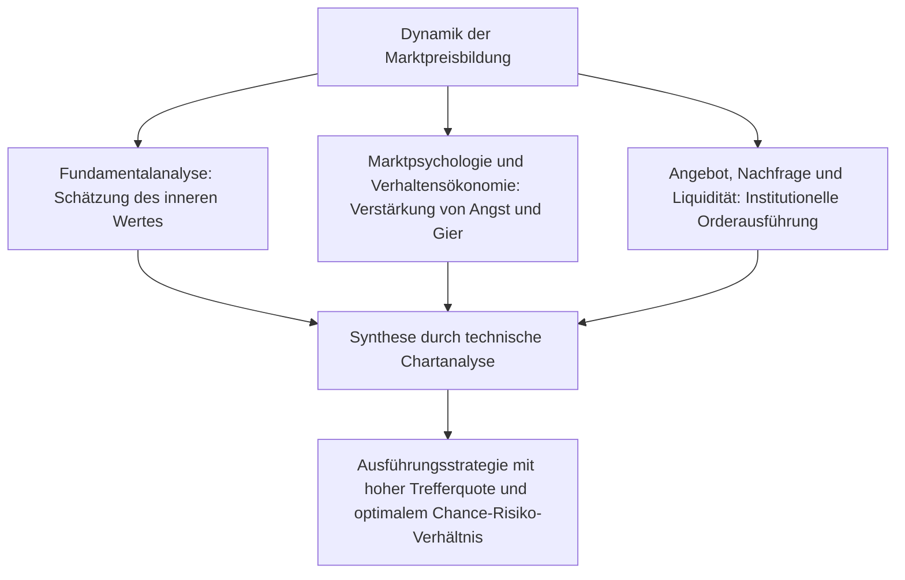
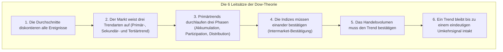
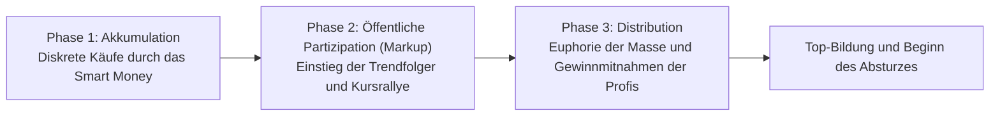
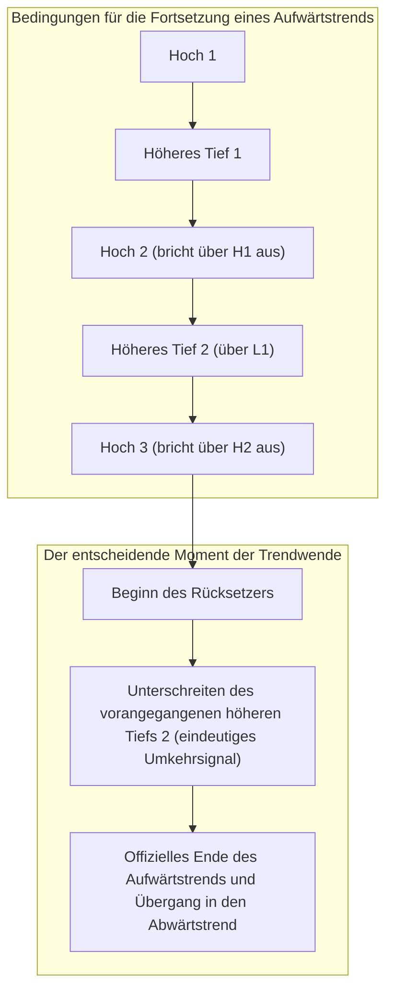
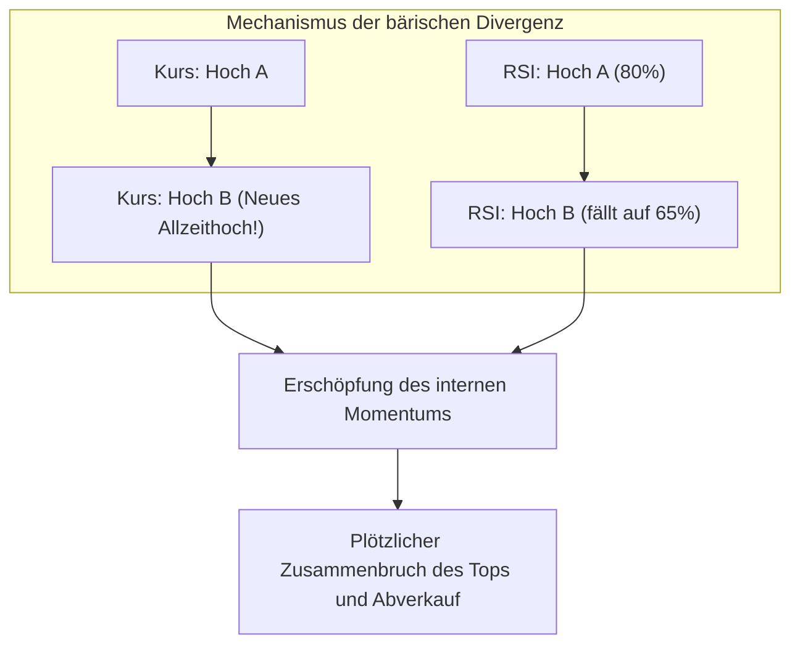
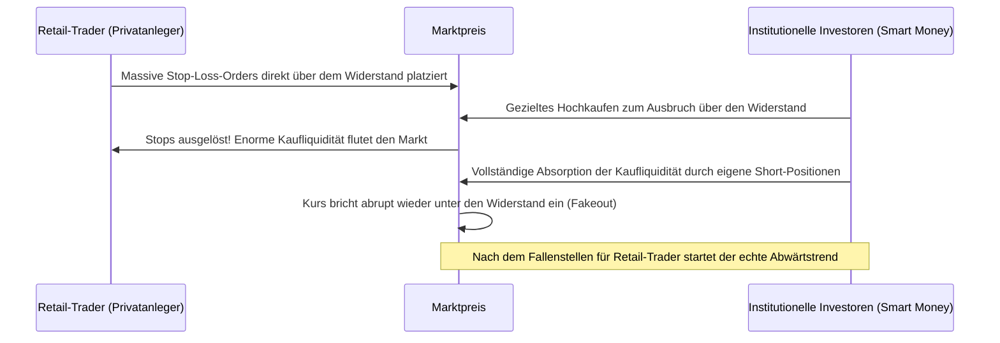
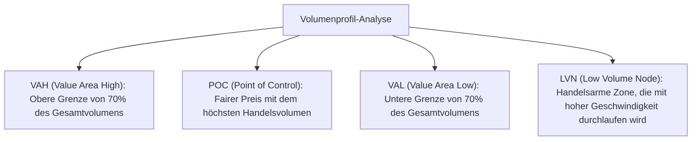

## 1. Einleitung: Philosophische Fundamente der technischen Analyse und das Wesen der Märkte

### 1.1 Der dialektische Konflikt und die Aufhebung von Fundamentalanalyse und technischer Analyse

Zur Entschlüsselung der Mechanismen der Preisbildung an den Finanzmärkten und zur Prognose künftiger Kursbewegungen haben sich historisch zwei große Denkschulen herausgebildet: die „Fundamentalanalyse“ (*Fundamental Analysis*) und die „technische Analyse“ (*Technical Analysis*).

Die Fundamentalanalyse ermittelt den „inneren Wert“ (*Intrinsic Value*) eines Vermögenswerts anhand von Unternehmensbilanzen, Cashflows, Zinsniveaus, BIP-Wachstum, Inflationsraten und geopolitischen Risiken. Anlageentscheidungen basieren auf der Identifikation von Marktineffizienzen, wenn der aktuelle Börsenkurs signifikant von diesem theoretischen Gleichgewichtspreis abweicht. Dieser Ansatz postuliert, dass Marktpreise kurzfristig zwar irrational schwanken können, sich langfristig jedoch unweigerlich den ökonomischen Fundamentaldaten und makroökonomischen Gleichgewichtspunkten annähern.

Im Gegensatz dazu befasst sich die technische Analyse ausschließlich mit der historischen und aktuellen Entwicklung von „Preis“ (*Price*), „Handelsvolumen“ (*Volume*) und „Zeit“ (*Time*). Für den technischen Analysten ist die primäre Triebkraft der Kurse nicht das fundamentale Ereignis an sich, sondern die Art und Weise, wie die Marktteilnehmer dieses Ereignis interpretieren: gefiltert durch menschliche Psychologie, Angst, Gier, kognitive Verzerrungen und reale Kapitalströme (*Liquidität*).

Im modernen institutionellen Trading auf höchstem Niveau stehen sich diese beiden Disziplinen nicht als unversöhnliche Gegensätze gegenüber, sondern müssen im Hegelschen Sinne eine dialektische „Aufhebung“ erfahren. Die Fundamentalanalyse lehrt den Händler, **was gehandelt werden soll** (die Asset-Auswahl), während die technische Analyse präzise bestimmt, **wann eingestiegen werden muss und wo das Verlustrisiko strikt zu begrenzen ist** (Timing und Risikomanagement). Selbst die fundamental solideste Aktie kann im Strudel eines übergeordneten säkularen Bärenmarktes über Jahre hinweg abstürzen. Das Sichtbarmachen dieser Abwärtsdynamik und Marktmechanik ist die eigentliche Kernkompetenz der technischen Analyse.



---

### 1.2 „Der Preis diskontiert alles“: Kritik der Effizienzmarkthypothese (EMH) und Verhaltensökonomie

Das erste Grundaxiom der technischen Analyse lautet: **„Der Marktpreis diskontiert augenblicklich alle verfügbaren Informationen — nicht nur publizierte Nachrichten, sondern auch Insiderwissen, spekulative Erwartungen, Naturkatastrophen, geopolitische Schocks und den kollektiven psychologischen Zustand der Marktteilnehmer.“**

In der akademischen Finanzökonomie dominierte über Jahrzehnte die „Effizienzmarkthypothese“ (*Efficient Market Hypothesis* - EMH). Gemäß deren schwacher Form (*Weak-Form*) sind alle historischen Preis- und Volumeninformationen bereits vollständig im aktuellen Kurs eingepreist, weshalb es unmöglich sei, mithilfe der technischen Analyse eine nachhaltige Überrendite (*Alpha*) gegenüber dem Marktdurchschnitt zu erzielen.

Die rasante Entwicklung der „Verhaltensökonomie“ (*Behavioral Economics*) und der „Behavioral Finance“ seit den 1980er-Jahren bewies jedoch experimentell, dass die Grundannahme rational handelnder Marktteilnehmer (*Homo oeconomicus*) in der Praxis fundamental verfehlt ist:
- Die von Daniel Kahneman und Amos Tversky entwickelte „Prospekt-Theorie“ (*Prospect Theory*) deckte eine entscheidende asymmetrische Wahrnehmungsverzerrung auf: Menschen agieren bei der Sicherung von Gewinnen stark risikoavers, neigen bei drohenden Verlusten jedoch zu hochgradig risikofreudigem Verhalten.
- Kognitive Verzerrungen wie der Verankerungseffekt (*Anchoring*), Herdenverhalten (*Herding Behavior*), Bestätigungsfehler (*Confirmation Bias*) und Selbstüberschätzung (*Overconfidence*) erzeugen an den Märkten zwangsläufig regelmäßige Zyklen von euphorischen Übertreibungen („Überkauftheit / Blasen“) und panikartigen Überreaktionen („Überverkauftheit / Crashs“).

Technische Analyse ist folglich keine Kristallkugel, die aus dem statistischen Rauschen die Zukunft vorhersagt. Sie ist **„die systematische statistische Dekodierung wiederkehrender geometrischer Verhaltensmuster, welche die universellen kognitiven Verzerrungen der menschlichen Masse als kollektives Handeln auf den Charts hinterlassen“**.

---

### 1.3 Die fraktale Strukturhypothese gegen die Random-Walk-Theorie (Mandelbrot)

Ein weiterer akademischer Kritikpunkt stützt sich auf die „Random-Walk-Theorie“ (Theorie der Zufallsbewegung). Diese besagt, dass Kursveränderungen einer Gaußschen Normalverteilung folgen und zwischen historischen und zukünftigen Kursverläufen keinerlei Autokorrelation existiert.

Diese klassische Hypothese wurde durch den Begründer der fraktalen Geometrie, Benoît Mandelbrot, schlüssig widerlegt. Mandelbrot analysierte jahrzehntelange Zeitreihen von Baumwollpreisen und Devisenkursen und lieferte den mathematischen Beweis für drei fundamentale Marktcharakteristika:

1. **Schwere Ränder (*Fat Tails*)**: Kursveränderungen an Finanzmärkten sind nicht normalverteilt. Extreme Marktbewegungen (*Black-Swan-Ereignisse*) treten mit einer Frequenz auf, die die Vorhersagen einer Normalverteilung um das Tausendfache übersteigt, und folgen stattdessen Potenzgesetzen (*Power Laws*).
2. **Volatilitäts-Clustering (*Volatility Clustering*)**: Auf große Kurssprünge folgen mit hoher Wahrscheinlichkeit weitere große Kurssprünge, und auf Phasen geringer Bewegung folgen Phasen geringer Bewegung — es existiert eine ausgeprägte Autokorrelation der Varianz.
3. **Selbstähnlichkeit (*Self-Similarity*)**: Betrachtet man einen 1-Minuten-Chart, einen Tageschart und einen Monatschart nebeneinander, bei denen die Zeitachsen unkenntlich gemacht wurden, ist selbst ein professioneller Händler nicht in der Lage zu erkennen, um welche Zeitebene es sich handelt. Die geometrischen Strukturen sind fraktal identisch.

Diese „fraktale Natur der Märkte“ liefert das objektive mathematische Fundament dafür, warum technische Analyse über alle Zeitebenen hinweg zuverlässig funktioniert. Übergeordnete Trends umschließen untergeordnete Trends wie Schachtelpuppen; in dem Moment, in dem diese Zeitebenen synchronisieren, entsteht explosives Richtungsmomentum.

---

## 2. Das Fundament der modernen Chartanalyse: Die 6 Leitsätze der Dow-Theorie und ihre zeitgemäße Reinterpretation

Der Ursprung aller modernen charttechnischen Methoden (Elliott-Wellen, Granville-Gesetze, moderne Price Action) geht auf die „Dow-Theorie“ (*Dow Theory*) zurück, die von Charles H. Dow (1851–1902), dem Gründer des *Wall Street Journal*, formuliert wurde. Dow selbst verfasste nie ein geschlossenes Buch, sondern hielt seine Beobachtungen in Leitartikeln fest. Nach seinem Tod systematisierten Samuel Nelson, William Peter Hamilton und Robert Rhea diese Erkenntnisse in sechs universellen Leitsätzen.



---

### 2.1 Leitsatz 1: Die Durchschnitte (Marktpreise) diskontieren alle Ereignisse

Marktindizes wie der Dow Jones spiegeln zu jedem Zeitpunkt die gesamtwirtschaftliche Lage, Unternehmensgewinne, Zinsentscheidungen, Naturkatastrophen, Kriege sowie die kollektive Psychologie und das Handeln aller Marktteilnehmer vollständig wider. Jede Veröffentlichung von Konjunkturdaten oder Eilmeldungen wird im Augenblick ihres Bekanntwerdens sofort im Kurs absorbiert. Wer erst auf fundamentale Bestätigungsmeldungen wartet, agiert strukturell mit zeitlicher Verzögerung. Die unmittelbare Beobachtung des Kursverlaufs ist die früheste und umfassendste Form der Informationsverarbeitung.

---

### 2.2 Leitsatz 2: Der Markt weist drei Trendarten auf

In Analogie zu den Bewegungen des Ozeans unterteilte Dow Markttrends in drei hierarchische Ebenen:

1. **Primärtrend (*Primary Trend* : Ebbe und Flut / Die Gezeiten)**: Ein fundamentaler Trend, der zwischen einem Jahr und mehreren Jahren andauert. Er bestimmt die makroskopische Hauptrichtung des Gesamtmarktes.
2. **Sekundärtrend (*Secondary Trend* : Die Wellen)**: Eine mittelfristige Korrekturbewegung entgegen der Richtung des Primärtrends. Er dauert üblicherweise drei Wochen bis drei Monate und korrigiert typischerweise ein Drittel bis zwei Drittel (oft die Hälfte) der vorangegangenen Primärbewegung.
3. **Tertiärtrend (*Minor Trend* : Die Kräuselwellen / Das Plätschern)**: Kurzfristige Kursbewegungen von weniger als drei Wochen (von wenigen Stunden bis zu einigen Tagen). Dieser Bereich wird von täglichem Marktrauschen und kurzfristiger Spekulation dominiert, ist hochgradig anfällig für Marktmanipulationen und birgt isoliert betrachtet immense Verlustrisiken.

Im modernen Trading bildet diese Systematik das Fundament der **Multi-Timeframe-Analyse (MTF)**: Den Gezeitenstrom auf dem Wochen- und Tageschart (*Weekly/Daily*) bestimmen, auf dem 4-Stunden-Chart (*4H*) auf das Zurückweichen der Welle für einen optimalen Einstieg warten und auf dem 15-Minuten- oder 5-Minuten-Chart (*15m/5m*) das präzise Timing des Einstiegs triggern.

---

### 2.3 Leitsatz 3: Primärtrends durchlaufen drei Phasen

Ein übergeordneter Primärtrend (insbesondere ein Bullenmarkt) durchläuft drei klar voneinander abgrenzbare psychologische Phasen:



- **Phase 1: Akkumulation (*Accumulation*)**: Mitten in einer tiefen Rezession oder nach einem verheerenden Crash, wenn Panik und Pessimismus den Markt lähmen, kaufen die weitsichtigsten und bestinformierten Investoren (*das Smart Money / Institutionelle*) massiv unterbewertete Vermögenswerte geräuschlos auf. Die Kurse bewegen sich seitwärts in einer engen Spanne, und die Volatilität sinkt auf historische Tiefststände.
- **Phase 2: Öffentliche Partizipation (*Public Participation / Markup*)**: Wirtschaftsdaten beginnen sich aufzuhellen und Unternehmensgewinne ziehen messbar an. Trendfolgende technische Trader steigen synchron in den Markt ein. Der Kurs steigt dynamisch und gleichmäßig an — es ist die längste, stabilste und profitabelste Phase des gesamten Trends.
- **Phase 3: Distribution (*Distribution*)**: Die breite Massenpresse berichtet täglich auf den Titelseiten über die sagenhaften Kursgewinne. Unerfahrene Kleinanleger (*das Dumb Money*) verfallen in FOMO (*Fear of Missing Out*) und stürmen ungebremst an den Markt. In dieser Phase veräußert das Smart Money, das in Phase 1 billig akkumuliert hatte, seine Positionen diskret in die gigantische Nachfragewelle der ahnungslosen Masse hinein. Auf dem Chart treten extreme Kursschwankungen und lange obere Dochte auf — das Ende des Trends ist besiegelt.

---

### 2.4 Leitsatz 4: Die Indizes müssen einander bestätigen

Zu Charles Dows Lebzeiten stützte sich dieses Prinzip auf den Vergleich zwischen dem Industrieindex (*Dow Jones Industrial Average*) und dem Eisenbahnindex (*Dow Jones Transportation Average*). Unabhängig davon, wie viele Güter in den Fabriken produziert wurden: Solange diese Güter nicht per Bahn zu den Konsumenten transportiert wurden, war der wirtschaftliche Aufschwung nicht von Dauer. Markierte der Industrieindex ein neues Allzeithoch, musste der Transportindex zeitnah ebenfalls ein neues Hoch ausbilden, um einen nachhaltigen Bullenmarkt zu bestätigen.

In der modernen Praxis hat sich dieser Grundsatz zur **Intermarket-Analyse** und zur **Marktbreite-Analyse (*Market Internals*)** weiterentwickelt:
- Wird ein neues Rekordhoch im S&P 500 durch den technologielastigen NASDAQ und den Nebenwerte-Index Russell 2000 bestätigt?
- Ist eine Aufwertung des US-Dollars gegenüber dem Yen (USD/JPY) im Devisenmarkt konsistent mit steigenden US-Anleiherenditen und dem Dollar-Index (DXY)?
- Zieht bei einer Rallye von Bitcoin der gesamte Krypto-Sektor inklusive Ethereum und liquider Altcoins synchron mit?

Ein isolierter Ausbruch ohne wechselseitige Bestätigung (*Confirmation*) entpuppt sich mit hoher statistischer Wahrscheinlichkeit als institutionelle Bullenfalle (*Bull Trap*).

---

### 2.5 Leitsatz 5: Das Volumen muss den Trend bestätigen

Der Preis zeigt die **Richtung** des Trends an, während das Handelsvolumen (*Volume*) Aufschluss über die **Authentizität und Intensität** der Bewegung gibt.

- **In einem gesunden Aufwärtstrend**: Das Handelsvolumen steigt bei Kursanstiegen spürbar an und trocknet bei Konsolidierungen und Rücksetzern aus.
- **In einem gesunden Abwärtstrend**: Das Volumen weitet sich bei Kursstürzen massiv aus und geht bei technischen Gegenbewegungen zurück.

Erreicht ein Markt neue Höchststände bei kontinuierlich sinkendem Handelsvolumen, liegt eine ernste Warnung vor (**Volumendivergenz**): Die Kaufkraft des Marktes ist erschöpft, und der scheinbare Anstieg resultiert lediglich aus einer vorübergehenden Abwesenheit aggressiver Verkäufer. Richard Wyckoff baute diesen Leitsatz zur methodischen VSA-Analyse (*Volume Spread Analysis*) aus, um aus dem Zusammenspiel von Preisspanne und Volumen die Absichten institutioneller Akteure offenzulegen.

---

### 2.6 Leitsatz 6: Ein Trend bleibt bis zu einem eindeutigen Umkehrsignal intakt

Für die praktische Ausführung auf den Charts ist dieser sechste Grundsatz das wichtigste Dogma, das ausnahmslos zu befolgen ist.

Die mathematische Definition eines Trends nach Dow ist bestechend logisch und unmissverständlich:
- **Definition eines Aufwärtstrends**: **Eine ununterbrochene Folge von höheren Hochs (*Higher Highs*) und höheren Tiefs (*Higher Lows*)**.
- **Definition eines Abwärtstrends**: **Eine ununterbrochene Folge von tieferen Hochs (*Lower Highs*) und tieferen Tiefs (*Lower Lows*)**.



Egal wie weit ein Kurs explodiert ist und wie subjektiv „überteuert“ er erscheinen mag: Solange das vorangegangene signifikante höhere Zwischentief (*Higher Low*) nicht per Schlusskurs klar nach unten durchbrochen wird, setzt sich der Aufwärtstrend unvermindert fort. Der Versuch, eigenmächtig und ohne Signal ein Top zu erraten, ist der gefährlichste finanzielle Suizid im Trading.

---

## 3. Die Elliott-Wellen-Theorie und die Mystik der Fibonacci-Mathematik

### 3.1 Die kosmische Ordnung nach Ralph Nelson Elliott

Während die Dow-Theorie die Richtung und Umkehr von Trends definierte, systematisierte Ralph Nelson Elliott (1871–1948) den Rhythmus und die fraktale Geometrie von Kursbewegungen in höchster Vollendung. Durch eine schwere Erkrankung ans Bett gefesselt, analysierte Elliott in akribischer Handarbeit 75 Jahre Monats-, Wochen-, Tages- und sogar 30-Minuten-Charts des Dow Jones, bevor er 1938 sein epochales Werk *The Wave Principle* („Das Wellenprinzip“) veröffentlichte.

Elliott postulierte, dass kollektives menschliches Sozial- und Marktverhalten denselben universellen Naturgesetzen unterliegt wie biologische Wachstumsprozesse (die Spirale von Nautilus-Muscheln, die Blattstellung von Pflanzen oder Galaxienspiralen), die durch den Goldenen Schnitt und die Fibonacci-Folge gesteuert werden. Märkte sind kein unberechenbares Chaos, sondern folgen einem **universellen Grundzyklus aus 8 Wellen: 5 Antriebswellen (*Impulse Waves*) und 3 Korrekturwellen (*Corrective Waves*)**, die sich fraktal bis ins Unendliche wiederholen.

```mermaid
flowchart LR
    subgraph Antriebswellen (Trendrichtung: 5-Wellen-Muster)
        W1["Welle 1<br/>(Initialimpuls)"] --> W2["Welle 2<br/>(Tiefe Korrektur)"]
        W2 --> W3["Welle 3<br/>(Stärkste Explosion)"]
        W3 --> W4["Welle 4<br/>(Komplexe Konsolidierung)"]
        W4 --> W5["Welle 5<br/>(Letzte Euphorie)"]
    end
    subgraph Korrekturwellen (Gegentrend: 3-Wellen-Muster)
        W5 --> WA["Welle A<br/>(Abwärtsimpuls)"]
        WA --> WB["Welle B<br/>(Trügerische Erholung)"]
        WB --> WC["Welle C<br/>(Verheerender Abverkauf)"]
    end
```

---

### 3.2 Die Struktur der Impulswelle und die 3 eisernen Grundregeln

Für die Standardform einer Antriebswelle (die sich in Richtung des übergeordneten Trends bewegt) existieren **drei unumstößliche, unverletzliche Axiome**. Wird auch nur eine einzige dieser Regeln verletzt, ist die gesamte Wellenzählung falsch und die Analyse muss verworfen werden:

1. **Regel 1: Welle 2 korrigiert niemals mehr als 100% von Welle 1.** (Wird der Ursprung von Welle 1 nach unten durchbrochen, handelt es sich nicht um eine Welle 1, sondern um die Fortsetzung des vorherigen Abwärtstrends).
2. **Regel 2: Welle 3 ist NIEMALS die kürzeste Welle unter den Wellen 1, 3 und 5.** (In der Regel ist Welle 3 die mit Abstand dynamischste und längste Welle mit einer starken Ausdehnung / Extension).
3. **Regel 3: Welle 4 dringt niemals in das Kursgebiet von Welle 1 ein.** (In dem Moment, in dem das Tief von Welle 4 das Hoch von Welle 1 unterschreitet, verliert die Struktur ihren Impulscharakter und wird zu einer Diagonalen).

#### Die psychologischen Charakteristika der Wellen:
- **Welle 1**: Die Keimzelle der Trendwende. Die fundamentalen Nachrichten sind nach wie vor katastrophal. Die Mehrheit der Händler hält den Anstieg für eine bedeutungslose Bärenmarktrallye; die Dynamik ist noch gedämpft.
- **Welle 2**: Aggressiver Rücksetzer von Welle 1. Aus Angst vor der Wiederaufnahme des Abwärtstrends setzt Panik ein. Welle 2 korrigiert sehr tief und eliminiert häufig $50\%$ bis $61.8\%$ (mitunter $78.6\%$) der Welle 1, hält jedoch deren Ausgangspunkt strikt ein.
- **Welle 3**: Technische Indikatoren generieren zeitgleich massive Kaufsignale, markante Widerstände werden zertrümmert und Trendfolger springen geschlossen auf den fahrenden Zug auf. Das Handelsvolumen explodiert, Kurslücken (*Gaps*) entstehen und der Kurs schießt steil nach oben. Dies ist die goldene Welle, in der institutionelle Profis die größten Positionen aufbauen und maximale Profite realisieren.
- **Welle 4**: Gewinnmitnahmen der gewaltigen Buchgewinne aus Welle 3 treffen auf verspätete Dip-Käufer. Es entsteht eine zeitraubende, zähe Seitwärtskonsolidierung, die häufig komplexe Dreiecke ausbildet (Alternationsgesetz: War Welle 2 eine einfache, steile Korrektur, verläuft Welle 4 komplex und seitwärtsgerichtet).
- **Welle 5**: Die mediale Berichterstattung erreicht den Siedepunkt und die breite Öffentlichkeit kauft euphorisch die Höchstkurse. Es ist das letzte Aufbäumen der Rallye. Momentum-Indikatoren wie RSI und MACD bestätigen die neuen Kurshochs jedoch nicht mehr und bilden eine eklatante bärische Divergenz aus — die interne Energie ist verbraucht.

---

### 3.3 Taxonomie der Korrekturwellen

Nach Abschluss der 5-teiligen Antriebsbewegung setzt eine Korrekturphase ein, die strukturell wesentlich facettenreicher und komplexer verläuft als die Impulsphase. Elliott klassifizierte diese in drei Hauptkategorien:

1. **Zickzack (*Zigzag* : Struktur 5-3-5)**: Eine steile und tiefe Korrektur. Welle A (5-welliger Abwärtsimpuls) $\rightarrow$ Welle B (3-wellige Gegenbewegung, retraced $38.2\%$ bis $50\%$ von A) $\rightarrow$ Welle C (5-welliger Ausverkauf, entspricht meist der Länge von Welle A).
2. **Flat / Flachkorrektur (*Flat* : Struktur 3-3-5)**: Eine zähe Seitwärtskonsolidierung. Welle A (3 Wellen) $\rightarrow$ Welle B (3 Wellen, läuft bis nahe an den Ursprung von A zurück) $\rightarrow$ Welle C (5 Wellen, unterschreitet das Tief von A nur marginal). In starken Bullenmärkten tritt gehäuft das *Expanded Flat* (Erweitertes Flat) auf, bei dem Welle B das Hoch von Welle A bricht, bevor Welle C im Anschluss scharf nach unten durchsackt.
3. **Dreieck (*Triangle* : Struktur 3-3-3-3-3)**: Ein Zustand des Kräftegleichgewichts, bei dem die Volatilität in fünf Teilwellen (A-B-C-D-E) kontinuierlich konvergiert. Dreiecke treten ausschließlich unmittelbar vor der finalen Welle eines übergeordneten Musters auf (in Welle 4 oder Welle B). Der anschließende Ausbruch erzeugt den letzten gewaltigen Kursschub (*Thrust* in Welle 5).

---

### 3.4 Fibonacci-Verhältnisse und Kurszielprojektionen

Die überragende Bedeutung der Elliott-Wellen-Theorie resultiert aus ihrer Verknüpfung mit der Fibonacci-Zahlenfolge ($0, 1, 1, 2, 3, 5, 8, 13, 21, 34, 55, 89, 144\dots$) und dem Goldenen Schnitt, wodurch künftige Korrekturziele und Preiserweiterungen mathematisch mit bestechender Exaktheit prognostiziert werden können.

Zentrale Fibonacci-Verhältnisse:
- $\phi = \frac{\sqrt{5}-1}{2} \approx 0.618$
- $1 - \phi \approx 0.382$
- $\sqrt{0.618} \approx 0.786$
- $1.618$ (Kehrwert des Goldenen Schnitts / Standard-Erweiterungsfaktor)
- $2.618, 4.236$

#### Formeln zur Berechnung von Kurszielen in der Praxis:
1. **Rücklaufziel von Welle 2**: **$61.8\%$** oder **$50.0\%$**, maximal **$78.6\%$** der vertikalen Distanz von Welle 1.
2. **Zielprojektion für Welle 3**: Sei $W_1$ die Amplitude von Welle 1 und $L_2$ das Tief von Welle 2:
   $$Target(W_3) = L_2 + 1.618 \times W_1$$
   Bei extrem dynamischen Trendbeschleunigungen gilt:
   $$Target(W_3) = L_2 + 2.618 \times W_1$$
3. **Rücklaufziel von Welle 4**: **$38.2\%$** der Gesamtlänge von Welle 3 (flacher Rücksetzer); fällt häufig mit dem Tief der untergeordneten Welle 4 innerhalb von Welle 3 zusammen.
4. **Zielprojektion für Welle 5**: **$61.8\%$** der gesamten Nettodistanz von Beginn Welle 1 bis zum Hoch von Welle 3, projiziert ab dem Tiefpunkt von Welle 4.

---

## 4. Östliche Weisheit: Candlestick-Morphologie und die Sakata-Fünf-Methoden

Während die westliche technische Analyse ihren Anfang bei einfachen Linien- und Balkencharts nahm, blühte im Japan des 18. Jahrhunderts während der Edo-Zeit an der Dojima-Reisbörse in Osaka der weltweit erste organisierte Terminhandel sowie eine eigenständige Chartanalyse auf. Die legendäre Schlüsselfigur dieser Epoche war Munehisa Homma (1724–1803). Seine Handelsphilosophie wurde im *San-en Kinsen Hiroku* niedergelegt und bildete das Fundament für die später kodifizierten „Sakata-Fünf-Methoden“ (*Sakata Goho*).

---

### 4.1 Die interne Dynamik der Candlesticks (Kerzenchart)

Eine einzelne Kerze visualisiert die vier zentralen Kurspunkte einer festen Zeiteinheit: Eröffnungskurs (*Open*), Höchstkurs (*High*), Tiefstkurs (*Low*) und Schlusskurs (*Close*) in Form eines rechteckigen Kerzenkörpers (*Real Body*) und den oberen und unteren Schatten (*Shadows*, Lunte und Docht).

Als Steve Nison diese Methodik Ende der 1980er-Jahre mit seinem Bestseller *Japanese Candlestick Charting Techniques* in der westlichen Welt publik machte, erkannten Händler an der Wall Street schlagartig die unübertroffene Informationsdichte dieses Systems. Heute sind Kerzencharts der weltweite Standard.

| Kerzenformation | Morphologische Merkmale | Marktpsychologie und Kräftespiel |
| :--- | :--- | :--- |
| **Marubozu (Volle Kerze)** | Extrem langer Kerzenkörper, praktisch keine oberen oder unteren Schatten vorhanden. | Die Käufer dominierten den Markt vom ersten bis zum letzten Tick ausnahmslos. Signalisiert überwältigende bullische Stärke. |
| **Hammer / Pinbar** | Kleiner Kerzenkörper am oberen Ende, ausgestattet mit einer langen Lunte (mindestens doppelt so lang wie der Körper). | Verkäufer drückten den Kurs während der Periode massiv nach unten, trafen dort jedoch auf geballte institutionelle Nachfrage, die das gesamte Angebot absorbierte und den Kurs an den Eröffnungswert zurücktrieb. **Hocheffektives Signal für eine Bodenbildung und bullische Trendwende**. |
| **Shooting Star (Sternschnuppe)** | Kleiner Kerzenkörper am unteren Ende, ausgestattet mit einem langen Docht (mindestens doppelt so lang wie der Körper). | Käufer versuchten einen dynamischen Ausbruch nach oben, wurden an den Höchstständen jedoch von massiver institutioneller Abgabebereitschaft überrollt und bis zum Schlusskurs niedergedrückt. **Signal für eine Top-Bildung und bärische Trendwende**. |
| **Doji (Kreuzkerze)** | Eröffnungs- und Schlusskurs liegen exakt auf demselben Niveau. Der Kerzenkörper schrumpft zu einer horizontalen Linie. | Vollkommenes Gleichgewicht zwischen Käufern und Verkäufern. Zeigt akute Unentschlossenheit an und kündigt oft eine bevorstehende impulsive Entladung an. |

---

### 4.2 Die Quintessenz der Sakata-Fünf-Methoden

Die Sakata-Fünf-Methoden analysieren Kombinationen mehrerer Kerzen, um fundamentale Wendepunkte im Kräfteverhältnis des Marktes zu entschlüsseln:

1. **San-zan (Drei Berge)**: Dreimaliges Scheitern des Kurses an einer signifikanten Widerstandszone. Ist der mittlere Berg am höchsten ausgebildet, spricht man von den „Drei Buddhas“ — dem historischen Vorläufer der westlichen Schulter-Kopf-Schulter-Formation (*Head and Shoulders*). Der Bruch der Nackenlinie löst einen schweren Abwärtstrend aus.
2. **San-sen (Drei Flüsse)**: Dreimaliges Testen einer markanten Unterstützungszone am Markttief (Dreifachboden oder inverse Schulter-Kopf-Schulter). Hierzu zählt auch das *Morning Star*-Muster: Eine lange rote Kerze, gefolgt von einer kleinen Kerze mit Kurslücke und einer kräftigen grünen Kerze, die das finale Ende der Bären signalisiert.
3. **San-ku (Drei Lücken / Gaps)**: Das Auftreten von drei aufeinanderfolgenden Kurslücken in Trendrichtung. Eine uralte japanische Börsenweisheit besagt: „Verkaufe in die dritte Aufwärtslücke hinein, kaufe in die dritte Abwärtslücke hinein“. Dies markiert die finale Überhitzung der Masse und den emotionalen Erschöpfungspunkt des Trends.
4. **San-pei (Drei Soldaten)**: Die „Drei Weißen Soldaten“ (*Akasanpei* : drei aufeinanderfolgende, kräftige Aufwärtskerzen) signalisieren den kraftvollen Beginn eines Bullenmarktes aus einem Tief heraus. Trägt die dritte Kerze jedoch einen langen oberen Docht, spricht man von *Akasanpei Sakizumari* (stockende Soldaten), was zu erhöhter Wachsamkeit vor Trenderschöpfung mahnt. Am Markthoch kündigen die „Drei Schwarzen Krähen“ (*San-kuro*) einen freien Fall an.
5. **San-po (Drei Methoden)**: Die praktische Verkörperung des Prinzips „Abwarten und Nichtstun ist ebenfalls Trading“. Bei den „Steigenden Drei Methoden“ folgt auf eine große grüne Kerze eine Ruhepause aus drei kleinen roten Kerzen, die vollständig innerhalb der Spanne der ersten Kerze verbleiben, ehe eine fünfte impulsive grüne Kerze das vorherige Hoch bricht. Dies dient der Identifikation gesunder Trendpausen zur Vermeidung verfrühter Ausstiege.

---

## 5. Mathematische Struktur technischer Indikatoren und praktische Fallstricke

Indikatoren werden grob in zwei Klassen unterteilt: **Trendfolger** (*Trend-Following*) und **Oszillatoren** (*Momentum / Überkauft-Überverkauft*). Ein fataler Fehler vieler Trading-Anfänger besteht darin, Indikatorsignale isoliert zu interpretieren, ohne die dahinterliegende mathematische Konstruktion zu begreifen. Wir durchleuchten nachfolgend die mathematische Architektur der wichtigsten Werkzeuge.

### 5.1 Mathematik trendfolgender Indikatoren

#### ① Gleitende Durchschnitte (SMA vs. EMA)
Die Formel des einfachen gleitenden Durchschnitts (*Simple Moving Average* - SMA) über $n$ Perioden lautet:
$$SMA_t = \frac{1}{n} \sum_{i=0}^{n-1} P_{t-i}$$
Die fundamentale Schwachstelle des SMA liegt darin, dass er dem aktuellsten Kurs und dem Kurs von vor $n$ Tagen exakt dasselbe statistische Gewicht ($1/n$) zuweist. Dadurch reagiert er mit einer erheblichen zeitlichen Verzögerung (*Lag*) auf Marktveränderungen.

Der exponentiell geglättete gleitende Durchschnitt (*Exponential Moving Average* - EMA) behebt dieses Problem, indem er dem jüngsten Kurs $P_t$ das größte Gewicht einräumt und die historischen Werte exponentiell abklingen lässt. Bei einem Glättungsfaktor von $\alpha = \frac{2}{n+1}$ gilt rekursiv:
$$EMA_t = \alpha P_t + (1 - \alpha) EMA_{t-1}$$
Da der EMA wesentlich empfindlicher auf abrupte Preisbewegungen reagiert, setzen professionelle Händler und quantitative Handelsalgorithmen fast ausschließlich auf EMAs (insbesondere den 20er, 50er und 200er EMA).

#### ② Bollinger-Bänder (Bollinger Bands)
Die in den 1980er-Jahren von John Bollinger entwickelten Bollinger-Bänder legen um einen gleitenden Durchschnitt einen Kanal, dessen Breite durch die statistische Standardabweichung ($\sigma$) bestimmt wird:
$$Middle = SMA_n(P)$$
$$\sigma = \sqrt{\frac{1}{n} \sum_{i=0}^{n-1} (P_{t-i} - Middle)^2}$$
$$Upper = Middle + k \cdot \sigma, \quad Lower = Middle - k \cdot \sigma \quad (\text{üblicherweise } k=2)$$

Unter der Annahme einer Gaußschen Normalverteilung befinden sich theoretisch **$95.44\%$** aller Kursbeobachtungen innerhalb des Intervalls von $\pm 2\sigma$.
Hierin liegt die gefährlichste Falle des klassischen Tradings: **Finanzmarktrenditen sind nicht normalverteilt, sondern weisen schwere Ränder (*Fat Tails*) auf**.
Die Vorstellung, beim Erreichen von $+2\sigma$ reflexartig short zu gehen, weil der Markt „statistisch überkauft“ sei, führt im Trendverlauf zum Totalverlust. Bei starken Trends läuft der Kurs unter kontinuierlicher Ausweitung der Bänder an der Außenseite von $+2\sigma$ entlang nach oben (**Band-Walk**). Der wirkliche professionelle Nutzen von Bollinger-Bändern besteht darin, Phasen extremer Bandverengung (**Squeeze**: Einbruch der Volatilität) zu lokalisieren, um beim anschließenden explosionsartigen Auseinanderdriften der Bänder (**Expansion**) mit dem Trend einzusteigen.

---

### 5.2 Mathematik oszillierender Indikatoren

#### ① RSI (Relative Strength Index : Relativer-Stärke-Index)
Der von J. Welles Wilder entwickelte RSI vergleicht über eine definierte Spanne (üblicherweise 14 Perioden) die Summe der positiven Kursschlüsse mit der Summe der negativen Abschlüsse und normiert das relative Kurswachstum auf eine Skala von $0$ bis $100\%$:
$$RS = \frac{\text{Durchschnittlicher Kursgewinn der letzten } n \text{ Perioden}}{\text{Durchschnittlicher Kursverlust der letzten } n \text{ Perioden}}$$
$$RSI = 100 - \frac{100}{1 + RS} = \frac{\text{Durchschnittlicher Kursgewinn}}{\text{Durchschnittlicher Kursgewinn} + \text{Durchschnittlicher Kursverlust}} \times 100$$

Während Lehrbücher vereinfacht behaupten, Werte über $70\%$ bedeuteten „überkauft“ und unter $30\%$ „überverkauft“, kann der RSI in starken Parabeltrends wochenlang über $80\%$ verharren, während sich der Kurs vervielfacht.
Das verlässlichste Signal des RSI liegt in der Erkennung von **„Divergenzen“**:
- **Bärische Divergenz**: Der Marktpreis markiert ein neues relatives Hoch, während das Hoch im RSI niedriger ausfällt als das vorherige. Dies belegt unmissverständlich, dass der interne Kaufdruck (*das Momentum*) erlahmt ist und eine scharfe Korrektur oder Trendwende unmittelbar bevorsteht.



---

## 6. Moderne Price-Action-Theorie und Smart Money Concepts (SMC)

Seit den 2010er-Jahren werden über $80\%$ des weltweiten Handelsvolumens von hochfrequenten Algorithmen (HFT) und künstlicher Intelligenz kontrolliert. Dies hat die Trefferquote klassischer Indikatoren dramatisch reduziert. An deren Stelle trat die moderne Price-Action-Theorie und die **Smart Money Concepts (SMC)**, die sich auf das ungefilterte Studium von nackten Charts und Orderströmen konzentrieren.

### 6.1 Liquiditätsjagd und Stop-Hunting (Liquidity Sweep)

Das Kernaxiom von SMC lautet: **„Der Markt bewegt sich gezielt und unausweichlich zu den Preiszonen, an denen sich die größte Dichte an Stop-Loss-Orders (Liquidität) befindet.“**

Kleinanleger (*Retail-Trader*) lernen aus identischen Büchern und platzieren ihre Stop-Loss-Orders berechenbar an denselben markanten Punkten: knapp über offensichtlichen Doppel-Tops oder knapp unter horizontalen Range-Unterstützungen. Institutionelle Schwergewichte (*Smart Money*), die Milliardensummen bewegen müssen, können ihre gigantischen Positionen jedoch nur dann ohne massiven Kurssprung (*Slippage*) in den Markt drücken, wenn sie auf eine konzentrierte Masse gegenteiliger Stop-Orders treffen.

1. **Der Liquiditätsabgriff (*Liquidity Sweep*)**: Institutionelle Akteure kaufen oder verkaufen gezielt, um den Kurs ganz kurz über ein wichtiges Hoch oder unter ein signifikantes Tief schnellen zu lassen.
2. Dadurch lösen sie eine Kaskade von Stop-Orders der Retail-Trader aus, was den Markt schlagartig mit immenser Liquidität flutet.
3. Die Institutionen absorbieren diese Liquidität vollständig als Gegenpartei, um ihre eigenen Positionen aufzubauen.
4. Der Kurs wird unverzüglich zurück in die vorherige Spanne gerissen (*Fehlausbruch / Fakeout*). Auf dem Chart bleibt lediglich ein auffällig langer Docht (*Pinbar*) zurück, während der Markt in atemberaubendem Tempo in die Gegenrichtung abdreht.



---

### 6.2 Fair Value Gap (FVG) und Order Blocks

Innerhalb von SMC sind zwei Marktstrukturen für die präzise Positionierung elementar:

- **Fair Value Gap (FVG : Ungleichgewichtszone / Imbalance)**: Wenn Institutionen schlagartig massive Ordervolumina in den Markt feuern, entsteht bei einer Sequenz aus drei Kerzen eine Kurslücke zwischen dem Hoch der ersten Kerze und dem Tief der dritten Kerze. In dieser Zone fand keinerlei ausgeglichener Handel statt. Da Matching-Algorithmen solche Ineffizienzen bereinigen, kehrt der Kurs statistisch mit hoher Zuverlässigkeit zurück, um diese Lücke zu schließen. Dieser Rücklauf bietet Einstiege mit minimalem Risikoabstand.
- **Order Block (OB : Orderblock)**: Die letzte gegengerichtete Kerze unmittelbar vor dem explosiven institutionellen Impulsausbruch. Dieses Niveau markiert die Herkunft massiver Liquidität und fungiert bei künftigen Retests als felsenfeste Unterstützung bzw. massiver Widerstand.

---

## 7. Die Königsdisziplin über Sieg und Niederlage: Chance-Risiko-Verhältnis und die Mathematik des Risikomanagements

Selbst mit einer perfekten Beherrschung der technischen Analyse führt das Ignorieren mathematischer Kapitalmanagement-Regeln mit einer Wahrscheinlichkeit von exakt $100\%$ zum Totalverlust des Kontos. Trading ist kein Wahrsagespiel, sondern ein quantitatives Wahrscheinlichkeitsgeschäft, bei dem ein statistischer Vorteil (*Edge*) mit positivem Erwartungswert unter strikter Einhaltung einer Ruinwahrscheinlichkeit von Null kontinuierlich wiederholt wird.

### 7.1 Mathematischer Beweis von Balsaras Ruinwahrscheinlichkeit (Risk of Ruin)

Der Mathematiker Nauzer Balsara entwickelte ein mathematisches Modell, das die Wahrscheinlichkeit eines vollständigen Kontoruins in Abhängigkeit von drei Variablen berechnet: der **Trefferquote** (*Win Rate*), dem **Gewinn-Verlust-Verhältnis** (*Payoff Ratio* / Chance-Risiko-Verhältnis) und dem **prozentualen Risiko pro Trade**.

- **Trefferquote ($W$)**: Anzahl profitabler Trades $\div$ Gesamtzahl der Trades
- **Gewinn-Verlust-Verhältnis ($R$)**: Durchschnittlicher Gewinn $\div$ Durchschnittlicher Verlust

Die nachstehende Tabelle zeigt Balsaras Ruinwahrscheinlichkeit unter der Prämisse, dass pro Einzeltrade jeweils $20\%$ des Gesamtkapitals riskiert werden:

| Trefferquote \ Payoff-Ratio ($R$) | 0.5 (Große Verluste / Kleine Gewinne) | 1.0 (Gewinn = Verlust) | 1.5 (Gewinne übersteigen Verluste) | 2.0 (Idealer Gewinnüberschuss) | 3.0 (Exzellentes Chance-Risiko) |
| :---: | :---: | :---: | :---: | :---: | :---: |
| **30%** | 100% | 100% | 100% | 80.0% | 14.3% |
| **40%** | 100% | 100% | 38.2% | 14.1% | 1.2% |
| **50%** | 100% | 50.0% | 5.6% | 0.8% | **0.0%** |
| **60%** | 100% | 2.1% | 0.1% | **0.0%** | **0.0%** |
| **70%** | 14.3% | **0.0%** | **0.0%** | **0.0%** | **0.0%** |

Diese Matrix verdeutlicht eine brutale Realität: **Selbst bei einer scheinbar exzellenten Trefferquote von $60\%$ führt ein Payoff-Ratio von $0.5$ (1 gewinnen, um 2 zu riskieren) unausweichlich zu einer Ruinwahrscheinlichkeit von $100\%$.** Dies erklärt mathematisch, warum Anfänger, die Strategien mit angeblich $90\%$ Gewinnquote nachjagen, am Ende ihr gesamtes Kapital in einem einzigen unkontrollierten Absturz vernichten.

Umgekehrt gilt: **Liegt die Trefferquote bei nur $40\%$, aber das Payoff-Ratio bei $2.0$ (der durchschnittliche Gewinn ist doppelt so groß wie der Verlust), sinkt das Ruinrisiko auf $14\%$. Steigt das Payoff-Ratio auf $3.0$, beträgt die Ruinwahrscheinlichkeit lediglich $1.2\%$ — das Konto wächst langfristig mit mathematischer Gewissheit.**

---

### 7.2 Die 2%-Regel und quantitative Positionsgrößenbestimmung

Das unantastbare Grundgesetz professionellen Risikomanagements besagt: **„Der maximale Verlust eines einzelnen Trades darf zu keinem Zeitpunkt $1\%$ bis $2\%$ des Gesamtkapitals überschreiten“** (die 2%-Regel).

Unerfahrene Händler begehen regelmäßig den Fehler, mit starren Positionsgrößen zu agieren (wie z. B. „immer 1 Lot“). Dies ist finanzmathematischer Unsinn, da sich der Abstand zum technischen Stop-Loss je nach Chartformation und Marktvolatilität bei jedem Setup drastisch unterscheidet.

Die exakte mathematische Formel zur Bestimmung der Positionsgröße lautet:

$$Position\_Size = \frac{Account\_Balance \times Risk\_Percentage}{Entry\_Price - Stop\_Loss\_Price}$$

#### Konkretes Rechenbeispiel:
- Kontostand: $10.000.000$ JPY (bzw. Währungseinheiten)
- Risikotoleranz: $2\%$ (Maximaler Verlustbetrag $= 200.000$ JPY)
- Einstiegskurs: $150.00$ JPY (z. B. USD/JPY)
- Technischer Stop-Loss: $149.20$ JPY (Stop-Abstand $= 0.80$ JPY $= 80$ Pips)

Die zu handelnde Positionsgröße berechnet sich wie folgt:
$$Position\_Size = \frac{200.000 \text{ JPY}}{0.80 \text{ JPY}} = 250.000 \text{ Einheiten (2.5 Lots)}$$

Erfordert ein engeres Setup lediglich einen Stop-Abstand von $0.40$ JPY ($40$ Pips), darf die Positionsgröße auf $5.0$ Lots verdoppelt werden. Erfordert ein volatiles Setup hingegen einen Stop von $1.60$ JPY ($160$ Pips), muss das Volumen zwingend auf $1.25$ Lots reduziert werden. **„Den absoluten monetären Verlustbetrag fixieren und die Positionsgröße über den Stop-Abstand dynamisch steuern“** — dies ist der einzige verlässliche Schutzschild gegen verheerende Verlustserien.

---

### 7.3 Prospekt-Theorie und Überwindung psychologischer Verzerrungen

Warum verstoßen so viele Menschen wider besseres Wissen gegen diese einfachen Regeln? Die Ursache liegt tief in der Evolutionsbiologie unseres Gehirns verankert.

Während der hunderttausenden Jahre der Menschheitsgeschichte als Jäger und Sammler in der Savanne musste gefundene Nahrung unverzüglich konsumiert werden, um nicht zu verfaulen oder geraubt zu werden. Zudem sicherte der instinktive Widerstand gegen den Verlust von Lebensressourcen das physische Überleben.

An den modernen Finanzmärkten verkehren sich diese Überlebensmechanismen in tödliches Gift:
1. **Risikoaversion bei Gewinnen (Gewinne zu früh mitnehmen)**: Sobald eine Position im Plus liegt, dominiert die Angst vor dem Verlust des Buchgewinns, und der Trade wird nach wenigen Pips voreilig geschlossen.
2. **Risikofreude bei Verlusten (Verluste aussitzen)**: Gerät eine Position ins Minus, setzt ein massiver Verdrängungsmechanismus ein. Der Händler weigert sich, den Verlust zu realisieren, verschiebt den Stop-Loss immer weiter nach hinten oder verbilligt die Position (*Martingale*), während er auf ein Wunder hofft.

Der Heilige Gral des Tradings liegt nicht in geheimnisvollen Indikatoren, sondern in **„der bewussten Beherrschung unserer evolutionsbiologischen Instinkte (dem Fluch der Prospekt-Theorie) und der eisernen Selbstdisziplin, wie eine gefühllose Maschine den Gesetzen von Wahrscheinlichkeit und Erwartungswert zu folgen“**.

---

### 7.4 Mathematik des Kelly-Kriteriums (Kelly Criterion) und praktischer Einsatz des Half-Kelly

Neben Balsaras Ruinwahrscheinlichkeit markiert das 1956 von John Larry Kelly Jr. an den Bell Laboratories auf Basis der Informationstheorie formulierte „Kelly-Kriterium“ (*Kelly Criterion*) einen mathematischen Meilenstein der Kapitalallokation.

Das Kelly-Kriterium berechnet den optimalen Kapitaleinsatz $f^*$, um bei Zinseszins-Reinvestition die geometrische Wachstumsrate des Vermögens langfristig zu maximieren:

$$f^* = \frac{b \cdot p - q}{b} = p - \frac{q}{b}$$

Hierbei gilt:
- $p$: Gewinnwahrscheinlichkeit (Trefferquote, $0 \le p \le 1$)
- $q = 1 - p$: Verlustwahrscheinlichkeit
- $b$: Payoff-Ratio (Reingewinnquote pro Risikoeinheit)

### Rechenbeispiel und die Gefahren des Full-Kelly
Betrachten wir eine Strategie mit einer Trefferquote von $p = 0.55$ ($55\%$) und einem Payoff-Ratio von $b = 1.5$ (Chance-Risiko-Verhältnis von 1:1.5):
$$f^* = \frac{1.5 \times 0.55 - 0.45}{1.5} = \frac{0.825 - 0.45}{1.5} = \frac{0.375}{1.5} = 0.25 \quad (25\%)$$

Rein rechnerisch würde ein Einsatz von **$25\%$** des Gesamtkapitals pro Trade das Vermögen am schnellsten exponentiell vermehren.
Im realen Trading ist die Anwendung des unbereinigten Full-Kelly-Ansatzes jedoch **reiner Selbstmord**. Das Kriterium unterstellt fälschlicherweise, dass Trefferquote und Auszahlungschancen absolut statisch und fehlerfrei bekannt sind.

In der Praxis führt eine vorübergehende Marktregimewende oder eine normale Pechsträhne von sieben Verlusten in Serie bei einem $25\%$-Kelly-Einsatz zu einem Drawdown von über $80\%$, was unweigerlich den psychologischen und finanziellen Kollaps des Händlers zur Folge hat.

### Die Überlegenheit des Half-Kelly-Ansatzes
Aus diesem Grund wenden quantitative Fonds und professionelle Trader das **„Half-Kelly“ (*$f^* / 2$*)** oder Quarter-Kelly an:
- Beim Einsatz von Half-Kelly erzielt man rund **$75\%$** der maximalen theoretischen Wachstumsrate, **senkt jedoch die Portfoliovolatilität und den maximalen Drawdown um mehr als $50\%$**.
- In unserem Rechenbeispiel reduziert sich das Risiko auf $12.5\%$ (oder auf $6.25\%$ beim Quarter-Kelly). Wird dies zusätzlich mit der harten Obergrenze der **2%-Regel** gekoppelt, erreicht das Portfolio eine unerschütterliche mathematische Stabilität.

---

### 7.5 Volumenprofil (Volume Profile) und die Struktur des POC (Point of Control)

In herkömmlichen Charts wird das Handelsvolumen am unteren Bildrand als vertikales Histogramm über die Zeitachse dargestellt (*Volume by Time*). Für die institutionelle Orderverfolgung ist jedoch das **Volumenprofil (*Volume Profile / VPVR*)** unverzichtbar, das das gehandelte Volumen horizontal auf den jeweiligen Preisniveaus abbildet.



1. **POC (*Point of Control*)**: Das exakte Preisniveau, an dem im betrachteten Zeitraum das absolut höchste Handelsvolumen umgesetzt wurde. Es repräsentiert den fairen Konsenspreis (*Fair Value*) aller Teilnehmer und wirkt wie ein gewaltiger Magnet, der den Kurs bei Abweichungen wieder anzieht.
2. **Wertebereich (*Value Area* - VA)**: Die Preisspanne, in der sich **$70\%$** des gesamten Handelsvolumens konzentrieren (entspricht der Standardabweichung $1\sigma$ einer Normalverteilung).
   - **VAH (*Value Area High*)**: Die obere Grenze des Wertebereichs; agiert als robuster Widerstand.
   - **VAL (*Value Area Low*)**: Die untere Grenze des Wertebereichs; agiert als starke Unterstützung.
3. **LVN (*Low Volume Node*)**: Ein markantes Volumental, in dem kaum nennenswerter Handel stattfand. Da hier kein Konsens zwischen Käufern und Verkäufern herrschte, fungiert dieser Bereich als reibungsfreie Vakuumzone, die der Kurs blitzschnell und ohne Widerstand durchquert.

Durch den Einsatz des Volumenprofils gelingt es dem Händler, über bloße geometrische Horizontallinien hinauszublicken und wie auf einem Röntgenbild zu erkennen, wo tatsächlich institutionelles Kapital allokiert wurde.

---

### 7.6 Multi-Timeframe (MTF) Synchronisationsprotokoll

Im professionellen Alltag vollzieht sich die praktische Handelsausführung mechanisch anhand eines fünfstufigen Multi-Timeframe-Synchronisationsprotokolls:

| Zeitebene | Funktion | Beobachtungsschwerpunkte und Entscheidungen |
| :--- | :--- | :--- |
| **1. Wochen- / Tageschart (1W / 1D)** | Makro-Kontext (Die Meeresströmung) | Übergeordneter Primärtrend (Dow-Theorie Hochs/Tiefs), Neigung des 200 EMA, makroökonomische Unterstützungs- und Widerstandszonen. |
| **2. 4-Stunden-Chart (4H)** | Setup-Struktur (Das Wellenmuster) | Elliott-Wellen-Zählung (Impulswelle 3 oder Korrekturwelle 4), Fibonacci-Retracements (Reaktion am 61.8%-Level). |
| **3. 1-Stunden-Chart (1H)** | Liquiditätskartierung (Position der Beute) | Identifikation von Fair Value Gaps (FVG), Orderblöcken (OB) und Liquiditätspools über/unter markanten Hochs und Tiefs. |
| **4. 15-Minuten-Chart (15m)** | Bestätigung der Trendwende | Strukturwechsel im Nahbereich (*CHoCH : Change of Character*), Durchbruch eines lokalen Zwischenhochs bzw. Zwischentiefs. |
| **5. 5-Minuten- / 1-Minuten-Chart (5m / 1m)** | Einstiegsausführung (Der Abzug) | Triggersignale (Pinbar, Engulfing-Kerze), Festlegung des präzisen Stop-Loss, Berechnung der Positionsgröße und Absenden der Order. |

Der Abzug wird ausschließlich dann betätigt, wenn eine perfekte **Konfluenz** zwischen dem übergeordneten makroskopischen Umfeld und dem mikroskopischen Einstiegssignal vorliegt. In allen übrigen Phasen ist das disziplinierte Nicht-Investiert-Sein die entscheidende Tugend zur Glättung der Eigenkapitalkurve.

---

## 8. Fazit: Trading als Beherrschung des eigenen Geistes

Das Studium der technischen Chartanalyse mag oberflächlich wie der Versuch erscheinen, die äußeren Märkte zu bezwingen. In Wahrheit ist es eine geistige Disziplin und Schulung zur Meisterung des eigenen Unterbewusstseins, der Angst und der menschlichen Gier.

Der Chart ist der monumentale Spiegel, in dem sich die Hoffnungen, Ängste, Berechnungen und Illusionen von Millionen Menschen, Algorithmen, Zentralbanken und Fondsmanagern weltweit brechen. Jede einzelne Kerze pulsiert im Rhythmus des lebendigen menschlichen Organismus.

- Die großen Gezeitenströmungen mit der Dow-Theorie bestimmen,
- Die geometrischen Rhythmen mit Elliott-Wellen und Fibonacci vermessen,
- Die unverfälschte Dynamik von Angebot und Nachfrage mit Sakata-Methoden und moderner Price Action erfassen,
- Und die eigene finanzielle Existenz durch die mathematische Strenge von Balsaras Risikomanagement absichern.

Wer dieses ganzheitliche System verinnerlicht und den Märkten mit Demut und Disziplin begegnet, für den ist der Chart kein unberechenbares Chaos mehr, sondern offenbart sich als erhabene und harmonische „Symphonie der Wahrscheinlichkeiten“.
