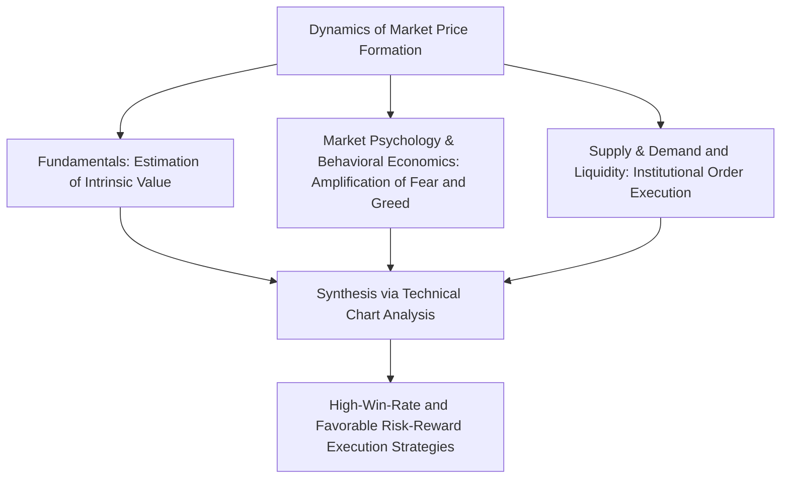
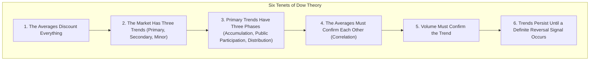
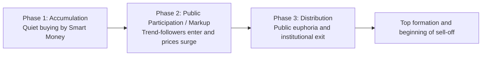
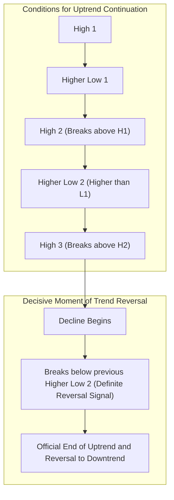
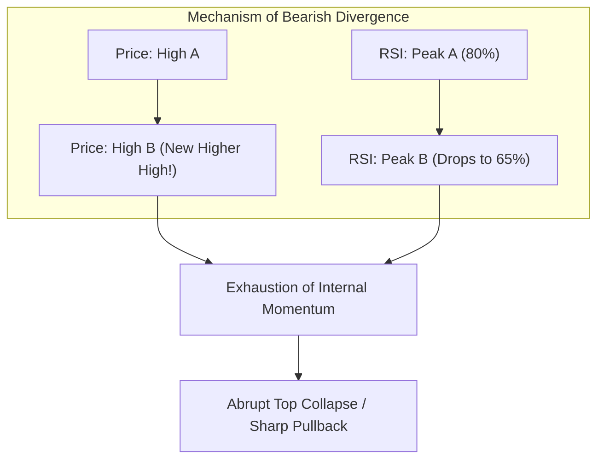
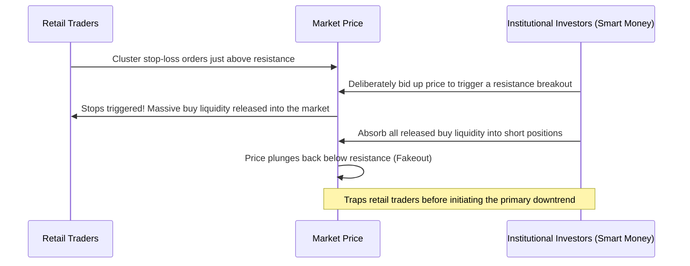
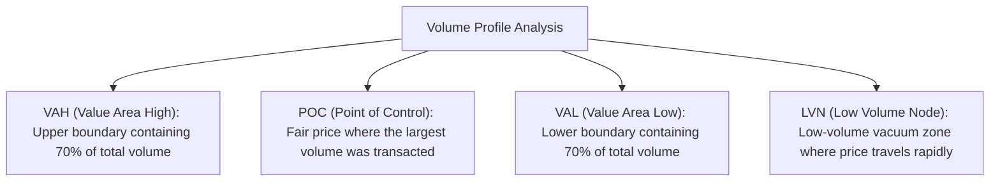

## 1. Introduction: The Philosophical Foundations of Technical Analysis and the Essence of Markets

### 1.1 Dichotomy and Aufheben: Fundamental Analysis vs. Technical Analysis

Approaches to deciphering price formation mechanisms in financial markets and forecasting future price movements have historically bifurcated into two primary paradigms: Fundamental Analysis and Technical Analysis.

Fundamental Analysis computes the "intrinsic value" of an asset by examining corporate financial statements, cash flows, prevailing interest rates, GDP growth rates, inflation metrics, and geopolitical risks. Investment decisions are made by identifying market price discrepancies relative to this theoretical equilibrium. Under this doctrine, even if market prices exhibit short-term irrationality, they are presumed to converge over the long term toward the underlying fundamentals of the firm and macroeconomic equilibrium.

In contrast, Technical Analysis focuses exclusively on the historical and ongoing trajectory of three variables: Price, Volume, and Time. Technical analysts contend that the true driving force behind price dynamics is not the fundamentals per se, but rather how market participants interpret those fundamentals—human psychology, fear, greed, cognitive biases, and the underlying flow of funds (liquidity).

In modern elite professional trading, these two schools of thought are not mutually exclusive adversaries; rather, they achieve an *Aufheben* (sublation). Fundamentals dictate *what* to trade (asset selection), whereas technical analysis dictates *when* to execute and *where* to strictly define risk (market timing and capital preservation). Even the most financially pristine corporation can suffer years of sustained depreciation during a macro secular bear market; technical analysis provides the lens to visualize and quantify the mechanics of that depreciation.



---

### 1.2 "Price Discounts Everything": Critique of the Efficient Market Hypothesis (EMH) and Behavioral Economics

The foremost axiom of technical analysis states: **"Market prices instantaneously discount all available information—encompassing not only public disclosures, but also insider knowledge, speculative expectations, natural disasters, geopolitical tensions, and aggregate psychological sentiment."**

According to the Weak-Form of the Efficient Market Hypothesis (EMH), long dominant in academic financial economics, all historical price and volume data are already fully reflected in current prices. Consequently, academic theory asserted that technical analysis could never generate excess risk-adjusted returns (alpha) above the market benchmark.

However, the rapid ascent of Behavioral Economics and Behavioral Finance since the 1980s provided rigorous empirical and experimental proof that the foundational premise of EMH—that market participants are invariably rational utility maximizers—is fundamentally flawed.
- Daniel Kahneman and Amos Tversky's foundational **Prospect Theory** demonstrated that human decision-making possesses an inherent cognitive asymmetry: individuals exhibit risk aversion when evaluating prospective gains, yet turn risk-seeking when confronted with losses.
- Pervasive cognitive distortions—such as anchoring, herding behavior, confirmation bias, and overconfidence—systematically and inevitably produce cyclical market regimes characterized by extreme overbought conditions (speculative bubbles) and severe oversold conditions (panics).

Technical analysis is not a superstitious crystal ball attempting to foretell the future from stochastic noise. It is **"the statistical and structural decoding of repeatable geometric patterns inscribed onto price charts by the aggregate expression of universal human cognitive biases."**

---

### 1.3 Fractal Market Hypothesis vs. Random Walk Theory: Benoit Mandelbrot

Another pillar of academic skepticism is the Random Walk Theory, which posits that price fluctuations adhere strictly to a Gaussian (normal) distribution and that past price changes share zero autocorrelation with future trajectories.

The decisive mathematical refutation of this classical assumption came from Benoit Mandelbrot, the father of fractal geometry. By analyzing multi-decade, ultra-long-term datasets across cotton commodity markets and foreign exchange rates, Mandelbrot rigorously proved three empirical realities:

1. **Fat Tails**: Financial asset returns do not conform to a bell-shaped Gaussian distribution. Extreme price shocks (Black Swan events) occur at frequencies thousands of times higher than standard distribution models predict, adhering instead to a Power Law.
2. **Volatility Clustering**: Large price shifts are followed by large shifts, and small fluctuations are followed by small fluctuations—confirming the presence of strong long-memory autocorrelation in variance.
3. **Self-Similarity**: If one strips time-axis labels from a 1-minute chart, a daily chart, and a monthly chart and places them side by side, even seasoned veteran traders cannot reliably distinguish which timeframe is which; their geometric structures are functionally self-similar.

This "Fractal Structure of Markets" constitutes the objective mathematical bedrock explaining why technical analysis operates effectively across disparate time horizons. Micro-timeframe trends reside nested within macro-timeframe trends, and when these multi-layered structures align in harmonic confluence, immense directional momentum is unleashed.

---

## 2. The Cornerstone of Modern Chart Analysis: The Six Tenets of Dow Theory and Their Contemporary Reinterpretation

At the fountainhead of all modern technical doctrines—including Elliott Wave Theory, Granville's Rules, and contemporary price action methodologies—lies **Dow Theory**, conceived by Charles H. Dow (1851–1902), the co-founder of *The Wall Street Journal*. Although Dow never compiled his concepts into a standalone monograph, his editorial essays were subsequently organized and formalized after his passing into six core principles by Samuel Nelson, William Peter Hamilton, and Robert Rhea.



---

### 2.1 Tenet 1: The Averages (Market Prices) Discount Everything

Broad market averages, such as the Dow Jones Industrial Average, fully assimilate macroeconomic trajectories, corporate earnings, central bank monetary policy, catastrophic weather events, geopolitical conflict, and the collective psychological state and actions of every market participant. Because incoming economic releases and breaking news are priced into the order book the split second they reach the wire, waiting for fundamental validation before executing trades guarantees structural lag. Observing the unfolding price chart itself remains the most forward-looking and comprehensive form of market intelligence.

---

### 2.2 Tenet 2: The Market Has Three Trends

Dow drew an analogy to oceanic movements, stratifying market trends into three distinct hierarchical tiers:

1. **Primary Trend (The Tide)**: A multi-year or sustained secular trend lasting from one to several years. It dictates the prevailing strategic direction of the macro environment.
2. **Secondary Trend (The Waves)**: Corrective counter-trend phases running contrary to the primary trend. These typically endure from three weeks to three months and retrace between one-third to two-thirds (frequently 50%) of the preceding primary move.
3. **Minor Trend (The Ripples)**: Short-term price fluctuations lasting under three weeks (ranging from hours to days). Governed by intraday noise and short-term speculation, these moves are highly susceptible to institutional manipulation; trading them in isolation without macro perspective is perilous.

In contemporary market execution, this taxonomy forms the foundational doctrine of **Multi-Timeframe (MTF) Analysis**. Establishing directional bias on the daily/weekly chart (tide), waiting for structural retracements on the 4-hour chart (wave), and pinpointing precision execution triggers on the 15-minute or 5-minute chart (ripple) is the direct practical application of Dow’s insight.

---

### 2.3 Tenet 3: Primary Trends Consist of Three Distinct Phases

A primary trend (most notably a bull market) traverses three clearly demarcated phases, characterized by qualitative shifts in participant psychology and capital composition:



- **Phase 1: Accumulation**: Unfolding at the nadir of an economic recession or in the immediate aftermath of a severe capitulation. While mainstream consensus remains enveloped in panic and despair, astute institutional investors (Smart Money) quietly accumulate undervalued assets. Price action remains largely range-bound, and volatility contracts significantly.
- **Phase 2: Public Participation (Markup)**: Tangible macroeconomic improvements and expanding corporate earnings become evident in public reporting. Technical trend-following capital rushes into the market en masse. Prices advance rapidly in a sustained, orderly fashion, establishing the longest and most profitable segment of the broader trend.
- **Phase 3: Distribution**: Financial media heavily sensationalize the rally with constant speculative coverage, prompting retail investors (Dumb Money) to surge in driven by Fear of Missing Out (FOMO). Simultaneously, the Smart Money that accumulated positions during Phase 1 quietly liquidates its holdings against this surge of retail market orders, locking in windfall profits. Price action turns wildly volatile with elongated upper wicks, signaling the exhaustion of the bull run.

---

### 2.4 Tenet 4: The Averages Must Confirm Each Other

In Charles Dow’s era, he cross-referenced the Railroad Average (today’s Transportation Average) against the Industrial Average. Even if manufacturing output surged, that prosperity was illusory if the manufactured goods were not transported across the nation by rail to consumer hubs. Therefore, a breakout to new highs in the Industrial Average could not be validated as an authentic bull market unless the Railroad Average concurrently established corresponding new highs.

In modern markets, this principle has evolved into **Intermarket Analysis** and the evaluation of **Market Internals**:
- Does a new record high in the S&P 500 find concurrent confirmation in tech-heavy Nasdaq or small-cap Russell 2000 indices?
- In currency markets, is a rally in USD/JPY backed by rising US Treasury yields and an appreciating US Dollar Index (DXY)?
- In crypto markets, is a standalone breakout in Bitcoin accompanied by strength across Ethereum and the broader altcoin complex?

An isolated high lacking cross-market confirmation frequently proves to be an institutional trap (Bull Trap).

---

### 2.5 Tenet 5: Volume Must Confirm the Trend

Price defines the *direction* of the trend, whereas volume validates its *underlying conviction and structural integrity*.

- **Healthy Uptrend**: Trading volume expands as price advances and contracts during corrective pullbacks.
- **Healthy Downtrend**: Trading volume expands as price declines and diminishes during corrective counter-trend bounces.

When price continues to carve out nominal higher highs on declining volume, it serves as a critical warning of **Volume Divergence**—indicating that buyers are becoming exhausted and that nominal price appreciation is merely riding an order-book vacuum. Richard Wyckoff later expanded this core Dow premise into the sophisticated framework known as **Volume Spread Analysis (VSA)** to decode institutional footprinting.

---

### 2.6 Tenet 6: Trends Persist Until a Definite Reversal Signal Occurs

Among Dow’s tenets, the sixth represents the most non-negotiable operational rule for professional chart traders.

The structural definition of a trend is mathematically unambiguous:
- **Definition of an Uptrend**: **A price structure characterized by consecutive Higher Highs (HH) and consecutive Higher Lows (HL).**
- **Definition of a Downtrend**: **A price structure characterized by consecutive Lower Highs (LH) and consecutive Lower Lows (LL).**



Regardless of how extended a price run appears or how psychologically compelling it feels to deem an asset "too expensive to buy," the uptrend remains structurally intact until the most recent Higher Low is definitively violated on a candle-close basis. Counter-trend shorting grounded in subjective assumptions of a "market top" constitutes a direct violation of this principle and remains the fastest route to account liquidation.

---

## 3. Elliott Wave Theory and the Mystique of Fibonacci Mathematics

### 3.1 Ralph Nelson Elliott's Theory of Universal Order

While Dow Theory formulated the rules of trend direction and structural reversal, Ralph Nelson Elliott (1871–1948) systematized the geometric rhythm and fractal behavior of price action. Confined to bed by debilitating illness, Elliott meticulously hand-analyzed 75 years of Dow Jones price history across monthly, weekly, daily, and down to 30-minute charts, culminating in the publication of *The Wave Principle* in 1938.

Elliott postulated that collective human social behavior and market psychology unfold in accordance with the Golden Ratio and Fibonacci sequences that govern organic growth across nature—from spiral seashells and phyllotaxis in plants to spiral galaxies. Financial markets do not drift in unmitigated entropy; they constitute a self-similar fractal universe oscillating through **an 8-wave base cycle composed of 5 Motive/Impulse Waves and 3 Corrective Waves**.

```mermaid
flowchart LR
    subgraph Motive / Impulse Waves (Trend Direction: 5-Wave Structure)
        W1["Wave 1<br/>(Initial Move)"] --> W2["Wave 2<br/>(Deep Retracement)"]
        W2 --> W3["Wave 3<br/>(Strongest Explosion)"]
        W3 --> W4["Wave 4<br/>(Complex Correction)"]
        W4 --> W5["Wave 5<br/>(Final Euphoria)"]
    end
    subgraph Corrective Waves (Counter-Trend: 3-Wave Structure)
        W5 --> WA["Wave A<br/>(Initial Decline)"]
        WA --> WB["Wave B<br/>(Deceptive Bounce)"]
        WB --> WC["Wave C<br/>(Devastating Drop)"]
    end
```

---

### 3.2 Motive (Impulse) Waves and the Three Cardinal Rules

Within the motive phase aligned with the dominant trend, the standard "Impulse Wave" is bound by **three inviolable cardinal rules**. If any single rule is breached, the wave count (labeling) is invalid and must be completely recalculated:

1. **Rule 1: Wave 2 can never retrace more than 100% of Wave 1.** (A breach below the inception of Wave 1 invalidates the count, indicating continuation of the prior bear trend).
2. **Rule 2: Wave 3 can never be the shortest among Waves 1, 3, and 5.** (Typically, Wave 3 acts as the extended, most powerful wave).
3. **Rule 3: Wave 4 can never enter the price territory of Wave 1.** (The moment the low of Wave 4 overlaps the peak of Wave 1, the structure ceases to be an impulse wave, degenerating into a diagonal or an alternative corrective formation).

#### Psychological Anatomy of Each Wave
- **Wave 1**: Structural bottoming and trend genesis. Macro fundamentals remain broadly negative, and the vast majority of market participants dismiss the advance as a mere bear-market bounce.
- **Wave 2**: Severe counter-trend retracement. Convinced that the prior downtrend is resuming, fearful market participants dump positions, driving price to retrace 50% to 61.8% (occasionally 78.6%) of Wave 1. Crucially, the swing low of Wave 1 holds firm.
- **Wave 3**: Widespread technical confirmation. Breakout traders and quantitative models cascade into long positions. Trading volume explodes, price gaps form on charts, and the market stages its steepest, most extensive advance. This is the golden wave where institutional capital deploys maximum size to capture optimal risk-reward gains.
- **Wave 4**: Profit-taking from Wave 3 meets late pullback buyers. This consolidation phase is prolonged, often constructing intricate corrective geometries such as triangles. (The Rule of Alternation dictates: if Wave 2 was a sharp, rapid correction, Wave 4 will manifest as a prolonged, sideways, complex structure).
- **Wave 5**: Retail euphoria reaches a crescendo as fundamental sentiment peaks. However, momentum oscillators (RSI and MACD) fail to confirm the new price highs, displaying prominent **bearish divergence** that signals internal exhaustion.

---

### 3.3 Taxonomy of Corrective Waves

Corrective structures following the completion of an impulse sequence exhibit significantly greater morphological complexity than motive waves. Elliott categorized them into three foundational architectures:

1. **Zigzag (5-3-5 Structure)**: A sharp, deep corrective move. Wave A (5 sub-waves downward) $\to$ Wave B (3 sub-waves counter-rebound, retracing 38.2% to 50% of Wave A) $\to$ Wave C (5 sub-waves of aggressive liquidation, often matching Wave A in amplitude).
2. **Flat (3-3-5 Structure)**: A sideways consolidation range. Wave A (3 sub-waves) $\to$ Wave B (3 sub-waves, retracing back near the origin of Wave A) $\to$ Wave C (5 sub-waves, nominally breaking past the extreme of Wave A). In aggressive bull markets, an "Expanded Flat" frequently materializes, wherein Wave B breaches the origin of Wave A before Wave C aggressively flushes lower.
3. **Triangle (3-3-3-3-3 Structure)**: A contracting consolidation pattern (subdivided into five waves: A-B-C-D-E) reflecting equilibrium between buyers and sellers. Triangles materialize exclusively in positions preceding the final actionary wave (e.g., Wave 4 or Wave B), and their resolution unleashes a final explosive thrust (Wave 5).

---

### 3.4 Fibonacci Ratios and Mathematical Projection of Price Targets

The profound predictive efficacy of Elliott Wave Theory emerges from its synthesis with the Fibonacci sequence ($0, 1, 1, 2, 3, 5, 8, 13, 21, 34, 55, 89, 144\dots$), which enables mathematical projection of retracements and profit targets with exceptional precision.

Key Fibonacci Ratios:
- $\phi = \frac{\sqrt{5}-1}{2} \approx 0.618$
- $1 - \phi \approx 0.382$
- $\sqrt{0.618} \approx 0.786$
- $1.618$ (The Golden Extension Ratio)
- $2.618, 4.236$

#### Practical Target Projection Formulas
1. **Wave 2 Retracement Depth**: Typically **$61.8\%$** or **$50.0\%$**, with a maximum extension to **$78.6\%$** of the vertical amplitude of Wave 1.
2. **Wave 3 Price Target**: Letting $W_1$ denote the amplitude of Wave 1, and $L_2$ denote the terminal low of Wave 2:
   $$Target(W_3) = L_2 + 1.618 \times W_1$$
   Under exceptional momentum conditions:
   $$Target(W_3) = L_2 + 2.618 \times W_1$$
3. **Wave 4 Retracement Depth**: Commonly **$38.2\%$** of Wave 3 (a shallow retracement), or converging directly with the sub-wave 4 extreme of Wave 3.
4. **Wave 5 Price Target**: Adding **$61.8\%$** of the total net distance traveled from the start of Wave 1 to the apex of Wave 3 to the terminal trough of Wave 4.

---

## 4. Wisdom of the East: Candlestick Morphology and Sakata's Five Methods

While Western technical analysis originated from line and bar charting, Japan independently pioneered futures trading and sophisticated chart analysis in the 18th-century Edo period at the Dojima Rice Exchange in Osaka. The legendary merchant Munehisa Homma (1724–1803) recorded his trading philosophy in *San-en Kinsen Hiroku*, laying the foundation for what would later be formalized as Sakata’s Five Methods.

---

### 4.1 Internal Dynamics of Candlesticks

A single candlestick encapsulates the Open, High, Low, and Close (OHLC) for a designated period, rendered visually through a rectangular Real Body flanked by upper and lower Shadows (wicks).

When Steve Nison introduced Japanese candlestick charting to the Western financial world in the late 1980s via *Japanese Candlestick Charting Techniques*, Wall Street was stunned by its informational efficiency, rapidly adopting it as the universal standard for financial charting.

| Candlestick Pattern | Structural Characteristics | Internal Market Psychology and Dynamics |
| :--- | :--- | :--- |
| **Marubozu (Bullish Long Day)** | Extremely long real body with virtually no upper or lower shadows (wicks). | Proof that buyers completely and consistently dominated the market from open to close. A powerful bullish signal. |
| **Hammer / Pin Bar** | Small body clustered at the top with a lower shadow at least twice the length of the real body. | Sellers aggressively drove prices down temporarily, but massive buying pressure was waiting in the lower price zone, completely absorbing the selling and pushing price back near the open. **The ultimate bottom-reversal signal**. |
| **Shooting Star / Gravestone** | Small body clustered at the bottom with an upper shadow at least twice the length of the real body. | Buyers pushed prices up aggressively to test new highs, but encountered overwhelming sell pressure (institutional profit-taking) at peak levels, getting completely repelled and triggering a sharp descent. **A key reversal signal for top formations**. |
| **Doji** | Open and close are virtually identical. The real body is a thin line forming a cross. | The moment when buyers' and sellers' energies are in perfect equilibrium. Indicates either trend pause/consolidation or a critical harbinger of an impending trend reversal. |

---

### 4.2 The Essence of Sakata's Five Methods

Sakata’s Five Methods identify five fundamental multi-candlestick formations that reveal tectonic shifts in market equilibrium:

1. **San-zan (Three Mountains)**: A topping structure where price attempts to conquer a resistance ceiling three consecutive times and fails. When the central peak is highest, it forms the classic Three-Buddha Top (Head and Shoulders Top); a definitive break below the neckline establishes a major downtrend.
2. **San-sen (Three Rivers)**: A base-building structure testing support three times (Triple Bottom / Inverted Head and Shoulders). Alternatively represented by formations such as the Morning Star (San-sen Ake no Myojo), where a long bearish candle, a spinning top/star, and a decisive long bullish candle confirm a structural bottom.
3. **San-ku (Three Gaps)**: The appearance of three consecutive price gaps in the direction of the trend. Traditional adages warn: "Sell into the third gap up; buy into the third gap down." A fourth gap represents exhaustive capitulation where market emotion overheats into terminal exhaustion.
4. **San-pei (Three Soldiers)**: Three consecutive advancing bullish candles (Three White/Red Soldiers) signal the vigorous onset of an uptrend from a base. However, if the third candle displays an elongated upper shadow (Stalled Pattern / Akasanpei Sakizumari), it alerts traders to impending exhaustion. Conversely, Three Black Crows at a market top presage a severe collapse.
5. **San-po (Three Methods)**: The embodiment of the philosophy that "standing aside is also trading." In the Rising Three Methods, a potent long bullish candle is followed by three small counter-trend bearish candles contained entirely within the range of the first candle; the fifth candle explodes to close at a new high, resuming the advance. It serves to identify mid-trend continuation pauses.

---

## 5. Mathematical Structure and Practical Pitfalls of Technical Indicators

Overlaying mathematical algorithms onto raw price charts yields technical indicators, which are broadly bifurcated into trend-following indicators (momentum/trend) and oscillators (mean-reversion/counter-trend). Novice traders frequently treat these formulas as black-box buy/sell triggers without understanding their underlying calculus, leading to catastrophic drawdown. Below is an anatomical dissection of their mathematical foundations.

### 5.1 Mathematics of Trend-Following Indicators

#### 1. Moving Averages: SMA vs. EMA
The formula for an $n$-period Simple Moving Average (SMA) is:
$$SMA_t = \frac{1}{n} \sum_{i=0}^{n-1} P_{t-i}$$
The fatal vulnerability of the SMA is that it applies an identical weighting factor ($1/n$) to the most recent price and to the price from $n$ periods ago. Consequently, the signal suffers from substantial structural lag.

The Exponential Moving Average (EMA) rectifies this limitation by assigning exponentially decreasing weights to older data points while maximizing the weight of the latest close $P_t$. Defining the smoothing multiplier as $\alpha = \frac{2}{n+1}$:
$$EMA_t = \alpha P_t + (1 - \alpha) EMA_{t-1}$$
Because the EMA reacts with heightened sensitivity to sudden price shocks, quantitative algorithms and institutional day traders heavily prioritize EMAs (notably the 20, 50, and 200 EMA) over standard SMAs.

#### 2. Bollinger Bands
Engineered by John Bollinger in the 1980s, Bollinger Bands construct dynamic standard deviation ($\sigma$) envelopes anchored around a central moving average:
$$Middle = SMA_n(P)$$
$$\sigma = \sqrt{\frac{1}{n} \sum_{i=0}^{n-1} (P_{t-i} - Middle)^2}$$
$$Upper = Middle + k \cdot \sigma, \quad Lower = Middle - k \cdot \sigma \quad (\text{typically } k=2)$$

Under a Gaussian normal distribution, the probability that a data point falls within $\pm 2\sigma$ is **$95.44\%$**.
However, here lies the devastating trap that bankrupts retail accounts: **financial asset price distributions are non-Gaussian and exhibit severe fat tails**.
Fading price by shorting simply because it touches $+2\sigma$ is an egregious operational error. When a potent trend detonates, price will ride the upper envelope, violently expanding the bands in a sustained **Band Walk**. The authentic edge of Bollinger Bands lies in detecting the **Squeeze** (extreme volatility compression), allowing traders to capture the initial breakout expansion (**Band Expansion**) with trend-following execution.

---

### 5.2 Mathematics of Oscillators

#### 1. RSI (Relative Strength Index)
Formulated by J. Welles Wilder, the RSI evaluates the balance between aggregate upward and downward price changes over an evaluation window (standardly 14 periods), normalizing market velocity onto an index between $0$ and $100$:
$$RS = \frac{\text{Average Gain over past } n \text{ periods}}{\text{Average Loss over past } n \text{ periods}}$$
$$RSI = 100 - \frac{100}{1 + RS} = \frac{\text{Average Gain}}{\text{Average Gain} + \text{Average Loss}} \times 100$$

While textbook dogma interprets values $>70$ as "overbought" and $<30$ as "oversold," strong trending regimes will frequently pin RSI above 80 for prolonged periods while the underlying asset doubles or triples in value.
The highest-probability signal generated by the RSI is **Divergence**:
- **Bearish Divergence**: Occurs when price carves out a Higher High while the RSI peak registers a Lower High. This condition warns that the internal upward velocity supporting the advance has severely deteriorated, heralding an imminent trend reversal.



---

## 6. Modern Price Action Theory and Smart Money Concepts (SMC)

Since the 2010s, high-frequency algorithmic execution (HFT) and institutional AI models have grown to command over 80% of daily trading volume across global exchanges. Consequently, classic retail indicators (such as MACD and Stochastics) have suffered severe decay in predictive alpha. To navigate this landscape, professional traders have gravitated toward **Raw Price Action** and **Smart Money Concepts (SMC)**, which monitor pure order flow, market structure, and liquidity mechanics.

### 6.1 Liquidity Sweeps and Stop Hunting

The core philosophy of SMC rests on an unyielding reality: **"The market is an algorithmic liquidity engine that consistently seeks out clusters of resting stop-loss orders."**

Retail market participants universally consume identical technical literature, clustering predictable stop-loss orders just above obvious double tops or directly beneath well-defined range lows. However, institutional entities managing multi-billion-dollar portfolios cannot build or liquidate large positions without triggering massive slippage, unless they can execute against deep pools of counterparty orders.

1. **The Liquidity Sweep**: Institutional algorithms intentionally engineer a sharp thrust beyond prominent swing highs or swing lows.
2. This move triggers the stop-loss orders (stop-market buy or sell orders) of retail positions en masse, unlocking enormous liquidity.
3. The Smart Money absorbs this tidal wave of execution against its own opposing order book without incurring adverse market impact.
4. Having absorbed the liquidity, price is aggressively driven back inside the prior range (Fakeout / Turtle Soup).
5. The daily or intraday candle leaves an elongated wick (Pin Bar), and the market initiates an explosive run in the opposite direction, abandoning trapped retail participants.



---

### 6.2 Fair Value Gaps (FVG) and Order Blocks

The primary execution entry models within SMC center on **Fair Value Gaps (FVG)** and **Order Blocks (OB)**:

- **Fair Value Gap (FVG)**: When institutions execute aggressive directional volume, it generates an imbalance across a three-candle sequence where the wick high of Candle 1 does not overlap the wick low of Candle 3, leaving an unfilled price vacuum in Candle 2. Interbank algorithms seek to balance this price inefficiency; price will frequently retrace back into this FVG to deliver fair value before resuming the impulse. Entering upon an FVG mitigation allows traders to exploit ultra-tight stop-loss parameters with asymmetric reward-to-risk ratios.
- **Order Block (OB)**: The final contrary-colored candle (or cluster) printed prior to an aggressive institutional breakout move. This zone represents the footprint of institutional order accumulation. Upon a future retest, this level provides formidable support or resistance.

---

## 7. The Ultimate Decisive Domain: Risk-Reward and the Mathematics of Money Management

Mastering technical chart patterns without an absolute grounding in the mathematics of capital allocation guarantees statistical ruin. Trading is never a game of clairvoyant fortune-telling; it is **a probabilistic business centered on executing a sequence of trades with positive mathematical expectation (+EV), governed by a sizing model that reduces the probability of ruin to zero**.

### 7.1 Mathematical Proof of Balsara's Risk of Ruin

French mathematician Nauzer Balsara developed a formal mathematical model that computes an operator's ultimate probability of bankruptcy based on three structural variables: **Win Rate ($W$)**, **Payoff Ratio ($R$)**, and the **Risk Fraction per Trade**.

- **Win Rate ($W$)**: Number of winning trades $\div$ Total trades executed
- **Payoff Ratio ($R$)**: Average winning trade amount $\div$ Average losing trade amount

The matrix below illustrates Balsara’s Risk of Ruin (approximated) under a scenario where **$20\%$ of account equity is risked per trade**:

| Win Rate \ Payoff Ratio ($R$) | 0.5 (High Loss / Small Gain) | 1.0 (Break-Even Ratio) | 1.5 (Favorable Reward/Risk) | 2.0 (Ideal Reward/Risk) | 3.0 (Superb Reward/Risk) |
| :---: | :---: | :---: | :---: | :---: | :---: |
| **30%** | 100% | 100% | 100% | 80.0% | 14.3% |
| **40%** | 100% | 100% | 38.2% | 14.1% | 1.2% |
| **50%** | 100% | 50.0% | 5.6% | 0.8% | **0.0%** |
| **60%** | 100% | 2.1% | 0.1% | **0.0%** | **0.0%** |
| **70%** | 14.3% | **0.0%** | **0.0%** | **0.0%** | **0.0%** |

This data forces a sober realization: **even with an impressive 60% win rate, if your payoff ratio is 0.5 (risking $2 to make $1), your mathematical probability of total account wipeout is 100%**. This explains why retail traders boasting 90% win rates inevitably suffer account liquidation when a single unmanaged loss cascades against them.

Conversely, **even with a modest 40% win rate, a payoff ratio of 2.0 drops the probability of ruin to 14.1%, and at a payoff ratio of 3.0, the risk of ruin drops to a negligible 1.2%**, ensuring steady capital growth over the long run.

---

### 7.2 The 2% Rule and Quantitative Position Sizing Formula

The foundational dogma of institutional risk management is the **2% Rule**: **the maximum permissible monetary loss on any single trade must be strictly capped between $1\%$ and $2\%$ of total account equity**.

Amateur traders habitually fix their transaction size (e.g., "trading 1 lot every time"). This is an amateur error. Because support levels, market structure, and volatility dictate different stop-loss distances for every setup, trade volume must be dynamically calculated.

The rigorous position sizing formula is:

$$Position\_Size = \frac{Account\_Balance \times Risk\_Percentage}{Entry\_Price - Stop\_Loss\_Price}$$

#### Concrete Example
- Account Balance: $10,000,000$ JPY
- Maximum Risk Allocation: $2\%$ (Max loss allowed $= 200,000$ JPY)
- Entry Price (USD/JPY): $150.00$ JPY
- Technical Stop Loss: $149.20$ JPY (Stop distance $= 0.80$ JPY $= 80$ pips)

The exact position size to deploy is:
$$Position\_Size = \frac{200,000 \text{ JPY}}{0.80 \text{ JPY}} = 250,000 \text{ units (2.5 standard lots)}$$

If the technical setup allows a tight stop of $0.40$ JPY (40 pips), position size scales up to $5.0$ lots. If market volatility demands a wider stop of $1.60$ JPY (160 pips), position size must contract to $1.25$ lots. **"Vary position sizing inversely to stop-loss distance to keep the absolute capital at risk perfectly constant."** This mathematical discipline is the impenetrable shield ensuring account survival across inevitable drawdowns.

---

### 7.3 Overcoming Prospect Theory and Psychological Biases

Why do intelligent operators consistently breach these straightforward risk management laws? The answer is rooted in human evolutionary biology.

During hundreds of thousands of years on the African savannah, immediate consumption of meat and fruit was essential before food rotted or was stolen by predators. Furthermore, resisting bodily loss with desperate aggression maximized personal survival.

In modern financial markets, however, these primitive instincts are lethal:
1. **Risk Aversion to Gains (Cutting Winners Early)**: When an open position shows a profit, fear of giving back the gain induces panic, prompting the trader to close the trade prematurely for a meager profit.
2. **Risk Seeking Toward Losses (Riding Losers to Ruin)**: When a trade goes negative, acute psychological denial sets in. Traders widen stops, refuse to liquidate, and average down into losing positions while hoping for a miraculous turnaround.

The holy grail of enduring market success is not an esoteric technical indicator. It is **"the conscious mastery over one's own evolutionary hardwiring (the curse of Prospect Theory) and the mechanical execution of an edge governed by probability and expected value."**

---

## 7.4 Mathematics of the Kelly Criterion and Practical Implementation of Half-Kelly

Alongside Balsara’s Risk of Ruin, the **Kelly Criterion**—formulated in 1956 by Bell Labs physicist John Larry Kelly Jr. via information theory—stands as a mathematical monument in capital allocation.

The Kelly Criterion calculates the optimal fraction $f^*$ of capital to deploy on an investment to maximize the long-term logarithmic growth rate of wealth:

$$f^* = \frac{b \cdot p - q}{b} = p - \frac{q}{b}$$

Where:
- $p$: Probability of winning (Win Rate, $0 \le p \le 1$)
- $q = 1 - p$: Probability of losing
- $b$: Payoff ratio (Odds / Net profit ratio = Average win amount $\div$ Average loss amount)

### Practical Example and the Full Kelly Trap
Consider a trading strategy with a win rate of $p = 0.55$ (55%) and a payoff ratio of $b = 1.5$ (Reward-to-Risk of 1:1.5):
$$f^* = \frac{1.5 \times 0.55 - 0.45}{1.5} = \frac{0.825 - 0.45}{1.5} = \frac{0.375}{1.5} = 0.25 \quad (25\%)$$

The raw formula indicates that staking **$25\%$** of total account equity per trade produces the theoretically maximal capital compounding velocity.
However, deploying "Full Kelly" in financial trading is **financial suicide**. The formula presumes that the true population win rate and payoff ratio remain perfectly stationary—an impossible assumption in dynamic markets.

If a statistical regime shift dampens performance or a standard 7-trade losing streak occurs, a 25% Full Kelly allocation induces an account drawdown exceeding $80\%$, triggering total psychological and operational collapse.

### The Absolute Supremacy of Half-Kelly
Consequently, quantitative funds and elite professional traders implement **Half-Kelly** ($f^* / 2$) or Quarter-Kelly:
- Deploying Half-Kelly preserves approximately **$75\%$** of the theoretical maximum geometric compounding rate, while slashing overall portfolio volatility and maximum drawdown by **over $50\%$**.
- In the above scenario, the risk fraction drops to $12.5\%$, or $6.25\%$ under Quarter-Kelly. When bounded by the practical ceiling of the **2% Rule**, account trajectory achieves unshakeable mathematical stability.

---

## 7.5 Structure of Volume Profile and Point of Control (POC)

Conventional charts display trading volume as vertical bars along the bottom axis (Volume by Time). In contrast, institutional execution tracking relies heavily on the **Volume Profile (VPVR)**, which aggregates and projects volume horizontally across price levels along the vertical axis (Volume by Price).



1. **POC (Point of Control)**: The single price tier where the highest transaction volume occurred within the selected lookback period. It represents the ultimate consensus of "Fair Value" among market participants, acting as an authoritative gravitational magnet that pulls price back when extended.
2. **Value Area (VA)**: The price bandwidth encompassing **$70\%$** of total traded volume (analogous to $1\sigma$ in a normal distribution).
   - **VAH (Value Area High)**: The upper ceiling of the Value Area, operating as strong structural resistance.
   - **VAL (Value Area Low)**: The lower floor of the Value Area, operating as strong structural support.
3. **LVN (Low Volume Node)**: Troughs on the profile where minimal transaction volume took place. Representing pricing voids where neither buyers nor sellers found consensus, price traverses these liquidity vacuums at extreme velocity with virtually zero resistance.

Volume Profile analysis moves beyond subjective static trendlines, providing an X-ray diagnostic of where institutional real-money capital is actively deployed.

---

## 7.6 Multi-Timeframe (MTF) Synchronization Protocol

In elite trading environments, trade execution follows a disciplined, five-tiered multi-timeframe synchronization protocol:

| Timeframe | Role | Monitored Items and Decision Criteria |
| :--- | :--- | :--- |
| **1. Weekly / Daily** | Market Context & Macro Bias (Ocean Tide) | Primary trend (Dow Theory higher-high / higher-low structure), 200 EMA slope, macro support and resistance zones. |
| **2. 4-Hour (4H)** | Trade Setup (Wave Structure) | Elliott Wave count (e.g., active Wave 3 or Wave 4 retracement), Fibonacci retracement levels (testing 61.8% confluence). |
| **3. 1-Hour (1H)** | Liquidity Mapping (Locating Order Targets) | Identification of Fair Value Gaps (FVG imbalances), Order Blocks, and recent liquidity pools above swing highs and below swing lows. |
| **4. 15-Minute (15M)** | Trend Shift Confirmation | Lower-timeframe Change of Character (CHoCH), breakout above lower-highs or breakdown below higher-lows. |
| **5. 5-Minute / 1-Minute (5M / 1M)** | Execution & Trigger | Candlestick triggers (Pin Bar, Bullish/Bearish Engulfing), defining tight stop-loss parameters, calculating exact position size formula, and executing orders. |

Traders must pull the trigger only when higher-timeframe context aligns in complete confluence with lower-timeframe execution triggers. Remaining flat and observing the tape during all other intervals is the singular operational habit that stabilizes win rates and compounds the equity curve.

---

## 8. Conclusion: Trading as the Management of One's Own Mind

The exploration of technical chart analysis may appear on the surface as an external journey to conquer market price movements. In truth, it is an austere discipline of internal cultivation—a mechanism to tune and master one's subconscious impulses and desires.

The chart is a vast screening apparatus reflecting the interwoven hopes, despairs, algorithmic calculations, and hubris of millions of human minds, quantitative models, central banks, and institutional asset managers. Each individual candlestick inscribed upon it represents the raw, unfiltered pulse of the human condition.

- Anchor your macro perspective in **Dow Theory** to navigate the broader tides,
- Measure the geometric cadence of price through **Elliott Waves and Fibonacci mathematics**,
- Read the unvarnished truth of supply and demand through **Sakata's Five Methods and Price Action**,
- And fortify your portfolio against ruin through **Balsara's mathematical money management**.

When this synthesized architecture is integrated into your trading DNA, the price chart ceases to be a domain of chaotic randomness. It reveals itself as an elegant, harmonious **"symphony of probabilities."**
