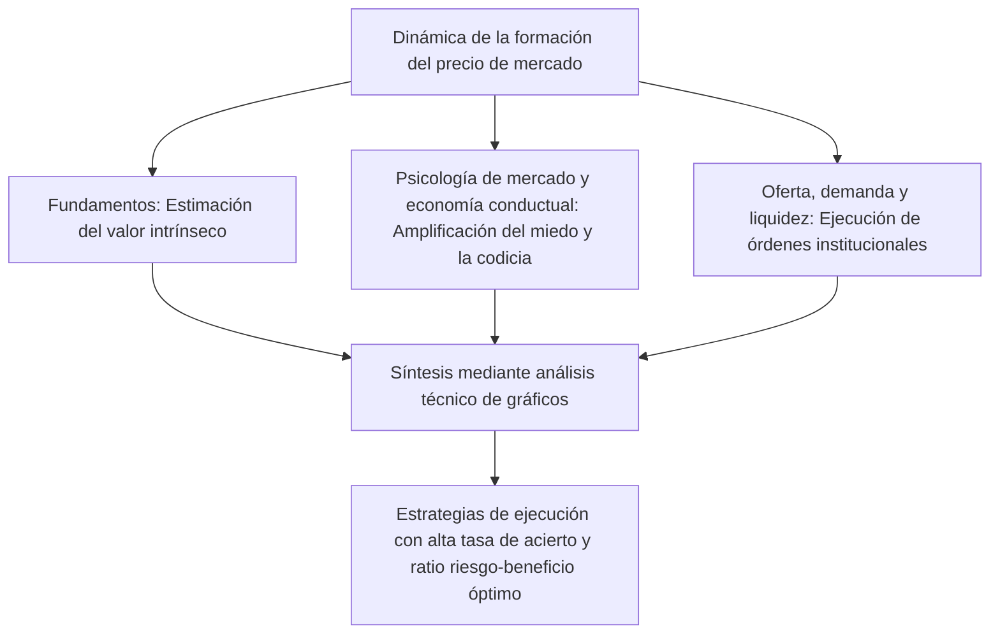
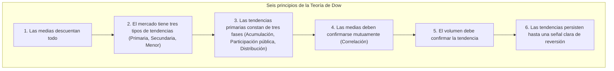
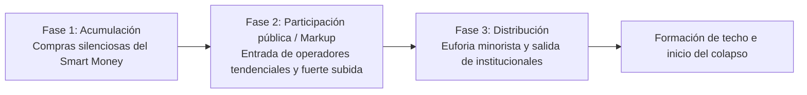
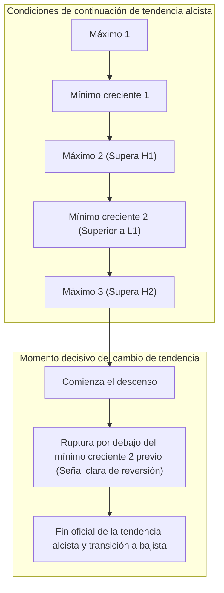
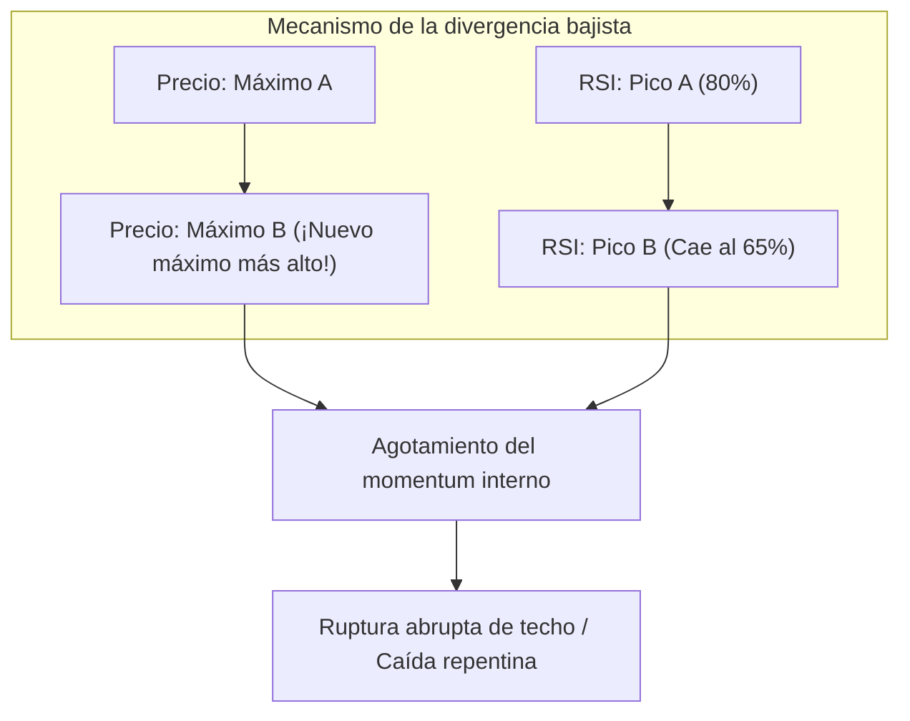
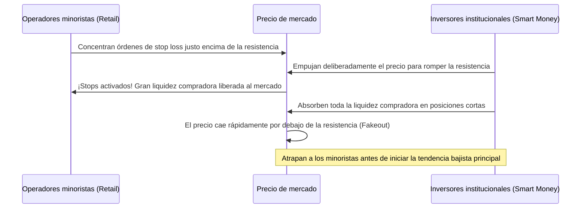
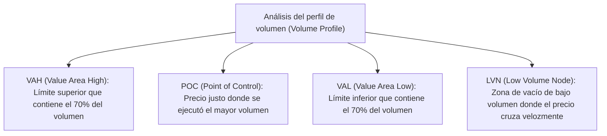

## 1. Introducción: Fundamentos filosóficos del análisis técnico y la esencia del mercado

### 1.1 La dicotomía y Aufheben entre el análisis fundamental y el análisis técnico

Históricamente, los enfoques destinados a descifrar los mecanismos de formación de precios en los mercados financieros y predecir sus fluctuaciones futuras se han dividido en dos grandes corrientes: el «Análisis Fundamental» (Fundamental Analysis) y el «Análisis Técnico» (Technical Analysis).

El análisis fundamental calcula el «valor intrínseco» (Intrinsic Value) de un activo evaluando los estados financieros corporativos, los flujos de caja, los tipos de interés, el crecimiento del PIB, las tasas de inflación y los riesgos geopolíticos. A partir de ello, toma decisiones de inversión identificando las desviaciones y distorsiones del precio de mercado respecto a dicho valor teórico de equilibrio. Bajo esta doctrina, se asume que, aunque el mercado sea irracional a corto plazo, a largo plazo los precios convergerán hacia los fundamentos de la empresa y los puntos de equilibrio macroeconómico.

Frente a esto, el análisis técnico toma como objeto exclusivo de estudio la evolución histórica y actual de tres variables esenciales: el «Precio» (Price), el «Volumen» (Volume) y el «Tiempo» (Time). Para los analistas técnicos, el verdadero motor que impulsa las cotizaciones no son los fundamentos en sí mismos, sino la forma en que los participantes interpretan esa realidad: «la psicología humana, el miedo, la codicia, los sesgos cognitivos y los flujos de capital (liquidez)».

En el trading profesional contemporáneo de alto nivel, ambas disciplinas no deben verse como enemigas irreconciliables, sino como una relación dialéctica que alcanza una «superación integradora» (*Aufheben*). Los fundamentos nos dicen *qué* negociar (selección de activos), mientras que el análisis técnico nos dicta *cuándo* operar y *dónde* acotar estrictamente el riesgo (timing y gestión del riesgo). Incluso la corporación con la solvencia más intachable puede encadenar varios años de caídas ininterrumpidas en medio de un mercado bajista secular; visualizar y cuantificar la dinámica de ese descenso constituye la verdadera maestría del análisis técnico.



---

### 1.2 «El precio lo descuenta todo»: Crítica a la Hipótesis del Mercado Eficiente (EMH) y la economía conductual

El primer axioma del análisis técnico postula: **«El precio de mercado descuenta instantáneamente toda la información disponible, abarcando no solo datos públicos, sino también información privilegiada, expectativas, catástrofes naturales, riesgos geopolíticos y el estado psicológico colectivo de los participantes.»**

De acuerdo con la forma débil de la «Hipótesis del Mercado Eficiente» (Efficient Market Hypothesis: EMH), dominante durante décadas en la economía financiera académica, toda la información sobre precios y volúmenes pasados ya está plenamente reflejada en las cotizaciones actuales. En consecuencia, la teoría convencional sostenía que era imposible obtener rentabilidades extraordinarias ajustadas al riesgo (alfa) por encima de la media del mercado basándose en el análisis técnico.

Sin embargo, el vertiginoso desarrollo de la «Economía Conductual» (Behavioral Economics) y las finanzas conductuales a partir de la década de 1980 demostró experimental y psicológicamente que la premisa fundacional de la EMH —la supuesta racionalidad perfecta de los agentes económicos— carece por completo de sustento empírico en el mundo real.
- La **Teoría Prospectiva** (Prospect Theory), formulada por Daniel Kahneman y Amos Tversky, reveló una asimetría cognitiva universal: los seres humanos muestran aversión al riesgo ante escenarios de ganancias potenciales, pero se vuelven propensos al riesgo (buscadores de riesgo) ante situaciones de pérdidas.
- Sesgos cognitivos recurrentes como el anclaje, la conducta de rebaño (Herding Behavior), el sesgo de confirmación y el exceso de confianza (Overconfidence) generan de manera inevitable y sistemática ciclos rítmicos de «sobrecompra» (burbujas especulativas) y «sobreventa» (pánicos de mercado).

El análisis técnico no es una bola de cristal supersticiosa diseñada para adivinar el porvenir en un mar de ruido caótico. Es **«el desciframiento estadístico y estructural de patrones geométricos reproducibles, trazados en los gráficos por la manifestación colectiva de los sesgos cognitivos universales de la mente humana.»**

---

### 1.3 La hipótesis de la estructura fractal frente a la teoría del paseo aleatorio: Mandelbrot

Otra objeción académica habitual proviene de la «Teoría del Paseo Aleatorio» (Random Walk Theory), la cual sostiene que la distribución de probabilidad de las variaciones de precios sigue una distribución normal (gaussiana) y que no existe correlación serial alguna entre las trayectorias pasadas y futuras.

La refutación matemática concluyente contra esta hipótesis clásica fue asestada por Benoit Mandelbrot, el padre de la geometría fractal. Tras analizar exhaustivamente conjuntos de datos de larguísimo plazo en cotizaciones de materias primas como el algodón y tipos de cambio de divisas, Mandelbrot demostró matemáticamente tres realidades incuestionables:

1. **Colas Pesadas (Fat Tails)**: Las fluctuaciones de precios en los mercados financieros no se ajustan a una campana de Gauss. Los movimientos extremos (eventos de Cisne Negro) ocurren con frecuencias miles de veces superiores a lo predicho por la distribución normal, gobernados por una «Ley de Potencias» (Power Law).
2. **Agrupamiento de Volatilidad (Volatility Clustering)**: Los grandes movimientos de precios van seguidos sistemáticamente de grandes movimientos, y las pequeñas fluctuaciones van seguidas de pequeñas fluctuaciones, evidenciando una fuerte autocorrelación en la varianza.
3. **Autosimilitud (Self-Similarity)**: Si se eliminan las etiquetas temporales de un gráfico de 1 minuto, uno diario y uno mensual y se colocan lado a lado, ni siquiera los traders profesionales más experimentados pueden distinguir con certeza a qué marco temporal corresponde cada uno; sus morfologías geométricas son estructuralmente autosimilares.

Esta «Estructura Fractal del Mercado» constituye la base matemática objetiva por la cual el análisis técnico opera con plena vigencia a través de diferentes escalas temporales. Las tendencias de marcos inferiores anidan dentro de las tendencias de marcos superiores, y en el instante preciso en que se alinean en resonancia armónica, se desencadena un momentum direccional colosal.

---

## 2. La piedra angular del análisis de gráficos moderno: Los seis principios de la Teoría de Dow y su reinterpretación contemporánea

En el origen de todas las metodologías del análisis técnico moderno (como las Ondas de Elliott, las Reglas de Granville y el Price Action contemporáneo) se encuentra la **Teoría de Dow** (Dow Theory), desarrollada por Charles H. Dow (1851–1902), fundador de *The Wall Street Journal*. Aunque Dow no llegó a plasmar sus ideas en un tratado unificado sino en editoriales periodísticos, tras su fallecimiento Samuel Nelson, William Peter Hamilton y Robert Rhea las sistematizaron en seis grandes principios.



---

### 2.1 Principio 1: Las medias (el precio de mercado) descuentan todo

Los promedios representativos del mercado, como el Promedio Industrial Dow Jones, asimilan y reflejan exhaustivamente el ciclo macroeconómico, los balances corporativos, las políticas de tipos de interés de los bancos centrales, los desastres naturales, los conflictos bélicos y las acciones y emociones del conjunto de los inversores. Dado que cualquier publicación macroeconómica o noticia de última hora se incorpora a la cartera de órdenes en el mismo instante en que se transmite, operar esperando la confirmación de los datos fundamentales conlleva un retraso estructural insalvable. Analizar directamente el movimiento del gráfico es la forma más adelantada y completa de captar el flujo informativo.

---

### 2.2 Principio 2: El mercado tiene tres tipos de tendencias

Dow recurrió a la analogía del océano para categorizar las tendencias en tres estratos jerárquicos:

1. **Tendencia Primaria (La Marea)**: Una dirección de fondo monumental que se prolonga desde un año hasta varios años. Dictamina la trayectoria macroestratégica del mercado.
2. **Tendencia Secundaria (Las Olas)**: Fases de corrección que se desarrollan en sentido opuesto a la tendencia primaria. Por lo general, duran entre tres semanas y tres meses, y suelen desandar entre un tercio y dos tercios (a menudo el 50%) del recorrido de la tendencia primaria previa.
3. **Tendencia Menor (Las Ondulaciones / Rizado)**: Oscilaciones a corto plazo con una duración inferior a tres semanas (de pocas horas a varios días). Compuestas por ruido intradía y especulación inmediata, son sumamente vulnerables a la manipulación institucional; analizarlas u operarlas de forma aislada sin contexto macro representa un peligro extremo.

En la operativa moderna, esta taxonomía constituye el principio rector del **Análisis Multi-Temporal (Multi-Timeframe Analysis - MTF)**. Establecer el sesgo direccional en gráficos diarios o semanales (la marea), esperar el retroceso correctivo en 4 horas (la ola) y ejecutar con precisión quirúrgica en 15 o 5 minutos (la ondulación) es la aplicación directa de la genial intuición de Dow.

---

### 2.3 Principio 3: Las tendencias primarias constan de tres fases

Una tendencia primaria (especialmente una tendencia alcista) atraviesa tres etapas perfectamente diferenciadas por la psicología de los participantes y la naturaleza del capital:



- **Fase 1: Acumulación (Accumulation)**: Se sitúa en los mínimos de una recesión económica o tras una profunda capitulación, cuando el pánico y el desaliento reinan en la opinión pública. En este punto, los inversores institucionales más sagaces y disciplinados (Smart Money) compran silenciosamente activos severamente infravalorados. El precio oscila en rangos laterales y la volatilidad se comprime al mínimo.
- **Fase 2: Participación pública (Public Participation / Markup)**: Los indicadores de reactivación y los beneficios empresariales comienzan a manifestarse con claridad en los balances. Los traders tendenciales y seguidores de sistemas técnicos ingresan de forma masiva. El precio avanza con fuerza y regularidad, configurando la fase más extensa, sostenida y rentable de toda la tendencia.
- **Fase 3: Distribución (Distribution)**: Los medios de comunicación generalistas proclaman a diario la imparable escalada del activo. El público minorista no especializado (Dumb Money) se lanza al mercado en masa presa del FOMO («miedo a quedarse fuera»). En ese preciso momento, el dinero institucional que acumuló en la Fase 1 liquida sigilosamente sus posiciones contra las órdenes masivas de compra de los minoristas, asegurando beneficios descomunales. En el gráfico proliferan velas de alta volatilidad con mechas superiores alargadas, marcando el preludio del fin de ciclo.

---

### 2.4 Principio 4: Las medias deben confirmarse mutuamente

En la época de Charles Dow, se comparaba el Promedio Industrial con el Promedio del Ferrocarril (el actual índice de transportes). Por más bienes manufacturados que produjeran las fábricas, si dichos productos no eran transportados eficientemente a los centros de consumo a través del ferrocarril, la bonanza económica era ilusoria. Por consiguiente, si el promedio industrial marcaba nuevos máximos históricos pero el de ferrocarriles no lo acompañaba simultáneamente, no se podía certificar la existencia de un mercado alcista genuino.

En los mercados contemporáneos, esta doctrina ha evolucionado hacia el **Análisis Intermercado** y el estudio de los **Indicadores Internos del Mercado**:
- ¿El nuevo máximo del S&P 500 está debidamente confirmado por el sector tecnológico (Nasdaq) o por las empresas de pequeña capitalización (Russell 2000)?
- En el mercado de divisas, ¿el repunte del USD/JPY coincide con un incremento en los rendimientos de los bonos del Tesoro estadounidense y un fortalecimiento del índice dólar (DXY)?
- En el ecosistema cripto, ¿la subida solitaria de Bitcoin viene acompañada por Ethereum y el conjunto de las altcoins?

Cualquier ruptura de máximos aislada y carente de confirmación intermercado tiene elevadas probabilidades de constituir una trampa de toros (Bull Trap) orquestada por grandes operadores.

---

### 2.5 Principio 5: El volumen debe confirmar la tendencia

El precio marca la *dirección* del movimiento, mientras que el volumen refleja la *fuerza y autenticidad energética* de la tendencia.

- **Tendencia alcista saludable**: El volumen se incrementa durante los tramos ascendentes de avance y se reduce notablemente en los retrocesos correctivos.
- **Tendencia bajista saludable**: El volumen repunta en los impulsos descendentes y disminuye en los rebotes técnicos de alivio.

Si el precio continúa marcando nuevos máximos nominales pero el volumen transaccionado declina progresivamente, estamos ante una grave señal de alerta: una **Divergencia de Volumen** (Volume Divergence). Esto denota que los compradores se están agotando y que el avance responde únicamente a la ausencia momentánea de contrapartida vendedora. Richard Wyckoff expandió este principio fundamental hasta consolidar el **Análisis de Spread y Volumen (VSA - Volume Spread Analysis)** para decodificar la huella institucional.

---

### 2.6 Principio 6: Las tendencias persisten hasta una señal clara de reversión

De todos los postulados de Dow, este sexto principio representa la regla de hierro más estricta para el operador técnico profesional.

La definición técnica de una tendencia es matemáticamente rigurosa y directa:
- **Definición de Tendencia Alcista**: **Una sucesión continuada de Máximos Crecientes (Higher Highs) y Mínimos Crecientes (Higher Lows).**
- **Definición de Tendencia Bajista**: **Una sucesión continuada de Máximos Decrecientes (Lower Highs) y Mínimos Decrecientes (Lower Lows).**



Por muy vertical que sea una subida y por muy «caro» que parezca un activo a nivel subjetivo, mientras el precio de cierre no perfore de manera contundente el último **Mínimo Creciente (Higher Low)** estructural, la tendencia alcista continúa formalmente intacta. Intentar adivinar techos mediante operaciones a contra-tendencia basadas en percepciones emocionales es una flagrante violación de este principio y el camino más rápido a la quiebra.

---

## 3. La Teoría de las Ondas de Elliott y el misticismo de la matemática de Fibonacci

### 3.1 La teoría del orden universal de Ralph Nelson Elliott

Si la Teoría de Dow formuló las reglas de la direccionalidad y reversión estructural, Ralph Nelson Elliott (1871–1948) se encargó de sistematizar el «ritmo geométrico» y la «naturaleza fractal» de los precios. Estando postrado por una severa enfermedad, Elliott analizó con una devoción obsesiva más de 75 años de historiales del Dow Jones en marcos mensuales, semanales, diarios y de 30 minutos, publicando en 1938 su obra cumbre: *The Wave Principle* (El principio de las ondas).

Elliott propuso que la actividad social humana y las fluctuaciones psicológicas colectivas se despliegan en perfecta sintonía con la Proporción Áurea y la sucesión de Fibonacci, las cuales rigen los procesos orgánicos de crecimiento en la naturaleza (la espiral del nautilus, la filotaxis botánica o las galaxias espirales). El mercado no es un caos desordenado; es un cosmos fractal que oscila mediante **un ciclo base de 8 ondas, compuesto por 5 Ondas de Impulso (Impulse Waves) y 3 Ondas Correctivas (Corrective Waves)**.

```mermaid
flowchart LR
    subgraph Ondas impulsivas (Dirección de la tendencia: Estructura de 5 ondas)
        W1["Onda 1<br/>(Movimiento inicial)"] --> W2["Onda 2<br/>(Retroceso profundo)"]
        W2 --> W3["Onda 3<br/>(Mayor explosión)"]
        W3 --> W4["Onda 4<br/>(Corrección compleja)"]
        W4 --> W5["Onda 5<br/>(Euforia final)"]
    end
    subgraph Ondas correctivas (Contratendencia: Estructura de 3 ondas)
        W5 --> WA["Onda A<br/>(Descenso inicial)"]
        WA --> WB["Onda B<br/>(Rebote engañoso)"]
        WB --> WC["Onda C<br/>(Caída devastadora)"]
    end
```

---

### 3.2 Estructura de las ondas de impulso y las tres reglas cardinales inviolables

Dentro de las ondas motrices que avanzan a favor de la tendencia dominante, la estructura impulsiva estándar está sujeta a **tres reglas cardinales absolutas e inviolables**. Si se quebranta tan solo una de ellas, el conteo de ondas queda formalmente invalidado y debe replantearse desde el principio:

1. **Regla 1: La Onda 2 nunca puede retroceder más allá del 100% del inicio de la Onda 1.** (Una perforación por debajo del origen anula el conteo, indicando la persistencia de la tendencia bajista previa).
2. **Regla 2: De las Ondas 1, 3 y 5, la Onda 3 nunca puede ser la más corta.** (Generalmente, la Onda 3 es la más potente, extensa y detonante).
3. **Regla 3: La Onda 4 jamás debe solapar territorialmente con el área de precios de la Onda 1.** (En el instante en que el mínimo de la Onda 4 penetra en el techo de la Onda 1, la pauta deja de ser un impulso tradicional, degradándose en una diagonal u otra variante correctiva).

#### Características psicológicas de cada onda
- **Onda 1**: Inicio del giro tendencial. Las noticias macroeconómicas aún son abiertamente pesimistas y la mayoría de los participantes interpreta el rebote como una simple oportunidad de venta, por lo que el avance inicial suele ser contenido.
- **Onda 2**: Violento repliegue correctivo. El temor generalizado a que se reanude el mercado bajista desata ventas compulsivas, provocando un retroceso profundo que alcanza entre el 50% y el 61,8% (e incluso el 78,6%) de la Onda 1. No obstante, el suelo de la Onda 1 no llega a quebrarse.
- **Onda 3**: Alineación técnica absoluta. Se confirman las rupturas de resistencias, incorporando de golpe a traders sistemáticos, algoritmos e instituciones. El volumen de negociación explota, surgen gaps de aceleración y se produce la fase de expansión más veloz y pronunciada. Es la onda dorada donde el capital profesional despliega el mayor apalancamiento para capturar el ratio riesgo-beneficio más favorable.
- **Onda 4**: Toma de beneficios de la Onda 3 que se cruza con las órdenes de compra rezagadas. Consume bastante tiempo y adopta patrones correctivos complejos y laterales, tales como triángulos. (Ley de Alternancia: si la Onda 2 fue una corrección brusca y simple en zigzag, la Onda 4 será predominantemente plana, dilatada y compleja).
- **Onda 5**: El optimismo fundamental alcanza su clímax y el público generalista compra eufórico. Sin embargo, los osciladores técnicos de momentum (como el RSI y el MACD) registran una clara **divergencia bajista**, evidenciando que el combustible interno del movimiento se ha extinguido.

---

### 3.3 Taxonomía de las ondas correctivas

Las fases de corrección que suceden al agotamiento del ciclo impulsivo presentan una riqueza geométrica mucho más intrincada que las ondas de avance. Elliott las clasificó en tres patrones fundamentales:

1. **Zigzag (Estructura 5-3-5)**: Una corrección rápida y profunda. Onda A (5 ondas descendentes) $\to$ Onda B (rebote de 3 ondas, que recupera entre el 38,2% y el 50% de la Onda A) $\to$ Onda C (descenso impulsivo en 5 ondas, con una amplitud habitualmente idéntica a la Onda A).
2. **Plana / Flat (Estructura 3-3-5)**: Consolidación lateral. Onda A (3 ondas) $\to$ Onda B (3 ondas, retornando cerca del origen de la Onda A) $\to$ Onda C (5 ondas que rebasan ligeramente el extremo de la Onda A). En fases alcistas poderosas se produce con asiduidad la «Plana Expandida» (Expanded Flat), donde la Onda B rompe el máximo de la Onda A antes de que la Onda C barra violentamente los mínimos.
3. **Triángulo (Estructura 3-3-3-3-3)**: Pauta de contracción de volatilidad compuesta por 5 micro-ondas (A-B-C-D-E) que refleja un equilibrio transitorio entre compradores y vendedores. Aparece únicamente en la posición previa a la última onda direccional (como la Onda 4 o la Onda B); su desenlace desencadena un potente empuje final (Onda 5).

---

### 3.4 Ratios de Fibonacci y método de cálculo de objetivos de onda

La extraordinaria capacidad predictiva de las Ondas de Elliott radica en su perfecta integración con la sucesión de Fibonacci ($0, 1, 1, 2, 3, 5, 8, 13, 21, 34, 55, 89, 144\dots$), lo que permite proyectar matemáticamente retrocesos y extensiones con un rigor milimétrico.

Ratios clave de Fibonacci:
- $\phi = \frac{\sqrt{5}-1}{2} \approx 0{,}618$
- $1 - \phi \approx 0{,}382$
- $\sqrt{0{,}618} \approx 0{,}786$
- $1{,}618$ (Proporción áurea de extensión)
- $2{,}618, 4{,}236$

#### Fórmulas prácticas de proyección
1. **Profundidad de retroceso de Onda 2**: Habitualmente el **$61{,}8\%$** o el **$50{,}0\%$**, pudiendo extenderse como límite extremo al **$78{,}6\%$** del recorrido vertical de la Onda 1.
2. **Objetivo de proyección de Onda 3**: Siendo $W_1$ el rango vertical de la Onda 1 y $L_2$ el suelo final de la Onda 2:
   $$Target(W_3) = L_2 + 1{,}618 \times W_1$$
   O en fases de expansión extraordinaria:
   $$Target(W_3) = L_2 + 2{,}618 \times W_1$$
3. **Profundidad de retroceso de Onda 4**: Suele representar un retroceso superficial del **$38{,}2\%$** de la Onda 3, o bien converger con el mínimo de la sub-onda 4 de dicha Onda 3.
4. **Objetivo de proyección de Onda 5**: Se suma el **$61{,}8\%$** de la distancia total recorrida desde el inicio de la Onda 1 hasta la cresta de la Onda 3, proyectándolo a partir del suelo de la Onda 4.

---

## 4. Sabiduría oriental: Morfología de velas japonesas y los Cinco Métodos de Sakata

Mientras el análisis técnico occidental dio sus primeros pasos a partir de gráficos de líneas y de barras, en el Japón feudal del siglo XVIII, en el mercado de arroz de Dojima en Osaka, florecía de manera pionera el mercado de futuros más antiguo del mundo. Su artífice legendario fue Munehisa Homma (1724–1803), quien legó su filosofía operativa en la obra *San-en Kinsen Hiroku*, cimiento de los posteriores «Cinco Métodos de Sakata».

---

### 4.1 Dinámica interna de las velas japonesas (Candlesticks)

Una sola vela japonesa sintetiza visualmente los cuatro precios clave de una sesión o marco temporal: Apertura (Open), Máximo (High), Mínimo (Low) y Cierre (Close), conformando un cuerpo real (Real Body) flanqueado por sombras o mechas (Shadows/Wicks) superiores e inferiores.

Cuando Steve Nison divulgó estas técnicas en Occidente a finales de la década de 1980 con su obra *Japanese Candlestick Charting Techniques*, los operadores de Wall Street quedaron fascinados ante su inigualable poder de comunicación visual, transformando las velas en el estándar gráfico global indiscutible.

| Patrón de vela | Características estructurales | Psicología de mercado y dinámica interna |
| :--- | :--- | :--- |
| **Marubozu alcista** | Cuerpo real sumamente largo con sombras (mechas) superior e inferior casi inexistentes. | Evidencia de que los compradores dominaron absoluta y continuamente el mercado desde la apertura hasta el cierre. Señal alcista contundente. |
| **Martillo / Pin Bar (Hammer)** | Cuerpo pequeño concentrado en la parte superior, con una sombra inferior de al menos el doble del tamaño del cuerpo real. | Los vendedores hundieron los precios agresivamente de forma temporal, pero una potente fuerza compradora aguardaba en mínimos, absorbiendo toda la oferta y devolviendo el precio cerca de la apertura. **La señal más potente de reversión en suelos**. |
| **Estrella fugaz (Shooting Star)** | Cuerpo pequeño concentrado en la parte inferior, con una sombra superior de al menos el doble del tamaño del cuerpo real. | Los compradores impulsaron el precio al alza para probar nuevos máximos, pero chocaron contra una fuerte presión de venta (toma de beneficios institucional), siendo totalmente rechazados y provocando un fuerte retroceso. **Señal de reversión y formación de techo**. |
| **Doji** | Apertura y cierre prácticamente idénticos. El cuerpo real es una delgada línea formando una cruz. | Momento en que las fuerzas compradoras y vendedoras alcanzan un equilibrio perfecto. Indica consolidación o un presagio crucial de cambio de tendencia. |

---

### 4.2 La esencia de los Cinco Métodos de Sakata

Los Cinco Métodos de Sakata constituyen cinco patrones esenciales que permiten detectar puntos de inflexión mediante combinaciones de velas:

1. **San-zan (Tres Montañas)**: Estructura de techo donde el precio intenta quebrar un nivel de resistencia en tres ocasiones consecutivas sin éxito. Cuando el monte central es el más elevado, conforma el patrón de Hombro-Cabeza-Hombro (San-zon Tenjo); la ruptura de la línea clavicular (neckline) confirma una severa transición bajista.
2. **San-sen (Tres Ríos)**: Estructura de suelo que evalúa el soporte en tres tentativas (Triple Suelo / Hombro-Cabeza-Hombro Invertido). Comprende también formaciones como la Estrella de la Mañana (San-sen Ake no Myojo), donde una gran vela bajista, un cuerpo pequeño intercalado y una gran vela alcista consolidan el cambio de tendencia.
3. **San-ku (Tres Ventanas / Tres Huecos)**: Sucesión de tres gaps consecutivos en la dirección de la tendencia. El adagio tradicional aconseja: «Ante tres gaps al alza, prepárate para vender; ante tres gaps a la baja, prepárate para comprar». Un cuarto gap representa el clímax emocional de agotamiento terminal de los participantes.
4. **San-pei (Tres Soldados)**: La aparición de tres velas alcistas consecutivas («Tres Soldados Blancos / Rojos») marca el inicio vigoroso de una fase alcista desde una base. Sin embargo, si la tercera vela proyecta una mecha superior pronunciada («Soldados Bloqueados / Akasanpei Sakizumari»), alerta sobre el agotamiento del impulso. En techos de mercado, la aparición de «Tres Cuervos Negros» vaticina un derrumbe inminente.
5. **San-po (Tres Métodos)**: La consagración operativa de la máxima: «Saber esperar también es operar». En los Tres Métodos Alcistas, a una gran vela verde le siguen tres pequeñas velas correctivas contenidas íntegramente dentro del rango de la primera; la quinta vela explota marcando un nuevo máximo y reanudando la tendencia previa. Permite catalogar pausas de continuación de tendencia.

---

## 5. Estructura matemática y trampas prácticas de los indicadores técnicos

Los indicadores técnicos superponen algoritmos matemáticos a los datos de precios brutos, dividiéndose principalmente en indicadores tendenciales (seguidores de tendencia) y osciladores (de reversión a la media y momentum). Frecuentemente, los operadores principiantes cometen el error de asumir las señales mecánicas como dogmas infalibles sin comprender la matemática subyacente, cosechando pérdidas demoledoras. Analicemos a continuación sus fundamentos cuantitativos.

### 5.1 Matemática de los indicadores tendenciales

#### 1. Medias Móviles: SMA frente a EMA
La expresión de la Media Móvil Simple (SMA) para una ventana de $n$ períodos es:
$$SMA_t = \frac{1}{n} \sum_{i=0}^{n-1} P_{t-i}$$
El defecto estructural de la SMA radica en que otorga idéntica ponderación ($1/n$) al precio más reciente que al registrado hace $n$ sesiones. Debido a esto, la señal sufre un retraso (lag) significativo.

La Media Móvil Exponencial (EMA) subsana esta debilidad asignando una ponderación exponencialmente decreciente a los datos históricos, confiriendo el mayor peso relativo al precio de cierre más reciente $P_t$. Definiendo el coeficiente de suavizado como $\alpha = \frac{2}{n+1}$:
$$EMA_t = \alpha P_t + (1 - \alpha) EMA_{t-1}$$
Dado que la EMA responde con extraordinaria agilidad a las fluctuaciones bruscas de la cotización, los algoritmos de alta frecuencia y los operadores intradiarios priorizan masivamente las medias exponenciales (en particular las EMA de 20, 50 y 200 períodos) sobre las SMA convencionales.

#### 2. Bandas de Bollinger (Bollinger Bands)
Diseñadas por John Bollinger en los años 80, trazan un envolvente de desviación estándar ($\sigma$) en torno a una media móvil central:
$$Middle = SMA_n(P)$$
$$\sigma = \sqrt{\frac{1}{n} \sum_{i=0}^{n-1} (P_{t-i} - Middle)^2}$$
$$Upper = Middle + k \cdot \sigma, \quad Lower = Middle - k \cdot \sigma \quad (\text{generalmente } k=2)$$

Bajo una distribución estadística normal, la probabilidad de que los datos oscilen dentro del intervalo de $\pm 2\sigma$ es del **$95{,}44\%$**.
No obstante, aquí se oculta la trampa letal que arruina a los operadores inexpertos: **las series financieras no son gaussianas; presentan colas pesadas**.
Por ende, asumir que el contacto del precio con la banda $+2\sigma$ denota una «sobrecompra» que amerita abrir una posición corta en contratendencia es un error fatal. Cuando irrumpe una tendencia enérgica, el precio cabalga sobre el límite exterior forzando su apertura durante un largo recorrido (**Band Walk**). El auténtico uso profesional de las Bandas de Bollinger radica en detectar el estrechamiento extremo de las bandas o **Squeeze** (compresión severa de volatilidad), para posicionarse a favor de la subsiguiente expansión explosiva (**Band Expansion**).

---

### 5.2 Matemática de los osciladores

#### 1. RSI (Relative Strength Index: Índice de Fuerza Relativa)
Desarrollado por J. Welles Wilder, el RSI contrasta la magnitud acumulada de las subidas frente a las bajadas en una ventana de observación (estándar de 14 períodos), normalizando la velocidad del precio en una escala acotada de $0$ a $100$:
$$RS = \frac{\text{Ganancia promedio en los últimos } n \text{ períodos}}{\text{Pérdida promedio en los últimos } n \text{ períodos}}$$
$$RSI = 100 - \frac{100}{1 + RS} = \frac{\text{Ganancia promedio}}{\text{Ganancia promedio} + \text{Pérdida promedio}} \times 100$$

Aunque los manuales sugieren que valores $>70$ representan «sobrecompra» y $<30$ «sobreventa», en tendencias virulentas el RSI puede mantenerse encallado por encima de 80 mientras el activo continúa multiplicando su valor.
La señal de mayor valor predictivo del RSI es la **Divergencia (Divergence)**:
- **Divergencia Bajista**: Se produce cuando el precio marca un nuevo máximo más alto mientras que el pico del RSI marca un máximo descendente. Alerta de que la velocidad interna que respalda la subida se ha esfumado, anticipando una inminente capitulación o cambio de tendencia.



---

## 6. Teoría moderna de Price Action y Smart Money Concepts (SMC)

A partir de la década de 2010, con la proliferación de los algoritmos de alta frecuencia (HFT) y los modelos institucionales de inteligencia artificial copando más del 80% del volumen negociado, la efectividad de los indicadores retail tradicionales (MACD, estocásticos, etc.) sufrió un notable deterioro. Como respuesta, los traders profesionales migraron de forma masiva hacia el análisis del precio puro (Raw Price Action) y los **Smart Money Concepts (SMC)**, enfocados en descifrar la microestructura del mercado, la liquidez y las huellas institucionales.

### 6.1 Cacería de liquidez y barrido de stops (Liquidity Sweep)

La premisa fundacional de los SMC sostiene una verdad incontestable: **«El mercado es un mecanismo algorítmico que se desplaza continuamente hacia las zonas donde se concentra la mayor cantidad de órdenes de stop loss (liquidez).»**

Los operadores minoristas leen la misma literatura y colocan previsiblemente sus órdenes de corte de pérdidas justo por encima de dobles techos evidentes o bajo suelos de rango muy marcados. Sin embargo, los inversores institucionales (Smart Money), que gestionan miles de millones de dólares, son incapaces de completar sus órdenes masivas sin provocar un impacto desmedido en el precio (slippage), a menos que ejecuten contra un mar de órdenes de signo contrario.

1. **Barrido de Liquidez (Liquidity Sweep)**: Las manos fuertes provocan intencionadamente una aceleración momentánea que rebasa un máximo o mínimo estructural visible.
2. Esto activa en cascada las órdenes de stop loss del público minorista (órdenes a mercado de compra o venta forzada), inundando el libro de órdenes con una liquidez descomunal.
3. El dinero institucional absorbe de golpe toda esa liquidez para constituir su posición en sentido opuesto.
4. Una vez absorbida, el precio es devuelto con celeridad al interior del rango original (Fakeout / Trampa de liquidez).
5. En el gráfico queda una vela con una pronunciada mecha (Pin Bar), dando inicio a un enérgico movimiento en dirección contraria que deja a los minoristas atrapados y fuera del mercado.



---

### 6.2 Fair Value Gaps (FVG) y Bloques de Órdenes (Order Blocks)

Dentro de la metodología SMC, los dos catalizadores de entrada más determinantes son los **FVG (zonas de ineficiencia)** y los **Bloques de Órdenes (OB)**:

- **Fair Value Gap (FVG - Brecha de Valor Justo)**: Cuando una institución ejecuta una orden masiva con extrema agresividad, en una secuencia de tres velas consecutivas se genera un desequilibrio (Imbalance) donde el máximo de la primera vela no solapa con el mínimo de la tercera, dejando un vacío transaccional en la segunda vela. Los algoritmos interbancarios tienden a reequilibrar esta ineficiencia, provocando que el precio regrese en el futuro a rellenar ese hueco. Esperar dicho retroceso mitigatorio permite ingresar con un ratio riesgo-beneficio asimétrico y un stop sumamente ceñido.
- **Bloque de Órdenes (Order Block - OB)**: Es la última vela en sentido contrario (o conjunto de velas) previa a un movimiento de ruptura institucional explosivo. Esta franja representa la zona exacta donde las manos fuertes consolidaron su acumulación o distribución, transformándose a futuro en un nivel formidable de soporte o resistencia.

---

## 7. La dimensión definitiva del éxito: Riesgo-beneficio y la matemática de gestión monetaria

Dominar el análisis técnico sin asimilar la matemática de la gestión de capital (Money Management) conduce inevitablemente a la bancarrota estadística. Operar en los mercados no consiste en predecir el futuro como un vidente; es **«un negocio probabilístico consistente en ejecutar reiteradamente una ventaja matemática (+EV) bajo un modelo de asignación de capital con probabilidad cero de ruina»**.

### 7.1 Demostración matemática de la probabilidad de ruina de Balsara

El matemático francés Nauzer Balsara elaboró un modelo cuantitativo capaz de determinar la probabilidad exacta de que un operador caiga en bancarrota en función de tres parámetros: la **Tasa de Acierto ($W$)**, el **Ratio Beneficio/Riesgo o Payoff Ratio ($R$)** y la **Fracción de Capital Arriesgada por Operación**.

- **Tasa de Acierto ($W$)**: Operaciones ganadoras $\div$ Operaciones totales
- **Ratio Beneficio/Riesgo ($R$)**: Ganancia media $\div$ Pérdida media

La siguiente tabla refleja los cálculos aproximados de la Probabilidad de Ruina de Balsara cuando se arriesga un **$20\%$ del capital total en cada trade**:

| Tasa de acierto \ Ratio beneficio/riesgo ($R$) | 0.5 (Pérdidas > Ganancias) | 1.0 (Pérdidas = Ganancias) | 1.5 (Ganancias moderadas) | 2.0 (Beneficio/Riesgo ideal) | 3.0 (Beneficio/Riesgo excelente) |
| :---: | :---: | :---: | :---: | :---: | :---: |
| **30%** | 100% | 100% | 100% | 80.0% | 14.3% |
| **40%** | 100% | 100% | 38.2% | 14.1% | 1.2% |
| **50%** | 100% | 50.0% | 5.6% | 0.8% | **0.0%** |
| **60%** | 100% | 2.1% | 0.1% | **0.0%** | **0.0%** |
| **70%** | 14.3% | **0.0%** | **0.0%** | **0.0%** | **0.0%** |

La demoledora conclusión matemática de esta tabla es que **«incluso con un 60% de acierto, si el ratio beneficio/riesgo es de 0,5 (se arriesga el doble de lo que se busca ganar), la probabilidad matemática de quebrar la cuenta es del 100%»**. Esta certeza explica por qué los traders novatos deslumbrados por sistemas con un 90% de acierto terminan pulverizando su patrimonio cuando sufren una sola pérdida descontrolada.

Por el contrario, **incluso con una tasa de acierto modesta del 40%, si el ratio beneficio/riesgo es de 2,0, el riesgo de ruina cae al 14,1%, y con un ratio de 3,0 se desploma al 1,2%**, garantizando matemáticamente el crecimiento patrimonial sostenible en el tiempo.

---

### 7.2 La regla del 2% y la fórmula cuantitativa de dimensionamiento de posición

El dogma indiscutible de la gestión de riesgo institucional es la **Regla del 2%**: **la pérdida máxima asumida en una sola operación debe limitarse estrictamente a un rango de entre el $1\%$ y el $2\%$ del saldo total de la cuenta**.

Muchos aficionados cometen el error de operar con un volumen estático (por ejemplo, «1 lote en todas las operaciones»). Esto es técnicamente erróneo. Dado que los niveles de soporte del gráfico y la volatilidad del mercado varían en cada escenario, la distancia al stop loss difiere en cada operación.

La fórmula matemática para dimensionar con exactitud el tamaño de la posición es:

$$Position\_Size = \frac{Account\_Balance \times Risk\_Percentage}{Entry\_Price - Stop\_Loss\_Price}$$

#### Ejemplo práctico
- Saldo de la cuenta: $10.000.000$ JPY
- Porcentaje de riesgo tolerado: $2\%$ (Pérdida máxima permitida $= 200.000$ JPY)
- Precio de entrada (USD/JPY): $150{,}00$ JPY
- Stop loss técnico: $149{,}20$ JPY (Distancia del stop $= 0{,}80$ JPY $= 80$ pips)

El tamaño de posición a ejecutar será:
$$Position\_Size = \frac{200.000 \text{ JPY}}{0{,}80 \text{ JPY}} = 250.000 \text{ unidades (2{,}5 lotes estándar)}$$

Si el análisis técnico ofrece un stop ceñido de $0{,}40$ JPY (40 pips), el tamaño de posición puede elevarse a $5{,}0$ lotes. Si, por el contrario, la volatilidad exige un stop holgado de $1{,}60$ JPY (160 pips), el volumen debe reducirse a $1{,}25$ lotes. **«Para mantener constante la pérdida monetaria, el tamaño de la posición debe recalcularse dinámicamente en función de la distancia al stop loss.»** Esta disciplina es el escudo inexpugnable para que la cuenta resista cualquier racha negativa adversa.

---

### 7.3 Superando la teoría prospectiva y los sesgos psicológicos

¿Por qué los operadores vulneran con tanta frecuencia estas reglas elementales de capital? La explicación radica en la biología evolutiva del cerebro humano.

A lo largo de cientos de miles de años como cazadores-recolectores en la sabana africana, consumir inmediatamente los alimentos disponibles garantizaba la subsistencia antes de que se descompusieran o fueran arrebatados por depredadores. Asimismo, defenderse agresivamente ante una pérdida vital aumentaba las posibilidades de supervivencia.

No obstante, estos reflejos instintivos resultan letales en el ecosistema probabilístico de los mercados financieros:
1. **Aversión al riesgo en las ganancias (cerrar prematuramente operaciones positivas)**: En cuanto una posición arroja beneficio, el pánico a perderlo impulsa al operador a cerrarla con ganancias insignificantes de apenas unos pips.
2. **Propensión al riesgo en las pérdidas (posponer y dilatar el stop loss)**: Cuando una posición entra en números rojos, se desata un mecanismo psicológico de negación. El operador desplaza el stop loss, se niega a asumir la pérdida y realiza compras a la baja (martingala) rezando por una recuperación milagrosa.

El santo grial para triunfar de forma duradera en el trading no consiste en encontrar un indicador esotérico. Consiste en **«tomar plena conciencia de las trampas genéticas de nuestra propia mente (la atadura de la Teoría Prospectiva) y acatar con frialdad mecánica las leyes de la probabilidad y la esperanza matemática»**.

---

## 7.4 Matemática del Criterio de Kelly y aplicación práctica del Half-Kelly

Junto a la probabilidad de ruina de Balsara, el **Criterio de Kelly** (Kelly Criterion) —desarrollado en 1956 mediante la teoría de la información por el físico de Bell Labs John Larry Kelly Jr.— representa uno de los grandes hitos matemáticos aplicados a la asignación de recursos.

El Criterio de Kelly determina la fracción óptima de capital $f^*$ a destinar en cada operación para maximizar el crecimiento geométrico esperado de la riqueza a largo plazo:

$$f^* = \frac{b \cdot p - q}{b} = p - \frac{q}{b}$$

Donde:
- $p$: Probabilidad de acierto (Tasa de acierto, $0 \le p \le 1$)
- $q = 1 - p$: Probabilidad de pérdida
- $b$: Ratio de pago (Odds / ratio neto de rentabilidad = Ganancia media $\div$ Pérdida media)

### Ejemplo numérico y la trampa del Full Kelly
Supongamos una estrategia sólida con una tasa de acierto de $p = 0{,}55$ (55%) y un ratio beneficio/riesgo de $b = 1{,}5$ (1:1,5):
$$f^* = \frac{1{,}5 \times 0{,}55 - 0{,}45}{1{,}5} = \frac{0{,}825 - 0{,}45}{1{,}5} = \frac{0{,}375}{1{,}5} = 0{,}25 \quad (25\%)$$

La formulación teórica sugiere que apostar el **$25\%$** del saldo total de la cuenta maximizaría la tasa de crecimiento patrimonial.
Sin embargo, en el trading financiero real, aplicar el Criterio de Kelly al 100% («Full Kelly») constituye un **auténtico suicidio**. La fórmula asume la premisa irreal de que la tasa de acierto y el ratio de pago de la población estadística permanecerán invariables a lo largo del tiempo.

Si el régimen de mercado cambia o acontece una racha estándar de 7 pérdidas consecutivas, arriesgar el 25% provoca un drawdown superior al $80\%$, acarreando el colapso psicológico y patrimonial irreversible del inversor.

### La supremacía incontestable del Half-Kelly
Por esta razón, los fondos cuantitativos y los operadores profesionales aplican el **Half-Kelly** ($f^* / 2$) o el Quarter-Kelly:
- El Half-Kelly permite capturar cerca del **$75\%$** de la tasa teórica máxima de crecimiento geométrico, reduciendo al mismo tiempo la volatilidad de la cartera y el drawdown máximo en **más de un $50\%$**.
- En el ejemplo anterior, la asignación se limitaría al $12{,}5\%$, o al $6{,}25\%$ en el Quarter-Kelly. Si a esto se le superpone el límite prudencial de la **Regla del 2%**, el capital adquiere una solidez matemática infranqueable.

---

## 7.5 Estructura del Perfil de Volumen (Volume Profile) y el Point of Control (POC)

En el análisis gráfico tradicional, el volumen se representa en la base de la pantalla mediante barras verticales ordenadas por tiempo (Volume by Time). En contraposición, el seguimiento institucional contemporáneo recurre al **Perfil de Volumen (Volume Profile / VPVR)**, que desglosa horizontalmente el volumen ejecutado por niveles de precio (Volume by Price).



1. **POC (Point of Control)**: El nivel de precio específico donde se pactó el mayor volumen transaccional en el período examinado. Representa el «precio de consenso justo» (Fair Value) reconocido por los participantes, funcionando como un potente imán gravitacional que atrae a la cotización cuando esta se desvía en exceso.
2. **Área de Valor (Value Area - VA)**: Rango de precios que aglutina el **$70\%$** del volumen negociado total (equivalente a $1\sigma$ en una distribución normal).
   - **VAH (Value Area High)**: Límite superior del Área de Valor; actúa como firme resistencia estructural.
   - **VAL (Value Area Low)**: Límite inferior del Área de Valor; actúa como firme soporte estructural.
3. **LVN (Low Volume Node - Nodo de Bajo Volumen)**: Valles del perfil donde se negociaron volúmenes insignificantes. Al tratarse de «vacíos de liquidez» donde compradores y vendedores no alcanzaron consenso, cuando el precio se adentra en estas zonas las atraviesa a enorme velocidad y prácticamente sin fricción.

El Perfil de Volumen permite trascender las líneas de soporte y resistencia subjetivas, ofreciendo una auténtica radiografía de las zonas donde el dinero institucional colocó realmente su capital.

---

## 7.6 Protocolo de sincronización multi-temporal (MTF)

En los entornos operativos de élite, la ejecución se rige de forma metódica mediante un protocolo jerárquico de cinco niveles:

| Marco temporal | Rol | Elementos monitoreados y criterios de decisión |
| :--- | :--- | :--- |
| **1. Semanal / Diario** | Contexto de mercado (Marea principal) | Tendencia primaria (estructura de máximos y mínimos de la Teoría de Dow), inclinación de la EMA de 200 períodos, zonas macro de soporte y resistencia. |
| **2. Gráfico de 4 horas (4H)** | Preparación / Setup (Estructura de ondas) | Conteo de Ondas de Elliott (identificar Onda 3 o retroceso de Onda 4), niveles de retroceso de Fibonacci (evaluar llegada al 61.8%). |
| **3. Gráfico de 1 hora (1H)** | Mapeo de liquidez (Ubicación de objetivos) | Identificación de Fair Value Gaps (desequilibrios FVG), Bloques de Órdenes (Order Blocks) y piscinas de liquidez sobre máximos y mínimos recientes. |
| **4. Gráfico de 15 minutos (15M)** | Confirmación de cambio de tendencia | Cambio de carácter (CHoCH: Change of Character) en marcos inferiores, ruptura por encima de máximos descendentes o por debajo de mínimos ascendentes. |
| **5. Gráfico de 5 min / 1 min (5M / 1M)** | Ejecución y disparo del gatillo | Patrones de velas (Pin Bar, Envolvente / Engulfing), definición de un stop loss ajustado, cálculo de la fórmula de tamaño de posición y envío de la orden. |

El operador debe presionar el gatillo únicamente cuando la lectura del marco superior converge con los detonantes del marco inferior en un punto de «confluencia» inequívoco. Fuera de esos escenarios, abstenerse de operar y limitarse a observar el mercado es la clave suprema para afianzar la consistencia y proteger la curva de capital.

---

## 8. Conclusión: El trading como gestión de la propia mente

El estudio del análisis técnico de gráficos puede aparentar ser una travesía exterior orientada a doblegar el mercado. En realidad, se trata de una profunda disciplina interior: un ejercicio de sintonización y maestría sobre el propio subconsciente y los instintos primarios.

El gráfico constituye un monumental lienzo en el que confluyen las aspiraciones, angustias, cálculos algorítmicos y excesos de confianza de millones de seres humanos, modelos cuantitativos, bancos centrales y gestores de fondos. Cada vela dibujada en él es el latido palpitante de la propia condición humana.

- Evalúe las grandes mareas mediante la **Teoría de Dow**,
- Calcule la geometría rítmica de los precios con las **Ondas de Elliott y Fibonacci**,
- Descifre la verdad instantánea de la oferta y la demanda a través de los **Cinco Métodos de Sakata y el Price Action**,
- Y blinde su patrimonio frente a la ruina aplicando la estricta matemática de gestión de capital de **Balsara**.

Al integrar esta arquitectura metodológica en el ADN operativo y encarar los mercados con rigor y humildad, el gráfico deja de presentarse como un caos impenetrable para revelarse como lo que verdaderamente es: una excelsa y armónica **«sinfonía de probabilidades»**.
