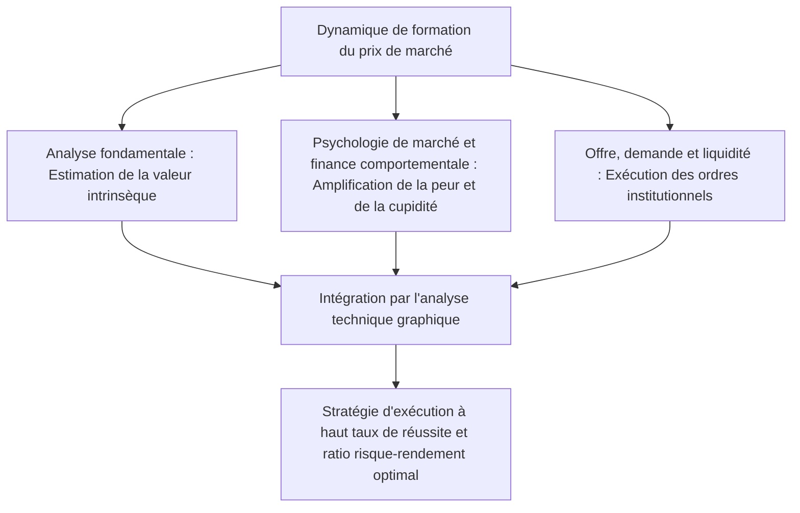
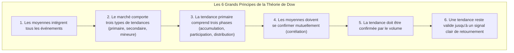
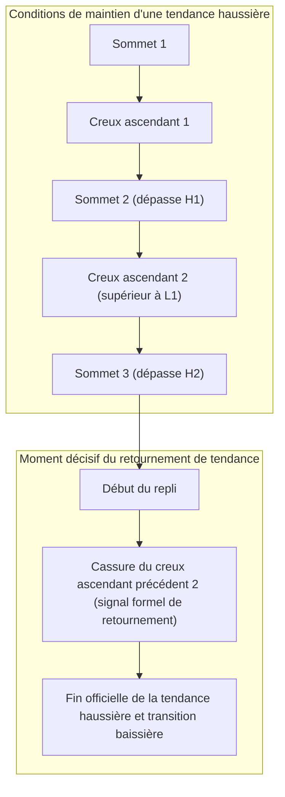
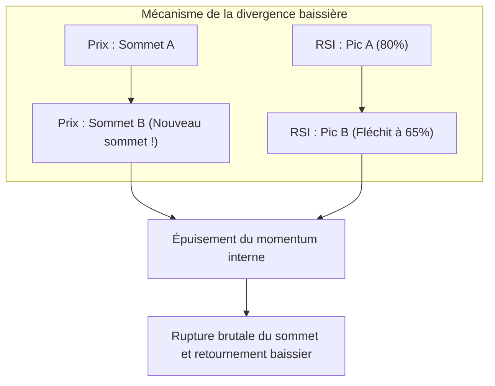
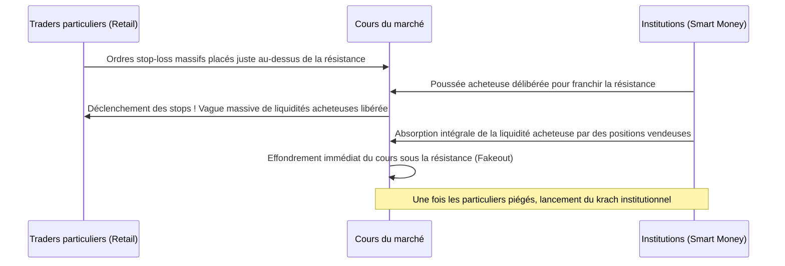
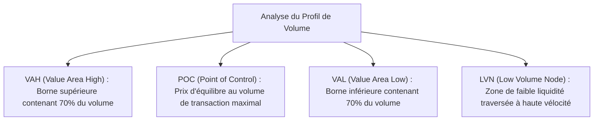

## 1. Introduction : Fondements philosophiques de l'analyse technique et nature du marché

### 1.1 Conflit et dépassement dialectique entre analyse fondamentale et analyse technique

Historiquement, l'élucidation des mécanismes de formation des prix sur les marchés financiers et la prévision de leurs fluctuations futures se sont divisées en deux grands courants de pensée : l'« analyse fondamentale » (*Fundamental Analysis*) et l'« analyse technique » (*Technical Analysis*).

L'analyse fondamentale s'attache à déterminer la « valeur intrinsèque » (*Intrinsic Value*) d'un actif à travers l'étude approfondie des états financiers des entreprises, des flux de trésorerie (*cash-flow*), des taux d'intérêt, de la croissance du PIB, des taux d'inflation et des risques géopolitiques. La décision d'investissement repose sur l'identification des distorsions de cours, lorsque le prix de marché s'écarte significativement de cette valeur théorique. Dans ce paradigme, on postule que même si le marché peut se montrer irrationnel à court terme, les prix finissent inévitablement par converger à long terme vers l'équilibre fondamental de l'économie et de l'entreprise.

À l'opposé, l'analyse technique prend pour objet exclusif l'évolution historique et actuelle du « Prix » (*Price*), du « Volume » (*Volume*) et du « Temps » (*Time*). Pour l'analyste technique, le véritable moteur des cours n'est pas le fait fondamental en soi, mais la façon dont ce fait est interprété par les acteurs du marché : à travers le prisme de la psychologie humaine, de la peur, de la cupidité, des biais cognitifs et des flux réels de capitaux (*la liquidité*).

Dans la pratique moderne du trading institutionnel de haut niveau, ces deux approches ne s'excluent pas : elles doivent faire l'objet d'un dépassement dialectique (*Aufhebung*). L'analyse fondamentale enseigne **ce qu'il faut négocier** (la sélection des actifs), tandis que l'analyse technique détermine **quand intervenir et où borner strictement son risque** (le timing d'exécution et la gestion du risque). Quelle que soit la solidité financière d'une entreprise, son action peut s'effondrer pendant des années si le marché global traverse une tendance baissière majeure. Rendre visibles ces dynamiques sous-jacentes d'écoulement des flux constitue la raison d'être fondamentale de l'analyse technique.



---

### 1.2 « Le prix intègre tous les événements » : Critique de l'Hypothèse des Marchés Efficients (EMH) et économie comportementale

Le premier axiome de l'analyse technique s'énonce ainsi : **« Le cours de marché intègre instantanément l'ensemble des informations disponibles — qu'il s'agisse des données publiques, des indiscrétions d'initiés, des anticipations spéculatives, des catastrophes naturelles, des tensions géopolitiques ou des états psychologiques des opérateurs. »**

Pendant des décennies, la théorie financière académique a été dominée par l'Hypothèse des Marchés Efficients (*Efficient Market Hypothesis* - EMH). Dans sa forme faible (*Weak-Form*), cette hypothèse postule que l'historique des prix et des volumes étant déjà pleinement reflété dans les cours actuels, il est mathématiquement impossible de générer un rendement excédentaire durable (*alpha*) à l'aide de l'analyse technique.

Cependant, l'essor fulgurant de l'économie comportementale (*Behavioral Economics*) et de la finance comportementale à partir des années 1980 a démontré, données expérimentales à l'appui, que le postulat d'« agents économiques rationnels » était une illusion théorique contredite par les faits :
- La « Théorie des perspectives » (*Prospect Theory*), développée par Daniel Kahneman et Amos Tversky, a mis en évidence une asymétrie cognitive fondamentale : l'être humain fait preuve d'une forte aversion au risque face aux gains, mais devient dangereusement enclin au risque face aux pertes.
- Les biais cognitifs récurrents tels que l'effet d'ancrage, le comportement grégaire (*Herding Behavior*), le biais de confirmation et l'excès de confiance (*Overconfidence*) engendrent inévitablement des cycles rythmés d'euphorie spéculative (« surachat / bulle ») et de panique irrationnelle (« survente / krach »).

L'analyse technique ne prétend pas être une boule de cristal prédisant l'avenir au milieu d'un bruit stochastique. Elle constitue **« le déchiffrage statistique de figures géométriques reproductibles, gravées sur les graphiques par les biais cognitifs universels de la foule lorsqu'elle agit en collectivité »**.

---

### 1.3 Hypothèse de la structure fractale contre la marche aléatoire (Mandelbrot)

Une autre contestation académique majeure repose sur la « Théorie de la marche aléatoire » (*Random Walk Theory*). Celle-ci postule que les variations de prix obéissent à une loi de distribution normale (loi gaussienne) et qu'aucune autocorrélation n'existe entre les fluctuations passées et futures.

Cette vision classique a été réfutée de manière décisive par Benoît Mandelbrot, père de la géométrie fractale. En analysant méticuleusement des décennies de séries temporelles sur les cours du coton et les taux de change, Mandelbrot a établi mathématiquement trois réalités structurelles :

1. **Les queues de distribution épaisses (*Fat Tails*)** : Les variations de prix sur les marchés financiers ne suivent pas une loi normale. Les mouvements extrêmes (*événements de type Cygne Noir*) surviennent à une fréquence des milliers de fois supérieure aux prédictions gaussiennes, obéissant à des lois de puissance (*Power Laws*).
2. **Le regroupement de la volatilité (*Volatility Clustering*)** : Les fortes variations de cours sont systématiquement suivies de fortes variations, et les périodes calmes sont suivies de périodes calmes, démontrant une autocorrélation marquée de la variance.
3. **L'auto-similarité (*Self-Similarity*)** : Si l'on dispose côte à côte un graphique en données 1 minute, un graphique journalier et un graphique mensuel en masquant l'échelle de temps, même le trader le plus chevronné est incapable de distinguer les unités de temps, tant les structures géométriques sont rigoureusement similaires.

Cette « nature fractale des marchés » apporte la justification mathématique objective de l'efficacité de l'analyse technique à travers toutes les échelles temporelles. Les tendances des unités de temps inférieures s'emboîtent au sein des tendances des unités supérieures ; c'est précisément à l'instant où ces différentes échelles entrent en résonance qu'émerge un momentum directionnel massif.

---

## 2. Pierre angulaire de l'analyse graphique moderne : Les 6 grands principes de la Théorie de Dow et leur réinterprétation contemporaine

Toutes les théories de l'analyse technique moderne (les Vagues d'Elliott, les lois de Granville, le Price Action contemporain) puisent leurs origines dans la « Théorie de Dow » (*Dow Theory*), formulée par Charles H. Dow (1851–1902), fondateur du *Wall Street Journal*. Bien que Dow n'ait jamais rédigé de traité unifié — laissant ses réflexions sous forme d'éditoriaux —, ses successeurs Samuel Nelson, William Peter Hamilton et Robert Rhea en ont extrait et formalisé les six principes cardinaux.



---

### 2.1 Principe 1 : Les moyennes (prix de marché) intègrent tous les événements

Les indices représentatifs, à l'image du Dow Jones, synthétisent en permanence la conjoncture macroéconomique, les bénéfices d'entreprises, les politiques monétaires, les catastrophes climatiques, les conflits armés, ainsi que la psychologie et les arbitrages de l'ensemble des investisseurs. Dès qu'un indicateur économique ou une dépêche financière est rendu public, son impact est instantanément absorbé par le marché. Par conséquent, attendre la publication des données fondamentales avant de se positionner condamne l'opérateur à un temps de retard structurel. L'observation directe de l'action des prix constitue la méthode de collecte d'informations la plus précoce et la plus exhaustive qui soit.

---

### 2.2 Principe 2 : Le marché comporte trois tendances

Charles Dow a comparé les mouvements de marché aux flux marins en distinguant trois strates temporelles :

1. **La tendance primaire (*Primary Trend* : la marée)** : D'une durée comprise entre un an et plusieurs années, ce mouvement de fond détermine l'orientation macroscopique du marché.
2. **La tendance secondaire (*Secondary Trend* : les vagues)** : Mouvement de correction intervenant à contre-courant de la tendance primaire. Elle s'étale généralement sur trois semaines à trois mois et retrace entre un tiers et deux tiers (souvent la moitié) de l'amplitude de la tendance primaire.
3. **La tendance mineure (*Minor Trend* : le ressac ou clapotis)** : Oscillations à court terme durant moins de trois semaines (de quelques heures à quelques jours). Façonnée par le bruit de fond quotidien et la spéculation immédiate, elle est hautement vulnérable aux manipulations et s'avère particulièrement trompeuse lorsqu'elle est analysée isolément.

Dans le trading moderne, cette classification constitue le socle de l'**Analyse Multi-Timeframe (MTF)**. Déterminer la marée sur les unités journalières et hebdomadaires (*Daily/Weekly*), attendre le reflux de la vague sur le 4 heures (*4H*) pour identifier un repli optimal, et saisir le signal d'entrée sur le 15 minutes ou 5 minutes (*15m/5m*) découle directement des enseignements de Dow.

---

### 2.3 Principe 3 : La tendance primaire comprend trois phases

Une tendance primaire (en particulier une tendance haussière) traverse invariablement trois phases psychologiques distinctes :


- **Phase 1 : Accumulation (*Accumulation*)** : Au cœur de la récession ou au point culminant d'un krach boursier, alors que le pessimisme est généralisé, une minorité d'opérateurs institutionnels particulièrement clairvoyants (*la Smart Money*) achète discrètement des actifs dépréciés. Les cours évoluent dans un canal horizontal étroit et la volatilité se contracte à l'extrême.
- **Phase 2 : Participation publique (*Public Participation / Markup*)** : Les statistiques macroéconomiques s'améliorent et les bilans d'entreprises confirment le redressement. Les traders techniques suiveurs de tendance entrent massivement sur le marché. Le cours progresse alors de manière fluide et dynamique : c'est la phase la plus longue, la plus stable et la plus rentable du cycle.
- **Phase 3 : Distribution (*Distribution*)** : Les médias généralistes titrent quotidiennement sur la hausse spectaculaire de l'actif. Le grand public, dépourvu d'expérience financière (*le Dumb Money*), cède au FOMO (*Fear Of Missing Out*) et se précipite à l'achat. Durant cette euphorie, la Smart Money — qui s'était positionnée à bas coût lors de la phase 1 — liquide méthodiquement ses positions en les vendant à cette foule crédule. Sur le graphique, les cours subissent alors une volatilité erratique avec de longues mèches supérieures : la tendance touche à sa fin.

---

### 2.4 Principe 4 : Les moyennes doivent se confirmer mutuellement

À l'époque de Charles Dow, ce principe s'articulait autour de la comparaison entre l'indice industriel (*Dow Jones Industrial Average*) et l'indice ferroviaire (*Dow Jones Transportation Average*). Quels que soient les volumes fabriqués par les usines, la prospérité économique ne pouvait être considérée comme avérée si ces marchandises n'étaient pas transportées par le rail vers les marchés de consommation. Dès lors, l'inscription d'un nouveau sommet par l'indice industriel ne constituait pas un signal haussier fiable sans un nouveau sommet concomitant de l'indice des transports.

Aujourd'hui, ce principe s'applique à travers l'**analyse intermarchés (*Intermarket Analysis*)** et les **indicateurs d'amplitude de marché (*Market Internals*)** :
- Le nouveau sommet du S&P 500 est-il validé par le NASDAQ (valeurs technologiques) et le Russell 2000 (petites capitalisations) ?
- Sur le marché des changes, la hausse du dollar face au yen (USD/JPY) s'aligne-t-elle avec la progression des rendements obligataires américains à 10 ans et du Dollar Index (DXY) ?
- Sur les cryptomonnaies, l'échappée du Bitcoin s'accompagne-t-elle d'une dynamique similaire sur Ethereum et l'ensemble des altcoins ?

Une cassure haussière isolée sans confirmation transversale présente une probabilité élevée de constituer un piège d'acheteurs (*Bull Trap*) orchestré par les teneurs de marché.

---

### 2.5 Principe 5 : La tendance doit être confirmée par le volume

Le prix indique la **direction** de la tendance ; le volume en révèle l'**énergie et la véracité**.

- **Dans une tendance haussière saine** : Le volume s'accroît lors des phases d'ascension et diminue lors des phases de consolidation ou de repli technique.
- **Dans une tendance baissière saine** : Le volume augmente lors des phases d'accélération baissière et se contracte lors des rebonds techniques.

Si les cours inscrivent de nouveaux sommets alors que les volumes décroissent régulièrement, le marché envoie un avertissement critique (*Divergence de Volume*) : les acheteurs réels s'épuisent et la hausse apparente n'est soutenue que par l'absence momentanée de contrepartie vendeuse. Richard Wyckoff développera ultérieurement ce principe pour donner naissance à la méthode VSA (*Volume Spread Analysis*), décodant les intentions institutionnelles par la confrontation du volume et du différentiel de cours.

---

### 2.6 Principe 6 : Une tendance se poursuit jusqu'à un signal clair de retournement

Sur le plan opérationnel, ce sixième principe est la règle cardinale que tout trader graphique doit respecter avec une rigueur absolue.

La définition formelle d'une tendance selon Dow est d'une grande rigueur géométrique :
- **Définition d'une tendance haussière** : **Une succession ininterrompue de sommets de plus en plus hauts (*Higher Highs*) et de creux de plus en plus hauts (*Higher Lows*)**.
- **Définition d'une tendance baissière** : **Une succession ininterrompue de sommets de plus en plus bas (*Lower Highs*) et de creux de plus en plus bas (*Lower Lows*)**.



Aussi vertigineuse que paraisse une hausse, et même si le cours semble subjectivement « trop cher », la tendance haussière demeure techniquement intacte tant que le dernier creux ascendant majeur (*Higher Low*) n'a pas été clôturé à la baisse. Chercher à anticiper le sommet au doigt mouillé relève de l'hérésie financière la plus destructrice.

---

## 3. Théorie des Vagues d'Elliott et mystères de la géométrie de Fibonacci

### 3.1 L'ordre cosmique selon Ralph Nelson Elliott

Tandis que la théorie de Dow formalisait l'orientation et le retournement des tendances, c'est Ralph Nelson Elliott (1871–1948) qui a élevé la modélisation du rythme et de la nature fractale des prix à son plus haut degré d'abstraction. Cloué au lit par une grave maladie, Elliott étudia manuellement 75 années de graphiques mensuels, hebdomadaires, journaliers et même en tranches de 30 minutes de l'indice Dow Jones, avant de publier en 1938 son œuvre magistrale : *The Wave Principle* (« Le Principe des Vagues »).

Elliott a démontré que la psychologie collective des foules suit les mêmes lois géométriques universelles que les structures naturelles (la spirale du nautile, la phyllotaxie des plantes ou la rotation des galaxies), régies par le Nombre d'Or et la suite de Fibonacci. Le marché ne procède pas d'un désordre chaotique : il s'organise selon **un cycle fondamental invariant de 8 vagues, composé de 5 vagues d'impulsion (*Impulse Waves*) et de 3 vagues de correction (*Corrective Waves*)**.

```mermaid
flowchart LR
    subgraph Vagues d'impulsion (Sens de la tendance : 5 vagues)
        W1["Vague 1<br/>(Démarrage)"] --> W2["Vague 2<br/>(Correction profonde)"]
        W2 --> W3["Vague 3<br/>(Explosion majeure)"]
        W3 --> W4["Vague 4<br/>(Consolidation complexe)"]
        W4 --> W5["Vague 5<br/>(Dernière euphorie)"]
    end
    subgraph Vagues de correction (Contre-tendance : 3 vagues)
        W5 --> WA["Vague A<br/>(Impulsion baissière)"]
        WA --> WB["Vague B<br/>(Rebond trompeur)"]
        WB --> WC["Vague C<br/>(Chute dévastatrice)"]
    end
```

---

### 3.2 Structure de la vague d'impulsion et 3 règles cardinales inviolables

Au sein des vagues se déployant dans le sens de la tendance générale, la structure motrice canonique répond à **trois règles absolues et non négociables**. Si une seule de ces règles est violée, le décompte des vagues est faux et l'analyse doit être reprise de zéro :

1. **Règle 1 : La vague 2 ne retrace jamais à 100% ou plus de la vague 1.** (Si elle enfonce l'origine de la vague 1, le mouvement antérieur baissier est toujours en cours).
2. **Règle 2 : La vague 3 n'est JAMAIS la plus courte parmi les vagues 1, 3 et 5.** (Dans la majorité des cas, la vague 3 est la plus étendue et la plus puissante).
3. **Règle 3 : La vague 4 ne pénètre jamais dans le territoire de cours de la vague 1.** (Dès l'instant où le point bas de la vague 4 recoupe le sommet de la vague 1, la structure cesse d'être une impulsion standard pour devenir une diagonale d'amorce ou de terminaison).

#### Caractéristiques psychologiques de chaque vague :
- **Vague 1** : Démarrage du changement de tendance. Le contexte fondamental reste morose et la majorité des intervenants n'y voit qu'un rebond sans lendemain ; la progression reste modérée.
- **Vague 2** : Retracement violent de la vague 1. Persuadés que la baisse reprend, les opérateurs paniquent et vendent, provoquant un repli profond qui efface fréquemment $50\%$ à $61.8\%$ (voire $78.6\%$) de la vague 1, sans toutefois violer son point de départ.
- **Vague 3** : Les signaux graphiques s'alignent, les niveaux de résistance majeurs sont pulvérisés et la foule des suiveurs de tendance se rue à l'achat. Les volumes explosent, des gaps d'échappement apparaissent et les cours s'envolent dans un mouvement vertical impressionnant. C'est la vague reine où les professionnels allouent leur taille de position maximale.
- **Vague 4** : Phase de prise de bénéfices partielle après les gains colossaux de la vague 3. Les cours s'installent dans une dérive latérale souvent longue et frustrante, formant des figures complexes telles que des triangles (règle de l'alternance : si la vague 2 a été simple et abrupte, la vague 4 sera longue et complexe).
- **Vague 5** : Les nouvelles fondamentales sont au zénith et le grand public achète frénétiquement. C'est l'ultime poussée haussière. Cependant, les oscillateurs de momentum (RSI, MACD) refusent d'inscrire de nouveaux plus hauts, dessinant une nette divergence baissière qui prévient de l'épuisement imminent des forces acheteuses.

---

### 3.3 Taxonomie des vagues de correction

Une fois la phase d'impulsion achevée, la correction qui s'ensuit déploie une variété géométrique beaucoup plus riche que le cycle moteur. Elliott en a identifié trois catégories fondamentales :

1. **Le Zigzag (Structure 5-3-5)** : Correction abrupte et profonde. Vague A (5 sous-vagues baissières) $\rightarrow$ Vague B (rebond en 3 vagues retracant $38.2\%$ à $50\%$ de A) $\rightarrow$ Vague C (vague d'accélération baissière en 5 sous-vagues, d'amplitude comparable à A).
2. **Le Flat ou Correction à plat (Structure 3-3-5)** : Consolidation latérale. Vague A (3 sous-vagues) $\rightarrow$ Vague B (rebond en 3 sous-vagues remontant tester le sommet d'origine de A) $\rightarrow$ Vague C (baisse en 5 sous-vagues n'enfonçant que modérément le creux de A). Dans un marché puissant, on assiste couramment à un *Expanded Flat* (Flat élargi), où la vague B dépasse le sommet de A avant que la vague C ne chute lourdement sous le plancher de A.
3. **Le Triangle (Structure 3-3-3-3-3)** : Équilibre des forces matérialisé par une compression progressive de la volatilité en 5 sous-vagues (A-B-C-D-E). Cette figure apparaît exclusivement avant la vague finale d'un degré supérieur (vague 4 ou vague B). Sa résolution déclenche une dernière poussée explosive (*thrust* en vague 5).

---

### 3.4 Ratios de Fibonacci et calcul prédictif des cibles de cours

La véritable force opérationnelle des Vagues d'Elliott réside dans leur corrélation mathématique avec la suite de Fibonacci ($0, 1, 1, 2, 3, 5, 8, 13, 21, 34, 55, 89, 144\dots$) et le Nombre d'Or, qui permettent de quantifier à l'avance les cibles de retracement et d'extension avec une précision remarquable.

Ratios de Fibonacci clés :
- $\phi = \frac{\sqrt{5}-1}{2} \approx 0.618$
- $1 - \phi \approx 0.382$
- $\sqrt{0.618} \approx 0.786$
- $1.618$ (ratio d'or inverse et facteur d'extension canonique)
- $2.618, 4.236$

#### Formules de projection en conditions de marché :
1. **Niveau de repli de la Vague 2** : **$61.8\%$** ou **$50.0\%$**, au maximum **$78.6\%$** de l'amplitude verticale de la Vague 1.
2. **Objectif de cours de la Vague 3** : En notant $W_1$ l'amplitude de la Vague 1 et $L_2$ le creux terminal de la Vague 2 :
   $$Target(W_3) = L_2 + 1.618 \times W_1$$
   Dans les phases de surmultiplication haussière :
   $$Target(W_3) = L_2 + 2.618 \times W_1$$
3. **Niveau de repli de la Vague 4** : **$38.2\%$** de l'amplitude de la Vague 3 (retracement peu profond), coïncidant fréquemment avec le creux de la sous-vague 4 interne de la Vague 3.
4. **Objectif de cours de la Vague 5** : Calculer **$61.8\%$** de la distance totale cumulée entre l'origine de la Vague 1 et le sommet de la Vague 3, puis projeter cette valeur à partir du creux de la Vague 4.

---

## 4. Sagacité orientale : Morphologie des chandeliers japonais et Cinq Méthodes de Sakata

Alors que l'analyse technique occidentale a débuté par des courbes simples et des graphiques à barres (*bar charts*), le Japon développait dès le XVIIIe siècle, sous l'ère Edo au marché du riz de Dojima à Osaka, le premier marché à terme organisé du monde ainsi qu'un système d'analyse graphique autonome. La figure tutélaire de cette discipline est Munehisa Homma (1724–1803), dont le traité de philosophie boursière, le *San-en Kinsen Hiroku*, posa les fondations de ce qui sera formalisé plus tard sous le nom des « Cinq Méthodes de Sakata » (*Sakata Goho*).

---

### 4.1 Dynamique interne du chandelier japonais (Candlestick)

Un chandelier japonais condense les quatre cours fondamentaux d'une unité de temps : l'Ouverture (*Open*), le Plus Haut (*High*), le Plus Bas (*Low*) et la Clôture (*Close*), matérialisés par un corps rectangulaire (*Real Body*) encadré d'ombres supérieure et inférieure (*Shadows* ou mèches).

Lorsque Steve Nison fit découvrir ces figures aux marchés occidentaux à la fin des années 1980 avec son ouvrage *Japanese Candlestick Charting Techniques*, Wall Street fut saisie par la supériorité visuelle de cette méthode. Aujourd'hui, les chandeliers sont devenus le standard universel de représentation des prix.

| Morphologie du chandelier | Caractéristiques structurelles | Psychologie interne et dynamique des forces |
| :--- | :--- | :--- |
| **Marubozu (Grande bougie pleine)** | Corps extrêmement développé, quasi absence totale de mèches supérieure et inférieure. | Domination absolue et unilatérale des acheteurs de l'ouverture à la clôture. Signal haussier d'une grande puissance. |
| **Marteau / Pinbar (Hammer)** | Petit corps situé à l'extrémité supérieure, doté d'une longue mèche basse valant au moins deux fois la hauteur du corps. | Les vendeurs ont massivement fait chuter le cours durant la séance, mais ont heurté un mur institutionnel d'ordres d'achat qui a entièrement absorbé la baisse pour ramener le cours près de l'ouverture. **Signal de retournement haussier d'une fiabilité maximale au creux d'un mouvement**. |
| **Étoile filante (Shooting Star)** | Petit corps situé à l'extrémité inférieure, doté d'une longue mèche haute valant au moins deux fois la hauteur du corps. | Les acheteurs ont propulsé le cours vers de nouveaux sommets, mais se sont heurtés à un afflux massif d'ordres de vente institutionnels qui a écrasé le marché jusqu'à la clôture. **Signal de formation de sommet et de retournement baissier**. |
| **Doji** | Ouverture et clôture situées rigoureusement au même niveau. Le corps se résume à un trait horizontal formant une croix. | Parfaite neutralisation réciproque entre acheteurs et vendeurs. Marque une indécision majeure, constituant souvent l'aube d'un retournement violent. |

---

### 4.2 L'essence des Cinq Méthodes de Sakata

Les Cinq Méthodes de Sakata combinent plusieurs chandeliers consécutifs pour détecter les ruptures de dynamique de marché.

1. **Trois Montagnes (*San-zan*)** : Configuration matérialisant trois échecs successifs à franchir une zone de résistance majeure. La variante dont le sommet central est le plus élevé constitue les « Trois Bouddhas », équivalent historique de la figure occidentale en « Tête et Épaules » (*Head and Shoulders*). La rupture de la ligne de cou déclenche une puissante tendance baissière.
2. **Trois Rivières (*San-sen*)** : Configuration de creux testant par trois fois une zone de support (Triple creux ou Tête et Épaules inversée). Elle englobe également l'« Étoile du Matin » (*Morning Star*), combinaison d'un grand chandelier rouge, d'une petite bougie en étoile et d'un puissant chandelier vert, signifiant la capitulation finale des vendeurs.
3. **Trois Gaps (*San-ku*)** : Apparition de trois fenêtres de prix consécutives (*gaps*) dans le sens de la tendance. Le vieil adage stipule : « Vendez face au troisième gap haussier, achetez face au troisième gap baissier ». Cette succession marque l'emballement émotionnel paroxystique de la foule, signalant l'épuisement total du carburant directionnel.
4. **Trois Soldats (*San-pei*)** : Les « Trois Soldats Blancs » (*Akasanpei* : trois chandeliers haussiers réguliers et consécutifs) marquent le démarrage d'une vigoureuse tendance haussière depuis un point bas. Toutefois, si le troisième soldat présente une longue mèche haute, il s'agit d'un « soldat bloqué » (*Akasanpei Sakizumari*), avertissant d'un essoufflement. À l'inverse, l'apparition au sommet des « Trois Corbeaux Noirs » (*San-kuro*) annonce une chute vertigineuse.
5. **Trois Méthodes (*San-po*)** : Expression de la maxime philosophique « Savoir s'abstenir fait aussi partie du marché ». La configuration des « Trois Méthodes Haussières » s'ouvre par un grand chandelier vert, suivi de trois petits chandeliers rouges contenus dans le range de la première bougie, avant qu'un cinquième chandelier haussier explosif ne vienne dépasser le premier sommet. Elle permet d'identifier les consolidations transitoires et d'éviter les faux signaux de sortie.

---

## 5. Structure mathématique des indicateurs techniques et pièges opérationnels

Les indicateurs mathématiques superposés aux graphiques se répartissent en deux grandes familles : les **indicateurs de tendance** (suivi de tendance / *trend following*) et les **oscillateurs** (retour à la moyenne, surachat/survente, momentum). Une proportion alarmante de traders novices se fie aveuglément aux signaux générés par ces outils sans en maîtriser les fondements algorithmiques, subissant ainsi de lourdes pertes. Analysons l'architecture mathématique de ces indicateurs.

### 5.1 Mathématiques des indicateurs de tendance

#### ① Les Moyennes Mobiles (SMA vs EMA)
La moyenne mobile simple (*Simple Moving Average* - SMA) sur une période de $n$ séances se formule ainsi :
$$SMA_t = \frac{1}{n} \sum_{i=0}^{n-1} P_{t-i}$$
La faille critique de la SMA réside dans le fait qu'elle attribue un poids strictement identique ($1/n$) au cours de clôture d'aujourd'hui et à celui d'il y a $n$ jours. De ce fait, elle réagit avec un décalage temporel (*lag*) substantiel face aux impulsions récentes.

Pour pallier cette inertie, on recourt à la moyenne mobile exponentielle (*Exponential Moving Average* - EMA). L'EMA confère le coefficient de pondération le plus lourd au cours le plus récent $P_t$, tout en amortissant les données antérieures selon une décroissance exponentielle. En définissant le coefficient de lissage par $\alpha = \frac{2}{n+1}$, sa formule récursive s'établit comme suit :
$$EMA_t = \alpha P_t + (1 - \alpha) EMA_{t-1}$$
En raison de son exceptionnelle réactivité aux accélérations de cours, les traders intraday et les algorithmes d'arbitrage privilégient massivement l'EMA (notamment les EMA 20, 50 et 200) à la SMA classique.

#### ② Les Bandes de Bollinger (Bollinger Bands)
Développées par John Bollinger au début des années 1980, les Bandes de Bollinger encadrent une moyenne mobile par un canal proportionnel à l'écart-type des cours ($\sigma$) :
$$Middle = SMA_n(P)$$
$$\sigma = \sqrt{\frac{1}{n} \sum_{i=0}^{n-1} (P_{t-i} - Middle)^2}$$
$$Upper = Middle + k \cdot \sigma, \quad Lower = Middle - k \cdot \sigma \quad (\text{avec généralement } k=2)$$

Dans le cadre d'une distribution normale gaussienne, la probabilité qu'une valeur se situe dans l'intervalle délimité par $\pm 2\sigma$ est de **$95.44\%$**.
C'est ici que se dissimule le piège qui décime tant de capitaux : **les variations de cours sur les marchés financiers ne sont pas distribuées selon une loi normale, mais présentent des queues épaisses (*Fat Tails*)**.
Prendre systématiquement une position vendeuse sous prétexte que le cours touche la bande supérieure à $+2\sigma$ est un contresens tragique. En présence d'un flux tendanciel puissant, les cours collent littéralement à la bande supérieure qu'ils continuent d'écarter au fil d'une hausse exponentielle (phénomène de *Band Walk*). L'usage professionnel des Bandes de Bollinger consiste à repérer la phase de compression extrême des bandes (*Squeeze* : contraction aiguë de la volatilité) afin de se positionner dès la phase d'explosion directionnelle (*Expansion*).

---

### 5.2 Mathématiques des oscillateurs

#### ① Le RSI (Relative Strength Index : Indice de Force Relative)
Mis au point par J. Welles Wilder, le RSI compare, sur une durée déterminée (généralement 14 périodes), la moyenne des amplitudes haussières à la moyenne des amplitudes baissières, pour normaliser l'intensité du mouvement entre $0$ et $100\%$ :
$$RS = \frac{\text{Gain moyen sur les } n \text{ dernières périodes}}{\text{Perte moyenne sur les } n \text{ dernières périodes}}$$
$$RSI = 100 - \frac{100}{1 + RS} = \frac{\text{Gain moyen}}{\text{Gain moyen} + \text{Perte moyenne}} \times 100$$

Bien que la convention académique qualifie une valeur supérieure à $70\%$ de « surachat » et inférieure à $30\%$ de « survente », le RSI peut parfaitement demeurer bloqué au-delà de $80\%$ pendant que le cours double de valeur en tendance haussière parabolique.
L'application la plus rigoureuse du RSI réside dans l'exploitation des **« Divergences »** :
- **Divergence baissière** : Situation où le cours continue d'inscrire des sommets ascendants alors que le RSI inscrit simultanément des sommets descendants. Ce découplage signale que le flux sous-jacent soutenant la hausse s'évapore, indiquant l'imminence d'une correction brutale ou d'un retournement majeur.



---

## 6. Théorie moderne du Price Action et Smart Money Concepts (SMC)

Depuis les années 2010, les algorithmes de trading à haute fréquence (HFT) et les intelligences artificielles institutionnelles génèrent plus de $80\%$ des volumes d'échanges mondiaux. Cette mutation a considérablement dégradé la pertinence des indicateurs techniques classiques (stochastique, MACD, etc.). En réponse, la communauté des opérateurs professionnels a érigé en nouveau standard l'analyse du Price Action pur et les **Smart Money Concepts (SMC)**, se focalisant exclusivement sur la lecture brute des cours et des volumes.

### 6.1 Chasse à la liquidité et balayage de stops (Liquidity Sweep)

La thèse fondatrice des SMC repose sur un constat lucide : **« Le marché gravite en permanence vers les zones où se concentre la plus forte densité d'ordres stop-loss (la liquidité). »**

Les traders particuliers (*Retail Traders*), formés aux mêmes manuels d'initiation, placent mécaniquement leurs ordres de protection (*Stop Loss*) aux mêmes niveaux prévisibles : juste au-dessus des doubles sommets évidents ou juste en dessous des supports horizontaux de range. Cependant, les institutions financières (*la Smart Money*), qui manipulent des milliards de dollars, ne peuvent faire exécuter leurs ordres titanesques sans faire déraper les cours (*Slippage*), sauf si elles trouvent en face d'elles ces grappes massives de stops d'opérateurs particuliers.

1. **Le Balayage de liquidité (*Liquidity Sweep*)** : L'institution propulse délibérément et brièvement les cours au-delà d'un sommet ou d'un creux majeur.
2. Cette incursion déclenche en cascade les ordres stops des particuliers (ordres d'achat-stop ou de vente-stop), injectant instantanément un volume colossal de liquidité sur le carnet d'ordres.
3. L'institution absorbe l'intégralité de cette liquidité en contrepartie pour bâtir sa propre position inverse.
4. Les cours réintègrent immédiatement l'ancien range (*Fausse cassure / Fakeout*), laissant sur le graphique une longue mèche caractéristique (*Pinbar*), avant de s'élancer à pleine vitesse dans la direction opposée en ruinant les suiveurs piégés.



---

### 6.2 Fair Value Gap (FVG) et Blocs d'Ordres (Order Blocks)

Dans l'arsenal des SMC, deux configurations constituent le pivot opérationnel de la prise de position :

- **Le Fair Value Gap (FVG - Écart de Juste Valeur)** : Lorsqu'une institution injecte des volumes gigantesques en une fraction de seconde, il se crée sur une suite de trois chandeliers un vide de cotation entre le point haut du premier chandelier et le point bas du troisième. Cet espace n'a fait l'objet d'aucun échange équilibré (*Imbalance*). Les algorithmes de tenue de marché ayant horreur de cette inefficience, le cours a pour propriété statistique de revenir ultérieurement combler cette faille. Se positionner au contact de ce FVG permet d'entrer sur le marché avec un niveau d'invalidation millimétrique.
- **Le Bloc d'Ordres (*Order Block* - OB)** : Il s'agit du dernier groupe de chandeliers de sens inverse imprimé juste avant le déclenchement de la violente impulsion institutionnelle. Cette zone de prix conserve une mémoire institutionnelle majeure et fera office de support ou de résistance inexpugnable lors des futurs tests.

---

## 7. Le domaine ultime déterminant gains et pertes : Ratio Risque-Rendement et Mathématiques de la Gestion du Capital

Même armé de la plus brillante maîtrise de l'analyse technique, tout trader faisant fi des mathématiques de la gestion du capital (*Money Management*) est condamné avec une certitude probabiliste de $100\%$ à la ruine financière. Le trading n'est pas un art divinatoire : c'est un métier de gestion quantitative consistant à répéter une série d'opérations à espérance de gain mathématique positive (*Edge*), tout en appliquant un dimensionnement de capital qui maintient la probabilité de faillite à un niveau strictement nul.

### 7.1 Démonstration mathématique de la probabilité de ruine de Balsara (Risk of Ruin)

Le mathématicien Nauzer Balsara a conçu un modèle probabiliste rigoureux établissant la probabilité de faillite définitive d'un opérateur à partir de trois variables : son **taux de réussite** (*Win Rate*), son **ratio gain/perte moyen** (*Payoff Ratio* ou ratio de paiement) et sa **fraction de capital risquée par opération**.

- **Taux de réussite ($W$)** : Nombre de transactions gagnantes $\div$ Nombre total de transactions
- **Ratio de paiement ($R$)** : Gain moyen par trade gagnant $\div$ Perte moyenne par trade perdant

Le tableau ci-dessous indique les probabilités de ruine de Balsara dans l'hypothèse où l'opérateur engage $20\%$ de son capital global sur chaque opération :

| Taux de réussite \ Ratio de paiement ($R$) | 0.5 (Gains faibles / Grosses pertes) | 1.0 (Gains et pertes équivalents) | 1.5 (Gains supérieurs aux pertes) | 2.0 (Gains doubles idéaux) | 3.0 (Très fort gain relatif) |
| :---: | :---: | :---: | :---: | :---: | :---: |
| **30%** | 100% | 100% | 100% | 80.0% | 14.3% |
| **40%** | 100% | 100% | 38.2% | 14.1% | 1.2% |
| **50%** | 100% | 50.0% | 5.6% | 0.8% | **0.0%** |
| **60%** | 100% | 2.1% | 0.1% | **0.0%** | **0.0%** |
| **70%** | 14.3% | **0.0%** | **0.0%** | **0.0%** | **0.0%** |

Ce tableau démontre une vérité implacable : **Même avec un taux de réussite de $60\%$, si le ratio de paiement est de $0.5$ (gagner 1 pour perdre 2), la probabilité de faillite totale est mathématiquement de $100\%$.** C'est la raison exacte pour laquelle les néophytes, séduits par des méthodes promettant $90\%$ de trades gagnants, finissent invariablement par voir leur compte anéanti par une seule perte monumentale qui efface des mois de gains méticuleux.

À l'inverse, **avec seulement $40\%$ de réussite, si le ratio de paiement s'établit à $2.0$ (le gain moyen équivaut au double de la perte moyenne), la probabilité de faillite chute à $14\%$. Dès lors que ce ratio atteint $3.0$, la probabilité de ruine tombe à un infime $1.2\%$, assurant une croissance patrimoniale inéluctable sur le long terme**.

---

### 7.2 Règle des 2% et formule de dimensionnement quantitatif des positions

La règle de fer absolue des professionnels du risque s'énonce ainsi : **« La perte maximale autorisée sur une seule opération ne doit jamais excéder $1\%$ à $2\%$ de la valeur totale du compte »** (la règle des 2%).

L'erreur cardinale des débutants consiste à trader une quantité fixe d'actions ou de contrats (par exemple « 1 lot à chaque trade »). Cette pratique est mathématiquement aberrante car la distance séparant le point d'entrée du niveau d'invalidation technique (*Stop Loss*) varie d'une configuration graphique à l'autre selon la volatilité de l'actif.

Le dimensionnement rigoureux de la position découle de l'équation suivante :

$$Position\_Size = \frac{Account\_Balance \times Risk\_Percentage}{Entry\_Price - Stop\_Loss\_Price}$$

#### Exemple chiffré :
- Capital du compte : $10\,000\,000$ JPY (ou unités de compte)
- Risque consenti : $2\%$ (Perte maximale autorisée $= 200\,000$ JPY)
- Cours d'entrée : $150.00$ JPY (sur USD/JPY)
- Stop Loss technique d'invalidation : $149.20$ JPY (Distance du stop $= 0.80$ JPY $= 80$ pips)

La taille de position optimale à engager est :
$$Position\_Size = \frac{200\,000 \text{ JPY}}{0.80 \text{ JPY}} = 250\,000 \text{ unités de devises (soit 2.5 lots)}$$

Si la configuration graphique présentait un stop loss beaucoup plus serré à $0.40$ JPY ($40$ pips), l'opérateur pourrait allouer $5.0$ lots. À l'inverse, si le stop devait être élargi à $1.60$ JPY ($160$ pips), la taille devrait être obligatoirement ramenée à $1.25$ lot. **« Faire varier la taille de la position pour maintenir la perte monétaire parfaitement constante en valeur absolue »** : tel est l'unique rempart mathématique qui garantit la survie d'un portefeuille face aux pires séries consécutives de pertes.

---

### 7.3 Théorie des perspectives et dépassement des biais psychologiques

Pourquoi l'immense majorité des intervenants enfreint-elle ces règles de gestion pourtant limpides ? La réponse se niche dans l'histoire évolutive de notre cerveau.

Durant les centaines de milliers d'années passées par l'homme dans la savane à chasser et cueillir, tout gibier ou fruit découvert devait être consommé immédiatement sous peine de pourrir ou d'être dérobé par des prédateurs rivaux. De surcroît, refuser obstinément une perte de ressource vitale maximisait les chances de survie physique face au danger.

Transposés sur les marchés financiers modernes où règne la loi des probabilités, ces réflexes primitifs constituent un poison mortel :
1. **L'aversion au risque face au gain (couper ses profits trop tôt)** : Dès qu'une position affiche une plus-value latente, la peur panique de voir ce gain s'évaporer pousse l'opérateur à encaisser prématurément pour quelques pips.
2. **Le goût du risque face à la perte (refuser de solder ses pertes)** : Dès qu'une position plonge dans le rouge, un puissant déni cognitif prend le dessus. L'opérateur refuse d'acter sa perte, repousse son stop loss toujours plus loin, voire moyenne à la baisse (*Martingale*) en priant pour un retournement miraculeux.

Le Saint Graal du trading ne réside pas dans la découverte d'un indicateur technique secret. Il réside dans **« la prise de conscience lucide des biais inscrits dans notre code génétique (la malédiction de la Théorie des Perspectives) et la discipline souveraine de respecter avec la froideur d'une machine les lois probabilistes de l'espérance mathématique »**.

---

### 7.4 Mathématiques du Critère de Kelly (Kelly Criterion) et application pratique du Demi-Kelly

Aux côtés de la probabilité de ruine de Balsara, le monument théorique du dimensionnement du risque est le « Critère de Kelly » (*Kelly Criterion*), déduit en 1956 par John Larry Kelly Jr., physicien aux Laboratoires Bell, à partir de la théorie mathématique de l'information.

Le critère de Kelly détermine la fraction optimale du capital $f^*$ à engager afin de maximiser le taux de croissance logarithmique composé de la richesse sur le long terme :

$$f^* = \frac{b \cdot p - q}{b} = p - \frac{q}{b}$$

Avec les variables suivantes :
- $p$ : Probabilité de gain (Taux de réussite, avec $0 \le p \le 1$)
- $q = 1 - p$ : Probabilité d'échec
- $b$ : Ratio de paiement (*Payoff Ratio* : gain net espéré par unité monétaire risquée)

### Exemple d'application et piège de la ruine
Imaginons une stratégie de trading robuste affichant un taux de réussite de $p = 0.55$ ($55\%$) et un ratio de gain de $b = 1.5$ (ratio risque-rendement de 1:1.5) :
$$f^* = \frac{1.5 \times 0.55 - 0.45}{1.5} = \frac{0.825 - 0.45}{1.5} = \frac{0.375}{1.5} = 0.25 \quad (25\%)$$

Sur le plan strictement théorique, risquer **$25\%$** de son capital total sur chaque transaction produirait la croissance de richesse la plus rapide possible.
Pourtant, appliquer le plein critère de Kelly (*Full Kelly*) dans le trading réel s'apparente à un **comportement suicidaire**. En effet, la formule de Kelly postule de manière irréaliste que les probabilités sous-jacentes et le ratio de paiement sont parfaitement constants et connus à l'avance.

En situation réelle, une dégradation conjoncturelle du taux de réussite ou la survenue d'une séquence de sept pertes d'affilée sous un régime Full Kelly à $25\%$ engendrerait un effondrement du compte (*Drawdown*) supérieur à $80\%$, provoquant la ruine psychologique et financière irrémédiable du trader.

### La suprématie opérationnelle du Demi-Kelly (Half-Kelly)
C'est pourquoi les fonds quantitatifs et les professionnels appliquent systématiquement le **« Demi-Kelly » (*Half-Kelly*)** ou le « Quart de Kelly » :
- En appliquant la fraction de Demi-Kelly ($f^* / 2$), l'opérateur conserve environ **$75\%$** du taux de croissance théorique maximal tout en **réduisant la volatilité du capital et le drawdown maximal de plus de $50\%$**.
- Dans notre exemple, le risque alloué passerait à $12.5\%$ (ou à $6.25\%$ en Quart de Kelly). En appliquant en complément le plafond prudentiel absolu de la **règle des 2%**, le portefeuille s'installe dans une zone de pérennité mathématique inébranlable.

---

### 7.5 Profil de Volume (Volume Profile) et structure du POC (Point of Control)

Dans les chartes graphiques traditionnelles, le volume s'affiche en bas de page sous forme d'histogrammes verticaux ordonnés dans le temps (*Volume by Time*). Cependant, le pistage moderne des grands flux d'ordres institutionnels s'appuie désormais sur le **Profil de Volume (*Volume Profile / VPVR*)**, qui matérialise les volumes négociés horizontalement à chaque niveau de cours.



1. **Le POC (*Point of Control*)** : Niveau de cours unique où s'est échangé le plus gros volume d'ordres sur la période analysée. Il représente le prix de consensus perçu comme la « juste valeur » (*Fair Value*) par l'ensemble des acteurs. Il exerce une formidable force d'attraction magnétique lorsque les cours s'en éloignent.
2. **La Zone de Valeur (*Value Area* - VA)** : Tranche de prix englobant **$70\%$** du volume total échangé (correspondant au premier écart-type $1\sigma$ d'une distribution normale).
   - **VAH (*Value Area High*)** : Borne supérieure de la zone de valeur, agissant comme une puissante résistance.
   - **VAL (*Value Area Low*)** : Borne inférieure de la zone de valeur, agissant comme un support majeur.
3. **Le LVN (*Low Volume Node* : Nœud de Faible Volume)** : Creux de volume sur le profil horizontal correspondant à des prix rejetés sans consensus entre acheteurs et vendeurs. En l'absence de liquidités pour freiner le mouvement, le cours traverse ces zones de vide à une vitesse fulgurante et sans résistance.

Le recours au Profil de Volume permet de dépasser les simples lignes de support et résistance horizontales pour observer, à la manière d'une radiographie, les niveaux exacts où les flux de capitaux majeurs ont été effectivement injectés.

---

### 7.6 Protocole de synchronisation Multi-Timeframe (MTF)

Dans la pratique professionnelle, les opérations s'exécutent selon un protocole strict et méthodique de synchronisation à travers cinq échelons temporels :

| Échelon temporel | Fonction opérationnelle | Paramètres sous surveillance et décisions requises |
| :--- | :--- | :--- |
| **1. Hebdomadaire / Journalier (1W / 1D)** | Analyse de contexte (La marée majeure) | Tendance primaire (structure des sommets et creux selon Dow), inclinaison de l'EMA 200, zones macro de support et résistance. |
| **2. 4 Heures (4H)** | Configuration graphique (L'onde intermédiaire) | Décompte d'Elliott (progression d'une Vague 3 ou repli d'une Vague 4), niveaux de retracement de Fibonacci (test des 61.8%). |
| **3. 1 Heure (1H)** | Cartographie de la liquidité (Localisation des cibles) | Repérage des FVG (*Fair Value Gaps*), blocs d'ordres (*Order Blocks*), identification des réservoirs de stops (*Liquidity Pools*) sous les récents sommets/creux. |
| **4. 15 Minutes (15m)** | Confirmation du retournement local | Identification d'un changement de dynamique (*CHoCH : Change of Character*), franchissement d'un sommet descendant ou rupture d'un creux ascendant local. |
| **5. 5 Minutes / 1 Minute (5m / 1m)** | Exécution de l'entrée (Le déclencheur) | Signal en bougie d'invalidation (Pinbar, avalement haussier/baissier), calibrage du stop loss chirurgical, calcul de la taille de position et transmission de l'ordre. |

Ne pressez la détente que lorsqu'il y a **« Confluence »** absolue entre la vue d'ensemble macroscopique et le signal de déclenchement tactique microscopique. Tout le reste du temps, observer le marché sans position constitue la plus grande des vertus pour stabiliser sa courbe de gains et préserver son capital mental.

---

## 8. Conclusion : Le trading comme maîtrise suprême de son propre esprit

L'exploration de l'analyse technique des graphiques semble à première vue être une tentative de conquérir le marché extérieur ; en vérité, elle constitue une ascèse spirituelle dédiée à l'apprivoisement de son propre inconscient, de ses angoisses et de ses désirs de gain.

Le graphique boursier est le miroir géant où s'entrecroisent les espoirs, les terreurs, les calculs et l'arrogance d'innombrables êtres humains, algorithmes prédictifs, banques centrales et gérants de fonds à travers le monde. Chaque chandelier tracé sous nos yeux bat au rythme de la pulsation vivante de l'espèce humaine.

- Identifier les grandes marées de fond grâce à la Théorie de Dow,
- Mesurer les harmonies géométriques du marché grâce aux Vagues d'Elliott et à Fibonacci,
- Décoder la réalité immédiate des flux d'ordres grâce aux figures de Sakata et au Price Action moderne,
- Et conjurer définitivement sa propre perte grâce à la rigueur mathématique de Balsara et à une gestion de capital inflexible.

Lorsque ce corpus unifié est profondément assimilé et appliqué avec humilité face aux marchés quotidiens, le graphique cesse d'apparaître comme un chaos indéchiffrable : il se dévoile enfin dans toute sa splendeur comme une majestueuse et harmonieuse « symphonie des probabilités ».
