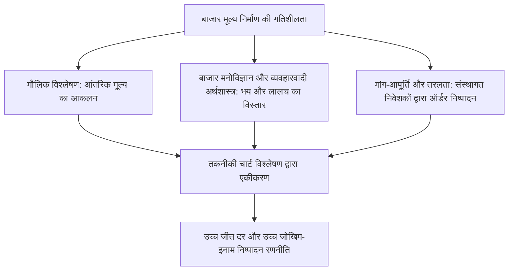
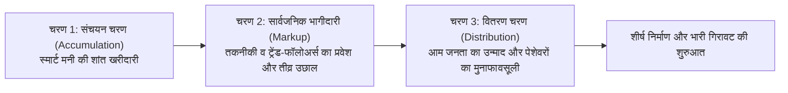
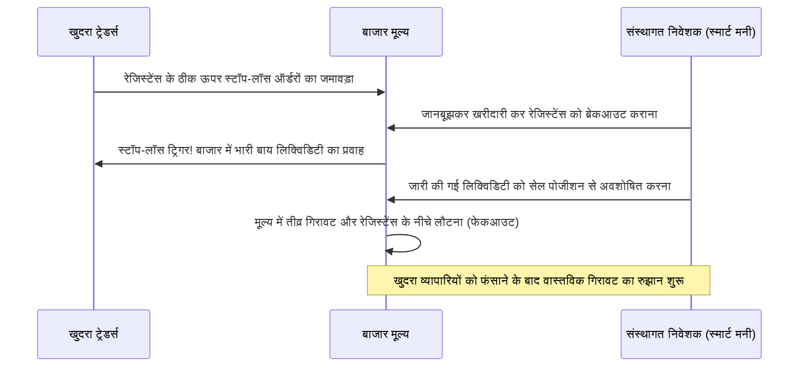
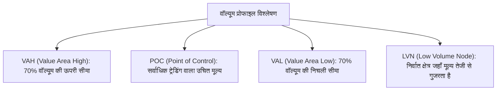

## 1. प्रस्तावना: तकनीकी विश्लेषण की दार्शनिक नींव और बाजार का मूल स्वभाव

### 1.1 मौलिक विश्लेषण और तकनीकी विश्लेषण का द्वंद्व और समन्वय (Aufheben)

वित्तीय बाजारों में मूल्य निर्माण के तंत्र को समझने और भविष्य में होने वाले मूल्य परिवर्तनों का पूर्वानुमान लगाने के लिए ऐतिहासिक रूप से दो प्रमुख धाराएं विकसित हुई हैं: "मौलिक विश्लेषण (Fundamental Analysis)" और "तकनीकी विश्लेषण (Technical Analysis)"।

मौलिक विश्लेषण किसी कंपनी के वित्तीय विवरणों, नकदी प्रवाह (Cash Flow), ब्याज दरों, जीडीपी विकास दर, मुद्रास्फीति दर और भू-राजनीतिक जोखिमों जैसे कारकों का मूल्यांकन करके उसके "आंतरिक मूल्य (Intrinsic Value)" का निर्धारण करता है। इसका उद्देश्य बाजार मूल्य और सैद्धांतिक मूल्य के बीच के अंतर को पहचानकर निवेश संबंधी निर्णय लेना होता है। इस दृष्टिकोण के अनुसार, बाजार मूल्य अल्पावधि में भले ही तर्कहीन हो, लेकिन दीर्घावधि में वह अंततः कंपनी के बुनियादी आधारों और व्यापक आर्थिक संतुलन बिंदु पर ही केंद्रित होता है।

इसके विपरीत, तकनीकी विश्लेषण का मुख्य केंद्र बिंदु अतीत से वर्तमान तक "मूल्य (Price)", "वॉल्यूम (ट्रेडिंग मात्रा)", और "समय (Time)" का ऐतिहासिक प्रक्षेपवक्र होता है। एक तकनीकी विश्लेषक यह मानता है कि कीमतों को संचालित करने वाली वास्तविक शक्ति बुनियादी आंकड़े नहीं हैं, बल्कि उन बुनियादी आंकड़ों की व्याख्या करने वाला "मानव मनोविज्ञान, भय, लालच, संज्ञानात्मक पूर्वाग्रह (Cognitive Biases) और पूंजी का वास्तविक प्रवाह (तरलता / Liquidity)" है।

आधुनिक उच्च-स्तरीय पेशेवर ट्रेडिंग में ये दोनों पद्धतियां एक-दूसरे की विरोधी नहीं हैं, बल्कि उनका दार्शनिक समन्वय या "ऑउफहेबेन (Aufheben)" होना आवश्यक है। मौलिक विश्लेषण हमें यह सिखाता है कि "क्या ट्रेड करना है (परिसंपत्ति का चयन)", जबकि तकनीकी विश्लेषण हमें यह सिखाता है कि "कब ट्रेड करना है और जोखिम को कहां सीमित करना है (समय और जोखिम प्रबंधन)"। वित्तीय रूप से चाहे कोई कंपनी कितनी भी मजबूत क्यों न हो, पूरे बाजार के व्यापक डाउनट्रेंड के दौरान वह वर्षों तक गिर सकती है; और उस गिरावट की आंतरिक गतिशीलता को स्पष्ट रूप से उजागर करना ही तकनीकी विश्लेषण की वास्तविक शक्ति है।



---

### 1.2 "मूल्य सभी घटनाओं को समाहित कर लेता है": कुशल बाजार परिकल्पना (EMH) की आलोचना और व्यवहारवादी अर्थशास्त्र

तकनीकी विश्लेषण का पहला सर्वोपरि स्वयंसिद्ध नियम यह है कि: **"बाजार मूल्य वर्तमान में उपलब्ध सभी सूचनाओं (न केवल सार्वजनिक सूचनाएं बल्कि आंतरिक जानकारी, बाजार की अटकलें, प्राकृतिक आपदाएं, भू-राजनीतिक जोखिम और प्रतिभागियों की मनोवैज्ञानिक स्थिति) को तात्कालिक रूप से समाहित (Discount) कर लेता है।"**

अकादमिक वित्तीय अर्थशास्त्र में लंबे समय से प्रभावी रही "कुशल बाजार परिकल्पना (Efficient Market Hypothesis: EMH)" के कमजोर रूप (Weak-Form) के अनुसार, यह माना जाता है कि "अतीत के मूल्य और वॉल्यूम संबंधी सभी आंकड़े वर्तमान मूल्य में पूरी तरह प्रतिबिंबित होते हैं, इसलिए तकनीकी विश्लेषण के माध्यम से बाजार के औसत से अधिक अल्फा (अतिरिक्त रिटर्न) अर्जित करना असंभव है।"

हालांकि, 1980 के दशक के बाद तेजी से विकसित हुए "व्यवहारवादी अर्थशास्त्र (Behavioral Economics)" और "व्यवहारवादी वित्त (Behavioral Finance)" ने प्रयोगात्मक मनोविज्ञान के माध्यम से यह अकाट्य रूप से सिद्ध कर दिया कि कुशल बाजार परिकल्पना की यह मूलभूत पूर्वधारणा कि "बाजार के सभी प्रतिभागी सदैव तर्कसंगत होते हैं", वास्तविक दुनिया में पूरी तरह से गलत साबित होती है।
- डैनियल काह्नमैन (Daniel Kahneman) और अमोस टवरस्की (Amos Tversky) द्वारा प्रतिपादित **"प्रॉस्पेक्ट सिद्धांत (Prospect Theory)"** ने यह उजागर किया कि मनुष्य लाभ की स्थिति में "जोखिम से बचने वाला (Risk-Averse)" और नुकसान की स्थिति में "अत्यधिक जोखिम उठाने वाला (Risk-Seeking)" बन जाता है।
- एंकरिंग प्रभाव (Anchoring Effect), झुंड मानसिकता (Herding Behavior), पुष्टिकरण पूर्वाग्रह (Confirmation Bias) और अति-आत्मविश्वास (Overconfidence) जैसे मनोवैज्ञानिक पूर्वाग्रह बाजार में नियमित रूप से "अत्यधिक खरीदारी (बुलबुला / Bubble)" और "अत्यधिक बिकवाली (आतंक / Panic)" के चक्रों को अनिवार्य रूप से जन्म देते हैं।

तकनीकी विश्लेषण यादृच्छिक शोर के समुद्र से भविष्य बताने वाली कोई जादुई क्रिस्टल बॉल नहीं है। यह तो **"मानव के सार्वभौमिक संज्ञानात्मक पूर्वाग्रहों द्वारा चार्ट पर सामूहिक व्यवहार के रूप में उकेरे जाने वाले दोहरावदार ज्यामितीय पैटर्नों का सांख्यिकीय विश्लेषण"** है।

---

### 1.3 रैंडम वॉक सिद्धांत बनाम फ्रैक्टल संरचना परिकल्पना (मंडेलब्रॉट)

तकनीकी विश्लेषण पर एक अन्य प्रमुख अकादमिक आक्षेप "रैंडम वॉक सिद्धांत (Random Walk Theory)" का रहा है। इस सिद्धांत का दावा है कि मूल्य परिवर्तनों का संभाव्यता वितरण एक सामान्य वितरण (Gaussian Distribution) का पालन करता है, और पिछले मूल्य परिवर्तनों तथा भविष्य के मूल्य आंदोलनों के बीच कोई स्वसंबंध (Autocorrelation) नहीं होता।

इस शास्त्रीय परिकल्पना का निर्णायक खंडन फ्रैक्टल ज्यामिति के जनक बेनोइट मंडेलब्रॉट (Benoit Mandelbrot) ने किया। मंडेलब्रॉट ने दशकों के कपास मूल्यों और विदेशी मुद्रा विनिमय दरों के अत्यंत दीर्घावधि आंकड़ों का गहन विश्लेषण किया और गणितीय रूप से निम्नलिखित सत्यों को सिद्ध किया:

1. **फैट-टेल्स (Fat Tails)**: वित्तीय बाजारों में मूल्य परिवर्तन सामान्य वितरण का पालन नहीं करते। इनमें अप्रत्याशित चरम मूल्य परिवर्तन (ब्लैक स्वान घटनाएं / Black Swan Events) सामान्य वितरण द्वारा अनुमानित संभावनाओं की तुलना में हजारों गुना अधिक बार होते हैं, जो "घात नियम (Power Law)" का पालन करते हैं।
2. **अस्थिरता क्लस्टरिंग (Volatility Clustering)**: बड़े मूल्य परिवर्तनों के बाद बड़े परिवर्तन और छोटे परिवर्तनों के बाद छोटे परिवर्तन आते हैं; अर्थात अस्थिरता (प्रसरण) में स्वसंबंध पाया जाता है।
3. **स्व-समानता (Self-Similarity)**: यदि 1-मिनट के चार्ट, दैनिक चार्ट और मासिक चार्ट से समय-सीमा के लेबल हटाकर उन्हें एक साथ रख दिया जाए, तो एक पेशेवर ट्रेडर भी यह पहचानने में असमर्थ होगा कि कौन सा चार्ट किस समय-सीमा का है; उनकी ज्यामितीय आकृतियां इतनी समान होती हैं।

यह "बाजार की फ्रैक्टल संरचना" ही वह वस्तुनिष्ठ गणितीय प्रमाण है जिसके कारण तकनीकी विश्लेषण विभिन्न समय-सीमाओं में समान रूप से प्रभावी बना रहता है। उच्च समय-सीमा (Higher Timeframe) के ट्रेंड के भीतर निचली समय-सीमाओं (Lower Timeframes) के ट्रेंड एक अंतर्निहित घोंसले (Nested Structure) की तरह मौजूद रहते हैं, और जिस क्षण वे एक दिशा में संरेखित होते हैं, उसी क्षण बाजार में प्रचंड मोमेंटम उत्पन्न होता है।

---

## 2. आधुनिक चार्ट विश्लेषण की आधारशिला: डाउ सिद्धांत के 6 मूलभूत नियम और उनका आधुनिक पुनर्व्याख्या

आधुनिक तकनीकी विश्लेषण के सभी प्रमुख सिद्धांतों (इलियट वेव, ग्रैनविले के नियम, आधुनिक प्राइस एक्शन आदि) का उद्गम 'द वॉल स्ट्रीट जर्नल' के संस्थापक चार्ल्स एच. डाउ (Charles H. Dow, 1851–1902) द्वारा प्रतिपादित "डाउ सिद्धांत (Dow Theory)" में निहित है। यद्यपि डाउ ने स्वयं कोई व्यवस्थित पुस्तक नहीं लिखी बल्कि केवल संपादकीय लिखे थे, उनकी मृत्यु के पश्चात सैमुअल नेल्सन, विलियम हैमिल्टन और रॉबर्ट रीह ने उनके विचारों को 6 मूलभूत सिद्धांतों के रूप में संहिताबद्ध किया।

```mermaid
flowchart TD
    subgraph डाउ सिद्धांत के 6 मूलभूत नियम
        D1["1. औसत (बाजार मूल्य) सभी घटनाओं को समाहित कर लेते हैं"]
        D2["2. बाजार में तीन प्रकार के रुझान होते हैं (प्राथमिक, द्वितीयक, लघु)"]
        D3["3. प्राथमिक रुझान के तीन चरण होते हैं (संचयन, सार्वजनिक भागीदारी, वितरण)"]
        D4["4. औसतों द्वारा एक-दूसरे की पुष्टि होनी चाहिए (अंतर्संबंध)"]
        D5["5. रुझान की पुष्टि वॉल्यूम (ट्रेडिंग मात्रा) द्वारा होनी चाहिए"]
        D6["6. एक रुझान तब तक जारी रहता है जब तक कि स्पष्ट उलटफेर का संकेत न मिले"]
    end
    D1 --> D2 --> D3 --> D4 --> D5 --> D6
```

---

### 2.1 नियम 1: औसत (बाजार मूल्य) सभी घटनाओं को समाहित कर लेते हैं

डाउ जोन्स इंडस्ट्रियल एवरेज जैसे बाजार औसत आर्थिक स्थितियों, कॉर्पोरेट आय, ब्याज दर नीतियों, प्राकृतिक आपदाओं, युद्धों तथा सभी बाजार सहभागियों के मनोविज्ञान और कार्यों को पूरी तरह से प्रतिबिंबित करते हैं। कोई भी आर्थिक संकेतक या समाचार जैसे ही बाजार तक पहुंचता है, वह तुरंत कीमतों में समाहित हो जाता है; इसलिए बुनियादी खबरों के आने की प्रतीक्षा करके ट्रेड करना अनिवार्य रूप से पिछड़ने (Lagging) जैसा है। चार्ट की गतिविधियों का प्रत्यक्ष अवलोकन करना ही सबसे अग्रिम और व्यापक सूचना संग्रह है।

---

### 2.2 नियम 2: बाजार में तीन प्रकार के रुझान होते हैं

डाउ ने समुद्र की लहरों का उदाहरण देते हुए रुझान (Trend) को तीन स्तरों में वर्गीकृत किया:

1. **प्राथमिक रुझान (Primary Trend: ज्वार-भाटा / Tide)**: यह एक विशाल अंतर्निहित रुझान होता है जो एक वर्ष से लेकर कई वर्षों तक चलता है। यह समग्र बाजार की व्यापक दिशा तय करता है।
2. **द्वितीयक रुझान (Secondary Trend: लहरें / Waves)**: यह प्राथमिक रुझान की दिशा के विपरीत उत्पन्न होने वाला सुधारात्मक चरण है। यह आमतौर पर 3 सप्ताह से 3 महीने तक चलता है और प्राथमिक रुझान की कुल बढ़त या गिरावट के एक-तिहाई से दो-तिहाई (या 50%) तक को सुधार देता है।
3. **लघु रुझान (Minor Trend: तरंगें या रिपल्स / Ripples)**: यह 3 सप्ताह से कम (कुछ घंटों से कुछ दिनों) का अल्पकालिक उतार-चढ़ाव होता है। यह दैनिक शोर और सट्टेबाजी से संचालित होता है तथा बड़े खिलाड़ियों द्वारा आसानी से मैनिपुलेट किया जा सकता है; अतः केवल इसके आधार पर विश्लेषण करना अत्यंत जोखिम भरा है।

आधुनिक ट्रेडिंग में यह सिद्धांत **"मल्टी-टाइमफ्रेम विश्लेषण (Multi-Timeframe Analysis: MTF)"** का मूल आधार बन चुका है। दैनिक व साप्ताहिक चार्ट (ज्वार) से दिशा तय करना, 4-घंटे के चार्ट (लहर) पर पुलबैक का इंतजार करना, और 15-मिनट या 5-मिनट के चार्ट (तरंग) पर सटीक एंट्री लेना—यह त्रि-स्तरीय संरचना डाउ की गहन अंतर्दृष्टि का ही व्यावहारिक रूप है।

---

### 2.3 नियम 3: प्राथमिक रुझान तीन चरणों से गुजरता है

एक प्राथमिक रुझान (विशेषकर अपट्रेंड) प्रतिभागियों के मनोविज्ञान और उनके आचरण की गुणवत्ता के आधार पर तीन स्पष्ट चरणों से होकर गुजरता है:



- **पहला चरण: संचयन चरण (Accumulation)**: मंदी या भारी गिरावट के निचले स्तर पर, जब चारों ओर घोर निराशा और भय का माहौल होता है, तब बाजार के सबसे चतुर और दूरदर्शी निवेशक (स्मार्ट मनी व संस्थागत निवेशक) अत्यंत सस्ते दामों पर उपलब्ध संपत्तियों को चुपचाप खरीदना शुरू करते हैं। इस समय कीमतें एक संकीर्ण दायरे (Range) में रहती हैं और अस्थिरता अत्यधिक कम हो जाती है।
- **दूसरा चरण: सार्वजनिक भागीदारी चरण (Public Participation / Markup)**: जब आर्थिक संकेतकों में सुधार और कंपनियों की आय में वृद्धि के आंकड़े स्पष्ट रूप से दिखने लगते हैं, तब तकनीकी विश्लेषण का अनुसरण करने वाले ट्रेंड-फॉलोअर्स एक साथ बाजार में प्रवेश करते हैं। कीमतें तेजी से बढ़ती हैं और यह चरण सबसे लंबा, सबसे स्थिर और सबसे अधिक लाभदायक रुझान प्रस्तुत करता है।
- **तीसरा चरण: वितरण चरण (Distribution)**: जब मुख्यधारा का मीडिया लगातार कीमतों के ऐतिहासिक उछाल की खबरें प्रसारित करने लगता है और अनुभवहीन आम जनता (Dumb Money) "कहीं मौका छूट न जाए (FOMO)" के उन्माद में बाजार में कूद पड़ती है। इस समय, पहले चरण में निचले स्तरों पर खरीदारी कर चुकी स्मार्ट मनी आम जनता के खरीद ऑर्डरों के सामने अपने शेयर गुपचुप तरीके से बेचकर भारी मुनाफा कमाती है। चार्ट पर तीव्र उतार-चढ़ाव और लंबी ऊपरी बत्तियां (Wicks) दिखाई देने लगती हैं, जो रुझान के अंत का संकेत देती हैं।

---

### 2.4 नियम 4: औसतों द्वारा एक-दूसरे की पुष्टि होनी चाहिए

चार्ल्स डाउ के काल में वे दो प्रमुख सूचकांकों की तुलना करते थे: "औद्योगिक औसत (Dow Jones Industrial Average)" और "रेलवे औसत (वर्तमान Transportation Average)"। कारखानों में औद्योगिक वस्तुओं का उत्पादन कितना भी अधिक क्यों न हो जाए, जब तक रेलवे द्वारा उन्हें उपभोग के केंद्रों तक नहीं पहुंचाया जाता, तब तक वास्तविक आर्थिक समृद्धि की पुष्टि नहीं हो सकती। इसलिए, यदि औद्योगिक औसत नया उच्च स्तर बनाता भी है, जब तक रेलवे औसत भी साथ ही नया उच्च स्तर बनाकर उसकी पुष्टि न करे, तब तक इसे एक वास्तविक बुल मार्केट नहीं माना जा सकता था।

आधुनिक वित्तीय बाजारों में यह नियम **"अंतर्बाजार सहसंबंध विश्लेषण (Intermarket Correlation Analysis)"** और **"मार्केट इंटरनल्स विश्लेषण"** के रूप में विकसित हो चुका है:
- क्या अमेरिकी बाजार (S&P 500) के नए उच्च स्तर की पुष्टि टेक-प्रधान NASDAQ या स्मॉल-कैप सूचकांक Russell 2000 द्वारा की जा रही है?
- क्या विदेशी मुद्रा बाजार में USD/JPY की बढ़त अमेरिकी ट्रेजरी यील्ड में वृद्धि और डॉलर इंडेक्स की मजबूती के साथ सुसंगत है?
- क्या क्रिप्टो बाजार में बिटकॉइन की ऐतिहासिक रैली में एथेरियम और प्रमुख ऑल्टकॉइन भी साथ दे रहे हैं?

यदि विभिन्न संबंधित बाजारों में आपसी पुष्टि (Confirmation) का अभाव हो और कोई संपत्ति अकेले ही नया उच्च स्तर बना रही हो, तो इसके संस्थागत निवेशकों द्वारा बिछाया गया एक "बुल ट्रैप (Bull Trap / फर्जी ब्रेकआउट)" होने की संभावना अत्यधिक होती है।

---

### 2.5 नियम 5: रुझान की पुष्टि वॉल्यूम द्वारा होनी चाहिए

मूल्य रुझान की "दिशा" बताता है, जबकि वॉल्यूम (ट्रेडिंग मात्रा) उस रुझान की "वास्तविक ऊर्जा और सत्यता" को प्रमाणित करता है।

- **एक स्वस्थ अपट्रेंड**: जब कीमतें बढ़ती हैं तो वॉल्यूम में वृद्धि होती है, और जब सुधारात्मक गिरावट आती है तो वॉल्यूम घट जाता है।
- **एक स्वस्थ डाउनट्रेंड**: जब कीमतें गिरती हैं तो वॉल्यूम में वृद्धि होती है, और जब तकनीकी उछाल (Pullback) आता है तो वॉल्यूम घट जाता है।

यदि मूल्य लगातार नया उच्च स्तर बना रहा हो किंतु वॉल्यूम में निरंतर गिरावट आ रही हो, तो यह इस बात की गंभीर चेतावनी (Volume Divergence) है कि बाजार में वास्तविक खरीदारों की कमी हो चुकी है और यह बढ़त केवल कम वॉल्यूम के कारण बनी हुई एक दिखावटी तेजी है। रिचर्ड वायकॉफ (Richard Wyckoff) ने डाउ के इसी सिद्धांत को आगे बढ़ाकर "वॉल्यूम स्प्रेड एनालिसिस (VSA)" की स्थापना की, जिसके माध्यम से मूल्य और वॉल्यूम के संबंधों से बड़े संस्थागत ऑपरेटरों के इरादों को डिकोड किया जाता है।

---

### 2.6 नियम 6: एक रुझान तब तक जारी रहता है जब तक कि स्पष्ट उलटफेर का संकेत न मिले

डाउ सिद्धांत में आधुनिक चार्ट ट्रेडर्स के लिए व्यावहारिक रूप से सबसे कड़ाई से पालन किया जाने वाला नियम यही छठा नियम है।

ट्रेंड की परिभाषा आश्चर्यजनक रूप से सरल और गणितीय रूप से सुस्पष्ट है:
- **अपट्रेंड की परिभाषा**: **"जब तक मूल्य लगातार उच्चतर उच्च (Higher Highs: HH) और उच्चतर निम्न (Higher Lows: HL) बनाता रहे।"**
- **डाउनट्रेंड की परिभाषा**: **"जब तक मूल्य लगातार निम्नतर उच्च (Lower Highs: LH) और निम्नतर निम्न (Lower Lows: LL) बनाता रहे।"**

```mermaid
flowchart TD
    subgraph अपट्रेंड की निरंतरता की शर्तें
        H1["उच्चतम 1 (High 1)"] --> L1["उच्चतर निम्न 1 (HL 1)"]
        L1 --> H2["उच्चतम 2 (H1 के पार)"]
        H2 --> L2["उच्चतर निम्न 2 (L1 से ऊपर)"]
        L2 --> H3["उच्चतम 3 (H2 के पार)"]
    end
    subgraph ट्रेंड रिवर्सल का निर्णायक क्षण
        H3 --> L3["गिरावट की शुरुआत"]
        L3 --> BREAK["पिछले उच्चतर निम्न 2 के नीचे ब्रेक (स्पष्ट रिवर्सल सिग्नल)"]
        BREAK --> DOWN["अपट्रेंड की आधिकारिक समाप्ति और डाउनट्रेंड की शुरुआत"]
    end
```

चाहे कीमतें कितनी भी तेजी से बढ़ चुकी हों और ट्रेडर को यह लगे कि "अब यह बहुत महंगा हो चुका है और नहीं खरीदा जा सकता", जब तक कैंडल क्लोजिंग के आधार पर मूल्य पिछले "उच्चतर निम्न (Higher Low)" को स्पष्ट रूप से नीचे नहीं तोड़ देता, तब तक अपट्रेंड पूरी तरह से बरकरार रहता है। मनुष्य का यह व्यक्तिपरक अनुमान कि "शायद अब टॉप बन चुका है", और ट्रेंड के विरुद्ध ट्रेड लगाना इस नियम का सीधा उल्लंघन और सबसे आत्मघाती कदम है।

---

## 3. इलियट वेव सिद्धांत और फाइबोनैचि गणित का रहस्य

### 3.1 राल्फ नेल्सन इलियट का ब्रह्मांडीय व्यवस्था सिद्धांत

जहाँ डाउ सिद्धांत ने रुझान की दिशा और उसके परिवर्तन को परिभाषित किया, वहीं मूल्य परिवर्तनों की "लयबद्धता (Rhythm)" और "ज्यामितीय फ्रैक्टल प्रकृति" को व्यवस्थित करने का श्रेय राल्फ नेल्सन इलियट (Ralph Nelson Elliott, 1871–1948) को जाता है। गंभीर बीमारी की अवस्था में बिस्तर पर रहते हुए इलियट ने डाउ जोन्स के 75 वर्षों के मासिक, साप्ताहिक, दैनिक और यहाँ तक कि 30-मिनट के चार्ट्स का अत्यंत जुनून के साथ हस्तलिखित विश्लेषण किया और 1938 में 'द वेव प्रिंसिपल (The Wave Principle)' प्रस्तुत किया।

इलियट ने प्रतिपादित किया कि मानव समाज की सामूहिक गतिविधियां और मनोविज्ञान प्रकृति की उन सभी विकास प्रक्रियाओं के समान स्वर्णिम अनुपात (Golden Ratio) और फाइबोनैचि अनुक्रम का पालन करते हैं, जो घोंघे के खोल के सर्पिल, पौधों की पत्तियों के विन्यास और आकाशगंगाओं के भंवरों को नियंत्रित करते हैं। बाजार कोई अनियंत्रित अराजकता नहीं है, बल्कि यह **"5 प्रेरक तरंगों (Impulse Waves) और 3 सुधारात्मक तरंगों (Corrective Waves) से मिलकर बनने वाले 8-तरंगों के मूल चक्र"** की अनंत पुनरावृत्ति करने वाला एक फ्रैक्टल ब्रह्मांड है।

```mermaid
flowchart LR
    subgraph प्रेरक तरंगें (रुझान की दिशा: 5 तरंग संरचना)
        W1["तरंग 1<br/>(प्रारंभिक गति)"] --> W2["तरंग 2<br/>(गहरा रिट्रेसमेंट)"]
        W2 --> W3["तरंग 3<br/>(सबसे शक्तिशाली विस्फोट)"]
        W3 --> W4["तरंग 4<br/>(जटिल सुधार)"]
        W4 --> W5["तरंग 5<br/>(अंतिम उत्साह)"]
    end
    subgraph सुधारात्मक तरंगें (काउंटर-ट्रेंड: 3 तरंग संरचना)
        W5 --> WA["तरंग A<br/>(गिरावट की शुरुआत)"]
        WA --> WB["तरंग B<br/>(भ्रामक उछाल)"]
        WB --> WC["तरंग C<br/>(विनाशकारी गिरावट)"]
    end
```

---

### 3.2 प्रेरक तरंगों (Impulse Waves) की संरचना और 3 अचूक नियम

ट्रेंड की दिशा में चलने वाली प्रेरक तरंगों में सबसे मानक "इम्पल्स वेव" के लिए **"3 अपरिवर्तनीय नियम"** निर्धारित हैं जिनका कभी उल्लंघन नहीं हो सकता। यदि इनमें से किसी एक भी नियम का उल्लंघन होता है, तो वेव काउंटिंग (लेबलिंग) पूरी तरह से अमान्य हो जाती है और विश्लेषण को तुरंत नए सिरे से करना पड़ता है।

1. **नियम 1: तरंग 2 कभी भी तरंग 1 के प्रारंभिक बिंदु से आगे (100% से अधिक) रिट्रेस नहीं कर सकती।** (यदि यह उससे नीचे चली जाती है, तो वह तरंग 1 नहीं बल्कि पिछले डाउनट्रेंड की ही निरंतरता है)।
2. **नियम 2: तरंग 1, तरंग 3 और तरंग 5 में से तरंग 3 कभी भी सबसे छोटी तरंग नहीं हो सकती।** (सामान्यतः तरंग 3 सबसे शक्तिशाली और सबसे लंबी विस्तारित तरंग होती है)।
3. **नियम 3: तरंग 4 कभी भी तरंग 1 के मूल्य क्षेत्र (हाई) के साथ ओवरलैप नहीं कर सकती।** (जिस क्षण तरंग 4 का निचला स्तर तरंग 1 के शीर्ष स्तर से नीचे जाता है, वह तरंग इम्पल्स न रहकर डायगोनल जैसी अपवाद संरचना बन जाती है)।

#### प्रत्येक तरंग की मनोवैज्ञानिक विशेषताएं:
- **तरंग 1**: ट्रेंड रिवर्सल की शुरुआती अवस्था। इस समय भी नकारात्मक बुनियादी खबरें हावी रहती हैं और अधिकांश प्रतिभागी इसे केवल एक अस्थायी उछाल मानते हैं, इसलिए गति सीमित होती है।
- **तरंग 2**: तरंग 1 का तीखा रिट्रेसमेंट। अधिकांश लोग यह सोचकर घबराहट में बिकवाली करते हैं कि पुराना डाउनट्रेंड फिर शुरू हो गया है; जिससे तरंग 1 के $50\%$ से $61.8\%$ (कभी-कभी $78.6\%$) तक का अत्यंत गहरा पुलबैक बनता है। फिर भी, यह तरंग 1 के निचले स्तर को नहीं तोड़ती।
- **तरंग 3**: तकनीकी संकेतक एक साथ अनुकूल हो जाते हैं और ब्रेकआउट देखकर बाजार के प्रतिभागी भारी मात्रा में खरीदारी के लिए टूट पड़ते हैं। वॉल्यूम में विस्फोटक वृद्धि होती है और गैप बनाते हुए सबसे तीव्र तथा विशाल उछाल दर्ज होता है। यह वह स्वर्णिम तरंग है जहाँ पेशेवर ट्रेडर्स को सबसे बड़ी लॉट साइज के साथ सबसे बड़ा मुनाफा हासिल करना चाहिए।
- **तरंग 4**: तरंग 3 के भारी मुनाफे को सुरक्षित करने वाली बिकवाली और छूटे हुए लोगों की नई खरीदारी के बीच का कंसॉलिडेशन चरण। इसमें लंबा समय लगता है और यह प्रायः ट्राएंगल जैसे जटिल सुधारात्मक पैटर्न बनाती है (प्रत्यावर्तन का नियम / Rule of Alternation: यदि तरंग 2 एक साधारण व तीव्र सुधार थी, तो तरंग 4 एक जटिल और साइडवेज सुधार होगी)।
- **तरंग 5**: बुनियादी आंकड़े अपने चरम पर होते हैं और आम जनता पूरे उन्माद के साथ खरीदारी करती है। लेकिन मोमेंटम संकेतक (जैसे RSI और MACD) तरंग 3 के उच्च स्तर की तुलना में कमजोर पड़कर "डाइवर्जेंस (Divergence)" बनाने लगते हैं, जो आंतरिक ऊर्जा के समाप्त होने की पूर्व-चेतावनी देता है।

---

### 3.3 सुधारात्मक तरंगों (Corrective Waves) का वर्गीकरण

प्रेरक तरंगों की समाप्ति के बाद आने वाला सुधार चरण प्रेरक तरंगों की तुलना में कहीं अधिक विविध और जटिल रूप धारण करता है। इलियट ने इसे मुख्य रूप से 3 बुनियादी श्रेणियों में विभाजित किया:

1. **ज़िगज़ैग (Zigzag: 5-3-5 संरचना)**: अत्यंत तीव्र और गहरा सुधार। तरंग A (5 तरंगों की गिरावट) $\rightarrow$ तरंग B (3 तरंगों का उछाल, जो तरंग A का 38.2% से 50% रिट्रेसमेंट होता है) $\rightarrow$ तरंग C (5 तरंगों की गिरावट, जो तरंग A की लंबाई के बराबर होती है)।
2. **फ्लैट (Flat: 3-3-5 संरचना)**: साइडवेज कंसॉलिडेशन। तरंग A (3 तरंगें) $\rightarrow$ तरंग B (3 तरंगें, जो तरंग A के प्रारंभिक स्तर तक लौटती हैं) $\rightarrow$ तरंग C (5 तरंगें, जो तरंग A के निचले स्तर को थोड़ा ही तोड़ती हैं)। एक मजबूत तेजी के बाजार में अक्सर "विस्तारित फ्लैट (Expanded Flat)" बनता है, जहाँ तरंग B तरंग A के उच्च स्तर को पार कर जाती है और फिर तरंग C तेजी से गिरती है।
3. **ट्राएंगल (Triangle: 3-3-3-3-3 संरचना)**: खरीदारों और विक्रेताओं की शक्ति संतुलन में आने के कारण मूल्य का दायरा सिकुड़ता जाता है (A-B-C-D-E की 5 छोटी तरंगें)। यह केवल "अंतिम तरंग से ठीक पहले" (जैसे तरंग 4 या तरंग B में) दिखाई देता है, और इसके ब्रेकआउट के बाद एक अंतिम शक्तिशाली थ्रस्ट (तरंग 5) उत्पन्न होता है।

---

### 3.4 फाइबोनैचि अनुपात और तरंग लक्ष्य मूल्य गणना पद्धति

इलियट वेव का वास्तविक चमत्कार यह है कि फाइबोनैचि अनुक्रम (0, 1, 1, 2, 3, 5, 8, 13, 21, 34, 55, 89, 144...) से निकलने वाले स्वर्णिम अनुपातों के माध्यम से भविष्य के रिट्रेसमेंट स्तरों और लक्ष्य मूल्यों की गणितीय गणना आश्चर्यजनक सटीकता के साथ की जा सकती है।

प्रमुख फाइबोनैचि अनुपात:
- $\phi = \frac{\sqrt{5}-1}{2} \approx 0.618$
- $1 - \phi \approx 0.382$
- $\sqrt{0.618} \approx 0.786$
- $1.618$ (स्वर्णिम अनुपात का व्युत्क्रम / विस्तार अनुपात)
- $2.618, 4.236$

#### व्यावहारिक लक्ष्य मूल्य निर्धारण सूत्र:
1. **तरंग 2 का रिट्रेसमेंट**: तरंग 1 के ऊर्ध्वाधर मूल्य विस्तार का **$61.8\%$** या **$50.0\%$**, अधिकतम **$78.6\%$**।
2. **तरंग 3 का लक्ष्य मूल्य**: यदि तरंग 1 का विस्तार $W_1$ है और तरंग 2 का निचला बिंदु $L_2$ है, तो:
   $$Target(W_3) = L_2 + 1.618 \times W_1$$
   अत्यधिक शक्तिशाली सुपर-ट्रेंड में:
   $$Target(W_3) = L_2 + 2.618 \times W_1$$
3. **तरंग 4 का रिट्रेसमेंट**: तरंग 3 के विस्तार का **$38.2\%$** (उथला सुधार), या यह तरंग 3 की आंतरिक उप-तरंग 4 के निचले स्तर से मेल खाता है।
4. **तरंग 5 का लक्ष्य मूल्य**: तरंग 1 से तरंग 3 तक की कुल लंबाई का **$61.8\%$**, जिसे तरंग 4 के निचले बिंदु से ऊपर जोड़ा जाता है।

---

## 4. प्राच्य ज्ञान: कैंडलस्टिक आकारिकी और साकाता की पांच विधियां

पश्चिमी तकनीकी विश्लेषण जहां लाइन चार्ट और बार चार्ट से शुरू हुआ था, वहीं जापान में 18वीं शताब्दी के ईदो काल में ओसाका के दोजिमा राइस एक्सचेंज में दुनिया के सबसे पुराने वायदा कारोबार और चार्ट विश्लेषण का स्वतंत्र रूप से विकास हो रहा था। उस काल के महान व्यापारी मुनेहिसा होन्मा (Munehisa Homma, 1724–1803) थे, जिनके दार्शनिक सिद्धांतों को 'सान-एन किनसेन हिरोकु' में लिपिबद्ध किया गया और जो बाद में "साकाता की पांच विधियों (Sakata's Five Methods)" के रूप में प्रतिष्ठित हुआ।

---

### 4.1 कैंडलस्टिक (Candlestick) की आंतरिक गतिशीलता

एक एकल कैंडलस्टिक किसी निश्चित समय अवधि में "ओपन (Open)", "हाई (High)", "लो (Low)", और "क्लोज (Close)"—इन चार मूल्यों (OHLC) को एक आयताकार मुख्य शरीर (Real Body) और ऊपरी तथा निचली बत्तियों (Shadows / Wicks) के माध्यम से दृष्टिगोचर कराती है।

1980 के दशक के उत्तरार्ध में जब स्टीव निसन (Steve Nison) ने अपनी पुस्तक *Japanese Candlestick Charting Techniques* के माध्यम से इसे पश्चिमी जगत से परिचित कराया, तो वॉल स्ट्रीट के ट्रेडर्स इसकी असाधारण सूचनात्मक क्षमता से दंग रह गए; और आज कैंडलस्टिक वैश्विक वित्तीय जगत का सर्वमान्य मानक बन चुकी है।

| कैंडलस्टिक पैटर्न | स्वरूप की विशेषताएं | आंतरिक बाजार मनोविज्ञान और गतिशीलता |
| :--- | :--- | :--- |
| **मारूबोज़ू (Marubozu)** | मुख्य शरीर अत्यधिक लंबा होता है, और ऊपरी तथा निचली बत्तियां न के बराबर होती हैं। | ओपन से क्लोज तक खरीदारों का बाजार पर शुरू से अंत तक पूर्ण नियंत्रण रहा। यह प्रचंड तेजी (Bullish) का संकेत है। |
| **हैमर / पिनबार (Hammer / Pinbar)** | शरीर ऊपर की ओर छोटा होता है, और नीचे शरीर से कम से कम दोगुनी लंबी बत्ती होती है। | विक्रेताओं ने कीमतों को नीचे गिराने का आक्रामक प्रयास किया, किंतु निचले स्तरों पर विशाल संस्थागत खरीदार सक्रिय थे जिन्होंने सारी बिकवाली को सोख लिया और कीमत को वापस ओपन के पास धकेल दिया। **यह बॉटम रिवर्सल का सबसे मजबूत संकेत है**। |
| **शूटिंग स्टार (Shooting Star)** | शरीर नीचे की ओर छोटा होता है, और ऊपर शरीर से कम से कम दोगुनी लंबी बत्ती होती है। | खरीदारों ने नया उच्च स्तर बनाने का प्रयास किया, किंतु शीर्ष पर भारी संस्थागत बिकवाली के दबाव का सामना करना पड़ा और कीमत तेजी से नीचे गिर गई। **यह टॉप रिवर्सल का प्रमुख संकेत है**। |
| **दोजी (Doji)** | ओपन और क्लोज लगभग एक समान होते हैं। शरीर एक पतली रेखा जैसा दिखता है और क्रॉस का आकार बनाता है। | खरीदारों और विक्रेताओं की ऊर्जा पूरी तरह से संतुलन में आ गई है। यह अनिर्णय, कंसॉलिडेशन या आसन्न ट्रेंड रिवर्सल का गंभीर पूर्व-संकेत है। |

---

### 4.2 साकाता की पांच विधियों (Sakata's Five Methods) का सार

साकाता की पांच विधियां कई कैंडलस्टिक्स के संयोजन से बाजार की ऊर्जा में होने वाले बदलावों को पहचानने के 5 क्लासिक पैटर्न हैं:

1. **सानज़ान (San-zan / तीन पर्वत)**: जब कीमतें शीर्ष क्षेत्र में तीन बार उच्च स्तर को छूने का प्रयास करती हैं किंतु पार नहीं कर पातीं। जब बीच का पर्वत सबसे ऊंचा होता है, तो इसे "हेड एंड शोल्डर्स टॉप (Head and Shoulders Top)" कहा जाता है। नेकलाइन टूटते ही एक भीषण डाउनट्रेंड की पुष्टि होती है।
2. **सानसेन (San-sen / तीन नदियां)**: जब कीमतें निचले स्तर पर तीन बार बॉटम बनाती हैं (इनवर्टेड हेड एंड शोल्डर्स या ट्रिपल बॉटम)। इसके अलावा, "मॉर्निंग स्टार (Morning Star)" पैटर्न भी इसी का हिस्सा है, जिसमें एक बड़ी लाल कैंडल, एक छोटी दोजी या स्पिनिंग टॉप और उसके बाद एक बड़ी हरी कैंडल द्वारा बॉटम की पुष्टि होती है।
3. **सानकू (San-ku / तीन अंतराल / Three Gaps)**: रुझान की दिशा में लगातार तीन बार गैप (Window) बनने की घटना। जापानी कहावत है कि "तीसरे गैप पर विपरीत दिशा में ट्रेड करो"। लगातार तीन गैप बाजार सहभागियों के अत्यधिक भावनात्मक उन्माद को दर्शाते हैं, जहाँ ऊर्जा पूरी तरह जलकर खाक हो जाती है और ट्रेंड का क्लाइमेक्स आ जाता है।
4. **सानपेई (San-pei / तीन सैनिक / Three Soldiers)**: "थ्री व्हाइट सोल्जर्स (लगातार तीन मजबूत तेजी वाली हरी कैंडल)" निचले स्तर से एक शक्तिशाली नए अपट्रेंड की शुरुआत का संकेत देती हैं। हालांकि, यदि तीसरी कैंडल की ऊपरी बत्ती बहुत लंबी हो, तो इसे "एडवांस्ड ब्लॉक" माना जाता है और सावधानी बरती जाती है। इसके विपरीत, शीर्ष पर "थ्री ब्लैक क्रोज़ (लगातार तीन लाल कैंडल)" तीव्र पतन का संकेत हैं।
5. **सानपो (San-po / तीन विधियां / Three Methods)**: "बाजार में कभी-कभी शांत बैठना भी एक कला है" के दर्शन को साकार करने वाला पैटर्न। "राइजिंग थ्री मेथड्स (Rising Three Methods)" में एक बड़ी तेजी वाली हरी कैंडल के बाद तीन छोटी लाल कैंडल्स उसके दायरे के भीतर ही बनती हैं, और पांचवीं कैंडल पुनः एक बड़ी हरी कैंडल बनकर पिछले हाई को तोड़ती है। यह मौजूदा ट्रेंड के बीच स्वस्थ कंसॉलिडेशन (निरंतरता) की पहचान कराता है।

---

## 5. तकनीकी संकेतकों की गणितीय संरचना और व्यावहारिक जाल

चार्ट पर गणितीय सूत्रों को आरोपित करने वाले संकेतकों को मुख्य रूप से दो भागों में बांटा जाता है: "ट्रेंड-फॉलोइंग संकेतक" और "ऑसिलेटर संकेतक (मोमेंटम व काउंटर-ट्रेंड)"। कई नौसिखिए ट्रेडर्स इन संकेतकों के पीछे की गणितीय परिभाषा को समझे बिना केवल उनके सिग्नलों पर आंख मूंदकर भरोसा करते हैं और भारी नुकसान उठाते हैं। आइए प्रमुख संकेतकों के गणितीय ढांचे का विश्लेषण करें।

### 5.1 ट्रेंड-आधारित संकेतकों का गणित

#### ① मूविंग एवरेज (SMA बनाम EMA)
सबसे बुनियादी संकेतक साधारण मूविंग एवरेज (SMA: Simple Moving Average) की $n$ अवधियों के लिए गणना का सूत्र निम्नलिखित है:
$$SMA_t = \frac{1}{n} \sum_{i=0}^{n-1} P_{t-i}$$
SMA की सबसे घातक कमजोरी यह है कि यह "हाल के मूल्य" और "$n$ दिन पुराने मूल्य" दोनों को बिल्कुल समान भार ($1/n$) देता है। इस कारण इसके सिग्नल अत्यधिक विलंबित (Lagging) होते हैं।

इस विलंबता को दूर करने के लिए एक्सपोनेंशियल मूविंग एवरेज (EMA: Exponential Moving Average) विकसित किया गया। यह हाल के मूल्य $P_t$ को सबसे अधिक भार देता है और पुराने आंकड़ों को घातीय (Exponential) रूप से घटाता जाता है। यदि स्मूथिंग गुणक $\alpha = \frac{2}{n+1}$ हो, तो:
$$EMA_t = \alpha P_t + (1 - \alpha) EMA_{t-1}$$
चूँकि EMA अचानक होने वाले मूल्य परिवर्तनों पर तुरंत प्रतिक्रिया देता है, इसलिए आधुनिक उच्च-गति डे-ट्रेडिंग और एल्गोरिथमिक ट्रेडिंग में SMA की तुलना में EMA (विशेषकर 20 EMA, 50 EMA, 200 EMA) को व्यापक रूप से प्राथमिकता दी जाती है।

#### ② बोलिंगर बैंड्स (Bollinger Bands)
जॉन बोलिंगर द्वारा 1980 के दशक में विकसित बोलिंगर बैंड्स मूल्य के मूविंग एवरेज के चारों ओर मानक विचलन ($\sigma$) का एक चैनल बनाते हैं:
$$Middle = SMA_n(P)$$
$$\sigma = \sqrt{\frac{1}{n} \sum_{i=0}^{n-1} (P_{t-i} - Middle)^2}$$
$$Upper = Middle + k \cdot \sigma, \quad Lower = Middle - k \cdot \sigma \quad (\text{सामान्यतः } k=2)$$

सांख्यिकी के सामान्य वितरण में किसी डेटा के माध्य से $\pm 2\sigma$ के दायरे में रहने की संभावना **$95.44\%$** होती है।
लेकिन यहीं पर वह सबसे बड़ा जाल है जो ट्रेडर्स को दिवालिया बना देता है: **वित्तीय बाजारों में मूल्य परिवर्तन सामान्य वितरण का पालन नहीं करते (वे फैट-टेल होते हैं)**।
अतः, "मूल्य $+2\sigma$ को छू गया है इसलिए यह ओवरबॉट है और मुझे शॉर्ट करना चाहिए"—यह सोच पूरी तरह से भ्रामक है। जब एक प्रचंड ट्रेंड शुरू होता है, तो मूल्य बैंड को बाहर की ओर धकेलते हुए $+2\sigma$ के साथ चिपककर लगातार ऊपर चढ़ता रहता है (**बैंड वॉक / Band Walk**)। बोलिंगर बैंड्स का वास्तविक उपयोग बैंड के अत्यधिक सिकुड़ने यानी "स्क्वीज़ (Squeeze: अस्थिरता में भारी कमी)" की पहचान करने और उसके बाद होने वाले विस्फोटक प्रसार "एक्सपेंशन (Expansion)" की शुरुआती गति को ट्रेंड की दिशा में पकड़ने में है।

---

### 5.2 ऑसिलेटर संकेतकों का गणित

#### ① आरएसआई (RSI: Relative Strength Index - सापेक्ष शक्ति सूचकांक)
जे. वेल्स वाइल्डर (J. Welles Wilder) द्वारा विकसित RSI एक निश्चित अवधि (आमतौर पर 14 दिन) में "औसत मूल्य वृद्धि" और "औसत मूल्य गिरावट" की तुलना करता है और बाजार की सापेक्ष गति को $0$ से $100\%$ के पैमाने पर मापता है:
$$RS = \frac{\text{पिछले } n \text{ दिनों की औसत बढ़त}}{\text{पिछले } n \text{ दिनों की औसत गिरावट}}$$
$$RSI = 100 - \frac{100}{1 + RS} = \frac{\text{औसत बढ़त}}{\text{औसत बढ़त} + \text{औसत गिरावट}} \times 100$$

सामान्यतः "70% से ऊपर ओवरबॉट और 30% से नीचे ओवरसोल्ड" माना जाता है, लेकिन मजबूत ट्रेंडिंग बाजारों में RSI लंबे समय तक 80% से ऊपर बना रह सकता है और कीमतें दोगुनी हो सकती हैं।
RSI का सबसे विश्वसनीय और शक्तिशाली सिग्नल **"डाइवर्जेंस (Divergence: विपरीत गति)"** है:
- **मंदी डाइवर्जेंस (Bearish Divergence)**: जब चार्ट पर मूल्य लगातार नया उच्च स्तर (Higher High) बना रहा हो, लेकिन RSI का शीर्ष नीचे की ओर (Lower High) झुक रहा हो। यह इस बात का स्पष्ट संकेत है कि मूल्य वृद्धि को सहारा देने वाला आंतरिक मोमेंटम (खरीदारी का दबाव) तेजी से सूख रहा है और ट्रेंड का पलटना अत्यंत निकट है।

```mermaid
flowchart TD
    subgraph मंदी डाइवर्जेंस का तंत्र
        P1["मूल्य: उच्च स्तर A"] --> P2["मूल्य: उच्च स्तर B (नया उच्च स्तर!)"]
        R1["RSI: शिखर A (80%)"] --> R2["RSI: शिखर B (घटकर 65%)"]
    end
    P2 --> WARNING["आंतरिक मोमेंटम की कमी"]
    R2 --> WARNING
    WARNING --> CRASH["अचानक शीर्ष का ढहना और तीव्र गिरावट"]
```

---

## 6. आधुनिक प्राइस एक्शन सिद्धांत और स्मार्ट मनी कॉन्सेप्ट्स (SMC)

2010 के दशक के बाद संस्थागत निवेशकों द्वारा संचालित हाई-फ्रीक्वेंसी ट्रेडिंग (HFT) और AI एल्गोरिदम की बाजार में 80% से अधिक हिस्सेदारी हो जाने के कारण शास्त्रीय संकेतकों (जैसे MACD या स्टोकेस्टिक्स) की प्रभावशीलता में भारी गिरावट आई है। इसके विकल्प के रूप में आज के पेशेवर ट्रेडर्स के बीच वास्तविक मानक बन चुके सिद्धांत हैं: केवल रॉ (Raw) चार्ट और वॉल्यूम का विश्लेषण करने वाला "प्राइस एक्शन सिद्धांत" और "स्मार्ट मनी कॉन्सेप्ट्स (SMC)"।

### 6.1 लिक्विडिटी हंटिंग और स्टॉप हंट (Liquidity Sweep)

SMC का मूल दर्शन इस कठोर वास्तविकता पर आधारित है कि: **"बाजार हमेशा उस दिशा में आगे बढ़ता है जहाँ सबसे अधिक मात्रा में स्टॉप-लॉस ऑर्डर (तरलता / Liquidity) जमा होते हैं।"**

छोटे खुदरा व्यापारी (Retail Traders) एक जैसी किताबें पढ़ते हैं और एक ही तरीके से "डबल टॉप के ठीक ऊपर" या "सपोर्ट रेंज के ठीक नीचे" अपने स्टॉप-लॉस ऑर्डर रखते हैं। लेकिन अरबों डॉलर का प्रबंधन करने वाले बड़े संस्थागत निवेशक (स्मार्ट मनी) अपने विशालकाय ऑर्डरों को बाजार पर अत्यधिक प्रतिकूल प्रभाव डाले बिना केवल वहीं निष्पादित कर सकते हैं जहाँ छोटे ट्रेडर्स के स्टॉप-लॉस ऑर्डरों का भारी जमावड़ा हो।

1. **लिक्विडिटी स्वीप (Liquidity Sweep)**: संस्थागत ऑपरेटर जानबूझकर कीमतों को किसी महत्वपूर्ण रेजिस्टेंस के ऊपर या सपोर्ट के नीचे कुछ क्षणों के लिए धकेलते हैं।
2. इससे खुदरा ट्रेडर्स के स्टॉप-लॉस ऑर्डर (बाय स्टॉप या सेल स्टॉप) एक साथ ट्रिगर हो जाते हैं, जिससे बाजार में भारी मात्रा में लिक्विडिटी उपलब्ध हो जाती है।
3. संस्थागत निवेशक उस सारी लिक्विडिटी को अपने विपरीत बड़े ऑर्डरों से अवशोषित कर लेते हैं और तुरंत कीमत को वापस रेंज के भीतर खींच लाते हैं (फेकआउट / Fakeout)।
4. चार्ट पर एक अत्यंत लंबी बत्ती (पिनबार / Pinbar) छूट जाती है, और खुदरा व्यापारियों को जाल में फंसाकर बाजार विपरीत दिशा में प्रचंड वेग से दौड़ पड़ता है।



---

### 6.2 फेयर वैल्यू गैप (FVG: Fair Value Gap) और ऑर्डर ब्लॉक (Order Block)

SMC में सटीक एंट्री लेने की दो मुख्य अवधारणाएं "FVG (असंतुलन क्षेत्र)" और "ऑर्डर ब्लॉक (OB)" हैं:

- **फेयर वैल्यू गैप (Fair Value Gap / FVG)**: जब संस्थागत निवेशक एक ही झटके में भारी पूंजी लगाते हैं, तो तीन लगातार कैंडल्स में पहली कैंडल के हाई और तीसरी कैंडल के लो के बीच एक खाली जगह (जहाँ कोई ट्रेडिंग नहीं हुई) छूट जाती है। बाजार के एल्गोरिदम इस असंतुलन (Imbalance) को पसंद नहीं करते, इसलिए भविष्य में कीमत इस खाली स्थान को भरने के लिए अनिवार्य रूप से एक बार वापस लौटती है। इस पुलबैक का इंतजार करके एंट्री करने से अत्यंत छोटे स्टॉप-लॉस के साथ विशाल रिस्क-रिवॉर्ड हासिल किया जा सकता है।
- **ऑर्डर ब्लॉक (Order Block / OB)**: किसी तीव्र ब्रेकआउट से ठीक पहले संस्थागत निवेशकों द्वारा अंतिम बार की गई विपरीत दिशा की खरीद या बिक्री वाली कैंडल का समूह। यह मूल्य क्षेत्र भविष्य में एक अत्यंत शक्तिशाली सपोर्ट या रेजिस्टेंस के रूप में कार्य करता है।

---

## 7. हार-जीत तय करने वाला अंतिम क्षेत्र: जोखिम-इनाम और पूंजी प्रबंधन का गणित

कोई ट्रेडर चाहे तकनीकी विश्लेषण में कितनी भी महारत हासिल कर ले, यदि वह पूंजी प्रबंधन (Money Management) के गणित की उपेक्षा करता है, तो संभाव्यता के नियमों के अनुसार उसका 100% दिवालिया होना निश्चित है। ट्रेडिंग "भविष्यवाणी करने का खेल" नहीं है, बल्कि यह **"सकारात्मक प्रत्याशा (Positive Expectancy) वाले गणितीय लाभ को शून्य दिवालियापन संभावना वाले पूंजी आवंटन के साथ बार-बार दोहराने का एक सांख्यिकीय व्यवसाय"** है।

### 7.1 बलसारा की दिवालियापन संभावना (Balsara's Risk of Ruin) का गणितीय प्रमाण

फ्रांसीसी गणितज्ञ नौज़र बलसारा (Nauzer Balsara) ने तीन चरों—"जीत दर (Win Rate)", "पेऑफ रेशियो (लाभ-हानि अनुपात / Risk-Reward Ratio)", और "प्रति ट्रेड जोखिम प्रतिशत (कुल पूंजी पर ली जाने वाली हानि)"—के आधार पर ट्रेडर के अंततः दिवालिया होने की संभावना की गणना करने वाला गणितीय मॉडल विकसित किया।

- **जीत दर ($W$)**: सफल ट्रेडों की संख्या $\div$ कुल ट्रेडों की संख्या
- **लाभ-हानि अनुपात ($R$)**: औसत लाभ राशि $\div$ औसत हानि राशि

नीचे दी गई तालिका में प्रति ट्रेड कुल पूंजी का $20\%$ दांव पर लगाने की स्थिति में जीत दर और पेऑफ रेशियो के अनुसार बलसारा की दिवालियापन संभावना (अनुमानित मान) दर्शायी गई है:

| जीत दर \ लाभ-हानि अनुपात ($R$) | 0.5 (हानि बड़ी, लाभ छोटा) | 1.0 (लाभ-हानि बराबर) | 1.5 (लाभ बड़ा, हानि छोटी) | 2.0 (आदर्श लाभ अनुपात) | 3.0 (अत्यधिक लाभ अनुपात) |
| :---: | :---: | :---: | :---: | :---: | :---: |
| **30%** | 100% | 100% | 100% | 80.0% | 14.3% |
| **40%** | 100% | 100% | 38.2% | 14.1% | 1.2% |
| **50%** | 100% | 50.0% | 5.6% | 0.8% | **0.0%** |
| **60%** | 100% | 2.1% | 0.1% | **0.0%** | **0.0%** |
| **70%** | 14.3% | **0.0%** | **0.0%** | **0.0%** | **0.0%** |

यह तालिका एक कठोर सत्य उजागर करती है: **"यदि आपकी जीत दर 60% भी है, लेकिन आपका लाभ-हानि अनुपात 0.5 है (1 रुपये कमाने के लिए 2 रुपये का जोखिम), तो आपके दिवालिया होने की संभावना 100% है।"** नौसिखिए अक्सर 90% जीत दर का दावा करने वाली रणनीतियों के पीछे भागते हैं और थोड़ा-थोड़ा कमाकर अंततः एक ही बड़ी गिरावट में पूरा खाता खाली कर बैठते हैं—यह एक शुद्ध गणितीय अनिवार्यता है।

इसके विपरीत, **यदि आपकी जीत दर केवल 40% है, लेकिन आपका लाभ-हानि अनुपात 2.0 है (औसत लाभ औसत हानि से दोगुना है), तो दिवालियापन की संभावना घटकर 14% रह जाती है; और यदि अनुपात 3.0 हो तो यह संभावना घटकर मात्र 1.2% रह जाती है, जिससे दीर्घावधि में आपकी पूंजी में निरंतर वृद्धि सुनिश्चित होती है**।

---

### 7.2 2% नियम और मात्रात्मक पोजीशन साइजिंग फॉर्मूला

पेशेवर पूंजी प्रबंधन का लौह नियम यह है कि: **"किसी भी एकल ट्रेड में अधिकतम संभावित हानि को खाते की कुल पूंजी के $1\% \sim 2\%$ के भीतर सख्ती से सीमित रखा जाए"** (2% नियम)।

अधिकांश शुरुआती ट्रेडर्स हमेशा "हर बार 1 लॉट ट्रेड करना" जैसी निश्चित लॉट साइज की गलती करते हैं। यह पूरी तरह से गलत है; क्योंकि चार्ट पर सपोर्ट स्तर और बाजार की अस्थिरता के अनुसार हर ट्रेड में स्टॉप-लॉस की दूरी (पिप्स या अंकों में) अलग-अलग होती है।

सही पोजीशन साइजिंग की गणना का गणितीय सूत्र इस प्रकार है:

$$Position\_Size = \frac{Account\_Balance \times Risk\_Percentage}{Entry\_Price - Stop\_Loss\_Price}$$

#### व्यावहारिक उदाहरण:
- खाता शेष (Account Balance): $10,000,000$ येन
- स्वीकार्य जोखिम दर: $2\%$ (अधिकतम स्वीकार्य हानि $= 200,000$ येन)
- एंट्री मूल्य: $150.00$ येन (USD/JPY)
- तकनीकी विश्लेषण पर आधारित स्टॉप-लॉस मूल्य: $149.20$ येन (स्टॉप दूरी $= 0.80$ येन $= 80$ pips)

इस स्थिति में ली जाने वाली आदर्श पोजीशन साइज होगी:
$$Position\_Size = \frac{200,000 \text{ येन}}{0.80 \text{ येन}} = 250,000 \text{ मुद्रा इकाइयाँ (2.5 लॉट)} $$

यदि स्टॉप-लॉस की दूरी केवल $0.40$ येन (40 pips) होती, तो लॉट साइज बढ़ाकर $5.0$ लॉट की जा सकती थी। इसके विपरीत, यदि स्टॉप-लॉस की दूरी $1.60$ येन (160 pips) होती, तो लॉट साइज घटाकर $1.25$ लॉट करनी पड़ती। **"हानि की राशि को हमेशा स्थिर रखने के लिए स्टॉप-लॉस की दूरी के आधार पर पोजीशन साइज को घटाना या बढ़ाना"**—यही वह एकमात्र गणितीय ढाल है जो लगातार कई नुकसान होने पर भी आपके ट्रेडिंग खाते को जीवित रखती है।

---

### 7.3 प्रॉस्पेक्ट सिद्धांत और मनोवैज्ञानिक पूर्वाग्रहों पर विजय

मनुष्य पूंजी प्रबंधन के इतने स्पष्ट और तार्किक नियमों का स्वयं ही उल्लंघन क्यों कर बैठता है? इसका मूल कारण मानव मस्तिष्क के क्रमिक विकास के इतिहास में छिपा है।

सवाना के जंगलों में लाखों वर्षों तक शिकार और कंदमूल इकट्ठा करने वाले आदिमानव के लिए सामने मौजूद भोजन का तुरंत उपभोग न करने पर वह सड़ जाता था या दुश्मन छीन लेते थे। इसके अलावा, जीवन पर संकट लाने वाली किसी भी हानि का अंत तक विरोध करना ही जीवित रहने की संभावना को बढ़ाता था।

किंतु यह आदिम रक्षात्मक प्रवृत्ति संभाव्यता पर आधारित आधुनिक वित्तीय बाजारों में एक घातक विष बन जाती है:
1. **लाभ के प्रति जोखिम से बचना (जल्दबाजी में मुनाफावसूली)**: जैसे ही ट्रेड में थोड़ा लाभ दिखने लगता है, "कहीं यह लाभ चला न जाए" के डर से ट्रेडर घबरा जाता है और कुछ ही पिप्स के लाभ पर ट्रेड बंद कर देता है।
2. **हानि के प्रति जोखिम उठाना (स्टॉप-लॉस को टालना)**: जब ट्रेड नुकसान में जाने लगता है, तो "हानि को स्वीकार न करने" का तीव्र मनोवैज्ञानिक पूर्वाग्रह सक्रिय हो जाता है। ट्रेडर स्टॉप-लॉस को और नीचे खिसका देता है और अंततः "औसत करने (मार्टिंगेल / खरीद जारी रखने)" लगता है और प्रार्थना करने बैठ जाता है।

ट्रेडिंग में दीर्घावधि में निरंतर विजयी बने रहने का वास्तविक 'होली ग्रेल' कोई जटिल संकेतक नहीं है। वह तो **"अपने जीन्स में दर्ज आदिम मानवीय प्रवृत्तियों (प्रॉस्पेक्ट सिद्धांत के अभिशाप) को पहचानना और एक मशीन की भांति निष्पक्ष रहकर संभावनाओं तथा अपेक्षित मूल्य के नियमों का कड़ाई से पालन करने का आत्म-अनुशासन"** है।

---

---

## 7.4 केली मानदंड (Kelly Criterion) का गणित और व्यावहारिक हाफ-केली का अनुप्रयोग

पूंजी प्रबंधन के क्षेत्र में बलसारा की दिवालियापन संभावना के समान ही प्रतिष्ठित गणितीय मील का पत्थर "केली मानदंड (Kelly Criterion)" है, जिसे 1956 में बेल लैब्स के भौतिक विज्ञानी जॉन लैरी केली जूनियर (John Larry Kelly Jr.) ने सूचना सिद्धांत (Information Theory) के आधार पर विकसित किया था।

केली मानदंड चक्रवृद्धि वातावरण में ज्यामितीय औसत विकास दर (दीर्घावधि पूंजी वृद्धि दर के लघुगणकीय अपेक्षित मूल्य) को अधिकतम करने वाले इष्टतम निवेश अनुपात $f^*$ की गणना करता है:

$$f^* = \frac{b \cdot p - q}{b} = p - \frac{q}{b}$$

जहाँ:
- $p$: जीत की संभावना (जीत दर, $0 \le p \le 1$)
- $q = 1 - p$: हार की संभावना
- $b$: पेऑफ रेशियो (ऑड्स / शुद्ध लाभ अनुपात = प्रति ट्रेड औसत लाभ राशि $\div$ औसत हानि राशि)

### केली मानदंड का संख्यात्मक उदाहरण और विनाश का जाल
मान लीजिए कि किसी ट्रेडर के पास एक बेहतरीन बढ़त (Edge) वाली रणनीति है जिसमें जीत दर $p = 0.55$ ($55\%$) और पेऑफ रेशियो $b = 1.5$ (जोखिम-इनाम अनुपात 1:1.5) है।
$$f^* = \frac{1.5 \times 0.55 - 0.45}{1.5} = \frac{0.825 - 0.45}{1.5} = \frac{0.375}{1.5} = 0.25 \quad (25\%)$$

गणितीय दृष्टि से यह निष्कर्ष निकलता है कि प्रत्येक ट्रेड में कुल पूंजी का **$25\%$** दांव पर लगाने से पूंजी की वृद्धि सबसे तीव्र गति से अधिकतम होगी।
लेकिन वास्तविक वित्तीय ट्रेडिंग में फुल-केली (Full Kelly) को लागू करना **"आत्महत्या"** के समान है। क्योंकि केली मानदंड इस अवास्तविक पूर्वधारणा पर आधारित है कि व्यवस्था की वास्तविक जीत दर और ऑड्स सदैव अपरिवर्तनीय रहते हैं।

यदि बाजार की परिस्थितियां बदल जाएं और जीत दर अस्थायी रूप से गिर जाए, या लगातार 7 ट्रेडों में नुकसान हो जाए, तो 25% के फुल-केली मॉडल में खाते का ड्रॉडाउन (पूंजी में कुल गिरावट) $80\%$ से अधिक हो जाएगा, जिससे ट्रेडर का मनोवैज्ञानिक संतुलन पूरी तरह नष्ट हो जाएगा।

### हाफ-केली (Half-Kelly) की पूर्ण श्रेष्ठता
इसीलिए आधुनिक क्वांटिटेटिव विश्लेषक और पेशेवर ट्रेडर्स गणना किए गए केली अनुपात का आधा या एक-चौथाई उपयोग करने वाला **"हाफ-केली (Half-Kelly)"** मॉडल अपनाते हैं:
- हाफ-केली ($f^* / 2$) लागू करने पर सैद्धांतिक अधिकतम विकास दर का लगभग **$75\%$** प्राप्त होता रहता है, जबकि अस्थिरता और अधिकतम ड्रॉडाउन में **$50\%$ से अधिक की भारी कमी** आ जाती है।
- उपरोक्त उदाहरण में, दांव पर लगाया जाने वाला जोखिम घटकर $12.5\%$ रह जाएगा, और अधिक रूढ़िवादी "क्वार्टर-केली" में यह $6.25\%$ होगा। इसके ऊपर जब पहले वर्णित "2% नियम" की व्यावहारिक सीमा लगा दी जाती है, तो ट्रेडिंग पूंजी को एक अटूट गणितीय सुरक्षा कवच प्राप्त हो जाता है।

---

## 7.5 वॉल्यूम प्रोफाइल (Volume Profile) और POC (Point of Control) की संरचना

पारंपरिक चार्ट्स में वॉल्यूम स्क्रीन के निचले भाग में "समय के अनुसार लंबवत सलाखों" के रूप में दिखता है (Volume by Time)। किंतु आधुनिक संस्थागत ऑर्डरों को ट्रैक करने के लिए सबसे अनिवार्य उपकरण चार्ट के दाईं ओर "प्रत्येक मूल्य स्तर पर क्षैतिज सलाखों" के रूप में दिखने वाला **"वॉल्यूम प्रोफाइल (Volume Profile / VPVR)"** है।



1. **POC (Point of Control - नियंत्रण बिंदु)**: किसी निश्चित समयावधि में वह एकल मूल्य स्तर जहाँ सबसे अधिक मात्रा में वॉल्यूम का लेन-देन हुआ। यह वह गुरुत्वाकर्षण केंद्र है जिसे बाजार के सभी प्रतिभागियों ने सबसे "उचित मूल्य (Fair Value)" के रूप में स्वीकार किया है; और जब भी मूल्य इससे दूर जाता है, तो POC एक शक्तिशाली चुंबक की तरह उसे अपनी ओर खींचता है।
2. **वैल्यू एरिया (Value Area: VA)**: वह मूल्य दायरा जिसके भीतर कुल वॉल्यूम का $70\%$ (सामान्य वितरण के $1\sigma$ के समकक्ष) ट्रेड हुआ हो।
   - **VAH (Value Area High)**: वैल्यू एरिया की ऊपरी सीमा, जो एक मजबूत रेजिस्टेंस का कार्य करती है।
   - **VAL (Value Area Low)**: वैल्यू एरिया की निचली सीमा, जो एक मजबूत सपोर्ट का कार्य करती है।
3. **LVN (Low Volume Node - निम्न वॉल्यूम नोड)**: वह मूल्य क्षेत्र जहाँ बहुत कम लेन-देन हुआ हो। चूँकि यहाँ खरीदारों और विक्रेताओं के बीच कोई आम सहमति नहीं बनी थी, इसलिए यह एक "निर्वात क्षेत्र (Vacuum Zone)" बन जाता है। जब मूल्य इस क्षेत्र में प्रवेश करता है, तो बिना किसी रुकावट के अत्यंत तीव्र गति से इसे पार कर जाता है।

वॉल्यूम प्रोफाइल का उपयोग करने से न केवल अतीत के हाई और लो की क्षैतिज रेखाएं दिखती हैं, बल्कि किसी एक्स-रे की तरह यह भी स्पष्ट हो जाता है कि "वास्तविक रूप से भारी पूंजी किन मूल्य स्तरों पर झोंकी गई थी"।

---

## 7.6 मल्टी-टाइमफ्रेम (MTF) सिंक्रोनाइज़ेशन प्रोटोकॉल

पेशेवर ट्रेडिंग फ्लोर पर वास्तविक ट्रेडों को निम्नलिखित 5-चरणीय मल्टी-टाइमफ्रेम सिंक्रोनाइज़ेशन प्रोटोकॉल के अनुसार एक मशीन की तरह निष्पादित किया जाता है:

| समय-सीमा (Timeframe) | भूमिका | निगरानी बिंदु और निर्णय |
| :--- | :--- | :--- |
| **1. साप्ताहिक / दैनिक (Weekly / Daily)** | परिवेश की पहचान (महासागर की मुख्य धारा) | प्राथमिक रुझान (डाउ सिद्धांत के अनुसार HH/HL स्थिति), 200 EMA का ढलान, वृहद सपोर्ट व रेजिस्टेंस ज़ोन। |
| **2. 4-घंटे (4-Hour)** | सेटअप (तरंग संरचना) | इलियट वेव काउंट (क्या वर्तमान में तरंग 3 चल रही है या तरंग 4 का सुधार?), फाइबोनैचि रिट्रेसमेंट (क्या 61.8% स्तर छुआ गया है?)। |
| **3. 1-घंटा (1-Hour)** | तरलता की पहचान (शिकार का स्थान) | फेयर वैल्यू गैप (FVG), ऑर्डर ब्लॉक (OB), निकटतम हाई और लो पर स्थित लिक्विडिटी पूल्स की पहचान। |
| **4. 15-मिनट (15-Min)** | ट्रेंड रिवर्सल की पुष्टि | निचली समय-सीमा पर कैरेक्टर में बदलाव (CHoCH: Change of Character), हाल के लोअर हाई का ऊपर ब्रेक या हायर लो का नीचे ब्रेक। |
| **5. 5-मिनट / 1-मिनट (5-Min / 1-Min)** | एंट्री निष्पादन (ट्रिगर दबाना) | पिनबार, एंगल्फिंग कैंडल (Engulfing), तंग स्टॉप-लॉस दूरी का निर्धारण, पोजीशन साइजिंग फॉर्मूले से लॉट की गणना और ऑर्डर प्रेषण। |

जब उच्च समय-सीमा की पर्यावरण पहचान और निचली समय-सीमा के ट्रिगर्स पूरी तरह एक दिशा में संरेखित होते हैं—अर्थात **"कॉन्फ्लुएंस (Confluence / संगम बिंदु)"** मिलता है—केवल तभी ट्रिगर दबाना चाहिए। इसके अलावा बाकी समय बिना कोई पोजीशन लिए स्क्रीन को केवल धैर्यपूर्वक देखते रहना ही जीत दर और पूंजी वक्र को आश्चर्यजनक रूप से स्थिर बनाने का सबसे बड़ा रहस्य है।

---

## 8. निष्कर्ष: स्वयं के मन के प्रबंधन के रूप में ट्रेडिंग

तकनीकी चार्ट विश्लेषण की साधना देखने में बाहरी बाजार पर विजय पाने की यात्रा प्रतीत होती है, किंतु वास्तव में यह अपने भीतर के अवचेतन मन और लालच को अनुशासित करने वाली एक "आध्यात्मिक तपस्या" के अतिरिक्त कुछ नहीं है।

चार्ट एक ऐसा विशाल दर्पण है जिसमें दुनिया भर के अनगिनत मनुष्यों, एल्गोरिदम्स, केंद्रीय बैंकों और फंड मैनेजरों की आशाएं, निराशाएं, गणनाएं और अहंकार आपस में टकराते हैं। उस चार्ट पर बनने वाली एक-एक कैंडलस्टिक वास्तव में मानव प्रजाति के सामूहिक जीवन की धड़कन है।

- डाउ सिद्धांत के माध्यम से महासागर के महा-ज्वार को पहचानें,
- इलियट वेव और फाइबोनैचि के माध्यम से बाजार की ज्यामितीय लय को मापें,
- साकाता की पांच विधियों और प्राइस एक्शन के जरिए मांग-आपूर्ति के यथार्थ को पकड़ें,
- और बलसारा के गणित पर आधारित कड़े पूंजी प्रबंधन द्वारा स्वयं के विनाश के द्वार बंद कर दें।

जब आप इस एकीकृत व्यवस्था को आत्मसात कर लेते हैं और प्रतिदिन के बाजार का निष्कपट भाव से सामना करते हैं, तब चार्ट आपके लिए कोई अनियंत्रित अराजकता नहीं रह जाता; बल्कि वह एक अत्यंत सुंदर, सुव्यवस्थित और सामंजस्यपूर्ण **"संभाव्यताओं की सिम्फनी (Symphony of Probabilities)"** के रूप में प्रकट होता है।
