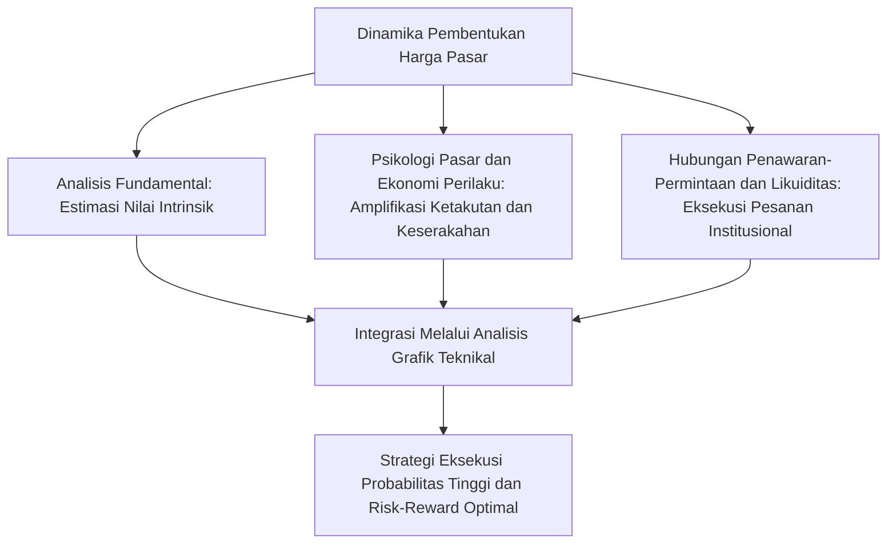
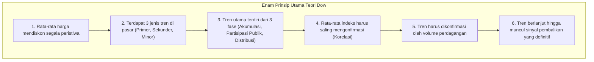
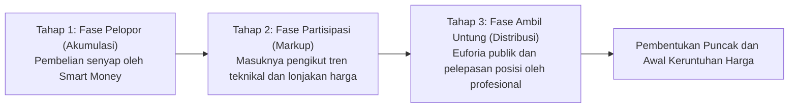
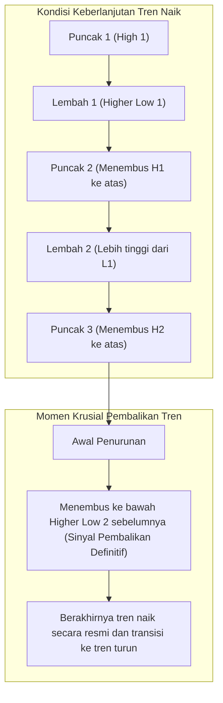
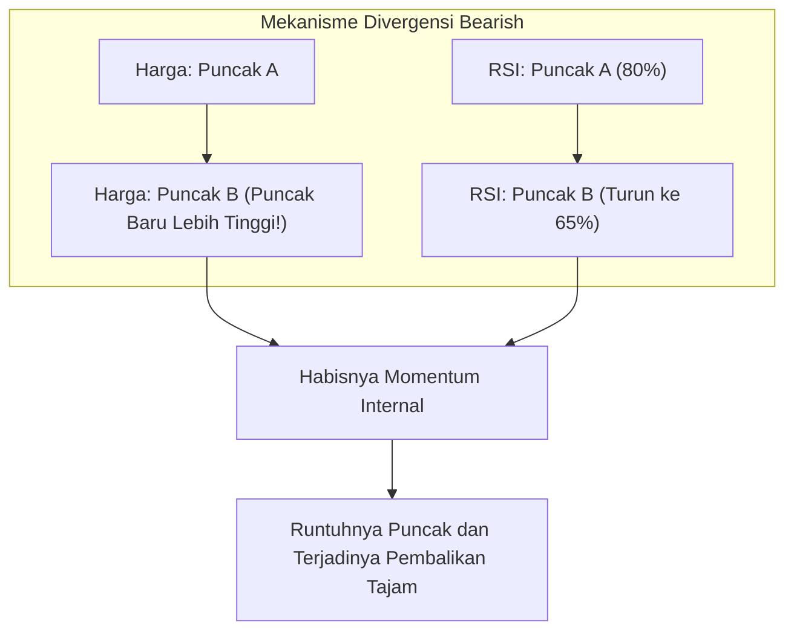
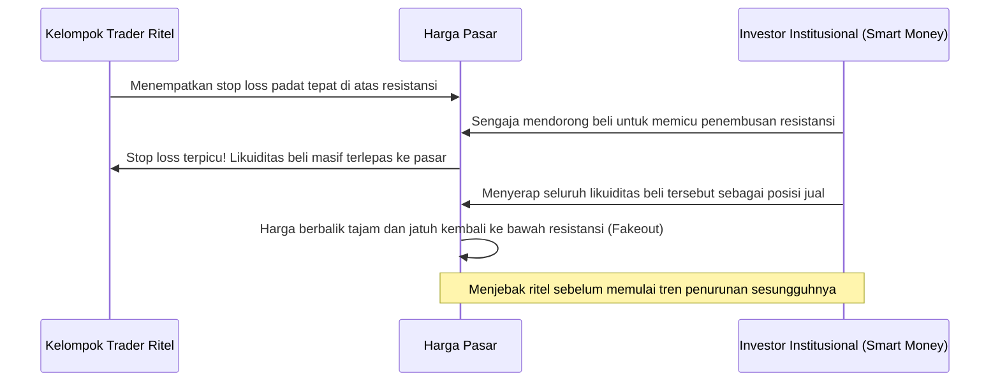
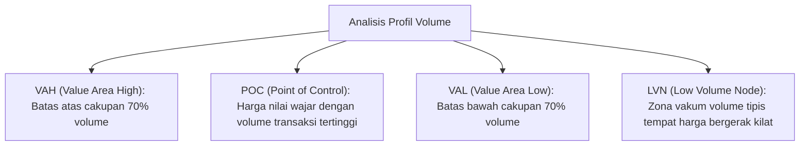

## 1. Pendahuluan: Landasan Filosofis Analisis Teknikal dan Hakikat Pasar

### 1.1 Oposisi dan Dialektika (Aufheben) antara Analisis Fundamental dan Analisis Teknikal

Pendekatan untuk mengurai mekanisme pembentukan harga di pasar keuangan dan memprediksi fluktuasi harga di masa depan secara historis terbagi ke dalam dua arus besar: "Analisis Fundamental (Fundamental Analysis)" dan "Analisis Teknikal (Technical Analysis)".

Analisis fundamental berfokus pada penghitungan "Nilai Intrinsik (Intrinsic Value)" berdasarkan laporan keuangan perusahaan, arus kas, tingkat suku bunga, pertumbuhan PDB, laju inflasi, hingga risiko geopolitik. Pendekatan ini membuat keputusan investasi dengan menangkap deviasi ketika harga pasar menyimpang dari nilai teoretis tersebut. Dalam perspektif ini, meskipun harga pasar dapat bergerak irasional dalam jangka pendek, dalam jangka panjang harga diasumsikan akan selalu berkonvergensi kembali ke titik ekuilibrium fundamental perusahaan dan ekonomi makro.

Sebaliknya, analisis teknikal berfokus langsung pada lintasan historis dari "Harga (Price)", "Volume Perdagangan (Volume)", dan "Waktu (Time)" dari masa lalu hingga saat ini. Analis teknikal memandang bahwa penggerak sejati di balik pergerakan harga bukanlah data fundamental itu sendiri, melainkan "psikologi manusia, ketakutan, keserakahan, bias kognitif, serta aliran likuiditas modal" yang menafsirkan fundamental tersebut.

Dalam lanskap perdagangan profesional modern yang sangat canggih, kedua metodologi ini bukanlah entitas yang harus dipertentangkan, melainkan harus disintesiskan secara dialektis (Aufheben). Hal ini karena analisis fundamental menjawab pertanyaan "apa yang harus diperdagangkan (pemilihan instrumen)", sementara analisis teknikal memberikan jawaban presisi atas "kapan harus bertransaksi dan di mana batas risiko harus ditetapkan (penentuan waktu dan manajemen risiko)". Betapapun kokohnya fundamental suatu korporasi, sahamnya dapat tertekan turun selama bertahun-tahun di tengah pusaran tren turun pasar secara keseluruhan, dan kemampuan memvisualisasikan dinamika penurunan inilah yang menjadi keunggulan absolut dari analisis teknikal.



---

### 1.2 "Harga Mendiskon Segala Peristiwa": Kritik terhadap Hipotesis Pasar Efisien (EMH) dan Ekonomi Perilaku

Aksioma pertama dalam analisis teknikal menyatakan bahwa: **"Harga pasar mendiskon seketika seluruh informasi yang tersedia saat ini (tidak hanya informasi publik, tetapi juga informasi orang dalam, spekulasi, bencana alam, risiko geopolitik, hingga kondisi psikologis kolektif para pelaku pasar)."**

Berdasarkan "Hipotesis Pasar Efisien (Efficient Market Hypothesis: EMH)" dalam bentuk lemah (Weak-Form) yang telah lama mendominasi ekonomi keuangan akademis, diasumsikan bahwa "seluruh data riwayat harga dan volume telah tercermin sepenuhnya ke dalam harga saat ini, sehingga mustahil memperoleh imbal hasil di atas rata-rata pasar (alpha) hanya dengan mengandalkan analisis teknikal."

Namun, perkembangan pesat "Ekonomi Perilaku (Behavioral Economics)" dan "Keuangan Perilaku (Behavioral Finance)" sejak dekade 1980-an telah membuktikan secara psikologis-eksperimental bahwa asumsi dasar EMH—yakni "pelaku pasar selalu bertindak rasional"—sepenuhnya runtuh dalam realitas pasar nyata.
- "Teori Prospek (Prospect Theory)" yang dirumuskan oleh Daniel Kahneman dan Amos Tversky mengungkap bahwa manusia memiliki distorsi kognitif asimetris: cenderung "menghindari risiko (risk-averse)" saat menghadapi potensi keuntungan, namun justru "menyukai risiko (risk-seeking)" saat menghadapi potensi kerugian.
- Bias psikologis seperti efek penjangkaran (Anchoring Effect), perilaku mengikuti kawanan (Herding Behavior), bias konfirmasi (Confirmation Bias), serta rasa percaya diri berlebih (Overconfidence) secara niscaya melahirkan siklus pasar reguler berupa "gelembung jenuh beli (overbought bubble)" dan "kepanikan jenuh jual (oversold panic)".

Analisis teknikal bukanlah bola kristal peramal untuk menebak masa depan dari derau acak. Melainkan, ia adalah **"metodologi penguraian statistik terhadap pola-pola geometris berulang yang digoreskan oleh bias kognitif universal manusia ke atas grafik sebagai wujud perilaku kolektif."**

---

### 1.3 Teori Random Walk versus Hipotesis Struktur Fraktal (Mandelbrot)

Kritik akademis klasik lainnya berakar pada "Teori Gerak Acak (Random Walk Theory)". Teori ini berargumen bahwa distribusi probabilitas fluktuasi harga mengikuti kurva distribusi normal (distribusi Gauss), sehingga tidak terdapat autokorelasi sama sekali antara riwayat harga masa lalu dengan pergerakan harga masa depan.

Tokoh yang memberikan sanggahan matematis telak terhadap hipotesis klasik ini adalah Benoit Mandelbrot, bapak geometri fraktal. Melalui analisis mendalam terhadap data deret waktu jangka panjang harga kapas dan kurs valuta asing selama beberapa dekade, Mandelbrot membuktikan fakta-fakta matematis berikut:

1. **Ekor Tebal (Fat Tails)**: Fluktuasi harga pasar finansial tidak mengikuti kurva lonceng normal, melainkan mengikuti "Hukum Pangkat (Power Law)" di mana pergerakan harga ekstrem (kejadian Black Swan) terjadi ribuan kali lebih sering daripada probabilitas teoretis distribusi normal.
2. **Pengelompokan Volatilitas (Volatility Clustering)**: Terdapat autokorelasi varians yang kuat di mana periode volatilitas tinggi cenderung diikuti oleh volatilitas tinggi berikutnya, dan periode fluktuasi rendah cenderung diikuti oleh fluktuasi rendah.
3. **Kemiripan Diri (Self-Similarity)**: Jika label sumbu waktu disembunyikan dari grafik 1 menit, grafik harian, dan grafik bulanan lalu disejajarkan, trader profesional sekalipun tidak akan mampu membedakan kerangka waktunya karena bentuk geometrisnya memiliki kemiripan struktur yang identik.

"Struktur fraktal pasar" inilah yang menjadi bukti matematis objektif mengapa analisis teknikal bekerja secara efektif melintasi berbagai dimensi waktu. Di dalam tren kerangka waktu yang lebih tinggi (higher timeframe), bersarang tren kerangka waktu yang lebih rendah (lower timeframe), dan ketika resonansi harmonis di antara keduanya tercipta, momentum pergerakan harga yang masif pun meledak.

---

## 2. Batu Penjuru Analisis Grafik Modern: Enam Prinsip Utama Teori Dow dan Reinterpretasi Kontemporernya

Hulu dari seluruh teori analisis teknikal modern (Teori Gelombang Elliott, Hukum Granville, hingga Price Action modern) bermuara pada "Teori Dow (Dow Theory)" yang dipelopori oleh pendiri The Wall Street Journal, Charles H. Dow (1851–1902). Kendati Dow sendiri tidak pernah menyusun buku teks formal melainkan menuangkan pemikirannya dalam kolom editorial, gagasan visionernya pasca-kematiannya berhasil disistematisasikan menjadi enam prinsip utama oleh Samuel Nelson, William Hamilton, dan Robert Rhea.



---

### 2.1 Prinsip 1: Rata-Rata (Harga Pasar) Mendiskon Segala Peristiwa

Indeks harga rata-rata pasar, seperti halnya Dow Jones Industrial Average, mencerminkan secara komprehensif siklus ekonomi, kinerja laba korporasi, kebijakan suku bunga bank sentral, bencana alam, konflik peperangan, hingga psikologi dan tindakan seluruh partisipan pasar. Setiap rilis indikator ekonomi atau berita kilat langsung terasimilasi ke dalam harga pada detik transmisi informasi tersebut terjadi. Oleh karena itu, menunggu rilis data fundamental sebelum mengambil posisi secara inheren menempatkan trader dalam posisi tertinggal (lagging). Mengamati dinamika pergerakan grafik harga itu sendiri merupakan metode pengumpulan informasi yang paling mutakhir, komprehensif, dan berorientasi ke depan (leading).

---

### 2.2 Prinsip 2: Pasar Memiliki Tiga Jenis Tren

Charles Dow menganalogikan pergerakan tren pasar dengan ombak samudra dan membaginya ke dalam tiga tingkatan hierarki:

1. **Tren Primer (Primary Trend: Pasang Surut Samudra)**: Arus tren raksasa yang berlangsung selama satu tahun hingga beberapa tahun. Menentukan arah makro pasar secara menyeluruh.
2. **Tren Sekunder (Secondary Trend: Gelombang Ombak)**: Fase koreksi yang bergerak berlawanan arah dengan tren primer. Biasanya berlangsung antara 3 minggu hingga 3 bulan, mengoreksi sepertiga hingga dua pertiga (atau 50%) dari rentang pergerakan tren primer sebelumnya.
3. **Tren Minor (Minor Trend: Riak Air Kecil)**: Fluktuasi harga jangka pendek yang berlangsung di bawah 3 minggu (hitungan jam hingga beberapa hari). Terbentuk dari derau harian dan spekulasi sesaat serta sangat rentan terhadap manipulasi pasar (market manipulation), sehingga menganalisis tren minor secara terisolasi sangatlah berbahaya.

Dalam praktik perdagangan modern, konsep ini bertransformasi menjadi prinsip fundamental **"Analisis Multi-Timeframe (MTF)"**. Struktur berlapis yang melibatkan konfirmasi arah pasang surut pada grafik harian/mingguan (ombak besar), menunggu fase koreksi pada grafik 4 jam (gelombang), dan mengeksekusi titik masuk secara presisi pada grafik 15 menit/5 menit (riak) merupakan manifestasi langsung dari wawasan brilian Dow.

---

### 2.3 Prinsip 3: Tren Utama Terdiri dari Tiga Fase

Tren utama (terutama tren naik / bull market) berkembang melalui tiga fase psikologis dan perilaku yang sangat berbeda:



- **Tahap 1: Fase Akumulasi (Accumulation: Fase Perintis)**: Terjadi di dasar pasar saat resesi ekonomi parah atau kepanikan pasca-kejatuhan harga, di mana publik diselimuti pesimisme dan keputusasaan. Pada fase ini, kelompok investor paling cerdik dan bervisi tajam (Smart Money / institusi besar) secara senyap mengakumulasi aset-aset yang terdiskon parah. Harga bergerak mendatar (sideways) dalam rentang sempit dengan volatilitas yang menyusut ke titik terendah.
- **Tahap 2: Fase Partisipasi Publik (Public Participation: Fase Markup)**: Pemulihan indikator ekonomi dan perbaikan laba korporasi mulai terbukti secara kuantitatif. Para trader pengikut tren teknikal (trend followers) berbondong-bondong memasuki pasar. Harga melonjak dinamis, membentuk tren kenaikan terpanjang, paling stabil, dan paling menguntungkan.
- **Tahap 3: Fase Distribusi (Distribution: Fase Ambil Untung)**: Media massa gencar memberitakan reli kenaikan aset tersebut setiap hari, memicu masyarakat umum yang awam dalam investasi (Dumb Money) terjebak dalam sindrom FOMO (Fear of Missing Out) dan menyerbu pasar dengan panik. Pada saat yang sama, Smart Money yang telah mengakumulasi posisi di harga dasar diam-diam melepas kepemilikan aset mereka ke tangan publik untuk mengunci laba. Grafik mulai memperlihatkan volatilitas liar, fluktuasi tajam, dan bayangan atas (upper shadow) yang panjang, menandakan berakhirnya siklus tren naik.

---

### 2.4 Prinsip 4: Rata-Rata Indeks Harus Saling Mengonfirmasi

Pada era Charles Dow, ia membandingkan dua indeks utama: "Rata-rata Saham Industri (kini Dow Jones Industrial Average)" dan "Rata-rata Saham Perkeretaapian (kini Dow Jones Transportation Average)". Sebanyak apa pun barang industri diproduksi di pabrik, jika barang-barang tersebut tidak diangkut menggunakan jalur kereta api menuju konsumen, kemakmuran ekonomi riil tersebut adalah ilusi semata. Oleh karena itu, meskipun indeks industri mencetak rekor tertinggi baru, reli tersebut belum dapat divalidasi sebagai pasar bullish sejati kecuali indeks transportasi secara bersamaan mengonfirmasinya dengan mencetak rekor tertinggi baru pula.

Di era modern, prinsip ini berevolusi menjadi **"Analisis Korelasi Antarpasar (Intermarket Analysis)"** dan **"Analisis Internal Pasar (Market Internals)"**.
- Apakah penembusan rekor tertinggi baru pada indeks S&P 500 didukung secara serempak oleh indeks NASDAQ yang padat teknologi dan indeks saham kapitalisasi kecil Russell 2000?
- Di pasar valuta asing, apakah kenaikan pasangan mata uang USD/JPY selaras dengan kenaikan imbal hasil obligasi AS jangka panjang serta indeks Dolar AS (DXY)?
- Di pasar aset kripto, apakah reli kenaikan Bitcoin didukung oleh penguatan Ethereum dan altcoin secara keseluruhan?

Pencapaian titik tertinggi baru secara terisolasi tanpa konfirmasi antarpasar memiliki probabilitas yang sangat tinggi sebagai jebakan bull trap yang dipasang oleh investor institusional.

---

### 2.5 Prinsip 5: Tren Harus Dikonfirmasi oleh Volume Perdagangan

Jika harga menunjukkan "arah" pergerakan tren, maka volume perdagangan (volume) mengonfirmasi "keaslian energi" di balik pergerakan tersebut.

- **Tren Naik yang Sehat**: Volume perdagangan meningkat saat harga bergerak naik, dan volume menyusut saat harga terkoreksi turun.
- **Tren Turun yang Sehat**: Volume perdagangan melonjak saat harga anjlok, dan volume mengering saat terjadi pantulan teknikal jangka pendek.

Apabila harga terus mencetak rekor tertinggi baru namun volume transaksi justru kian menyusut, ini merupakan peringatan bahaya struktural berupa **Divergensi Volume (Volume Divergence)**—yang menandakan bahwa pembeli agresif di pasar telah mengering dan kenaikan harga hanya dipicu oleh tipisnya antrean jual di order book. Richard Wyckoff mengembangkan prinsip Dow ini ke tingkat lanjut melalui metodologi VSA (Volume Spread Analysis) untuk membaca jejak niat pelaku pasar besar melalui korelasi antara rentang harga (spread) dan volume.

---

### 2.6 Prinsip 6: Tren Berlanjut Hingga Muncul Sinyal Pembalikan yang Definitif

Dari seluruh diktum Teori Dow, prinsip keenam inilah yang wajib dipatuhi secara mutlak oleh trader teknikal praktisi.

Definisi tren menurut Dow sangatlah sederhana, elegan, dan mathematically rigorous:
- **Definisi Tren Naik (Uptrend)**: **"Kondisi di mana titik puncak (High) terus meninggi dan titik lembah (Low) juga terus meninggi (Higher Highs & Higher Lows)."**
- **Definisi Tren Turun (Downtrend)**: **"Kondisi di mana titik puncak terus merendah dan titik lembah juga terus merendah (Lower Highs & Lower Lows)."**



Sekalipun harga melonjak tinggi hingga memicu rasa cemas bahwa "harga sudah terlampau mahal untuk dibeli", selama titik lembah Higher Low terakhir belum ditembus ke bawah secara definitif pada harga penutupan (close), maka tren naik tersebut secara teknikal masih sepenuhnya utuh. Tindakan menebak puncak secara subjektif dengan membuka posisi short melawan tren merupakan tindakan paling destruktif yang melanggar hukum dasar ini.

---

## 3. Teori Gelombang Elliott dan Misteri Matematika Fibonacci

### 3.1 Teori Keteraturan Kosmik Ralph Nelson Elliott

Jika Teori Dow menetapkan arah dan titik balik tren, maka tokoh yang mengkodifikasikan "ritme" dan "geometri fraktal" fluktuasi harga ke tingkat tertinggi adalah Ralph Nelson Elliott (1871–1948). Dalam kondisi sakit parah, Elliott mendedikasikan hidupnya untuk menganalisis data grafik Dow Jones selama 75 tahun secara manual—mulai dari grafik bulanan, mingguan, harian, hingga grafik 30 menit—hingga akhirnya mempublikasikan karya monumentalnya *The Wave Principle* pada tahun 1938.

Elliott berteori bahwa aktivitas sosial dan psikologi kolektif umat manusia berkembang mengikuti rasio emas dan deret angka Fibonacci yang mengatur seluruh pola pertumbuhan alam semesta (mulai dari cangkang nautilus, filotaksis daun pada tumbuhan, hingga pusaran galaksi spiral). Pasar bukanlah kekacauan acak, melainkan sebuah kosmos fraktal yang secara berulang mereplikasi **siklus dasar 8 gelombang yang terdiri atas "5 Gelombang Motif/Impulse dan 3 Gelombang Korektif"**.

```mermaid
flowchart LR
    subgraph Gelombang Motif (Arah Tren: 5 Gelombang)
        W1["Gelombang 1<br/>(Awal Gerakan)"] --> W2["Gelombang 2<br/>(Koreksi Dalam)"]
        W2 --> W3["Gelombang 3<br/>(Ledakan Terkuat)"]
        W3 --> W4["Gelombang 4<br/>(Konsolidasi Kompleks)"]
        W4 --> W5["Gelombang 5<br/>(Euforia Terakhir)"]
    end
    subgraph Gelombang Korektif (Arah Berlawanan: 3 Gelombang)
        W5 --> WA["Gelombang A<br/>(Awal Penurunan)"]
        WA --> WB["Gelombang B<br/>(Rebound Semu)"]
        WB --> WC["Gelombang C<br/>(Kejatuhan Menghancurkan)"]
    end
```

---

### 3.2 Struktur Gelombang Motif (Impulse) dan Tiga Aturan Mutlak

Dalam gelombang motif (gelombang yang bergerak searah dengan tren utama), bentuk paling standar adalah "Gelombang Impulse", yang diatur oleh **"Tiga Aturan Mutlak yang Tidak Boleh Dilanggar"**. Jika salah satu aturan ini dilanggar, maka perhitungan gelombang (labeling) tersebut dipastikan keliru dan analisis wajib diulang dari awal.

1. **Aturan 1: Gelombang 2 tidak boleh mengoreksi lebih dari 100% dari titik awal Gelombang 1.** (Jika menembus ke bawah titik awal, maka pergerakan tersebut bukanlah Gelombang 1 melainkan kelanjutan dari tren turun sebelumnya).
2. **Aturan 2: Di antara Gelombang 1, 3, dan 5, Gelombang 3 tidak boleh menjadi gelombang yang paling pendek.** (Umumnya, Gelombang 3 adalah gelombang ekstensi yang terpanjang dan paling bertenaga).
3. **Aturan 3: Gelombang 4 tidak boleh bertumpang tindih (overlap) dengan wilayah harga puncak Gelombang 1.** (Begitu titik terendah Gelombang 4 menyentuh atau menembus puncak Gelombang 1, struktur impulse tersebut gugur dan bertransformasi menjadi pola diagonal atau variasi koreksi lainnya).

#### Karakteristik Psikologis Masing-Masing Gelombang
- **Gelombang 1**: Awal pergeseran tren. Berita fundamental umumnya masih sangat buruk dan mayoritas pelaku pasar menganggap kenaikan ini hanyalah pantulan sementara, sehingga momentum masih terbatas.
- **Gelombang 2**: Koreksi tajam terhadap Gelombang 1. Banyak partisipan panik meyakini tren turun berlanjut, memicu aksi jual masif hingga mengoreksi 50% hingga 61,8% (bahkan terkadang mencapai 78,6%) dari Gelombang 1. Namun, titik awal Gelombang 1 tetap bertahan.
- **Gelombang 3**: Berbagai indikator teknikal serentak memberikan sinyal bullish, dan para pelaku pasar menyerbu masuk setelah mengonfirmasi terjadinya breakout. Volume transaksi melonjak eksponensial, menciptakan gap harga dan melukiskan kenaikan paling tajam dan masif. Ini adalah gelombang emas tempat trader profesional menempatkan ukuran posisi terbesar untuk mendulang profit maksimal.
- **Gelombang 4**: Aksi ambil untung dari mereka yang meraup profit di Gelombang 3 beradu dengan aksi beli dari mereka yang tertinggal. Membutuhkan durasi waktu yang lama dan sering membentuk pola konsolidasi kompleks seperti segitiga/triangle (Hukum Pergantian / Alternation: jika Gelombang 2 berupa koreksi tajam dan sederhana, maka Gelombang 4 akan berupa koreksi sideways yang kompleks).
- **Gelombang 5**: Sentimen fundamental berada di puncak optimisme dan masyarakat umum berbondong-bondong memborong aset dalam euforia terakhir. Namun, indikator momentum (RSI atau MACD) mulai membentuk pola "divergensi" dengan puncak yang lebih rendah dari puncak Gelombang 3, mengisyaratkan bahwa bahan bakar internal pasar telah habis.

---

### 3.3 Taksonomi Gelombang Korektif (Corrective Waves)

Fase koreksi yang terjadi pasca-selesainya gelombang motif memiliki struktur yang jauh lebih bervariasi dan rumit. Elliott mengklasifikasikannya ke dalam tiga kategori utama:

1. **Zigzag (Struktur 5-3-5)**: Koreksi yang sangat tajam dan dalam. Gelombang A (penurunan 5 gelombang) → Gelombang B (pantulan 3 gelombang, mengoreksi 38,2% hingga 50% dari Gelombang A) → Gelombang C (penurunan 5 gelombang dengan keparahan yang menyamai panjang Gelombang A).
2. **Flat (Struktur 3-3-5)**: Koreksi mendatar dalam rentang konsolidasi. Gelombang A (3 gelombang) → Gelombang B (3 gelombang, memantul hingga mendekati awal Gelombang A) → Gelombang C (5 gelombang, hanya menembus tipis dasar Gelombang A). Dalam pasar yang sangat kuat, sering terjadi pola "Expanded Flat" di mana Gelombang B melampaui puncak Gelombang A sebelum Gelombang C jatuh tajam.
3. **Triangle (Struktur 3-3-3-3-3)**: Kekuatan pembeli dan penjual berimbang, menciptakan penyempitan rentang harga (5 sub-gelombang A-B-C-D-E). Pola ini hanya muncul sesaat sebelum gelombang tren terakhir (misalnya pada posisi Gelombang 4 atau Gelombang B), dan setelah penembusan terjadi, pasar akan melesat kencang dalam dorongan terakhir (Gelombang 5).

---

### 3.4 Rasio Fibonacci dan Perhitungan Target Proyeksi Gelombang

Kekuatan sejati Teori Gelombang Elliott terletak pada kemampuannya memproyeksikan area koreksi dan target harga masa depan dengan presisi matematis yang menakjubkan melalui deret Fibonacci (0, 1, 1, 2, 3, 5, 8, 13, 21, 34, 55, 89, 144...).

Rasio Fibonacci Kunci:
- $\phi = \frac{\sqrt{5}-1}{2} \approx 0.618$
- $1 - \phi \approx 0.382$
- $\sqrt{0.618} \approx 0.786$
- $1.618$ (Invers rasio emas / rasio ekspansi)
- $2.618, 4.236$

#### Formula Praktis Penentuan Target Harga
1. **Retracement Gelombang 2**: Mengoreksi sebesar **$61.8\%$** atau **$50.0\%$**, dengan batas maksimal **$78.6\%$** dari rentang vertikal Gelombang 1.
2. **Target Kenaikan Gelombang 3**: Misalkan panjang Gelombang 1 adalah $W_1$, dan titik akhir Gelombang 2 adalah $L_2$:
   $$Target(W_3) = L_2 + 1.618 \times W_1$$
   Atau dalam kondisi reli super-kuat:
   $$Target(W_3) = L_2 + 2.618 \times W_1$$
3. **Retracement Gelombang 4**: Mengoreksi sebesar **$38.2\%$** (koreksi dangkal) dari panjang Gelombang 3, atau sering kali sejajar dengan titik terendah sub-gelombang 4 di dalam Gelombang 3.
4. **Target Kenaikan Gelombang 5**: Menambahkan **$61.8\%$** dari total rentang Gelombang 1 hingga Gelombang 3 dihitung dari titik lembah Gelombang 4.

---

## 4. Kearifan Timur: Morfologi Candlestick dan Lima Metode Sakata

Ketika analisis teknikal Barat berawal dari grafik garis dan grafik batang (bar chart), di belahan dunia Timur tepatnya pada era Edo abad ke-18 di Pasar Beras Dojima Osaka, Jepang telah secara independen melahirkan bursa berjangka pertama di dunia beserta analisis grafiknya. Sosok legendaris di balik mahakarya ini adalah Munehisa Honma (1724–1803). Filosofi pasar yang ia wariskan dalam manuskrip *San-en Kinsen Hiroku* (Catatan Rahasia Tiga Kera Penebar Umas) di kemudian hari mengkristal menjadi doktrin termasyhur: "Lima Metode Sakata (Sakata Goho)".

---

### 4.1 Dinamika Internal Candlestick

Satu batang lilin (candlestick) memvisualisasikan empat harga krusial dalam suatu periode waktu: "Harga Pembukaan (Open)", "Harga Tertinggi (High)", "Harga Terendah (Low)", dan "Harga Penutupan (Close)" melalui badan lilin (Real Body) dan sumbu bayangan atas-bawah (Shadow).

Ketika Steve Nison memperkenalkan sistem grafik ini ke dunia Barat pada akhir dekade 1980-an melalui bukunya *Japanese Candlestick Charting Techniques*, para trader Wall Street terpukau oleh efisiensi transmisi informasinya yang revolusioner. Kini, candlestick telah menjadi standar global nomor satu dalam analisis teknikal dunia.

| Pola Candlestick | Karakteristik Morfologis | Dinamika Psikologis dan Pasokan-Permintaan Internal |
| :--- | :--- | :--- |
| **Marubozu (Batang Penuh)** | Badan lilin sangat panjang tanpa bayangan atas maupun bawah. | Membuktikan bahwa pihak pembeli menguasai pasar secara mutlak dari pembukaan hingga penutupan. Sinyal bullish yang sangat perkasa. |
| **Palu / Pinbar (Hammer)** | Badan lilin kecil di bagian atas dengan sumbu bawah panjang minimal 2 kali ukuran badan. | Tekanan jual sempat menekan harga jatuh sangat dalam, namun di level bawah muncul kekuatan beli raksasa yang menyerap seluruh pasokan dan mendorong harga kembali ke dekat harga pembukaan. **Sinyal pembalikan dasar paling kuat**. |
| **Bintang Jatuh (Shooting Star)** | Badan lilin kecil di bagian bawah dengan sumbu atas panjang minimal 2 kali ukuran badan. | Pembeli berupaya agresif menembus rekor harga baru, namun di area puncak membentur dinding pesanan jual masif (aksi ambil untung institusi) hingga terpukul mundur secara telak. **Sinyal pembalikan puncak yang krusial**. |
| **Doji (Salib)** | Harga pembukaan dan penutupan berada di level yang hampir identik. Badan lilin berupa garis tipis menyerupai salib. | Titik ekuilibrium sempurna di mana kekuatan pembeli dan penjual seimbang total. Menandakan jeda kebuntuan atau pertanda awal terjadinya pembalikan tren besar. |

---

### 4.2 Hakikat Lima Metode Sakata (Sakata Goho)

Lima Metode Sakata adalah pola kombinasi multi-candlestick untuk membaca transisi energi penawaran dan permintaan pasar.

1. **Tiga Gunung (Sanzan)**: Terbentuk ketika harga mencoba menembus level resistansi sebanyak tiga kali namun selalu gagal. Pola di mana puncak tengah menjadi yang tertinggi disebut "Tiga Puncak / Head and Shoulders Top", dan konfirmasi penembusan ke bawah neckline akan memicu tren penurunan yang dahsyat.
2. **Tiga Sungai (Sansen)**: Pola di mana harga menguji area dasar sebanyak tiga kali (Inverse Head and Shoulders / Triple Bottom). Termasuk pula pola pembalikan fajar seperti "Bintang Pagi (Morning Star)" yang terdiri dari tiga lilin: lilin merah panjang, lilin doji kecil, dan lilin hijau panjang sebagai konfirmasi titik balik dasar.
3. **Tiga Celah / Gap (Sanku)**: Fenomena terjadinya tiga gap harga berturut-turut searah dengan tren. Pepatah klasik Sakata menyatakan: "Hadapi Tiga Celah Kenaikan dengan Menjual, dan Hadapi Tiga Celah Penurunan dengan Membeli." Kemunculan empat gap beruntun mencerminkan emosi keserakahan atau kepanikan partisipan pasar yang telah mencapai titik didih ekstrem, menandakan klimaks kehabisan tenaga (exhaustion gap).
4. **Tiga Prajurit (Sanpei)**: Pola "Tiga Prajurit Putih/Merah (Akasanpei)" yang berupa tiga batang lilin hijau berturut-turut dari area dasar menandai dimulainya tren naik yang kuat. Namun, bila lilin ketiga memiliki sumbu atas panjang (Akasanpei Sakizumari), ini menjadi sinyal kelelahan beli. Sebaliknya, kemunculan tiga lilin merah berturut-turut di area puncak disebut "Tiga Gagak Hitam (Kurosanpei)", yang merupakan sinyal keruntuhan harga.
5. **Tiga Metode (Sanpo)**: Manifestasi filosofis dari prinsip "istirahat juga merupakan bagian dari strategi perdagangan". Pola "Rising Three Methods (Age-sanpo)" diawali dengan lilin hijau panjang, diikuti oleh tiga lilin merah kecil yang tertahan di dalam rentang lilin pertama, kemudian lilin kelima melesat membentuk lilin hijau panjang yang menembus puncak sebelumnya. Pola ini mengidentifikasi fase istirahat sehat di tengah tren kenaikan berkelanjutan (continuation).

---

## 5. Struktur Matematika Indikator Teknikal dan Jebakan Praktisnya

Indikator teknikal yang diaplikasikan ke atas grafik harga secara garis besar terbagi ke dalam dua kutub: "Indikator Tren (Trend-Following)" dan "Indikator Osilator (Mean-Reversion / Momentum)". Mayoritas trader pemula menelan mentah-mentah sinyal indikator tanpa memahami logika matematika di baliknya, yang berujung pada kerugian finansial fatal. Berikut bedah anatomis atas kerangka matematika indikator-indikator utama.

### 5.1 Matematika Indikator Tren

#### ① Rata-Rata Bergerak (SMA vs EMA)
Indikator paling fundamental, Rata-Rata Bergerak Sederhana (SMA: Simple Moving Average) untuk periode $n$, dirumuskan sebagai berikut:
$$SMA_t = \frac{1}{n} \sum_{i=0}^{n-1} P_{t-i}$$
Kelemahan fatal dari SMA adalah pemberian bobot yang setara ($1/n$) antara "harga terkini hari ini" dengan "harga historis $n$ hari yang lalu". Hal ini mengakibatkan sinyal yang dihasilkan mengalami kelambatan (lag) yang parah.

Untuk mengatasi kelemahan ini, dikembangkanlah Rata-Rata Bergerak Eksponensial (EMA: Exponential Moving Average). EMA memberikan bobot terbesar pada harga penutupan terkini $P_t$, sementara data masa lalu disusutkan secara eksponensial. Dengan faktor pembobotan $\alpha = \frac{2}{n+1}$, rumusnya adalah:
$$EMA_t = \alpha P_t + (1 - \alpha) EMA_{t-1}$$
Karena EMA bereaksi jauh lebih sensitif terhadap pergerakan harga mendadak, sistem trading frekuensi tinggi dan day trading modern jauh lebih memprioritaskan EMA (khususnya 20EMA, 50EMA, dan 200EMA) dibandingkan SMA.

#### ② Bollinger Bands
Dikembangkan oleh John Bollinger pada dekade 1980-an, Bollinger Bands memetakan pita volatilitas berbasis standar deviasi ($\sigma$) di sekitar garis rata-rata bergerak:
$$Middle = SMA_n(P)$$
$$\sigma = \sqrt{\frac{1}{n} \sum_{i=0}^{n-1} (P_{t-i} - Middle)^2}$$
$$Upper = Middle + k \cdot \sigma, \quad Lower = Middle - k \cdot \sigma \quad (\text{biasanya } k=2)$$

Dalam kurva distribusi normal statistika, probabilitas data berada di dalam rentang $\pm 2\sigma$ dari nilai rata-rata adalah **$95.44\%$**.
Namun, di sinilah letak jebakan paling mematikan bagi para trader. **Fluktuasi harga di pasar keuangan tidak berdistribusi normal (melainkan memiliki ekor tebal / fat tails)**.
Oleh karena itu, strategi naif seperti "harga menyentuh $+2\sigma$ berarti sudah overbought, lakukan counter-trend short" adalah kekeliruan fatal. Saat tren kuat meledak, harga justru akan meregangkan pita dan terus menempel di luar batas $+2\sigma$ dalam reli eksplosif (**Band Walk**). Esensi sejati Bollinger Bands adalah mendeteksi fase "Squeeze" (penyempitan pita ekstrem yang menandakan kompresi volatilitas), lalu mengambil posisi searah dengan ledakan ekspansi ("Expansion") pita berikutnya.

---

### 5.2 Matematika Indikator Osilator

#### ① RSI (Relative Strength Index: Indeks Kekuatan Relatif)
Dirancang oleh J. Welles Wilder, RSI mengukur perbandingan antara akumulasi keuntungan dengan akumulasi kerugian selama periode tertentu (biasanya 14 hari) untuk mengukur kecepatan dan perubahan pergerakan harga dalam skala $0 \sim 100\%$:
$$RS = \frac{\text{Rata-rata Kenaikan selama } n \text{ hari terakhir}}{\text{Rata-rata Penurunan selama } n \text{ hari terakhir}}$$
$$RSI = 100 - \frac{100}{1 + RS} = \frac{\text{Rata-rata Kenaikan}}{\text{Rata-rata Kenaikan} + \text{Rata-rata Penurunan}} \times 100$$

Kendati interpretasi konvensional menganggap level di atas 70% sebagai jenuh beli (overbought) dan di bawah 30% sebagai jenuh jual (oversold), dalam pasar yang sedang tren satu arah yang kuat, RSI dapat bertahan di atas 80% dalam waktu lama sementara harga terus berlipat ganda.
Sinyal paling bernilai tinggi dari RSI bukanlah level overbought/oversold itu sendiri, melainkan **"Divergensi (Divergence)"**.
- **Divergensi Bearish (Bearish Divergence)**: Kondisi ketika harga membentuk puncak baru yang lebih tinggi (Higher High), namun indikator RSI justru membentuk puncak yang lebih rendah (Lower High). Hal ini mengindikasikan bahwa energi internal (daya dorong beli) yang menopang kenaikan harga sedang terkuras cepat, memberikan peringatan dini akan terjadinya pembalikan tren ke bawah.



---

## 6. Teori Price Action Modern dan Smart Money Concepts (SMC)

Sejak dekade 2010-an, perdagangan algoritmik frekuensi tinggi (HFT) dan kecerdasan buatan (AI) institusional telah menguasai lebih dari 80% volume perdagangan global. Akibatnya, efektivitas indikator lagging klasik (seperti MACD atau Stochastic) merosot tajam. Sebagai penggantinya, metodologi yang kini menjadi standar de facto di kalangan trader profesional adalah "Teori Price Action" dan "Smart Money Concepts (SMC)" yang berfokus langsung pada grafik telanjang (raw charts) dan dinamika volume.

### 6.1 Perburuan Likuiditas dan Sapuan Likuiditas (Liquidity Sweep)

Filosofi mendasar SMC berpijak pada realitas objektif bahwa: **"Pasar selalu bergerak menuju area di mana pesanan stop loss (likuiditas) terkonsentrasi dalam volume terbesar."**

Trader ritel bermodal kecil membaca buku teks yang sama dan secara seragam menempatkan stop loss mereka di titik-titik yang mudah tertebak: "tepat di atas puncak pola double top" atau "tepat di bawah garis batas bawah rentang konsolidasi". Namun, investor institusional raksasa (Smart Money) yang mengelola dana miliaran dolar tidak dapat mengisi (fill) posisi masif mereka tanpa menggerakkan pasar secara ekstrem, kecuali jika mereka mengeksekusinya di zona likuiditas padat tempat ribuan stop loss ritel berkumpul.

1. **Sapuan Likuiditas (Liquidity Sweep)**: Institusi secara sengaja mendorong harga menembus tipis ke atas level puncak penting atau ke bawah level lembah penting.
2. Penembusan sesaat ini memicu eksekusi serentak stop loss para trader ritel (buy stop atau sell stop), melepaskan pasokan likuiditas yang luar biasa besar ke dalam pasar.
3. Smart Money langsung menyerap seluruh likuiditas tersebut sebagai pasangan transaksi posisi mereka yang berlawanan arah, lalu seketika menarik harga kembali ke dalam rentang semula (Fakeout / False Breakout).
4. Grafik meninggalkan jejak berupa "sumbu panjang (Pinbar)", dan sementara posisi trader ritel hangus terlikuidasi, harga melesat eksplosif ke arah yang berlawanan.



---

### 6.2 Fair Value Gap (FVG) dan Order Block (OB)

Dua pilar utama untuk menentukan titik masuk (entry) dengan presisi bedah dalam metodologi SMC adalah "Fair Value Gap (FVG)" dan "Order Block (OB)".

- **Fair Value Gap (FVG: Celah Nilai Wajar)**: Ketika institusi menyuntikkan modal raksasa dalam sepersekian detik, pada rangkaian tiga candlestick berurutan akan tercipta celah kosong antara titik tertinggi lilin ke-1 dan titik terendah lilin ke-3, di mana tidak ada transaksi dua arah yang terjadi di zona tersebut. Algoritma pasar dirancang untuk menyeimbangkan inefisiensi (Imbalance) ini, sehingga harga memiliki kecenderungan kuat untuk berbalik sementara guna menutup celah tersebut di masa depan. Menunggu harga terkoreksi kembali ke zona FVG memungkinkan trader masuk dengan risiko stop loss minimal dan potensi profit maksimal.
- **Order Block (OB: Blok Pesanan)**: Lilin berlawanan arah terakhir yang dibentuk oleh institusi tepat sebelum mereka memicu breakout harga yang masif. Zona harga ini merefleksikan jejak akumulasi atau distribusi institusional, yang di masa depan akan bertindak sebagai level dukungan (support) atau resistansi institusional terkuat.

---

## 7. Wilayah Penentu Kemenangan: Risk-Reward dan Matematika Manajemen Modal

Betapapun sempurnanya penguasaan analisis teknikal seseorang, trader yang mengabaikan matematika manajemen modal (Money Management) secara probabilistik dipastikan 100% akan mengalami kehancuran finansial total (kebangkrutan). Trading bukanlah "seni meramal masa depan", melainkan sebuah "bisnis statistik yang mengeksekusi serangkaian peluang dengan ekspektasi matematis positif (+EV) di bawah alokasi modal dengan probabilitas kehancuran nol".

### 7.1 Pembuktian Matematis Probabilitas Kehancuran Balsara (Risk of Ruin)

Matematikawan Prancis Nauzer Balsara menyusun model matematika ketat untuk menghitung probabilitas seorang trader mengalami kebangkrutan total berdasarkan tiga variabel utama: "Tingkat Kemenangan (Win Rate)", "Rasio Imbal Hasil / Payoff Ratio (Rasio Risk-Reward)", dan "Persentase Risiko per Transaksi (Fraksi modal yang dipertaruhkan per posisi)".

- **Tingkat Kemenangan ($W$)**: Jumlah transaksi menang $\div$ Total seluruh transaksi
- **Payoff Ratio ($R$)**: Rata-rata nominal profit $\div$ Rata-rata nominal kerugian

Tabel di bawah ini mengilustrasikan probabilitas kehancuran Balsara (angka estimasi teoretis) ketika seorang trader mengambil risiko ekstrem dengan mempertaruhkan $20\%$ dari total modalnya dalam setiap transaksi tunggal:

| Win Rate \ Payoff Ratio ($R$) | 0.5 (Rugi Besar, Untung Kecil) | 1.0 (Rugi Sama dengan Untung) | 1.5 (Untung Cukup Besar) | 2.0 (Untung Ideal) | 3.0 (Untung Sangat Unggul) |
| :---: | :---: | :---: | :---: | :---: | :---: |
| **30%** | 100% | 100% | 100% | 80.0% | 14.3% |
| **40%** | 100% | 100% | 38.2% | 14.1% | 1.2% |
| **50%** | 100% | 50.0% | 5.6% | 0.8% | **0.0%** |
| **60%** | 100% | 2.1% | 0.1% | **0.0%** | **0.0%** |
| **70%** | 14.3% | **0.0%** | **0.0%** | **0.0%** | **0.0%** |

Kenyataan matematis tak terbantahkan yang diungkap oleh tabel ini adalah: **"Meskipun Anda memiliki win rate 60%, jika rasio payoff Anda hanya 0,5 (merisikokan 2 untuk mendapatkan profit 1), maka probabilitas kebangkrutan Anda adalah 100% mutlak."** Inilah sebabnya mengapa trader pemula yang membanggakan sistem ber-win rate 90% sering kali mengumpulkan recehan secara perlahan namun akhirnya melenyapkan seluruh saldo akun mereka hanya dalam satu kejatuhan pasar.

Sebaliknya, **meskipun win rate Anda hanya 40%, jika Anda mampu menjaga rasio payoff di angka 2,0 (rata-rata keuntungan dua kali lipat dari rata-rata kerugian), probabilitas kehancuran Anda langsung merosot ke 14%, dan dengan payoff ratio 3,0 probabilitas kehancuran turun menjadi hanya 1,2%—menjamin pertumbuhan modal yang stabil secara jangka panjang**.

---

### 7.2 Aturan 2% dan Formula Penentuan Ukuran Posisi Kuantitatif (Position Sizing)

Hukum besi yang tidak boleh dilanggar dalam manajemen modal profesional adalah: **"Batasi kerugian maksimal dalam setiap transaksi tunggal secara ketat antara $1\% \sim 2\%$ dari total ekuitas akun"** (Aturan 2%).

Kesalahan paling jamak dari trader pemula adalah mengunci jumlah lot yang sama dalam setiap transaksi (misalnya "selalu trading 1 lot"). Ini adalah kekeliruan fatal. Jarak titik stop loss teknikal pada grafik selalu bervariasi dari satu transaksi ke transaksi lainnya tergantung pada struktur support dan volatilitas pasar saat itu.

Formula matematis untuk menghitung ukuran posisi (position size) yang presisi diturunkan sebagai berikut:

$$Position\_Size = \frac{Account\_Balance \times Risk\_Percentage}{Entry\_Price - Stop\_Loss\_Price}$$

#### Contoh Kasus Konkret
- Saldo Akun: $10.000.000$ Yen
- Toleransi Risiko per Transaksi: $2\%$ (Batas toleransi rugi maksimal $= 200.000$ Yen)
- Harga Masuk (Entry): $150.00$ Yen (pada instrumen USD/JPY)
- Harga Stop Loss berbasis Analisis Grafik: $149.20$ Yen (Jarak Stop Loss $= 0.80$ Yen $= 80$ pips)

Maka, ukuran posisi yang wajib dieksekusi adalah:
$$Position\_Size = \frac{200.000 \text{ Yen}}{0.80 \text{ Yen}} = 250.000 \text{ unit mata uang (2.5 lot)}$$

Jika Anda menemukan setup ketat di mana jarak stop loss hanya $0.40$ Yen (40 pips), ukuran posisi dapat diperbesar menjadi $5.0$ lot. Sebaliknya, jika kondisi pasar menuntut jarak stop loss lebar sebesar $1.60$ Yen (160 pips), ukuran posisi wajib diperkecil menjadi $1.25$ lot. **"Menyesuaikan ukuran lot secara dinamis berdasarkan jarak stop loss demi menjaga nominal kerugian selalu konstan"**. Inilah satu-satunya perisai matematis yang menjamin akun Anda selamat dari rentetan kekalahan beruntun yang tak terelakkan.

---

### 7.3 Teori Prospek dan Penaklukan Bias Psikologis

Mengapa manusia kerap melanggar aturan manajemen risiko yang begitu gamblang ini? Jawabannya tertanam jauh di dalam sejarah evolusi biologis otak manusia.

Selama ratusan ribu tahun masa berburu dan meramu di padang sabana, mangsa atau buah-buahan yang ditemukan harus segera dikonsumsi detik itu juga sebelum membusuk atau direbut predator lain. Selain itu, saat menghadapi ancaman mematikan, melawan hingga titik darah penghabisan meningkatkan peluang kelangsungan hidup spesies.

Namun, insting bertahan hidup purba ini menjadi racun yang mematikan di pasar keuangan modern yang bekerja berdasarkan hukum probabilitas.
1. **Penghindaran Risiko pada Keuntungan (Menutup Profit Terlalu Dini)**: Saat posisi mengalami floating profit, rasa takut kehilangan keuntungan tersebut mendominasi kesadaran, mendorong trader menutup posisi hanya dengan keuntungan beberapa pips.
2. **Pencarian Risiko pada Kerugian (Menunda Stop Loss dan Martingale)**: Saat posisi mengalami floating loss, mekanisme penyangkalan psikologis menolak mengakui kerugian. Trader menggeser stop loss lebih jauh ke bawah, bahkan menambah ukuran posisi saat harga jatuh (averaging down) sembari berharap dan berdoa.

Cawan suci (Holy Grail) sejati dalam dunia trading bukanlah kombinasi indikator rahasia yang rumit. Melainkan, **"kesadaran mendalam atas kutukan insting hewani dalam DNA kita (kutukan Teori Prospek), serta disiplin baja untuk bertindak secara mekanis dan dingin layaknya mesin yang tunduk patuh pada aturan probabilitas dan ekspektasi matematis."**

---

---

### 7.4 Matematika Kriteria Kelly (Kelly Criterion) dan Penerapan Praktis Setengah Kelly (Half-Kelly)

Tonggak matematika manajemen modal yang berdiri sejajar dengan Teori Kehancuran Balsara adalah "Kriteria Kelly (Kelly Criterion)", yang dirumuskan pada tahun 1956 oleh fisikawan Bell Labs, John Larry Kelly Jr., berbasiskan teori informasi.

Kriteria Kelly adalah formula yang menghitung fraksi modal optimal $f^*$ yang harus dialokasikan guna memaksimalkan tingkat pertumbuhan geometris (nilai harapan logaritmik dari akumulasi modal jangka panjang) dalam lingkungan bunga majemuk.

$$f^* = \frac{b \cdot p - q}{b} = p - \frac{q}{b}$$

Di mana:
- $p$: Tingkat kemenangan / Win rate (probabilitas $0 \le p \le 1$)
- $q = 1 - p$: Tingkat kekalahan / Loss rate
- $b$: Rasio imbal hasil bersih / Odds (rasio keuntungan bersih per unit risiko = profit per transaksi $\div$ kerugian per transaksi)

### Simulasi Numerik Kriteria Kelly dan Jebakan Kehancuran
Sebagai contoh, perhatikan strategi trading dengan keunggulan statistik yang sangat baik: win rate $p = 0.55$ (55%) dan payoff ratio $b = 1.5$ (rasio risk-reward 1:1,5).
$$f^* = \frac{1.5 \times 0.55 - 0.45}{1.5} = \frac{0.825 - 0.45}{1.5} = \frac{0.375}{1.5} = 0.25 \quad (25\%)$$

Secara kalkulasi matematika murni, mempertaruhkan **$25\%$** dari total modal pada setiap transaksi akan menghasilkan laju pertumbuhan aset yang paling maksimal dan cepat.
Namun, menerapkan Kriteria Kelly Penuh (Full Kelly) dalam dunia perdagangan riil adalah tindakan **"bunuh diri finansial"**. Hal ini karena formula Kelly mengasumsikan parameter win rate dan odds populasi bersifat statis dan tidak pernah berubah—sebuah asumsi yang mustahil dalam dinamika pasar nyata.

Jika rezim pasar berganti dan win rate mengalami penurunan temporer, atau terjadi rentetan 7 kali kekalahan beruntun, alokasi Full Kelly 25% akan mengakibatkan penarikan modal (drawdown) melebihi $80\%$, memicu kehancuran psikologis yang tak terpulihkan.

### Keunggulan Mutlak Setengah Kelly (Half-Kelly)
Oleh karena itu, para analis kuantitatif dan trader profesional modern mengadopsi pendekatan **"Setengah Kelly (Half-Kelly)"** atau seperempat Kelly:
- Menerapkan Half-Kelly ($f^* / 2$) mampu mempertahankan sekitar **$75\%$** dari laju pertumbuhan teoretis maksimal, namun secara dramatis **memangkas volatilitas dan drawdown maksimal lebih dari $50\%$**.
- Dalam contoh di atas, risiko yang dialokasikan dipangkas menjadi $12,5\%$, atau bahkan $6,25\%$ pada model Quarter-Kelly. Dengan kemudian menambahkan batas atas Aturan 2% sebagai pengaman praktis, portofolio Anda akan memperoleh stabilitas matematika yang kokoh dan tak tergoyahkan.

---

### 7.5 Profil Volume (Volume Profile) dan Struktur POC (Point of Control)

Volume perdagangan konvensional disajikan di bagian bawah grafik sebagai "batang vertikal berbasis waktu" (Volume by Time). Namun, instrumen yang kini menjadi keharusan mutlak bagi pelacak jejak institusi adalah **"Profil Volume (Volume Profile / VPVR)"**, yang memetakan akumulasi volume sebagai "batang horizontal berbasis tingkat harga" di sisi kanan grafik.



1. **POC (Point of Control)**: Tingkat harga tunggal tempat terjadinya volume transaksi terbesar dalam periode pengamatan yang dipilih. Level ini merepresentasikan pusat gravitasi nilai wajar (Fair Value) yang disepakati oleh seluruh partisipan pasar, dan berfungsi sebagai magnet kuat yang menarik harga kembali saat terjadi deviasi.
2. **Area Nilai (Value Area: VA)**: Rentang harga tempat terakumulasinya $70\%$ dari total volume perdagangan (setara dengan rentang $1\sigma$ dalam kurva distribusi normal).
   - **VAH (Value Area High)**: Batas atas Area Nilai, berfungsi sebagai resistansi kuat.
   - **VAL (Value Area Low)**: Batas bawah Area Nilai, berfungsi sebagai support kuat.
3. **LVN (Low Volume Node)**: Lembah tipis di mana volume transaksi sangat sedikit terjadi. Karena di area ini tidak tercapai kesepakatan antara pembeli dan penjual (zona hampa likuiditas), ketika harga memasuki zona LVN, harga akan bergerak melesat sangat cepat tanpa hambatan berarti.

Pemanfaatan Profil Volume memungkinkan trader menembus ilusi garis horizontal historis dan memindai dengan jelas "zona harga nyata tempat likuiditas modal masif dipertukarkan" layaknya citra sinar-X.

---

### 7.6 Protokol Sinkronisasi Multi-Timeframe (MTF)

Di panggung perdagangan profesional, eksekusi dilakukan secara mekanis dan terstruktur mengikuti 5 tahap protokol sinkronisasi multi-timeframe berikut:

| Kerangka Waktu | Peran Strategis | Item Pemantauan dan Parameter Keputusan |
| :--- | :--- | :--- |
| **1. Mingguan / Harian** | Pembacaan Lingkungan Makro (Arus Pasang Samudra) | Arah tren utama (kondisi Higher High / Lower Low Teori Dow), kemiringan 200EMA, zona support dan resistansi makro kunci. |
| **2. 4 Jam** | Penyiapan Struktur Gelombang (Setup Dinamika Ombak) | Perhitungan Gelombang Elliott (mengidentifikasi apakah pasar berada di Gelombang 3 atau pullback Gelombang 4), level retracement Fibonacci (mencapai zona 61,8%). |
| **3. 1 Jam** | Pemetaan Likuiditas (Identifikasi Sasaran) | Melacak FVG (Imbalance), zona Order Block institusional, dan Liquidity Pools di atas/bawah swing high/low terdekat. |
| **4. 15 Menit** | Konfirmasi Pembalikan Tren | Mengonfirmasi sinyal CHoCH (Change of Character), penembusan valid ke atas titik Lower High terakhir atau penembusan ke bawah Higher Low terakhir. |
| **5. 5 Menit / 1 Menit** | Eksekusi Titik Masuk (Menarik Pelatuk) | Pola Pinbar, Bullish/Bearish Engulfing, penetapan batas stop loss ketat, kalkulasi formula position sizing dan pengiriman order ke pasar. |

Kuncinya adalah hanya menarik pelatuk transaksi saat terjadi **"Konfluensi (Confluence)"**—titik temu sempurna di mana pembacaan tren makro higher timeframe selaras seirama dengan sinyal pemicu lower timeframe. Di luar momen konfluensi tersebut, memilih untuk berdiam diri tanpa posisi adalah rahasia terbesar untuk menjaga kurva ekuitas akun Anda menanjak secara konsisten dan stabil.

---

## 8. Kesimpulan: Trading sebagai Manajemen Spiritual Diri

Penjelajahan dalam analisis grafik teknikal sekilas tampak seperti ekspedisi untuk menaklukkan pasar eksternal, namun pada hakikatnya ia adalah "perjalanan penyucian batin" untuk menyelaraskan alam bawah sadar dan mengendalikan keserakahan diri.

Grafik adalah cermin raksasa yang menyaring benturan harapan, keputusasaan, kalkulasi dingin, dan arogansi dari miliaran manusia, algoritma institusi, bank sentral, serta pengelola dana lindung nilai di seluruh dunia. Setiap bilah candlestick yang terukir di atasnya adalah denyut nadi kehidupan spesies manusia itu sendiri.

- Membaca arah pasang samudra melalui Teori Dow,
- Menyelaraskan ritme geometris pasar melalui Gelombang Elliott dan Fibonacci,
- Menangkap kebenaran penawaran dan permintaan riil melalui Candlestick Sakata dan Price Action,
- Serta mengunci potensi kehancuran diri melalui manajemen modal matematis berbasis Teori Balsara.

Ketika sistem terintegrasi ini telah mendarah daging dan Anda mampu bersikap rendah hati di hadapan pasar setiap hari, grafik tidak lagi tampak sebagai kekacauan acak yang menakutkan, melainkan akan menampakkan keindahannya sebagai "simfoni probabilitas yang agung dan harmonis".
