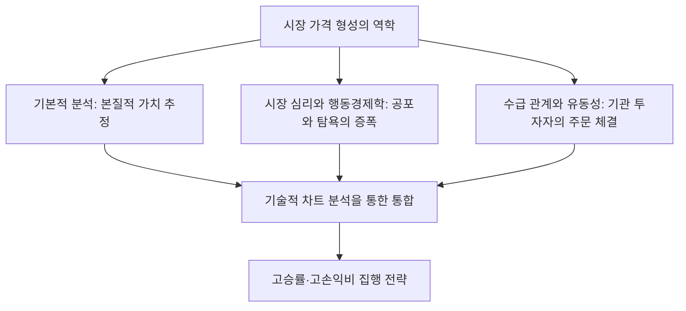
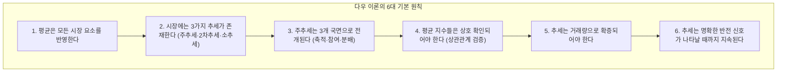
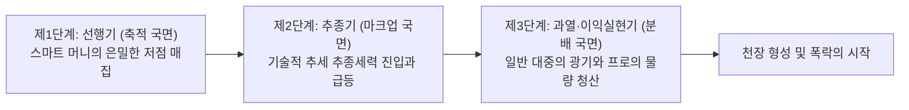
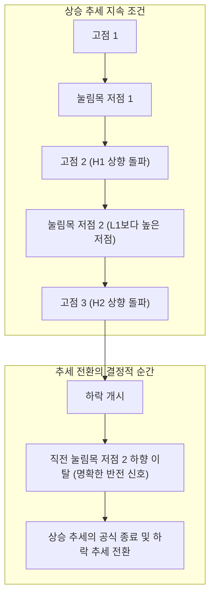
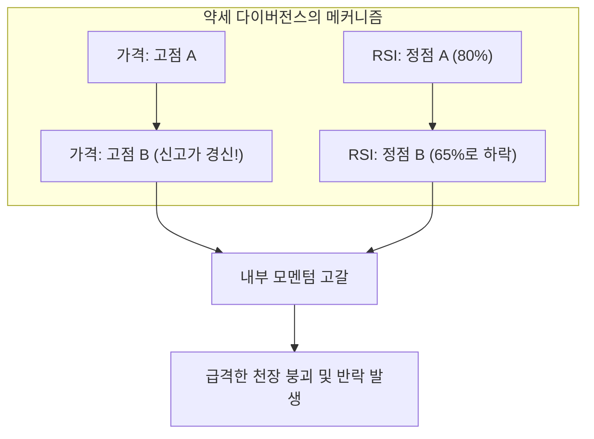
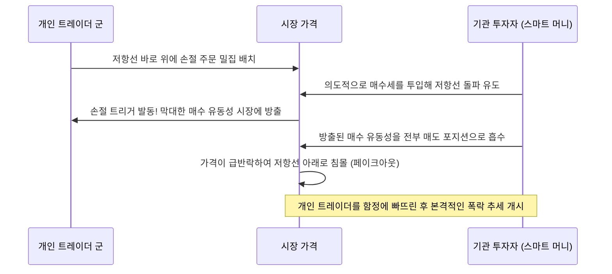
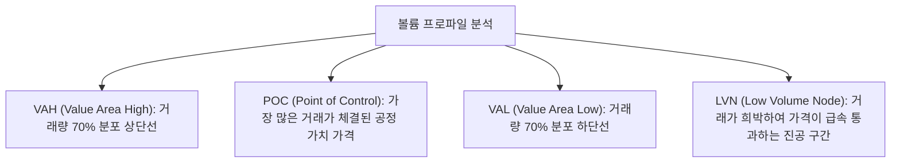

## 1. 서론: 기술적 분석의 철학적 기반과 시장의 본질

### 1.1 기본적 분석과 기술적 분석의 대립과 지양(Aufheben)

금융 시장에서 가격 형성 메커니즘을 규명하고 미래 가격 변동을 예측하기 위한 접근법은 역사적으로 크게 두 갈래의 흐름으로 나뉘어 발전해 왔다. 바로 '기본적 분석(Fundamental Analysis)'과 '기술적 분석(Technical Analysis)'이다.

기본적 분석은 기업의 재무제표, 현금흐름, 금리, GDP 성장률, 인플레이션율, 지정학적 리스크 등과 같은 '본질적 가치(Intrinsic Value)'를 산정하고, 시장 가격이 이론적 가치로부터 괴리된 왜곡을 포착하여 투자 판단을 내린다. 이 관점에서 시장 가격은 단기적으로 비이성적일 수 있으나, 장기적으로는 기업의 펀더멘털이나 거시경제의 균형점으로 수렴한다고 가정한다.

반면 기술적 분석의 대상은 과거부터 현재에 이르기까지 형성된 '가격(Price)', '거래량(Volume)', '시간(Time)'의 궤적 그 자체다. 기술적 분석가는 가격을 움직이는 진정한 주체가 펀더멘털 그 자체가 아니라, 펀더멘털을 해석하는 '인간의 심리, 공포, 탐욕, 인지 편향, 그리고 자금의 흐름(유동성)'이라고 파악한다.

현대의 고도화된 프로페셔널 트레이딩 환경에서 이 두 분석론은 배타적으로 대립하는 관계가 아니라 '변증법적 지양(Aufheben)'을 이루어야 할 보완적 관계다. 기본적 분석은 '무엇을 거래해야 하는가(종목 선정)'를 알려주고, 기술적 분석은 '언제 거래해야 하는가, 어디서 리스크를 한정해야 하는가(타이밍 및 리스크 관리)'를 알려주기 때문이다. 아무리 재무구조가 우량한 기업이라 할지라도 시장 전체의 거대한 하락 추세 속에서는 수년간 하락을 지속할 수 있으며, 이러한 하락의 역학을 시각화해 내는 것이야말로 기술적 분석의 진면목이다.



---

### 1.2 "가격은 모든 사실을 반영한다": 효율적 시장 가설(EMH)에 대한 비판과 행동경제학

기술적 분석의 제1공리는 **"시장 가격은 현재 입수 가능한 모든 정보(공개 정보뿐만 아니라 내부 정보, 시장의 심리, 천재지변, 지정학적 리스크, 참여자들의 집단 심리 상태까지)를 즉각 반영한다"**는 명제다.

학계의 전통적 금융경제학을 오랜 기간 지배해 온 '효율적 시장 가설(Efficient Market Hypothesis: EMH)'의 약형(Weak-Form) 효율성에 따르면, "과거의 가격 및 거래량 정보는 이미 현재 가격에 완전히 반영되어 있으므로 기술적 분석을 통해 시장 평균을 초과하는 알파(Alpha)를 창출하는 것은 불가능하다"고 규정한다.

그러나 1980년대 이후 비약적으로 발전한 '행동경제학(Behavioral Economics)'과 '행동재무학'은 효율적 시장 가설의 대전제인 "시장 참여자는 언제나 합리적이다"라는 가정이 현실 세계에서는 완전히 파탄 나 있음을 실험심리학적으로 입증했다.
- 대니얼 카너먼과 에이모스 트버스키가 제창한 '전망 이론(Prospect Theory)'은 인간이 이익 구간에서는 '위험 회피적' 성향을 보이고, 손실 구간에서는 '위험 추구적' 성향을 보이는 비대칭적 인지 왜곡을 지니고 있음을 명백히 밝혔다.
- 닻 내림 효과(Anchoring Effect), 군집 행동(Herding Behavior), 확증 편향, 과잉 확신(Overconfidence) 등의 심리적 편향은 시장에서 주기적인 '과매수(버블)'와 '과매도(패닉)'의 사이클을 필연적으로 유발한다.

기술적 분석은 무작위적 노이즈 속에서 미래를 점치는 수정구슬이 아니다. **"인간의 보편적인 인지 편향이 집단행동으로서 차트 위에 투영하는, 반복 가능한 기하학적 패턴의 통계적 해독법"**이다.

---

### 1.3 랜덤워크 이론에 대한 프랙탈 구조 가설 (만델브로)

또 다른 학문적 비판으로 '랜덤워크 이론(Random Walk Theory)'이 있다. 이는 가격 변동의 확률 분포가 정규분포(가우스 분포)를 따르며, 과거의 가격 추이와 미래 가격 변동 사이에는 어떠한 자기상관성도 존재하지 않는다는 주장이다.

이 고전적 가설에 결정적인 반증을 제시한 인물이 바로 프랙탈 기하학의 창시자 브누아 만델브로(Benoit Mandelbrot)였다. 만델브로는 수십 년에 걸친 면화 가격 및 환율의 초장기 시계열 데이터를 정밀 분석하여 다음 사실을 수학적으로 증명했다.

1. **두터운 꼬리(Fat Tails)**: 금융 시장의 가격 변동은 정규분포가 아니며, 극단적인 가격 변동(블랙스완 이벤트)이 정규분포의 예측치보다 수천 배 이상 높은 빈도로 발생하는 '거듭제곱 법칙(Power Law)'을 따른다.
2. **변동성 군집(Volatility Clustering)**: 큰 변동성 뒤에는 큰 변동성이 뒤따르고, 작은 변동성 뒤에는 작은 변동성이 지속되는 분산의 자기상관성이 명백히 존재한다.
3. **자기유사성(Self-Similarity)**: 1분봉 차트, 일봉 차트, 월봉 차트에서 시간축 라벨을 가리고 나열했을 때, 전문 트레이더조차 어느 것이 어떤 시간축인지 분별하기 어려울 정도로 기하학적 형상이 자기유사성을 띤다.

이러한 '시장의 프랙탈 구조'야말로 기술적 분석이 시간축을 초월하여 유효하게 작동하는 객관적인 수학적 근거다. 상위 타임프레임의 추세 속에 하위 타임프레임의 추세가 중첩된 구조로 존재하며, 이들이 공명하는 순간 막대한 모멘텀이 촉발된다.

---

## 2. 근대 차트 분석의 초석: 다우 이론의 6대 원칙과 현대적 재해석

근대 기술적 분석의 모든 이론(엘리어트 파동 이론, 그랜빌의 법칙, 현대 프라이스 액션 등)의 근간에 위치하는 것이 바로 월스트리트 저널의 창립자 찰스 다우(Charles H. Dow, 1851–1902)가 주창한 '다우 이론(Dow Theory)'이다. 다우 자신은 체계적인 저서를 남기지 않고 사설 형태로 발표했을 뿐이었으나, 사후 새뮤얼 넬슨, 윌리엄 해밀턴, 로버트 레아 등에 의해 6대 원칙으로 정립되었다.



---

### 2.1 원칙 1: 평균(시장 가격)은 모든 사상을 반영한다

다우존스 산업평균지수와 같은 종합 주가지수는 경기 동향, 기업 실적, 금리 정책, 자연재해, 전쟁, 그리고 시장 참여자 전체의 심리와 행동을 남김없이 반영한다. 어떠한 거시경제 지표나 긴급 뉴스도 시장에 전파되는 즉시 가격에 반영되므로, 펀더멘털 뉴스가 공식 발표되기를 기다려 거래하는 것은 본질적으로 후행적일 수밖에 없다. 차트의 움직임 자체를 정밀 관찰하는 것이야말로 가장 선행적이며 포괄적인 정보 획득 방식이다.

---

### 2.2 원칙 2: 시장에는 3가지 추세가 존재한다

다우는 바다의 파도에 비유하여 추세를 3단계 위계로 분류했다.

1. **주추세(Primary Trend: 조석의 밀물과 썰물)**: 1년에서 수년 이상 지속되는 거대한 기조. 시장 전체의 거시적 방향성을 결정한다.
2. **2차 추세(Secondary Trend: 파도)**: 주추세의 진행 방향과 반대로 발생하는 조정 국면. 통상 3주에서 3개월가량 지속되며, 주추세 변동폭의 1/3에서 2/3(또는 1/2)을 되돌린다.
3. **소추세(Minor Trend: 잔물결)**: 3주 미만(수 시간에서 며칠)의 단기 가격 변동. 일상적인 노이즈와 투기적 매매로 형성되며 인위적 조작(Market Manipulation)에 취약하므로, 소추세 단독 분석은 대단히 위험하다.

현대 트레이딩에서 이는 **'멀티 타임프레임 분석(MTF: Multi-Timeframe Analysis)'**의 핵심 원리로 계승되었다. 일봉·주봉(조석)으로 전체 추세의 방향을 확정하고, 4시간봉(파도)에서 눌림목과 되돌림을 포착하며, 15분봉·5분봉(잔물결)에서 정밀한 진입 타이밍을 조준하는 3단계 계층 구조는 다우의 통찰 그 자체다.

---

### 2.3 원칙 3: 주추세는 3가지 국면으로 전개된다

주추세(특히 상승 추세)는 참여자의 심리와 행동 특성에 따라 명확히 구별되는 3개의 국면을 거친다.



- **제1단계: 선행기(Accumulation: 축적 국면)**: 극심한 경기 침체나 폭락의 바닥권에서 대중이 비관과 절망에 사로잡혀 있을 때, 시장의 본질을 꿰뚫어 보는 소수의 스마트 머니(기관 투자자, 전문 트레이더)가 극도로 저평가된 자산을 조용히 매집하는 단계. 가격은 횡보세를 보이며 변동성은 극단적으로 위축된다.
- **제2단계: 추종기(Public Participation: 마크업 국면)**: 거시경제 지표와 기업 실적의 턴어라운드가 가시화되면서 기술적 분석을 따르는 추세 추종 트레이더들이 대거 진입하는 단계. 가격이 가파르게 상승하며 가장 길고 안정적인 수익 구간을 형성한다.
- **제3단계: 과열·이익실현기(Distribution: 분배 국면)**: 언론 매체에서 연일 해당 자산의 급등을 대서특필하고, 투자 경험이 전무한 일반 대중(덤 머니)이 포모(FOMO)에 사로잡혀 시장으로 쇄도하는 단계. 이때 제1단계 바닥권에서 매집을 끝낸 스마트 머니는 대중의 매수 주문을 받아내며 조용히 보유 물량을 넘겨 이익을 실현한다. 차트에는 극심한 변동성과 긴 윗꼬리가 빈번하게 출현하며 추세는 종말을 고한다.

---

### 2.4 원칙 4: 평균 지수들은 상호 확인되어야 한다

찰스 다우 생전에는 '다우 산업주 평균(현 다우존스 산업평균지수)'과 '철도주 평균(현 다우존스 운송지수)'의 상호 관계를 비교 검증했다. 공장에서 산업 제품을 아무리 대량 생산하더라도 이를 철도로 소비지까지 운송하지 못한다면 실물 경제의 호황은 허상에 불과하다. 따라서 산업주 평균이 신고가를 경신했다 하더라도 운송주 평균이 동시에 신고가를 경신하며 보조를 맞추지 않는다면 본격적인 강세장으로 단정할 수 없다고 보았다.

현대 시장에서 이 원칙은 **'상관·역상관 분석'** 및 **'시장 내부 지표(Market Internals) 분석'**으로 확장되었다.
- S&P 500 지수가 신고가를 경신할 때 기술주 중심의 나스닥(NASDAQ)과 중소형주 지수인 러셀 2000(Russell 2000)이 함께 따라붙고 있는가?
- 외환 시장에서 달러/엔의 상승이 미국 장기채 금리 및 달러 인덱스(DXY)의 상승과 일관되게 정렬되어 있는가?
- 가상자산 시장에서 비트코인의 독주 상승에 이더리움 및 주요 알트코인들이 동조하고 있는가?

시장 간 상호 확인(Confirmation)이 결여된 단독 신고가 경신은 기관 투자자가 쳐놓은 '강세 함정(Bull Trap)'일 확률이 대단히 높다.

---

### 2.5 원칙 5: 추세는 거래량으로 확증되어야 한다

가격이 추세의 '방향'을 제시한다면, 거래량(Volume)은 해당 추세를 뒷받침하는 '에너지의 진위'를 입증한다.

- **건전한 상승 추세**: 가격이 상승할 때 거래량이 증가하고, 조정 하락 시에는 거래량이 감소한다.
- **건전한 하락 추세**: 가격이 하락할 때 거래량이 급증하고, 기술적 반등 국면에서는 거래량이 감소한다.

만약 가격이 신고가를 경신하고 있음에도 거래량이 지속적으로 감소하고 있다면, 이는 "시장의 신규 매수세가 고갈되어 소수의 호가 공백으로 표면적인 상승만 유지되고 있음"을 경고하는 강력한 '볼륨 다이버전스(Volume Divergence)' 신호다. 리처드 와이코프(Richard Wyckoff)는 다우의 이 원칙을 극한까지 발전시켜 가격과 거래량의 상관관계로부터 메이저 플레이어의 의도를 해독하는 VSA(Volume Spread Analysis) 기법을 정립했다.

---

### 2.6 원칙 6: 추세는 명확한 반전 신호가 발생할 때까지 지속된다

다우 이론 중 실전 차트 트레이더가 가장 엄격하게 준수해야 하는 규율이 바로 이 제6원칙이다.

추세의 수학적·구조적 정의는 놀라울 정도로 명료하다.
- **상승 추세의 정의**: **"고점(High)이 지속적으로 높아지고, 동시에 저점(Low)도 계속해서 높아지는 상태"**
- **하락 추세의 정의**: **"고점이 지속적으로 낮아지고, 동시에 저점도 계속해서 낮아지는 상태"**



가격이 아무리 급등하여 심리적으로 "너무 비싸서 살 수 없다"고 느껴지더라도, 직전의 '의미 있는 눌림목 저점(Higher Low)'을 종가 기준으로 명확히 하향 이탈하기 전까지 상승 추세는 온전히 살아있다. 인간의 주관적 감각에 의존해 "이제 슬슬 천장이겠지"라며 역추세 매도를 시도하는 행위는 이 원칙을 정면으로 위반하는 가장 치명적인 자살골이다.

---

## 3. 엘리어트 파동 이론과 피보나치 수리의 신비

### 3.1 랠프 넬슨 엘리어트의 우주적 질서론

다우 이론이 추세의 방향성과 전환을 규정했다면, 가격 변동의 '리듬'과 '기하학적 프랙탈성'을 극도로 체계화한 인물이 바로 랠프 넬슨 엘리어트(Ralph Nelson Elliott, 1871–1948)다. 투병 생활 중이던 엘리어트는 75년 치에 달하는 다우 지수의 월봉, 주봉, 일봉, 심지어 30분봉 차트까지 광기 어린 집념으로 수기 분석하여 1938년 『파동 원리(The Wave Principle)』를 발표했다.

엘리어트는 인간의 사회적 활동과 집단 심리의 변동이 대자연의 성장 메커니즘(조개껍데기의 나선, 식물의 잎차례, 은하의 소용돌이)을 지배하는 황금비와 피보나치수열에 따라 전개된다고 역설했다. 시장은 무질서한 혼돈이 아니라, **"5개의 추진파(Impulse Waves)와 3개의 조정파(Corrective Waves)"로 구성된 8파의 기본 순환 주기**를 무한히 반복하는 프랙탈 우주라는 것이다.

```mermaid
flowchart LR
    subgraph 추진파 (추세 방향: 5파 구성)
        W1["제1파<br/>(추세 태동)"] --> W2["제2파<br/>(깊은 되돌림)"]
        W2 --> W3["제3파<br/>(가장 강력한 폭발)"]
        W3 --> W4["제4파<br/>(복합 조정)"]
        W4 --> W5["제5파<br/>(마지막 광기)"]
    end
    subgraph 조정파 (카운터 트렌드: 3파 구성)
        W5 --> WA["A파<br/>(하락 개시)"]
        WA --> WB["B파<br/>(가짜 반등)"]
        WB --> WC["C파<br/>(파멸적 급락)"]
    end
```

---

### 3.2 추진파(임펄스 파동)의 구조와 3대 절대 규칙

추진파(추세와 동일한 방향으로 진행하는 파동) 중 가장 표준적인 '임펄스 파동(Impulse Wave)'에는 **절대로 위반되어서는 안 되는 '3대 불변의 규칙'**이 존재한다. 단 하나라도 위배될 경우 해당 파동 카운팅(라벨링)은 원천 무효이며 즉시 재분석해야 한다.

1. **규칙 1: 제2파는 제1파의 시작점 아래로 되돌려서는 안 된다(100% 이상의 되돌림 금지).** (만약 시작점을 하회한다면 그것은 1파가 아니며 이전 하락 추세의 지속이다).
2. **규칙 2: 제1파, 제3파, 제5파 중 제3파는 결코 가장 짧은 파동이 될 수 없다.** (통상 제3파는 가장 강력하고 긴 연장 파동을 형성한다).
3. **규칙 3: 제4파는 제1파의 고점 영역(영토)과 결코 겹쳐서는(Overlap) 안 된다.** (제4파의 저점이 제1파의 고점 밑으로 내려오는 순간 그 파동은 임펄스가 아닌 다이애거널 등의 예외적 형태가 된다).

#### 파동별 심리학적 특성
- **제1파**: 추세 전환의 태동기. 여전히 악화된 펀더멘털 뉴스가 지배적이며 대다수 참여자는 단순한 일시 반등으로 치부하므로 상승 탄력은 제한적이다.
- **제2파**: 제1파의 급격한 되돌림. 상당수 참여자가 "하락 추세가 다시 재개되었다"며 공포 매도를 던지기 때문에 1파 상승분의 50%~61.8%(심할 경우 78.6%)에 달하는 깊은 눌림목을 형성한다. 그러나 결코 제1파의 기점을 깨지 않는다.
- **제3파**: 기술적 지표들이 일제히 호전되고 직전 고점 돌파를 확인한 시장 참여자들이 앞다투어 추격 매수에 가담하는 국면. 거래량이 폭발적으로 급증하며 갭(Gap)을 동반한 가장 가파르고 장대한 상승을 연출한다. 프로 트레이더가 최대 비중을 실어 가장 큰 수익을 수확해야 하는 '황금의 파동'이다.
- **제4파**: 제3파의 막대한 차익을 실현하는 매물과 뒤늦게 진입하려는 눌림목 매수세가 맞부딪히는 혼조 국면. 시간 소모가 길고 삼각수렴(Triangle) 등 복잡한 조정 패턴을 띠기 쉽다(교대의 법칙: 제2파가 단순 급각 조정이었다면 제4파는 복잡한 횡보 조정을 보인다).
- **제5파**: 펀더멘털 호재가 극에 달하고 일반 대중이 환호하며 추격 매수하는 마지막 축제. 그러나 모멘텀 지표(RSI, MACD)는 이미 제3파의 고점을 하회하는 '다이버전스'를 형성하며 내부 에너지의 고갈을 경고한다.

---

### 3.3 조정파(콜렉티브 파동)의 분류학

추진파가 완결된 후 찾아오는 조정 국면은 추진파보다 훨씬 다채롭고 복잡한 형태를 띤다. 엘리어트는 이를 크게 3가지 기본형으로 분류했다.

1. **지그재그(Zigzag: 5-3-5 구조)**: 매우 가파르고 깊은 급락 조정. A파(5파 하락) → B파(3파 반등, A파의 38.2%~50% 되돌림) → C파(5파 하락, A파의 길이에 필적하는 급락).
2. **플랫(Flat: 3-3-5 구조)**: 횡보성 박스권 조정. A파(3파) → B파(3파, A파의 시작점 부근까지 반등) → C파(5파, A파의 저점을 살짝 이탈하는 수준). 강세장에서는 B파가 A파의 고점을 넘긴 뒤 C파가 급락하는 '확장 플랫(Expanded Flat)'이 빈번하게 출현한다.
3. **트라이앵글(Triangle: 3-3-3-3-3 구조)**: 매수자와 매도자의 힘이 팽팽히 맞서며 가격 변동폭이 수렴하는 패턴(A-B-C-D-E의 5개 소파동). 제4파나 B파처럼 '마지막 파동 직전'에만 출현하며, 수렴 돌파 후 마지막 강력한 스러스트(제5파)를 촉발한다.

---

### 3.4 피보나치 비율과 파동 목표치 산출 수리

엘리어트 파동의 진정한 위력은 피보나치수열(0, 1, 1, 2, 3, 5, 8, 13, 21, 34, 55, 89, 144...)에서 도출되는 황금비율을 통해 향후 눌림목과 목표 가격을 경이로운 정밀도로 수학적 예측할 수 있다는 점에 있다.

주요 피보나치 비율:
- $\phi = \frac{\sqrt{5}-1}{2} \approx 0.618$
- $1 - \phi \approx 0.382$
- $\sqrt{0.618} \approx 0.786$
- $1.618$ (황금비의 역수이자 확장 비율)
- $2.618, 4.236$

#### 실전 목표가 산출 공식
1. **제2파 눌림목**: 제1파 수직 변동폭의 **$61.8\%$** 또는 **$50.0\%$**, 최대 **$78.6\%$**.
2. **제3파 목표 도달가**: 제1파의 변동폭을 $W_1$, 제2파의 종점을 $L_2$라 할 때,
   $$Target(W_3) = L_2 + 1.618 \times W_1$$
   초강세장에서는,
   $$Target(W_3) = L_2 + 2.618 \times W_1$$
3. **제4파 눌림목**: 제3파 변동폭의 **$38.2\%$**(얕은 되돌림), 또는 제3파 내부 소파동의 제4파 저점과 일치.
4. **제5파 목표 도달가**: 제1파 시작점부터 제3파 정점까지의 전체 변동폭의 **$61.8\%$**를 제4파의 바닥에 가산.

---

## 4. 동양의 지혜: 캔들스틱 형태학과 사카타 5법

서양의 기술적 분석이 꺾은선 차트나 바 차트에서 출발한 반면, 일본에서는 18세기 에도 시대 오사카 도지마 쌀 거래소에서 세계 최초의 선물 거래와 차트 분석이 독자적으로 꽃피웠다. 그 전설적인 시세의 거장이 바로 혼마 무네히사(本間宗久, 1724–1803)이며, 그가 남긴 시세 철학이 『삼원금천비록(三猿金泉秘録)』을 거쳐 오늘날의 '사카타 5법(酒田五法)'으로 결실을 맺었다.

---

### 4.1 캔들스틱(Candlestick)의 내부 역학

하나의 캔들스틱은 설정된 기간의 '시가(Open)', '고가(High)', '저가(Low)', '종가(Close)'라는 4개의 핵심 가격을 사각형의 몸통(Real Body)과 위아래 꼬리(Shadow)로 시각화한 도구다.

1980년대 후반 스티브 니슨(Steve Nison)이 저서 『Japanese Candlestick Charting Techniques』를 통해 서구권에 소개하자마자 월스트리트 트레이더들은 캔들의 압도적인 직관성과 정보 전달력에 큰 충격을 받았으며, 오늘날 캔들 차트는 전 세계 글로벌 표준으로 자리 잡았다.

| 캔들 형태 | 형상의 특징 | 내부의 시장 심리와 역학 |
| :--- | :--- | :--- |
| **장대양봉 (Marubozu)** | 몸통이 극단적으로 길고 위아래 꼬리가 거의 없음. | 시가부터 종가까지 매수세가 시장을 시종일관 완벽하게 지배했음을 증명. 매우 강력한 상승 신호. |
| **망치형 / 핀바 (Hammer / Pinbar)** | 몸통이 상단에 작게 형성되고 몸통 길이의 2배가 넘는 긴 밑꼬리를 형성. | 장중 매도세가 거칠게 가격을 끌어내렸으나, 저가 영역에서 막강한 매수 세력이 대기하며 매도세를 완전히 집어삼키고 시가 부근까지 가격을 밀어올림. **바닥 반등의 최강 신호**. |
| **유성형 (Shooting Star)** | 몸통이 하단에 작게 형성되고 몸통 길이의 2배가 넘는 긴 윗꼬리를 형성. | 매수세가 신고가를 뚫기 위해 폭발적 매수세를 보였으나, 고점 부근에서 강력한 매도 압력(기관의 차익실현)에 부딪혀 완전히 격퇴당하고 급락 마감함. **천장 형성의 강력한 반전 신호**. |
| **십자도지 (Doji)** | 시가와 종가가 거의 일치하여 몸통이 얇은 실선이나 십자 형태로 표시됨. | 매수세와 매도세의 에너지가 완전한 균형을 이룬 순간. 팽팽한 힘겨루기의 지속 또는 중대한 추세 반전의 전조. |

---

### 4.2 사카타 5법의 진수

사카타 5법은 복수의 캔들 조합을 통해 시장의 수급 에너지 전환을 읽어내는 5대 핵심 패턴이다.

1. **삼산(三山, 산잔)**: 고점권에서 3차례에 걸쳐 돌파를 시도하지만 실패하는 패턴. 중앙 봉우리가 가장 높은 형태를 '삼존 천장(Head and Shoulders Top)'이라 부르며, 넥라인을 이탈하는 순간 강력한 하락 추세가 확정된다.
2. **삼천(三川, 산센)**: 바닥권에서 3차례 저점을 다지는 형태(역헤드앤숄더·트리플 바텀). 혹은 '샛별형(Morning Star)'처럼 장대음봉, 팽이형 도지, 장대양봉의 3개 캔들로 바닥을 다지는 반전 패턴.
3. **삼공(三空, 산쿠)**: 추세 방향으로 가격 갭(Gap)을 만들며 연속으로 3번 뛰어오르는 현상. "삼공에는 반대 매매로 맞서라(삼공 디딤에는 매도, 삼공 내림에는 매수)"는 격언처럼, 4연속 갭은 시장 참여자의 탐욕이나 공포가 극에 달해 매수·매도 에너지가 완전히 소진된 클라이맥스를 가리킨다.
4. **삼병(三兵, 산페이)**: 바닥권에서 3개의 연속된 양봉이 출현하는 '적삼병'은 힘찬 상승 추세의 개시를 알린다. 단, 3번째 양봉의 윗꼬리가 길면 '적삼병 선단부 정체'라 하여 상승 피로감을 경계해야 한다. 반대로 고점권에서 연속 3개의 음봉이 출현하는 '흑삼병(세 마리 까마귀)'은 급락의 전조다.
5. **삼법(三法, 산포)**: "쉬는 것도 투자"라는 격언을 차트 패턴으로 구체화한 보합 조정 패턴. '상승삼법'은 장대양봉 출현 후 그 몸통 범위 내에서 3개의 작은 음봉이 잉태된 채 횡보하다가, 5번째 캔들에서 다시 장대양봉이 직전 고점을 뚫고 상승을 재개하는 형태다. 추세 지속형 조정(Continuation)을 감별하는 기준이 된다.

---

## 5. 기술적 지표(인디케이터)의 수학적 구조와 실전적 함정

차트 위에 수학적 연산식을 덧입혀 표시하는 보조지표는 크게 '추세 추종형(Trend-Following)'과 '오실레이터형(Mean-Reversion / Momentum)'으로 양분된다. 수많은 초보 트레이더가 지표 이면의 수학적 정의를 이해하지 못한 채 시그널만 맹신하다 참혹한 손실을 입는다. 여기서는 대표적 지표들의 수학적 골격을 해부한다.

### 5.1 추세형 지표의 수리

#### ① 이동평균선 (SMA vs EMA)
가장 원초적인 지표인 단순이동평균(SMA: Simple Moving Average)의 $n$기간 계산식은 다음과 같다.
$$SMA_t = \frac{1}{n} \sum_{i=0}^{n-1} P_{t-i}$$
SMA의 치명적인 한계는 '가장 최근 가격'과 '$n$일 전의 과거 가격'에 완전히 동일한 가중치($1/n$)를 부여한다는 점이다. 이로 인해 필연적으로 신호의 심각한 후행성(Lag)이 발생한다.

이 지연 현상을 획기적으로 개선한 것이 지수평활이동평균(EMA: Exponential Moving Average)이다. 최근 가격 $P_t$에 가장 높은 가중치를 부여하고, 과거 데이터의 가중치를 지수함수적으로 감쇠시킨다. 평활화 계수를 $\alpha = \frac{2}{n+1}$이라 할 때,
$$EMA_t = \alpha P_t + (1 - \alpha) EMA_{t-1}$$
EMA는 급격한 가격 변동에 매우 민첩하게 반응하므로, 현대의 초단타 데이트레이딩과 알고리즘 매매에서는 SMA보다 EMA(20EMA, 50EMA, 200EMA)가 압도적으로 선호된다.

#### ② 볼린저 밴드 (Bollinger Bands)
존 볼린저(John Bollinger)가 1980년대 개발한 볼린저 밴드는 가격의 이동평균선을 중심으로 표준편차($\sigma$)의 신뢰 대역을 시각화한 지표다.
$$Middle = SMA_n(P)$$
$$\sigma = \sqrt{\frac{1}{n} \sum_{i=0}^{n-1} (P_{t-i} - Middle)^2}$$
$$Upper = Middle + k \cdot \sigma, \quad Lower = Middle - k \cdot \sigma \quad (\text{통상 } k=2)$$

통계학의 정규분포에서 데이터가 평균값으로부터 $\pm 2\sigma$ 범위 내에 수렴할 확률은 **$95.44\%$**다.
그러나 여기에 수많은 독자를 파멸로 이끄는 가장 거대한 함정이 도사리고 있다. **금융 시장의 가격 변동은 정규분포를 따르지 않는다(두터운 꼬리를 지닌다)**.
따라서 "+2σ 상단 밴드에 닿았으니 과매수 상태다, 역추세 숏 매도다"라는 접근은 완벽한 오판이다. 강력한 추세가 폭발할 때 가격은 밴드를 바깥쪽으로 찢어 넓히며 $+2\sigma$ 밴드에 달라붙은 채 폭등을 지속한다(**밴드워크, Band Walk**). 볼린저 밴드의 진정한 활용법은 밴드가 극단적으로 좁혀진 '스퀴즈(Squeeze: 변동성 축소)'를 포착하고, 밴드가 폭발적으로 팽창하는 '확장(Expansion)'의 초동을 추세 추종으로 편승하는 데 있다.

---

### 5.2 오실레이터형 지표의 수리

#### ① RSI (Relative Strength Index: 상대강도지수)
J. 웰스 와일더(J. Welles Wilder)가 고안한 RSI는 일정 기간(통상 14일) 동안의 '상승폭의 합'과 '하락폭의 합'을 비교하여 시세의 상대적 모멘텀 강도를 $0 \sim 100\%$ 수치로 계량화한다.
$$RS = \frac{\text{과거 } n \text{ 일간의 평균 상승폭}}{\text{과거 } n \text{ 일간의 평균 하락폭}}$$
$$RSI = 100 - \frac{100}{1 + RS} = \frac{\text{평균 상승폭}}{\text{평균 상승폭} + \text{평균 하락폭}} \times 100$$

일반적으로 "70% 이상은 과매수, 30% 이하는 과매도"로 해석하지만, 강력한 원웨이 추세장에서는 RSI가 80% 이상에 고정된 채 가격이 수배로 폭등하는 일이 비일비재하다.
RSI에서 가장 신뢰도가 높은 진정한 시그널은 바로 **'다이버전스(Divergence: 역행 현상)'**다.
- **약세 다이버전스(Bearish Divergence)**: 차트 가격은 신고가를 경신하고 있으나 RSI 보조지표의 고점은 오히려 낮아지는 현상. 가격 상승을 견인하던 내부 에너지(매수 모멘텀)가 급속히 고갈되고 있음을 뜻하며, 추세 반전의 임박을 알리는 가장 치명적인 경고 신호다.



---

## 6. 현대 프라이스 액션 이론과 스마트 머니 콘셉트 (SMC)

2010년대 이후 기관 투자자의 초단타 고빈도 매매(HFT)와 AI 알고리즘 거래가 전체 시장 거래량의 80% 이상을 점유하게 되면서, 고전적 보조지표(MACD, 스토캐스틱 등)의 유효성은 현저히 퇴색되었다. 이를 대체하여 현대 프로 트레이더들 사이에서 사실상 실전 표준으로 자리 잡은 것이 가공되지 않은 순수 차트(Raw Chart)와 거래량만을 추적하는 '프라이스 액션 이론'과 '스마트 머니 콘셉트(SMC: Smart Money Concepts)'다.

### 6.1 유동성 사냥과 스톱 헌팅 (Liquidity Sweep)

SMC의 근본 철학은 **"시장은 언제나 가장 막대한 스톱로스(손절) 주문, 즉 유동성이 밀집된 곳을 목표로 움직인다"**는 냉혹한 현실 인식에 기반한다.

소액 개인 트레이더(리테일)들은 대개 동일한 교과서적 지식을 학습하고, 직관적으로 "누구나 보기 쉬운 더블 탑의 고점 바로 위"나 "박스권 하단 지지선의 바로 아래"에 기계적으로 손절 주문(스톱로스)을 배치한다. 그러나 수십억 달러 규모의 자금을 운용하는 거대 기관 투자자(스마트 머니)는 개인 트레이더들의 손절 주문이 대량으로 체결 대기 중인 유동성 풀이 아니라면, 시장에 충격 비용을 주지 않고 자신들의 막대한 물량을 매집하거나 청산할 수 없다.

1. **리퀴디티 스윕(Liquidity Sweep)**: 기관 투자자는 일부러 가격을 핵심 저항선 고점 위나 지지선 저점 밑으로 일시적으로 강하게 밀어 올리거나 내린다.
2. 이로 인해 리테일 트레이더들의 대량 손절 주문(매수 스톱 혹은 매도 스톱)이 일제히 격발되며 엄청난 시장 유동성이 쏟아져 나온다.
3. 기관 투자자는 쏟아져 나온 이 유동성을 고스란히 반대 포지션의 체결 물량으로 흡수한 뒤, 가격을 즉각 원래 레인지 내부로 되돌린다(페이크아웃 / 속임수 트랩).
4. 차트상에는 '매우 긴 꼬리(Pinbar)'가 남겨지고, 손절당한 개인 트레이더들을 뒤로한 채 가격은 반대 방향을 향해 폭발적으로 질주한다.



---

### 6.2 페어 밸류 갭 (FVG: Fair Value Gap)과 오더 블록 (Order Block)

SMC 매매 전략에서 최적의 진입 타점을 잡는 핵심 개념이 바로 'FVG(불균형 영역)'와 '오더 블록(OB)'이다.

- **페어 밸류 갭(FVG: Fair Value Gap)**: 기관 투자자가 막대한 자금을 일시에 쏟아부었을 때, 연속된 3개의 캔들 중에서 1번째 캔들의 고점과 3번째 캔들의 저점 사이에 거래가 전혀 체결되지 못한 '공백 영역'이 발생한다. 시장의 가격 알고리즘은 이러한 수급 불균형(Imbalance)을 해소하려는 경향이 있으므로, 향후 가격은 반드시 이 틈새를 메우기 위해 일시 회귀하는 습성을 지닌다. 이 되돌림을 노려 진입함으로써 극도로 타이트한 손절폭으로 경이로운 손익비를 달성할 수 있다.
- **오더 블록(Order Block)**: 폭발적인 돌파를 촉발하기 직전, 기관 투자자가 마지막으로 매집(또는 매도 공세)을 감행했던 '반대 방향 캔들'의 군집 구간. 이 가격대는 훗날 가격이 재방문했을 때 가장 강력한 기관급 지지·저항선으로 작용한다.

---

## 7. 승패를 가르는 궁극의 영역: 리스크 리워드와 자금 관리의 수학

아무리 완벽한 기술적 분석을 마스터했을지라도, 자금 관리(Money Management)의 수리를 무시하는 트레이더는 확률론적으로 100% 확실하게 파산한다. 트레이딩은 '미래를 예언하는 마법'이 아니라, '기댓값이 플러스인 에지(우위성)를 가진 시행을, 파산 확률 제로의 자금 배분 원칙 하에 무한히 반복하는 통계적 사업'이기 때문이다.

### 7.1 발사라의 파산 확률 (Balsara's Risk of Ruin)의 수학적 증명

프랑스의 수학자 나우저 발사라(Nauzer Balsara)는 트레이더의 '승률(Win Rate)', '손익비(Payoff Ratio: 평균 이익 대비 평균 손실 비율)', '1회 매매당 리스크 비율(총자본 대비 허용 손실폭)'이라는 3가지 변수를 결합하여 트레이더가 종국에 파산에 이를 확률을 계산하는 수학적 모델을 구축했다.

- **승률($W$)**: 수익 거래 횟수 $\div$ 총 거래 횟수
- **손익비($R$)**: 평균 이익금 $\div$ 평균 손실금

아래 표는 1회 거래당 총자본의 $20\%$를 잃는 극단적 리스크를 감수했을 때, 승률과 손익비에 따른 발사라의 파산 확률(개략치)을 보여준다.

| 승률 \ 손익비 ($R$) | 0.5 (손대이소) | 1.0 (손익동일) | 1.5 (이대손소) | 2.0 (이상적 손익비) | 3.0 (초우량 손익비) |
| :---: | :---: | :---: | :---: | :---: | :---: |
| **30%** | 100% | 100% | 100% | 80.0% | 14.3% |
| **40%** | 100% | 100% | 38.2% | 14.1% | 1.2% |
| **50%** | 100% | 50.0% | 5.6% | 0.8% | **0.0%** |
| **60%** | 100% | 2.1% | 0.1% | **0.0%** | **0.0%** |
| **70%** | 14.3% | **0.0%** | **0.0%** | **0.0%** | **0.0%** |

이 표가 증명하는 냉혹한 진실은, **"승률이 60%에 달하더라도 손익비가 0.5(수익 1을 얻을 때 손실 2를 감수)라면 파산 확률은 100%다"**라는 점이다. 초보자들이 승률 90%를 자랑하는 기법에 열광하다가, 조금씩 번 돈을 한 번의 폭락으로 계좌째 날려버리는 비극은 이 수학적 필연에서 기인한다.

반대로, **승률이 겨우 40%에 불과하더라도 손익비가 2.0(평균 이익이 평균 손실의 2배)을 확보한다면 파산 확률은 14%로 급감하며, 손익비가 3.0에 도달하면 파산 확률은 불과 1.2%로 떨어져 장기적으로 계좌는 확실히 우상향한다**.

---

### 7.2 2% 룰과 정량적 포지션 사이징 공식

전문 프로 트레이더들의 자금 관리에서 절대적인 불문율은 바로 **"1회 트레이딩에서 감수하는 최대 손실액을 계좌 총자산의 $1\% \sim 2\%$ 이내로 엄격히 고정한다"**는 것이다(2% 룰).

수많은 초보자는 "매번 1계약(1랏)씩 진입한다"는 식으로 거래 수량을 고정한다. 이는 완전히 치명적인 오류다. 차트상의 핵심 지지선 위치나 시장 변동성에 따라 설정해야 하는 손절폭(스톱폭)은 거래마다 매번 달라지기 때문이다.

올바른 포지션 사이징(계약 수량)의 정량 공식은 다음과 같이 유도된다.

$$Position\_Size = \frac{Account\_Balance \times Risk\_Percentage}{Entry\_Price - Stop\_Loss\_Price}$$

#### 구체적 계산 예시
- 계좌 총잔고: $10,000,000$ 원
- 1회 허용 리스크: $2\%$ (최대 허용 손실액 $= 200,000$ 원)
- 진입 가격: $150.00$ 원 (달러/엔 기준)
- 차트 분석에 기반한 손절 가격: $149.20$ 원 (손절폭 $= 0.80$ 원 $= 80$ pips)

이때 진입해야 하는 최적 포지션 수량은:
$$Position\_Size = \frac{200,000 \text{ 원}}{0.80 \text{ 원}} = 250,000 \text{ 통화 (2.5 랏)}$$

만약 손절폭이 $0.40$ 원(40 pips)으로 타이트한 구간이라면 포지션 규모를 $5.0$ 랏으로 늘릴 수 있다. 반대로 손절폭이 $1.60$ 원(160 pips)으로 넓은 구간이라면 포지션 규모를 $1.25$ 랏으로 줄여야 한다. **"손실 금액을 항상 일정하게 유지하기 위해, 손절폭에 반비례하여 포지션 사이즈를 동적으로 역산한다"**. 이것이야말로 어떠한 연패를 겪더라도 계좌를 끝까지 지켜내는 유일한 수학적 방패다.

---

### 7.3 전망 이론과 심리적 편향의 극복

왜 인간은 이토록 명쾌한 자금 관리 원칙을 스스로 무너뜨리는 것일까? 그 근본적인 이유는 인류의 뇌 진화 역사 속에 각인되어 있다.

인류가 수렵과 채집을 하던 수십만 년 동안 눈앞의 사냥감이나 열매는 즉시 섭취하지 않으면 부패하거나 경쟁자에게 빼앗겼다. 또한 생명의 위협이 되는 손실에 직면했을 때는 끝까지 저항하는 것이 생존율을 높였다.

그러나 이 원시적 생존 본능은 확률론으로 작동하는 현대 금융 시장에서는 치명적인 독약으로 변질된다.
1. **수익에 대한 위험 회피(너무 이른 익절)**: 계좌에 평가수익이 발생하면 "이 수익을 잃고 싶지 않다"는 불안감에 압도되어 불과 몇 pips의 이익만 챙기고 황급히 청산해 버린다.
2. **손실에 대한 위험 추구(손절 지연 및 물타기)**: 평가손실이 발생하면 "손실을 확정 짓고 싶지 않다"는 강렬한 부정 기제가 발동하여 손절선을 아래로 슬금슬금 미루며, 나아가 '물타기(추가 매수)'를 감행하며 기도를 시작한다.

트레이딩에서 장기적인 승리를 쟁취하기 위한 궁극의 성배는 복잡한 인디케이터 조합 따위가 아니다. **"자신의 DNA에 새겨진 인간 본능(전망 이론의 저주)을 자각하고, 기계처럼 냉혹하게 확률과 기댓값의 규율을 관철해 내는 철저한 자기 절제"**다.

---

---

### 7.4 켈리 공식(Kelly Criterion)의 수리와 실전적 하프 켈리의 운용

자금 관리 분야에서 발사라의 파산 확률과 쌍벽을 이루는 수학적 금자탑이 바로 1956년 벨 연구소의 물리학자 존 래리 켈리 주니어(John Larry Kelly Jr.)가 정보이론에 기반하여 도출한 '켈리 공식(Kelly Criterion)'이다.

켈리 공식은 복리 환경에서 기하평균 성장률(장기적 자금 증식률의 로그 기댓값)을 극대화하는 최적의 투자 배분 비율 $f^*$를 산출하는 공식이다.

$$f^* = \frac{b \cdot p - q}{b} = p - \frac{q}{b}$$

여기서,
- $p$: 승률 (확률 $0 \le p \le 1$)
- $q = 1 - p$: 패율
- $b$: 손익비 (배당률·순익비 = 1회당 수익액 $\div$ 손실액)

### 켈리 공식의 수치 예시와 파멸의 함정
예컨대 승률 $p = 0.55$(55%), 손익비 $b = 1.5$(리스크 리워드 1:1.5)라는 강력한 에지를 지닌 트레이딩 전략을 가정해 보자.
$$f^* = \frac{1.5 \times 0.55 - 0.45}{1.5} = \frac{0.825 - 0.45}{1.5} = \frac{0.375}{1.5} = 0.25 \quad (25\%)$$

수학적으로는 매 트레이드마다 총자산의 **$25\%$**를 베팅할 때 자금이 가장 빠르고 극대화되어 증가한다는 결론이 도출된다.
그러나 실제 금융 시장 트레이딩에서 풀 켈리(Full Kelly)를 그대로 운용하는 것은 **'자살 행위'**와 다름없다. 켈리 공식은 "모집단의 진정한 승률과 배당률이 미래에도 불변한다"는 비현실적인 가정에 기초하고 있기 때문이다.

시장 환경이 급변하여 승률이 일시 하락하거나 7회 연속 손실이 발생할 경우, 25% 풀 켈리 체제에서는 계좌 최대 낙폭(MDD)이 $80\%$를 상회하여 회복 불가능한 멘탈 붕괴를 초래한다.

### 하프 켈리(Half-Kelly)의 절대적 우위성
이 때문에 현대 퀀트와 프로 트레이더들은 계산된 켈리 비율의 절반 또는 1/4만을 실전 투입하는 **'하프 켈리(Half-Kelly)'** 전략을 채택한다.
- 하프 켈리($f^* / 2$)를 적용할 경우, 이론적 최대 성장률의 약 **$75\%$**를 유지하면서도 변동성과 최대 낙폭(MDD)을 **$50\%$ 이상 획기적으로 축소**시킬 수 있다.
- 앞선 예시의 경우 투입 리스크를 $12.5\%$, 보다 보수적인 쿼터 켈리(Quarter-Kelly)라면 $6.25\%$로 통제한다. 여기에 앞서 다룬 '2% 룰'이라는 실무적 캡을 씌움으로써 자산은 흔들리지 않는 수학적 안정성을 확보하게 된다.

---

### 7.5 볼륨 프로파일 (Volume Profile)과 POC (Point of Control)의 구조

전통적인 차트의 거래량은 화면 하단에 '시간별 세로 막대'로 표시된다(Volume by Time). 그러나 최근 기관 투자자들의 매물대를 추적하는 데 필수불가결한 도구로 부상한 것이 차트 우측에 '가격대별 가로 막대'로 거래량을 집계하는 **'볼륨 프로파일(Volume Profile / VPVR)'**이다.



1. **POC (Point of Control)**: 지정된 분석 기간 동안 가장 방대한 거래량이 체결된 단일 가격 레벨. 시장 참여자 전체가 가장 '공정한 가치(Fair Value)'로 합의한 인력의 중심점이며, 가격이 이탈하더라도 다시 POC로 회귀하려는 강력한 자석 역할을 수행한다.
2. **밸류 에어리어 (Value Area: VA)**: 전체 거래량의 $70\%$(정규분포의 $1\sigma$에 해당)가 집중된 핵심 가격대.
   - **VAH (Value Area High)**: 밸류 에어리어 상단 경계선. 강력한 저항선으로 작동.
   - **VAL (Value Area Low)**: 밸류 에어리어 하단 경계선. 강력한 지지선으로 작동.
3. **LVN (Low Volume Node)**: 거래 체결량이 거의 없었던 거래량의 골짜기. 매수자와 매도자 간의 합의가 형성되지 못한 '진공 영역'이므로, 가격이 이 영역에 진입하면 어떠한 저항도 받지 않고 순식간에 고속으로 통과한다.

볼륨 프로파일을 활용하면 과거의 고점·저점이라는 단순한 '수평선'을 넘어, '실제 자금이 대량으로 투입된 진정한 매물대'를 X-ray 사진처럼 투시할 수 있다.

---

### 7.6 멀티 타임프레임 (MTF) 동기화 프로토콜

프로페셔널 실전 트레이딩 현장에서는 다음 5단계의 멀티 타임프레임 동기화 프로토콜에 따라 기계적으로 집행된다.

| 타임프레임 | 역할 | 모니터링 항목 및 결정 사항 |
| :--- | :--- | :--- |
| **1. 주봉 / 일봉** | 환경 인식 (바다의 대조류) | 주추세(다우 이론의 고점·저점 갱신 상태), 200EMA 기울기, 거시적 주요 지지·저항 대역. |
| **2. 4시간봉** | 셋업 구축 (파도의 구조) | 엘리어트 파동 카운팅(현재 제3파 구간인지 제4파 눌림목인지 판별), 피보나치 되돌림(61.8% 도달 여부 확인). |
| **3. 1시간봉** | 유동성 특정 (사냥감의 배치) | FVG(불균형 갭), 오더 블록(OB), 직전 고점·저점에 위치한 리퀴디티 풀 식별. |
| **4. 15분봉** | 추세 전환 확증 | 하위 타임프레임에서의 '초크(CHoCH: Change of Character)', 되돌림 고점 상향 돌파 또는 눌림목 저점 하향 이탈 확인. |
| **5. 5분봉 / 1분봉** | 진입 집행 (방아쇠 당기기) | 핀바, 장악형 캔들(Engulfing), 타이트한 손절가 확정, 포지션 사이징 공식 계산 및 주문 발주. |

상위 타임프레임의 거시적 환경 분석과 하위 타임프레임의 정밀 트리거가 완벽하게 일치하는 '컨플루언스(Confluence: 합류점)'에서만 선별적으로 방아쇠를 당겨야 한다. 그 외의 시간에는 무리하게 포지션을 잡지 않고 냉정하게 관망하는 것이야말로 승률과 계좌 수익 곡선을 비약적으로 안정시키는 최고의 비결이다.

---

## 8. 결론: 자기 정신의 경영으로서의 트레이딩

기술적 차트 분석의 탐구는 언뜻 외부의 시장을 정복하려는 여정처럼 보이지만, 그 실상은 내면의 무의식과 탐욕을 조율하는 '정신의 수양'에 다름 아니다.

차트는 전 세계 수많은 인간, 알고리즘, 중앙은행, 펀드매니저들의 희망, 절망, 계산, 과신이 교차하는 거대한 스크리닝 장치다. 그 위에 새겨지는 한 줄기 한 줄기의 캔들스틱은 인간이라는 생명체의 원초적인 맥박 그 자체다.

- 다우 이론을 통해 거대한 조류의 흐름을 통찰하고,
- 엘리어트 파동과 피보나치를 통해 시장의 기하학적 리듬을 헤아리며,
- 사카타 5법과 프라이스 액션을 통해 현장 수급의 진실을 포착하고,
- 발사라의 수학적 모델에 기반한 엄격한 자금 관리를 통해 자멸의 가능성을 원천 봉쇄한다.

이 통합적 체계를 온전히 체화하고 매일의 시세와 겸허히 마주할 때, 차트는 더 이상 예측 불가능한 카오스가 아니라 아름답고 조화로운 '확률의 교향곡'으로 눈앞에 장엄하게 펼쳐질 것이다.
