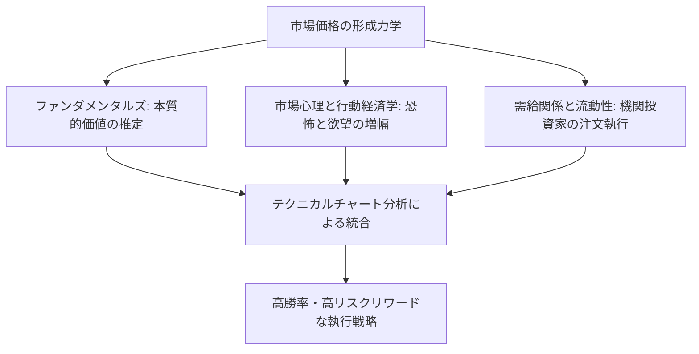
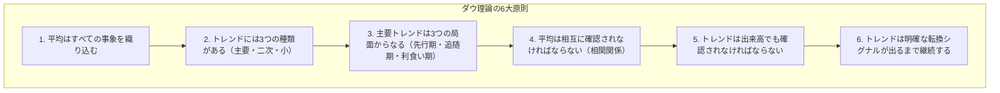
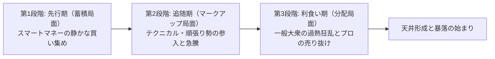
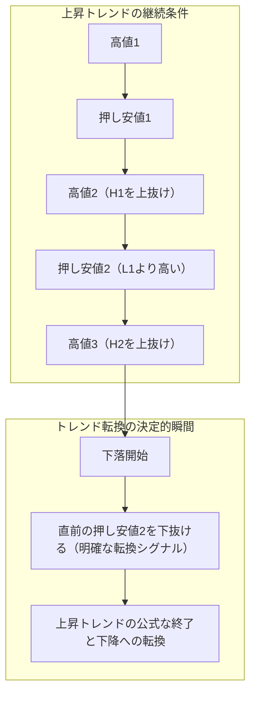
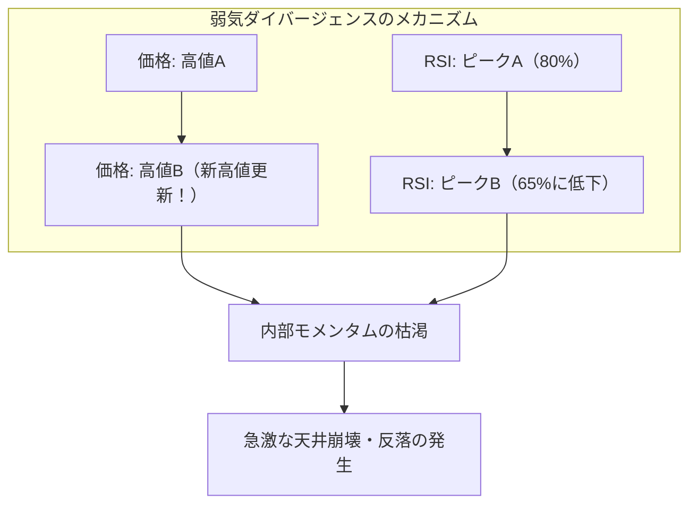
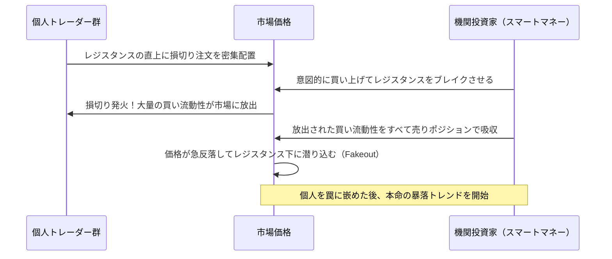
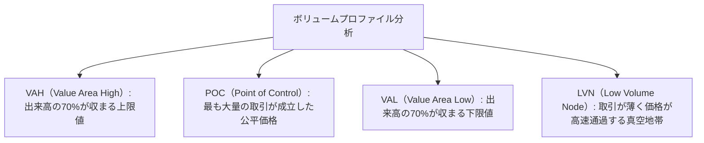

## 1. 序論：テクニカル分析の哲学的基盤と市場の本質

### 1.1 ファンダメンタルズ分析とテクニカル分析の対立と止揚

金融市場における価格形成のメカニズムを解明し、将来の価格変動を予測するためのアプローチは、歴史的に大きく2つの潮流に分かれてきた。すなわち「ファンダメンタルズ分析（Fundamental Analysis）」と「テクニカル分析（Technical Analysis）」である。

ファンダメンタルズ分析は、企業の財務諸表、キャッシュフロー、金利、GDP成長率、インフレ率、地政学的リスクといった「本質的価値（Intrinsic Value）」を算定し、市場価格がその理論的価値から乖離している歪みを捉えて投資判断を行う。この立場において、市場価格は短期的には非合理的であっても、長期的には企業のファンダメンタルズやマクロ経済の均衡点へと収斂すると仮定される。

これに対し、テクニカル分析が対象とするのは、過去から現在に至る「価格（Price）」「出来高（Volume）」「時間（Time）」の推移そのものである。テクニカルアナリストは、価格を動かしている真の主体はファンダメンタルズそのものではなく、ファンダメンタルズを解釈する「人間の心理、恐怖、欲望、認知バイアス、そして資金の流れ（流動性）」であると捉える。

現代の高度なプロフェッショナル・トレーディングにおいては、この両者は対立するものではなく「止揚（アウフヘーベン）」されるべき関係にある。ファンダメンタルズは「何を取引すべきか（銘柄選定）」を教え、テクニカル分析は「いつ取引すべきか、どこでリスクを限定すべきか（タイミングとリスク管理）」を教えるからである。どれほど財務内容が優良な企業であっても、市場全体の下降トレンドの渦中では数年にわたって下落し続けることがあり、その下落の力学を可視化するのがテクニカル分析の真骨頂である。



---

### 1.2 「価格はすべての事象を織り込む」：効率的市場仮説（EMH）への批判と行動経済学

テクニカル分析の第1の公理は、**「市場価格は、現在入手可能なすべての情報（公開情報のみならず内部情報、思惑、天災、地政学リスク、人々の心理状態）を瞬時に織り込んでいる」** という命題である。

アカデミックな金融経済学において長年支配的であった「効率的市場仮説（Efficient Market Hypothesis: EMH）」の弱型（Weak-Form）効率性によれば、「過去の価格や出来高の情報はすべて現在の価格に完全に反映されているため、テクニカル分析によって市場平均を上回る超過リターン（アルファ）を得ることは不可能である」とされる。

しかし、1980年代以降に急速に発展した「行動経済学（Behavioral Economics）」と「行動ファイナンス」は、効率的市場仮説の前提である「市場参加者は常に合理的である」という仮定が現実には完全に破綻していることを実験心理学的に証明した。
- ダニエル・カーネマンとエイモス・トベルスキーが提唱した「プロスペクト理論（Prospect Theory）」は、人間が利益を得る場面では「リスク回避的」になり、損失を被る場面では「リスク愛好的」になるという非対称な認知歪みを持つことを明らかにした。
- アンカリング効果、群集心理（Herding Behavior）、確証バイアス、過剰確信（Overconfidence）といった心理的偏向は、市場において規則的な「買われすぎ（バブル）」と「売られすぎ（パニック）」のサイクルを必然的に生み出す。

テクニカル分析とは、ランダムなノイズの海から未来を当てる水晶玉ではない。**「人間の普遍的な認知バイアスが集団行動としてチャート上に描き出す、反復可能な幾何学的パターンの統計的解読法」** なのである。

---

### 1.3 ランダムウォーク理論に対するフラクタル構造仮説（マンデルブロ）

もう一つの学術的批判として「ランダムウォーク理論（Random Walk Theory）」がある。これは、価格変動の確率分布は正規分布（ガウス分布）に従い、過去の価格推移と将来の価格推移の間には一切の自己相関が存在しないという主張である。

この古典的仮説に決定的な反証を突きつけたのが、フラクタル幾何学の創始者ブノワ・マンデルブロ（Benoit Mandelbrot）であった。マンデルブロは数十年にわたる綿花価格や為替レートの超長期データを詳細に解析し、以下の事実を数学的に証明した。

1. **ファット・テール（Fat Tails）**: 金融市場の価格変動は正規分布ではなく、極端な価格変動（ブラックスワン・イベント）が正規分布の予測を何千倍も上回る頻度で発生する「ベキ乗則（Power Law）」に従っている。
2. **ボラティリティ・クラスタリング**: 大きな価格変動の後は大きな価格変動が続き、小さな変動の後は小さな変動が続くという、分散の自己相関が存在する。
3. **自己相似性（Self-Similarity）**: 1分足チャート、日足チャート、月足チャートを時間軸のラベルを隠して並べたとき、プロのトレーダーであってもどれがどの時間軸かを判別できないほど、幾何学的な形状が相似している。

この「市場のフラクタル構造」こそが、テクニカル分析が時間軸を超えて有効に機能する客観的な数理的根拠である。上位足のトレンドの中に下位足のトレンドが入れ子構造として存在し、それらが共鳴した瞬間に巨大なモメンタムが発生する。

---

## 2. 近代チャート分析の礎石：ダウ理論の6大原則とその現代的再解釈

近代テクニカル分析のすべての理論（エリオット波動、グランビルの法則、現代プライスアクションなど）の源流に位置するのが、ウォール・ストリート・ジャーナルの創刊者チャールズ・ダウ（Charles H. Dow, 1851–1902）が提唱した「ダウ理論（Dow Theory）」である。ダウ自身は体系的な書物を残さず社説として書き遺したに過ぎなかったが、彼の死後、サミュエル・ネルソン、ウィリアム・ハミルトン、ロバート・レイらによって6大原則として体系化された。



---

### 2.1 原則1：平均（市場価格）はすべての事象を織り込む

ダウ平均株価のような市場平均価格は、景気動向、企業業績、金利政策、自然災害、戦争、そして市場参加者全員の心理と行動を完全に反映している。いかなる経済指標やニュース速報も、それが市場に伝達された瞬間に価格に織り込まれるため、ファンダメンタルズ情報の発表を待ってから取引することは本質的に遅行する。チャートの動きそのものを観察することこそが、最も先行的かつ包括的な情報収集である。

---

### 2.2 原則2：市場には3つのトレンドがある

ダウは、海の波浪に例えてトレンドを3つの階層に分類した。

1. **主要トレンド（Primary Trend: 潮の満ち引き）**: 1年から数年以上にわたって継続する巨大な基調。市場全体の大きな方向性を決定づける。
2. **二次トレンド（Secondary Trend: 波）**: 主要トレンドの進行方向と逆向きに発生する調整局面。通常3週間から3ヶ月程度継続し、主要トレンドの値幅の3分の1から3分の2（あるいは半値）を打ち消す。
3. **小トレンド（Minor Trend: さざ波）**: 3週間未満（数時間から数日）の短期的な値動き。日々のノイズや投機的思惑によって形成され、容易に操作（マニピュレーション）されるため、単独で分析することは極めて危険である。

現代のトレードにおいて、これは**「マルチタイムフレーム分析（MTF）」** の基本原理となっている。日足・週足（潮）の方向性を確認し、4時間足（波）で押し目や戻りを待ち、15分足・5分足（さざ波）で正確なエントリータイミングを図るという三層構造は、ダウの洞察そのものである。

---

### 2.3 原則3：主要トレンドは3つの局面からなる

主要トレンド（特に上昇トレンド）は、参加者の心理と行動の質によって明確に異なる3つのフェーズを辿る。



- **第1段階：先行期（Accumulation: 蓄積局面）**: 景気後退や暴落の底値圏で、世間が悲観と絶望に包まれている中、最も洞察力に優れた一部の抜け目のない投資家（スマートマネー・機関投資家）が、割安に放置された資産を静かに買い集める段階。価格は横ばい圏を形成し、ボラティリティは極端に低下する。
- **第2段階：追随期（Public Participation: マークアップ局面）**: 景気指標の回復や企業収益の改善が数字として現れ始め、テクニカル分析に従う順張りトレーダーが一斉に参入する段階。価格は急速に上昇し、最も長く最も利益の出やすい安定したトレンドを描く。
- **第3段階：利食い期（Distribution: 分配局面）**: メディアが連日その資産の暴騰を大々的に報じ、投資の経験がない一般大衆（ダムマネー）が「乗り遅れるな」と熱狂して市場になだれ込む段階。このとき、第1段階で底値買いを完了していたスマートマネーは、大衆の買い注文に対して自らの保有株を密かに売り抜けて利益を確定する。チャート上では激しい乱高下と長い上ヒゲが頻発し、トレンドは終焉を迎える。

---

### 2.4 原則4：平均は相互に確認されなければならない

チャールズ・ダウの時代、彼は「工業株平均（現在のダウ工業株30種）」と「鉄道株平均（現在の輸送株20種）」の2つを比較した。工業製品が工場でどれほど大量に生産されても、それが鉄道によって消費地へと輸送されなければ実体経済の繁栄は本物ではない。したがって、工業株平均が新高値を更新したとしても、鉄道株平均が同時に新高値を更新して追随しない限り、本格的な強気相場の到来と判断してはならないとした。

現代において、この原則は**「相関・逆相関分析」** や**「マーケット・インターナル分析」** へと発展している。
- 米国株（S&P 500）の新高値更新に、ハイテク比率の高いNASDAQや小型株指数のラッセル2000が追随しているか？
- 為替市場において、ドル円の上昇が米長期金利の上昇やドルインデックスの上昇と整合的であるか？
- 仮想通貨市場において、ビットコインの独歩高にイーサリアムやアルトコイン全体がついてきているか？

市場間の一致（Confirmation）がない単独の高値更新は、機関投資家による「騙し（Bull Trap）」である可能性が高い。

---

### 2.5 原則5：トレンドは出来高でも確認されなければならない

価格はトレンドの「方向」を示し、出来高（Volume）はそのトレンドの「エネルギーの真偽」を示す。

- **健全な上昇トレンド**: 価格が上昇する局面で出来高が増加し、調整で下落する局面で出来高が減少する。
- **健全な下降トレンド**: 価格が下落する局面で出来高が増加し、自律反発の上昇局面で出来高が減少する。

もし価格が新高値を更新しているにもかかわらず出来高が減少している場合、それは「市場の買い手が枯渇しており、少数の買いによって見かけ上値上がりしているだけ」という深刻な警告（Volume Divergence）である。リチャード・ワイコフ（Richard Wyckoff）は、このダウの原則を極限まで発展させ、価格と出来高の関係から大口投資家の意図を読み解く「VSA（Volume Spread Analysis）」を確立した。

---

### 2.6 原則6：トレンドは明確な転換シグナルが発生するまで継続する

ダウ理論の中で、現代のチャートトレーダーが実務上最も厳格に遵守しなければならないのがこの第6原則である。

トレンドの定義は驚くほどシンプルかつ数学的に厳密である。
- **上昇トレンドの定義**: **「高値（High）が切り上がり、かつ安値（Low）も切り上がり続けている状態」**
- **下降トレンドの定義**: **「高値が切り下がり、かつ安値も切り下がり続けている状態」**



どれほど価格が急騰して「高すぎて買えない」と感じても、直前の「押し安値（Higher Low）」を終値で明確に下回るまでは、上昇トレンドは依然として完全に継続している。人間の主観的な「そろそろ天井だろう」という逆張り当て推量は、この原則に真っ向から反する最も危険な自殺行為である。

---

## 3. エリオット波動理論とフィボナッチ数理の神秘

### 3.1 ラルフ・ネルソン・エリオットの宇宙的秩序論

ダウ理論がトレンドの方向性と転換を定義したのに対し、価格変動の「リズム」と「幾何学的フラクタル性」を極限まで体系化したのが、ラルフ・ネルソン・エリオット（Ralph Nelson Elliott, 1871–1948）である。重い病床にあったエリオットは、75年分に及ぶダウ平均の月足、週足、日足、果ては30分足チャートを狂気的な執念で手書きで分析し、1938年に『波動原理（The Wave Principle）』を発表した。

エリオットは、人間の社会活動や心理の集団的変動は、自然界のあらゆる成長プロセス（貝殻の螺旋、植物の葉序、銀河の渦巻）を支配している黄金比とフィボナッチ数列に従って展開すると主張した。市場は無秩序なカオスではなく、**「5つの推進波（Impulse Waves）と3つの修正波（Corrective Waves）」からなる8波の基本サイクル** を無限に繰り返すフラクタル宇宙である。

```mermaid
flowchart LR
    subgraph 推進波（トレンド方向: 5波構成）
        W1["第1波<br/>（初動）"] --> W2["第2波<br/>（深い押し）"]
        W2 --> W3["第3波<br/>（最強の爆発）"]
        W3 --> W4["第4波<br/>（複雑な調整）"]
        W4 --> W5["第5波<br/>（最後の熱狂）"]
    end
    subgraph 修正波（カウンタートレンド: 3波構成）
        W5 --> WA["A波<br/>（下落初動）"]
        WA --> WB["B波<br/>（偽りの反発）"]
        WB --> WC["C波<br/>（壊滅的下落）"]
    end
```

---

### 3.2 推進波（インパルス波）の構造と3大絶対ルール

推進波（トレンドと同じ方向に進む波）の中で最も標準的な「インパルス波」には、**絶対に破られてはならない「3つの不変のルール」** が存在する。もし1つでも違反があれば、その波のカウント（ラベリング）は完全に誤りであり、直ちに分析をやり直さなければならない。

1. **ルール1：第2波は、第1波の始点を超えて逆行（100%以上の押し）してはならない。**（もし下回れば、それは第1波ではなく前の下降トレンドの継続である）。
2. **ルール2：第1波、第3波、第5波の中で、第3波が最も短い波になることは決してない。**（通常、第3波は最も強力で最も長いエクステンション波となる）。
3. **ルール3：第4波は、第1波の高値領域（領土）と決して重複（オーバーラップ）してはならない。**（第4波の安値が第1波の高値を下回った瞬間、その波はインパルスではなくダイアゴナルなどの例外形状となる）。

#### 波ごとの心理学的特徴
- **第1波**: トレンドの転換初動。依然としてファンダメンタルズの悪材料が支配的であり、参加者の大半は単なる一時的反発と見なしているため、勢いは限定的。
- **第2波**: 第1波の急激な巻き戻し。多くの参加者が「やはり下落トレンドが再開した」とパニック売りを出すため、第1波の50%〜61.8%（時には78.6%）という極めて深い押し目を形成する。しかし、第1波の始点は割り込まない。
- **第3波**: テクニカル指標が一斉に好転し、ブレイクアウトを確認した市場参加者が雪崩を打って買いに殺到する局面。出来高は爆発的に増加し、ギャップ（窓）を空けながら最も急速かつ長大な上昇を描く。プロが最大のロットを投入して最も大きな利益を抜くべき黄金の波である。
- **第4波**: 第3波の莫大な利益を確定する利食い売りと、乗り遅れた押し目買いが交錯する保ち合い局面。時間は長くかかり、トライアングルなどの複雑な修正パターンを描きやすい（オルタネーションの法則：第2波が単純な急激修正なら、第4波は複雑で横ばいの修正となる）。
- **第5波**: ファンダメンタルズが最高潮に達し、一般大衆が熱狂して買い上がる最後の花火。しかし、モメンタム指標（RSIやMACD）はすでに第3波の高値を下回る「ダイバージェンス」を形成し始め、内部エネルギーの枯渇を告げる。

---

### 3.3 修正波（コレクティブ波）の分類学

推進波が終了した後に訪れる調整局面は、推進波よりも遥かに多様で複雑な形状をとる。エリオットはこれを主に3つの基本形に分類した。

1. **ジグザグ（Zigzag: 5-3-5構造）**: 極めて急激かつ深い修正。A波（5波下落）→ B波（3波反発、A波の38.2%〜50%戻し）→ C波（5波下落、A波の長さに匹敵する急落）。
2. **フラット（Flat: 3-3-5構造）**: 横ばいの保ち合い。A波（3波）→ B波（3波、A波の始点付近まで戻す）→ C波（5波、A波の安値をわずかに更新する程度）。強気相場の中ではB波がA波の高値を超えてからC波が急落する「拡大フラット（Expanded Flat）」が頻発する。
3. **トライアングル（Triangle: 3-3-3-3-3構造）**: 買い手と売り手の力が均衡し、値幅が収縮していく収束パターン（A-B-C-D-Eの5つの小波）。第4波やB波などの「最後の波の直前」にのみ出現し、ブレイクアウト後は最後の強力なスラスト（第5波）を発生させる。

---

### 3.4 フィボナッチ比率と波の目標値予測計算法

エリオット波動の真の恐ろしさは、フィボナッチ数列（0, 1, 1, 2, 3, 5, 8, 13, 21, 34, 55, 89, 144...）から導出される黄金比率によって、将来の押し目や目標価格が驚異的な精度で数学的に予測できる点にある。

主要なフィボナッチ比率：
- $\phi = rac{\sqrt{5}-1}{2} pprox 0.618$
- $1 - \phi pprox 0.382$
- $\sqrt{0.618} pprox 0.786$
- $1.618$ （黄金比の逆数・拡大比率）
- $2.618, 4.236$

#### 実践的な目標値算定公式
1. **第2波の押し目**: 第1波の垂直値幅に対して **$61.8\%$** または **$50.0\%$**、最大で **$78.6\%$**。
2. **第3波の目標到達点**: 第1波の値幅を $W_1$、第2波の終点を $L_2$ としたとき、
   $$Target(W_3) = L_2 + 1.618 	imes W_1$$
   あるいは超強力相場では、
   $$Target(W_3) = L_2 + 2.618 	imes W_1$$
3. **第4波の押し目**: 第3波の値幅に対して **$38.2\%$**（浅い押し）、または第3波の小波の第4波安値と一致する。
4. **第5波の目標到達点**: 第1波から第3波までの全体値幅の **$61.8\%$** を第4波の底から加算する。

---

## 4. 東洋の叡智：ローソク足形状学と酒田五法

西洋のテクニカル分析が折れ線チャートやバーチャートから始まったのに対し、日本においては18世紀の江戸時代、大坂堂島米会所において世界最古の先物取引とチャート分析が独自に開花していた。その伝説的相場師が本間宗久（1724–1803）であり、彼が遺した相場哲学が『三猿金泉秘録』であり、後に「酒田五法」として結実した。

---

### 4.1 ローソク足（Candlestick）の内部力学

1本のローソク足は、指定された期間における「始値（Open）」「高値（High）」「安値（Low）」「終値（Close）」の4本値を、四角い実体（Real Body）と上下のヒゲ（Shadow）によって視覚化したものである。

1980年代末、スティーブ・ニソン（Steve Nison）が著書『Japanese Candlestick Charting Techniques』によって欧米に紹介するや否や、ウォール街のトレーダーたちはその情報伝達の圧倒的な優位性に衝撃を受け、今やローソク足は世界のグローバルスタンダードとなった。

| ローソク足形状 | 形状の特徴 | 内部の相場心理と力学 |
| :--- | :--- | :--- |
| **大陽線（Marubozu）** | 実体が極めて長く、上下のヒゲがほとんどない。 | 始値から終値まで買い手が市場を一貫して完全に支配した証拠。強烈な強気シグナル。 |
| **カラカサ / ピンバー（Hammer）** | 実体が上部に小さく固まり、実体の2倍以上の長い下ヒゲを持つ。 | 一時的に売り手が猛烈に価格を叩き落としたが、安値圏で強大な買い勢力が待ち構えており、売りを完全に飲み込んで始値付近まで押し戻した。**底打ち反転の最強シグナル**。 |
| **トウバ / 流星（Shooting Star）** | 実体が下部に小さく固まり、実体の2倍以上の長い上ヒゲを持つ。 | 買い手が新高値を試しに急騰させたが、高値圏で強力な売り圧力（機関投資家の利食い）に激突し、完全に撃退されて急落した。**天井形成の反転シグナル**。 |
| **同事線（Doji）** | 始値と終値がほぼ同値。実体が線になり十字架の形状。 | 買い手と売り手のエネルギーが完全に均衡した瞬間。保ち合いの継続、またはトレンド転換の重大な前兆。 |

---

### 4.2 酒田五法の真髄

酒田五法は、複数のローソク足の組み合わせから市場のエネルギーの転換を読み解く5大パターンである。

1. **三山（さんざん）**: 高値圏で3回高値を試すが抜けられない形状。中央の山が最も高いものを「三尊天井（Head and Shoulders Top）」と呼び、ネックラインを割り込んだ瞬間に強烈な下降トレンドが確定する。
2. **三川（さんせん）**: 底値圏で3回安値を試す形状（逆三尊・トリプルボトム）。あるいは「明けの明星（Morning Star）」のように、大陰線・コマ足・大陽線の3本で底打ちを確認するパターン。
3. **三空（さんくう）**: トレンド方向に窓（ギャップ）を空けて連続して跳躍する現象。「三空踏み上げには売り向かえ」「三空叩き込みには買い向かえ」とされ、4本連続のギャップは市場参加者の感情が極限まで過熱し、エネルギーが燃え尽きるクライマックスを示す。
4. **三兵（さんぺい）**: 「赤三兵（連続する3本の上昇陽線）」は底値圏からの力強い上昇トレンドの開始を告げる。ただし、3本目の上ヒゲが長いものは「赤三兵先詰まり」と呼び、失速を警戒する。逆に高値圏での「黒三兵（三羽烏）」は急落の合図。
5. **三法（さんぽう）**: 「休むも相場」の思想を具現化した保ち合いパターン。「上げ三法」は大陽線の出現後、その値幅の中に3本の小さな陰線が孕まれ、5本目で再び大陽線が直前の高値をブレイクして上昇を再開する形状。トレンド中の調整保ち合い（コンティニュエーション）を識別する。

---

## 5. テクニカル指標（インジケーター）の数理的構造と実践的罠

チャート上に計算式を重ねて表示するインジケーターは、大きく「トレンド系（順張り）」と「オシレーター系（逆張り・モメンタム）」に二分される。多くの初心者トレーダーは、インジケーターの背後にある数学的定義を理解せずにシグナルだけを鵜呑みにし、悲惨な損失を被る。ここでは代表的な指標の数理的骨格を解剖する。

### 5.1 トレンド系指標の数理

#### ① 移動平均線（SMA vs EMA）
最も基本的な指標である単純移動平均（SMA: Simple Moving Average）の $n$ 期間の計算式は以下である。
$$SMA_t = rac{1}{n} \sum_{i=0}^{n-1} P_{t-i}$$
SMAの致命的な弱点は、「直近の価格」と「$n$ 日前の過去の価格」に全く同じウェイト（$1/n$）を与える点にある。これにより、シグナルが大幅に遅行（ラグ）する。

この遅行性を劇的に改善したのが指数平滑移動平均（EMA: Exponential Moving Average）である。直近の価格 $P_t$ に最大のウェイトを与え、過去のデータを指数関数的に減衰させる。平滑化係数を $lpha = rac{2}{n+1}$ としたとき、
$$EMA_t = lpha P_t + (1 - lpha) EMA_{t-1}$$
EMAは急激な価格変動に極めて鋭敏に反応するため、現代の高速なデイトレードやアルゴリズム取引ではSMAよりもEMA（20EMA, 50EMA, 200EMA）が圧倒的に好まれる。

#### ② ボリンジャーバンド（Bollinger Bands）
ジョン・ボリンジャーが1980年代に開発したボリンジャーバンドは、価格の移動平均線を中心に、その標準偏差（$\sigma$）の帯を描く指標である。
$$Middle = SMA_n(P)$$
$$\sigma = \sqrt{rac{1}{n} \sum_{i=0}^{n-1} (P_{t-i} - Middle)^2}$$
$$Upper = Middle + k \cdot \sigma, \quad Lower = Middle - k \cdot \sigma \quad (通常 k=2)$$

統計学の正規分布において、データが平均値から $\pm 2\sigma$ の範囲内に収まる確率は **$95.44\%$** である。
しかし、ここに対象読者を破滅させる最大の罠がある。**金融市場の価格変動は正規分布ではない（ファット・テールである）**。
したがって、「$+2\sigma$ にタッチしたから買われすぎだ、逆張りショートだ」という使い方は完全に誤りである。強力なトレンドが発生したとき、価格はバンドを押し広げながら $+2\sigma$ の外側に張り付いて急騰し続ける（**バンドウォーク**）。ボリンジャーバンドの真の使い方は、バンドが極限まで収縮した「スクイーズ（Squeeze: ボラティリティの低下）」を発見し、そこからバンドが爆発的に拡大する「エクスパンション（Expansion）」の初動を順張りで捉えることにある。

---

### 5.2 オシレーター系指標の数理

#### ① RSI（Relative Strength Index: 相対力指数）
J.ウェルズ・ワイルダーによって開発されたRSIは、一定期間（通常14日間）における「上昇幅の合計」と「下落幅の合計」を比較し、相場の相対的な勢いを $0 \sim 100\%$ で数値化する。
$$RS = rac{	ext{過去 } n 	ext{ 日間の平均上昇幅}}{	ext{過去 } n 	ext{ 日間の平均下落幅}}$$
$$RSI = 100 - rac{100}{1 + RS} = rac{	ext{平均上昇幅}}{	ext{平均上昇幅} + 	ext{平均下落幅}} 	imes 100$$

一般に「70%以上は買われすぎ、30%以下は売られすぎ」と解釈されるが、強いトレンド相場ではRSIは80%以上に張り付いたまま価格が倍増することがある。
RSIの最も信頼性の高いシグナルは、**「ダイバージェンス（Divergence: 逆行現象）」** である。
- **弱気ダイバージェンス**: 価格は新高値を更新しているにもかかわらず、RSIの高値が切り下がっている現象。価格の上昇を支える内部エネルギー（買いの勢い）が急速に枯渇しており、トレンド転換が極めて近いことを告げる。



---

## 6. 現代プライスアクション理論とスマートマネー・コンセプト（SMC）

2010年代以降、機関投資家によるアルゴリズム取引（HFT）とAI取引が市場シェアの80%以上を占めるようになった結果、古典的なインジケーター（MACDやストキャスティクス等）の有効性は著しく低下した。これに代わって現代のプロトレーダーの間で事実上のデファクトスタンダードとなったのが、生（Raw）のチャートと出来高のみを監視する「プライスアクション理論」および「スマートマネー・コンセプト（SMC: Smart Money Concepts）」である。

### 6.1 リクイディティ（流動性）の狩りとストップ狩り（Liquidity Sweep）

SMCの根本哲学は、**「市場は常に、最も大量のストップロス注文（流動性）が溜まっている場所を目指して動く」** という冷徹な現実認識である。

小口の個人トレーダー（リテール）は、誰もが同じ教科書を読み、同じように「分かりやすいダブルトップの高値のすぐ上」や「レンジの下限のすぐ下」に損切り注文（ストップロス）を置く。しかし、数十億ドル規模の資金を動かす巨大な機関投資家（スマートマネー）は、それらの小口トレーダーの損切り注文が密集している場所でなければ、自らの巨大なポジションを約定（市場インパクトを与えずに吸収）させることができない。

1. **リクイディティ・スウィープ**: 機関投資家は、わざと価格を重要な高値の上や安値の下へと一瞬だけ突き抜けさせる。
2. これにより、リテールトレーダーの損切り注文（買いストップや売りストップ）が一斉に発火し、莫大な流動性が市場に供給される。
3. 機関投資家はその流動性をすべて反対売買として吸収し、即座に価格を元のレンジの内側へと引き戻す（フェイクアウト / 騙し）。
4. チャート上には「極めて長いヒゲ（Pinbar）」が残され、取り残された個人トレーダーを焼き尽くしながら、価格は反対方向へと猛烈に爆走する。



---

### 6.2 フェアバリューギャップ（FVG: Fair Value Gap）とオーダーブロック

SMCにおけるエントリーの核心概念が「FVG（不均衡領域）」と「オーダーブロック（OB）」である。

- **フェアバリューギャップ（FVG）**: 機関投資家が巨額の資金を一瞬で投じたとき、3本の連続するローソク足において、1本目の高値と3本目の安値の間に「隙間（一切取引が行われなかった空白地帯）」が発生する。市場アルゴリズムはこの不均衡（Imbalance）を嫌うため、将来必ずこの隙間を埋めるように価格を一時的に引き戻す習性がある。この戻りを待ってエントリーすることで、極小の損切り幅で莫大な利益を狙うことができる。
- **オーダーブロック（Order Block）**: 急激なブレイクアウトを引き起こす直前に、機関投資家が最後に買い集め（または売り浴びせ）を行った「逆方向のローソク足」の塊。この価格帯は将来、最強のサポートまたはレジスタンスとして機能する。

---

## 7. 勝敗を分ける究極の領域：リスクリワードと資金管理の数理

どれほど完璧なテクニカル分析を習得しても、資金管理（Money Management）の数理を無視したトレーダーは、確率論的に100%確実に破産する。トレードとは「未来を予知するゲーム」ではなく、「期待値がプラスのエッジ（優位性）を持つ試行を、破産確率ゼロの資金配分で繰り返す統計的ビジネス」だからである。

### 7.1 バルサラの破産確率（Risk of Ruin）の数学的証明

フランスの数学者ナウザー・バルサラ（Nauzer Balsara）は、トレーダーの「勝率（Win Rate）」「ペイオフレシオ（損益比・リスクリワード比）」「1回のトレードにおけるリスク許容率（総資金に対する損失割合）」の3つの変数から、トレーダーが最終的に破産する確率を導き出す数理モデルを構築した。

- **勝率（$W$）**: 勝ちトレード数 $\div$ 全トレード数
- **損益比（$R$）**: 平均利益額 $\div$ 平均損失額

下表は、資金の $20\%$ を1回のトレードで失うリスクをとった場合の、勝率と損益比に応じたバルサラの破産確率（概算値）である。

| 勝率 \ 損益比 ($R$) | 0.5（損大利小） | 1.0（損益イコール） | 1.5（利大損小） | 2.0（理想的利大） | 3.0（超利大損小） |
| :---: | :---: | :---: | :---: | :---: | :---: |
| **30%** | 100% | 100% | 100% | 80.0% | 14.3% |
| **40%** | 100% | 100% | 38.2% | 14.1% | 1.2% |
| **50%** | 100% | 50.0% | 5.6% | 0.8% | **0.0%** |
| **60%** | 100% | 2.1% | 0.1% | **0.0%** | **0.0%** |
| **70%** | 14.3% | **0.0%** | **0.0%** | **0.0%** | **0.0%** |

この表が突きつける冷徹な現実は、**「勝率が60%あっても、損益比が0.5（利益1に対して損失2）であれば、破産確率は100%である」** という事実である。初心者が勝率90%を誇る手法に飛びつき、コツコツ稼いでドカンと一度の暴落で口座を吹き飛ばすのは、この数学的必然による。

逆に、**勝率がたった40%であっても、損益比が2.0（平均利益が平均損失の2倍）あれば、破産確率は14%まで低下し、損益比が3.0あれば破産確率はわずか1.2%となって資金は長期的に確実に増大していく**。

---

### 7.2 2%ルールと定量的ポジションサイジング公式

プロの資金管理における絶対の鉄則は、**「1回のトレードにおける最大損失額を、口座総資金の $1\% \sim 2\%$ 以内に厳格に固定する」** ことである（2%ルール）。

多くの初心者は「毎回1ロット取引する」というように取引量を固定してしまう。これは完全に間違っている。チャート上のサポートラインやボラティリティに応じて、損切り幅（ストップ幅）はトレードごとに毎回異なるからである。

正しいポジションサイジングの計算式は以下のように導出される。

$$Position\_Size = rac{Account\_Balance 	imes Risk\_Percentage}{Entry\_Price - Stop\_Loss\_Price}$$

#### 具体例
- 口座残高: $10,000,000$ 円
- 許容リスク率: $2\%$ （最大損失許容額 $= 200,000$ 円）
- エントリー価格: $150.00$ 円（ドル円）
- テクニカル分析に基づく損切り価格: $149.20$ 円（ストップ幅 $= 0.80$ 円 $= 80$ pips）

このとき、投入すべきポジション量は：
$$Position\_Size = rac{200,000 	ext{ 円}}{0.80 	ext{ 円}} = 250,000 	ext{ 通貨（2.5 ロット）}$$

もしストップ幅が $0.40$ 円（40 pips）のタイトな局面であれば、投入ロットは $5.0$ ロットに増やせる。逆にストップ幅が $1.60$ 円（160 pips）の広い局面であれば、ロットを $1.25$ ロットに減らさなければならない。**「損失額を常に一定に保つために、損切り幅に応じてポジションサイズを逆算して変動させる」**。これこそが、いかなる連敗に遭遇しても口座を生き残らせる唯一の数学的防壁である。

---

### 7.3 プロスペクト理論と心理的バイアスの克服

なぜ人間は、これほど明快な資金管理ルールを自ら破ってしまうのか？ それは、人間の脳の進化の歴史に原因がある。

人類がサバンナで狩猟採集を行っていた数十万年間、目の前にある獲物や果実は即座に消費しなければ腐敗し、敵に奪われた。また、命の危険を感じる損失に対しては、極限まで抵抗することが生存確率を高めた。

しかし、この原始的な防衛本能は、確率論で動く現代の金融市場においては致命的な毒となる。
1. **利益に対するリスク回避（早すぎる利食い）**: 含み益が出ると、「この利益を失いたくない」という恐怖に耐え切れず、わずか数pipsの利益で決済してしまう。
2. **損失に対するリスク愛好（損切りの先延ばし）**: 含み損が出ると、「損失を確定させたくない」という強烈な否認バイアスが働き、損切りラインを下にずらし、果ては「ナンピン（買い下がり）」を行って祈り始める。

トレードで長期的に勝ち続けるための究極の聖杯とは、複雑なインジケーターの組み合わせなどではない。**「自らの遺伝子に刻まれた人間的本能（プロスペクト理論の呪縛）を自覚し、機械のように冷徹に確率と期待値のルールに従い続ける自己規律」** なのである。

---

---

## 7.4 ケリー基準（Kelly Criterion）の数理と実戦的ハーフケリーの運用

資金管理において、バルサラの破産確率と並び称される数理的金字塔が、1956年にベル研究所の物理学者ジョン・ラリー・ケリー・ジュニア（John Larry Kelly Jr.）が情報理論に基づいて導出した「ケリー基準（Kelly Criterion）」である。

ケリー基準は、複利環境下において幾何平均成長率（長期的な資金増加率の対数期待値）を最大化する最適な投資比率 $f^*$ を算出する公式である。

$$f^* = rac{b \cdot p - q}{b} = p - rac{q}{b}$$

ここで、
- $p$: 勝率（確率 $0 \le p \le 1$）
- $q = 1 - p$: 敗率
- $b$: ペイオフレシオ（オッズ・純利益比率＝1回あたりの利益額 $\div$ 損失額）

### ケリー基準の数値例と破滅の罠
例えば、勝率 $p = 0.55$（55%）、ペイオフレシオ $b = 1.5$（リスクリワード比 1:1.5）という優れたエッジを持つトレード戦略を考える。
$$f^* = rac{1.5 	imes 0.55 - 0.45}{1.5} = rac{0.825 - 0.45}{1.5} = rac{0.375}{1.5} = 0.25 \quad (25\%)$$

数学的には、毎回のトレードに総資金の **$25\%$** を賭けることで、最も急速に資金が最大化されると導かれる。
しかし、現実の金融トレードにおいてフルケリー（Full Kelly）を運用することは**「自殺行為」**に等しい。なぜなら、ケリー基準は「母集団の真の勝率とオッズが不変である」という非現実的な仮定の上に成り立っているからである。

市場環境が変化して勝率が一時的に低下したり、7回連続の負けトレードが発生した場合、25%のフルケリーではドローダウン（資金減少率）が $80\%$ を超え、回復不能な心理的崩壊を招く。

### ハーフケリー（Half-Kelly）の絶対的優位性
このため、現代のクオンツやプロトレーダーは、計算されたケリー比率の半分または4分の1を適用する**「ハーフケリー（Half-Kelly）」**を採用する。
- ハーフケリー（$f^* / 2$）を適用した場合、理論的な最大成長率の約 **$75\%$** を維持しながら、ボラティリティと最大ドローダウンを **$50\%$ 以上劇的に削減** できる。
- 上記の例であれば、投入リスクを $12.5\%$、さらに保守的な「クォーターケリー」であれば $6.25\%$ に抑制する。そしてこれに、前述した「2%ルール」という実務的上限キャップを被せることで、資産は揺るぎない数理的安定性を獲得する。

---

## 7.5 ボリュームプロファイル（Volume Profile）とPOC（Point of Control）の構造

従来のチャートにおける出来高は、画面下部に「時間ごとの縦棒」として表示される（Volume by Time）。しかし、近年の機関投資家の注文追跡において必須となっているのが、チャートの右側に「価格ごとの横棒」として出来高を表示する**「ボリュームプロファイル（Volume Profile / VPVR）」**である。



1. **POC（Point of Control）**: 指定した期間において、最も多くの出来高が約定した単一の価格レベル。市場参加者全員が最も「公正な価値（Fair Value）」と認めた引力中心であり、価格が乖離しても再びPOCへと吸い寄せられる強力なマグネットとして機能する。
2. **バリューエリア（Value Area: VA）**: 全体出来高の $70\%$（正規分布の $1\sigma$ に相当）が成立した価格帯。
   - **VAH（Value Area High）**: バリューエリアの上限。強いレジスタンスとして機能。
   - **VAL（Value Area Low）**: バリューエリアの下限。強いサポートとして機能。
3. **LVN（Low Volume Node）**: 取引がほとんど成立しなかった出来高の薄い谷間。買い手と売り手の合意が形成されなかった「真空地帯」であるため、価格がこの領域に突入すると、一切の抵抗を受けずに一瞬で高速通過する。

ボリュームプロファイルを用いることで、過去の高値・安値という「水平線」だけでなく、「実際に資金が投入された真の価格帯」をレントゲン写真のように透視することが可能となる。

---

## 7.6 マルチタイムフレーム（MTF）同期プロトコル

プロフェッショナルの現場における実戦トレードは、以下の5段階のマルチタイムフレーム同期プロトコルに従って機械的に執行される。

| 時間軸 | 役割 | 監視項目と決定事項 |
| :--- | :--- | :--- |
| **1. 週足 / 日足** | 環境認識（海の大潮流） | 主要トレンド（ダウ理論の高値・安値更新状況）、200EMAの傾き、マクロ支持・抵抗帯。 |
| **2. 4時間足** | セットアップ（波の構造） | エリオット波動のカウント（現在は第3波か第4波の押し目か）、フィボナッチリトレースメント（61.8%到達の有無）。 |
| **3. 1時間足** | 流動性の特定（獲物の配置） | FVG（不均衡ギャップ）、オーダーブロック、直近高値・安値のリクイディティ・プールの特定。 |
| **4. 15分足** | トレンド転換の確認 | 下位足での「チョック（CHoCH: Change of Character）」、戻り高値の上抜けまたは押し安値の下抜け。 |
| **5. 5分足 / 1分足** | エントリー執行（引き金） | ピンバー、包み足（Engulfing）、タイトな損切り幅の確定、ポジションサイズ公式の計算と注文発注。 |

上位足の環境認識と下位足のトリガーが完全に一致する「コンフルエンス（合流点）」のみに絞って引き金を引くこと。それ以外の時間は、ポジションを持たずに画面を静観することこそが、勝率と資金曲線を劇的に安定させる最大の秘訣である。

## 8. 結論：自己の精神のマネジメントとしてのトレード

テクニカルチャート分析の探求は、外側の市場を征服する旅に見えて、その実、内なる自己の無意識と欲望を調律する「精神の修行」にほかならない。

チャートは、世界中の無数の人間、アルゴリズム、中央銀行、ファンドマネージャーの希望、絶望、計算、過信が交錯する巨大なスクリーニング装置である。そこに描かれる一本一本のローソク足は、人間という生物の生の脈動そのものである。

- ダウ理論によって大きな潮の流れを見定め、
- エリオット波動とフィボナッチによって市場の幾何学的リズムを測り、
- 酒田五法とプライスアクションによって現場の需給の真実を掴み、
- そしてバルサラの数理に基づく厳格な資金管理によって自己の破滅を封じ込める。

この統合的体系を血肉化し、日々の相場と真摯に向き合うとき、チャートはもはや予測不能なカオスではなく、美しく調和のとれた「確率の交響曲」としてその姿を現すのである。
