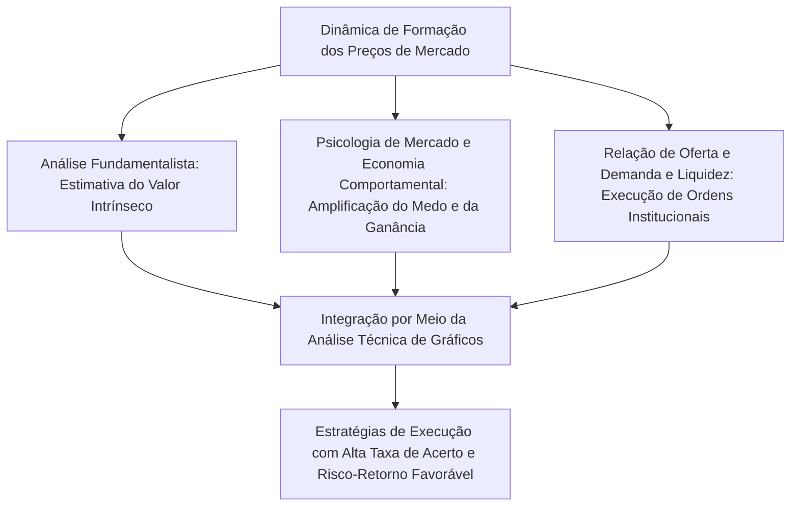
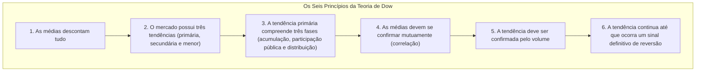
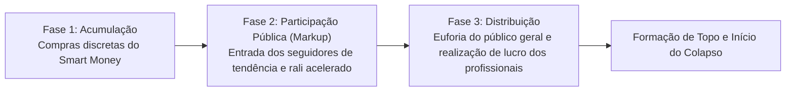
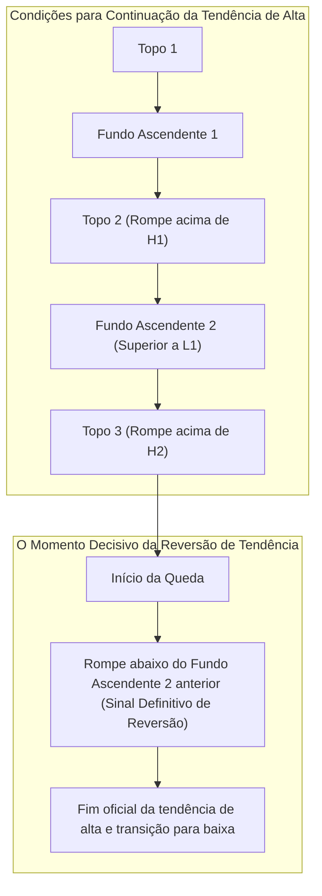
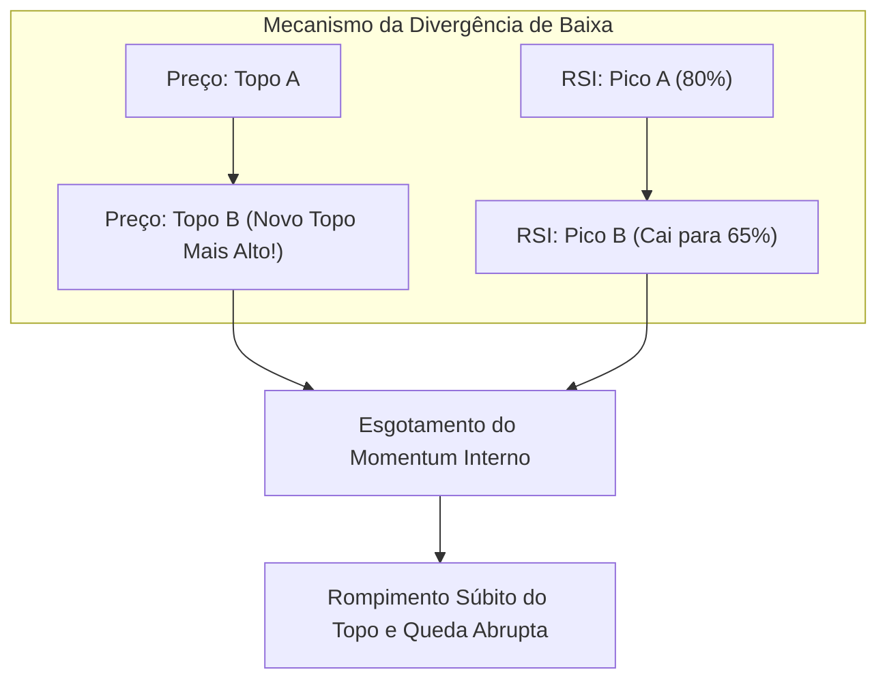
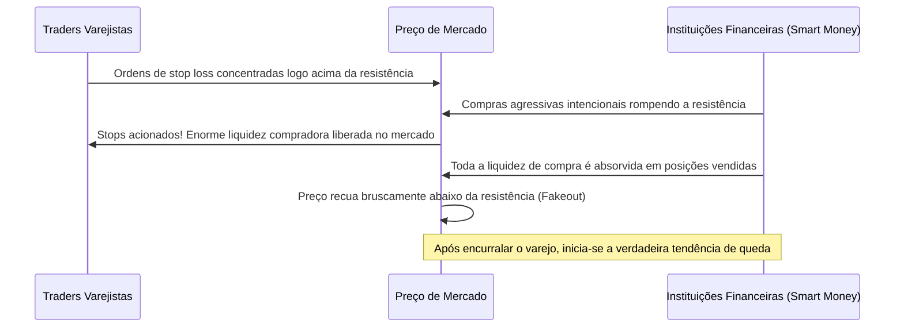
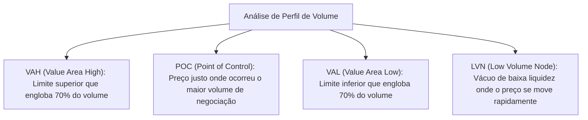

## 1. Introdução: Fundamentos Filosóficos da Análise Técnica e a Essência do Mercado

### 1.1 O Conflito e a Suprassunção (Aufheben) entre Análise Fundamentalista e Análise Técnica

Historicamente, as abordagens para desvendar os mecanismos de formação de preços nos mercados financeiros e prever suas oscilações futuras dividiram-se em duas grandes vertentes: a **Análise Fundamentalista (Fundamental Analysis)** e a **Análise Técnica (Technical Analysis)**.

A Análise Fundamentalista busca calcular o **"Valor Intrínseco (Intrinsic Value)"** de um ativo a partir de demonstrações financeiras corporativas, projeções de fluxo de caixa, taxas de juros, taxa de crescimento do PIB, inflação e riscos geopolíticos. Sua premissa é identificar distorções temporárias nas quais o preço de mercado se desvia desse valor teórico para orientar as decisões de investimento. Sob essa ótica, assume-se que, embora o preço possa ser irracional no curto prazo, ele inevitavelmente convergirá no longo prazo para os fundamentos da empresa e para os pontos de equilíbrio macroeconômico.

Em contrapartida, a Análise Técnica toma como objeto de estudo direto a evolução histórica e presente do **"Preço (Price)"**, do **"Volume"** e do **"Tempo (Time)"**. O analista técnico entende que o verdadeiro motor das cotações não são os fundamentos em si, mas a interpretação que os seres humanos fazem deles: sua **psicologia, medos, ganâncias, vieses cognitivos e, fundamentalmente, o fluxo financeiro de liquidez**.

No ambiente contemporâneo de trading profissional de alta performance, essas duas escolas não devem ser vistas como antagônicas, mas sim em uma relação dialética de **"suprassunção (Aufheben)"**. Os fundamentos ensinam **"o que negociar (seleção de ativos)"**, enquanto a análise técnica dita **"quando negociar e onde delimitar estritamente o risco (timing e gestão de risco)"**. Por mais sólida que seja a saúde contábil de uma companhia, em meio a uma tendência macroeconômica de baixa seus papéis podem sangrar por anos consecutivos; tornar visível e compreensível a mecânica dessa força vendedora é o verdadeiro triunfo da análise técnica.



---

### 1.2 "O Preço Desconta Tudo": Crítica à Hipótese dos Mercados Eficientes (HME) e a Economia Comportamental

O axioma primário da análise técnica reside na proposição de que **"o preço de mercado desconta e reflete instantaneamente todas as informações disponíveis — abrangendo dados públicos, informações privilegiadas, especulações, desastres naturais, tensões geopolíticas e o estado anímico e emocional de todos os participantes"**.

Segundo a versão fraca da **Hipótese dos Mercados Eficientes (Efficient Market Hypothesis: EMH)**, que dominou a teoria financeira acadêmica tradicional por décadas, "todas as informações históricas de preços e volumes já se encontram perfeitamente incorporadas nas cotações correntes, sendo impossível obter retornos excedentes consistentes (alfa) acima da média de mercado utilizando análise técnica".

No entanto, a ascensão da **Economia Comportamental (Behavioral Economics)** e das Finanças Comportamentais a partir dos anos 1980 comprovou empiricamente que o postulado de "participantes de mercado perfeitamente racionais" é uma ilusão teórica desprovida de respaldo prático:
- A **Teoria da Perspectiva (Prospect Theory)**, formulada por Daniel Kahneman e Amos Tversky, demonstrou que a mente humana possui uma assimetria cognitiva inerente: é profundamente **avessa ao risco diante de ganhos** (induzindo à realização precoce de lucros modestos) e **propensa ao risco diante de perdas** (induzindo à recusa em aceitar prejuízos e ao aumento de posições perdedoras).
- Distorções cognitivas sistemáticas, tais como o efeito de ancoragem, o comportamento de manada (Herding Behavior), o viés de confirmação e a autoconfiança excessiva (Overconfidence), geram com regularidade matemática ondas cíclicas de **"sobrecompra extrema (bolhas especulativas)"** e **"sobrevenda extrema (pânico generalizado)"**.

A análise técnica não é uma bola de cristal destinada a adivinhar o futuro em um oceano de ruídos aleatórios. Ela é, em sua essência, **"um método estatístico e empírico de decodificação de padrões geométricos repetitivos gerados nos gráficos pela atuação coletiva dos vieses cognitivos universais da espécie humana"**.

---

### 1.3 Teoria do Passeio Aleatório versus Hipótese da Estrutura Fractal (Mandelbrot)

Outra crítica acadêmica frequente decorre da **Teoria do Passeio Aleatório (Random Walk Theory)**, a qual sustenta que a distribuição de probabilidade das variações de preço segue uma curva normal (distribuição gaussiana) e que inexiste qualquer autocorrelação temporal entre trajetórias passadas e futuras de cotação.

Quem desmantelou essa tese clássica de forma definitiva foi Benoit Mandelbrot, o pai da geometria fractal. Ao esmiuçar séries históricas ultralongas de preços de commodities agrícolas (como o algodão) e taxas de câmbio ao longo de décadas, Mandelbrot provou matematicamente os seguintes pilares:

1. **Caudas Pesadas (Fat Tails)**: As variações de preço nos mercados financeiros não obedecem a uma distribuição gaussiana, mas sim a leis de potência (Power Law). Fenômenos extremos de volatilidade — os chamados "Cisnes Negros" — ocorrem com frequência milhares de vezes superior à prevista pela estatística convencional.
2. **Agrupamento de Volatilidade (Volatility Clustering)**: Períodos de alta volatilidade tendem a ser sucedidos por alta volatilidade, e períodos de calmaria tendem a ser seguidos por calmaria, revelando uma autocorrelação inequívoca na variância do mercado.
3. **Autossemelhança (Self-Similarity)**: Se removermos as legendas e escalas temporais de um gráfico de 1 minuto, de 1 dia e de 1 mês e os colocarmos lado a lado, mesmo traders veteranos serão incapazes de distinguir com precisão qual período cada um representa, tal a perfeita semelhança de seus padrões geométricos.

Essa **"natureza fractal dos mercados"** é o fundamento matemático rigoroso que valida a eficácia transversal da análise técnica através de qualquer horizonte temporal. Tendências de tempos gráficos menores encontram-se estruturadas de forma aninhada dentro de tendências de tempos gráficos maiores; quando esses múltiplos ciclos entram em ressonância simultânea, desencadeia-se um momento direcional de força colossal.

---

## 2. A Pedra Angular da Análise Moderna de Gráficos: Os 6 Princípios da Teoria de Dow e sua Reinterpretação Contemporânea

Todas as teorias consagradas da análise técnica moderna (as Ondas de Elliott, as Leis de Granville, o Price Action institucional contemporâneo) bebem da mesma fonte primordial: a **Teoria de Dow (Dow Theory)**, concebida por Charles H. Dow (1851–1902), cofundador do The Wall Street Journal. Embora Dow nunca tenha condensado suas ideias em um livro sistemático, registrando-as apenas em artigos editoriais, seu pensamento foi posteriormente sintetizado e estruturado em seis princípios universais por nomes como Samuel Nelson, William Hamilton e Robert Rhea.



---

### 2.1 Princípio 1: As Médias (Preço de Mercado) Descontam Tudo

As médias de mercado (como os índices acionários globais) refletem de maneira holística e fidedigna as condições conjunturais, os lucros corporativos, as políticas monetárias dos bancos centrais, catástrofes naturais, guerras e as reações emocionais agregadas de todos os participantes. Dado que qualquer dado macroeconômico ou notícia corporativa é precificado no exato instante em que atinge o mercado, operar aguardando a divulgação formal de notícias resulta em atraso operacional crônico. Observar diretamente o comportamento dinâmico dos preços na tela do gráfico constitui o meio mais ágil, completo e antecipatório de absorção de dados disponível a um operador.

---

### 2.2 Princípio 2: O Mercado Possui Três Tipos de Tendência

Comparando o movimento dos preços às marés oceânicas, Dow classificou as oscilações de mercado em três ordens de grandeza:

1. **Tendência Primária (Primary Trend: a Maré)**: Uma trajetória de grande porte que perdura de 1 ano a vários anos, responsável por ditar o rumo estrutural do mercado como um todo.
2. **Tendência Secundária (Secondary Trend: as Ondas)**: Fases corretivas que se desenvolvem na direção oposta à tendência primária. Tipicamente se estendem de 3 semanas a 3 meses, retratando entre um terço e dois terços (ou a metade exata) da amplitude alcançada pelo movimento primário anterior.
3. **Tendência Menor (Minor Trend: as Marolas)**: Oscilações de curto prazo inferiores a 3 semanas (de algumas horas a poucos dias). São moldadas por ruídos diários e impulsos especulativos efêmeros; por serem facilmente sujeitas a manipulações e armadilhas, analisá-las isoladamente é uma prática de alto risco.

No trading moderno, essa hierarquia constitui o alicerce da **"Análise Multi-Timeframe (MTF)"**: observar a maré no gráfico diário ou semanal, aguardar o recuo da onda no gráfico de 4 horas e refinar o gatilho de entrada na marola dos gráficos de 15 ou 5 minutos nada mais é do que a aplicação direta da sabedoria centenária de Dow.

---

### 2.3 Princípio 3: As Tendências Primárias Compreendem Três Fases

Uma tendência primária (notadamente de alta) atravessa três estágios bem demarcados, caracterizados pela transformação qualitativa na psicologia dos participantes:



- **Fase 1: Acumulação (Accumulation)**: Ocorre no fundo de recessões severas ou após quedas vertiginosas, quando o pessimismo e o desespero paralisam a maioria dos investidores. É nesse momento que operadores com visão apurada e investidores institucionais de peso (**Smart Money**) iniciam silenciosamente a absorção de ativos severamente depreciados. Os preços movem-se de forma lateral e a volatilidade atinge níveis de contração extrema.
- **Fase 2: Participação Pública (Public Participation / Markup)**: Os indicadores macroeconômicos e os balanços corporativos começam a confirmar a recuperação operacional. Traders que utilizam análise técnica e estratégias seguidoras de tendência ingressam maciçamente no mercado. O ativo engata uma marcha de valorização firme e consistente, configurando o trecho mais longo, previsível e rentável do ciclo de alta.
- **Fase 3: Distribuição (Distribution)**: As manchetes da grande imprensa cobrem diariamente a valorização astronômica do ativo, atraindo o público geral leigo e sem experiência prévia (**Dumb Money**), impulsionado pelo pavor de ficar de fora dos ganhos (FOMO). Enquanto o varejo compra com avidez irracional, os grandes agentes institucionais, que haviam acumulado discretamente na Fase 1, liquidam suas posições transferindo o risco para a multidão. O gráfico passa a estampar violentas oscilações e longas sombras superiores, sinalizando a exaustão da tendência e a formação de um topo iminente.

---

### 2.4 Princípio 4: As Médias Devem se Confirmar Mutuamente

À sua época, Charles Dow comparava sistematicamente o comportamento de duas médias fundamentais: a Média Industrial (Dow Jones Industrial Average) e a Média Ferroviária (Dow Jones Transportation Average). Ele raciocinava que, mesmo que as indústrias estivessem operando em capacidade plena, a expansão econômica real só se concretizaria se os produtos manufaturados estivessem sendo efetivamente transportados via malha ferroviária aos centros de consumo. Assim, uma nova máxima histórica estabelecida pelo índice industrial não configurava um mercado altista legítimo a menos que fosse simultaneamente chancelada por uma nova máxima no índice de transportes.

Nos mercados modernos, esse princípio desdobrou-se nas metodologias de **"Análise Intermercados (Intermarket Analysis)"** e **"Confirmação de Estrutura Interna de Mercado"**:
- As renovações de máximas no S&P 500 estão sendo acompanhadas com o mesmo vigor pelo índice de tecnologia NASDAQ e pelo índice de empresas menores (Russell 2000)?
- No mercado de câmbio, uma valorização do USD/JPY é plenamente coerente com o comportamento dos rendimentos dos títulos do Tesouro dos EUA (Treasury Yields) e com a força global da moeda norte-americana medida pelo Dollar Index (DXY)?
- No universo dos criptoativos, a disparada solitária do Bitcoin encontra eco na valorização do Ethereum e do mercado de altcoins em geral?

Surtos de alta isolados e destituídos de confirmação entre mercados correlatos possuem elevadíssima probabilidade de constituírem armadilhas de compra (**Bull Traps**) orquestradas por participantes institucionais.

---

### 2.5 Princípio 5: A Tendência Deve Ser Confirmada pelo Volume

O preço reflete a **direção** do deslocamento de mercado, ao passo que o volume revela a **autenticidade e a magnitude da energia** que sustenta esse movimento:

- **Tendência de Alta Saudável**: O volume financeiro se expande nos movimentos de avanço do preço e se contrai visivelmente durante as correções de baixa.
- **Tendência de Baixa Saudável**: O volume financeiro aumenta consideravelmente nos impulsos de queda e míngua nas fases de repique técnico autônomo.

Caso o preço venha a registrar uma nova máxima histórica sob um volume decrescente, o mercado emite um alerta severo de esgotamento (**Divergência de Volume**), indicando que os compradores reais estão escassos e que as cotações sobem apenas por inércia ou falta transitória de vendedores. Richard Wyckoff refinou esse preceito de Dow a um patamar científico, desenvolvendo a metodologia **VSA (Volume Spread Analysis)** para decifrar as pegadas das grandes baleias institucionais através da relação entre o spread dos preços e o volume negociado.

---

### 2.6 Princípio 6: A Tendência Continua até que Ocorra um Sinal Definitivo de Reversão

No cotidiano operacional de um trader de gráficos, o sexto princípio de Dow é a regra mais elementar e indispensável de ser respeitada.

A definição matemática e estrutural de uma tendência é de uma simplicidade absoluta:
- **Definição de Tendência de Alta**: **"Uma sequência ininterrupta em que cada Topo (High) supera o anterior e cada Fundo (Low) é mais alto que o fundo anterior."**
- **Definição de Tendência de Baixa**: **"Uma sequência ininterrupta em que cada Topo é mais baixo que o anterior e cada Fundo também é mais baixo que o fundo anterior."**



Por mais esticado que um rali pareça e por mais tentador que seja supor que "está caro demais para comprar", enquanto o último fundo de referência (**Higher Low / Fundo Ascendente**) não for rompido para baixo no fechamento, a tendência de alta permanece perfeitamente intacta. Tentar adivinhar topos e operar contra a tendência com base em palpites e impressões subjetivas constitui a atitude mais letal e autodestrutiva que um operador pode cometer.

---

## 3. A Teoria das Ondas de Elliott e o Mistério da Matemática de Fibonacci

### 3.1 A Teoria da Ordem Cósmica de Ralph Nelson Elliott

Enquanto a Teoria de Dow forneceu a bússola para identificar a direção e as reversões de tendência, coube a Ralph Nelson Elliott (1871–1948) decodificar o ritmo intrínseco e a fascinante natureza fractal dos movimentos de preço. Acamado por uma enfermidade debilitante, Elliott dedicou anos a analisar manualmente com rigor meticuloso gráficos mensais, semanais, diários e até intraday de 30 minutos cobrindo 75 anos de história do índice Dow Jones, vindo a publicar em 1938 a sua monumental obra *The Wave Principle* (O Princípio da Onda).

Elliott postulou que o comportamento social humano e as flutuações psicológicas das massas se desenvolvem em estrita conformidade com a Sequência de Fibonacci e com a Proporção Áurea, os mesmos padrões matemáticos que regem o crescimento orgânico na natureza — desde o espiral dos moluscos e a filotaxia das plantas até as nebulosas galácticas. O mercado não é um caos desordenado; é um cosmos fractal que repete perpetuamente um **ciclo fundamental de 8 ondas, composto por "5 Ondas de Impulso (Impulse Waves)" e "3 Ondas Corretivas (Corrective Waves)"**.

```mermaid
flowchart LR
    subgraph Ondas de Impulso (Direção da Tendência: Estrutura de 5 Ondas)
        W1["Onda 1<br/>(Movimento Inicial)"] --> W2["Onda 2<br/>(Correção Profunda)"]
        W2 --> W3["Onda 3<br/>(Explosão Mais Forte)"]
        W3 --> W4["Onda 4<br/>(Correção Complexa)"]
        W4 --> W5["Onda 5<br/>(Euforia Final)"]
    end
    subgraph Ondas Corretivas (Contratendência: Estrutura de 3 Ondas)
        W5 --> WA["Onda A<br/>(Início da Queda)"]
        WA --> WB["Onda B<br/>(Repique Ilusório)"]
        WB --> WC["Onda C<br/>(Queda Devastadora)"]
    end
```

---

### 3.2 Estrutura das Ondas de Impulso e as Três Regras Absolutas

Dentre as ondas motrizes que progridem a favor da tendência maior, o modelo padrão de onda de impulso é governado por **"Três Regras Cardeais Imutáveis"**. Caso qualquer uma dessas regras seja violada, a contagem de ondas estará categoricamente incorreta, exigindo descarte imediato e reavaliação do cenário:

1. **Regra 1: A Onda 2 jamais pode corrigir mais de 100% da Onda 1.** (Se o preço violar a origem da Onda 1, o movimento não configura uma nova tendência, mas sim a continuação da tendência prévia).
2. **Regra 2: Entre as Ondas 1, 3 e 5, a Onda 3 jamais pode ser a onda mais curta.** (Na imensa maioria dos casos, a Onda 3 é a onda estendida mais longa e potente de todo o ciclo).
3. **Regra 3: A Onda 4 jamais pode invadir o território de preço do topo da Onda 1.** (No instante em que a mínima da Onda 4 cruza a máxima da Onda 1, a estrutura de impulso convencional é desqualificada, abrindo espaço para formações diagonais ou anomalias estruturais).

#### Características Psicológicas de Cada Onda
- **Onda 1**: Nasce em meio à desconfiança generalizada. As notícias fundamentais ainda são francamente desfavoráveis, e a imensa maioria dos investidores enxerga o movimento apenas como um repique passageiro dentro da tendência de baixa que se esgota; seu ímpeto inicial costuma ser tímido.
- **Onda 2**: Uma retração violenta e impiedosa. Diante da queda rápida, a maioria é tomada pelo pânico acreditando que o mercado voltará às mínimas, o que provoca retrações profundas de 50%, 61,8% ou até 78,6% do tamanho da Onda 1. Contudo, o suporte da origem da Onda 1 é rigidamente preservado.
- **Onda 3**: Os indicadores técnicos alinham-se em uníssono, o rompimento de níveis críticos atrai uma torrente de ordens institucionais e o volume negocial explode. O movimento avança em linha reta, muitas vezes deixando gaps em aberto no caminho. É a onda mais lucrativa, rápida e expressiva, na qual os operadores profissionais devem aplicar suas maiores posições.
- **Onda 4**: Fase de consolidação e digestão dos lucros expressivos da Onda 3. Compradores atrasados tentam entrar enquanto os primeiros vencedores realizam posições, gerando correções demoradas e padrões complexos (como triângulos). Observa-se aqui a **Lei da Alternância**: se a Onda 2 foi simples, aguda e profunda, a Onda 4 tenderá a ser lateral, arrastada e intrincada.
- **Onda 5**: O clímax do ciclo. O noticiário macroeconômico exibe seu melhor momento, e o grande público leigo compra com euforia desmedida. No entanto, os indicadores de momentum (como RSI e MACD) passam a imprimir claras divergências de baixa em relação à Onda 3, revelando a exaustão iminente da força compradora subjacente.

---

### 3.3 Taxonomia das Ondas Corretivas (Ondas de Correção)

As fases de retração que sucedem um impulso exibem uma riqueza de variações muito superior às ondas motrizes. Elliott agrupou as correções em três estruturas fundamentais:

1. **Zigue-Zague (Zigzag: Estrutura 5-3-5)**: Uma correção aguda e veloz. Composta por Onda A (5 ondas de queda) $\rightarrow$ Onda B (repique em 3 ondas, retratando entre 38,2% e 50% da Onda A) $\rightarrow$ Onda C (queda violenta em 5 ondas com magnitude comparável à da Onda A).
2. **Plana (Flat: Estrutura 3-3-5)**: Um padrão de consolidação lateral. Composta por Onda A (3 ondas) $\rightarrow$ Onda B (3 ondas que retornam quase à origem da Onda A) $\rightarrow$ Onda C (5 ondas que rompem sutilmente a mínima da Onda A). Em mercados fortemente altistas, é comum o surgimento do **Plano Expandido (Expanded Flat)**, no qual a Onda B ultrapassa o topo da Onda A antes de a Onda C mergulhar de forma agressiva.
3. **Triângulo (Triangle: Estrutura 3-3-3-3-3)**: Padrão no qual as forças compradoras e vendedoras entram em equilíbrio temporário com compressão gradativa da volatilidade ao longo de 5 sub-ondas (A-B-C-D-E). Manifesta-se invariavelmente na penúltima fase de um padrão maior (como a Onda 4 ou a Onda B), precedendo o impulso terminal decisivo (Onda 5).

---

### 3.4 Razões de Fibonacci e Métodos de Cálculo de Projeção de Alvos

A monumental precisão das Ondas de Elliott decorre de sua simbiose matemática com a Sequência de Fibonacci ($0, 1, 1, 2, 3, 5, 8, 13, 21, 34, 55, 89, 144\dots$), cujas relações intrínsecas fornecem níveis geométricos para dimensionamento de retrações e alvos com notável exatidão:

Razões essenciais de Fibonacci:
- $\phi = \frac{\sqrt{5}-1}{2} \approx 0.618$
- $1 - \phi \approx 0.382$
- $\sqrt{0.618} \approx 0.786$
- $1.618$ (Proporção Áurea e fator clássico de expansão)
- $2.618, 4.236$

#### Fórmulas Práticas de Projeção de Alvos
1. **Retração da Onda 2**: Tipicamente atinge **$61.8\%$** ou **$50.0\%$**, e no limite **$78.6\%$**, da extensão vertical da Onda 1.
2. **Projeção de Alvo da Onda 3**: Sendo $W_1$ a amplitude vertical da Onda 1 e $L_2$ o ponto final da Onda 2:
   $$\text{Alvo}(W_3) = L_2 + 1.618 \times W_1$$
   Em tendências de excepcional vigor (Super Extended):
   $$\text{Alvo}(W_3) = L_2 + 2.618 \times W_1$$
3. **Retração da Onda 4**: Costuma retrair **$38.2\%$** do deslocamento da Onda 3 (retração rasa), comumente coincidindo com o fundo da sub-onda 4 interna da Onda 3.
4. **Projeção de Alvo da Onda 5**: Projeta-se um acréscimo equivalente a **$61.8\%$** da amplitude combinada total das Ondas 1 a 3 a partir da mínima da Onda 4.

---

## 4. A Sabedoria Oriental: Morfologia dos Candlesticks e os Cinco Métodos de Sakata

Enquanto o Ocidente dava seus primeiros passos com gráficos de linhas simples e gráficos de barras, no Japão do século XVIII, em pleno período Edo, desenvolvia-se na Bolsa de Arroz de Dojima, em Osaka, o primeiro mercado formal de futuros e de análise gráfica do planeta. A grande lenda desse ecossistema foi Munehisa Homma (1724–1803), mestre de trading cujos ensinamentos registrados no tratado clássico *San'en Kinsen Hiroku* deram origem aos lendários **"Cinco Métodos de Sakata (Sakata Gaho)"**.

---

### 4.1 A Dinâmica Interna dos Candlesticks (Velas Japonesas)

Uma vela individual cristaliza o embate ocorrido em determinado intervalo através de quatro preços capitais: **Abertura (Open), Máxima (High), Mínima (Low) e Fechamento (Close)**, compostos visualmente pelo "Corpo Real (Real Body)" e pelas "Sombras Superior e Inferior (Shadows / Wicks)".

Quando Steve Nison revelou essa arte ao Ocidente no final dos anos 1980 com sua obra seminal *Japanese Candlestick Charting Techniques*, os operadores de Wall Street ficaram boquiabertos diante da densidade de leitura psicológica imediata proporcionada pelas velas, alçando os candlesticks a padrão absoluto global.

| Padrão de Candlestick | Características Visuais | Psicologia e Dinâmica Subjacente |
| :--- | :--- | :--- |
| **Grande Vela / Marubozu** | Corpo extremamente longo com sombras quase inexistentes em ambas as pontas. | Demonstração inequívoca de controle absoluto e unilateral por parte dos compradores (ou vendedores) da abertura ao fechamento. Sinal de altíssima convicção. |
| **Martelo / Pinbar (Hammer / Karakasa)** | Corpo diminuto concentrado no topo, exibindo uma longa sombra inferior de tamanho pelo menos duas vezes superior ao corpo. | Os vendedores chegaram a pressionar as cotações de forma violenta, mas encontraram uma muralha de ordens de compra na mínima que absorveu toda a oferta e repeliu o preço de volta para a abertura. **Poderosíssimo gatilho de reversão em fundos**. |
| **Estrela Cadente / Lápide (Shooting Star / Touba)** | Corpo diminuto concentrado na base, exibindo uma longa sombra superior de tamanho pelo menos duas vezes superior ao corpo. | Os compradores forçaram um rali rumo a novas máximas, mas foram violentamente rechaçados por massivas ordens institucionais de venda no topo, provocando o colapso intraday do movimento. **Gatilho definitivo de reversão em topos**. |
| **Doji** | Abertura e fechamento em patamares idênticos ou quase idênticos, corpo reduzido a uma linha e formato de cruz. | Momento de paridade e equilíbrio perfeito entre forças compradoras e vendedoras. Representa a desaceleração de um movimento e antecede rompimentos ou reversões severas. |

---

### 4.2 A Essência dos Cinco Métodos de Sakata

Os Cinco Métodos de Sakata sintetizam os cinco arquétipos de agrupamentos de velas capazes de identificar momentos cruciais de inflexão da energia do mercado:

1. **Três Montanhas (San-zan)**: Configuração em que o preço ataca a região de máximas por três vezes consecutivas sem conseguir superá-la. Quando o topo central é mais proeminente que os adjacentes, recebe a denominação de "Três Budas" (San-zon), exatamente equivalente ao clássico padrão ocidental de **Ombro-Cabeça-Ombro (Head and Shoulders Top)**; a perda da linha de pescoço (neckline) dispara um colapso vendedor avassalador.
2. **Três Rios (San-sen)**: Estrutura em que o preço testa a região de mínimas por três vezes, formando uma base tripla ou Ombro-Cabeça-Ombro Invertido. Também se expressa na formação de fundo conhecida como **Estrela da Manhã (Morning Star)**, em que uma longa vela de baixa, uma vela de corpo diminuto (estrela/doji) e uma forte vela de alta confirmam a reversão.
3. **Três Janelas / Três Gaps (San-ku)**: Ocorrência de três saltos de preço consecutivos (gaps) na direção da tendência. O adágio samurai prescreve: *"Diante de três janelas de alta, venda; diante de três janelas de baixa, compre"*. Uma sequência de múltiplos gaps denota histeria emocional desmedida dos participantes e assinala o esgotamento terminal do combustível do movimento.
4. **Três Soldados (San-pei)**: A formação dos **Três Soldados Brancos (Akasanpei)** — três velas de alta consecutivas abrindo dentro do corpo da anterior e fechando nas máximas — atesta o nascimento vigoroso de uma tendência de alta partindo de zonas de suporte. Contudo, se a terceira vela ostentar uma longa sombra superior (*Akasanpei Sakizumari*), o operador deve se precaver contra a perda precoce de fôlego. Inversamente, três velas longas de baixa a partir de um topo configuram os temidos **Três Corvos Negros (Kurosanpei)**.
5. **Três Métodos (San-po)**: A cristalização operacional da máxima oriental *"Saber descansar também é operar"*. O padrão de **Três Métodos de Alta (Rising Three Methods)** surge quando, após uma longa vela de alta, sucedem-se três velas curtas de baixa contidas integralmente no intervalo da primeira vela, até que uma quinta vela expressiva de alta rompe a máxima original e retoma a marcha compradora. Representa o padrão clássico de consolidação e continuação de tendência.

---

## 5. Estrutura Matemática dos Indicadores Técnicos e Armadilhas Práticas

Os indicadores técnicos consistem na aplicação de algoritmos matemáticos sobre as séries históricas de preços e volumes, subdividindo-se primordialmente entre ferramentas de **Tendência (Rastreadores)** e ferramentas **Osciladoras (Momentum e Reversão à Média)**. A grande maioria dos operadores amadores fracassa por operar mecanicamente sinais visuais sem compreender a mecânica algébrica subjacente a cada fórmula. A seguir, dissecamos as entranhas matemáticas dos principais indicadores.

### 5.1 Matemática dos Indicadores de Tendência

#### ① Médias Móveis (SMA vs EMA)
A formulação da clássica Média Móvel Simples (SMA: Simple Moving Average) calculada para um período de $n$ observações expressa-se como:
$$SMA_t = \frac{1}{n} \sum_{i=0}^{n-1} P_{t-i}$$
A vulnerabilidade intrínseca da SMA decorre de conceder exatamente o mesmo peso estatístico ($1/n$) tanto à cotação mais recente quanto a um preço ocorrido há $n$ períodos, o que introduz um atraso estrutural severo (lag) na emissão de seus sinais operacionais.

Para mitigar esse atraso, desenvolveu-se a Média Móvel Exponencial (EMA: Exponential Moving Average), que atribui peso preponderante ao preço corrente $P_t$, conferindo decaimento exponencial aos preços mais remotos. Sendo $\alpha = \frac{2}{n+1}$ o fator de ponderação ou coeficiente de suavização, temos:
$$EMA_t = \alpha P_t + (1 - \alpha) EMA_{t-1}$$
Por reagir com excepcional prontidão a choques súbitos de preço, a EMA (notadamente nos períodos 20, 50 e 200) tornou-se a escolha hegemônica em estratégias de day trade e em algoritmos de negociação institucional.

#### ② Bandas de Bollinger (Bollinger Bands)
Criadas por John Bollinger na década de 1980, as Bandas de Bollinger projetam envelopes dinâmicos de dispersão baseados no desvio padrão ($\sigma$) ao redor de uma média móvel central:
$$Middle = SMA_n(P)$$
$$\sigma = \sqrt{\frac{1}{n} \sum_{i=0}^{n-1} (P_{t-i} - Middle)^2}$$
$$Upper = Middle + k \cdot \sigma, \quad Lower = Middle - k \cdot \sigma \quad (\text{comumente adotado } k=2)$$

Sob as premissas de uma curva normal perfeita, a probabilidade teórica de as cotações oscilarem contidas dentro do intervalo delimitado por $\pm 2\sigma$ é de **$95.44\%$**.

É justamente aqui que repousa a armadilha catastrófica que arruína milhares de contas: **os preços nos mercados financeiros não seguem uma distribuição normal gaussiana (possuem caudas pesadas / Fat Tails)**.

Presumir que o toque na banda superior ($+2\sigma$) representa uma situação estática de sobrecompra e tentar vender a descoberto de forma cega é um equívoco primário. Quando irrompe uma tendência de força descomunal, o preço alarga as bandas e avança colado do lado de fora de $+2\sigma$ ao longo de dias ou semanas ininterruptas (fenômeno conhecido como **Band Walk** ou "caminhada sobre as bandas"). O propósito genuíno das Bandas de Bollinger consiste em flagrar o estado de **"Squeeze (Estrangulamento / Contração Extrema de Volatilidade)"** e surfar a favor do rompimento na fase subsequente de **"Expansão Explosiva (Expansion)"**.

---

### 5.2 Matemática dos Indicadores Osciladores

#### ① RSI (Relative Strength Index: Índice de Força Relativa)
Concebido por J. Welles Wilder Jr., o RSI quantifica a intensidade da força compradora em relação à vendedora em um intervalo delimitado (padronizado em 14 períodos), normalizando os dados em uma escala que varia de $0$ a $100\%$:
$$RS = \frac{\text{Ganho Médio nos últimos } n \text{ períodos}}{\text{Perda Média nos últimos } n \text{ períodos}}$$
$$RSI = 100 - \frac{100}{1 + RS} = \frac{\text{Ganho Médio}}{\text{Ganho Médio} + \text{Perda Média}} \times 100$$

A literatura introdutória costuma ditar que "leituras acima de 70% indicam sobrecompra e abaixo de 30% sobrevenda". Todavia, em ralis parabólicos sustentados, o RSI pode congelar acima de 80% enquanto o preço do ativo dobra de valor.

A aplicação de maior confiabilidade estatística do RSI repousa na identificação de **Divergências (Divergences)**:
- **Divergência de Baixa (Bearish Divergence)**: Configura-se quando o preço estampa uma nova máxima mais alta que a anterior no gráfico, mas o RSI não consegue acompanhar e registra um topo mais baixo que o pico precedente. Esse descompasso comprova que a energia interna que impulsionava a valorização esvaiu-se, advertindo para uma reversão ou correção profunda iminente.



---

## 6. Teoria Moderna de Price Action e Smart Money Concepts (SMC)

A partir da década de 2010, com a negociação de alta frequência (HFT) e os algoritmos de inteligência artificial passando a responder por mais de 80% do volume total transacionado nas bolsas globais, a eficácia preditiva de indicadores defasados clássicos (como MACD ou Estocástico) decaiu acentuadamente. Em resposta, consolidou-se entre a elite dos traders profissionais a adoção do **Price Action puro** e dos **Smart Money Concepts (SMC)**, focados na interpretação do fluxo de ordens e da liquidez no gráfico nu.

### 6.1 Caça à Liquidez e Varredura de Liquidez (Liquidity Sweep)

O pilar primordial do SMC sustenta que **"o mercado é desenhado para se deslocar implacavelmente em direção aos níveis de preço onde se concentra a maior densidade de ordens de stop loss (poças de liquidez)"**.

Traders do varejo (Retail) leem a mesma cartilha convencional e posicionam suas paradas de proteção exatamente nos mesmos locais previsíveis: *imediatamente acima de topos duplos óbvios* ou *imediatamente abaixo de fundos de consolidação bem definidos*. Contudo, os grandes fundos e formadores de mercado institucionais (**Smart Money**), que precisam girar centenas de milhões ou bilhões de dólares, enfrentam o problema crônico de falta de contraparte; eles só conseguem montar ou liquidar suas posições mastodônticas sem causar impacto destrutivo no preço executando suas ordens contra essas massas de ordens de stop do varejo.

1. **Varredura de Liquidez (Liquidity Sweep)**: O capital institucional força o preço a romper de forma efêmera uma resistência ou suporte evidente.
2. Com isso, os stops das posições de varejo (ordens de compra no rompimento de topo ou ordens de venda na perda de fundo) são engatilhados em massa, inundando o livro de ofertas com liquidez abundante.
3. As instituições financeiras absorvem integralmente essa enxurrada de ordens na ponta oposta, adquirindo sua posição e puxando o preço imediatamente de volta para dentro do canal ou consolidação (**Fakeout / Falso Rompimento**).
4. O gráfico imprime uma vela com uma longa sombra penetrante (**Pinbar / Pavio**), deixando os traders de varejo estopados para trás enquanto o preço dispara em rali frenético na direção diametralmente contrária.



---

### 6.2 Fair Value Gap (FVG: Desequilíbrio) e Bloco de Ordens (Order Block)

Na metodologia SMC, a precisão cirúrgica de entrada fundamenta-se nos conceitos de **FVG** e **Blocos de Ordens**:

- **Fair Value Gap (FVG: Desequilíbrio / Imbalance)**: Quando grandes participantes injetam ordens colossais de forma instantânea, surge uma anomalia em uma formação de três velas consecutivas: forma-se um "vazio" (uma lacuna aberta entre a máxima da primeira vela e a mínima da terceira vela) onde nenhuma transação bidirecional pôde ocorrer. Como os algoritmos de balanceamento de liquidez buscam sanar essa ineficiência, os preços tendem com alta probabilidade a revisitar essa faixa para fechar o gap. Aguardar essa retração ao FVG permite posicionar ordens com stop extremamente compacto e excelente relação risco-retorno.
- **Bloco de Ordens (Order Block: OB)**: Trata-se da última vela de direção oposta impressa exatamente antes do arranque que desencadeou o rompimento impulsivo institucional (a última vela de baixa antes de uma explosão de alta, ou a última vela de alta antes de uma derrocada). Essa zona de preço representa o local onde as posições institucionais foram originadas e funcionará no futuro como uma barreira implacável de suporte ou resistência quando o mercado revisitar o patamar.

---

## 7. O Domínio Supremo que Define a Vitória ou Derrota: Risco-Retorno e a Matemática da Gestão de Capital

Por mais exímio que seja o domínio técnico de um trader sobre os gráficos, se ele desprezar as leis matemáticas da **Gestão de Capital (Money Management)**, sua probabilidade estatística de falência terminal ao longo do tempo será de exatamente 100%. Operar nos mercados não é um jogo de vidência ou previsão do futuro; é um **negócio probabilístico baseado na repetição disciplinada de ensaios com expectativa matemática positiva ($+EV$), blindado por uma alocação de risco com probabilidade zero de ruína**.

### 7.1 Prova Matemática da Probabilidade de Ruína de Balsara (Risk of Ruin)

O matemático francês Nauzer Balsara elaborou um modelo quantitativo que calcula a probabilidade matemática exata de um operador quebrar a sua conta com base em três variáveis: a **Taxa de Acerto (Win Rate)**, o **Payoff Ratio (Relação Risco-Retorno média das operações)** e a **Fração de Risco por Operação (percentual de capital arriscado em cada trade)**.

- **Taxa de Acerto ($W$)**: Número de trades vencedores $\div$ Total de trades executados
- **Payoff Ratio ($R$)**: Lucro médio em operações vencedoras $\div$ Prejuízo médio em operações perdedoras

A tabela abaixo exibe a Probabilidade de Ruína de Balsara (valores aproximados) para um cenário em que o operador arrisca uma fração agressiva de **$20\%$** do seu patrimônio por operação:

| Taxa de Acerto \ Payoff ($R$) | 0.5 (Perda > Lucro) | 1.0 (Lucro = Perda) | 1.5 (Lucro > Perda) | 2.0 (Lucro Ideal) | 3.0 (Super Risco-Retorno) |
| :---: | :---: | :---: | :---: | :---: | :---: |
| **30%** | 100% | 100% | 100% | 80.0% | 14.3% |
| **40%** | 100% | 100% | 38.2% | 14.1% | 1.2% |
| **50%** | 100% | 50.0% | 5.6% | 0.8% | **0.0%** |
| **60%** | 100% | 2.1% | 0.1% | **0.0%** | **0.0%** |
| **70%** | 14.3% | **0.0%** | **0.0%** | **0.0%** | **0.0%** |

Essa matriz escancara uma realidade brutal que aniquila o senso comum: **"mesmo ostentando uma taxa de acerto respeitável de 60%, se o Payoff Ratio do operador for de 0.5 (onde ele arrisca R$ 2 de perda para buscar R$ 1 de ganho), a probabilidade matemática de quebra total da sua conta é de 100%"**. A razão pela qual hordas de iniciantes são seduzidas por cursos prometendo 90% de acerto e terminam perdendo tudo de forma fulminante em um único dia de fúria reside precisamente nesse imperativo estatístico.

Em contrapartida, **mesmo com uma taxa de acerto modesta de apenas 40%, se o trader mantiver um Payoff Ratio de 2.0 (onde os ganhos médios dobram as perdas médias), a probabilidade de ruína despenca para 14.1%; operando com um Payoff de 3.0, a chance de quebra é de míseros 1.2%, assegurando a acumulação exponencial e inevitável de patrimônio no longo prazo**.

---

### 7.2 Regra dos 2% e Fórmula Quantitativa de Dimensionamento de Posição

A diretriz intransigente dos gestores de fundos profissionais dita: **"o risco financeiro máximo tolerado em uma única operação jamais deve exceder $1\% \text{ a } 2\%$ do capital líquido total da conta"** (a célebre Regra dos 2%).

O erro mais comum dos principiantes consiste em fixar um lote arbitrário para todas as ordens (como "operar sempre 1 contrato ou 1 lote"). Essa abordagem é matematicamente errônea, pois a distância do stop loss ditada pela análise técnica e pela volatilidade do ativo oscila a cada nova oportunidade no gráfico.

A fórmula correta para dimensionamento do lote (Position Sizing) deduz-se da seguinte equação:

$$Position\_Size = \frac{Account\_Balance \times Risk\_Percentage}{Entry\_Price - Stop\_Loss\_Price}$$

#### Exemplo Prático
- Saldo líquido da conta: $10.000.000$ JPY (ou equivalente monetário)
- Risco financeiro aceito: $2\%$ (Perda máxima admissível $= 200.000$ JPY)
- Preço de entrada: $150.00$ (ex: USD/JPY)
- Stop loss técnico ancorado no gráfico: $149.20$ (Distância do stop $= 0.80 = 80$ pips)

O tamanho da posição a ser executada no mercado deve ser:
$$Position\_Size = \frac{200.000}{0.80} = 250.000 \text{ unidades monetárias (2,5 lotes padrão)}$$

Se em uma oportunidade posterior o stop loss técnico for estreito, de apenas $0.40$ (40 pips), o operador pode alavancar a posição para $5.0$ lotes com idêntica segurança de risco. Por outro lado, caso o stop técnico exija uma margem ampla de $1.60$ (160 pips), a posição deverá ser obrigatoriamente reduzida para $1.25$ lotes. **"Ajustar dinamicamente o tamanho do lote em função da distância do stop para manter a perda financeira estritamente constante"** — este é o único escudo matemático infalível capaz de garantir a sobrevivência de um operador frente a qualquer sequência adversa de perdas consecutivas.

---

### 7.3 Teoria da Perspectiva e Superação dos Vieses Psicológicos

Por que a imensa maioria dos seres humanos é incapaz de cumprir regras de gestão de capital tão transparentes e lógicas? A raiz dessa incapacidade repousa na programação evolutiva do cérebro humano.

Ao longo de centenas de milhares de anos em que a humanidade sobreviveu como caçadores-coletores nas savanas, uma presa ou fruto encontrado precisava ser consumido imediatamente, sob pena de apodrecer ou ser surrupiado por predadores rivais. Diante de situações de perigo com risco de morte, resistir com obstinação e fugir da perda imediata aumentava as chances de sobrevivência.

Nos mercados financeiros contemporâneos, regidos estritamente pelas leis da probabilidade, esses mesmos impulsos biológicos primordiais tornam-se um veneno letal:
1. **Aversão ao Risco diante de Lucros (Encerramento Precoce de Trades Vencedores)**: Ao observar uma operação positiva, a mente é tomada pela angústia avassaladora de "não perder o que já foi conquistado", levando o trader a realizar o lucro após míseros pips e abortando ralis grandiosos.
2. **Propensão ao Risco diante de Perdas (Procrastinação do Stop Loss)**: Quando a operação entra em terreno negativo, a recusa psicológica visceral em admitir a dor da perda financeira faz com que o operador afaste o stop loss para mais longe, apele para o "preço médio contra a tendência (martingale)" e passe a orar por um milagre.

O Santo Graal almejado no trading não reside em fórmulas secretas ou na combinação mirabolante de indicadores. O verdadeiro Santo Graal consiste em **"tomar plena consciência dos vícios biológicos gravados em nosso DNA (a maldição da Teoria da Perspectiva) e forjar a disciplina estoica de executar com frieza mecânica as regras de probabilidade, expectativa e gestão de capital"**.

---

### 7.4 Matemática do Critério de Kelly (Kelly Criterion) e Aplicação Prática do Half-Kelly

No campo da gestão quantitativa de ativos, o ápice da modelagem matemática ao lado da Probabilidade de Ruína de Balsara é o **Critério de Kelly (Kelly Criterion)**, formulado em 1956 pelo físico dos Laboratórios Bell, John Larry Kelly Jr., a partir dos fundamentos da Teoria da Informação de Claude Shannon.

O Critério de Kelly calcula a fração ótima de capital $f^*$ a ser alocada por evento para maximizar a taxa geométrica de crescimento composta do patrimônio no longo prazo:

$$f^* = \frac{b \cdot p - q}{b} = p - \frac{q}{b}$$

Onde:
- $p$: Taxa de acerto (probabilidade empírica $0 \le p \le 1$)
- $q = 1 - p$: Taxa de perda (probabilidade de insucesso)
- $b$: Payoff Ratio (relação entre lucro médio por vitória e perda média por derrota)

#### Exemplo Numérico do Critério de Kelly e a Armadilha da Ruína
Consideremos um sistema de trading de alta performance com taxa de acerto $p = 0.55$ (55%) e Payoff Ratio $b = 1.5$ (relação risco-retorno de 1:1.5):
$$f^* = \frac{1.5 \times 0.55 - 0.45}{1.5} = \frac{0.825 - 0.45}{1.5} = \frac{0.375}{1.5} = 0.25 \quad (25\%)$$

Pela matemática teórica pura, alocar **$25\%$** de todo o patrimônio a cada trade produziria a curva de crescimento exponencial mais acelerada possível.
Contudo, adotar o **Full Kelly (Kelly Integral)** no mundo real dos mercados é equivalente ao **"suicídio financeiro"**. A fórmula assume a hipótese irreal de que a probabilidade e as odds populacionais da estratégia permanecem constantes ao infinito.

Caso as condições de mercado mudem temporariamente ou ocorra uma sequência de 7 perdas consecutivas (fato corriqueiro na estatística de trading), uma alocação de 25% afundará o operador em um rebaixamento de capital (**Drawdown**) superior a **$80\%$**, deflagrando o colapso emocional e a ruína prática do trader.

#### A Superioridade Absoluta do Half-Kelly (Meio Kelly)
Por essas razões, a elite quantitativa e os fundos hedge profissionais operam exclusivamente com frações reduzidas, adotando o **"Half-Kelly (Meio Kelly)"** ou o **"Quarter-Kelly (Quarto de Kelly)"**:
- Aplicar o Half-Kelly ($f^* / 2$) preserva aproximadamente **$75\%$** da taxa de crescimento teórico máximo proporcionada pela fórmula, enquanto **reduz a volatilidade da curva de capital e o rebaixamento máximo em mais de $50\%$**.
- No exemplo em questão, a exposição de risco cairia para $12.5\%$, ou $6.25\%$ no caso do Quarter-Kelly. Ao conjugar essa margem com o teto operacional pragmático da **"Regra dos 2%"**, a carteira atinge um estado de blindagem matemática imperturbável.

---

### 7.5 Perfil de Volume (Volume Profile) e a Estrutura do POC (Point of Control)

Nos gráficos tradicionais, o volume é apresentado no rodapé da tela como um histograma vertical ancorado no tempo (**Volume by Time**). Entretanto, no rastreamento contemporâneo dos grandes players institucionais, tornou-se indispensável o uso do **Perfil de Volume (Volume Profile / VPVR)**, que projeta o volume como barras horizontais plotadas no eixo dos preços, evidenciando a distribuição do capital negociado por patamar de cotação.



1. **POC (Point of Control)**: O nível de preço exato onde ocorreu o maior volume transacionado no período selecionado. Representa o centro de gravidade onde compradores e vendedores concordaram sobre o "Preço Justo (Fair Value)", atuando como um poderoso ímã que atrai as cotações sempre que o preço se desvia de suas imediações.
2. **Área de Valor (Value Area: VA)**: O intervalo de preços que concentra **$70\%$** de todo o volume negociado no período (equivalente a $1\sigma$ na curva normal):
   - **VAH (Value Area High)**: O limite superior da Área de Valor; funciona como forte barreira de resistência institucional.
   - **VAL (Value Area Low)**: O limite inferior da Área de Valor; funciona como poderoso suporte institucional.
3. **LVN (Low Volume Node)**: Vales de preço onde quase não houve negociação expressiva. Por constituírem zonas de vácuo onde compradores e vendedores não estabeleceram consenso, quando o preço penetra nessas faixas ele tende a acelerar violentamente em travessia supersônica, sem encontrar qualquer resistência técnica.

O Perfil de Volume permite ao trader enxergar através dos gráficos como se estivesse operando um raio X, abandonando linhas de suporte e resistência genéricas para identificar com exatidão onde o capital real foi verdadeiramente injetado.

---

### 7.6 Protocolo de Sincronização Multi-Timeframe (MTF)

No cenário prático do trading profissional, a tomada de decisão é executada de forma mecânica através de um protocolo sincronizado em cinco camadas temporais:

| Tempo Gráfico | Papel Operacional | Variáveis de Monitoramento e Decisões Críticas |
| :--- | :--- | :--- |
| **1. Semanal / Diário** | Reconhecimento de Contexto (A Grande Maré Oceânica) | Tendência primária (estruturas de máximas e mínimas pela Teoria de Dow), inclinação da 200 EMA, zonas macroeconômicas de suporte e resistência. |
| **2. 4 Horas** | Estruturação de Cenário (A Dinâmica da Onda) | Contagem de Ondas de Elliott (identificar se o mercado está em Onda 3 de impulso ou Onda 4 corretiva), níveis de retração de Fibonacci (teste do patamar de 61,8%). |
| **3. 1 Hora** | Mapeamento de Liquidez (Localização dos Alvos) | Identificação de FVGs (gaps de desequilíbrio), Blocos de Ordens (Order Blocks), poças de liquidez acima e abaixo de topos e fundos recentes. |
| **4. 15 Minutos** | Confirmação de Mudança de Estrutura | Identificação de CHoCH (Change of Character / Mudança de Caráter) no fractal menor, rompimento do último topo descendente ou do último fundo ascendente. |
| **5. 5 Minutos / 1 Minuto** | Gatilho de Execução (O Disparo do Gatilho) | Identificação de velas de gatilho (Pinbars, Engolfos), delimitação milimétrica do stop loss, cálculo do lote pela fórmula de dimensionamento e emissão da ordem. |

O operador deve puxar o gatilho unicamente nos raros momentos de **Confluência**, quando a leitura do contexto superior e os gatilhos dos fractais menores convergem em perfeita harmonia. Durante todo o tempo restante, a atitude profissional consiste em abster-se de operar e observar o mercado com paciência gélida; essa postura seletiva é o maior segredo para estabilizar a curva patrimonial e elevar a taxa de retorno.

---

## 8. Conclusão: O Trading como Gerenciamento da Própria Mente

A jornada pela maestria da análise técnica de gráficos parece, à primeira vista, uma tentativa de conquistar e domar os mercados externos; na verdade, trata-se de um exigente **caminho de aprimoramento interior voltado a sintonizar a mente inconsciente e pacificar as próprias pulsões de medo e ambição**.

O gráfico é uma gigantesca arena de ressonância onde convergem as esperanças, os desesperos, os cálculos, a presunção e os medos de milhões de operadores individuais, algoritmos de inteligência artificial, bancos centrais e gestores de fundos globais. Cada candlestick impresso na tela é a pulsação viva da própria condição humana expressa em números.

- Compreenda o fluxo imponente das marés com a **Teoria de Dow**;
- Meça o ritmo geométrico do mercado com as **Ondas de Elliott e Fibonacci**;
- Decifre o combate real entre oferta e demanda na ponta da linha com os **Cinco Métodos de Sakata e o Price Action**;
- E dome em definitivo a ruína financeira por meio das **leis matemáticas inflexíveis de Balsara e da gestão de risco**.

Quando esse arcabouço metodológico for incorporado ao seu comportamento e você passar a encarar as oscilações do mercado com absoluta integridade e reverência, o gráfico deixará de ser um turbilhão caótico para se revelar diante dos seus olhos como uma magnífica e harmoniosa **sinfonia de probabilidades**.
