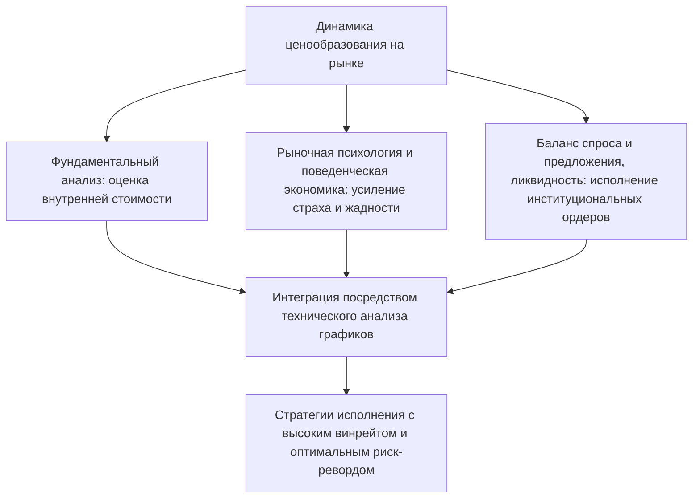
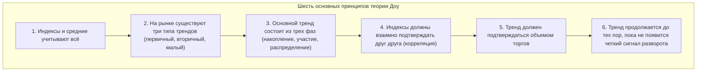
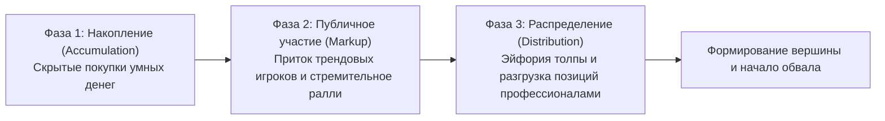
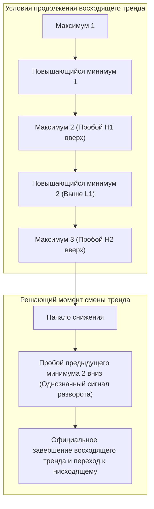
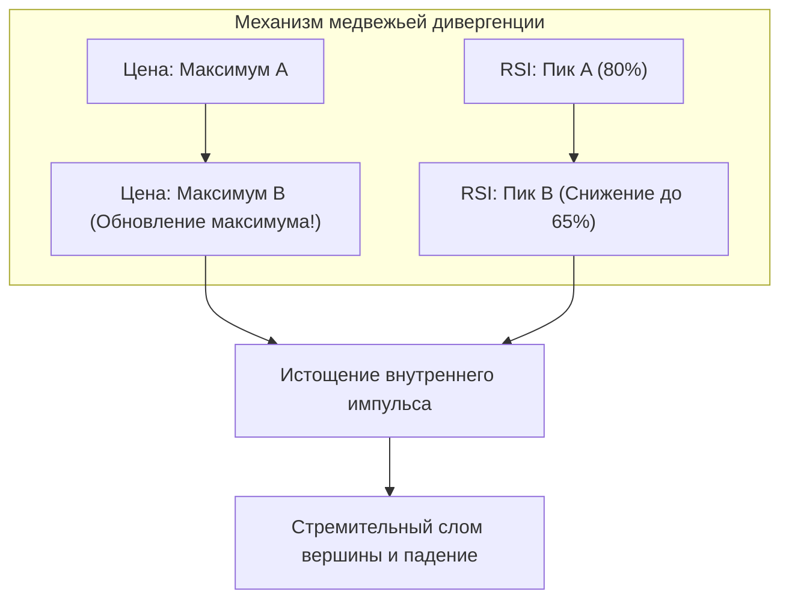
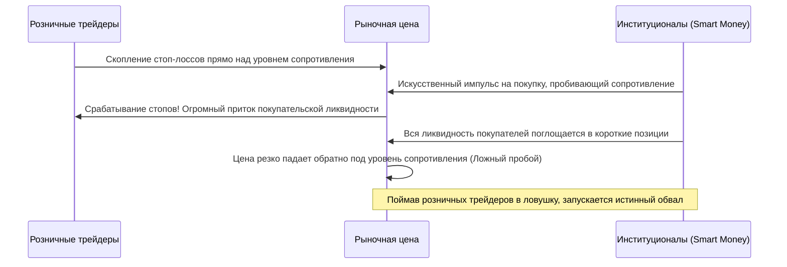
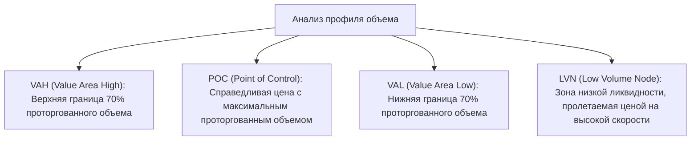

## 1. Введение: Философский фундамент технического анализа и природа рынка

### 1.1 Противостояние и диалектическое снятие (ауфхебен) фундаментального и технического анализа

Исторически подходы к пониманию механизмов ценообразования на финансовых рынках и прогнозированию будущих колебаний цен разделились на два масштабных направления: **Фундаментальный анализ (Fundamental Analysis)** и **Технический анализ (Technical Analysis)**.

Фундаментальный анализ стремится рассчитать **«внутреннюю стоимость» (Intrinsic Value)** актива на основе финансовой отчетности компаний, денежных потоков, процентных ставок центральных банков, темпов роста ВВП, инфляции и геополитических рисков. Его суть заключается в поиске рыночных неэффективностей, когда текущая биржевая цена отклоняется от этой теоретической стоимости. Предполагается, что, хотя в краткосрочной перспективе рыночные котировки могут быть иррациональными, на длинной дистанции они неизбежно сходятся к фундаментальным экономическим показателям компании и макроэкономическому равновесию.

Технический анализ, напротив, делает непосредственным предметом исследования траекторию трех величин: **«Цены» (Price)**, **«Объема» (Volume)** и **«Времени» (Time)** от прошлого к настоящему. Технический аналитик исходит из того, что подлинным двигателем котировок выступают не сами фундаментальные показатели, а то, как их интерпретируют люди: **психология толпы, страх, жадность, когнитивные искажения и потоки капитала (ликвидность)**.

В современном высокопрофессиональном трейдинге эти два подхода не противопоставляются, а находятся в состоянии диалектического **«снятия» (Aufheben / ауфхебен)**. Фундаментальный анализ отвечает на вопрос **«что торговать (выбор актива)»**, а технический анализ определяет **«когда входить в сделку и где жестко ограничить риск (тайминг и риск-менеджмент)»**. Какой бы безупречной ни была финансовая отчетность корпорации, в условиях затяжного нисходящего макротренда ее акции могут обесцениваться годами. Наглядно визуализировать и рассчитать динамику этих сил — главная задача технического анализа.



---

### 1.2 «Цена учитывает всё»: критика гипотезы эффективного рынка (EMH) и поведенческая экономика

Первая аксиома технического анализа гласит: **«Рыночная цена мгновенно учитывает и отражает абсолютно всю доступную информацию — не только публичные данные, но и инсайдерские сведения, спекулятивные ожидания, природные катастрофы, геополитические риски и эмоциональное состояние всех участников рынка»**.

Согласно слабой форме **Гипотезы эффективного рынка (Efficient Market Hypothesis: EMH)**, которая десятилетиями безраздельно господствовала в академических финансовых кругах, «вся прошлая информация о ценах и объемах уже полностью заложена в текущей цене, поэтому извлечь избыточную доходность (альфу) выше среднерыночной с помощью технического анализа теоретически невозможно».

Однако бурное развитие **Поведенческой экономики (Behavioral Economics)** и поведенческих финансов, начавшееся в 1980-х годах, экспериментально доказало, что базовый постулат EMH о «рациональности участников рынка» совершенно оторван от реальности:
- **Теория перспектив (Prospect Theory)** Даниэля Канемана и Амоса Тверски выявила глубокую асимметрию в человеческом восприятии: перед лицом прибыли люди становятся **крайне осторожными и избегают риска** (стремясь преждевременно зафиксировать крошечную прибыль), а при возникновении убытков они становятся **склонными к риску** (отказываются признавать потери и надеются на отскок).
- Систематические искажения мышления, такие как эффект якоря (Anchoring), стадный инстинкт (Herding Behavior), предвзятость подтверждения (Confirmation Bias) и сверхоптимизм (Overconfidence), с математической неизбежностью порождают повторяющиеся рыночные циклы **«экстремальной перекупленности (спекулятивные пузыри)»** и **«экстремальной перепроданности (панические обвалы)»**.

Технический анализ — это не магический шар для угадывания будущего среди случайного шума. Это **«строгий статистический метод расшифровки повторяющихся геометрических паттернов, которые коллективные когнитивные искажения человеческой психики раз за разом проецируют на ценовые графики»**.

---

### 1.3 Теория случайного блуждания против гипотезы фрактального рынка (Мандельброт)

Другим классическим направлением академической критики долгое время оставалась **Теория случайного блуждания (Random Walk Theory)**. Она утверждает, что распределение вероятностей ценовых изменений подчиняется нормальному (гауссову) закону и между прошлыми и будущими движениями цен нет никакой автокорреляции.

Сокрушительный удар по этой гипотезе нанес создатель фрактальной геометрии Бенуа Мандельброт (Benoit Mandelbrot). Проанализировав сверхдлинные временные ряды цен на хлопок и курсы валют за многие десятилетия, Мандельброт математически доказал следующие фундаментальные факты:

1. **«Тяжелые хвосты» (Fat Tails)**: Изменения цен на финансовых рынках не описываются нормальным распределением. Они подчиняются степенным законам (Power Law), из-за чего экстремальные ценовые шоки («Черные лебеди») происходят в тысячи раз чаще, чем предсказывает классическая статистика.
2. **Кластеризация волатильности (Volatility Clustering)**: Периоды высокой волатильности закономерно сменяются высокой волатильностью, а фазы затишья — затишьем, что свидетельствует о наличии четкой автокорреляции дисперсии во времени.
3. **Самоподобие (Self-Similarity)**: Если убрать временные метки с минутного, дневного и месячного графиков и положить их рядом, даже опытные профессиональные трейдеры не смогут определить, где какой таймфрейм, настолько их геометрические структуры идентичны.

Именно эта **фрактальная природа рынков** служит объективным математическим доказательством того, почему технический анализ эффективно работает на любых временных масштабах. Тренды младших периодов вложены внутрь трендов старших периодов по принципу матрешки, и в моменты их резонанса на рынке рождается мощнейший направленный моментум.

---

## 2. Краеугольный камень современного графического анализа: 6 принципов теории Доу и их современная интерпретация

Истоком всех классических и современных направлений технического анализа (волновой теории Эллиотта, законов Гранвиля, современного институционального прайс экшн) является **Теория Доу (Dow Theory)**, основы которой сформулировал основатель The Wall Street Journal Чарльз Доу (Charles H. Dow, 1851–1902). Сам Доу не оставил законченных книг, излагая свои мысли в передовых статьях, однако после его смерти Сэмюэл Нельсон, Уильям Гамильтон и Роберт Ри систематизировали его наследие в виде шести фундаментальных принципов.



---

### 2.1 Принцип 1: Средние (рыночная цена) учитывают всё

Рыночные индексы и биржевые котировки вбирают в себя и всесторонне отражают состояние деловой активности, корпоративные отчеты, решения центробанков по ставкам, войны, стихийные бедствия, а также совокупные эмоции и ожидания всех без исключения участников торгов. Поскольку любая новость или фундаментальный отчет закладываются в цену в момент выхода, попытка торговать по уже опубликованным новостям неизбежно ведет к опозданию. Прямой анализ динамики графика представляет собой самый оперативный и объективный способ считывания информации.

---

### 2.2 Принцип 2: На рынке действуют три типа трендов

Сравнивая движения котировок с океанскими водами, Доу разделил рыночные тенденции на три взаимосвязанных уровня:

1. **Первичный тренд (Primary Trend: приливы и отливы)**: Масштабное генеральное движение, длящееся от одного года до нескольких лет и определяющее стратегическое направление всего рынка.
2. **Вторичный тренд (Secondary Trend: волны)**: Коррекционные движения, направленные против первичного тренда. Обычно длятся от 3 недель до 3 месяцев и нивелируют от одной трети до двух третей (или ровно половину) предыдущего импульса.
3. **Малый тренд (Minor Trend: рябь на воде)**: Краткосрочные колебания длительностью менее 3 недель (от пары часов до нескольких дней). Они формируются под воздействием сиюминутного шума и спекуляций, легко поддаются манипуляциям, поэтому их изолированный анализ несет в себе огромные риски.

В современном трейдинге эта классификация легла в основу **«Мультитаймфреймового анализа» (MTF)**. Определение прилива на дневном или недельном графике, ожидание отката волны на 4-часовом таймфрейме и точечный вход на ряби 15- или 5-минутного графика — прямое воплощение принципов Доу на практике.

---

### 2.3 Принцип 3: Основной тренд состоит из трех фаз

Первичный тренд (особенно восходящий) закономерно проходит три качественные стадии, определяемые психологией участников:



- **Фаза 1: Накопление (Accumulation)**: Формируется на самом дне глубокого кризиса или панического обвала, когда вокруг царят безнадежность и отчаяние. Именно в этот период дальновидные институциональные инвесторы (**Smart Money**) начинают незаметно и планомерно скупать катастрофически подешевевшие активы. Цена движется в узком боковом коридоре, а волатильность затухает.
- **Фаза 2: Публичное участие (Public Participation / Markup)**: Появляются первые признаки оздоровления макроэкономики, отчетности компаний улучшаются, и в рынок лавинообразно вливаются трейдеры, работающие по техническому анализу и трендовым стратегиям. Начинается стремительный направленный рост — наиболее протяженный, устойчивый и прибыльный участок цикла.
- **Фаза 3: Распределение (Distribution)**: Средства массовой информации ежедневно восторженно трубят о рекордном росте актива, и в рынок в панике опоздать (FOMO) устремляется неискушенная широкая публика (**Dumb Money**). В этот момент «умные деньги», набравшие позиции в первой фазе, скрытно распродают свои активы в поток заявок восторженной толпы. На графике появляются резкие размашистые колебания и длинные верхние тени, сигнализируя о скором завершении восходящей тенденции.

---

### 2.4 Принцип 4: Индексы должны взаимно подтверждать друг друга

В эпоху Чарльза Доу проводилось прямое сопоставление двух индексов: Промышленного (Dow Jones Industrial Average) и Железнодорожного (Dow Jones Transportation Average). Логика была безупречна: сколько бы промышленных товаров ни производили фабрики, реальный экономический подъем не подтвержден до тех пор, пока эти товары не доставлены по железным дорогам потребителям. Поэтому обновление максимума промышленным индексом считалось ложным сигналом, если транспортный индекс синхронно не подтверждал его новым пиком.

Сегодня этот принцип трансформировался в методы **межрыночного анализа (Intermarket Analysis)** и оценку **внутренней структуры рынка**:
- Подтверждается ли новый максимум индекса S&P 500 синхронным движением технологического NASDAQ и индекса акций малой капитализации Russell 2000?
- Подтверждается ли рост валютной пары USD/JPY ростом доходностей казначейских облигаций США и укреплением индекса доллара (DXY)?
- Подкрепляется ли взлет цены биткоина ростом курса Ethereum и общей капитализации альткоинов?

Одиночное обновление максимума без подтверждения смежными рынками с огромной вероятностью является институциональной ловушкой для покупателей (**Bull Trap**).

---

### 2.5 Принцип 5: Тренд должен подтверждаться объемом торгов

Цена отражает **направление** движения, тогда как торговый объем (Volume) свидетельствует о **подлинности и мощности внутренней энергии** тренда:

- **Здоровый восходящий тренд**: объем возрастает на импульсных движениях вверх и закономерно падает во время коррекционных откатов вниз.
- **Здоровый нисходящий тренд**: объем возрастает при ускорении падения и снижается во время технических отскоков вверх.

Если цена переписывает исторический максимум на угасающем объеме, возникает опасная ситуация — **дивергенция объема (Volume Divergence)**. Это говорит о том, что реальные покупатели на рынке иссякли, а цена ползет вверх лишь по инерции. Ричард Вайкофф (Richard Wyckoff) довел эту идею Доу до совершенства, создав метод **VSA (Volume Spread Analysis)** для распознавания действий маркетмейкеров через анализ взаимосвязи спреда свечи и объема.

---

### 2.6 Принцип 6: Тренд продолжается до тех пор, пока не появится четкий сигнал разворота

Для практикующего графического трейдера шестой принцип Доу представляет собой непреложный закон дисциплины.

Формальное определение тренда математически строго и предельно лаконично:
- **Определение восходящего тренда**: **«Структура, в которой каждый последующий максимум (High) и каждый последующий минимум (Low) выше предыдущих»**.
- **Определение нисходящего тренда**: **«Структура, в которой каждый последующий максимум и каждый последующий минимум ниже предыдущих»**.



Сколько бы ни продолжался стремительный взлет цены и как бы ни казалось, что «актив переоценен и пора продавать», до тех пор, пока цена на закрытии свечи не пробьет вниз последний подтвержденный повышающийся минимум (**Higher Low**), восходящий тренд остается в силе. Попытки ловить вершины против тренда на основе субъективных ощущений являются самым верным путем к сливу депозита.

---

## 3. Волновой анализ Эллиотта и тайна математики Фибоначчи

### 3.1 Концепция космического порядка Ральфа Нельсона Эллиотта

Если теория Доу дала трейдерам систему координат для определения направления тренда, то Ральф Нельсон Эллиотт (Ralph Nelson Elliott, 1871–1948) структурировал ритм и фрактальную геометрию рыночных движений. Прикованный к постели тяжелой болезнью, Эллиотт с фанатичной дотошностью вручную исследовал графики индекса Доу Джонса за 75 лет — от месячных до 30-минутных — и в 1938 году опубликовал монографию *The Wave Principle* («Волновой принцип»).

Эллиотт утверждал, что коллективное поведение людей и психологические колебания социума разворачиваются в строгом соответствии с последовательностью Фибоначчи и законом золотого сечения — теми же математическими принципами, которые управляют спиралями раковин, строением растений и галактическими вихрями. Рынок — это не хаотичный беспорядок, а фрактальный космос, бесконечно повторяющий **базовый 8-волновой цикл, состоящий из 5 импульсных волн (Impulse Waves) и 3 коррекционных волн (Corrective Waves)**.

```mermaid
flowchart LR
    subgraph Импульсные волны (По направлению тренда: 5 волн)
        W1["Волна 1<br/>(Зарождение)"] --> W2["Волна 2<br/>(Глубокий откат)"]
        W2 --> W3["Волна 3<br/>(Мощнейший взрыв)"]
        W3 --> W4["Волна 4<br/>(Сложная коррекция)"]
        W4 --> W5["Волна 5<br/>(Финальная эйфория)"]
    end
    subgraph Коррекционные волны (Контртренд: 3 волны)
        W5 --> WA["Волна A<br/>(Импульс вниз)"]
        WA --> WB["Волна B<br/>(Ложный отскок)"]
        WB --> WC["Волна C<br/>(Сокрушительное падение)"]
    end
```

---

### 3.2 Структура импульсных волн и три незыблемых правила

В классической импульсной волне, движущейся по тренду, действуют **«Три абсолютных правила»**, нарушение хотя бы одного из которых делает разметку ложной и требует немедленного пересмотра сценария:

1. **Правило 1: Волна 2 никогда не откатывается глубже начала Волны 1.** (Пробой исходной точки отменяет зарождение нового тренда и подтверждает продолжение старого движения вниз).
2. **Правило 2: Из трех импульсных волн (1, 3 и 5) Волна 3 никогда не бывает самой короткой.** (В большинстве случаев третья волна является наиболее мощной, протяженной и растянутой).
3. **Правило 3: Волна 4 никогда не заходит на ценовую территорию вершины Волны 1.** (Если минимум четвертой волны опускается ниже максимума первой, структура перестает быть классическим импульсом и переходит в категорию диагоналей или аномалий).

#### Психологический портрет каждой волны
- **Волна 1**: Разворотный импульс. На фундаментальном фронте по-прежнему преобладает негатив, и большинство трейдеров воспринимают движение как временный отскок перед новым падением; первоначальный напор сдержан.
- **Волна 2**: Стремительный откат. Толпа поддается панике, считая, что падение возобновилось, из-за чего откат достигает 50%, 61.8% или даже 78.6% от высоты Волны 1. Однако основание первой волны остается нетронутым.
- **Волна 3**: Технические индикаторы дают синхронные сигналы на покупку, пробой ключевых уровней вызывает лавину стоп-приказов продавцов и приток институционального капитала. Объемы взрываются, движение формирует гэпы и взмывает вертикально вверх. Это золотая волна с максимальной доходностью, в которой профессионалы удерживают наибольший объем позиций.
- **Волна 4**: Фаза фиксации колоссальной прибыли третьей волны и попыток опоздавших войти на откате. Коррекция развивается медленно, формируя затяжные треугольники или сложные формации. Здесь вступает в силу **Правило чередования**: если Волна 2 была резкой и глубокой, то Волна 4 будет плоской, затяжной и сложной.
- **Волна 5**: Кульминационный аккорд. Экономические новости излучают максимальный позитив, а розничные инвесторы в эйфории скупают активы на вершине. При этом индикаторы моментума (RSI, MACD) демонстрируют явные медвежьи дивергенции относительно пика третьей волны, свидетельствуя о скором исчерпании внутреннего ресурса покупателей.

---

### 3.3 Классификация коррекционных волн

Коррекционные фазы после завершения импульса отличаются гораздо большим разнообразием форм, чем импульсы. Эллиотт выделил три основные структуры:

1. **Зигзаг (Zigzag: структура 5-3-5)**: Стремительная и глубокая коррекция. Состоит из Волны A (5 волн вниз) $\rightarrow$ Волны B (3 волны отскока, компенсирующие от 38.2% до 50% Волны A) $\rightarrow$ Волны C (5-волновой импульс вниз, сопоставимый по длине с Волной A).
2. **Плоскость (Flat: структура 3-3-5)**: Боковое консолидационное движение. Состоит из Волны A (3 волны) $\rightarrow$ Волны B (3 волны, возвращающиеся почти к началу Волны A) $\rightarrow$ Волны C (5 волн, лишь незначительно обновляющих минимум Волны A). В сильных бычьих трендах часто возникает **расширенная плоскость (Expanded Flat)**, где Волна B пробивает вершину Волны A перед резким падением Волны C.
3. **Треугольник (Triangle: структура 3-3-3-3-3)**: Модель сжатия диапазона колебаний и баланса сил покупателей и продавцов из 5 подволн (A-B-C-D-E). Появляется исключительно на позициях, предшествующих финальному импульсу (Волна 4 или Волна B), подготавливая почву для заключительного выстрела котировок (Волна 5).

---

### 3.4 Коэффициенты Фибоначчи и формулы расчета ценовых целей

Колоссальная аналитическая сила волновой теории Эллиотта обусловлена ее математической взаимосвязью с числами Фибоначчи ($0, 1, 1, 2, 3, 5, 8, 13, 21, 34, 55, 89, 144\dots$), на основе которых выводятся ключевые уровни коррекций и расширений:

Базовые коэффициенты Фибоначчи:
- $\phi = \frac{\sqrt{5}-1}{2} \approx 0.618$
- $1 - \phi \approx 0.382$
- $\sqrt{0.618} \approx 0.786$
- $1.618$ (Золотое сечение / коэффициент расширения)
- $2.618, 4.236$

#### Практические формулы расчета целей
1. **Глубина отката Волны 2**: Чаще всего составляет **$61.8\%$** или **$50.0\%$**, предельно до **$78.6\%$** от высоты Волны 1.
2. **Целевой уровень Волны 3**: Принимая амплитуду Волны 1 за $W_1$ и точку окончания Волны 2 за $L_2$:
   $$\text{Target}(W_3) = L_2 + 1.618 \times W_1$$
   В сверхсильных трендовых импульсах (Super Extended):
   $$\text{Target}(W_3) = L_2 + 2.618 \times W_1$$
3. **Глубина отката Волны 4**: Обычно составляет **$38.2\%$** от амплитуды Волны 3 (неглубокий откат) либо совпадает с минимумом внутренней 4-й подволны третьей волны.
4. **Целевой уровень Волны 5**: К минимуму Волны 4 прибавляется величина, равная **$61.8\%$** от совокупной амплитуды с начала Волны 1 до вершины Волны 3.

---

## 4. Восточная мудрость: морфология японских свечей и пять методов Сакаты

В то время как на Западе технический анализ зарождался в форме линейных и баровых графиков, в Японии XVIII века, в эпоху Эдо, на рисовой бирже Додзима в Осаке уже процветала первая в мире организованная фьючерсная торговля. Легендарный купец Мунэхиса Хомма (1724–1803) сформулировал рыночную философию в трактате «Санъэн кинсэн хироку», из которого впоследствии выкристаллизовались знаменитые **«Пять методов Сакаты» (Sakata Gaho)**.

---

### 4.1 Внутренняя динамика японских свечей (Candlestick)

Каждая японская свеча за выбранный таймфрейм наглядно фиксирует соотношение четырех значений: цены **Открытия (Open)**, **Максимума (High)**, **Минимума (Low)** и цены **Закрытия (Close)** при помощи прямоугольного «тела» (Real Body) и верхних и нижних «теней» (Shadows / Wicks).

Когда в конце 1980-х годов Стив Нисон (Steve Nison) представил эту методику Западу в книге *Japanese Candlestick Charting Techniques*, трейдеры с Уолл-стрит были поражены информативностью свечей, сделав их мировым стандартом отображения рыночных данных.

| Формация свечи | Внешний вид | Внутренняя психология и механика рынка |
| :--- | :--- | :--- |
| **Марубодзу (Marubozu)** | Очень длинное тело при полном или почти полном отсутствии теней. | Безоговорочное доминирование одной стороны (покупателей или продавцов) от открытия до закрытия. Мощнейший трендовый сигнал. |
| **Молот / Пин-бар (Hammer / Karakasa)** | Маленькое тело в верхней части свечи и длинная нижняя тень, превышающая тело минимум в два раза. | Продавцы агрессивно продавили цену вниз, но наткнулись на гигантский массив лимитных заявок на покупку, который полностью поглотил предложение и вернул цену к уровню открытия. **Сильнейший сигнал разворота вверх на дне**. |
| **Падающая звезда / Надгробие (Shooting Star / Touba)** | Маленькое тело в нижней части свечи и длинная верхняя тень, превышающая тело минимум в два раза. | Покупатели пытались штурмовать новые высоты, но натолкнулись на колоссальное институциональное давление продаж и отступили к основанию. **Классический сигнал разворота вниз на вершине**. |
| **Доджи (Doji)** | Цены открытия и закрытия практически совпадают. Тело превращается в тонкую горизонтальную линию (в виде креста). | Момент абсолютного равенства сил покупателей и продавцов. Сигнализирует о затухании импульса и предвещает скорый пробой консолидации либо разворот. |

---

### 4.2 Квинтэссенция пяти методов Сакаты

Пять методов Сакаты представляют собой базовые конфигурации из нескольких свечей, позволяющие с высокой точностью распознавать моменты перелома рыночной энергии:

1. **Три горы (Сан-дзан)**: Трехкратная безуспешная попытка цены пробить уровень сопротивления на вершине. Если центральный пик выше остальных, модель называется «Три Будды» (Сан-дзон) и полностью соответствует западной фигуре **«Голова и плечи» (Head and Shoulders Top)**; пробой линии шеи знаменует переход к мощному нисходящему тренду.
2. **Три реки (Сан-сэн)**: Трехкратный тест зоны поддержки на дне (тройное дно или перевернутая «Голова и плечи»). Также выражается в разворотном паттерне **«Утренняя звезда» (Morning Star)**, где длинная медвежья свеча, свеча с маленьким телом (звезда/доджи) и полнотелая бычья свеча подтверждают разворот рынка вверх.
3. **Три окна/гэпа (Сан-ку)**: Возникновение трех последовательных ценовых разрывов (гэпов) по направлению тренда. Старинное правило гласит: *«Увидев три гэпа вверх — продавай; три гэпа вниз — покупай»*. Череда гэпов указывает на запредельный эмоциональный перегрев толпы и сигнализирует о скором истощении топлива движения.
4. **Три солдата (Сан-пэй)**: Модель **«Три белых солдата» (Ака-санпэй)** — три последовательно растущие бычьи свечи с закрытием близко к максимумам — подтверждает уверенное зарождение восходящего тренда из зоны дна. Однако если третья свеча имеет длинную верхнюю тень (*Ака-санпэй сакидзумари*), это предостерегает от потери импульса. Напротив, три длинные медвежьи свечи на вершине именуются **«Тремя черными воронами» (Куро-санпэй)**.
5. **Три метода (Сан-по)**: Практическое выражение древней мудрости: *«Умение выжидать вне позиции — тоже часть торговли»*. Паттерн продолжения тренда **«Бычья модель трех методов» (Rising Three Methods)** возникает, когда после длинной бычьей свечи появляются три небольшие медвежьи свечи, не выходящие за пределы диапазона первой, после чего пятая мощная бычья свеча пробивает максимум и возобновляет восхождение.

---

## 5. Математическая структура технических индикаторов и практические ловушки

Индикаторы представляют собой математические алгоритмы, накладываемые на графики цен и объемов. Они подразделяются на **трендовые (следующие за трендом)** и **осцилляторы (моментум и возврат к среднему)**. Большинство начинающих трейдеров терпят убытки, слепо доверяя визуальным сигналам индикаторов и не понимая их внутренней математической структуры. Ниже разобран математический аппарат основных инструментов.

### 5.1 Математика трендовых индикаторов

#### ① Скользящие средние (SMA против EMA)
Формула классической простой скользящей средней (SMA: Simple Moving Average) за период $n$:
$$SMA_t = \frac{1}{n} \sum_{i=0}^{n-1} P_{t-i}$$
Главный недостаток SMA — присвоение совершенно одинакового веса ($1/n$) как текущей цене, так и цене, зафиксированной $n$ периодов назад. Это порождает критическое запаздывание (лаг).

Этого недостатка лишена экспоненциальная скользящая средняя (EMA: Exponential Moving Average), придающая максимальный вес последней цене $P_t$ и экспоненциально уменьшающая влияние прошлых данных. При коэффициенте сглаживания $\alpha = \frac{2}{n+1}$:
$$EMA_t = \alpha P_t + (1 - \alpha) EMA_{t-1}$$
Благодаря высокой чувствительности к свежим ценовым импульсам EMA (особенно с периодами 20, 50 и 200) стала безоговорочным стандартом в алгоритмической торговле и дейтрейдинге.

#### ② Полосы Боллинджера (Bollinger Bands)
Разработанный Джоном Боллинджером в 1980-х годах индикатор выстраивает динамический ценовой коридор на основе стандартного отклонения ($\sigma$) вокруг скользящей средней:
$$Middle = SMA_n(P)$$
$$\sigma = \sqrt{\frac{1}{n} \sum_{i=0}^{n-1} (P_{t-i} - Middle)^2}$$
$$Upper = Middle + k \cdot \sigma, \quad Lower = Middle - k \cdot \sigma \quad (\text{обычно } k=2)$$

В рамках идеального нормального распределения вероятность нахождения случайной величины внутри диапазона $\pm 2\sigma$ составляет **$95.44\%$**.

И здесь кроется фатальная ловушка: **колебания цен на финансовых рынках не подчиняются нормальному распределению (рынку присущи «тяжелые хвосты»)**.

Следовательно, продавать только потому, что цена коснулась верхней границы $+2\sigma$, в корне неверно. При зарождении мощного тренда цена способна расширять полосы и двигаться вдоль границы $+2\sigma$ на протяжении многих дней и недель (эффект **Band Walk / Прогулка по полосе**). Истинное предназначение Полос Боллинджера — обнаружение фазы экстремального сжатия волатильности (**Squeeze**) и вход в направлении последующего взрывного расширения диапазона (**Expansion**).

---

### 5.2 Математика осцилляторов

#### ① RSI (Relative Strength Index: Индекс относительной силы)
Созданный Дж. Уэллсом Уайлдером индикатор RSI сравнивает величину среднего прироста и среднего падения котировок за выбранный период (по умолчанию 14) и нормирует силу движения в диапазоне от $0$ до $100\%$:
$$RS = \frac{\text{Средний прирост за последние } n \text{ дней}}{\text{Среднее падение за последние } n \text{ дней}}$$
$$RSI = 100 - \frac{100}{1 + RS} = \frac{\text{Средний прирост}}{\text{Средний прирост} + \text{Среднее падение}} \times 100$$

Хотя в базовой литературе уровни выше 70% считаются перекупленностью, а ниже 30% — перепроданностью, в сильных трендах RSI может неделями оставаться выше 80%, пока цена удваивается.

Наиболее надежным и ценным сигналом RSI является **дивергенция (Divergence / расхождение)**:
- **Медвежья дивергенция (Bearish Divergence)**: Возникает, когда цена формирует новый, более высокий максимум, а соответствующий пик на графике RSI оказывается ниже предыдущего. Это свидетельствует об исчерпании внутреннего импульса покупателей и предупреждает о неизбежном развороте рынка вниз.



---

## 6. Современный прайс экшн и концепция умных денег (Smart Money Concepts / SMC)

С 2010-х годов, когда доля высокочастотных алгоритмов (HFT) и торговых ИИ-систем на мировых биржах превысила 80%, эффективность классических индикаторов (таких как MACD или стохастик) резко упала. На смену им в арсенале профессионалов утвердились чистый **Price Action** и **Концепция умных денег (Smart Money Concepts / SMC)**, нацеленные на чтение ликвидности и потока институциональных заявок.

### 6.1 Охота за ликвидностью и снятие ликвидности (Liquidity Sweep)

Фундаментальный постулат SMC гласит: **«Рыночная цена всегда целенаправленно движется туда, где сконцентрировано максимальное количество стоп-лоссов розничных игроков (пулов ликвидности)»**.

Трейдеры-любители (ритейл) обучаются по одним и тем же шаблонам и выставляют защитные стоп-приказы в очевидных зонах: *чуть выше понятных двойных вершин* или *чуть ниже явных минимумов боковиков*. Однако крупным финансовым институтам (**Smart Money**), оперирующим позициями в сотни миллионов и миллиарды долларов, критически не хватает встречной ликвидности. Они физически не могут войти в позицию без сильного сдвига цены, если не активируют встречные стоп-ордера толпы.

1. **Снятие ликвидности (Liquidity Sweep / Охота за стопами)**: Институционалы кратковременно выталкивают цену за ключевой уровень сопротивления или поддержки.
2. Это приводит к массовому срабатыванию защитных стоп-ордеров ритейла (ордеров на покупку на пробое хая или ордеров на продажу на пробое лоу), выбрасывая в биржевой стакан колоссальную ликвидность.
3. Институционалы мгновенно поглощают всю эту ликвидность встречными ордерами и затягивают цену обратно внутрь диапазона (**Fakeout / Ложный пробой**).
4. На графике формируется свеча с длинной тенью (**Пин-бар / Wick**), а рынок, оставив розничных трейдеров с убытками, стремительно летит в противоположную сторону.



---

### 6.2 Дисбаланс / Fair Value Gap (FVG) и Блок ордеров (Order Block)

Ключевыми инструментами для ювелирного входа в позицию по методологии SMC выступают **FVG** и **Блоки ордеров**:

- **Fair Value Gap (FVG / Зона дисбаланса / Imbalance)**: При мгновенном вливании крупного капитала в трехсвечной формации возникает разрыв — пустое пространство между максимумом первой свечи и минимумом третьей свечи, где не происходило двусторонних торгов. Поскольку рыночные алгоритмы стремятся устранить этот дисбаланс, цена с высокой вероятностью возвращается в эту зону для ретеста. Вход на возврате в FVG позволяет работать с минимальным стоп-лоссом и отличным риск-ревордом.
- **Блок ордеров (Order Block / OB)**: Последняя свеча противоположного направления, сформированная непосредственно перед началом взрывного импульсного пробоя институционалов (последняя медвежья свеча перед ралли вверх или последняя бычья свеча перед обвалом). Этот ценовой диапазон отражает зону входа крупного капитала и в будущем выступает железобетонным уровнем поддержки или сопротивления при повторном тестировании.

---

## 7. Решающий рубеж между успехом и разорением: соотношение риск-прибыль и математика управления капиталом

Каким бы совершенным ни был технический арсенал трейдера, пренебрежение математикой **управления капиталом (Money Management)** со 100%-ной гарантией приведет его депозит к банкротству. Трейдинг — это не попытка предугадать будущее, а **строгий статистический бизнес, основанный на многократном повторении сделок с положительным математическим ожиданием ($+EV$) при нулевой вероятности разорения**.

### 7.1 Математическое доказательство вероятности разорения Бальсары (Risk of Ruin)

Французский математик Наузер Бальсара (Nauzer Balsara) разработал формулу расчета вероятности полного банкротства трейдера в зависимости от трех параметров: **Доли прибыльных сделок (Win Rate)**, **Коэффициента выплат (Payoff Ratio / соотношения прибыли к убытку)** и **Допустимого риска на одну сделку (процента от депозита)**.

- **Доля выигрышей ($W$)**: Число прибыльных сделок $\div$ Общее число сделок
- **Соотношение прибыли к убытку ($R$)**: Средний размер прибыли $\div$ Средний размер убытка

В таблице ниже приведена расчетная вероятность разорения по Бальсаре при агрессивном риске на сделку в размере **$20\%$** от депозита:

| Винрейт \ Соотношение ($R$) | 0.5 (Убыток > Прибыли) | 1.0 (Прибыль = Убытку) | 1.5 (Прибыль > Убытка) | 2.0 (Оптимальный) | 3.0 (Сверхприбыльный) |
| :---: | :---: | :---: | :---: | :---: | :---: |
| **30%** | 100% | 100% | 100% | 80.0% | 14.3% |
| **40%** | 100% | 100% | 38.2% | 14.1% | 1.2% |
| **50%** | 100% | 50.0% | 5.6% | 0.8% | **0.0%** |
| **60%** | 100% | 2.1% | 0.1% | **0.0%** | **0.0%** |
| **70%** | 14.3% | **0.0%** | **0.0%** | **0.0%** | **0.0%** |

Эта таблица демонстрирует суровую истину, разрушающую иллюзии новичков: **«Даже имея 60% прибыльных сделок, если соотношение прибыли к убытку равно 0.5 (риск потерять 2 доллара ради заработка 1 доллара), вероятность полного разорения составляет 100%»**. Именно поэтому новички, покупающие стратегии с «90% побед», стабильно теряют весь депозит при первой же череде неудач.

Напротив, **при скромном винрейте всего в 40%, но с соотношением прибыли к убытку 2.0 (средняя прибыль вдвое превышает средний убыток), вероятность банкротства падает до 14.1%, а при соотношении 3.0 она составляет мизерные 1.2%, гарантируя уверенный рост капитала на длинной дистанции**.

---

### 7.2 Правило 2% и формула количественного расчета размера позиции

Золотое правило риск-менеджмента институциональных управляющих гласит: **«Максимальный риск убытка в одной сделке не должен превышать $1\% \sim 2\%$ от совокупного размера депозита»** (Правило 2%).

Типичная ошибка новичков — вход фиксированным объемом (например, «всегда открывать 1 лот»). Это в корне неверно, поскольку расстояние до защитного стоп-лосса, продиктованное графиком и волатильностью, уникально для каждого отдельного сетапа.

Корректный расчет рабочего объема позиции (Position Sizing) вычисляется по формуле:

$$Position\_Size = \frac{Account\_Balance \times Risk\_Percentage}{Entry\_Price - Stop\_Loss\_Price}$$

#### Практический пример
- Размер депозита: $10\,000\,000$ JPY (или эквивалент в базовой валюте)
- Допустимый риск: $2\%$ (Максимальный убыток на сделку $= 200\,000$ JPY)
- Цена входа: $150.00$ (например, по USD/JPY)
- Уровень расчетного стоп-лосса: $149.20$ (Дистанция риска $= 0.80 = 80$ пунктов/pips)

Требуемый объем открываемой позиции:
$$Position\_Size = \frac{200\,000}{0.80} = 250\,000 \text{ единиц базовой валюты (2.5 стандартных лота)}$$

Если в следующей сделке стоп-лосс окажется коротким — всего $0.40$ (40 pips), объем позиции можно безопасно увеличить до $5.0$ лотов. Если же рынок требует широкий стоп в $1.60$ (160 pips), объем позиции необходимо сократить до $1.25$ лота. **«Динамически изменять размер позиции под дистанцию стопа, сохраняя абсолютный денежный риск строго неизменным»** — это единственный математический барьер, способный защитить депозит при любой серии неудачных сделок.

---

### 7.3 Теория перспектив и преодоление психологических искажений

Почему большинство людей раз за разом нарушают элементарные правила риск-менеджмента? Причина кроется в эволюционном устройстве человеческого мозга.

На протяжении сотен тысяч лет жизни в саванне в качестве охотников и собирателей добытую пищу требовалось употребить немедленно, иначе она портилась либо отбиралась хищниками. При возникновении смертельной опасности отчаянное сопротивление до последнего повышало шансы выжить.

Однако в современных вероятностных рыночных системах эти древние биологические инстинкты превращаются в яд:
1. **Неприятие риска при прибыли (Преждевременное закрытие)**: Увидев небольшой плюс, человек испытывает мучительный страх потерять сиюминутную прибыль и торопится зафиксировать копейки, лишая себя колоссальных движений.
2. **Тяга к риску при убытках (Откладывание стоп-лосса)**: Попав в просадку, трейдер психологически отрицает реальность потерь, отодвигает стоп-лосс подальше, начинает доливаться против тренда (мартингейл) и переходит к слепым молитвам.

Истинный Грааль трейдинга кроется не в хитроумных комбинациях индикаторов. Он заключается в **«осознании встроенных в наше ДНК биологических искажений (проклятия теории перспектив) и развитии железной дисциплины механического следования вероятностным математическим правилам»**.

---

### 7.4 Математика критерия Келли (Kelly Criterion) и практическое применение Half-Kelly

Наряду с вероятностью Бальсары фундаментальным столпом риск-менеджмента выступает **Критерий Келли (Kelly Criterion)**, выведенный в 1956 году физиком Bell Labs Джоном Ларри Келли-младшим на основе теории информации.

Критерий Келли определяет оптимальную долю капитала $f^*$, максимизирующую геометрический темп сложного роста депозита на длинной дистанции:

$$f^* = \frac{b \cdot p - q}{b} = p - \frac{q}{b}$$

Где:
- $p$: Доля прибыльных сделок ($0 \le p \le 1$)
- $q = 1 - p$: Доля убыточных сделок
- $b$: Соотношение чистой прибыли к чистому убытку (Payoff Ratio)

#### Числовой пример и ловушка полного критерия Келли
Рассмотрим систему с винрейтом $p = 0.55$ (55%) и соотношением риска к прибыли $b = 1.5$ (1:1.5):
$$f^* = \frac{1.5 \times 0.55 - 0.45}{1.5} = \frac{0.825 - 0.45}{1.5} = \frac{0.375}{1.5} = 0.25 \quad (25\%)$$

Теоретическая математика показывает, что ставка в размере **$25\%$** депозита в каждой сделке дает максимальную скорость геометрического роста счета.
Однако в реальном биржевом трейдинге работа по полному Келли (**Full Kelly**) равносильна **самоубийству**. Формула опирается на идеализированное допущение о неизменности параметров распределения во времени.

При малейшем изменении рыночных условий или нормальной статистической серии из 7 убыточных сделок подряд риск в 25% вызовет просадку (**Drawdown**) свыше **$80\%$**, что приводит к психологическому краху трейдера.

#### Преимущество концепции Half-Kelly (Половина Келли)
Поэтому кванты и хедж-фонды используют консервативные фракции — **«Half-Kelly» (Половина Келли)** или **«Quarter-Kelly» (Четверть Келли)**:
- Применение Half-Kelly ($f^* / 2$) сохраняет порядка **$75\%$** от максимально возможного темпа роста капитала, при этом **снижая просадку и волатильность кривой доходности более чем на $50\%$**.
- В рассматриваемом примере рабочий риск составит $12.5\%$, а при Quarter-Kelly — $6.25\%$. В сочетании с практическим потолком **«Правила 2%»** это обеспечивает безупречную математическую устойчивость депозита.

---

### 7.5 Профиль объема (Volume Profile) и структура POC (Point of Control)

На классических графиках объем выводится в нижней части окна в виде вертикальной гистограммы по времени (**Volume by Time**). Однако современный институциональный анализ опирается на **Профиль объема (Volume Profile / VPVR)**, отображающий распределение проторгованных объемов в виде горизонтальных полос по шкале цен.



1. **POC (Point of Control)**: Ценовой уровень с максимальным объемом сделок за выбранный период. Это центр гравитации, признанный всеми участниками как «справедливая цена» (Fair Value). Он служит сильнейшим магнитом, притягивающим цену обратно при ее отклонении.
2. **Зона стоимости (Value Area: VA)**: Ценовой диапазон, в котором сосредоточено **$70\%$** всего проторгованного объема (эквивалентно $1\sigma$ нормального распределения):
   - **VAH (Value Area High)**: Верхняя граница зоны стоимости, выступающая сильным сопротивлением.
   - **VAL (Value Area Low)**: Нижняя граница зоны стоимости, выступающая надежной поддержкой.
3. **LVN (Low Volume Node)**: Ценовые зоны с минимальным объемом торгов. Это участки вакуума, где покупатели и продавцы не пришли к согласию; при попадании сюда цена пролетает этот диапазон на огромной скорости без какого-либо сопротивления.

Профиль объема позволяет отказаться от субъективных уровней и, словно рентгеном, увидеть истинные зоны консолидации крупного институционального капитала.

---

### 7.6 Протокол мультитаймфреймовой синхронизации (MTF)

Практическая работа профессионального трейдера строится на механическом следовании пятиуровневому протоколу мультитаймфреймовой синхронизации:

| Таймфрейм | Роль в системе | Задачи мониторинга и ключевые решения |
| :--- | :--- | :--- |
| **1. Неделя / День** | Оценка контекста (Океаническое течение) | Первичный тренд по теории Доу (структура максимумов и минимумов), наклон 200 EMA, макроэкономические зоны поддержки и сопротивления. |
| **2. 4 часа** | Структура сетапа (Динамика волны) | Волновой анализ Эллиотта (развитие импульсной Волны 3 или коррекционной Волны 4), уровни коррекции Фибоначчи (тест уровня 61.8%). |
| **3. 1 час** | Определение ликвидности (Поиск целей) | Поиск дисбалансов FVG, блоков ордеров (Order Blocks), пулов ликвидности выше и ниже локальных экстремумов. |
| **4. 15 минут** | Подтверждение смены структуры | Смена характера рынка — CHoCH (Change of Character), пробой последнего нисходящего максимума или восходящего минимума. |
| **5. 5 минут / 1 минута** | Точка входа (Спусковой крючок) | Разворотные свечные формации (пин-бары, поглощения), точное определение стоп-лосса, расчет объема по формуле и отправка ордера. |

Сделку допустимо открывать исключительно в точке **конфлюэнции** (полного совпадения сигналов старших и младших масштабов). Все остальное время профессионал сохраняет хладнокровное терпение и наблюдает за рынком вне позиции. Именно эта избирательность обеспечивает стабильность кривой депозита.

---

## 8. Заключение: Трейдинг как управление собственным разумом

Постижение глубин технического анализа лишь на первый взгляд кажется битвой за покорение внешнего рынка. В действительности это глубокая **духовная практика, нацеленная на управление собственным подсознанием, страхами и желаниями**.

График — это гигантское зеркало, отражающее надежды, отчаяние, трезвые расчеты и самонадеянность миллионов людей, торговых алгоритмов, центральных банков и инвестиционных фондов по всему миру. Каждая свеча — это биение пульса самой человеческой природы.

- С помощью **теории Доу** определяйте глобальные приливы и отливы;
- С помощью **волн Эллиотта и Фибоначчи** считывайте внутренний геометрический ритм рынка;
- С помощью **методов Сакаты и прайс экшн** определяйте правду реального баланса сил здесь и сейчас;
- И с помощью **математики Бальсары и жесткого риск-менеджмента** гарантируйте себе иммунитет от банкротства.

Когда эта система станет частью вашей натуры, график перестанет казаться пугающим хаосом и откроется вашему взору как прекрасная, гармоничная **«симфония вероятностей»**.
