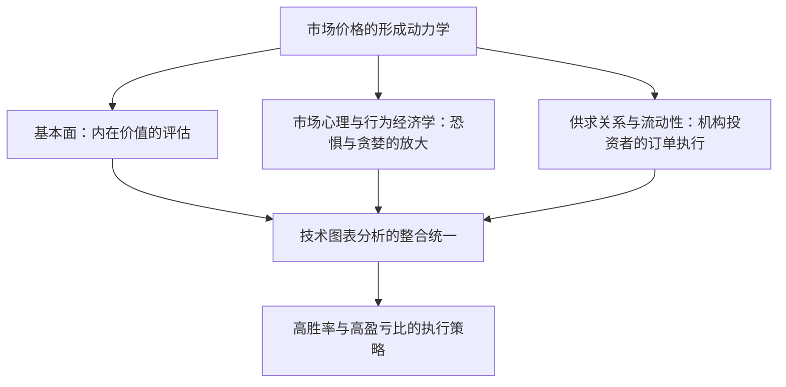
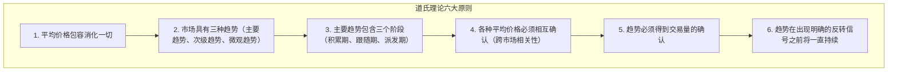
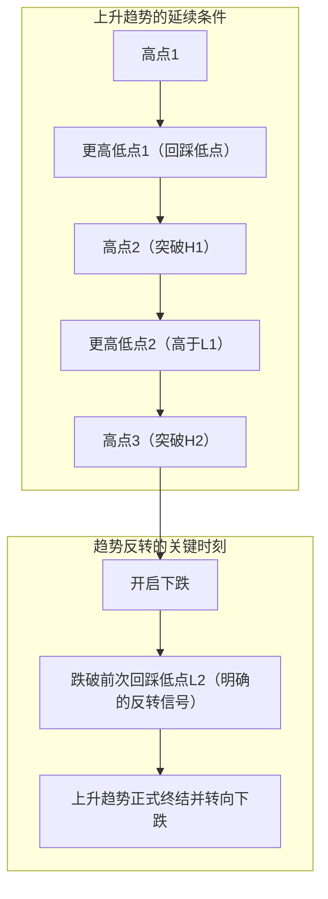
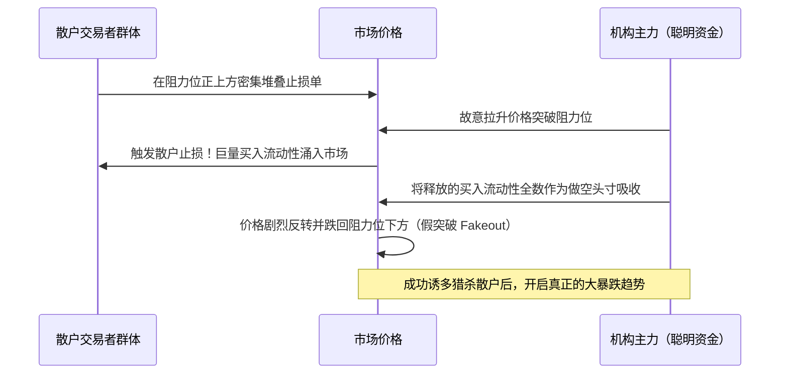
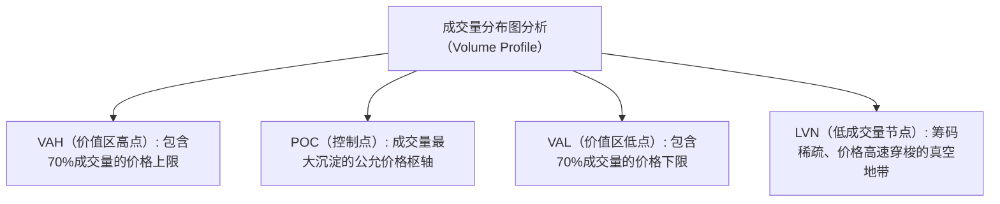

## 1. 序论：技术分析的哲学基石与市场本质

### 1.1 基本面分析与技术分析的对立与扬弃

在金融市场中，探寻价格形成机制并预测未来价格波动的途径，历来存在两大主要流派：即“基本面分析（Fundamental Analysis）”与“技术分析（Technical Analysis）”。

基本面分析通过评估企业财务报表、现金流、利率、GDP增长率、通胀率以及地缘政治风险等要素，测算资产的“内在价值（Intrinsic Value）”。当市场价格偏离其理论公允价值时，投资者便据此进行套利或价值投资决策。这一流派假设：市场价格在短期内可能处于非理性状态，但长期而言，终将向企业的真实基本面或宏观经济均衡点收敛。

与之相对，技术分析的研究对象则是从历史延续至今的“价格（Price）”、“成交量（Volume）”与“时间（Time）”本身的运行轨迹。技术分析大师深刻认识到，推动价格涨跌的直接原动力并非基本面数据本身，而是市场参与者解读这些基本面时所展现出的“群体心理、恐惧、贪婪、认知偏差以及资金流动性（Liquidity）”。

在现代高水平的专业交易实践中，这两者绝非水火不容，而是应当达成黑格尔哲学意义上的“扬弃（Aufheben）与统合”。基本面分析指明了“交易什么（标的选择）”，而技术分析则精确回答了“何时交易、在何处锁定风险（入场时机与风控边界）”。无论一家公司的财务数据多么靓丽，若处于整个市场的长期下行熊市洪流之中，其股价亦可能遭受数年阴跌；将这种隐藏在冰冷数字背后的价格动力学具象可视化，正是技术分析的真正威力所在。



---

### 1.2 “价格包容消化一切”：对有效市场假说（EMH）的批判与行为经济学

技术分析的第一公理是：**“市场价格瞬时包容并消化了一切当前可获得的信息（不仅涵盖公开资讯与内部消息，更包括市场预期、天灾人祸、地缘政治风险以及全体参与者的心理情绪）”**。

在传统学院派金融经济学中长期占据主导地位的“有效市场假说（Efficient Market Hypothesis: EMH）”的弱式有效性（Weak-Form Efficiency）认为：“历史价格与成交量信息已完全被当前价格所吸收，因此凭借技术分析绝不可能获取超越市场基准的超额收益（阿尔法收益 Alpha）”。

然而，20世纪80年代以来蓬勃发展的“行为经济学（Behavioral Economics）”与“行为金融学”，通过大量实验心理学证据无可辩驳地证实：有效市场假说关于“市场参与者皆为理性人”的核心假设在现实中彻底破产。
- 丹尼尔·卡尼曼（Daniel Kahneman）与阿莫斯·特沃斯基（Amos Tversky）开创的“前景理论（Prospect Theory）”揭示了人类深层的非对称认知偏差：人们在面对收益时表现为“风险规避”，而在面对损失时却表现为“风险偏好”。
- 锚定效应、羊群效应（Herding Behavior）、确认偏差、过度自信（Overconfidence）等普遍存在的心理偏向，不可避免地在金融市场中周期性滋生“严重超买（资产泡沫）”与“恐慌超卖（流动性危机）”。

技术分析绝非在随机波动的混沌中占卜未来的水晶球。它本质上是**“人类群体普遍存在的认知偏差投射在图表上所形成的、具有统计学正期望值的可重复几何形态密码破译体系”**。

---

### 1.3 随机游走理论与分形市场结构假说（曼德博）

针对技术分析的另一大经典学术批判是“随机游走理论（Random Walk Theory）”。该理论主张价格波动的概率分布服从正态分布（高斯分布），过去的价格轨迹与未来的价格演变之间不存在任何自相关性。

对这一古典假说给予致命颠覆的，正是分形几何学鼻祖伯努瓦·曼德博（Benoit Mandelbrot）。曼德博详尽剖析了长达数十年的棉花价格与外汇汇率超长期历史微观数据，用严谨的数学证明了以下铁律：

1. **肥尾效应（Fat Tails）**: 金融资产的价格变动并不服从正态钟形分布，而是遵循“幂律分布（Power Law）”。极端行情（黑天鹅事件）出现的真实频率，比正态分布理论模型预测的概率高出成千上万倍。
2. **波动率聚集（Volatility Clustering）**: 剧烈价格波动之后往往跟随剧烈波动，微弱波动之后往往延续微弱波动，资产收益率的方差存在显著的自相关性。
3. **自相似性（Self-Similarity）**: 当隐藏时间轴标签时，将1分钟图、日线图和月线图并列展示，即便是顶级资深交易员也无法单凭几何轮廓辨别其各自对应的时间周期。

这一**“市场的自相似分形结构”**，正是技术分析跨越时间周期依然高度有效的深层数理基石。大周期趋势内部嵌套着次级周期趋势，当多个周期的力量产生几何共振的瞬间，浩瀚的动能便喷薄而出。

---

## 2. 现代图表分析的基石：道氏理论六大原则及其现代再诠释

现代技术分析体系（艾略特波浪理论、葛兰碧法则、现代价格行为学等）的源头活水，皆发端于《华尔街日报》联合创始人查尔斯·道（Charles H. Dow, 1851–1902）所创立的“道氏理论（Dow Theory）”。道氏生前并未著书立说，仅以社论随笔形式阐发洞见。其逝世后，由萨缪尔·纳尔逊、威廉·汉密尔顿与罗伯特·雷亚等人梳理升华，提炼为著名的六大核心原则。



---

### 2.1 原则一：平均价格（市场价格）包容消化一切

诸如道琼斯工业平均指数等市场平均价格，全面折射了宏观景气度、企业盈利前景、央行利率政策、自然灾害、战争冲突以及全体市场参与者的心理博弈与实际动作。无论何等重磅的宏观数据或突发要闻，在公之于众的微秒之间已被市场价格消化完毕。等待基本面消息落地再进行操作在逻辑上必然处于滞后状态。深入观察图表本身的价格行为，才是最为前瞻且全息的信息获取途径。

---

### 2.2 原则二：市场具有三种趋势

道氏巧妙地借用海洋水文现象，将市场趋势划分为三个嵌套层级：

1. **主要趋势（Primary Trend: 潮汐潮流）**: 持续1年至数年以上的宏大基准趋势，决定了整个市场的根本方向。
2. **次级趋势（Secondary Trend: 海浪涌浪）**: 逆向拦截主要趋势的回撤调整阶段。通常维系3周至3个月，回撤幅度往往吞噬主要趋势波段的 $1/3$ 至 $2/3$（或 $1/2$ 半程）。
3. **微观趋势（Minor Trend: 水面涟漪）**: 短于3周（数小时至数日）的短期微弱波动。极易受到日内随机噪音和投机情绪的主导，甚至极易被人为操纵（Manipulation），单独针对微观趋势进行分析具有极高的风险。

在现代实战交易中，这演化为了**“多周期共振分析（Multi-Timeframe Analysis, MTF）”**的核心理论根基：以周线/日线（潮汐）定方向，以4小时线（海浪）寻回调，以15分钟/5分钟线（涟漪）捕捉精准入场点，正是道氏宏观智慧的生动传承。

---

### 2.3 原则三：主要趋势包含三个发展阶段

主要趋势（尤其是大级别牛市上涨趋势），伴随参与者心态与资金性质的质变，必然历经三个截然不同的发展阶段：


- **第一阶段：积累期（Accumulation: 吸筹阶段）**: 处于经济萧条或市场崩盘后的至暗时刻，市场笼罩在极度绝望中。最具洞察力的顶尖投资者（聪明资金 Smart Money、大型机构）开始悄然买入被极度低估的优质资产。盘面表现为长期窄幅横盘震荡，波动率极度压缩。
- **第二阶段：跟随期（Public Participation: 拉升阶段）**: 宏观经济指标与企业财报数据开始好转，顺势交易者和技术派投资者蜂拥入场。价格呈现快速单边上扬，这是周期最长、流动性最充裕、最易获取丰厚收益的主升浪。
- **第三阶段：派发期（Distribution: 出货阶段）**: 财经大众媒体每日连篇累牍大肆报道暴富神话，毫无交易经验的普通散户（愚钝资金 Dumb Money）陷入狂热跟风追高。此时，在第一阶段底部低价建仓的聪明资金，开始利用散户汹涌的买盘悄无声息地派发获利了结。盘面频现剧烈宽幅震荡与长上影线，趋势步入强弩之末。

---

### 2.4 原则四：各种平均价格必须相互确认

在查尔斯·道所处的时代，他将“工业股票平均价格指数”与“铁路股票平均价格指数（现运输指数）”进行联动比对。工厂制造出再多的工业产品，如果得不到铁路运输系统的流通交付，实体经济的繁荣就是虚假的泡影。因此，即便工业指数创出历史新高，若运输指数未能同步刷新高点形成确认，便绝不能草率定性为实质性牛市的到来。

在现代跨资产配置中，该原则升华为**“跨市场关联分析（Intermarket Analysis）”**与**“市场内部指标分析（Market Internals）”**：
- 标普500指数创出新高之际，纳斯达克科技股与罗素2000小型股是否同步刷新高点？
- 外汇市场中美日汇率的拉升，是否与美债长端收益率及美元指数（DXY）走势高度同频？
- 加密货币生态中，比特币的单飞独涨，是否有以太坊及主流山寨币的整体成交量配合跟进？

缺乏多维度相互确认（Confirmation）的孤立新高，极大概率是机构操盘制造的“多头陷阱（Bull Trap 骗线）”。

---

### 2.5 原则五：趋势必须得到交易量的确认

价格决定了趋势的“运动方向”，而成交量（Volume）则检验该趋势“内在动能的真实性”。

- **健康的上升趋势**: 价格上涨伴随成交量显著放大，回踩缩量整理。
- **健康的下降趋势**: 价格下挫伴随成交量急剧扩张，反弹乏力缩量。

若资产价格不断刷新历史新高，但成交量却呈现背道而驰的持续萎缩（量价背离 Volume Divergence），这便是极度凶险的警讯——预示着市场买盘流动性已经枯竭，仅仅依靠少量市价单在筹码稀薄区勉强托举。理查德·威科夫（Richard Wyckoff）正是将道氏这一原则推向极致，开创了通过量价分布破译主力机构意图的“量价分析（Volume Spread Analysis, VSA）”。

---

### 2.6 原则六：趋势在出现明确的反转信号之前将一直持续

在道氏理论的所有教条中，职业交易员在实操中最须刻入骨髓的便是这第六原则。

趋势的数学定义异常简洁而严谨：
- **上升趋势的定义**: **“高点持续抬高（Higher Highs），且回踩低点也持续抬高（Higher Lows）的几何排列状态”**
- **下降趋势的定义**: **“高点持续下移（Lower Highs），且回踩低点也持续下移（Lower Lows）的几何排列状态”**



无论资产价格涨幅多么惊人、主观感觉“已经高不可攀”，在K线收盘价明确跌破前期“有效回踩低点（Higher Low）”之前，上升趋势在技术定义上依然完整无损。凭个人主观猜测“这里大概是头部”而盲目逆势摸顶做空，是严重违背道氏第六原则的最危险行径。

---

## 3. 艾略特波浪理论与斐波那契数学的奥秘

### 3.1 拉尔夫·纳尔逊·艾略特的宇宙秩序论

如果说道氏理论界定了趋势的方向与反转临界点，那么将价格波动的“节奏韵律”与“几何分形性”推演至极致的，则是拉尔夫·纳尔逊·艾略特（Ralph Nelson Elliott, 1871–1948）。重病缠身的艾略特以惊人的毅力，纯手工复盘分析了长达75年跨度的道指月线、周线、日线乃至30分钟图表，于1938年发表了震古烁今的《波浪原理（The Wave Principle）》。

艾略特认为，人类的一切社会化活动与群体心理起伏，均遵循统治自然界一切有机生长过程（如鹦鹉螺对数螺旋、植物向日葵叶序、银河旋臂结构）的黄金分割比例与斐波那契数列。金融市场绝非无序的混沌，而是**由“5个推动浪（Impulse Waves）与3个调整浪（Corrective Waves）”构成的8浪完整基本循环**，并在不同时间维度无限自我嵌套的分形宇宙。

```mermaid
flowchart LR
    subgraph 推动浪（顺应主趋势：5浪结构）
        W1["第1浪<br/>（启动阶段）"] --> W2["第2浪<br/>（深度回撤）"]
        W2 --> W3["第3浪<br/>（主升爆发）"]
        W3 --> W4["第4浪<br/>（复杂整理）"]
        W4 --> W5["第5浪<br/>（最后的狂热）"]
    end
    subgraph 调整浪（逆向调整：3浪结构）
        W5 --> WA["A浪<br/>（下跌初动）"]
        WA --> WB["B浪<br/>（虚假反弹）"]
        WB --> WC["C浪<br/>（毁灭性暴跌）"]
    end
```

---

### 3.2 推动浪（冲击波）结构与三大铁律

在顺应主趋势方向运行的推动浪中，最具代表性的是“标准冲击波（Impulse Wave）”。在对其进行计数标记时，必须严格遵守**“不可逾越的三大绝对铁律”**。只要违反其中任意一条，该波浪计数判定即告作废，必须立即推倒重来：

1. **铁律一：第2浪的回撤幅度，绝对不能击穿第1浪的起涨点（不能产生100%以上的反向回撤）。**（一旦击穿，说明这绝非第1浪，而是此前下跌趋势的延续）。
2. **铁律二：在第1浪、第3浪和第5浪这三个推动子浪中，第3浪绝对不能是最短的一个浪。**（通常情况下，第3浪往往是爆发出惊人延伸浪 Extension 的最长、最具杀伤力的主升浪）。
3. **铁律三：第4浪的最低点（回踩底），绝对不能与第1浪的最高点（浪顶领地）产生重叠（Overlap）。**（在上升趋势中，第4浪若跌入第1浪价格区间，则该结构绝非标准冲击浪，而是演化为楔形引导/终结对角线等特殊异型）。

#### 各波浪的微观交易心理特征
- **第1浪**: 熊牛转换的隐秘初动。此时宏观基本面依然充斥着悲观利空，绝大多数市场参与者将其视为大跌途中的短暂超跌反弹，买盘动能相对温和。
- **第2浪**: 对第1浪成果的凶猛报复性回吐。众多散户恐慌抛售，深信“熊市再度重启”，导致回撤幅度极深，通常深探至第1浪涨幅的 $50\% \sim 61.8\%$（甚至 $78.6\%$）。但其底线是绝不破第1浪发起点。
- **第3浪**: 技术形态全面破位上扬，突破信号彻底确立，海量技术派资金排山倒海般涌入。成交量呈几何级数爆发，连续跳空高开高走，形成速度最快、幅度最大的主升浪。这是职业交易员必须重仓出击、截取最丰厚利润的黄金浪。
- **第4浪**: 针对第3浪巨大浮盈的获利回吐与未上车资金逢低买入的激烈交锋。震荡周期极其漫长，形态上多呈现三角形、旗形等复杂的横盘中继结构（**交替原则 Rule of Alternation**: 若第2浪为干脆利落的急速空间回调，则第4浪必为漫长复杂的横向时间震荡）。
- **第5浪**: 宏观基本面利好完全兑现，街头巷尾大众沉醉在狂热情绪中的最后冲刺。然而，RSI、MACD等动量指标往往已无法跟随价格刷新高点，显著形成“顶背离”，昭示着多头内部动能的彻底衰竭。

---

### 3.3 调整浪（修正浪）分类学

推动浪结束后的调整行情，其形态多变性与结构复杂度远超推动浪。艾略特将其归纳为三大基础形态原型：

1. **锯齿形（Zigzag: 5-3-5结构）**: 极其陡峭且空间深度的剧烈调整。由A浪（5浪下跌） $\to$ B浪（3浪反抽，反弹至A浪的 $38.2\% \sim 50\%$） $\to$ C浪（5浪凌厉下跌，其下跌长度通常与A浪等长）。
2. **平坦形（Flat: 3-3-5结构）**: 呈现横向拉锯的箱体震荡。A浪（3浪） $\to$ B浪（3浪，反弹能够触及A浪起点附近） $\to$ C浪（5浪，仅仅轻微刺破A浪低点）。在强势牛市中，经常出现B浪刷新A浪高点、随后C浪快速回落的“扩散平坦形（Expanded Flat）”。
3. **三角形（Triangle: 3-3-3-3-3结构）**: 多空力量暂时势均力敌，震荡幅度层层收敛的收缩形态（由A-B-C-D-E五个子浪构成）。三角形调整仅出现在“最后一个推动浪来临之前的最后一次调整”（如第4浪或修正浪中的B浪），一旦向上突破，便会激发极速凶猛的终极冲刺（第5浪推力）。

---

### 3.4 斐波那契比率与波浪目标位预测计算公式

艾略特波浪理论之所以让量化交易大师叹为观止，关键在于由斐波那契数列（0, 1, 1, 2, 3, 5, 8, 13, 21, 34, 55, 89, 144...）所衍生出的黄金分割比率，能够以数学公式极其严谨地预测行情未来的回调位与拓展目标位。

核心斐波那契常数：
- $\phi = \frac{\sqrt{5}-1}{2} \approx 0.618$
- $1 - \phi \approx 0.382$
- $\sqrt{0.618} \approx 0.786$
- $1.618$ （黄金分割拓展比率）
- $2.618, 4.236$

#### 实战目标位推导公式
1. **第2浪回踩支撑位**: 针对第1浪垂直空间高度的 **$61.8\%$** 或 **$50.0\%$**，极限深幅回撤位见 **$78.6\%$**。
2. **第3浪理论爆发目标点**: 设第1浪垂直高度为 $W_1$，第2浪回踩终点为 $L_2$，则：
   $$Target(W_3) = L_2 + 1.618 \times W_1$$
   在超级单边延伸主升行情中，可进一步测算：
   $$Target(W_3) = L_2 + 2.618 \times W_1$$
3. **第4浪回调支撑位**: 针对第3浪整体涨幅的 **$38.2\%$**（浅度回踩），或与第3浪内部次级第4小浪的底部精准重叠。
4. **第5浪拓展目标位**: 将第1浪至第3浪整体波动空间的 **$61.8\%$**，自第4浪回调底部叠加向上投影。

---

## 4. 东方的智慧：K线形态学与酒田五法

西方技术分析起源于折线图与条形图（Bar Chart），而早在18世纪日本江户时代的享保年间，大阪堂岛大米交易所便诞生了全球最早的标准化大宗期货交易与图表分析体系。传奇相场师本间宗久（1724–1803）将其毕生盘感与心理洞察凝结为《三猿金泉秘录》，后经世人提炼为名震天下的“酒田五法”。

---

### 4.1 K线（蜡烛图）的内部动力学

单根K线（Candlestick）将指定时间窗口内的“开盘价（Open）”、“最高价（High）”、“最低价（Low）”与“收盘价（Close）”四个关键变量，通过实体的阴阳与上下影线的伸缩进行了极其生动的视觉化呈现。

20世纪80年代末，史蒂夫·尼森（Steve Nison）凭借名著《日本蜡烛图技术（Japanese Candlestick Charting Techniques）》将这一瑰宝引入华尔街，其展现的实时供求博弈与微观心理透视力彻底征服了全球投资界，成为当今全世界通用的图表基准。

| K线形态 | 形态特征 | 内部市场心理与动力学 |
| :--- | :--- | :--- |
| **大阳线（光头光脚 / Marubozu）** | 实体极长，几乎没有上下影线。 | 从开盘到收盘，多头自始至终绝对掌控市场。极强的看涨信号。 |
| **锤头线 / Pinbar（Hammer）** | 实体较小且收在上方，下影线长度达到实体的2倍以上。 | 空头曾发动猛烈打压，但在低位遭遇极其强悍的买盘支撑，空头被彻底吸收并推回开盘价附近。**见底反转的最强信号**。 |
| **流星线 / 倒锤头（Shooting Star）** | 实体较小且收在下方，上影线长度达到实体的2倍以上。 | 多头曾尝试向上冲击新高，但在高位遭遇沉重抛压（机构出货），被彻底击退并大幅回落。**见顶反转的看跌信号**。 |
| **十字星（Doji）** | 开盘价与收盘价几乎完全相同，实体呈一条线或十字架形状。 | 多空双方动能达到完全均衡的瞬间。预示震荡整理的延续，或重大趋势反转的前兆。 |

---

### 4.2 酒田五法的精髓

酒田五法是通过多根K线的组合排列，研判多空力量盛衰交替的五大经典定式：

1. **三山（San-zan / 头肩顶 / 三顶）**: 在高位区域三次冲顶均无法突破形成的顶部。其中中间山峰最高的形态被称为“三尊顶（Head and Shoulders Top）”，跌破颈线的瞬间宣告大级别下行熊市确立。
2. **三川（San-sen / 倒头肩 / 三底 / 早晨之星）**: 在底部区域三次探底企稳的结构（逆三尊/三重底）。亦包含如“早晨之星（Morning Star）”那般由大阴线、星线、大阳线三根K线构筑的经典止跌反转组合。
3. **三空（San-ku / 三个跳空缺口）**: 顺应趋势方向连续跳空高开或低开三次。“三空跳空买盘枯竭宜卖出，三空下挫杀跌穷尽宜买入”。连续出现三到四个跳空缺口，往往代表市场群体情绪已达非理性狂热或恐慌的极致，预示动能彻底燃尽的竭尽性高潮。
4. **三兵（San-pei / 三兵线）**: “红三兵（连续收出三根稳步向上的阳线）”宣告底部逆转确立、强劲牛市启航。但若第三根阳线上影线过长，则称为“红三兵受阻（先诘）”，须提防短线动能衰竭。反之，高位出现的“黑三兵（三只乌鸦）”则是暴跌雪崩的先兆。
5. **三法（San-po / 三法）**: 深刻诠释“休息亦是交易的一部分”的修生养息哲学。最具代表性的是“上升三法”：在大阳线突破之后，连续紧跟三根小阴线在其大阳线实体区间内缩量孕育横盘，随后第五根大阳线再度长阳拔起、突破前期高点。此形态精准捕捉趋势运行中的中继回踩与动能蓄势。

---

## 5. 技术指标的数学结构与实战陷阱

在图表上通过数学公式绘制的辅助指标，本质上分为两大阵营：“趋势型指标（顺势系统）”与“震荡型指标（逆势/动量系统）”。无数业余交易者因为未曾深入理解指标底层的数学推导逻辑，生搬硬套买卖信号，最终蒙受灭顶之灾。在此，我们对其数理内核进行全景解剖。

### 5.1 趋势型指标的数学原理

#### ① 移动平均线（SMA 与 EMA）
最基础的算术简单移动平均线（SMA: Simple Moving Average）在周期 $n$ 下的数学表达如下：
$$SMA_t = \frac{1}{n} \sum_{i=0}^{n-1} P_{t-i}$$
SMA致命的理论缺陷在于：对“当下的最新价格”与“ $n$ 天前的陈旧历史价格”赋予了完全相同的平庸权重（$1/n$）。这种无差别的权重分配导致指标对于行情的剧烈转折产生严重的信号滞后（Lagging）。

指数平滑移动平均线（EMA: Exponential Moving Average）针对该缺陷做出了革命性的数学改进。它对最新价格 $P_t$ 赋予最大权重，并使历史数据的权重随着时间推移呈指数级衰减。设定平滑平滑系数 $\alpha = \frac{2}{n+1}$，其递推公式为：
$$EMA_t = \alpha P_t + (1 - \alpha) EMA_{t-1}$$
由于EMA对近期的价格跳动反应极其灵敏，在现代高频日内交易与算法交易策略中，专业机构普遍使用EMA系统（如20EMA、50EMA、200EMA）彻底取代了陈旧的SMA。

#### ② 布林带（Bollinger Bands）
约翰·布林格（John Bollinger）在20世纪80年代研发的布林带，是在价格移动平均线基准之上，按数理统计学原理叠加标准差（$\sigma$）包络通道的指标：
$$Middle = SMA_n(P)$$
$$\sigma = \sqrt{\frac{1}{n} \sum_{i=0}^{n-1} (P_{t-i} - Middle)^2}$$
$$Upper = Middle + k \cdot \sigma, \quad Lower = Middle - k \cdot \sigma \quad (\text{通常 } k=2)$$

在标准正态分布的假设下，数据落在均值 $\pm 2\sigma$ 边界内部的理论概率高达 **$95.44\%$**。
然而，这里埋藏着让无数盲信者破产的最大陷阱：**金融市场的价格波动从来不是正态分布（存在极端的肥尾效应）**。
因此，“触碰上轨 $+2\sigma$ 说明超买，应当逆势做空”是荒谬透顶的自杀用法。一旦单边超级主升浪爆发，价格往往会沿着上轨不断将通道强行向上撕裂，走出长达数周紧贴通道边缘的单边暴涨（**带轨运行 Band Walk**）。布林带的真正高阶精髓，在于观察通道极度收窄变细的“收口蓄势（Squeeze: 波动率被压抑至极限）”，随后在通道喇叭口剧烈张开的“扩张爆发（Expansion）”瞬间，毫不犹豫地顺势追击突破。

---

### 5.2 震荡型指标的数学原理

#### ① RSI（相对强弱指数）
由J.威尔斯·威尔德（J. Welles Wilder）开创的RSI，旨在统计指定回溯周期（默认14天）内“上涨价差总和”与“下跌价差总和”的相对力量，将多空动能归一化至 $0 \sim 100\%$ 的区间刻度：
$$RS = \frac{\text{过去 } n \text{ 天平均涨幅}}{\text{过去 } n \text{ 天平均跌幅}}$$
$$RSI = 100 - \frac{100}{1 + RS} = \frac{\text{平均涨幅}}{\text{平均涨幅} + \text{平均跌幅}} \times 100$$

尽管常规教科书将其界定为“70%以上为超买，30%以下为超卖”，但在激烈的单边大趋势中，RSI长时间钝化锚定在80%以上、而资产价格在此期间再度翻倍的现象屡见不鲜。
RSI最具实战杀伤力的核心信号，当属**“背离（Divergence）”**机制：
- **顶背离（看跌背离 Bearish Divergence）**: 当价格创出更高的高点，而RSI的高点却显著下移。这表明驱动价格上涨的内部真实买盘动能正在急速枯竭，趋势反转崩塌已近在咫尺。

```mermaid
flowchart TD
    subgraph 顶背离（看跌背离）的运作机制
        P1["价格：高点A"] --> P2["价格：高点B（刷新更高高点！）"]
        R1["RSI：峰值A（80%）"] --> R2["RSI：峰值B（回落至65%）"]
    end
    P2 --> WARNING["内部动能竭尽"]
    R2 --> WARNING
    WARNING --> CRASH["顶部崩溃与暴跌反转发生"]
```

---

## 6. 现代价格行为理论与聪明资金概念（SMC）

步入2010年代后，以华尔街为代表的机构高频算法交易（HFT）与人工智能量化模型在全市场交易份额中占比已超过80%，导致MACD、KDJ等传统技术指标的有效性遭到严重钝化。在这一时代背景下，摒弃一切滞后指标、仅依托纯净K线图（Raw Chart）与真实订单流的“价格行为学（Price Action）”以及“聪明资金概念（Smart Money Concepts, SMC）”迅速确立了其作为全球职业交易界的现代行业标准。

### 6.1 流动性掠夺与扫损机制（Liquidity Sweep）

SMC的终极底层世界观是：**“市场价格波动的本质，永远是向着全场未平仓止损单（流动性 Liquidity）最密集堆积的价格黑洞发起定向猎杀”**。

毫无自保能力的普通散户交易者（Retail Traders）由于接受的是同质化的基础教育，习惯于将止损单集中摆放在极易被识别的“教科书式双重顶正上方”或“震荡区间下沿正下方”。然而，掌控数百亿美元规模的机构巨鲸（聪明资金 Smart Money），若想完成自身庞大头寸的建仓建仓，若不主动激发这些散户的集中止损单，其买卖订单根本无法在不引发剧烈滑点冲击成本的前提下被平滑吸收。

1. **流动性扫荡（Liquidity Sweep）**: 机构主力故意用资金将价格短暂推过极为瞩目的前期关键高点或低点。
2. 此时，散户预设的止损单（突破追多单、多头止损平仓卖单）被成批触发引爆，向市场瞬间释放出极其庞大的对手盘流动性。
3. 机构主力恰恰将这批被动涌入的散户流动性悉数吞噬，作为自己反向建仓的对手盘，随后瞬时反手将价格拉回震荡区间内部（**假突破 Fakeout**）。
4. K线上由此留下触目惊心的**超长影线（Pinbar）**，在散户被彻底爆仓洗出局的同时，价格以排山倒海之势向着真正的反向目标暴烈狂飙。



---

### 6.2 公平价值缺口（FVG）与订单块（Order Block）

在SMC执行框架中，最具核心威力的进场抓手当属“FVG（不平衡区间）”与“订单块（OB）”：

- **公平价值缺口（Fair Value Gap, FVG）**: 当机构以狂暴的速度注入巨额资金时，在连续的三根K线中，第1根K线的最高价与第3根K线的最低价之间会产生一段完全没有双向撮合成交的真空缝隙。高频做市算法在底层逻辑上极度排斥这种微观流动性不平衡（Imbalance），在后续行情中必然会驱动价格重新回撤回补该真空地带。耐心等待行情回踩填补FVG的刹那入场，能够以极窄的止损博取极其悬殊的超高盈亏比。
- **订单块（Order Block, OB）**: 机构在掀起破位主升或暴跌行情之前，最后一次反向逆势吸筹（或压制出货）留下的那一组高实体K线聚合区。该筹码密集区将在未来数天或数周内，化身为盘面上坚不可摧的高胜率终极支撑或强阻力壁垒。

---

## 7. 决胜的终极疆域：盈亏比与资金管理的数学法则

即便交易者将技术分析修炼至炉火纯青，若藐视资金管理（Money Management）的数学铁律，其在概率论的世界中终将 **$100\%$ 必然遭遇爆仓破产**。交易从不是“算命占卜未来的玄学游戏”，而是一场**“在破产概率严格恒等于零的前提下，不断机械重复具备正期望值优势（Edge）的独立统计学试验商业系统”**。

### 7.1 巴萨拉破产概率（Risk of Ruin）的数学论证

法国数学家瑙泽·巴萨拉（Nauzer Balsara）创立了严谨的数理概率模型，通过“胜率（Win Rate）”、“盈亏比（Payoff Ratio / Risk-Reward Ratio）”以及“单笔交易风险承受比例（单笔亏损占总本金的百分比）”三大核心变量，严格推导出了交易者最终面临资产归零破产的必然概率。

- **胜率（$W$）**: 盈利交易笔数 $\div$ 总交易笔数
- **盈亏比（$R$）**: 平均单笔盈利金额 $\div$ 平均单笔亏损金额

下表展示了在每次交易均押注总本金 **$20\%$** 高风险极端情境下，巴萨拉破产概率的测算矩阵（近似理论值）：

| 胜率 \ 盈亏比 ($R$) | 0.5（亏大盈小） | 1.0（盈亏等额） | 1.5（盈大亏小） | 2.0（理想盈亏比） | 3.0（超高盈亏比） |
| :---: | :---: | :---: | :---: | :---: | :---: |
| **30%** | 100% | 100% | 100% | 80.0% | 14.3% |
| **40%** | 100% | 100% | 38.2% | 14.1% | 1.2% |
| **50%** | 100% | 50.0% | 5.6% | 0.8% | **0.0%** |
| **60%** | 100% | 2.1% | 0.1% | **0.0%** | **0.0%** |
| **70%** | 14.3% | **0.0%** | **0.0%** | **0.0%** | **0.0%** |

该数理模型揭示了让所有初学者冷汗直流的残酷真相：**“即便你拥有高达60%的优异胜率，但若你的盈亏比仅为0.5（赚1块钱却要冒亏2块钱的风险），你的长期破产概率依然是无情的100%！”** 新手往往盲目迷信90%高胜率圣杯，平时如蚂蚁搬家般积攒微利，最终却在一场黑天鹅行情中扛单爆仓、满盘皆输，其深层根源全在于无视了这一数学铁律。

相反，**哪怕你的真实胜率低至区区40%，只要坚持执行2.0的盈亏比（平均盈利是平均亏损的2倍），破产概率即刻暴跌至14%；若能优化至3.0的盈亏比，破产概率仅剩微不足道的1.2%，账户资产必将在大数定律的保驾护航下呈现指数级稳步扩张**。

---

### 7.2 2%风险原则与定量头寸规模（仓位）计算公式

顶尖专业交易员的绝对铁律是：**“将任何单笔交易的最大潜在亏损金额，严格锁定在账户总资产的 $1\% \sim 2\%$ 之间”**（即著名的2%法则）。

绝大多数业余散户的致命错误，在于习惯性使用固定的交易手数（例如“每次不论行情如何一律开仓1手”）。这种做法极其业余，因为基于图表形态设定的合理技术止损点位，在每笔交易中由于波动率的变化绝不可能完全一致。

科学的头寸规模（仓位手数）动态计算公式如下：

$$Position\_Size = \frac{Account\_Balance \times Risk\_Percentage}{|Entry\_Price - Stop\_Loss\_Price|}$$

#### 实战测算案例
- 账户总资金: $10,000,000$ 日元
- 设定的风险比例: $2\%$ （即该笔交易最大允许承受亏损 $= 200,000$ 日元）
- 计划入场价格: $150.00$ 日元（以美元/日元货币对为例）
- 依据技术支撑位确立的止损价格: $149.20$ 日元（技术止损空间 $= 0.80$ 日元 $= 80$ 点 pips）

此时，该笔交易唯一允许下单的头寸规模为：
$$Position\_Size = \frac{200,000 \text{ 日元}}{0.80 \text{ 日元}} = 250,000 \text{ 货币单位（即 2.5 标准手）}$$

若在某次高精度共振进场中，技术止损空间被压缩至仅有 $0.40$ 日元（40点），则开仓头寸可科学放大至 $5.0$ 手；反之，若在日线宽幅震荡中，合理技术止损空间达 $1.60$ 日元（160点），则下单仓位必须被迫压缩降至 $1.25$ 手。**“为了保证每次试错的风险本金绝对恒定，必须由止损距离倒逼头寸规模发生动态弹性调整”**。这是抵御任何极端恶性连败、确保账户基业长青的唯一数理防波堤。

---

### 7.3 展望理论与克服心理认知偏差

为何如此清晰明了的资金管理准则，绝大多数人在实战中却会主动违背？这根植于人类大脑漫长进化历程中的基因宿命。

在远古采集狩猎时代，人类祖先在丛林中捕获的猎物必须立刻吞食殆尽，否则就会腐烂变质或被野兽争夺；同时，面对危及生命的致命创伤，拼死抵抗到底往往能换来生存的一线生机。

然而，这种原始的生物学自我防御本能，在以概率论构建的现代金融交易市场中，瞬间异化为了最致命的精神毒药：
1. **盈利状态下的风险规避（过早止盈落袋）**: 一旦账面浮盈，源于潜意识深处“害怕到手利益丧失”的原始恐惧便迅速占据心智，促使交易者在刚刚斩获数个点位的微利时便慌忙平仓，彻底错失后方的大波段主升浪。
2. **亏损状态下的风险偏好（死扛不止损与逆势摊平）**: 一旦账面被套浮亏，“绝不认错认赔”的强烈认知防御机制便全面激活，交易者开始违规下移止损线，甚至在绝望中不断追加仓位“逆势补仓（加仓摊平成本）”，最终将整个账户的命运交付给侥幸与祈祷。

在金融交易的漫长征程中，最终让胜者脱颖而出的终极圣杯，绝非更繁复花哨的指标组合，而是**“深刻觉察并战胜自身基因中不可磨灭的前景理论诅咒，如同精密机器般毫无杂念地机械执行概率与正期望值法则的非凡自律意志”**。

---

## 7.4 凯利公式（Kelly Criterion）的数学原理与实战半凯利运作

在资金管理数学的殿堂中，与巴萨拉破产概率并驾齐驱的另一座划时代丰碑，是1956年贝尔实验室物理学家约翰·拉里·凯利（John Larry Kelly Jr.）基于信息论推导确立的“凯利公式（Kelly Criterion）”。

凯利公式旨在测算：在复利滚动投资环境下，使资产规模几何平均增长率（资金对数期望增长率）实现最大化的数学最优下注仓位比例 $f^*$：

$$f^* = \frac{b \cdot p - q}{b} = p - \frac{q}{b}$$

其中：
- $p$: 交易胜率（满足 $0 \le p \le 1$）
- $q = 1 - p$: 交易败率
- $b$: 真实赔率 / 净盈亏比（单笔预期平均净利润 $\div$ 单笔平均亏损额）

### 凯利公式实操测算及其毁灭陷阱
假设某量化系统具备显著统计优势：真实胜率 $p = 0.55$（55%），平均盈亏比 $b = 1.5$（盈亏比 1:1.5）：
$$f^* = \frac{1.5 \times 0.55 - 0.45}{1.5} = \frac{0.825 - 0.45}{1.5} = \frac{0.375}{1.5} = 0.25 \quad (25\%)$$

纯数学推导给出的结论极其激进：每笔交易应当押注总资产的 **$25\%$**，方可在数学上达成资本裂变增长的最快速度。
然而，在真实瞬息万变的金融博弈中执行全凯利（Full Kelly）模式，无异于**“慢性自杀”**。因为凯利公式建立在一个脱离现实的理论假定之上——即系统真实的母体胜率与赔率分布在未来恒定不变。

一旦遭遇市场宏观体制转换（Regime Shift）导致系统有效性暂时钝化，或者遭遇统计学上必然会出现的连续7次连败，高达25%的全凯利押注将直接引发账户净值超过 **$80\%$** 的毁灭性最大回撤（Drawdown），导致交易者陷入无法挽回的心理崩溃。

### 半凯利（Half-Kelly）策略的绝对压制优势
正因如此，当代量化对冲基金与顶级自营交易员，在实践中普遍将理论凯利比例减半甚至降至四分之一，即推行**“半凯利（Half-Kelly）”**资金管理范式：
- 采用半凯利（$f^* / 2$）配置时，系统能够稳稳保留理论全凯利最大资产增长速度的近 **$75\%$**，同时将资金净值波动率与最大历史回撤幅度**剧烈削减 $50\%$ 以上**。
- 在上述测算案例中，半凯利将下注风险压降至 $12.5\%$，更为稳健的“四分之一凯利”则降至 $6.25\%$。在此基础之上，再施加前述“2%法则”的单笔实操风险硬性上限拦截，资产净值便获得了坚如磐石的数理稳定性与抗脆弱性。

---

## 7.5 成交量分布图（Volume Profile）与控制点（POC）结构

传统图表中的成交量指标，普遍以垂直柱状图的形式堆叠在界面底部（时间维度成交量 Volume by Time）。然而，在当代机构高频交易与算法监控的核心武器库中，将成交量以横向柱状图的方式锚定在价格右轴的**“成交量分布图（Volume Profile / VPVR）”**，已成为追踪主力踪迹不可或缺的王牌工具。



1. **控制点（Point of Control, POC）**: 在选定统计时间周期内，全场实际撮合成交量最为庞大的单一价格水平。这是全场所有买卖双方共同认可的“公允价值（Fair Value）”引力中枢。当价格脱离该区域时，POC如同一块强大的磁石，随时对价格施加强烈的均值回归吸附力。
2. **价值区（Value Area, VA）**: 累计成交量达到全场总成交量 **$70\%$**（严格对应正态分布的 $1\sigma$ 标准差区间）的价格波动带。
   - **VAH（Value Area High / 价值区高点）**: 价值区核心上限，在反弹中充当强悍的阻力阵地。
   - **VAL（Value Area Low / 价值区低点）**: 价值区核心下限，在下挫中构筑坚实的支撑防线。
3. **低成交量节点（Low Volume Node, LVN）**: 在柱状分布中呈现深凹谷底的稀疏价格带。此区域代表多空双方极少达成共识撮合的“流动性真空区”。一旦价格受外力驱使突入LVN区间，由于缺乏对手盘的实质阻击，价格往往会以令人窒息的高速毫无阻力地瞬间穿透而过。

借助成交量分布图，交易者便不再局限于依赖主观绘制的前期高低点水平线，而是如同拥有了X光透视机一般，能够瞬间洞穿大体量真金白银真正沉淀对垒的深层底牌。

---

## 7.6 多周期共振同步执行协议（MTF）

在顶尖自营交易大厅的实战一线，每一笔交易指令的发出，均严格按照以下五步递进的多周期共振协议机械执行：

| 时间周期 | 职责定位 | 监控要素与决策内容 |
| :--- | :--- | :--- |
| **1. 周线 / 日线** | 大局环境研判（海洋潮汐） | 主要趋势（道氏理论高低点排列）、200 EMA倾角、宏观关键支撑与阻力带。 |
| **2. 4小时线** | 交易构架建立（波浪结构） | 艾略特波浪计数（当前处于主升第3浪还是第4浪回调）、斐波那契回撤（是否触及61.8%黄金分割位）。 |
| **3. 1小时线** | 锁定流动性（猎物标记） | FVG（公平价值缺口）、订单块（Order Block）、前期关键高低点的流动性池（Liquidity Pool）标记。 |
| **4. 15分钟线** | 确认微观反转 | 次级周期上的特征转变（CHoCH: Change of Character）、突破前次回撤高点或跌破前次回踩低点。 |
| **5. 5分钟 / 1分钟线** | 精准入场执行（扣动扳机） | 锤头线/Pinbar、吞没形态（Engulfing）、确立极窄止损位、按头寸公式严密计算手数并挂单执行。 |

唯有当大级别的环境大势与微观周期的触发信号形成完美契合的“合流点（Confluence）”之时，方可冷酷地扣动开仓扳机。在其余所有未形成共振的杂乱时间里，坚决空仓静观盘面波澜不惊——这正是让职业选手的资金净值曲线如火箭般稳步攀升的至高机密。

---

## 8. 结论：作为自我心智管理的交易之道

探索技术图表分析的极致边界，表面看似是一场征服外部莫测市场的宏大远征，而究其本真，实则是一场驯服自身内在潜意识与贪婪欲望的“心智修行”。

K线图表是一部无比宏伟的巨型投影仪，它实时交织着全世界数以亿计的人类交易员、高频算法代码、主权央行与对冲基金经理的希望、绝望、心机与狂妄。那跳动在屏幕上的一根根K线，是人类作为一种生物在财富战场上最真实的生命脉搏。

- 依凭**道氏理论**洞悉浩瀚潮汐的宏观起伏，
- 借助**艾略特波浪与斐波那契数学**丈量市场内在的几何韵律，
- 运用**酒田五法与现代价格行为**破译盘口多空微观博弈的真相，
- 依托**巴萨拉数理与凯利法则**构建坚如磐石的资金管理长城以封印一切破产风险。

当这套高度统合的现代交易体系真正与你的呼吸融为一体时，眼前那原本看似无常混乱的K线波动，终将洗净铅华，化为一曲充满崇高和谐美感与统计概率秩序的“金融交响乐”。
