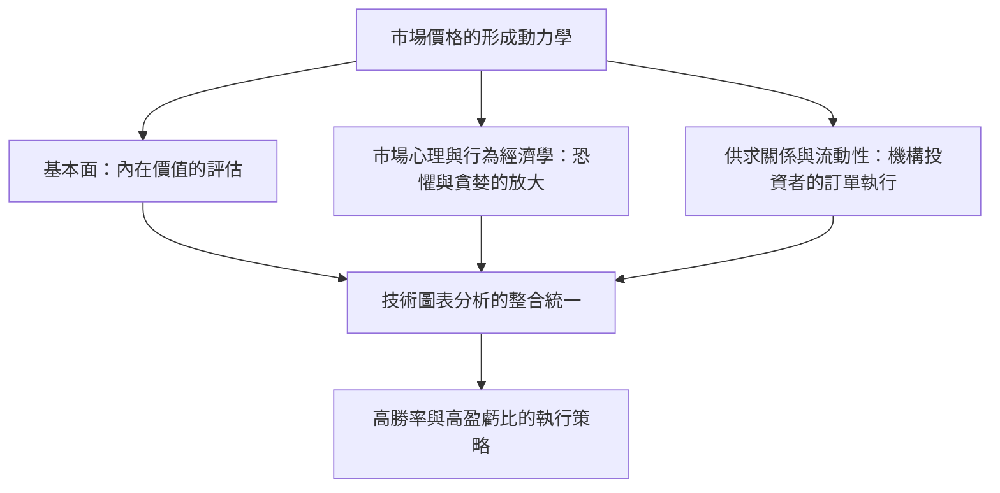
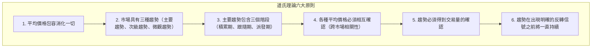
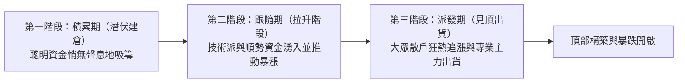
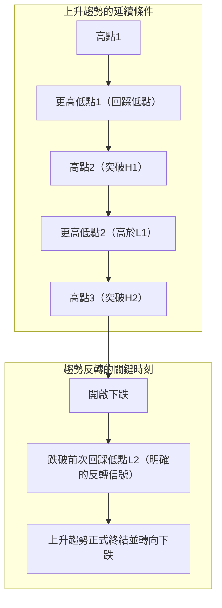
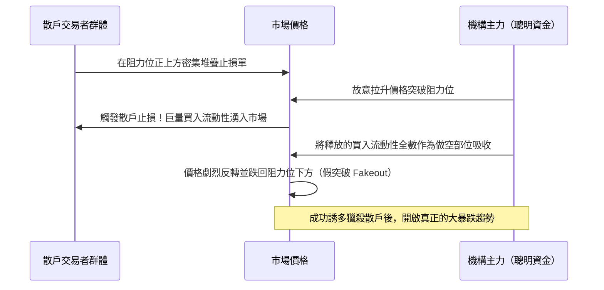
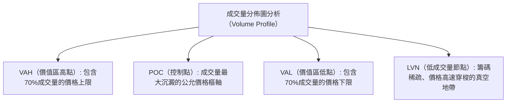

## 1. 序論：技術分析的哲學基石與市場本質

### 1.1 基本面分析與技術分析的對立與揚棄

在金融市場中，探尋價格形成機制並預測未來價格波動的路徑，歷來存在兩大主要流派：即「基本面分析（Fundamental Analysis）」與「技術分析（Technical Analysis）」。

基本面分析透過評估企業財務報表、現金流、利率、GDP成長率、通膨率以及地緣政治風險等要素，測算資產的「內在價值（Intrinsic Value）」。當市場價格偏離其理論公允價值時，投資人便據此進行套利或價值投資決策。這一流派假設：市場價格在短期內可能處於非理性狀態，但長期而言，終將向企業的真實基本面或總體經濟均衡點收斂。

與之相對，技術分析的研究對象則是從歷史延續至今的「價格（Price）」、「成交量（Volume）」與「時間（Time）」本身的運行軌跡。技術分析大師深刻認識到，推動價格漲跌的直接原動力並非基本面數據本身，而是市場參與者解讀這些基本面時所展現出的「群體心理、恐懼、貪婪、認知偏差以及資金流動性（Liquidity）」。

在現代高水準的專業交易實踐中，這兩者絕非水火不容，而是應當達成黑格爾哲學意義上的「揚棄（Aufheben）與統合」。基本面分析指明了「交易什麼（標的選擇）」，而技術分析則精確回答了「何時交易、在何處鎖定風險（進場時機與風控邊界）」。無論一家公司的財務數據多麼亮麗，若處於整個市場的長期下行熊市洪流之中，其股價亦可能遭受數年陰跌；將這種隱藏在冰冷數字背後的價格動力學具象視覺化，正是技術分析的真正威力所在。



---

### 1.2 「價格包容消化一切」：對有效市場假說（EMH）的批判與行為經濟學

技術分析的第一公理是：**「市場價格瞬時包容並消化了一切當前可獲得的資訊（不僅涵蓋公開資訊與內部消息，更包括市場預期、天災人禍、地緣政治風險以及全體參與者的心理情緒）」**。

在傳統學院派金融經濟學中長期佔據主導地位的「有效市場假說（Efficient Market Hypothesis: EMH）」的弱式有效性（Weak-Form Efficiency）認為：「歷史價格與成交量資訊已完全被當前價格所吸收，因此憑藉技術分析絕不可能獲取超越市場基準的超額報酬（阿爾法收益 Alpha）」。

然而，20世紀80年代以來蓬勃發展的「行為經濟學（Behavioral Economics）」與「行為財務學」，透過大量實驗心理學證據無可辯駁地證實：有效市場假說關於「市場參與者皆為理性人」的核心假設在現實中徹底破產。
- 丹尼爾·康納曼（Daniel Kahneman）與阿摩司·特沃斯基（Amos Tversky）開創的「展望理論（Prospect Theory）」揭示了人類深層的非對稱認知偏差：人們在面對收益時表現為「風險規避」，而在面對損失時卻表現為「風險偏好」。
- 錨定效應、羊群效應（Herding Behavior）、確認偏差、過度自信（Overconfidence）等普遍存在的心理偏向，不可避免地在金融市場中週期性滋生「嚴重超買（資產泡沫）」與「恐慌超賣（流動性危機）」。

技術分析絕非在隨機波動的混沌中占卜未來的水晶球。它本質上是**「人類群體普遍存在的認知偏差投射在圖表上所形成的、具有統計學正期望值的可重複幾何型態密碼破譯體系」**。

---

### 1.3 隨機漫步理論與碎形市場結構假說（曼德博）

針對技術分析的另一大經典學術批判是「隨機漫步理論（Random Walk Theory）」。該理論主張價格波動的機率分佈服從常態分佈（高斯分佈），過去的價格軌跡與未來的價格演變之間不存在任何自我相關性。

對這一古典假說給予致命顛覆的，正是碎形幾何學鼻祖貝努瓦·曼德博（Benoit Mandelbrot）。曼德博詳盡剖析了長達數十年的棉花價格與外匯匯率超長期歷史微觀數據，用嚴謹的數學證明了以下鐵律：

1. **肥尾效應（Fat Tails）**: 金融資產的價格變動並不服從常態鐘形分佈，而是遵循「冪律分佈（Power Law）」。極端行情（黑天鵝事件）出現的真實頻率，比常態分佈理論模型預測的機率高出成千上萬倍。
2. **波動率聚集（Volatility Clustering）**: 劇烈價格波動之後往往跟隨劇烈波動，微弱波動之後往往延續微弱波動，資產收益率的變異數存在顯著的自我相關性。
3. **自我相似性（Self-Similarity）**: 當隱藏時間軸標籤時，將1分鐘圖、日線圖和月線圖並列展示，即便是頂級資深交易員也無法單憑幾何輪廓辨別其各自對應的時間週期。

這一**「市場的自我相似碎形結構」**，正是技術分析跨越時間週期依然高度有效的深層數理基石。大週期趨勢內部嵌套著次級週期趨勢，當多個週期的力量產生幾何共振的瞬間，浩瀚的動能便噴薄而出。

---

## 2. 現代圖表分析的基石：道氏理論六大原則及其現代再詮釋

現代技術分析體系（艾略特波浪理論、葛蘭碧法則、現代價格行為學等）的源頭活水，皆發端於《華爾街日報》聯合創辦人查爾斯·道（Charles H. Dow, 1851–1902）所創立的「道氏理論（Dow Theory）」。道氏生前並未著書立說，僅以社論隨筆形式闡發洞見。其逝世後，由塞繆爾·尼爾森、威廉·漢密爾頓與羅伯特·雷亞等人梳理昇華，提煉為著名的六大核心原則。



---

### 2.1 原則一：平均價格（市場價格）包容消化一切

諸如道瓊工業平均指數等市場平均價格，全面折射了總體景氣度、企業獲利前景、央行利率政策、自然災害、戰爭衝突以及全體市場參與者的心理博弈與實際動作。無論何等重磅的總體數據或突發要聞，在公之於眾的微秒之間已被市場價格消化完畢。等待基本面消息落地再進行操作在邏輯上必然處於滯後狀態。深入觀察圖表本身的價格行為，才是最為前瞻且全息的資訊獲取途徑。

---

### 2.2 原則二：市場具有三種趨勢

道氏巧妙地借用海洋水文現象，將市場趨勢劃分為三個嵌套層級：

1. **主要趨勢（Primary Trend: 潮汐潮流）**: 持續1年至數年以上的宏大基準趨勢，決定了整個市場的根本方向。
2. **次級趨勢（Secondary Trend: 海浪湧浪）**: 逆向攔截主要趨勢的回撤調整階段。通常維持3週至3個月，回撤幅度往往吞噬主要趨勢波段的 $1/3$ 至 $2/3$（或 $1/2$ 半程）。
3. **微觀趨勢（Minor Trend: 水面漣漪）**: 短於3週（數小時至數日）的短期微弱波動。極易受到日內隨機噪音和投機情緒的主導，甚至極易被人為操縱（Manipulation），單獨針對微觀趨勢進行分析具有極高的風險。

在現代實戰交易中，這演化為了**「多時框共振分析（Multi-Timeframe Analysis, MTF）」**的核心理論根基：以週線/日線（潮汐）定方向，以4小時線（海浪）尋回調，以15分鐘/5分鐘線（漣漪）捕捉精準進場點，正是道氏宏觀智慧的生動傳承。

---

### 2.3 原則三：主要趨勢包含三個發展階段

主要趨勢（特別是大級別牛市上漲趨勢），伴隨參與者心態與資金性質的質變，必然歷經三個截然不同的發展階段：



- **第一階段：積累期（Accumulation: 吸籌階段）**: 處於經濟蕭條或市場崩盤後的至暗時刻，市場籠罩在極度絕望中。最具洞察力的頂尖投資人（聰明資金 Smart Money、大型機構）開始悄然買入被極度低估的優質資產。盤面表現為長期窄幅橫盤震盪，波動率極度壓縮。
- **第二階段：跟隨期（Public Participation: 拉升階段）**: 總體經濟指標與企業財報數據開始好轉，順勢交易者和技術派投資人蜂擁入場。價格呈現快速單邊上揚，這是週期最長、流動性最充裕、最易獲取豐厚收益的主升浪。
- **第三階段：派發期（Distribution: 出貨階段）**: 財經大眾媒體每日連篇累牘大肆報導暴富神話，毫無交易經驗的普通散戶（愚鈍資金 Dumb Money）陷入狂熱跟風追高。此時，在第一階段底部低價建倉的聰明資金，開始利用散戶洶湧的買盤悄無聲息地派發獲利了結。盤面頻現劇烈寬幅震盪與長上影線，趨勢步入強弩之末。

---

### 2.4 原則四：各種平均價格必須相互確認

在查爾斯·道所處的時代，他將「工業股票平均價格指數」與「鐵路股票平均價格指數（現運輸指數）」進行聯動比對。工廠製造出再多的工業產品，如果得不到鐵路運輸系統的流通交付，實體經濟的繁榮就是虛假的泡影。因此，即便工業指數創出歷史新高，若運輸指數未能同步刷新高點形成確認，便絕不能草率定性為實質性牛市的到來。

在現代跨資產配置中，該原則昇華為**「跨市場關聯分析（Intermarket Analysis）」**與**「市場內部指標分析（Market Internals）」**：
- 標普500指數創出新高之際，那斯達克科技股與羅素2000小型股是否同步刷新高點？
- 外匯市場中美元兌日圓匯率的拉升，是否與美債長端殖利率及美元指數（DXY）走勢高度同頻？
- 加密貨幣生態中，比特幣的單飛獨漲，是否有以太坊及主流山寨幣的整體成交量配合跟進？

缺乏多維度相互確認（Confirmation）的孤立新高，極大概率是機構操盤製造的「多頭陷阱（Bull Trap 騙線）」。

---

### 2.5 原則五：趨勢必須得到交易量的確認

價格決定了趨勢的「運動方向」，而成交量（Volume）則檢驗該趨勢「內在動能的真實性」。

- **健康的上升趨勢**: 價格上漲伴隨成交量顯著放大，回踩量縮整理。
- **健康的下降趨勢**: 價格下挫伴隨成交量急劇擴張，反彈乏力量縮。

若資產價格不斷刷新歷史新高，但成交量卻呈現背道而馳的持續萎縮（量價背離 Volume Divergence），這便是極度凶險的警訊——預示著市場買盤流動性已經枯竭，僅僅依靠少量市價單在籌碼稀疏區勉強托舉。理查·威科夫（Richard Wyckoff）正是將道氏這一原則推向極致，開創了透過量價分佈破譯主力機構意圖的「量價分析（Volume Spread Analysis, VSA）」。

---

### 2.6 原則六：趨勢在出現明確的反轉信號之前將一直持續

在道氏理論的所有教條中，職業交易員在實操中最須刻入骨髓的便是這第六原則。

趨勢的數學定義異常簡潔而嚴謹：
- **上升趨勢的定義**: **「高點持續墊高（Higher Highs），且回踩低點也持續墊高（Higher Lows）的幾何排列狀態」**
- **下降趨勢的定義**: **「高點持續走低（Lower Highs），且回踩低點也持續走低（Lower Lows）的幾何排列狀態」**



無論資產價格漲幅多麼驚人、主觀感覺「已經高不可攀」，在K線收盤價明確跌破前期「有效回踩低點（Higher Low）」之前，上升趨勢在技術定義上依然完整無損。憑個人主觀猜測「這裡大概是頭部」而盲目逆勢摸頂做空，是嚴重違背道氏第六原則的最危險行徑。

---

## 3. 艾略特波浪理論與費波那契數學的奧秘

### 3.1 拉爾夫·納爾遜·艾略特的宇宙秩序論

如果說道氏理論界定了趨勢的方向與反轉臨界點，那麼將價格波動的「節奏韻律」與「幾何碎形性」推演至極致的，則是拉爾夫·納爾遜·艾略特（Ralph Nelson Elliott, 1871–1948）。重病纏身的艾略特以驚人的毅力，純手工復盤分析了長達75年跨度的道指月線、週線、日線乃至30分鐘圖表，於1938年發表了震古爍今的《波浪原理（The Wave Principle）》。

艾略特認為，人類的一切社會化活動與群體心理起伏，均遵循統治自然界一切有機生長過程（如鸚鵡螺對數螺旋、植物向日葵葉序、銀河旋臂結構）的黃金分割比例與費波那契數列。金融市場絕非無序的混沌，而是**由「5個推動浪（Impulse Waves）與3個調整浪（Corrective Waves）」構成的8浪完整基本循環**，並在不同時間維度無限自我嵌套的碎形宇宙。

```mermaid
flowchart LR
    subgraph 推動浪（順應主趨勢：5浪結構）
        W1["第1浪<br/>（啟動階段）"] --> W2["第2浪<br/>（深度回撤）"]
        W2 --> W3["第3浪<br/>（主升爆發）"]
        W3 --> W4["第4浪<br/>（複雜整理）"]
        W4 --> W5["第5浪<br/>（最後的狂熱）"]
    end
    subgraph 調整浪（逆向調整：3浪結構）
        W5 --> WA["A浪<br/>（下跌初動）"]
        WA --> WB["B浪<br/>（虛假反彈）"]
        WB --> WC["C浪<br/>（毀滅性暴跌）"]
    end
```

---

### 3.2 推動浪（衝擊波）結構與三大鐵律

在順應主趨勢方向運行的推動浪中，最具代表性的是「標準衝擊波（Impulse Wave）」。在對其進行計數標記時，必須嚴格遵守**「不可逾越的三大絕對鐵律」**。只要違反其中任意一條，該波浪計數判定即告作廢，必須立即推倒重來：

1. **鐵律一：第2浪的回撤幅度，絕對不能擊穿第1浪的起漲點（不能產生100%以上的反向回撤）。**（一旦擊穿，說明這絕非第1浪，而是此前下跌趨勢的延續）。
2. **鐵律二：在第1浪、第3浪和第5浪這三個推動子浪中，第3浪絕對不能是最短的一個浪。**（通常情況下，第3浪往往是爆發出驚人延伸浪 Extension 的最長、最具殺傷力的主升浪）。
3. **鐵律三：第4浪的最低點（回踩底），絕對不能與第1浪的最高點（浪頂領地）產生重疊（Overlap）。**（在上升趨勢中，第4浪若跌入第1浪價格區間，則該結構絕非標準衝擊浪，而是演化為楔形引導/終結對角線等特殊異型）。

#### 各波浪的微觀交易心理特徵
- **第1浪**: 熊牛轉換的隱秘初動。此時總體基本面依然充斥著悲觀利空，絕大多數市場參與者將其視為大跌途中的短暫超跌反彈，買盤動能相對溫和。
- **第2浪**: 對第1浪成果的凶猛報復性回吐。眾多散戶恐慌拋售，深信「熊市再度重啟」，導致回撤幅度極深，通常深探至第1浪漲幅的 $50\% \sim 61.8\%$（甚至 $78.6\%$）。但其底線是絕不破第1浪發起點。
- **第3浪**: 技術型態全面破位上揚，突破信號徹底確立，海量技術派資金排山倒海般湧入。成交量呈幾何級數爆發，連續跳空高開高走，形成速度最快、幅度最大的主升浪。這是職業交易員必須重倉出擊、截取最豐厚利潤的黃金浪。
- **第4浪**: 針對第3浪巨大浮盈的獲利回吐與未上車資金逢低買入的激烈交鋒。震盪週期極其漫長，型態上多呈現三角形、旗形等複雜的橫盤中繼結構（**交替原則 Rule of Alternation**: 若第2浪為乾脆俐落的急速空間回調，則第4浪必為漫長複雜的橫向時間震盪）。
- **第5浪**: 總體基本面利多完全兌現，街頭巷尾大眾沉醉在狂熱情緒中的最後衝刺。然而，RSI、MACD等動量指標往往已無法跟隨價格刷新高點，顯著形成「頂背離」，昭示著多頭內部動能的徹底衰竭。

---

### 3.3 調整浪（修正浪）分類學

推動浪結束後的調整行情，其型態多變性與結構複雜度遠超推動浪。艾略特將其歸納為三大基礎型態原型：

1. **鋸齒形（Zigzag: 5-3-5結構）**: 極其陡峭且空間深度的劇烈調整。由A浪（5浪下跌） $\to$ B浪（3浪反抽，反彈至A浪的 $38.2\% \sim 50\%$） $\to$ C浪（5浪凌厲下跌，其下跌長度通常與A浪等長）。
2. **平坦形（Flat: 3-3-5結構）**: 呈現橫向拉鋸的箱體震盪。A浪（3浪） $\to$ B浪（3浪，反彈能夠觸及A浪起點附近） $\to$ C浪（5浪，僅僅輕微刺破A浪低點）。在強勢牛市中，經常出現B浪刷新A浪高點、隨後C浪快速回落的「擴散平坦形（Expanded Flat）」。
3. **三角形（Triangle: 3-3-3-3-3結構）**: 多空力量暫時勢均力敵，震盪幅度層層收斂的收縮型態（由A-B-C-D-E五個子浪構成）。三角形調整僅出現在「最後一個推動浪來臨之前的最後一次調整」（如第4浪或修正浪中的B浪），一旦向上突破，便會激發極速凶猛的終極衝刺（第5浪推力）。

---

### 3.4 費波那契比率與波浪目標位預測計算公式

艾略特波浪理論之所以讓量化交易大師嘆為觀止，關鍵在於由費波那契數列（0, 1, 1, 2, 3, 5, 8, 13, 21, 34, 55, 89, 144...）所衍生出的黃金分割比率，能夠以數學公式極其嚴謹地預測行情未來的回調位與拓展目標位。

核心費波那契常數：
- $\phi = \frac{\sqrt{5}-1}{2} \approx 0.618$
- $1 - \phi \approx 0.382$
- $\sqrt{0.618} \approx 0.786$
- $1.618$ （黃金分割拓展比率）
- $2.618, 4.236$

#### 實戰目標位推導公式
1. **第2浪回踩支撐位**: 針對第1浪垂直空間高度的 **$61.8\%$** 或 **$50.0\%$**，極限深幅回撤位見 **$78.6\%$**。
2. **第3浪理論爆發目標點**: 設第1浪垂直高度為 $W_1$，第2浪回踩終點為 $L_2$，則：
   $$Target(W_3) = L_2 + 1.618 \times W_1$$
   在超級單邊延伸主升行情中，可進一步測算：
   $$Target(W_3) = L_2 + 2.618 \times W_1$$
3. **第4浪回調支撐位**: 針對第3浪整體漲幅的 **$38.2\%$**（淺度回踩），或與第3浪內部次級第4小浪的底部精準重疊。
4. **第5浪拓展目標位**: 將第1浪至第3浪整體波動空間的 **$61.8\%$**，自第4浪回調底部疊加向上投影。

---

## 4. 東方的智慧：K線型態學與酒田五法

西方技術分析起源於折線圖與條形圖（Bar Chart），而早在18世紀日本江戶時代的享保年間，大阪堂島大米交易所便誕生了全球最早的標準化大宗期貨交易與圖表分析體系。傳奇相場師本間宗久（1724–1803）將其畢生盤感與心理洞察凝結為《三猿金泉秘錄》，後經世人提煉為名震天下的「酒田五法」。

---

### 4.1 K線（蠟燭圖）的內部動力學

單根K線（Candlestick）將指定時間窗口內的「開盤價（Open）」、「最高價（High）」、「最低價（Low）」與「收盤價（Close）」四個關鍵變量，透過實體的陰陽與上下影線的伸縮進行了極其生動的視覺化呈現。

20世紀80年代末，史蒂夫·尼森（Steve Nison）憑藉名著《日本蠟燭圖技術（Japanese Candlestick Charting Techniques）》將這一瑰寶引入華爾街，其展現的即時供求博弈與微觀心理透視力徹底征服了全球投資界，成為當今全世界通用的圖表基準。

| K線型態 | 型態特徵 | 內部市場心理與動力學 |
| :--- | :--- | :--- |
| **大陽線（光頭光腳 / Marubozu）** | 實體極長，幾乎沒有上下影線。 | 從開盤到收盤，多頭自始至終絕對掌控市場。極強的看漲信號。 |
| **錘頭線 / Pinbar（Hammer）** | 實體較小且收在上方，下影線長度達到實體的2倍以上。 | 空頭曾發動猛烈打壓，但在低位遭遇極其強悍的買盤支撐，空頭被徹底吸收並推回開盤價附近。**見底反轉的最強信號**。 |
| **流星線 / 射擊之星（Shooting Star）** | 實體較小且收在下方，上影線長度達到實體的2倍以上。 | 多頭曾嘗試向上衝擊新高，但在高位遭遇沉重拋壓（機構出貨），被徹底擊退並大幅回落。**見頂反轉的看跌信號**。 |
| **十字線（Doji）** | 開盤價與收盤價幾乎完全相同，實體呈一條線或十字架形狀。 | 多空雙方動能達到完全均衡的瞬間。預示震盪整理的延續，或重大趨勢反轉的前兆。 |

---

### 4.2 酒田五法的精髓

酒田五法是透過多根K線的組合排列，研判多空力量盛衰交替的五大經典定式：

1. **三山（San-zan / 頭肩頂 / 三頂）**: 在高位區域三次衝頂均無法突破形成的頂部。其中中間山峰最高的情態被稱為「三尊頂（Head and Shoulders Top）」，跌破頸線的瞬間宣告大級別下行熊市確立。
2. **三川（San-sen / 倒頭肩 / 三底 / 早晨之星）**: 在底部區域三次探底企穩的結構（逆三尊/三重底）。亦包含如「早晨之星（Morning Star）」那般由大陰線、星線、大陽線三根K線構築的經典止跌反轉組合。
3. **三空（San-ku / 三個跳空缺口）**: 順應趨勢方向連續跳空高開或低開三次。「三空跳空買盤枯竭宜賣出，三空下挫殺跌窮盡宜買入」。連續出現三到四個跳空缺口，往往代表市場群體情緒已達非理性狂熱或恐慌的極致，預示動能徹底燃盡的竭盡性高潮。
4. **三兵（San-pei / 三兵線）**: 「紅三兵（連續收出三根穩步向上的陽線）」宣告底部逆轉確立、強勁牛市啟航。但若第三根陽線上影線過長，則稱為「紅三兵受阻（先詰）」，須提防短線動能衰竭。反之，高位出現的「黑三兵（三隻烏鴉）」則是暴跌雪崩的先兆。
5. **三法（San-po / 三法）**: 深刻詮釋「休息亦是交易的一部分」的修生養息哲學。最具代表性的是「上升三法」：在大陽線突破之後，連續緊跟三根小陰線在其大陽線實體區間內量縮孕育橫盤，隨後第五根大陽線再度長陽拔起、突破前期高點。此型態精準捕捉趨勢運行中的中繼回踩與動能蓄勢。

---

## 5. 技術指標的數學結構與實戰陷阱

在圖表上透過數學公式繪製的輔助指標，本質上分為兩大陣營：「趨勢型指標（順勢系統）」與「震盪型指標（逆勢/動量系統）」。無數業餘交易者因為未曾深入理解指標底層的數學推導邏輯，生搬硬套買賣信號，最終蒙受滅頂之災。在此，我們對其數理核心進行全景解剖。

### 5.1 趨勢型指標的數學原理

#### ① 移動平均線（SMA 與 EMA）
最基礎的算術簡單移動平均線（SMA: Simple Moving Average）在週期 $n$ 下的數學表達如下：
$$SMA_t = \frac{1}{n} \sum_{i=0}^{n-1} P_{t-i}$$
SMA致命的理論缺陷在於：對「當下的最新價格」與「 $n$ 天前的陳舊歷史價格」賦予了完全相同的平庸權重（$1/n$）。這種無差別的權重分配導致指標對於行情的劇烈轉折產生嚴重的信號滯後（Lagging）。

指數平滑移動平均線（EMA: Exponential Moving Average）針對該缺陷做出了革命性的數學改進。它對最新價格 $P_t$ 賦予最大權重，並使歷史數據的權重隨著時間推移呈指數級衰減。設定平滑平滑係數 $\alpha = \frac{2}{n+1}$，其遞推公式為：
$$EMA_t = \alpha P_t + (1 - \alpha) EMA_{t-1}$$
由於EMA對近期的價格跳動反應極其靈敏，在現代高頻日內交易與演算法交易策略中，專業機構普遍使用EMA系統（如20EMA、50EMA、200EMA）徹底取代了陳舊的SMA。

#### ② 布林通道（Bollinger Bands）
約翰·布林格（John Bollinger）在20世紀80年代研發的布林通道，是在價格移動平均線基準之上，按數理統計學原理疊加標準差（$\sigma$）包絡通道的指標：
$$Middle = SMA_n(P)$$
$$\sigma = \sqrt{\frac{1}{n} \sum_{i=0}^{n-1} (P_{t-i} - Middle)^2}$$
$$Upper = Middle + k \cdot \sigma, \quad Lower = Middle - k \cdot \sigma \quad (\text{通常 } k=2)$$

在標準常態分佈的假設下，數據落在均值 $\pm 2\sigma$ 邊界內部的理論機率高達 **$95.44\%$**。
然而，這裡埋藏著讓無數盲信者破產的最大陷阱：**金融市場的價格波動從來不是常態分佈（存在極端的肥尾效應）**。
因此，「觸碰上軌 $+2\sigma$ 說明超買，應當逆勢做空」是荒謬透頂的自殺用法。一旦單邊超級主升浪爆發，價格往往會沿著上軌不斷將通道強行向上撕裂，走出長達數週緊貼通道邊緣的單邊暴漲（**帶軌運行 Band Walk**）。布林通道的真正高階精髓，在於觀察通道極度收窄變細的「收口蓄勢（Squeeze: 波動率被壓抑至極限）」，隨後在通道喇叭口劇烈張開的「擴張爆發（Expansion）」瞬間，毫不猶豫地順勢追擊突破。

---

### 5.2 震盪型指標的數學原理

#### ① RSI（相對強弱指標）
由J.威爾斯·威爾德（J. Welles Wilder）開創的RSI，旨在統計指定回溯週期（預設14天）內「上漲價差總和」與「下跌價差總和」的相對力量，將多空動能歸一化至 $0 \sim 100\%$ 的區間刻度：
$$RS = \frac{\text{過去 } n \text{ 天平均漲幅}}{\text{過去 } n \text{ 天平均跌幅}}$$
$$RSI = 100 - \frac{100}{1 + RS} = \frac{\text{平均漲幅}}{\text{平均漲幅} + \text{平均跌幅}} \times 100$$

儘管常規教科書將其界定為「70%以上為超買，30%以下為超賣」，但在激烈的單邊大趨勢中，RSI長時間鈍化錨定在80%以上、而資產價格在此期間再度翻倍的現象屢見不鮮。
RSI最具實戰殺傷力的核心信號，當屬**「背離（Divergence）」**機制：
- **頂背離（看跌背離 Bearish Divergence）**: 當價格創出更高的高點，而RSI的高點卻顯著下移。這表明驅動價格上漲的內部真實買盤動能正在急速枯竭，趨勢反轉崩塌已近在咫尺。

```mermaid
flowchart TD
    subgraph 頂背離（看跌背離）的運作機制
        P1["價格：高點A"] --> P2["價格：高點B（刷新更高高點！）"]
        R1["RSI：峰值A（80%）"] --> R2["RSI：峰值B（回落至65%）"]
    end
    P2 --> WARNING["內部動能竭盡"]
    R2 --> WARNING
    WARNING --> CRASH["頂部崩潰與暴跌反轉發生"]
```

---

## 6. 現代價格行為理論與聰明資金概念（SMC）

步入2010年代後，以華爾街為代表的機構高頻演算法交易（HFT）與人工智慧量化模型在全市場交易份額中佔比已超過80%，導致MACD、KD等傳統技術指標的有效性遭到嚴重鈍化。在這一時代背景下，摒棄一切滯後指標、僅依託純淨K線圖（Raw Chart）與真實訂單流的「價格行為學（Price Action）」以及「聰明資金概念（Smart Money Concepts, SMC）」迅速確立了其作為全球職業交易界的現代行業標準。

### 6.1 流動性掃蕩與掃損機制（Liquidity Sweep）

SMC的終極底層世界觀是：**「市場價格波動的本質，永遠是向著全場未平倉止損單（流動性 Liquidity）最密集堆積的價格黑洞發起定向獵殺」**。

毫無自保能力的普通散戶交易者（Retail Traders）由於接受的是同質化的基礎教育，習慣於將止損單集中擺放在極易被識別的「教科書式雙重頂正上方」或「震盪區間下沿正下方」。然而，掌控數百億美元規模的機構巨鯨（聰明資金 Smart Money），若想完成自身龐大部位的建倉，若不主動激發這些散戶的集中止損單，其買賣訂單根本無法在不引發劇烈滑點衝擊成本的前提下被平滑吸收。

1. **流動性掃蕩（Liquidity Sweep）**: 機構主力故意用資金將價格短暫推過極為矚目的前期關鍵高點或低點。
2. 此時，散戶預設的止損單（突破追多單、多頭止損平倉賣單）被成批觸發引爆，向市場瞬間釋放出極其龐大的對手盤流動性。
3. 機構主力恰恰將這批被動湧入的散戶流動性悉數吞噬，作為自己反向建倉的對手盤，隨後瞬時反手將價格拉回震盪區間內部（**假突破 Fakeout**）。
4. K線上由此留下觸目驚心的**超長影線（Pinbar）**，在散戶被徹底斷頭洗出場的同時，價格以排山倒海之勢向著真正的反向目標暴烈狂飆。



---

### 6.2 公平價值缺口（FVG）與訂單塊（Order Block）

在SMC執行框架中，最具核心威力的進場抓手當屬「FVG（不平衡區間）」與「訂單塊（OB）」：

- **公平價值缺口（Fair Value Gap, FVG）**: 當機構以狂暴的速度注入巨額資金時，在連續的三根K線中，第1根K線的最高價與第3根K線的最低價之間會產生一段完全沒有雙向撮合成交的真空縫隙。高頻造市演算法在底層邏輯上極度排斥這種微觀流動性不平衡（Imbalance），在後續行情中必然會驅動價格重新回撤回補該真空地帶。耐心等待行情回踩填補FVG的剎那進場，能夠以極窄的止損博取極其懸殊的超高盈虧比。
- **訂單塊（Order Block, OB）**: 機構在掀起破位主升或暴跌行情之前，最後一次反向逆勢吸籌（或壓制出貨）留下的那一組高實體K線聚合區。該籌碼密集區將在未來數天或數週內，化身為盤面上堅不可摧的高勝率終極支撐或強阻力壁壘。

---

## 7. 決勝的終極疆域：盈虧比與資金管理的數學法則

即便交易者將技術分析修煉至爐火純青，若藐視資金管理（Money Management）的數學鐵律，其在機率論的世界中終將 **$100\%$ 必然遭遇斷頭破產**。交易從不是「算命占卜未來的玄學遊戲」，而是一場**「在破產機率嚴格恆等於零的前提下，不斷機械重複具備正期望值優勢（Edge）的獨立統計學試驗商業系統」**。

### 7.1 巴薩拉破產機率（Risk of Ruin）的數學論證

法國數學家瑙澤·巴薩拉（Nauzer Balsara）創立了嚴謹的數理機率模型，透過「勝率（Win Rate）」、「盈虧比（Payoff Ratio / Risk-Reward Ratio）」以及「單筆交易風險承受比例（單筆虧損占總本金的百分比）」三大核心變量，嚴格推導出了交易者最終面臨資產歸零破產的必然機率。

- **勝率（$W$）**: 獲利交易筆數 $\div$ 總交易筆數
- **盈虧比（$R$）**: 平均單筆獲利金額 $\div$ 平均單筆虧損金額

下表展示了在每次交易均押注總本金 **$20\%$** 高風險極端情境下，巴薩拉破產機率的測算矩陣（近似理論值）：

| 勝率 \ 盈虧比 ($R$) | 0.5（虧大盈小） | 1.0（盈虧等額） | 1.5（盈大虧小） | 2.0（理想盈虧比） | 3.0（超高盈虧比） |
| :---: | :---: | :---: | :---: | :---: | :---: |
| **30%** | 100% | 100% | 100% | 80.0% | 14.3% |
| **40%** | 100% | 100% | 38.2% | 14.1% | 1.2% |
| **50%** | 100% | 50.0% | 5.6% | 0.8% | **0.0%** |
| **60%** | 100% | 2.1% | 0.1% | **0.0%** | **0.0%** |
| **70%** | 14.3% | **0.0%** | **0.0%** | **0.0%** | **0.0%** |

該數理模型揭示了讓所有初學者冷汗直流的殘酷真相：**「即便你擁有高達60%的優異勝率，但若你的盈虧比僅為0.5（賺1塊錢卻要冒虧2塊錢的風險），你的長期破產機率依然是無情的100%！」** 新手往往盲目迷信90%高勝率聖杯，平時如螞蟻搬家般積攢微利，最終卻在一場黑天鵝行情中凹單爆倉、滿盤皆輸，其深層根源全在於無視了這一數學鐵律。

相反，**哪怕你的真實勝率低至區區40%，只要堅持執行2.0的盈虧比（平均獲利是平均虧損的2倍），破產機率即刻暴跌至14%；若能優化至3.0的盈虧比，破產機率僅剩微不足道的1.2%，帳戶資產必將在大數法則的保駕護航下呈現指數級穩步擴張**。

---

### 7.2 2%風險規則與定量部位規模（倉位）計算公式

頂尖專業交易員的絕對鐵律是：**「將任何單筆交易的最大潛在虧損金額，嚴格鎖定在帳戶總資產的 $1\% \sim 2\%$ 之間」**（即著名的2%規則）。

絕大多數業餘散戶的致命錯誤，在於習慣性使用固定的交易手數（例如「每次不論行情如何一律開倉1手」）。這種做法極其業餘，因為基於圖表型態設定的合理技術止損點位，在每筆交易中由於波動率的變化絕不可能完全一致。

科學的部位規模（倉位手數）動態計算公式如下：

$$Position\_Size = \frac{Account\_Balance \times Risk\_Percentage}{|Entry\_Price - Stop\_Loss\_Price|}$$

#### 實戰測算案例
- 帳戶總資金: $10,000,000$ 日圓
- 設定的風險比例: $2\%$ （即該筆交易最大允許承受虧損 $= 200,000$ 日圓）
- 計畫進場價格: $150.00$ 日圓（以美元兌日圓貨幣對為例）
- 依據技術支撐位確立的止損價格: $149.20$ 日圓（技術止損空間 $= 0.80$ 日圓 $= 80$ 點 pips）

此時，該筆交易唯一允許下單的部位規模為：
$$Position\_Size = \frac{200,000 \text{ 日圓}}{0.80 \text{ 日圓}} = 250,000 \text{ 貨幣單位（即 2.5 標準手）}$$

若在某次高精度共振進場中，技術止損空間被壓縮至僅有 $0.40$ 日圓（40點），則開倉部位可科學放大至 $5.0$ 手；反之，若在日線寬幅震盪中，合理技術止損空間達 $1.60$ 日圓（160點），則下單倉位必須被迫壓縮降至 $1.25$ 手。**「為了保證每次試錯的風險本金絕對恆定，必須由止損距離倒逼部位規模發生動態彈性調整」**。這是抵禦任何極端惡性連敗、確保帳戶基業長青的唯一數理防波堤。

---

### 7.3 展望理論與克服心理認知偏差

為何如此清晰明瞭的資金管理準則，絕大多數人在實戰中卻會主動違背？這根植於人類大腦漫長進化歷程中的基因宿命。

在遠古採集狩獵時代，人類祖先在叢林中捕獲的獵物必須立刻吞食殆盡，否則就會腐爛變質或被野獸爭奪；同時，面對危及生命的致命創傷，拼死抵抗到底往往能換來生存的一線生機。

然而，這種原始的生物學自我防禦本能，在以機率論構建的現代金融交易市場中，瞬間異化為了最致命的精神毒藥：
1. **獲利狀態下的風險規避（過早止盈落袋）**: 一旦帳面浮盈，源於潛意識深處「害怕到手利益喪失」的原始恐懼便迅速占據心智，促使交易者在剛剛斬獲數個點位的微利時便慌忙平倉，徹底錯失後方的大波段主升浪。
2. **虧損狀態下的風險偏好（死扛不止損與逆勢攤平）**: 一旦帳面被套浮虧，「絕不認錯認賠」的強烈認知防禦機制便全面活化，交易者開始違規下移止損線，甚至在絕望中不斷追加部位「逆勢補倉（攤平成本）」，最終將整個帳戶的命運交付給僥倖與祈禱。

在金融交易的漫長征程中，最終讓勝者脫穎而出的終極聖杯，絕非更繁複花哨的指標組合，而是**「深刻覺察並戰勝自身基因中不可磨滅的展望理論詛咒，如同精密機器般毫無雜念地機械執行機率與正期望值法則的非凡自律意志」**。

---

## 7.4 凱利公式（Kelly Criterion）的數學原理與實戰半凱利運作

在資金管理數學的殿堂中，與巴薩拉破產機率並駕齊驅的另一座劃時代豐碑，是1956年貝爾實驗室物理學家約翰·拉里·凱利（John Larry Kelly Jr.）基於資訊理論推導確立的「凱利公式（Kelly Criterion）」。

凱利公式旨在測算：在複利滾動投資環境下，使資產規模幾何平均成長率（資金對數期望成長率）實現最大化的數學最優下注部位比例 $f^*$：

$$f^* = \frac{b \cdot p - q}{b} = p - \frac{q}{b}$$

其中：
- $p$: 交易勝率（滿足 $0 \le p \le 1$）
- $q = 1 - p$: 交易敗率
- $b$: 真實賠率 / 淨盈虧比（單筆預期平均淨利潤 $\div$ 單筆平均虧損額）

### 凱利公式實操測算及其毀滅陷阱
假設某量化系統具備顯著統計優勢：真實勝率 $p = 0.55$（55%），平均盈虧比 $b = 1.5$（盈虧比 1:1.5）：
$$f^* = \frac{1.5 \times 0.55 - 0.45}{1.5} = \frac{0.825 - 0.45}{1.5} = \frac{0.375}{1.5} = 0.25 \quad (25\%)$$

純數學推導給出的結論極其激進：每筆交易應當押注總資產的 **$25\%$**，方可在數學上達成資本裂變成長的最快速度。
然而，在真實瞬息萬變的金融博弈中執行全凱利（Full Kelly）模式，無異於**「慢性自殺」**。因為凱利公式建立在一個脫離現實的理論假定之上——即系統真實的母體勝率與賠率分佈在未來恆定不變。

一旦遭遇市場總體體制轉換（Regime Shift）導致系統有效性暫時鈍化，或者遭遇統計學上必然會出現的連續7次連敗，高達25%的全凱利押注將直接引發帳戶淨值超過 **$80\%$** 的毀滅性最大回撤（Drawdown），導致交易者陷入無法挽回的心理崩潰。

### 半凱利（Half-Kelly）策略的絕對壓制優勢
正因如此，當代量化避險基金與頂級自營交易員，在實踐中普遍將理論凱利比例減半甚至降至四分之一，即推行**「半凱利（Half-Kelly）」**資金管理範式：
- 採用半凱利（$f^* / 2$）配置時，系統能夠穩穩保留理論全凱利最大資產成長速度的近 **$75\%$**，同時將資金淨值波動率與最大歷史回撤幅度**劇烈削減 $50\%$ 以上**。
- 在上述測算案例中，半凱利將下注風險壓降至 $12.5\%$，更為穩健的「四分之一凱利」則降至 $6.25\%$。在此基礎之上，再施加前述「2%規則」的單筆實操風險硬性上限攔截，資產淨值便獲得了堅如磐石的數理穩定性與抗脆弱性。

---

## 7.5 成交量分佈圖（Volume Profile）與控制點（POC）結構

傳統圖表中的成交量指標，普遍以垂直柱狀圖的形式堆疊在介面底部（時間維度成交量 Volume by Time）。然而，在當代機構高頻交易與演算法監控的核心武器庫中，將成交量以橫向柱狀圖的方式錨定在價格右軸的**「成交量分佈圖（Volume Profile / VPVR）」**，已成為追蹤主力蹤跡不可或缺的王牌工具。



1. **控制點（Point of Control, POC）**: 在選定統計時間週期內，全場實際撮合成交量最為龐大的單一價格水平。這是全場所有買賣雙方共同認可的「公允價值（Fair Value）」引力中樞。當價格脫離該區域時，POC如同一塊強大的磁石，隨時對價格施加強烈的均值回歸吸附力。
2. **價值區（Value Area, VA）**: 累計成交量達到全場總成交量 **$70\%$**（嚴格對應常態分佈的 $1\sigma$ 標準差區間）的價格波動帶。
   - **VAH（Value Area High / 價值區高點）**: 價值區核心上限，在反彈中充當強悍的阻力陣地。
   - **VAL（Value Area Low / 價值區低點）**: 價值區核心下限，在下挫中構築堅實的支撐防線。
3. **低成交量節點（Low Volume Node, LVN）**: 在柱狀分佈中呈現深凹谷底的稀疏價格帶。此區域代表多空雙方極少達成共識撮合的「流動性真空區」。一旦價格受外力驅使突入LVN區間，由於缺乏對手盤的實質阻擊，價格往往會以令人窒息的高速毫無阻力地瞬間穿透而過。

借助成交量分佈圖，交易者便不再局限於依賴主觀繪製的前期高低點水平線，而是如同擁有了X光透視機一般，能夠瞬間洞穿大體量真金白銀真正沉澱對壘的深層底牌。

---

## 7.6 多時框共振同步執行協議（MTF）

在頂尖自營交易大廳的實戰一線，每一筆交易指令的發出，均嚴格按照以下五步遞進的多時框共振協議機械執行：

| 時間週期 | 職責定位 | 監控要素與決策內容 |
| :--- | :--- | :--- |
| **1. 週線 / 日線** | 大局環境研判（海洋潮汐） | 主要趨勢（道氏理論高低點排列）、200 EMA傾角、宏觀關鍵支撐與阻力帶。 |
| **2. 4小時線** | 交易構架建立（波浪結構） | 艾略特波浪計數（當前處於主升第3浪還是第4浪回調）、費波那契回撤（是否觸及61.8%黃金分割位）。 |
| **3. 1小時線** | 鎖定流動性（獵物標記） | FVG（公平價值缺口）、訂單塊（Order Block）、前期關鍵高低點的流動性池（Liquidity Pool）標記。 |
| **4. 15分鐘線** | 確認微觀反轉 | 次級週期上的特徵轉變（CHoCH: Change of Character）、突破前次回撤高點或跌破前次回踩低點。 |
| **5. 5分鐘 / 1分鐘線** | 精準進場執行（扣動扳機） | 錘頭線/Pinbar、吞沒型態（Engulfing）、確立極窄止損位、按部位公式嚴密計算手數並掛單執行。 |

唯有當大級別的環境大勢與微觀週期的觸發信號形成完美契合的「合流點（Confluence）」之時，方可冷酷地扣動開倉扳機。在其餘所有未形成共振的雜亂時間裡，堅決空倉靜觀盤面波瀾不驚——這正是讓職業選手的資金淨值曲線如火箭般穩步攀升的至高機密。

---

## 8. 結論：作為自我心智管理的交易之道

探索技術圖表分析的極致邊界，表面看似是一場征服外部莫測市場的宏大遠征，而究其本真，實則是一場馴服自身內在潛意識與貪婪慾望的「心智修行」。

K線圖表是一部無比宏偉的巨型投影儀，它即時交織著全世界數以億計的人類交易員、高頻演算法代碼、主權央行與避險基金經理的希望、絕望、心機與狂妄。那跳動在螢幕上的一根根K線，是人類作為一種生物在財富戰場上最真實的生命脈搏。

- 依憑**道氏理論**洞悉浩瀚潮汐的宏觀起伏，
- 借助**艾略特波浪與費波那契數學**丈量市場內在的幾何韻律，
- 運用**酒田五法與現代價格行為**破譯盤口多空微觀博弈的真相，
- 依託**巴薩拉數理與凱利法則**構建堅如磐石的資金管理長城以封印一切破產風險。

當這套高度統合的現代交易體系真正與你的呼吸融為一體時，眼前那原本看似無常混亂的K線波動，終將洗淨鉛華，化為一曲充滿崇高和諧美感與統計機率秩序的「金融交響樂」。
