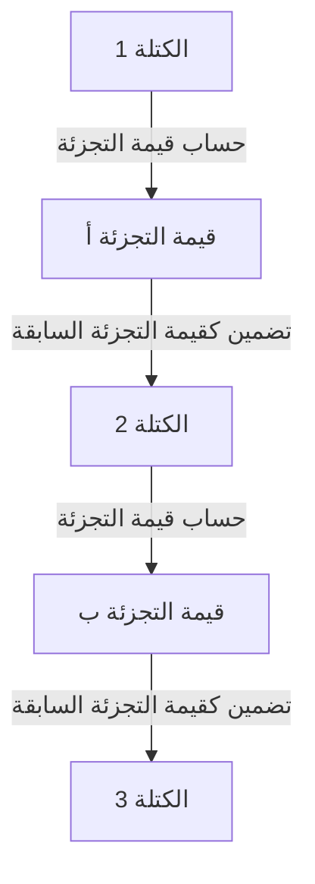

## 1. معضلة "قابلية النسخ" للبيانات الرقمية

الإنترنت هو تقنية تجعل "نسخ المعلومات ونقلها" أسهل بشكل كبير. ومع ذلك، عند محاولة تبادل "الأموال (القيمة)" مباشرة عبر الإنترنت، تصبح هذه الخاصية المتمثلة في "سهولة النسخ" مشكلة قاتلة.
إذا كان من الممكن نسخ "10,000 ين من البيانات الرقمية" التي أمتلكها وإرسالها إلى كل من الشخص أ والشخص ب، فإن الثقة في المال ستنهار (يسمى هذا **مشكلة الإنفاق المزدوج**).

حتى الآن، كانت الطريقة الوحيدة لمنع مشكلة الإنفاق المزدوج هذه هي "**أن يقوم مسؤول مركزي يثق به الجميع، مثل بنك أو شركة بطاقات ائتمان، بإدارة أرصدة حسابات الجميع (دفتر الأستاذ) بشكل صارم**".

ولكن في عام 2008، وبفضل ورقة بحثية نشرها شخص غامض (أو مجموعة) يطلق على نفسه اسم ساتوشي ناكاموتو، ولدت "عملة رقمية لا يمكن تزويرها أو إنفاقها مرتين على الإطلاق، حتى بدون وجود مسؤول مركزي" لأول مرة في التاريخ. هذه هي **بيتكوين**، والتقنية الأساسية التي تدعمها هي **سلسلة الكتل (بلوكتشين)**.

## 2. ما هي سلسلة الكتل؟ (دفتر الأستاذ الموزع)

باختصار، سلسلة الكتل هي "**آلية حيث يتشارك جميع المشاركين حول العالم نفس نسخة سجلات المعاملات (دفتر الأستاذ) ويراقبون بعضهم البعض**".

عندما يقوم شخص ما بإجراء معاملة مثل "إرسال 1 بيتكوين من الشخص أ إلى الشخص ب"، يتم نشر هذه المعلومات إلى أجهزة الكمبيوتر (العقد) حول العالم من خلال شبكة الند للند (P2P).
يتم تجميع حزمة من المعاملات التي حدثت حول العالم خلال حوالي 10 دقائق في صندوق واحد (**كتلة**). ثم يتم ربط هذا الصندوق وحفظه خلف الصناديق السابقة مثل "السلسلة". هذا هو أصل اسم "سلسلة الكتل".

بمجرد ربط الكتلة بالسلسلة، لا يمكن إعادة كتابة محتوياتها (سجلات المعاملات السابقة) لاحقًا بأي حال من الأحوال. كيف يكون ذلك ممكنًا؟

## 3. "دالة التجزئة التعموية" التي تجعل التلاعب مستحيلًا

التقنية التعموية التي تدعم "الخاصية التي لا يمكن إعادة كتابتها على الإطلاق" لسلسلة الكتل هي **دالة التجزئة (مثل SHA-256)**.

دالة التجزئة هي "آلة حاسبة تُخرج دائمًا سلسلة عشوائية من الأحرف (قيمة التجزئة) بطول ثابت، بغض النظر عن طول البيانات المدخلة".
كميزة، لها خاصية أنه "إذا تغير حرف واحد فقط من البيانات الأصلية، فإن قيمة التجزئة الناتجة ستتغير بشكل جذري إلى شيء مختلف تمامًا". بالإضافة إلى ذلك، من المستحيل حساب البيانات الأصلية عكسيًا من قيمة التجزئة الناتجة (دالة أحادية الاتجاه).

في كل كتلة، يتم دائمًا كتابة "**قيمة التجزئة للكتلة السابقة بأكملها**" كبيانات.
لنفترض أن شخصًا خبيثًا قام سرًا بإعادة كتابة سجل معاملات "الكتلة 1" السابقة (مثل سجل التحويل إلى الشخص أ). ثم، ستتغير قيمة التجزئة للكتلة 1 إلى قيمة مختلفة تمامًا.
بعد ذلك، سيحدث تعارض مع "قيمة التجزئة السابقة" المسجلة في "الكتلة 2" التالية، وستنقطع السلسلة عند هذه النقطة. للحفاظ على التناسق، يجب إعادة حساب قيم التجزئة للكتلة 2 والكتلة 3 وجميع الكتل اللاحقة.

## 4. إثبات العمل (PoW) والتعدين

قد تتساءل: "ولكن، باستخدام حاسوب فائق، ألا يمكن التلاعب من خلال إعادة حساب قيم التجزئة لجميع الكتل اللاحقة في لحظة؟"
ما يجعل هذا مستحيلًا ماديًا هو آلية تسمى "**إثبات العمل (PoW: إثبات إنجاز العمل)**".

في قواعد بيتكوين، للحصول على الحق في ربط كتلة جديدة بالسلسلة، هناك قيد يتمثل في أنه "**يجب حل لغز حسابي ضخم**".
على وجه التحديد، إنه لغز حسابي قاسي "للعثور على رقم عشوائي خاص (Nonce) يجعل عددًا معينًا من الأصفار تصطف في بداية قيمة تجزئة الكتلة". لا يمكن حل هذا اللغز باستخدام معادلة، والطريقة الوحيدة هي الاستمرار في الحساب باستخدام القوة الغاشمة بالترتيب بدءًا من 0.

يتنافس المشاركون من جميع أنحاء العالم (**المعدنون**) لغرض العثور على الإجابة الصحيحة لهذا اللغز من خلال تشغيل أحدث أجهزة الكمبيوتر الخاصة بهم بكامل طاقتها. فقط الشخص الذي يعثر على الإجابة الصحيحة أولًا يحصل على الحق في إضافة كتلة جديدة إلى السلسلة، وكمكافأة على ذلك، يمكنه الحصول على "عملات بيتكوين مُصدرة حديثًا". هذا هو السبب في أنها تسمى **التعدين**.

### 5. لماذا التلاعب مستحيل؟ (جدار هجوم الـ 51%)

بسبب آلية إثبات العمل هذه، من المستحيل عمليًا التلاعب بالكتل السابقة.
إذا حاول المعتدي إعادة كتابة كتلة سابقة وإعادة توصيل السلسلة، فيجب عليه حل الألغاز باستمرار وتجاوز السلسلة بسرعة أعلى من "سرعة جميع المعدنين الشرعيين مجتمعين".

القوة الحسابية لشبكة بيتكوين بأكملها هائلة بالفعل وتتجاوز بكثير أكبر أجهزة الكمبيوتر الفائقة في العالم مجتمعة. إن قيام متسلل واحد (أو دولة واحدة) بتجاوز ذلك بمفرده (هجوم 51%) سيكلف فواتير كهرباء ضخمة وتكاليف أجهزة، مما يجعله غير مجدٍ اقتصاديًا على الإطلاق.

بدلاً من إنفاق مبالغ ضخمة من المال (فواتير الكهرباء) لارتكاب عمل ضار (التلاعب)، فمن المربح أكثر بكثير استخدام تلك القوة الحسابية في "التعدين الشرعي" للحصول على مكافآت بيتكوين. حقيقة أن أمان الشبكة مضمون من خلال استغلال "**الرغبات الاقتصادية البشرية ونظرية الألعاب**" بهذه الطريقة هي العبقرية الحقيقية لساتوشي ناكاموتو.

## 6. الخلاصة: نحو عالم لا يحتاج إلى الثقة (Trustless)

سلسلة الكتل هي اختراع ثوري حيث "حتى بدون الثقة بشخص معين (Trustless)، يتم تشكيل إجماع صحيح للنظام ككل من خلال قوة الرياضيات والتقنية التعموية والحوافز الاقتصادية".

تعد بيتكوين مجرد أول تطبيق لها. واليوم، تعد آلية "دفتر الأستاذ الموزع الذي لا يمكن التلاعب به أبدًا" هذه الأساس لابتكار هائل لبناء الشكل التالي للإنترنت (Web3)، مثل العقود الذكية (التنفيذ التلقائي للعقود)، والرموز غير القابلة للاستبدال (إثبات الملكية الرقمية)، وحتى التمويل اللامركزي (DeFi) والأشكال التنظيمية الجديدة (DAO).
