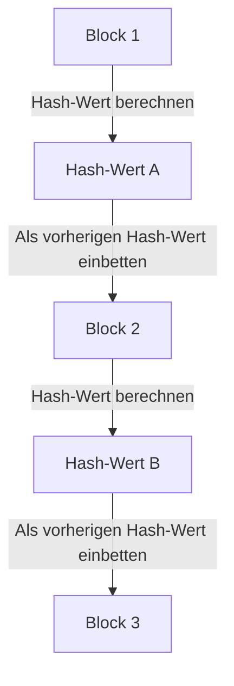

## 1. Das Dilemma der "Kopierbarkeit" digitaler Daten

Das Internet ist eine Technologie, die das "Kopieren und Übertragen von Informationen" dramatisch vereinfacht. Wenn man jedoch versucht, "Geld (Wert)" direkt über das Internet auszutauschen, wird diese Eigenschaft des "einfachen Kopierens" zu einem fatalen Problem.
Wenn ich meine "digitalen 10.000 Yen" kopieren und an Person A und Person B gleichzeitig senden könnte, würde das Vertrauen in sie als Geld zusammenbrechen (dies wird als **Double-Spending-Problem** bezeichnet).

Bisher war der einzige Weg, dieses Double-Spending-Problem zu verhindern, dass "**ein zentraler Verwalter, dem alle vertrauen, wie etwa eine Bank oder ein Kreditkartenunternehmen, die Kontostände (das Kassenbuch) aller Beteiligten streng verwaltet**".

Im Jahr 2008 jedoch wurde mit der Veröffentlichung eines Papiers durch eine mysteriöse Person (oder Gruppe) namens Satoshi Nakamoto zum ersten Mal in der Geschichte "eine digitale Währung, die absolut nicht gefälscht oder doppelt ausgegeben werden kann, selbst wenn es keinen zentralen Verwalter gibt", geboren. Das ist **Bitcoin**, und die zugrundeliegende Technologie ist die **Blockchain**.

## 2. Was ist eine Blockchain? (Distributed Ledger - Dezentrales Kassenbuch)

Kurz gesagt ist die Blockchain ein "**System, bei dem alle Teilnehmer weltweit eine Kopie derselben Transaktionsaufzeichnungen (Ledger/Kassenbuch) teilen und sich gegenseitig überwachen**".

Wenn jemand eine Transaktion durchführt, wie z. B. "1 Bitcoin von Person A an Person B senden", wird diese Information über ein P2P-Netzwerk an Computer (Nodes) auf der ganzen Welt verteilt.
Ein Bündel von Transaktionen, die weltweit innerhalb von etwa 10 Minuten stattfinden, wird in eine einzelne Box (**Block**) gepackt. Und diese Box wird wie eine Kette (**Chain**) an die vorherigen Boxen angehängt und gespeichert. Das ist der Ursprung des Namens "Blockchain".

Sobald der Inhalt eines Blocks (vergangene Transaktionsaufzeichnungen) an die Kette angehängt ist, kann er im Nachhinein absolut nicht mehr umgeschrieben werden. Warum ist so etwas möglich?

## 3. "Kryptografische Hash-Funktionen", die Manipulationen unmöglich machen

Die Eigenschaft der Blockchain, "absolut nicht umschreibbar" zu sein, wird durch eine kryptografische Technologie namens **Hash-Funktion (wie SHA-256)** unterstützt.

Eine Hash-Funktion ist "ein Rechner, der unabhängig von der Länge der eingegebenen Daten immer eine zufällige Zeichenfolge (Hash-Wert) von fester Länge ausgibt".
Ein Hauptmerkmal ist, dass "wenn sich auch nur ein einziges Zeichen der ursprünglichen Daten ändert, der ausgegebene Hash-Wert sich drastisch in etwas völlig anderes verwandelt". Außerdem ist es unmöglich, die ursprünglichen Daten aus dem ausgegebenen Hash-Wert zurückzurechnen (Einwegfunktion).

In jedem Block ist immer der "**Hash-Wert des gesamten vorherigen Blocks**" als Daten eingeschrieben.
Angenommen, eine böswillige Person würde heimlich die Transaktionsaufzeichnungen (wie den Überweisungsverlauf an Person A) in dem vergangenen "Block 1" umschreiben. Dann würde sich der Hash-Wert von Block 1 in einen völlig anderen Wert ändern.
Infolgedessen entstünde ein Widerspruch mit dem "vorherigen Hash-Wert", der im nächsten "Block 2" aufgezeichnet wurde, und die Kette (Chain) würde an dieser Stelle reißen. Um die Konsistenz wiederherzustellen, müssten die Hash-Werte von Block 2, Block 3 und allen nachfolgenden Blöcken neu berechnet werden.

## 4. Proof of Work (PoW) und Mining

"Aber könnte man nicht einen Supercomputer verwenden, um die Hash-Werte aller nachfolgenden Blöcke in Sekundenbruchteilen neu zu berechnen und sie so zu manipulieren?", könnten Sie sich fragen.
Was dies physikalisch unmöglich macht, ist der Mechanismus des "**Proof of Work (PoW: Arbeitsnachweis)**".

Die Regeln von Bitcoin legen fest, dass man, um das Recht zu erhalten, einen neuen Block an die Kette anzuhängen, die Bedingung erfüllen muss, "**eine enorme Berechnung (ein Rätsel) zu lösen**".
Konkret handelt es sich um ein hartes Rechenrätsel: "Finde eine spezielle Zufallszahl (Nonce), die bewirkt, dass der Hash-Wert des Blocks mit einer bestimmten Anzahl von Nullen ('0') beginnt". Dieses Rätsel kann nicht mit einer Gleichung gelöst werden; man kann es nur durch ständiges Ausprobieren (Brute-Force), beginnend bei 0, berechnen.

Teilnehmer auf der ganzen Welt (**Miner / Schürfer**) lassen modernste Computer auf Hochtouren laufen, um wettbewerbsfähig nach der richtigen Antwort auf dieses Rätsel zu suchen. Nur die Person, die die richtige Antwort als Allererste findet, erhält das Recht, der Kette einen neuen Block hinzuzufügen, und erhält als Belohnung "neu ausgegebene Bitcoins". Aus diesem Grund wird dies als **Mining (Schürfen)** bezeichnet.

### 5. Warum Manipulation unmöglich ist (Die Mauer des 51%-Angriffs)

Aufgrund dieses PoW-Mechanismus ist es praktisch unmöglich, vergangene Blöcke zu manipulieren.
Wenn ein Angreifer versuchen würde, vergangene Blöcke umzuschreiben und die Kette wieder zusammenzufügen, müsste er das Rätsel ununterbrochen neu lösen und die Kette schneller einholen als die "Geschwindigkeit, mit der alle legitimen Miner zusammen rechnen".

Die Rechenleistung des gesamten Bitcoin-Netzwerks ist bereits weitaus gigantischer als die der weltbesten Supercomputer-Gruppen zusammen. Wenn ein einzelner Hacker (oder ein Land) dies im Alleingang übertreffen würde (51%-Angriff), wären die Kosten für Strom und Hardware so enorm, dass es sich wirtschaftlich absolut nicht rechnen würde.

Anstatt riesige Summen Geld (Stromkosten) auszugeben, um böse Taten (Manipulationen) zu begehen, ist es viel profitabler, diese Rechenleistung für "legitimes Mining" einzusetzen und Bitcoin als Belohnung zu erhalten. Dass die **Sicherheit des Netzwerks durch die Nutzung von menschlichem wirtschaftlichen Verlangen und Spieltheorie gewährleistet wird**, kann als die wahre Genialität von Satoshi Nakamoto bezeichnet werden.

## 6. Fazit: Hin zu einer Trustless (vertrauenslosen) Welt

Die Blockchain ist eine bahnbrechende Erfindung, bei der "selbst ohne einer bestimmten Person zu vertrauen (Trustless), ein korrekter Konsens für das gesamte System durch die Kraft von Mathematik, Kryptografie und wirtschaftlichen Anreizen gebildet wird".

Bitcoin ist lediglich ihre erste Anwendung. Heute dient dieser Mechanismus des "absolut manipulationssicheren dezentralen Kassenbuchs" als gigantisches Innovationsfundament für den Aufbau der nächsten Form des Internets (Web3), die sich in Smart Contracts (automatische Vertragsausführung), NFTs (Nachweis digitalen Eigentums) sowie in dezentraler Finanzierung (DeFi) und neuen Organisationsformen (DAO) anwenden lässt.
