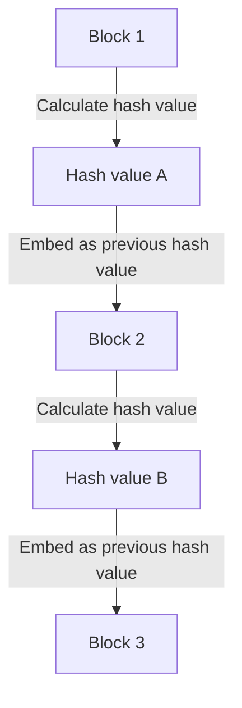

## 1. The Dilemma of "Copyable" Digital Data

The Internet is a technology that drastically simplifies "copying and transferring information." However, when trying to exchange "money (value)" directly over the Internet, this "easily copyable" nature becomes a fatal problem.
If the "digital data of 10,000 yen" I have could be copied and sent to both Person A and Person B, trust in it as money would collapse (this is called the **double-spending problem**).

Until now, the only way to prevent this double-spending problem was for "**a central authority trusted by everyone, such as a bank or credit card company, to strictly manage everyone's account balances (the ledger)**."

However, in 2008, a paper published by a mysterious person (or group) calling themselves Satoshi Nakamoto gave birth to the first digital currency in history where "forgeries and double-spending are absolutely impossible even without a central administrator." That is **Bitcoin**, and the technology forming its foundation is the **blockchain**.

## 2. What is a Blockchain? (Distributed Ledger)

In a word, a blockchain is "**a mechanism where all participants worldwide share a copy of the same transaction record (ledger) and monitor each other**."

When someone conducts a transaction saying "Send 1 Bitcoin from Person A to Person B," that information is broadcasted to computers (nodes) around the world through a P2P network.
The bundle of transactions that occurred globally over about 10 minutes is packed into a single box (a **block**). Then, that box is connected and stored behind past boxes like a "**chain**." This is the origin of the name "blockchain."

Once the contents of a block (past transaction records) are connected to the chain, they can absolutely never be rewritten later. Why is such a thing possible?

## 3. "Cryptographic Hash Functions" That Make Tampering Impossible

Supporting the "absolutely unrewritable nature" of the blockchain is a cryptographic technology called a **hash function (such as SHA-256)**.

A hash function is a "calculator that always outputs a random string of a fixed length (hash value) no matter what length of data is put in."
As a characteristic, it has the property that "even if the original data changes by a single character, the output hash value changes drastically into something completely different." Also, it is impossible to reverse-calculate the original data from the output hash value (one-way function).

In each block, the "**hash value of the entire previous block**" is always written as data.
Suppose a malicious person secretly rewrote the transaction records (such as the history of money sent to Person A) of a past "Block 1." Then, the hash value of Block 1 would change into a completely different value.
Consequently, a contradiction would arise with the "previous hash value" recorded in the next "Block 2," and the chain would break there. To make things consistent, the hash values of Block 2, Block 3, and all subsequent blocks would have to be recalculated.

## 4. Proof of Work (PoW) and Mining

You might think, "But couldn't they tamper with it by using a supercomputer to recalculate the hash values of all subsequent blocks in an instant?"
What makes that physically impossible is a mechanism called "**Proof of Work (PoW)**."

Under Bitcoin's rules, to gain the right to connect a new block to the chain, there is a restriction that "**a massive amount of calculation (a quiz) must be solved**."
Specifically, it is a grueling calculation quiz to "find a special random number (nonce) such that a certain number or more of '0's line up at the beginning of the block's hash value." This quiz cannot be solved with an equation; it can only be solved by continuously calculating brute-force starting from 0.

Participants all over the world (**miners**) are competing to find the answer to this quiz by running the latest computers at full capacity. Only the person who brilliantly finds the answer first gets the right to add the new block to the chain and can receive "newly issued Bitcoin" as a reward. This is why it is called **mining**.

### 5. Why Tampering is Impossible (The Wall of a 51% Attack)

Because of this PoW mechanism, tampering with past blocks is practically impossible.
If a tamperer tried to rewrite a past block and reconnect the chain, they would have to continuously re-solve the quizzes and overtake the chain faster than the "speed at which all legitimate miners are calculating together."

The computational power of the entire Bitcoin network is already vastly larger than all the world's top supercomputers combined. For a single hacker (or a single nation) to independently surpass this (a 51% attack) would cost an enormous amount in electricity and hardware bills, making it completely economically unviable.

Rather than spending a massive amount of money (electricity bills) to commit a bad deed (tampering), it is far more profitable to use that computational power for "legitimate mining" and receive Bitcoin as a reward. The fact that the network's security is guaranteed by utilizing "**human economic desires and game theory**" in this way can be said to be the true genius of Satoshi Nakamoto.

## 6. Conclusion: Toward a Trustless World

The blockchain is an epoch-making invention where "**a correct consensus is formed for the system as a whole through the power of mathematics, cryptographic technology, and economic incentives, without needing to trust any specific person (Trustless)**."

Bitcoin is merely its first application. Today, applying this mechanism of an "absolutely untamperable distributed ledger" has become the foundation for massive innovation to build the next form of the Internet (Web3), such as smart contracts (automated contract execution), NFTs (proof of digital ownership), decentralized finance (DeFi), and new organizational forms (DAOs).
