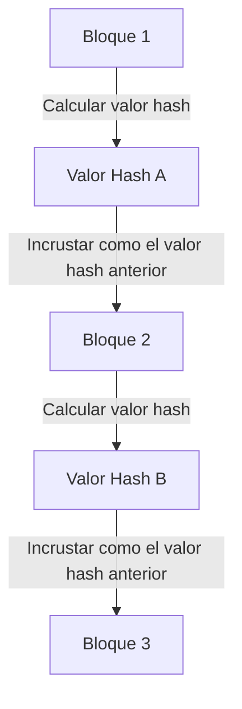

## 1. El dilema de la "copiabilidad" de los datos digitales

Internet es una tecnología que facilita enormemente la "copia y transferencia de información". Sin embargo, cuando intentamos intercambiar "dinero (valor)" directamente en internet, esta naturaleza de "fácil de copiar" se convierte en un problema fatal.
Si el "dato digital de 10.000 yenes" que poseo pudiera copiarse y enviarse tanto a la persona A como a la persona B, la confianza en él como dinero colapsaría (a esto se le llama el **problema del doble gasto**).

Hasta ahora, la única forma de evitar este problema del doble gasto era que "**un administrador central de confianza para todos, como un banco o una compañía de tarjetas de crédito, gestionara estrictamente los saldos de las cuentas (el libro mayor) de todos**".

Sin embargo, en 2008, un artículo publicado por una figura (o grupo) misteriosa llamada Satoshi Nakamoto dio a luz a la primera "moneda digital en la historia que es absolutamente imposible de falsificar o gastar dos veces, incluso sin un administrador central". Eso es **Bitcoin**, y la tecnología subyacente que lo hace posible es **Blockchain**.

## 2. ¿Qué es Blockchain? (Libro mayor distribuido)

En pocas palabras, blockchain es "**un sistema en el que todos los participantes en todo el mundo comparten una copia del mismo registro de transacciones (libro mayor) y se supervisan mutuamente**".

Cuando alguien realiza una transacción como "enviar 1 bitcoin de la persona A a la persona B", esa información se distribuye a las computadoras (nodos) de todo el mundo a través de una red P2P.
Un conjunto de transacciones que ocurren en todo el mundo en aproximadamente 10 minutos se empaqueta en una caja (**bloque**). Y esa caja se guarda vinculada detrás de las cajas anteriores como una "cadena" (**chain**). De ahí proviene el nombre "blockchain".

Una vez que el contenido de un bloque (registros de transacciones pasadas) está vinculado a la cadena, es absolutamente imposible alterarlo posteriormente. ¿Por qué es posible tal cosa?

## 3. La "función hash criptográfica" que imposibilita la alteración

La tecnología criptográfica que respalda la "naturaleza absolutamente inalterable" de la blockchain es la **función hash (como SHA-256)**.

Una función hash es una "calculadora que siempre produce una cadena aleatoria de longitud fija (valor hash) sin importar la longitud de los datos que se introduzcan".
Como característica, tiene la propiedad de que "si los datos originales cambian aunque sea en un solo carácter, el valor hash de salida cambia drásticamente a algo completamente diferente". Además, es imposible calcular de manera inversa los datos originales a partir del valor hash de salida (función unidireccional).

En cada bloque, siempre se escribe como dato el "**valor hash completo del bloque inmediatamente anterior**".
Supongamos que una persona maliciosa altera secretamente el registro de transacciones del "Bloque 1" pasado (como el historial de transferencias a la persona A). Entonces, el valor hash del Bloque 1 cambiará a un valor completamente diferente.
Como resultado, surgirá una contradicción con el "valor hash anterior" registrado en el siguiente "Bloque 2", y la cadena se romperá en ese punto. Para mantener la coherencia, se tendrían que recalcular los valores hash del Bloque 2, el Bloque 3 y todos los bloques subsiguientes.

## 4. Prueba de Trabajo (PoW) y minería

"Pero, ¿no se podría alterar recalculando los valores hash de todos los bloques subsiguientes en un instante usando una supercomputadora?", podrías pensar.
Lo que hace que esto sea físicamente imposible es un mecanismo llamado "**Prueba de Trabajo (PoW: Proof of Work)**".

Las reglas de Bitcoin imponen la restricción de que, para obtener el derecho de conectar un nuevo bloque a la cadena, "**se debe resolver un cálculo masivo (un acertijo)**".
Específicamente, es un acertijo de cálculo riguroso que requiere "encontrar un número aleatorio especial (nonce) de modo que el valor hash del bloque comience con un cierto número de ceros consecutivos". Este acertijo no se puede resolver con una ecuación, sino que solo se puede resolver mediante un cálculo de fuerza bruta, probando desde 0 en adelante.

Los participantes de todo el mundo (**mineros / excavadores**) operan sus computadoras de última generación a plena capacidad compitiendo para encontrar la respuesta a este acertijo. Solo la primera persona en encontrar la respuesta correcta obtiene el derecho de agregar un nuevo bloque a la cadena y recibe "nuevos bitcoins emitidos" como recompensa. Esta es la razón por la que se llama **minería**.

### 5. Por qué la alteración es imposible (La barrera del ataque del 51%)

Debido a este mecanismo de PoW, es virtualmente imposible alterar bloques pasados.
Si un atacante intentara reescribir un bloque pasado y reconectar la cadena, el falsificador tendría que resolver los acertijos repetidamente y superar a la cadena a una velocidad mayor que "la velocidad a la que todos los mineros legítimos combinados están calculando".

El poder de cálculo de toda la red de Bitcoin ya es mucho más masivo que todos los principales supercomputadores del mundo combinados. Superar esto por un solo hacker (o incluso una nación) por sí solo (ataque del 51%) requeriría costos enormes en electricidad y hardware, por lo que económicamente no es rentable en absoluto.

En lugar de gastar cantidades masivas de dinero (costos de electricidad) para cometer un acto malicioso (alteración), es mucho más rentable usar ese poder de cálculo para la "minería legítima" y recibir bitcoins como recompensa. Este uso de los "**deseos económicos humanos y la teoría de juegos**" para garantizar la seguridad de la red es verdaderamente el genio de Satoshi Nakamoto.

## 6. Resumen: Hacia un mundo Trustless (sin necesidad de confianza)

Blockchain es un invento revolucionario donde "el consenso correcto se forma como un sistema completo a través del poder de las matemáticas, la criptografía y los incentivos económicos, sin necesidad de confiar en alguien en particular (Trustless)".

Bitcoin es solo su primera aplicación. Hoy en día, el mecanismo de este "libro mayor distribuido que es absolutamente inalterable" se está aplicando para formar la base de una innovación masiva para construir la próxima forma de internet (Web3), incluyendo contratos inteligentes (ejecución automática de contratos), NFT (prueba de propiedad digital), además de finanzas descentralizadas (DeFi) y nuevas formas de organización (DAO).
