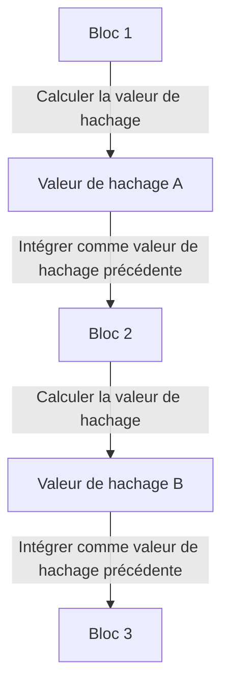

## 1. Le dilemme de la « reproductibilité » des données numériques

Internet est une technologie qui simplifie drastiquement « la copie et le transfert d'informations ». Cependant, si l'on essaie d'échanger directement de « l'argent (de la valeur) » sur Internet, cette caractéristique de « facilité de copie » devient un problème fatal.
Si je pouvais copier les « données numériques d'un billet de 10 000 yens » que je possède et les envoyer à la fois à A et à B, la confiance en tant que monnaie s'effondrerait (c'est ce qu'on appelle le **problème de la double dépense**).

Jusqu'à présent, le seul moyen d'empêcher ce problème de double dépense était que « **des administrateurs centraux en qui tout le monde a confiance, comme les banques et les sociétés de cartes de crédit, gèrent strictement les soldes des comptes (registres) de tout le monde** ».

Cependant, en 2008, un article publié par une personne (ou un groupe) mystérieuse se faisant appeler Satoshi Nakamoto a donné naissance, pour la première fois dans l'histoire, à « une monnaie numérique qui ne peut absolument pas être contrefaite ou dépensée deux fois, même en l'absence d'un administrateur central ». Il s'agit du **Bitcoin**, et la technologie qui en constitue le fondement est la **[blockchain](/fr/p/blockchain-technology-smart-contract-distributed-ledger/)**.

## 2. Qu'est-ce que la blockchain ? (Registre distribué)

En un mot, la [blockchain](/fr/p/blockchain-technology-smart-contract-distributed-ledger/) est « **un système dans lequel tous les participants du monde entier partagent une copie du même registre de transactions (grand livre) et se surveillent mutuellement** ».

Lorsque quelqu'un effectue une transaction (transaction) telle que « envoyer 1 Bitcoin de A à B », cette information est diffusée aux ordinateurs (nœuds) du monde entier via un réseau P2P.
Un lot de transactions survenues dans le monde entier en l'espace d'environ 10 minutes est regroupé dans une seule boîte (**bloc**). Ensuite, cette boîte est attachée derrière les boîtes précédentes comme une « chaîne » (**chaîne**) et conservée. C'est l'origine du nom « [blockchain](/fr/p/blockchain-technology-smart-contract-distributed-ledger/) ».

Une fois qu'un bloc est attaché à la chaîne, son contenu (les enregistrements des transactions passées) ne peut absolument pas être réécrit par la suite. Pourquoi est-ce possible ?

## 3. Les « fonctions de hachage cryptographique » qui rendent la falsification impossible

La nature « absolument inaltérable » de la [blockchain](/fr/p/blockchain-technology-smart-contract-distributed-ledger/) repose sur une technologie cryptographique appelée **fonction de hachage (comme le SHA-256)**.

Une fonction de hachage est une « machine à calculer qui sort toujours une chaîne de caractères aléatoire (valeur de hachage) de longueur fixe, quelle que soit la longueur des données introduites ».
Sa particularité réside dans le fait que « si la donnée d'origine change d'un seul caractère, la valeur de hachage produite changera radicalement pour devenir complètement différente ». De plus, il est impossible de retrouver les données d'origine à partir de la valeur de hachage produite (fonction à sens unique).

Chaque bloc contient toujours la « **valeur de hachage de l'ensemble du bloc précédent** » écrite sous forme de données.
Si une personne malveillante modifiait secrètement l'historique des transactions (comme l'historique des envois à la personne A) du « Bloc 1 » passé, la valeur de hachage du Bloc 1 deviendrait alors une valeur complètement différente.
Cela créerait une contradiction avec la « valeur de hachage précédente » enregistrée dans le « Bloc 2 » suivant, et la chaîne (chaîne) se briserait à ce niveau. Pour rétablir la cohérence, il faudrait recalculer les valeurs de hachage du Bloc 2, du Bloc 3 et de tous les blocs suivants.

## 4. Preuve de travail (PoW) et minage

Vous pourriez penser : « Mais ne pourrait-on pas utiliser un superordinateur pour recalculer instantanément les valeurs de hachage de tous les blocs suivants et ainsi falsifier la chaîne ? »
C'est le mécanisme de la « **Preuve de travail (PoW : Proof of Work)** » qui rend cela physiquement impossible.

Dans les règles du Bitcoin, pour obtenir le droit d'ajouter un nouveau bloc à la chaîne, il y a une contrainte stipulant que « **des calculs massifs (un puzzle) doivent être résolus** ».
Concrètement, c'est un puzzle de calcul très exigeant qui demande de « trouver un nombre aléatoire spécial (nonce) tel que la valeur de hachage du bloc commence par un certain nombre de "0" consécutifs ». Ce puzzle ne peut pas être résolu par une équation, la seule méthode est de calculer par force brute, en essayant les nombres à partir de 0 les uns après les autres.

Les participants du monde entier (**mineurs**) font tourner leurs ordinateurs les plus récents à plein régime et rivalisent pour trouver la bonne réponse à ce puzzle. Seule la personne qui trouve la bonne réponse en premier obtient le droit d'ajouter un nouveau bloc à la chaîne et peut recevoir des « Bitcoins nouvellement émis » en récompense. C'est la raison pour laquelle on appelle cela le **minage**.

### 5. Pourquoi la falsification est impossible (le mur de l'attaque des 51%)

Grâce à ce mécanisme de PoW, il est virtuellement impossible de falsifier les blocs passés.
Si quelqu'un essayait de réécrire un bloc passé et de reconnecter la chaîne, le falsificateur devrait résoudre à nouveau les puzzles de manière continue et dépasser la chaîne à une vitesse supérieure à la « vitesse à laquelle tous les mineurs légitimes calculent ensemble ».

La puissance de calcul de l'ensemble du réseau Bitcoin est déjà bien plus gigantesque que celle des meilleurs superordinateurs mondiaux combinés. Il est économiquement totalement non rentable pour un hacker individuel (ou même un État) de surpasser seul cette puissance (attaque des 51%), car les coûts en électricité et en matériel informatique seraient exorbitants.

Plutôt que de dépenser d'énormes sommes d'argent (frais d'électricité) pour commettre des méfaits (falsification), il est beaucoup plus rentable d'utiliser cette puissance de calcul pour du « minage légitime » et de recevoir des Bitcoins en récompense. Le fait de **garantir la sécurité du réseau en exploitant « les désirs économiques humains et la théorie des jeux »** est la véritable marque du génie de Satoshi Nakamoto.

## 6. Conclusion : Vers un monde "Trustless" (sans besoin de confiance)

La [blockchain](/fr/p/blockchain-technology-smart-contract-distributed-ledger/) est une invention révolutionnaire où, « même sans avoir à faire confiance à qui que ce soit de spécifique (Trustless), un consensus correct est formé à l'échelle du système grâce au pouvoir des mathématiques, de la cryptographie et des incitations économiques ».

Le Bitcoin n'en est que la première application. Aujourd'hui, en appliquant ce mécanisme de « registre distribué absolument inaltérable », il sert de base à d'immenses innovations pour construire la prochaine forme d'Internet (Web3), telles que les contrats intelligents (exécution automatique de contrats), les NFT (preuve de propriété numérique), ainsi que la finance décentralisée (DeFi) et de nouvelles formes d'organisations (DAO).
