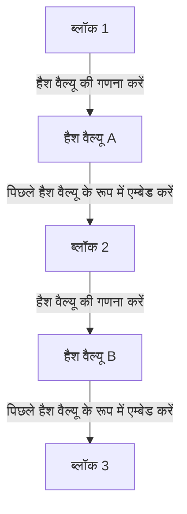

## 1. डिजिटल डेटा की "कॉपी करने योग्य" दुविधा

इंटरनेट एक ऐसी तकनीक है जो "जानकारी को कॉपी और ट्रांसफर करने" को नाटकीय रूप से आसान बनाती है। हालाँकि, यदि आप इंटरनेट पर सीधे "पैसे (मूल्य)" का आदान-प्रदान करने का प्रयास करते हैं, तो यह "आसानी से कॉपी किए जाने योग्य" गुण एक गंभीर समस्या बन जाता है।
यदि मैं अपने पास मौजूद "10,000 येन के डिजिटल डेटा" को कॉपी करके A और B दोनों को भेज सकता हूँ, तो पैसे के रूप में इसका विश्वास ढह जाएगा (इसे **दोहरे खर्च की समस्या** कहा जाता है)।

अब तक, इस दोहरे खर्च की समस्या को रोकने का एकमात्र तरीका था " **बैंकों और क्रेडिट कार्ड कंपनियों जैसे केंद्रीय व्यवस्थापकों, जिन पर हर कोई भरोसा करता है, द्वारा सभी के खाते के शेष (खाता-बही) का कड़ाई से प्रबंधन करना** "।

हालाँकि, 2008 में, सातोशी नाकामोतो नामक एक रहस्यमय व्यक्ति (या समूह) द्वारा प्रकाशित एक पेपर के साथ, इतिहास में पहली बार एक "डिजिटल मुद्रा जिसे बिना किसी केंद्रीय व्यवस्थापक के बिल्कुल भी जाली या दो बार खर्च नहीं किया जा सकता" का जन्म हुआ। वह **बिटकॉइन** है, और इसके मूल में जो तकनीक है वह **[ब्लॉकचेन](/hi/p/blockchain-technology-smart-contract-distributed-ledger/)** है।

## 2. ब्लॉकचेन क्या है? (वितरित खाता-बही)

संक्षेप में, [ब्लॉकचेन](/hi/p/blockchain-technology-smart-contract-distributed-ledger/) " **दुनिया भर के सभी प्रतिभागियों द्वारा समान लेनदेन रिकॉर्ड (खाता-बही) की प्रतियों को साझा करने और एक-दूसरे की निगरानी करने का एक तंत्र** " है।

जब कोई यह लेनदेन (ट्रांजेक्शन) करता है कि "A से B को 1 बिटकॉइन भेजें", तो वह जानकारी P2P नेटवर्क के माध्यम से दुनिया भर के कंप्यूटरों (नोड्स) में फैल जाती है।
दुनिया भर में लगभग 10 मिनट में होने वाले लेनदेन के बंडल को एक बॉक्स ( **ब्लॉक** ) में पैक किया जाता है। फिर, उस बॉक्स को पिछले बॉक्स के पीछे एक "श्रृंखला ( **चेन** )" की तरह जोड़कर सहेजा जाता है। यही "[ब्लॉकचेन](/hi/p/blockchain-technology-smart-contract-distributed-ledger/)" नाम की उत्पत्ति है।

एक बार श्रृंखला से जुड़ने के बाद ब्लॉक की सामग्री (पिछले लेनदेन रिकॉर्ड) को बाद में फिर से नहीं लिखा जा सकता है। ऐसा कैसे संभव है?

## 3. छेड़छाड़ को असंभव बनाने वाला "क्रिप्टोग्राफ़िक हैश फ़ंक्शन"

[ब्लॉकचेन](/hi/p/blockchain-technology-smart-contract-distributed-ledger/) के "कभी न लिखे जा सकने वाले गुण" का समर्थन करने वाली तकनीक **हैश फ़ंक्शन (SHA-256 आदि)** नामक क्रिप्टोग्राफी है।

हैश फ़ंक्शन एक "कैलकुलेटर है जो हमेशा एक निश्चित लंबाई का यादृच्छिक स्ट्रिंग (हैश वैल्यू) आउटपुट करता है, चाहे आप कितनी भी लंबाई का डेटा डालें"।
एक विशेषता के रूप में, इसमें यह गुण होता है कि "यदि मूल डेटा 1 अक्षर से भी बदलता है, तो आउटपुट हैश वैल्यू पूरी तरह से अलग चीज़ में बदल जाता है"। इसके अलावा, आउटपुट हैश वैल्यू से मूल डेटा की गणना करना असंभव है (एक-तरफ़ा फ़ंक्शन)।

प्रत्येक ब्लॉक में, " **पिछले पूरे ब्लॉक का हैश वैल्यू** " हमेशा डेटा के रूप में लिखा जाता है।
मान लीजिए कि कोई दुर्भावनापूर्ण व्यक्ति गुप्त रूप से पिछले "ब्लॉक 1" के लेनदेन रिकॉर्ड (जैसे A को प्रेषण इतिहास) को फिर से लिखता है। फिर, ब्लॉक 1 का हैश वैल्यू पूरी तरह से अलग मान में बदल जाएगा।
फिर, अगले "ब्लॉक 2" में दर्ज "पिछले हैश वैल्यू" के साथ विरोधाभास उत्पन्न होता है, और श्रृंखला (चेन) वहीं टूट जाती है। इसे सुसंगत बनाने के लिए, ब्लॉक 2, ब्लॉक 3, और उसके बाद के सभी ब्लॉकों के हैश वैल्यू की फिर से गणना की जानी चाहिए।

## 4. प्रूफ़-ऑफ़-वर्क (PoW) और माइनिंग

आप सोच सकते हैं, "लेकिन क्या सुपरकंप्यूटर का उपयोग करके और पल भर में बाद के सभी ब्लॉकों के हैश वैल्यू की फिर से गणना करके छेड़छाड़ करना संभव नहीं है?"
जो इसे भौतिक रूप से असंभव बनाता है वह " **प्रूफ़-ऑफ़-वर्क (PoW: कार्य का प्रमाण)** " नामक तंत्र है।

बिटकॉइन के नियमों के तहत, एक नए ब्लॉक को श्रृंखला से जोड़ने का अधिकार प्राप्त करने के लिए " **विशाल गणनाओं (प्रश्नोत्तरी) को हल करना होगा** " की बाधा है।
विशेष रूप से, यह एक कठिन गणना प्रश्नोत्तरी है: "एक ऐसा विशेष यादृच्छिक संख्या (नॉन्स) खोजें जहाँ ब्लॉक के हैश वैल्यू की शुरुआत में '0' एक निश्चित संख्या से अधिक बार पंक्तिबद्ध हों"। इस प्रश्नोत्तरी को किसी समीकरण से हल नहीं किया जा सकता है, और आपके पास 0 से क्रमिक रूप से ब्रूट-फ़ोर्स (brute-force) गणना जारी रखने के अलावा कोई विकल्प नहीं है।

दुनिया भर के प्रतिभागी ( **माइनर्स / खनिक** ) इस प्रश्नोत्तरी का सही उत्तर खोजने के लिए प्रतिस्पर्धा कर रहे हैं, अपने नवीनतम कंप्यूटरों को पूरी क्षमता से चला रहे हैं। केवल जो व्यक्ति सबसे पहले सही उत्तर ढूँढ़ने में सफल होता है, उसे श्रृंखला में एक नया ब्लॉक जोड़ने का अधिकार मिलता है और इनाम के रूप में "नए जारी किए गए बिटकॉइन" प्राप्त होते हैं। यही कारण है कि इसे **माइनिंग (खनन)** कहा जाता है।

### 5. छेड़छाड़ असंभव क्यों है (51% हमले की दीवार)

इस PoW तंत्र के कारण, पिछले ब्लॉकों के साथ छेड़छाड़ करना वस्तुतः असंभव है।
यदि कोई पिछले ब्लॉक को फिर से लिखकर श्रृंखला को फिर से जोड़ने का प्रयास करता है, तो छेड़छाड़ करने वाले को "सभी वैध खनिकों द्वारा एक साथ गणना करने की गति" से अधिक तेज़ी से लगातार प्रश्नोत्तरी हल करके श्रृंखला से आगे निकलना होगा।

संपूर्ण बिटकॉइन नेटवर्क की गणना शक्ति पहले से ही दुनिया के शीर्ष सुपरकंप्यूटरों के संयुक्त रूप से कहीं अधिक विशाल है। एक अकेले हैकर (या एक राष्ट्र) द्वारा इसे पार करना (51% हमला) आर्थिक रूप से बिल्कुल भी व्यवहार्य नहीं है क्योंकि इसमें बिजली और हार्डवेयर की भारी लागत आती है।

बुरे काम (छेड़छाड़) करने के लिए बहुत सारा पैसा (बिजली का बिल) खर्च करने के बजाय, उस गणना शक्ति का उपयोग "वैध माइनिंग" के लिए करना और इनाम के रूप में बिटकॉइन प्राप्त करना कहीं अधिक लाभदायक है। यह कहा जा सकता है कि सातोशी नाकामोतो की असली प्रतिभा इस बात में है कि उन्होंने इस प्रकार **"मानवीय आर्थिक इच्छाओं और गेम थ्योरी" का उपयोग करके नेटवर्क की सुरक्षा की गारंटी दी** है।

## 6. निष्कर्ष: एक ट्रस्टमलेस (बिना विश्वास वाले) संसार की ओर

[ब्लॉकचेन](/hi/p/blockchain-technology-smart-contract-distributed-ledger/) एक युगांतरकारी आविष्कार है जिसमें "भले ही आप किसी विशिष्ट व्यक्ति पर विश्वास (Trustless) न करें, फिर भी गणित, क्रिप्टोग्राफी और आर्थिक प्रोत्साहन की शक्ति से पूरी प्रणाली के रूप में एक सही सहमति बनती है"।

बिटकॉइन इसका केवल पहला अनुप्रयोग है। वर्तमान में, इस "कभी न लिखे जा सकने वाले वितरित खाता-बही" तंत्र को लागू करके, यह स्मार्ट कॉन्ट्रैक्ट्स (स्वचालित अनुबंध निष्पादन), NFT (डिजिटल स्वामित्व का प्रमाण), और यहां तक कि विकेंद्रीकृत वित्त (DeFi) और नए संगठनात्मक रूपों (DAO) जैसे इंटरनेट के अगले रूप (Web3) को बनाने के लिए एक विशाल नवाचार का आधार बन गया है।
