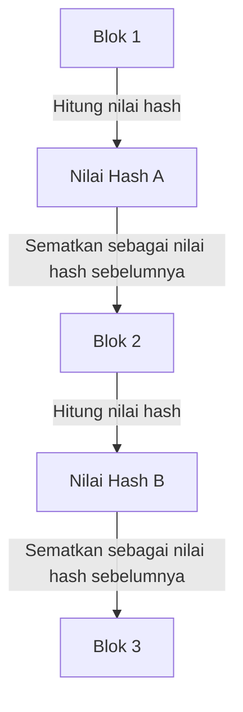

## 1. Dilema "Dapat Disalin" dari Data Digital

Internet adalah teknologi yang secara dramatis mempermudah "menyalin dan mentransfer informasi". Namun, ketika mencoba bertukar "uang (nilai)" secara langsung di internet, sifat "mudah disalin" ini menjadi masalah yang fatal.
Jika saya dapat menyalin "data digital senilai 10.000 yen" yang saya miliki dan mengirimkannya ke A dan B, maka kepercayaan sebagai uang akan runtuh (ini disebut **masalah pengeluaran ganda**).

Sampai saat ini, satu-satunya cara untuk mencegah masalah pengeluaran ganda ini adalah "**administrator pusat yang dipercaya oleh semua orang, seperti bank atau perusahaan kartu kredit, mengelola saldo rekening (buku besar) semua orang dengan ketat**".

Namun pada tahun 2008, melalui makalah yang diterbitkan oleh seseorang (atau kelompok) misterius bernama Satoshi Nakamoto, untuk pertama kalinya dalam sejarah lahir "mata uang digital yang sama sekali tidak dapat dipalsukan atau dihabiskan dua kali, meskipun tidak ada administrator pusat". Itulah **Bitcoin**, dan teknologi inti yang mendasarinya adalah **Blockchain**.

## 2. Apa itu Blockchain? (Buku Besar Terdistribusi)

Singkatnya, blockchain adalah "**sistem di mana semua peserta di seluruh dunia berbagi salinan catatan transaksi (buku besar) yang sama dan saling mengawasi satu sama lain**".

Ketika seseorang melakukan transaksi "mengirim 1 Bitcoin dari A ke B", informasi tersebut disebarkan ke komputer (node) di seluruh dunia melalui jaringan P2P.
Kumpulan transaksi yang terjadi di seluruh dunia dalam waktu sekitar 10 menit dikemas ke dalam satu kotak (**blok**). Kemudian, kotak itu dihubungkan di belakang kotak-kotak sebelumnya seperti "rantai" (**chain**) dan disimpan. Inilah asal mula nama "blockchain".

Isi blok (catatan transaksi masa lalu) yang telah dihubungkan ke rantai sama sekali tidak dapat diubah lagi. Mengapa hal itu mungkin?

## 3. "Fungsi Hash Kriptografis" yang Mencegah Perubahan

Sifat blockchain yang "benar-benar tidak dapat diubah" didukung oleh teknologi kriptografi yang disebut **fungsi hash (seperti SHA-256)**.

Fungsi hash adalah "kalkulator yang selalu menghasilkan string acak (nilai hash) dengan panjang yang sama, tidak peduli seberapa panjang data yang dimasukkan".
Karakteristiknya adalah "jika data asli berubah bahkan 1 karakter saja, nilai hash yang dihasilkan akan berubah drastis menjadi sesuatu yang sama sekali berbeda". Selain itu, tidak mungkin menghitung kembali data asli dari nilai hash yang dihasilkan (fungsi satu arah).

Di dalam setiap blok, "**nilai hash dari seluruh blok sebelumnya**" selalu ditulis sebagai data.
Misalkan seseorang yang berniat jahat diam-diam mengubah catatan transaksi "Blok 1" di masa lalu (seperti riwayat pengiriman uang ke A). Kemudian, nilai hash dari Blok 1 akan berubah menjadi nilai yang sama sekali berbeda.
Lalu, akan terjadi kontradiksi dengan "nilai hash sebelumnya" yang tercatat di dalam "Blok 2" berikutnya, dan rantai akan terputus di sana. Untuk membuatnya masuk akal, ia harus menghitung ulang nilai hash Blok 2, Blok 3, dan semua blok berikutnya.

## 4. Proof of Work (PoW) dan Mining

"Tetapi, bukankah kita bisa memalsukannya jika kita menggunakan superkomputer untuk menghitung ulang nilai hash dari semua blok berikutnya dalam sekejap?" Anda mungkin berpikir demikian.
Hal yang membuatnya secara fisik tidak mungkin adalah sistem yang disebut "**Proof of Work (PoW: Bukti Kerja)**".

Dalam aturan Bitcoin, untuk mendapatkan hak menghubungkan blok baru ke rantai, ada batasan bahwa "**harus menyelesaikan perhitungan (kuis) yang sangat besar**".
Secara spesifik, ini adalah kuis perhitungan yang berat: "temukan angka acak khusus (nonce) sehingga nilai hash blok memiliki jumlah '0' tertentu secara berurutan di awal". Kuis ini tidak dapat diselesaikan dengan persamaan, dan satu-satunya cara adalah dengan terus menghitung satu per satu dari 0 (brute force).

Peserta di seluruh dunia (**miner / penambang**) berlomba-lomba mencari jawaban kuis ini dengan menjalankan komputer terbaru secara maksimal. Hanya orang pertama yang berhasil menemukan jawaban yang mendapatkan hak untuk menambahkan blok baru ke rantai, dan sebagai imbalannya ia dapat menerima "Bitcoin yang baru diterbitkan". Inilah sebabnya mengapa itu disebut **mining (penambangan)**.

### 5. Mengapa Pemalsuan Tidak Mungkin? (Dinding Serangan 51%)

Karena adanya sistem PoW ini, mengubah blok masa lalu secara praktis tidak mungkin dilakukan.
Jika seseorang mencoba untuk menulis ulang blok masa lalu dan menyambung kembali rantainya, pelaku harus mengalahkan "kecepatan perhitungan gabungan dari semua penambang yang sah" dan terus-menerus memecahkan kuis dengan lebih cepat untuk mendahului rantai.

Kekuatan komputasi seluruh jaringan Bitcoin saat ini sudah jauh lebih besar daripada gabungan kelompok superkomputer teratas di dunia. Jika satu peretas (atau satu negara) mencoba melampaui ini sendirian (Serangan 51%), biayanya untuk listrik dan perangkat keras akan sangat besar, sehingga secara ekonomi sama sekali tidak masuk akal.

Daripada menghabiskan banyak uang (biaya listrik) untuk melakukan kejahatan (pemalsuan), jauh lebih menguntungkan untuk menggunakan daya komputasi tersebut untuk "penambangan yang sah" dan mendapatkan imbalan Bitcoin. Fakta bahwa jaringan ini **diamankan dengan memanfaatkan "keinginan ekonomi manusia dan teori permainan"** dapat dikatakan sebagai kejeniusan sejati dari Satoshi Nakamoto.

## 6. Kesimpulan: Menuju Dunia Trustless (Tanpa Kebutuhan akan Kepercayaan)

Blockchain adalah penemuan revolusioner di mana "bahkan tanpa mempercayai orang tertentu (Trustless), konsensus yang benar terbentuk dalam keseluruhan sistem melalui kekuatan matematika, kriptografi, dan insentif ekonomi".

Bitcoin hanyalah aplikasi pertamanya. Saat ini, dengan menerapkan sistem "buku besar terdistribusi yang sama sekali tidak dapat diubah" ini, ia telah menjadi fondasi inovasi raksasa untuk menciptakan bentuk internet berikutnya (Web3), seperti smart contract (eksekusi kontrak otomatis), NFT (bukti kepemilikan digital), hingga keuangan terdesentralisasi (DeFi) dan bentuk organisasi baru (DAO).
