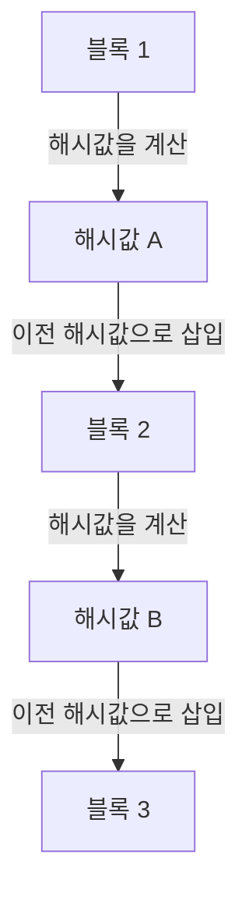

## 1. 디지털 데이터의 '복사 가능'이라는 딜레마

인터넷은 '정보의 복사와 전송'을 획기적으로 쉽게 만들어주는 기술입니다. 하지만 '돈(가치)'을 인터넷상에서 직접 주고받으려 할 때, 이 '쉽게 복사할 수 있다'는 성질이 치명적인 문제가 됩니다.
내가 가진 '1만 엔의 디지털 데이터'를 복사해서 A씨와 B씨 양쪽 모두에게 전송할 수 있게 된다면, 돈으로서의 신용은 붕괴합니다(이를 **이중 지불 문제** 라고 부릅니다).

지금까지 이 이중 지불 문제를 방지하는 유일한 방법은 '**은행이나 신용카드 회사 등 누구나 신뢰하는 중앙 관리자가 모든 사람의 계좌 잔고(원장)를 엄격하게 관리하는 것**'이었습니다.

하지만 2008년, 사토시 나카모토라는 이름의 수수께끼의 인물(또는 그룹)이 발표한 논문을 통해 역사상 처음으로 '중앙 관리자가 존재하지 않아도 절대 위조나 이중 지불을 할 수 없는 디지털 통화'가 탄생했습니다. 그것이 **비트코인** 이며, 그 근간을 이루는 기술이 **블록체인** 입니다.

## 2. 블록체인이란 무엇인가? (분산 원장)

블록체인이란 한마디로 '**전 세계의 모든 참가자가 동일한 거래 기록(원장)의 사본을 공유하고, 서로를 감시하는 시스템**'입니다.

누군가가 'A씨가 B씨에게 1비트코인을 보낸다'는 거래(트랜잭션)를 하면, 그 정보는 P2P 네트워크를 통해 전 세계의 컴퓨터(노드)에 뿌려집니다.
약 10분 동안 전 세계에서 발생한 거래의 묶음은 하나의 상자(**블록**)에 담깁니다. 그리고 그 상자는 과거의 상자 뒤에 '사슬(**체인**)'처럼 연결되어 저장됩니다. 이것이 '블록체인'이라는 이름의 유래입니다.

한번 체인에 연결된 블록의 내용(과거의 거래 기록)은 나중에 절대로 수정할 수 없습니다. 어떻게 그런 일이 가능한 것일까요?

## 3. 위조를 불가능하게 만드는 '암호학적 해시 함수'

블록체인의 '절대 수정할 수 없는 성질'을 뒷받침하는 것이 **해시 함수(SHA-256 등)** 라는 암호 기술입니다.

해시 함수란 '어떤 길이의 데이터를 넣어도 반드시 정해진 길이의 무작위 문자열(해시값)을 출력하는 계산기'입니다.
특징으로 '원본 데이터가 한 글자라도 바뀌면 출력되는 해시값이 전혀 다른 것으로 급변한다'는 성질을 가지고 있습니다. 또한, 출력된 해시값으로부터 원본 데이터를 역산하는 것은 불가능합니다(일방향 함수).

각 블록에는 반드시 '**바로 앞 블록 전체의 해시값**'이 데이터로 기록되어 있습니다.
만약 악의적인 인물이 과거 '블록 1'의 거래 기록(A씨에게 송금한 내역 등)을 몰래 조작했다고 가정해 봅시다. 그러면 블록 1의 해시값이 전혀 다른 값으로 변해버립니다.
그러면 다음 '블록 2' 안에 기록되어 있던 '이전 해시값'과 모순이 생겨, 사슬(체인)이 거기서 끊어지게 됩니다. 앞뒤를 맞추기 위해서는 블록 2도, 블록 3도, 그 이후의 모든 블록의 해시값을 다시 계산해야만 합니다.

## 4. 작업 증명 (PoW) 과 마이닝

'하지만 슈퍼컴퓨터를 사용해서 그 이후의 모든 블록의 해시값을 순식간에 다시 계산하면 조작할 수 있지 않을까?'라고 생각할지도 모릅니다.
그것을 물리적으로 불가능하게 만드는 것이 '**작업 증명(PoW: Proof of Work)**'이라는 시스템입니다.

비트코인의 규칙에는 새로운 블록을 체인에 연결할 권리를 얻기 위해 '**방대한 계산(퀴즈)을 풀어야 한다**'는 제약이 있습니다.
구체적으로는 '블록의 해시값 맨 앞에 「0」이 일정 수 이상 늘어서는 특수한 난수(논스)를 찾아내라'는 가혹한 계산 퀴즈입니다. 이 퀴즈는 방정식으로 풀 수 없으며, 0부터 순서대로 대입하며 무작위로 계속 계산하는 수밖에 없습니다.

전 세계의 참가자(**마이너 / 채굴자**)가 최신 컴퓨터를 풀가동하여 이 퀴즈의 정답을 경쟁적으로 찾고 있습니다. 멋지게 가장 먼저 정답을 찾은 사람만이 새로운 블록을 체인에 추가할 권리를 얻고, 그 보상으로 '새로 발행되는 비트코인'을 받을 수 있습니다. 이것이 **마이닝(채굴)** 이라고 불리는 이유입니다.

### 5. 왜 위조가 불가능한가 (51% 공격의 벽)

이 PoW 시스템이 있기 때문에, 과거의 블록을 위조하는 것은 사실상 불가능합니다.
만약 과거의 블록을 수정해서 체인을 다시 연결하려고 한다면, 위조범은 '정상적인 마이너 전원이 힘을 합쳐 계산하는 속도'보다 빠르게 퀴즈를 연속으로 다시 풀어서 체인을 앞질러야 합니다.

비트코인 네트워크 전체의 계산력은 이미 세계 최고의 슈퍼컴퓨터들을 합친 것보다 훨씬 거대합니다. 이를 한 명의 해커(혹은 한 국가)가 단독으로 뛰어넘는 것(51% 공격)은 막대한 전기 요금과 하드웨어 비용이 들기 때문에, 경제적으로 전혀 수지가 맞지 않습니다.

악행(위조)을 저지르기 위해 막대한 돈(전기 요금)을 쓸 바에는 그 계산력을 '정상적인 마이닝'에 사용하여 보상으로 비트코인을 받는 편이 훨씬 돈이 됩니다. 이처럼 **'인간의 경제적 욕망과 게임 이론'을 활용하여 네트워크의 안전성을 담보하고 있다** 는 점이야말로 사토시 나카모토의 진정한 천재성이라고 할 수 있습니다.

## 6. 요약: 트러스트리스(신뢰가 필요 없는) 세계로

블록체인은 '특정 누군가를 신뢰하지 않아도(Trustless), 수학과 암호 기술 그리고 경제적 인센티브의 힘을 통해 시스템 전체적으로 올바른 합의가 형성된다'는 획기적인 발명입니다.

비트코인은 어디까지나 그 첫 번째 응용에 불과합니다. 현재는 이 '절대 위조할 수 없는 분산 원장'의 시스템을 응용하여, 스마트 컨트랙트(자동 계약 실행)나 NFT(디지털 소유권 증명), 더 나아가 탈중앙화 금융(DeFi)이나 새로운 조직 형태(DAO) 등, 인터넷의 다음 형태(Web3)를 만들어내기 위한 거대한 혁신의 기반이 되고 있습니다.
