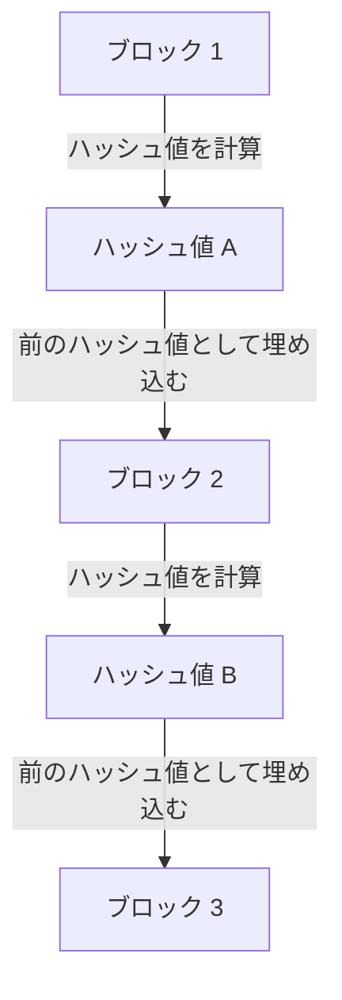

## 1. デジタルデータの「コピー可能」というジレンマ

インターネットは「情報のコピーと転送」を劇的に簡単にする技術です。しかし、「お金（価値）」をインターネット上で直接やり取りしようとした場合、この「簡単にコピーできる」という性質が致命的な問題になります。
私が持っている「1万円のデジタルデータ」をコピーして、AさんとBさんの両方に送信できてしまったら、お金としての信用は崩壊します（これを**二重支払い問題**と呼びます）。

これまで、この二重支払い問題を防ぐ唯一の方法は「**銀行やクレジットカード会社など、誰もが信用する中央の管理者が、全員の口座残高（台帳）を厳重に管理すること**」でした。

しかし2008年、サトシ・ナカモトと名乗る謎の人物（またはグループ）が発表した論文によって、歴史上初めて「中央の管理者が存在しなくても、絶対に偽造や二重支払いができないデジタル通貨」が誕生しました。それが**ビットコイン**であり、その根幹を成す技術が**[ブロックチェーン](/p/blockchain-technology-smart-contract-distributed-ledger/)**です。

## 2. ブロックチェーンとは何か？（分散型台帳）

[ブロックチェーン](/p/blockchain-technology-smart-contract-distributed-ledger/)とは、一言で言えば「**世界中の参加者全員で、同じ取引記録（台帳）のコピーを共有し、お互いに監視し合う仕組み**」です。

誰かが「AさんからBさんに1ビットコイン送る」という取引（[トランザクション](/p/rdbms-transaction-acid-isolation-level-lock/)）を行うと、その情報はP2Pネットワークを通じて世界中のコンピュータ（ノード）にばらまかれます。
約10分間に世界中で発生した取引の束は、一つの箱（**ブロック**）に詰め込まれます。そして、その箱は過去の箱の後ろに「鎖（**チェーン**）」のようにつながれて保存されていきます。これが「[ブロックチェーン](/p/blockchain-technology-smart-contract-distributed-ledger/)」という名前の由来です。

一度チェーンにつながれたブロックの中身（過去の取引記録）は、後から絶対に書き換えることができません。なぜそんなことが可能なのでしょうか？

## 3. 改ざんを不可能にする「暗号学的ハッシュ関数」

[ブロックチェーン](/p/blockchain-technology-smart-contract-distributed-ledger/)の「絶対に書き換えられない性質」を支えているのが、**ハッシュ関数（SHA-256など）**という暗号技術です。

ハッシュ関数とは、「どんな長さのデータを入れても、必ず決まった長さのデタラメな文字列（ハッシュ値）を出力する計算機」です。
特徴として、「元のデータが1文字でも変わると、出力されるハッシュ値が全く違うものに激変する」という性質を持っています。また、出力されたハッシュ値から元のデータを逆算することは不可能です（一方向関数）。

各ブロックには、必ず「**一つ前のブロック全体のハッシュ値**」がデータとして書き込まれています。
もし悪意のある人物が、過去の「ブロック1」の取引記録（Aさんへの送金履歴など）をこっそり書き換えたとします。すると、ブロック1のハッシュ値が全く違う値に変化してしまいます。
すると、次の「ブロック2」の中に記録されていた「前のハッシュ値」と矛盾が生じ、鎖（チェーン）がそこでちぎれてしまいます。つじつまを合わせるためには、ブロック2も、ブロック3も、以降のすべてのブロックのハッシュ値を計算し直さなければなりません。

## 4. プルーフ・オブ・ワーク (PoW) とマイニング

「でも、スーパーコンピュータを使って、以降のすべてのブロックのハッシュ値を一瞬で計算し直せば改ざんできるのでは？」と思うかもしれません。
それを物理的に不可能にしているのが「**プルーフ・オブ・ワーク（PoW：仕事の証明）**」という仕組みです。

ビットコインのルールでは、新しいブロックをチェーンにつなぐ権利を得るためには、「**膨大な計算（クイズ）を解かなければならない**」という制約があります。
具体的には、「ブロックのハッシュ値の先頭に『0』が一定数以上並ぶような、特殊な乱数（ナンス）を見つけ出せ」という過酷な計算クイズです。このクイズは方程式で解くことはできず、0から順番に総当たりで計算し続けるしかありません。

世界中の参加者（**マイナー / 採掘者**）が、最新のコンピュータをフル稼働させてこのクイズの正解を競争で探しています。見事一番最初に正解を見つけた人だけが、新しいブロックをチェーンに追加する権利を得て、その報酬として「新規発行されるビットコイン」を受け取ることができます。これが**マイニング（採掘）**と呼ばれる所以です。

### 5. なぜ改ざんが不可能なのか（51%攻撃の壁）

このPoWの仕組みがあるため、過去のブロックを改ざんすることは事実上不可能です。
もし過去のブロックを書き換えてチェーンをつなぎ直そうとすれば、改ざん犯は「正規のマイナー全員が束になって計算しているスピード」よりも速く、クイズを連続で解き直してチェーンを追い越さなければなりません。

ビットコインのネットワーク全体の計算力は、すでに世界のトップスーパーコンピュータ群を合わせたよりも遥かに巨大です。これを一人のハッカー（あるいは一国家）が単独で上回ること（51%攻撃）は、莫大な電気代とハードウェア代がかかりすぎるため、経済的に全く引き合わないのです。

悪事（改ざん）を働くために莫大なお金（電気代）をかけるくらいなら、その計算力を「正規のマイニング」に使って報酬のビットコインを貰ったほうが遥かに儲かる。このように**「人間の経済的な欲望とゲーム理論」を利用してネットワークの安全性を担保している**点こそが、サトシ・ナカモトの真の天才性だと言えます。

## 6. まとめ：トラストレス（信用を必要としない）世界へ

[ブロックチェーン](/p/blockchain-technology-smart-contract-distributed-ledger/)は、「特定の誰かを信用しなくても（Trustless）、数学と暗号技術と経済的インセンティブの力によって、システム全体として正しい合意が形成される」という画期的な発明です。

ビットコインはあくまでその最初の応用に過ぎません。現在では、この「絶対に改ざんされない[分散型台帳](/p/blockchain-technology-smart-contract-distributed-ledger/)」の仕組みを応用して、スマートコントラクト（自動契約実行）やNFT（デジタル所有権の証明）、さらには分散型金融（DeFi）や新しい組織形態（DAO）など、インターネットの次の形（Web3）を作り上げるための巨大なイノベーションの基盤となっています。
