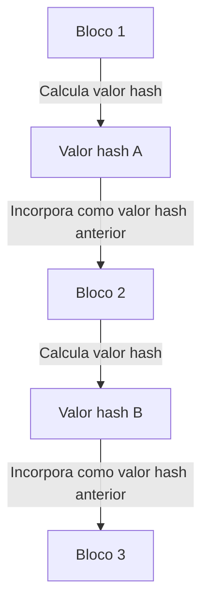

## 1. O Dilema da "Copiabilidade" dos Dados Digitais

A internet é uma tecnologia que torna a "cópia e transferência de informações" drasticamente mais fácil. No entanto, quando tentamos trocar "dinheiro (valor)" diretamente na internet, essa propriedade de "ser facilmente copiável" se torna um problema fatal.
Se eu pudesse copiar os "dados digitais de 10.000 ienes" que possuo e enviá-los tanto para a Pessoa A quanto para a Pessoa B, a confiança no dinheiro entraria em colapso (isso é chamado de **problema do gasto duplo**).

Até agora, a única maneira de evitar esse problema de gasto duplo era "**um administrador central em quem todos confiam, como um banco ou operadora de cartão de crédito, gerenciar estritamente os saldos das contas (livro-razão) de todos**".

No entanto, em 2008, um artigo publicado por uma pessoa misteriosa (ou grupo) chamada Satoshi Nakamoto deu origem, pela primeira vez na história, a "uma moeda digital que não pode ser absolutamente falsificada ou gasta duas vezes, mesmo sem a existência de um administrador central". Isso é o **Bitcoin**, e a tecnologia fundamental por trás dele é o **Blockchain**.

## 2. O Que é Blockchain? (Livro-Razão Distribuído)

Em uma palavra, o blockchain é um "**mecanismo onde todos os participantes do mundo compartilham uma cópia do mesmo registro de transações (livro-razão) e monitoram uns aos outros**".

Quando alguém realiza uma transação, como "enviar 1 Bitcoin da Pessoa A para a Pessoa B", essa informação é espalhada para computadores (nós) em todo o mundo através da rede P2P.
O conjunto de transações que ocorreram no mundo ao longo de cerca de 10 minutos é empacotado em uma caixa (**bloco**). Em seguida, essa caixa é armazenada conectada atrás das caixas anteriores como uma "corrente (**chain**)". Esta é a origem do nome "blockchain".

Uma vez que um bloco é conectado à corrente, seu conteúdo (registros de transações passadas) nunca pode ser reescrito posteriormente. Por que isso é possível?

## 3. "Função Hash Criptográfica" que Torna a Adulteração Impossível

O que sustenta a propriedade de "absolutamente não reescrevível" do blockchain é a tecnologia criptográfica chamada **função hash (como SHA-256)**.

Uma função hash é uma "calculadora que, independentemente do comprimento dos dados inseridos, sempre produz uma string aleatória (valor hash) de um comprimento fixo".
Como característica, ela tem a propriedade de que "se os dados originais mudarem em até um único caractere, o valor hash de saída mudará drasticamente para algo completamente diferente". Além disso, é impossível calcular reversamente os dados originais a partir do valor hash de saída (função de via única).

Em cada bloco, o "**valor hash de todo o bloco anterior**" é sempre gravado como dado.
Suponha que uma pessoa mal-intencionada reescreva secretamente o registro da transação do "Bloco 1" passado (como o histórico de remessa para a Pessoa A). Então, o valor hash do Bloco 1 mudará para um valor completamente diferente.
Como resultado, surgirá uma contradição com o "valor hash anterior" registrado no "Bloco 2" seguinte, e a corrente será quebrada ali. Para tornar as coisas consistentes, os valores hash do Bloco 2, Bloco 3 e todos os blocos subsequentes devem ser recalculados.

## 4. Prova de Trabalho (PoW) e Mineração

Você pode pensar: "Mas se você usar um supercomputador, você não poderia adulterá-lo recalculando os valores hash de todos os blocos subsequentes em um instante?".
O que torna isso fisicamente impossível é o mecanismo chamado "**Prova de Trabalho (PoW - Proof of Work)**".

Nas regras do Bitcoin, para ganhar o direito de conectar um novo bloco à corrente, há uma restrição de que "**uma quantidade massiva de cálculos (quebra-cabeças) deve ser resolvida**".
Especificamente, é um quebra-cabeça computacional rigoroso que diz: "Encontre um número aleatório especial (nonce) que faça com que uma certa quantidade ou mais de '0's se alinhem no início do valor hash do bloco". Este quebra-cabeça não pode ser resolvido com uma equação; a única maneira é continuar calculando por força bruta em ordem a partir do 0.

Participantes do mundo todo (**mineradores**) estão competindo para encontrar a resposta certa para este quebra-cabeça rodando seus computadores mais recentes com capacidade total. Apenas a pessoa que brilhantemente encontrar a resposta certa primeiro ganha o direito de adicionar um novo bloco à corrente, e em troca, pode receber o "Bitcoin recém-emitido" como recompensa. É por isso que é chamado de **mineração**.

### 5. Por Que a Adulteração é Impossível (A Barreira do Ataque de 51%)

Devido a este mecanismo PoW, é virtualmente impossível adulterar blocos passados.
Se você tentasse reescrever blocos passados e reconectar a corrente, o falsificador teria que resolver os quebra-cabeças repetidamente e ultrapassar a corrente a uma velocidade mais rápida que a "velocidade na qual todos os mineradores legítimos estão calculando coletivamente".

O poder computacional de toda a rede do Bitcoin já é muito maior do que o dos principais supercomputadores do mundo combinados. Seria completamente inviável economicamente para um único hacker (ou um país) superar isso sozinho (ataque de 51%), pois custaria uma quantia exorbitante em contas de eletricidade e custos de hardware.

Em vez de gastar uma enorme quantia de dinheiro (conta de eletricidade) para cometer um crime (adulteração), é muito mais lucrativo usar esse poder computacional para a "mineração legítima" e receber Bitcoin como recompensa. O fato de **utilizar "os desejos econômicos humanos e a teoria dos jogos" para garantir a segurança da rede** dessa maneira é indiscutivelmente o verdadeiro gênio de Satoshi Nakamoto.

## 6. Conclusão: Rumo a um Mundo "Trustless" (Sem Necessidade de Confiança)

O blockchain é uma invenção revolucionária onde "mesmo sem confiar em alguém específico (Trustless), um consenso correto é formado como um sistema como um todo pelo poder da matemática, tecnologia criptográfica e incentivos econômicos".

O Bitcoin é apenas sua primeira aplicação. Hoje, o mecanismo deste "livro-razão distribuído absolutamente não adulterável" é aplicado para formar a base de enormes inovações para criar a próxima forma da internet (Web3), como contratos inteligentes (execução automática de contratos), NFTs (prova de propriedade digital), finanças descentralizadas (DeFi) e novas formas organizacionais (DAOs).
