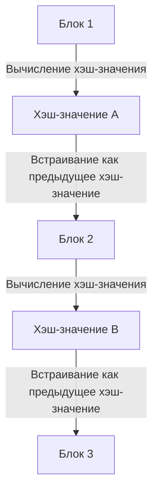

## 1. Дилемма «копируемости» цифровых данных

Интернет — это технология, которая кардинально упрощает «копирование и передачу информации». Однако, при попытке обмениваться «деньгами (ценностями)» напрямую через интернет, это свойство «легкой копируемости» становится фатальной проблемой.
Если бы можно было скопировать «цифровые данные на сумму 10 тысяч иен» и отправить их одновременно господину А и господину Б, то доверие к ним как к деньгам рухнуло бы (это называется **проблемой двойной траты**).

До недавнего времени единственным способом предотвратить эту проблему двойной траты было следующее: «**Центральный администратор, которому все доверяют, например, банк или компания, выпускающая кредитные карты, должен строго управлять балансами счетов (реестром) всех участников**».

Однако в 2008 году, благодаря статье, опубликованной загадочной личностью (или группой людей) под псевдонимом Сатоши Накамото, впервые в истории родилась «цифровая валюта, которую абсолютно невозможно подделать или потратить дважды, даже при отсутствии центрального администратора». Это и есть **биткоин**, а технология, лежащая в его основе, — **[блокчейн](/ru/p/blockchain-technology-smart-contract-distributed-ledger/)**.

## 2. Что такое блокчейн? (Распределенный реестр)

Словом, [блокчейн](/ru/p/blockchain-technology-smart-contract-distributed-ledger/) — это «**механизм, при котором все участники по всему миру делятся одной и той же копией записей о транзакциях (реестром) и следят друг за другом**».

Когда кто-то совершает транзакцию (перевод) типа «Отправить 1 биткоин от господина А господину Б», эта информация рассылается по компьютерам (узлам) по всему миру через P2P-сеть.
Пакет транзакций, произошедших по всему миру примерно за 10 минут, упаковывается в одну коробку (**блок**). Затем эта коробка сохраняется, прикрепляясь позади предыдущих коробок подобно «цепи (**цепочке**)». Отсюда и происходит название «[блокчейн](/ru/p/blockchain-technology-smart-contract-distributed-ledger/)».

Содержимое блока (записи прошлых транзакций), однажды добавленного в цепочку, абсолютно невозможно изменить впоследствии. Как же это возможно?

## 3. «Криптографическая хэш-функция», делающая подделку невозможной

«Абсолютно неизменяемую природу» блокчейна поддерживает криптографическая технология, называемая **хэш-функцией (например, SHA-256)**.

Хэш-функция — это «вычислитель, который принимает данные любой длины и всегда выдает случайную строку символов фиксированной длины (хэш-значение)».
Её особенность заключается в том, что «если в исходных данных изменится хотя бы один символ, выданное хэш-значение кардинально изменится». Кроме того, невозможно вычислить исходные данные в обратном порядке на основе полученного хэш-значения (односторонняя функция).

В каждый блок всегда записывается «**хэш-значение всего предыдущего блока**» в качестве данных.
Представьте, что злоумышленник тайно изменил историю транзакций (например, историю переводов господину А) в прошлом «Блоке 1». В результате хэш-значение Блока 1 изменится на совершенно другое.
Тогда возникнет противоречие с «предыдущим хэш-значением», записанным в следующем «Блоке 2», и цепь (цепочка) на этом месте порвется. Чтобы восстановить последовательность, придется заново вычислять хэш-значения для Блока 2, Блока 3 и всех последующих блоков.

## 4. Доказательство выполнения работы (PoW) и майнинг

Вы можете подумать: «А разве нельзя использовать суперкомпьютер, чтобы мгновенно пересчитать хэш-значения всех последующих блоков и таким образом подделать данные?»
То, что делает это физически невозможным, — механизм, называемый «**Доказательство выполнения работы (PoW: Proof of Work)**».

В правилах биткоина существует ограничение: чтобы получить право добавить новый блок в цепочку, необходимо «**решить сложную вычислительную задачу (головоломку)**».
Конкретно, это суровая вычислительная задача: «Найдите специальное случайное число (nonce) такое, чтобы в начале хэш-значения блока стояло определенное или большее количество нулей». Эту головоломку невозможно решить с помощью уравнения; единственный способ — продолжать вычисления полным перебором, начиная с нуля по порядку.

Участники по всему миру (**майнеры / добытчики**) заставляют свои новейшие компьютеры работать на полную мощность, соревнуясь в поиске правильного ответа на эту головоломку. Только тот, кто первым найдет правильный ответ, получает право добавить новый блок в цепочку и в качестве вознаграждения получает «вновь выпущенные биткоины». Отсюда и происходит название **майнинг (добыча)**.

### 5. Почему подделка невозможна (Барьер атаки 51%)

Благодаря этому механизму PoW подделка прошлых блоков практически невозможна.
Если злоумышленник попытается переписать прошлый блок и воссоздать цепочку, ему придется заново решать головоломки подряд быстрее, чем «скорость вычислений всех законных майнеров вместе взятых», чтобы обогнать основную цепочку.

Общая вычислительная мощность всей сети Биткоина уже значительно превышает мощность всех ведущих суперкомпьютеров мира вместе взятых. Если один хакер (или даже государство) попытается в одиночку превзойти её (атака 51%), это обойдется в колоссальные суммы на электричество и оборудование, что делает это совершенно экономически невыгодным.

Вместо того чтобы тратить огромные деньги (на электричество) ради совершения преступления (подделки), гораздо выгоднее использовать эту вычислительную мощность для «законного майнинга» и получать вознаграждение в биткоинах. Именно то, что безопасность сети обеспечивается за счет использования «**человеческих экономических желаний и теории игр**», можно назвать истинной гениальностью Сатоши Накамото.

## 6. Заключение: К миру Trustless (не требующему доверия)

[Блокчейн](/ru/p/blockchain-technology-smart-contract-distributed-ledger/) — это прорывное изобретение, в котором «даже без доверия к кому-то конкретному (Trustless), благодаря силе математики, криптографии и экономических стимулов, формируется правильный консенсус в системе в целом».

Биткоин — это лишь первое его применение. В настоящее время этот механизм «абсолютно неизменяемого распределенного реестра» применяется для создания смарт-контрактов (автоматического исполнения договоров), NFT (доказательств цифровой собственности), а также децентрализованных финансов (DeFi) и новых организационных форм (DAO), становясь огромной инновационной основой для формирования следующей формы интернета (Web3).
