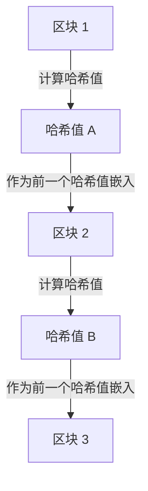

## 1. 数字数据“可复制”的困境

互联网是一项让“信息的复制与传输”变得极其简单的技术。然而，当我们试图在互联网上直接交易“金钱（价值）”时，这种“容易被复制”的特性便成为了一个致命的问题。
如果我持有的“1万日元的数字数据”可以被复制，并同时发送给A和B，那么作为金钱的信用就会崩溃（这被称为 **双重支付问题** ）。

在此之前，防止双重支付问题的唯一方法是“ **由银行或信用卡公司等所有人都信任的中央管理者，来严格管理所有人的账户余额（账本）** ”。

然而在2008年，一位（或一个群体）化名为中本聪的神秘人物发表了一篇论文，历史上首次诞生了“即使没有中央管理者，也绝对无法伪造或双重支付的数字货币”。这就是 **比特币** ，而构成其核心的技术就是 **[区块链](/zh-cn/p/blockchain-technology-smart-contract-distributed-ledger/)** 。

## 2. 什么是区块链？（分布式账本）

一言以蔽之，[区块链](/zh-cn/p/blockchain-technology-smart-contract-distributed-ledger/)就是“ **全世界的参与者共同共享同一份交易记录（账本）的副本，并互相监督的机制** ”。

当有人进行“从A向B发送1个比特币”的交易（Transaction）时，该信息会通过P2P网络广播给全世界的计算机（节点）。
在约10分钟内于世界各地发生的交易将被打包成一个“束”，装入一个箱子（ **区块** ）中。然后，这个箱子会像“链条（ **链** ）”一样连接在过去的箱子后面并被保存下来。这就是“[区块链](/zh-cn/p/blockchain-technology-smart-contract-distributed-ledger/)”这个名字的由来。

一旦连接到链上的区块内容（过去的交易记录），之后就绝对无法被篡改。为什么能做到这一点呢？

## 3. 让篡改成为不可能的“密码学哈希函数”

支撑[区块链](/zh-cn/p/blockchain-technology-smart-contract-distributed-ledger/)“绝对无法被篡改”特性的，是被称为 **哈希函数（如SHA-256）** 的密码技术。

哈希函数是一种“无论输入多长的数据，都必定输出固定长度的随机字符串（哈希值）的计算器”。
其特点是，具有“只要原始数据改变哪怕一个字符，输出的哈希值就会发生剧变，变得完全不同”的性质。此外，从输出的哈希值反推原始数据是不可能的（单向函数）。

每个区块中，必定写入了“ **前一个完整区块的哈希值** ”作为数据。
假设有恶意者悄悄篡改了过去“区块1”的交易记录（例如向A汇款的记录等）。那么，区块1的哈希值就会变成完全不同的值。
这样一来，它就会与下一个“区块2”中记录的“前一个哈希值”产生矛盾，锁链（链条）就会在那里断裂。为了自圆其说，必须重新计算区块2、区块3以及之后所有区块的哈希值。

## 4. 工作量证明 (PoW) 与挖矿

你可能会想：“那么，如果使用超级计算机，在一瞬间重新计算之后所有区块的哈希值，不就可以篡改了吗？”
让这在物理上成为不可能的，是被称为“ **工作量证明（PoW：Proof of Work）** ”的机制。

在比特币的规则中，为了获得将新区块连接到链上的权利，存在着“ **必须解开庞大计算（谜题）** ”的限制。
具体来说，这是一个极其严酷的计算谜题，要求“找出一个特殊的随机数（Nonce），使得区块的哈希值开头有连续一定数量以上的‘0’”。这个谜题无法通过方程式求解，只能从0开始按顺序不断进行暴力穷举计算。

全世界的参与者（ **矿工 / 挖掘者** ）都在全功率运转最先进的计算机，竞争寻找这个谜题的正确答案。只有最先找到正确答案的人，才能获得将新区块追加到链上的权利，并作为报酬获得“新发行的比特币”。这就是它被称为 **挖矿（采矿）** 的原因。

### 5. 为什么篡改是不可能的（51%攻击的壁垒）

由于有了这个PoW机制，篡改过去的区块实际上是不可能的。
如果想要改写过去的区块并重新连接链条，篡改者必须以比“所有正规矿工联合起来计算的速度”更快的速度，连续重新解开谜题并超越当前的链条。

比特币整个网络的计算力，已经远远超过了全球顶尖超级计算机群的总和。如果要由一个黑客（或者一个国家）单独超越这一计算力（51%攻击），将会耗费极其庞大的电费和硬件成本，在经济上完全划不来。

与其为了做坏事（篡改）而花费巨额金钱（电费），把这些计算力用于“正规的挖矿”来获取比特币报酬要赚得多。像这样 **利用“人类的经济欲望与博弈论”来确保网络的安全** ，正是中本聪真正的天才之处。

## 6. 总结：迈向无需信任（Trustless）的世界

[区块链](/zh-cn/p/blockchain-technology-smart-contract-distributed-ledger/)是一项划时代的发明，它实现了“即使不信任特定的某个人（Trustless），依靠数学、密码学技术和经济激励的力量，也能在整个系统中形成正确的共识”。

比特币只不过是其最初的应用而已。现在，应用这种“绝对无法被篡改的分布式账本”机制，已经成为了构建智能合约（自动执行合约）、NFT（数字所有权证明），甚至去中心化金融（DeFi）和新型组织形态（DAO）等互联网下一个形态（Web3）的巨大创新基石。
