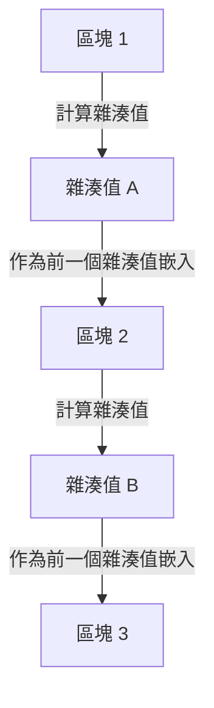

## 1. 數位資料「可複製」的兩難

網際網路是一項讓「資訊的複製與傳輸」變得戲劇性簡單的技術。然而，如果我們試圖在網際網路上直接交易「金錢（價值）」，這種「容易被複製」的特性就會成為致命的問題。
如果我擁有的「1萬日圓的數位資料」可以被複製，並且同時發送給 A 先生和 B 先生，那麼作為金錢的信用就會崩潰（這被稱為 **雙重支付問題** ）。

過去，防止這種雙重支付問題的唯一方法是「 **由銀行或信用卡公司等每個人都信任的中央管理者，嚴格管理所有人的帳戶餘額（帳本）** 」。

但是，在 2008 年，一個自稱中本聰的神秘人物（或團體）發表了一篇論文，歷史上第一次誕生了「即使沒有中央管理者存在，也絕對無法偽造或雙重支付的數位貨幣」。這就是 **比特幣** ，而構成其核心的技術就是 **區塊鏈** 。

## 2. 什麼是區塊鏈？（分散式帳本）

總而言之，區塊鏈是「 **由全世界的參與者共同分享同一份交易紀錄（帳本）的副本，並互相監督的機制** 」。

當有人進行「從 A 先生發送 1 顆比特幣給 B 先生」的交易（Transaction）時，該資訊會透過 P2P 網路散佈到全世界的電腦（節點）中。
大約 10 分鐘內在全世界發生的所有交易會被打包成一個箱子（ **區塊** ）。然後，這個箱子會像「鎖鏈（ **鏈** ）」一樣連接在過去的箱子後面並保存下來。這就是「區塊鏈」名稱的由來。

一旦被連接到鏈上的區塊內容（過去的交易紀錄），事後絕對無法被竄改。為什麼這是有可能的呢？

## 3. 讓竄改成為不可能的「密碼學雜湊函數」

支撐區塊鏈「絕對無法被竄改的特性」的，是稱為 **雜湊函數（例如 SHA-256 等）** 的密碼技術。

雜湊函數是一台「無論輸入多長的資料，都一定會輸出一串固定長度的隨機字串（雜湊值）的計算機」。
它的特徵是具有「只要原始資料改變一個字，輸出的雜湊值就會變成完全不同的東西」的性質。此外，從輸出的雜湊值反推原始資料是不可能的（單向函數）。

在每個區塊中，必定會寫入「 **前一個區塊整體的雜湊值** 」作為資料。
如果一個有惡意的人偷偷竄改了過去「區塊 1」的交易紀錄（例如匯款給 A 先生的紀錄等），那麼區塊 1 的雜湊值就會變成完全不同的值。
這樣一來，就會與記錄在下一個「區塊 2」中的「前一個雜湊值」產生矛盾，鎖鏈（鏈）就會在那裡斷裂。為了讓前後一致，就必須重新計算區塊 2、區塊 3 以及之後所有區塊的雜湊值。

## 4. 工作量證明 (PoW) 與挖礦

你可能會想：「但是，如果使用超級電腦，在一瞬間重新計算之後所有區塊的雜湊值，不就可以竄改了嗎？」
在物理上讓這件事變得不可能的，是稱為「 **工作量證明（PoW：Proof of Work）** 」的機制。

比特幣的規則規定，為了獲得將新區塊連接到鏈上的權利，必須滿足「 **必須解開龐大計算（謎題）** 」的條件。
具體來說，這是一個非常嚴酷的計算謎題：「找出一個特殊的亂數（Nonce），使得區塊的雜湊值開頭排列著一定數量以上的『0』」。這個謎題無法用方程式解開，只能從 0 開始依序不斷地進行暴力破解計算。

全世界的參與者（ **礦工 / 採礦者** ）都在全速運轉最新的電腦，競爭尋找這個謎題的正確答案。只有漂亮地第一個找到正確答案的人，才能獲得將新區塊新增到鏈上的權利，並獲得「新發行的比特幣」作為報酬。這就是被稱為 **挖礦（採礦）** 的原因。

### 5. 為什麼竄改是不可能的（51% 攻擊的障壁）

因為有了這個 PoW 的機制，竄改過去的區塊在事實上是不可能的。
如果試圖改寫過去的區塊並重新連接鏈，竄改犯必須以比「所有正規礦工聯合計算的速度」更快的速度，連續重新解開謎題並超越目前的鏈。

比特幣整個網路的計算能力，已經遠遠超過世界上頂尖超級電腦群的總和。單憑一個駭客（或一個國家）要單獨超越這個計算能力（51% 攻擊），需要花費的電費和硬體費用過於龐大，在經濟上是完全划不來的。

與其為了做壞事（竄改）而花費龐大的金錢（電費），不如把那個計算能力用在「正規的挖礦」上，獲得比特幣的報酬還要賺得多。像這樣利用「 **人類的經濟慾望與賽局理論** 」來確保網路的安全性，可以說是中本聰真正的天才之處。

## 6. 總結：邁向無須信任（Trustless）的世界

區塊鏈是一項劃時代的發明：「即使不信任特定的任何人（Trustless），透過數學、密碼技術和經濟誘因的力量，整個系統也能形成正確的共識」。

比特幣充其量只是它的第一個應用。如今，這種「絕對無法被竄改的分散式帳本」的機制被廣泛應用，成為打造網際網路下一個型態（Web3）的巨大創新基礎，例如智能合約（自動執行合約）、NFT（數位所有權證明），甚至是去中心化金融（DeFi）和新的組織型態（DAO）等。
