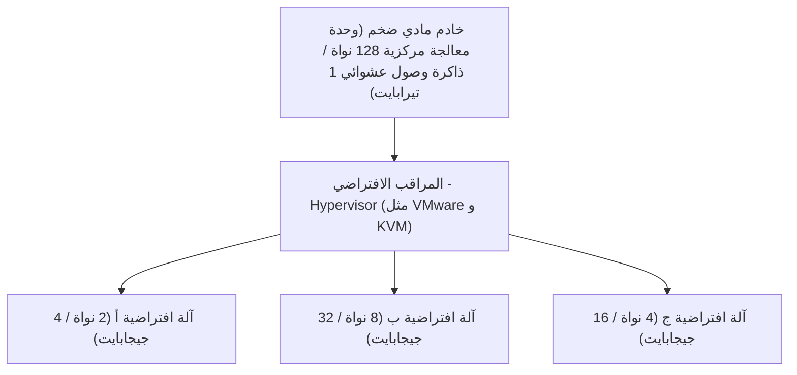

## 1. من الأنظمة المحلية (On-premises) إلى السحابة

في الماضي، عندما كانت الشركات ترغب في إطلاق خدمة ويب جديدة أو نظام داخلي، كان عليها البدء بشراء "خوادم مادية" أولاً. ويُعرف هذا باسم " **الأنظمة المحلية (التشغيل الذاتي)** ".

كانت الأنظمة المحلية تستغرق أشهراً من وقت طلب الخادم إلى تركيبه في مركز البيانات، وتوصيل الأسلاك، وتثبيت نظام التشغيل. بالإضافة إلى ذلك، لم يكن من الممكن زيادة عدد الخوادم فوراً بمجرد زيادة حركة المرور، وعلى العكس من ذلك، حتى لو انخفضت حركة المرور، كانت هناك مخاطرة كبيرة بأن تكاليف شراء الخادم وتكاليف الصيانة (مثل فواتير الكهرباء) ستستمر.

ما قلب هذا المفهوم الشائع رأساً على عقب هو " **الحوسبة السحابية** ".

السحابة هي خدمة تتيح لك استئجار موارد الحوسبة (مثل وحدة المعالجة المركزية، الذاكرة، والتخزين) في مراكز بيانات ضخمة عبر الإنترنت، " **عند الحاجة** " و" **بالقدر المطلوب** " و" **بنظام الدفع حسب الاستخدام** ".

## 2. نماذج الخدمات الثلاثة للسحابة (IaaS / PaaS / SaaS)

تُصنف الحوسبة السحابية بشكل رئيسي إلى ثلاثة نماذج بناءً على "مدى ما يديره المستخدم بنفسه". دعونا نشبه ذلك بطلب البيتزا.

1. **IaaS (البنية التحتية كخدمة)**
   - **المحتوى**: استئجار "البنية التحتية" فقط مثل وحدة المعالجة المركزية والذاكرة والشبكة. وتقوم بتثبيت نظام التشغيل والبرمجيات الوسيطة بنفسك.
   - **مثال البيتزا**: شراء عجينة البيتزا فقط، ووضع الإضافات وخبزها بنفسك في فرن المنزل.
   - **أمثلة بارزة**: AWS (Amazon EC2)، Google Compute Engine

2. **PaaS (المنصة كخدمة)**
   - **المحتوى**: لا يقتصر الأمر على البنية التحتية فحسب، بل يتم توفير نظام التشغيل وقواعد البيانات وبيئة تشغيل البرامج كمجموعة متكاملة. يمكن للمطورين التركيز فقط على "كتابة الأكواد".
   - **مثال البيتزا**: شراء "بيتزا مجمدة" من السوبر ماركت وتسخينها في الميكروويف بالمنزل.
   - **أمثلة بارزة**: AWS Elastic Beanstalk، Heroku، Vercel

3. **SaaS (البرمجيات كخدمة)**
   - **المحتوى**: استخدام البرنامج نفسه كخدمة عبر الإنترنت. لا يحتاج المستخدمون إلى إدارة أي شيء.
   - **مثال البيتزا**: الاتصال بمطعم البيتزا لطلب بيتزا مخبوزة وتوصيلها وتناولها فقط.
   - **أمثلة بارزة**: Gmail، Slack، Salesforce، Microsoft 365

## 3. "تقنية المحاكاة الافتراضية" التي تدعم السحابة

تحتوي مراكز بيانات مزودي الخدمات السحابية على عشرات الآلاف من الخوادم المادية الضخمة. ومع ذلك، يمكن للمستخدمين استئجار خوادم بوحدات صغيرة مثل "وحدة معالجة مركزية بـ 2 نواة، وذاكرة 4 جيجابايت".

ما يحقق ذلك هو " **تقنية المحاكاة الافتراضية (Virtualization)** ".

يقوم برنامج خاص يسمى المراقب الافتراضي (Hypervisor) بتقسيم خادم مادي واحد منطقياً، لإنشاء عدة " **آلات افتراضية (VM: Virtual Machine)** ".

كل آلة افتراضية مستقلة، ولا تتأثر إذا تعطلت الآلة الافتراضية المجاورة لها. يمكن للمستخدمين تشغيل آلة افتراضية جديدة في ثوانٍ معدودة بمجرد النقر على زر من شاشة الإدارة في المتصفح، أو حذفها وإيقاف الفوترة عندما لا تعد هناك حاجة إليها.

## 4. مزايا السحابة والتحديات الحديثة

أصبح الانتقال إلى السحابة استراتيجية أساسية في الأعمال الحديثة.

- **السرعة والمرونة**: عند التوصل إلى فكرة، يمكنك إعداد خادم في دقائق ونشر الخدمة في جميع أنحاء العالم.
- **قابلية التوسع (Scalability)**: حتى لو تم عرض الخدمة على التلفزيون وزادت الزيارات 100 مرة، يمكن زيادة عدد الخوادم تلقائياً للتعامل مع ذلك (التوسع التلقائي)، وبمجرد انتهاء الذروة يمكن إعادتها كما كانت.
- **خفض التكاليف**: تصبح التكلفة الأولية صفراً، وتقتصر على تكاليف التشغيل التي تدفعها بناءً على ما تستخدمه فقط.

من ناحية أخرى، هناك أيضاً تحديات. لا تنتهي حوادث **تسرب المعلومات واسعة النطاق** الناجمة عن أخطاء في إعدادات السحابة (مثل أخطاء في إعدادات النشر للتخزين)، ومشكلة " **تقييد المورد (Vendor lock-in)** " حيث يصبح الانتقال إلى شركة أخرى صعباً بسبب الاعتماد المفرط للنظام على مزود سحابي معين (مثل AWS).

## 5. الخلاصة

الحوسبة السحابية تشبه "الكهرباء" أو "الماء" في عالم تكنولوجيا المعلومات.

في الماضي، كانت كل شركة تبني محطات توليد طاقة (خوادم) خاصة بها، ولكن الآن بمجرد التوصيل بالمقبس (الإنترنت)، أصبح من الممكن استخدام الكهرباء (موارد الحوسبة) بتكلفة منخفضة وفي أي وقت وبالقدر المطلوب.

هذا التحول النموذجي "من التملك إلى الاستخدام" هو ما يدعم طفرة الشركات الناشئة اليوم والتطور الهائل لتقنيات الذكاء الاصطناعي.
