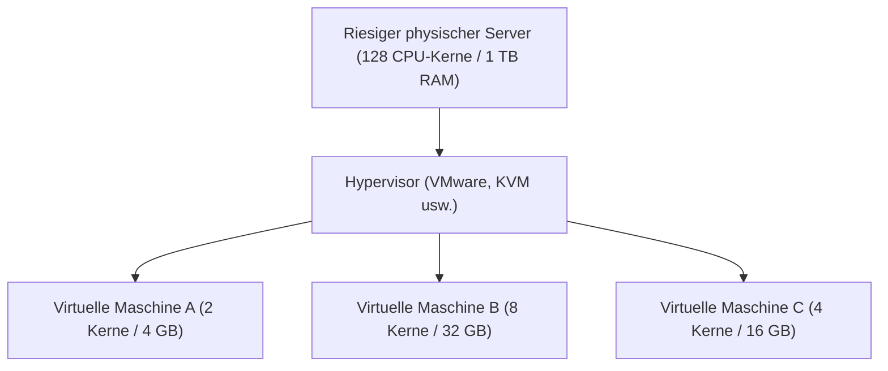

## 1. Von On-Premises zur Cloud

Als Unternehmen früher neue Webdienste oder interne Systeme einrichten wollten, mussten sie zunächst damit beginnen, "physische Servermaschinen" zu kaufen. Dies wird als "**On-Premises**" (lokaler Betrieb) bezeichnet.
Bei On-Premises dauerte es oft mehrere Monate von der Bestellung der Server über die Installation im Rechenzentrum und der Verkabelung bis hin zur Installation des Betriebssystems. Darüber hinaus konnten Server bei einem plötzlichen Anstieg der Zugriffe nicht sofort aufgestockt werden. Umgekehrt blieben bei einem Rückgang der Zugriffe die Anschaffungs- und Wartungskosten (wie Stromkosten) bestehen, was ein großes Risiko darstellte.

Dieses Paradigma wurde durch "**Cloud Computing**" grundlegend verändert.
Die Cloud ist ein Dienst, bei dem man Computerressourcen (CPU, Speicher, Festplattenplatz usw.) aus riesigen Rechenzentren auf der anderen Seite des Internets **"nur bei Bedarf", "nur in der benötigten Menge" und "mit nutzungsbasierter Abrechnung"** mieten kann.

## 2. Die 3 Servicemodelle der Cloud (IaaS / PaaS / SaaS)

Cloud Computing wird grob in drei Modelle unterteilt, je nachdem, "wie viel der Nutzer selbst verwalten muss". Vergleichen wir dies mit einer Pizzabestellung.

1. **IaaS (Infrastructure as a Service)**
   - **Inhalt**: Man mietet nur die "Infrastruktur" wie CPU, Speicher und Netzwerk. Die Installation des Betriebssystems und der Middleware muss man selbst durchführen.
   - **Pizza-Beispiel**: Man kauft nur den Pizzateig, belegt und backt ihn im eigenen Ofen zu Hause.
   - **Typische Beispiele**: AWS (Amazon EC2), Google Compute Engine

2. **PaaS (Platform as a Service)**
   - **Inhalt**: Neben der Infrastruktur werden auch das Betriebssystem, die Datenbank und die Laufzeitumgebung für Programme als Paket bereitgestellt. Entwickler können sich ganz auf das "Schreiben von Code" konzentrieren.
   - **Pizza-Beispiel**: Man kauft eine "Tiefkühlpizza" im Supermarkt und macht sie nur in der heimischen Mikrowelle warm.
   - **Typische Beispiele**: AWS Elastic Beanstalk, Heroku, Vercel

3. **SaaS (Software as a Service)**
   - **Inhalt**: Die Software selbst wird über das Internet als Dienst genutzt. Der Nutzer muss nichts verwalten.
   - **Pizza-Beispiel**: Man ruft bei der Pizzeria an, lässt sich die fertig gebackene Pizza liefern und isst sie einfach nur.
   - **Typische Beispiele**: Gmail, Slack, Salesforce, Microsoft 365

## 3. Die "Virtualisierungstechnologie" hinter der Cloud

In den Rechenzentren der Cloud-Anbieter stehen Zehntausende von riesigen physischen Servern. Die Nutzer können Server jedoch in kleinen Einheiten wie "2 CPU-Kerne, 4 GB RAM" mieten.
Möglich wird dies durch die "**Virtualisierungstechnologie (Virtualization)**".

Eine spezielle Software namens Hypervisor unterteilt einen physischen Server logisch und erstellt mehrere "**virtuelle Maschinen (VM: Virtual Machine)**".
Jede virtuelle Maschine ist unabhängig, sodass der Absturz einer benachbarten virtuellen Maschine keine Auswirkungen hat. Nutzer können mit wenigen Klicks in der Browser-Verwaltungsoberfläche innerhalb von Sekunden neue virtuelle Maschinen starten oder sie löschen, wenn sie nicht mehr benötigt werden, um die Abrechnung zu stoppen.

## 4. Vorteile der Cloud und heutige Herausforderungen

Der Wechsel in die Cloud ist heute eine unverzichtbare Strategie in der Geschäftswelt.

- **Geschwindigkeit und Flexibilität**: Wenn man eine Idee hat, kann man innerhalb von Minuten einen Server einrichten und den Dienst weltweit veröffentlichen.
- **Skalierbarkeit (Erweiterbarkeit)**: Selbst wenn die Zugriffe auf das 100-fache ansteigen, weil der Dienst im Fernsehen erwähnt wurde, kann die Anzahl der Server automatisch erhöht (Auto-Scaling) und nach der Spitze wieder reduziert werden.
- **Kostenreduzierung**: Die Anfangsinvestitionen (Initialkosten) sinken auf null, und es fallen nur laufende Kosten für das an, was man tatsächlich nutzt.

Auf der anderen Seite gibt es auch Herausforderungen. Wenn man ein System zu stark von einem bestimmten Cloud-Anbieter (wie AWS) abhängig macht, entsteht das Problem des "**Vendor Lock-in**", das einen Wechsel zu einem anderen Anbieter erschwert. Zudem kommt es immer wieder zu **groß angelegten Datenlecks**, die durch Fehlkonfigurationen in der Cloud (z. B. falsche Freigabeeinstellungen für Speicher) verursacht werden.

## 5. Fazit

Cloud Computing ist wie "Strom" oder "Wasser" in der IT-Welt.
Früher baute jedes Unternehmen sein eigenes Kraftwerk (Server), aber heute kann man Computerressourcen kostengünstig nutzen, indem man einfach nur den Stecker in die Steckdose (Internet) steckt, wann und wie viel man braucht.
Dieser Paradigmenwechsel "vom Besitz zur Nutzung" ist die Grundlage für den heutigen Startup-Boom und die explosionsartige Entwicklung der KI-Technologie.
