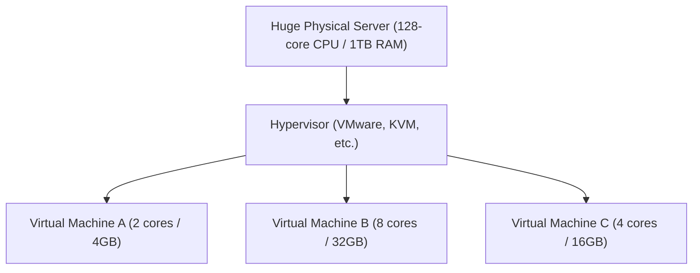

## 1. From On-Premises to the Cloud

In the past, when a company wanted to launch a new web service or internal system, they first had to start by purchasing "physical server machines". This is called "**on-premises (in-house operation)**".
On-premises required several months from ordering the server to installing it in a data center, wiring, and installing the OS. Furthermore, even if traffic spiked, it was not possible to add servers immediately, and conversely, even if traffic decreased, there was a major risk of continuing to incur the purchase cost and maintenance expenses (such as electricity bills) of the servers.

What fundamentally overturned this common sense was "**cloud computing**".
The cloud is a service that allows you to rent computer resources (CPU, memory, storage, etc.) from huge data centers on the other side of the internet **"when needed", "as much as needed", and "on a pay-as-you-go basis"**.

## 2. 3 Service Models of Cloud (IaaS / PaaS / SaaS)

Cloud computing is broadly classified into three models depending on "how much the user manages themselves". Let's compare this to ordering pizza.

1. **IaaS (Infrastructure as a Service)**
   - **Content**: Renting only "infrastructure" such as CPU, memory, and network. You have to install the OS and middleware yourself.
   - **Pizza example**: Buying only the pizza dough and doing the toppings and baking yourself in your home oven.
   - **Typical examples**: AWS (Amazon EC2), Google Compute Engine

2. **PaaS (Platform as a Service)**
   - **Content**: Not only the infrastructure, but also the OS, database, and program execution environment are provided as a set. Developers can focus solely on "writing code".
   - **Pizza example**: Buying a "frozen pizza" at the supermarket and just heating it up in your home microwave.
   - **Typical examples**: AWS Elastic Beanstalk, Heroku, Vercel

3. **SaaS (Software as a Service)**
   - **Content**: Using the software itself as a service over the internet. Users do not need to manage anything.
   - **Pizza example**: Calling a pizza shop and having a baked pizza delivered, just to eat it.
   - **Typical examples**: Gmail, Slack, Salesforce, Microsoft 365

## 3. The "Virtualization Technology" Supporting the Cloud

There are tens of thousands of huge physical servers lined up in the data centers of cloud service providers. However, users can rent servers in small units such as "2 cores of CPU, 4GB of memory".
What makes this possible is "**virtualization technology**".

A special software called a hypervisor logically divides a single physical server and creates multiple "**Virtual Machines (VM)**".
Each virtual machine is independent, so if an adjacent virtual machine crashes, it is not affected. Users can launch a new virtual machine in a few seconds just by clicking a button from the management screen on a browser, or they can delete it to stop billing when it is no longer needed.

## 4. Benefits of Cloud and Modern Challenges

Migrating to the cloud has become an essential strategy in modern business.

- **Speed and Flexibility**: If you come up with an idea, you can launch a server in a few minutes and publish the service to the world.
- **Scalability**: Even if your site is featured on TV and traffic increases 100-fold, you can automatically increase the number of servers to handle it (auto-scaling) and return them to original levels once the peak passes.
- **Cost Reduction**: Initial costs become zero, and you only pay running costs for what you use.

On the other hand, there are also challenges. Depending too much on a specific cloud provider (like AWS) for your systems can lead to "**vendor lock-in**", making it difficult to switch to other companies. In addition, **large-scale information leakage incidents** due to cloud misconfigurations (such as mistakes in public storage settings) continue to occur.

## 5. Conclusion

Cloud computing is like "electricity" or "water" in the IT world.
In the past, each company built its own power plants (servers), but now, simply by plugging into an outlet (the internet), you can use electricity (computer resources) cheaply, exactly when and as much as you need.
This paradigm shift "from ownership to usage" is underpinning today's startup boom and the explosive evolution of AI technology.
