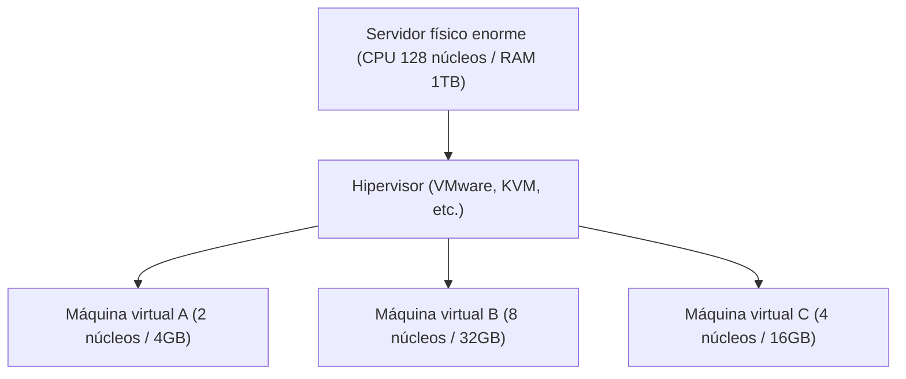

## 1. De las instalaciones locales a la nube

En el pasado, cuando una empresa quería lanzar un nuevo servicio web o un sistema interno, primero tenía que empezar comprando la "máquina de servidor físico". A esto se le llama "**instalaciones locales (operación propia) u on-premise**".
Las instalaciones locales requerían meses, desde el pedido del servidor hasta la instalación en el centro de datos, el cableado y la instalación del sistema operativo (OS). Además, si el tráfico aumentaba repentinamente, no se podía añadir más servidores de inmediato; por el contrario, si el tráfico disminuía, los costos de compra y mantenimiento de los servidores (como la factura de electricidad) seguían generándose, lo cual representaba un gran riesgo.

Lo que cambió fundamentalmente este sentido común fue la "**computación en la nube**".
La nube es un servicio que permite alquilar los recursos informáticos (CPU, memoria, almacenamiento, etc.) de un enorme centro de datos al otro lado de Internet, **"cuando se necesite", "en la cantidad necesaria" y "con pago por uso"**.

## 2. Los 3 modelos de servicio de la nube (IaaS / PaaS / SaaS)

La computación en la nube se divide en gran medida en tres modelos, dependiendo de "cuánto gestiona por sí mismo" el usuario. Comparemos esto con pedir una pizza.

1. **IaaS (Infrastructure as a Service)**
   - **Contenido**: Solo se alquila la "infraestructura", como CPU, memoria y red. El usuario debe instalar el SO y el middleware por sí mismo.
   - **Ejemplo de la pizza**: Es como comprar solo la masa de pizza y poner los ingredientes y hornearla uno mismo en el horno de casa.
   - **Ejemplo representativo**: AWS (Amazon EC2), Google Compute Engine

2. **PaaS (Platform as a Service)**
   - **Contenido**: Además de la infraestructura, se proporciona como un paquete el SO, la base de datos y el entorno de ejecución de programas. Los desarrolladores pueden concentrarse únicamente en "escribir código".
   - **Ejemplo de la pizza**: Es como comprar una "pizza congelada" en el supermercado y simplemente calentarla en el microondas de casa.
   - **Ejemplo representativo**: AWS Elastic Beanstalk, Heroku, Vercel

3. **SaaS (Software as a Service)**
   - **Contenido**: Se utiliza el propio software como un servicio a través de Internet. Los usuarios no necesitan gestionar nada.
   - **Ejemplo de la pizza**: Es como llamar a la pizzería, pedir que te entreguen una pizza recién horneada y simplemente comérsela.
   - **Ejemplo representativo**: Gmail, Slack, Salesforce, Microsoft 365

## 3. La "tecnología de virtualización" que sustenta la nube

En los centros de datos de los proveedores de servicios en la nube, hay decenas de miles de enormes servidores físicos en fila. Sin embargo, los usuarios pueden alquilar servidores en unidades pequeñas, como "2 núcleos de CPU y 4 GB de memoria".
Lo que hace esto posible es la "**tecnología de virtualización (Virtualization)**".

Un software especial llamado hipervisor divide lógicamente un solo servidor físico y crea múltiples "**máquinas virtuales (VM: Virtual Machine)**".
Cada máquina virtual es independiente, por lo que si una máquina virtual vecina falla, las demás no se ven afectadas. Con solo hacer clic en un botón desde la pantalla de gestión del navegador, los usuarios pueden iniciar una nueva máquina virtual en segundos, o eliminarla y detener la facturación cuando ya no la necesiten.

## 4. Beneficios y desafíos modernos de la nube

La migración a la nube se ha convertido en una estrategia indispensable en los negocios modernos.

- **Velocidad y flexibilidad**: Al concebir una idea, se puede lanzar un servidor en minutos y publicar el servicio para todo el mundo.
- **Escalabilidad (capacidad de expansión)**: Incluso si se presenta en la televisión y el tráfico se multiplica por 100, la cantidad de servidores se puede aumentar automáticamente para responder (auto-scaling) y volver a la normalidad cuando pase el pico.
- **Reducción de costos**: El costo inicial se vuelve cero y el único costo continuo es pagar solo por lo que se utiliza.

Por otro lado, también hay desafíos. Existe el problema del "**bloqueo del proveedor (vendor lock-in)**", donde depender demasiado de un proveedor de nube específico (como AWS) dificulta cambiar a otra compañía, y continúan ocurriendo **fugas masivas de información** debido a errores en la configuración de la nube (como errores en la configuración pública del almacenamiento).

## 5. Resumen

La computación en la nube es como la "electricidad" o el "agua" en el mundo de la TI.
En el pasado, cada empresa construía su propia planta de energía (servidor), pero ahora, con solo conectarse a un enchufe (Internet), es posible utilizar energía (recursos informáticos) de manera económica cuando se necesita y en la cantidad necesaria.
Este cambio de paradigma de "la propiedad al uso" sustenta el actual auge de las startups y la evolución explosiva de la tecnología de inteligencia artificial.
