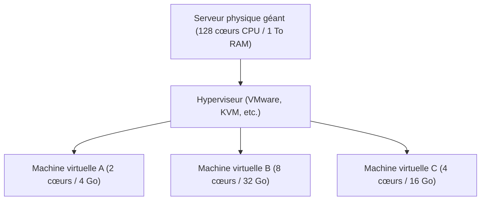

## 1. De sur site (on-premise) au cloud

Autrefois, lorsqu'une entreprise souhaitait lancer un nouveau service web ou un système interne, elle devait commencer par acheter une « machine serveur physique ». C'est ce qu'on appelle le « **sur site (on-premise)** ».
Le sur site nécessitait plusieurs mois, depuis la commande du serveur jusqu'à son installation dans un centre de données, en passant par le câblage et l'installation de l'OS. De plus, il n'était pas possible d'ajouter rapidement des serveurs en cas d'augmentation soudaine du trafic, et à l'inverse, si le trafic diminuait, le coût d'achat et les frais de maintenance (comme l'électricité) des serveurs continuaient de s'appliquer, ce qui représentait un risque majeur.

Le « **cloud computing** » a fondamentalement bouleversé cette norme.
Le cloud est un service qui permet d'emprunter les ressources informatiques (CPU, mémoire, stockage, etc.) de gigantesques centres de données situés de l'autre côté d'Internet, **« au moment voulu », « en quantité souhaitée » et « avec une facturation à l'usage »**.

## 2. Les 3 modèles de service du cloud (IaaS / PaaS / SaaS)

Le cloud computing est globalement classé en 3 modèles selon « jusqu'où l'utilisateur gère lui-même ». Prenons l'exemple de la commande d'une pizza.

1. **IaaS (Infrastructure as a Service)**
   - **Contenu** : On ne loue que l'« infrastructure » comme le CPU, la mémoire et le réseau. L'installation de l'OS et des intergiciels (middleware) doit être effectuée par soi-même.
   - **Exemple de la pizza** : C'est comme acheter seulement la pâte à pizza, ajouter les garnitures et la cuire soi-même dans le four à la maison.
   - **Exemples représentatifs** : AWS (Amazon EC2), Google Compute Engine

2. **PaaS (Platform as a Service)**
   - **Contenu** : En plus de l'infrastructure, l'OS, la base de données et l'environnement d'exécution du programme sont fournis sous forme de pack. Les développeurs peuvent se concentrer uniquement sur « l'écriture du code ».
   - **Exemple de la pizza** : C'est comme acheter une « pizza surgelée » au supermarché et la réchauffer simplement au micro-ondes à la maison.
   - **Exemples représentatifs** : AWS Elastic Beanstalk, Heroku, Vercel

3. **SaaS (Software as a Service)**
   - **Contenu** : Le logiciel lui-même est utilisé en tant que service via Internet. Les utilisateurs n'ont rien à gérer.
   - **Exemple de la pizza** : C'est comme appeler une pizzeria, se faire livrer une pizza cuite et la manger tout simplement.
   - **Exemples représentatifs** : Gmail, Slack, [Salesforce](/fr/p/salesforcechatter%E5%85%A8%E6%B6%88%E3%81%97commande/), Microsoft 365

## 3. La « technologie de virtualisation » qui soutient le cloud

Dans les centres de données des fournisseurs de services cloud, des dizaines de milliers d'énormes serveurs physiques sont alignés. Cependant, les utilisateurs peuvent louer des serveurs par petites unités, comme « 2 cœurs de CPU et 4 Go de mémoire ».
C'est la « **technologie de virtualisation (Virtualization)** » qui rend cela possible.

Un logiciel spécial appelé hyperviseur divise logiquement un seul serveur physique et crée plusieurs « **machines virtuelles (VM : Virtual Machine)** ».
Chaque machine virtuelle est indépendante, de sorte que si une machine virtuelle voisine plante, elle n'en subit pas les conséquences. En quelques clics depuis l'interface d'administration d'un navigateur, un utilisateur peut démarrer une nouvelle machine virtuelle en quelques secondes, ou la supprimer lorsqu'elle n'est plus nécessaire pour arrêter la facturation.

## 4. Les avantages du cloud et les défis actuels

La migration vers le cloud est devenue une stratégie indispensable pour les entreprises d'aujourd'hui.

- **Vitesse et flexibilité** : Dès qu'on a une idée, on peut démarrer un serveur en quelques minutes et publier un service dans le monde entier.
- **Évolutivité (Scalabilité)** : Même si le trafic est multiplié par 100 suite à une présentation à la télévision, il est possible d'augmenter automatiquement le nombre de serveurs pour y faire face (auto-scaling) et de revenir à la normale une fois le pic passé.
- **Réduction des coûts** : Les coûts initiaux sont nuls, et on ne paie que les coûts d'exploitation correspondant à l'utilisation.

Cependant, il existe également des défis. La dépendance excessive à l'égard d'un fournisseur de cloud spécifique (comme AWS) pour son système peut rendre difficile le passage à une autre entreprise, un problème appelé « **enfermement propriétaire (vendor lock-in)** ». De plus, des **incidents majeurs de fuite d'informations** dus à de mauvaises configurations du cloud (comme des erreurs de paramètres de publication de stockage) se produisent fréquemment.

## 5. Résumé

Le cloud computing est semblable à l'« électricité » ou à l'« eau » dans le monde de l'informatique.
Autrefois, chaque entreprise construisait sa propre centrale électrique (serveur), mais aujourd'hui, il suffit de se brancher à une prise (Internet) pour pouvoir utiliser de l'électricité (ressources informatiques) à bas prix, au moment voulu et dans les quantités souhaitées.
Ce changement de paradigme, « de la possession à l'utilisation », est ce qui soutient le boom actuel des startups et l'évolution explosive de la technologie de l'IA.
