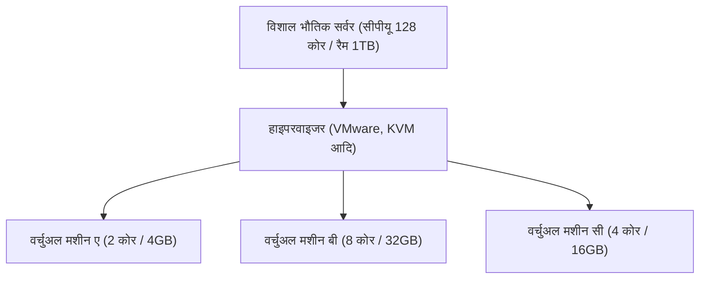

## 1. ऑन-प्रिमाइसेस से क्लाउड तक

अतीत में, जब किसी कंपनी ने एक नई वेब सेवा या आंतरिक प्रणाली शुरू करने का प्रयास किया, तो उन्हें सबसे पहले "भौतिक सर्वर मशीनें" खरीदकर शुरुआत करनी पड़ती थी। इसे "**ऑन-प्रिमाइसेस (इन-हाउस ऑपरेशन)**" कहा जाता है।
ऑन-प्रिमाइसेस में, सर्वर ऑर्डर करने से लेकर डेटा सेंटर में इसे स्थापित करने, वायरिंग और ओएस (OS) स्थापित करने तक कई महीनों का समय लगता था। इसके अलावा, अचानक एक्सेस बढ़ने पर तुरंत सर्वर बढ़ाना संभव नहीं था, और इसके विपरीत, एक्सेस कम होने पर भी सर्वर खरीदने की लागत और रखरखाव लागत (जैसे बिजली का बिल) का बड़ा जोखिम बना रहता था।

इस सामान्य ज्ञान को पूरी तरह से उलट देने वाला "**क्लाउड कंप्यूटिंग**" है।
क्लाउड एक ऐसी सेवा है जो इंटरनेट के दूसरी तरफ स्थित विशाल डेटा केंद्रों के कंप्यूटर संसाधनों (सीपीयू, मेमोरी, स्टोरेज, आदि) को **"जब आवश्यक हो"**, **"जितनी आवश्यकता हो"**, और **"उपयोग के अनुसार भुगतान (pay-as-you-go)"** के आधार पर किराए पर लेने की अनुमति देती है।

## 2. क्लाउड के 3 सेवा मॉडल (IaaS / PaaS / SaaS)

क्लाउड कंप्यूटिंग को मोटे तौर पर 3 मॉडलों में वर्गीकृत किया गया है, जो इस बात पर निर्भर करता है कि उपयोगकर्ता "स्वयं कितना प्रबंधन करता है"। आइए इसकी तुलना पिज़्ज़ा ऑर्डर करने से करें।

1. **IaaS (Infrastructure as a Service)**
   - **सामग्री**: केवल सीपीयू, मेमोरी और नेटवर्क जैसे "इंफ्रास्ट्रक्चर" किराए पर लेना। आप ओएस (OS) और मिडलवेयर स्वयं स्थापित करते हैं।
   - **पिज़्ज़ा का उदाहरण**: केवल पिज़्ज़ा बेस खरीदना और घर के ओवन में स्वयं टॉपिंग लगाना और पकाना।
   - **प्रमुख उदाहरण**: AWS (Amazon EC2), Google Compute Engine

2. **PaaS (Platform as a Service)**
   - **सामग्री**: न केवल इंफ्रास्ट्रक्चर, बल्कि ओएस, डेटाबेस और प्रोग्राम निष्पादन वातावरण भी एक सेट के रूप में प्रदान किए जाते हैं। डेवलपर्स केवल "कोड लिखने" पर ध्यान केंद्रित कर सकते हैं।
   - **पिज़्ज़ा का उदाहरण**: सुपरमार्केट से "जमा हुआ पिज़्ज़ा" खरीदना और घर के माइक्रोवेव में उसे गर्म करना।
   - **प्रमुख उदाहरण**: AWS Elastic Beanstalk, Heroku, Vercel

3. **SaaS (Software as a Service)**
   - **सामग्री**: इंटरनेट के माध्यम से सॉफ़्टवेयर को एक सेवा के रूप में उपयोग करना। उपयोगकर्ताओं को कुछ भी प्रबंधित करने की आवश्यकता नहीं है।
   - **पिज़्ज़ा का उदाहरण**: पिज़्ज़ा की दुकान पर कॉल करना, बेक किया हुआ पिज़्ज़ा डिलीवर करवाना और बस उसे खाना।
   - **प्रमुख उदाहरण**: Gmail, Slack, Salesforce, Microsoft 365

## 3. क्लाउड का समर्थन करने वाली "वर्चुअलाइजेशन तकनीक"

क्लाउड सेवा प्रदाताओं के डेटा केंद्रों में हजारों विशाल भौतिक सर्वर एक साथ रखे गए हैं। हालाँकि, उपयोगकर्ता छोटे आकार में सर्वर किराए पर ले सकते हैं, जैसे "2 कोर वाला सीपीयू और 4GB मेमोरी"।
इसे संभव बनाने वाली तकनीक "**वर्चुअलाइजेशन तकनीक (Virtualization)**" है।

हाइपरवाइजर (Hypervisor) नामक एक विशेष सॉफ़्टवेयर तार्किक रूप से एक भौतिक सर्वर को विभाजित करता है और कई "**वर्चुअल मशीन (VM: Virtual Machine)**" बनाता है।
प्रत्येक वर्चुअल मशीन स्वतंत्र है और यदि उसके बगल की वर्चुअल मशीन क्रैश हो जाती है तो वह प्रभावित नहीं होती है। उपयोगकर्ता ब्राउज़र प्रबंधन स्क्रीन से केवल एक बटन पर क्लिक करके कुछ ही सेकंड में एक नई वर्चुअल मशीन शुरू कर सकते हैं, या अनावश्यक होने पर इसे हटा सकते हैं और बिलिंग रोक सकते हैं।

## 4. क्लाउड के लाभ और आधुनिक चुनौतियाँ

आधुनिक व्यवसाय के लिए क्लाउड में माइग्रेट करना एक आवश्यक रणनीति बन गया है।

- **गति और लचीलापन**: एक बार विचार आने पर, आप कुछ ही मिनटों में सर्वर सेट कर सकते हैं और पूरी दुनिया में अपनी सेवा जारी कर सकते हैं।
- **स्केलेबिलिटी (विस्तारशीलता)**: भले ही टीवी पर इसका परिचय दिया जाए और एक्सेस 100 गुना बढ़ जाए, यह स्वचालित रूप से सर्वर की संख्या बढ़ाकर (ऑटो-स्केलिंग) इसे संभाल सकता है, और चरम सीमा (peak) पार होने के बाद इसे वापस सामान्य कर सकता है।
- **लागत में कमी**: प्रारंभिक लागत (प्रारंभिक व्यय) शून्य हो जाती है, और केवल रनिंग लागत रह जाती है जहाँ आप उतना ही भुगतान करते हैं जितना आप उपयोग करते हैं।

दूसरी ओर, कुछ चुनौतियाँ भी हैं। ऐसी समस्याएँ सामने आती रहती हैं जैसे "**वेंडर लॉक-इन**", जहाँ आप किसी विशिष्ट क्लाउड प्रदाता (जैसे AWS) पर बहुत अधिक निर्भर हो जाते हैं, जिससे किसी अन्य कंपनी में जाना मुश्किल हो जाता है, और क्लाउड कॉन्फ़िगरेशन त्रुटियों (जैसे स्टोरेज की सार्वजनिक सेटिंग में गलती) के कारण **बड़े पैमाने पर जानकारी लीक होने की घटनाएँ** होती हैं।

## 5. निष्कर्ष

क्लाउड कंप्यूटिंग आईटी जगत में "बिजली" या "पानी" के समान है।
अतीत में, प्रत्येक कंपनी अपने स्वयं വൈദ്യുതി संयंत्र (सर्वर) बनाती थी, लेकिन अब वे बस एक आउटलेट (इंटरनेट) में प्लग करके आवश्यकता पड़ने पर आवश्यक मात्रा में बिजली (कंप्यूटर संसाधन) का सस्ते में उपयोग कर सकते हैं।
"स्वामित्व से उपयोग तक" यह प्रतिमान बदलाव (paradigm shift) आज के स्टार्टअप बूम और एआई (AI) तकनीक के विस्फोटक विकास का समर्थन कर रहा है।
