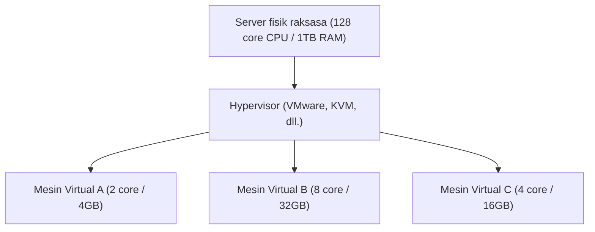

## 1. Dari On-Premise ke Cloud

Di masa lalu, ketika sebuah perusahaan ingin meluncurkan layanan web baru atau sistem internal, mereka harus mulai dengan membeli "mesin server fisik". Ini disebut "**on-premise (pengoperasian internal)**".
On-premise memakan waktu berbulan-bulan, mulai dari pemesanan server, pemasangan di pusat data, pemasangan kabel, hingga instalasi OS. Selain itu, ada risiko besar bahwa server tidak dapat segera ditambah saat terjadi lonjakan akses yang tiba-tiba, dan sebaliknya, meskipun akses menurun, biaya pembelian server dan biaya pemeliharaan (seperti tagihan listrik) terus berjalan.

Hal yang sepenuhnya mengubah pemikiran konvensional ini adalah "**cloud computing (komputasi awan)**".
Cloud adalah layanan yang memungkinkan Anda menyewa sumber daya komputasi (CPU, memori, penyimpanan, dll.) dari pusat data raksasa di seberang internet, **"saat diperlukan", "sebanyak yang diperlukan", dan "dengan pembayaran sesuai penggunaan"**.

## 2. 3 Model Layanan Cloud (IaaS / PaaS / SaaS)

Cloud computing secara garis besar diklasifikasikan menjadi tiga model berdasarkan "sejauh mana pengguna mengelolanya sendiri". Mari kita ibaratkan ini dengan memesan pizza.

1. **IaaS (Infrastructure as a Service)**
   - **Konten**: Hanya menyewa "infrastruktur" seperti CPU, memori, dan jaringan. Instalasi OS dan middleware dilakukan sendiri.
   - **Contoh Pizza**: Seperti membeli adonan pizza saja, lalu menambahkan topping dan memanggangnya sendiri di oven rumah.
   - **Contoh Representatif**: AWS (Amazon EC2), Google Compute Engine

2. **PaaS (Platform as a Service)**
   - **Konten**: Tidak hanya infrastruktur, tetapi OS, basis data, dan lingkungan eksekusi program disediakan sebagai satu kesatuan. Pengembang dapat fokus hanya pada "menulis kode".
   - **Contoh Pizza**: Seperti membeli "pizza beku" di supermarket, lalu hanya memanaskannya di microwave rumah.
   - **Contoh Representatif**: AWS Elastic Beanstalk, Heroku, Vercel

3. **SaaS (Software as a Service)**
   - **Konten**: Menggunakan perangkat lunak itu sendiri sebagai layanan melalui internet. Pengguna tidak perlu mengelola apa pun.
   - **Contoh Pizza**: Seperti menelepon restoran pizza, meminta pizza yang sudah matang diantar, dan hanya tinggal memakannya.
   - **Contoh Representatif**: Gmail, Slack, Salesforce, Microsoft 365

## 3. "Teknologi Virtualisasi" yang Mendukung Cloud

Di pusat data penyedia layanan cloud, terdapat puluhan ribu server fisik raksasa yang berjejer. Namun, pengguna dapat menyewa server dalam unit kecil seperti "CPU 2 core, memori 4GB".
Hal yang mewujudkan ini adalah "**teknologi virtualisasi (Virtualization)**".

Perangkat lunak khusus yang disebut hypervisor secara logis membagi satu server fisik dan menciptakan beberapa "**mesin virtual (VM: Virtual Machine)**".
Setiap mesin virtual bersifat independen, sehingga jika mesin virtual di sebelahnya mengalami kerusakan, ia tidak akan terpengaruh. Pengguna hanya perlu mengklik tombol dari layar manajemen di browser untuk meluncurkan mesin virtual baru dalam beberapa detik, atau menghapusnya jika tidak lagi diperlukan untuk menghentikan tagihan.

## 4. Keuntungan Cloud dan Tantangan Modern

Beralih ke cloud telah menjadi strategi penting dalam bisnis modern.

- **Kecepatan dan Fleksibilitas**: Saat Anda mendapat ide, Anda dapat menyiapkan server dalam beberapa menit dan mempublikasikan layanan tersebut ke seluruh dunia.
- **Skalabilitas (Kemampuan Ekspansi)**: Meskipun akses meningkat 100 kali lipat karena diliput di televisi, Anda dapat menambah jumlah server secara otomatis (auto-scale), dan mengembalikannya seperti semula saat puncaknya berlalu.
- **Pengurangan Biaya**: Biaya awal (initial cost) menjadi nol, dan hanya ada biaya operasional (running cost) yang dibayarkan sesuai dengan apa yang digunakan.

Di sisi lain, ada juga tantangan. Ketergantungan sistem yang terlalu besar pada penyedia cloud tertentu (seperti AWS) akan mempersulit peralihan ke perusahaan lain, yang disebut masalah "**vendor lock-in**", dan juga **insiden kebocoran informasi berskala besar** akibat kesalahan konfigurasi cloud (seperti kesalahan dalam pengaturan publikasi penyimpanan) yang terus terjadi.

## 5. Kesimpulan

Cloud computing seperti "listrik" atau "air" di dunia TI.
Di masa lalu, setiap perusahaan membangun pembangkit listrik (server) mereka sendiri, namun sekarang, hanya dengan menyambungkan ke stopkontak (internet), mereka dapat menggunakan listrik (sumber daya komputasi) dengan harga terjangkau, kapan pun diperlukan dan sebanyak yang diperlukan.
Pergeseran paradigma "dari kepemilikan menjadi penggunaan" ini merupakan hal yang mendukung ledakan startup saat ini dan evolusi teknologi AI yang meledak-ledak.
