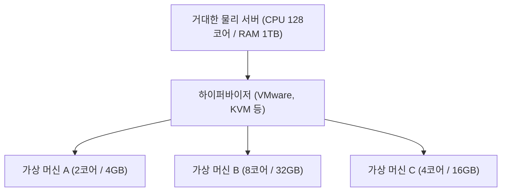

## 1. 온프레미스에서 클라우드로

과거에 기업이 새로운 웹 서비스나 사내 시스템을 구축하려고 할 때, 우선 '물리적인 서버 기기'를 구매하는 것부터 시작해야 했습니다. 이를 「 **온프레미스(자체 운영)** 」라고 부릅니다.
온프레미스는 서버 발주부터 데이터 센터 설치, 배선, OS 설치까지 수개월의 시간이 걸렸습니다. 게다가 트래픽이 급증했다고 해서 바로 서버를 늘릴 수 없고, 반대로 트래픽이 줄어도 서버 구매 대금이나 유지비(전기 요금 등)는 계속 나가는 큰 리스크가 있었습니다.

이 상식을 근본적으로 뒤집은 것이 「 **클라우드 컴퓨팅** 」입니다.
클라우드란 인터넷 너머에 있는 거대한 데이터 센터의 컴퓨터 리소스(CPU, 메모리, 스토리지 등)를, **「필요할 때」 「필요한 만큼」 「사용한 만큼만 요금을 지불하고」** 빌릴 수 있는 서비스입니다.

## 2. 클라우드의 3가지 서비스 모델 (IaaS / PaaS / SaaS)

클라우드 컴퓨팅은 사용자가 '어디까지 직접 관리할 것인가'에 따라 크게 3가지 모델로 분류됩니다. 이를 피자 주문에 비유해 보겠습니다.

1. **IaaS (Infrastructure as a Service)**
   - **내용**: CPU, 메모리, 네트워크 등의 '인프라'만 빌립니다. OS나 미들웨어 설치는 직접 합니다.
   - **피자의 예**: 피자 도우만 사서 토핑을 얹고 굽는 것은 집 오븐에서 직접 하는 상태.
   - **대표 예**: AWS (Amazon EC2), Google Compute Engine

2. **PaaS (Platform as a Service)**
   - **내용**: 인프라뿐만 아니라 OS나 데이터베이스, 프로그램 실행 환경까지 세트로 제공됩니다. 개발자는 '코드를 작성하는 것'에만 집중할 수 있습니다.
   - **피자의 예**: 마트에서 '냉동 피자'를 사 와서 집 전자레인지에 데우기만 하면 되는 상태.
   - **대표 예**: AWS Elastic Beanstalk, Heroku, Vercel

3. **SaaS (Software as a Service)**
   - **내용**: 소프트웨어 자체를 인터넷을 통해 서비스로 이용합니다. 사용자는 아무것도 관리할 필요가 없습니다.
   - **피자의 예**: 피자 가게에 전화해서 다 구워진 피자를 배달받고 먹기만 하면 되는 상태.
   - **대표 예**: Gmail, Slack, [Salesforce](/ko/p/salesforce%E3%81%AEsoql%E3%82%92%E5%88%A9%E7%94%A8%E3%81%97%E3%81%A6%E6%97%A5%E5%88%A5%E3%81%AE%E3%83%AC%E3%82%B3%E3%83%BC%E3%83%89%E4%BD%9C%E6%88%90%E6%95%B0%E3%82%92%E5%8F%96%E5%BE%97%E3%81%99%E3%82%8B%E6%96%B9%E6%B3%95/), Microsoft 365

## 3. 클라우드를 지탱하는 '가상화 기술'

클라우드 서비스 사업자의 데이터 센터에는 수만 대의 거대한 물리 서버가 늘어서 있습니다. 하지만 사용자는 'CPU 2코어, 메모리 4GB'와 같은 작은 단위로 서버를 빌릴 수 있습니다.
이를 실현하는 것이 「 **가상화 기술(Virtualization)** 」입니다.

하이퍼바이저라고 불리는 특수한 소프트웨어가 1대의 물리적인 서버를 논리적으로 분할하여 여러 대의 「 **가상 머신(VM: Virtual Machine)** 」을 만들어 냅니다.
각각의 가상 머신은 독립되어 있어서 옆의 가상 머신이 다운되어도 영향을 받지 않습니다. 사용자는 브라우저의 관리 화면에서 버튼을 클릭하는 것만으로 몇 초 만에 새로운 가상 머신을 시작하거나 필요 없으면 삭제하여 과금을 멈출 수 있습니다.

## 4. 클라우드의 장점과 현대의 과제

클라우드로의 전환은 현대 비즈니스에서 필수적인 전략이 되었습니다.

- **속도와 유연성**: 아이디어가 떠오르면 몇 분 만에 서버를 구축하고 전 세계에 서비스를 공개할 수 있습니다.
- **확장성(Scalability)**: TV에 소개되어 트래픽이 100배로 증가해도 자동으로 서버 대수를 늘려 대응하고(오토 스케일링), 피크 타임이 지나면 원래대로 되돌릴 수 있습니다.
- **비용 절감**: 초기 비용(이니셜 코스트)이 0이 되고, 사용한 만큼만 지불하는 유지 비용(런닝 코스트)만 남습니다.

반면에 과제도 있습니다. 특정 클라우드 사업자(AWS 등)에 시스템을 너무 의존함으로써 타사로의 이전이 어려워지는 「 **벤더 락인** 」 문제나, 클라우드 설정 실수(스토리지 공개 설정 오류 등)로 인한 **대규모 정보 유출 사고** 가 끊이지 않고 있습니다.

## 5. 요약

클라우드 컴퓨팅은 IT 세계의 '전기'나 '수도'와 같은 것입니다.
과거에는 각 기업이 자체적으로 발전소(서버)를 만들었지만, 이제는 콘센트(인터넷)에 연결하기만 하면 필요할 때 필요한 만큼 전기(컴퓨터 리소스)를 저렴하게 사용할 수 있게 되었습니다.
이러한 '소유에서 이용으로'의 패러다임 전환이 오늘날의 스타트업 붐이나 AI 기술의 폭발적인 진화를 뒷받침하고 있는 것입니다.
