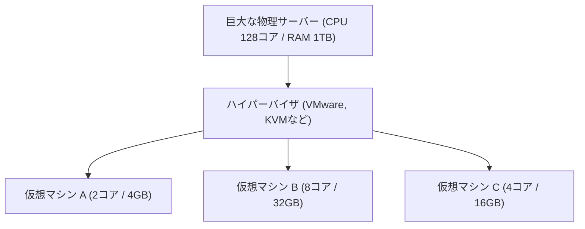

## 1. オンプレミスからクラウドへ

かつて、企業が新しいWebサービスや社内システムを立ち上げようとしたとき、まずは「物理的なサーバーの機械」を購入するところから始める必要がありました。これを「**オンプレミス（自社運用）**」と呼びます。
オンプレミスは、サーバーの発注からデータセンターへの設置、配線、OSのインストールまで数ヶ月の時間がかかりました。さらに、アクセスが急増したからといってすぐにサーバーを増やすことはできず、逆にアクセスが減ってもサーバーの購入代金や維持費（電気代など）はかかり続けるという大きなリスクがありました。

この常識を根底から覆したのが「**クラウドコンピューティング**」です。
クラウドとは、インターネットの向こう側にある巨大なデータセンターのコンピュータリソース（CPU、メモリ、ストレージなど）を、<strong>「必要な時に」「必要な分だけ」「従量課金で」</strong>借りることができるサービスです。

## 2. クラウドの3つのサービスモデル (IaaS / PaaS / SaaS)

クラウドコンピューティングは、利用者が「どこまでを自分で管理するか」によって、大きく3つのモデルに分類されます。これをピザの注文に例えてみましょう。

1. **IaaS (Infrastructure as a Service)**
   - **内容**: CPU、メモリ、ネットワークなどの「インフラ」だけを借りる。OSやミドルウェアのインストールは自分でやる。
   - **ピザの例**: ピザ生地だけ買ってきて、トッピングや焼くのは家のオーブンで自分でやる状態。
   - **代表例**: AWS (Amazon EC2), Google Compute Engine

2. **PaaS (Platform as a Service)**
   - **内容**: インフラだけでなく、OSやデータベース、プログラムの実行環境までがセットで提供される。開発者は「コードを書くこと」だけに集中できる。
   - **ピザの例**: スーパーで「冷凍ピザ」を買ってきて、家の電子レンジで温めるだけの状態。
   - **代表例**: AWS Elastic Beanstalk, Heroku, Vercel

3. **SaaS (Software as a Service)**
   - **内容**: ソフトウェアそのものをインターネット経由でサービスとして利用する。ユーザーは何も管理する必要がない。
   - **ピザの例**: ピザ屋に電話して、焼き上がったピザをデリバリーしてもらい、ただ食べるだけの状態。
   - **代表例**: Gmail, Slack, Salesforce, Microsoft 365

## 3. クラウドを支える「仮想化技術」

クラウドサービス事業者のデータセンターには、数万台もの巨大な物理サーバーが並んでいます。しかし、利用者は「CPUを2コア、メモリを4GB」といった小さな単位でサーバーを借りることができます。
これを実現しているのが「**仮想化技術（Virtualization）**」です。

ハイパーバイザと呼ばれる特殊なソフトウェアが、1台の物理的なサーバーを論理的に分割し、複数の「**仮想マシン（VM: Virtual Machine）**」を作り出します。
それぞれの仮想マシンは独立しており、隣の仮想マシンがクラッシュしても影響を受けません。利用者はブラウザの管理画面からボタンをクリックするだけで、数秒で新しい仮想マシンを起動したり、不要になったら削除して課金を止めることができます。

## 4. クラウドのメリットと現代の課題

クラウドへの移行は、現代のビジネスにおいて必須の戦略となっています。

- **スピードと柔軟性**: アイデアを思いついたら数分でサーバーを立ち上げ、世界中にサービスを公開できる。
- **スケーラビリティ（拡張性）**: テレビで紹介されてアクセスが100倍になっても、自動的にサーバーの台数を増やして対応し（オートスケール）、ピークが過ぎれば元に戻せる。
- **コスト削減**: 初期費用（イニシャルコスト）がゼロになり、使った分だけ支払うランニングコストのみになる。

一方で、課題もあります。特定のクラウド事業者（AWSなど）にシステムを依存しすぎることで、他社への乗り換えが困難になる「**ベンダーロックイン**」の問題や、クラウドの設定ミス（ストレージの公開設定の誤りなど）による**大規模な情報漏洩事故**が後を絶ちません。

## 5. まとめ

クラウドコンピューティングは、ITの世界における「電気」や「水道」のようなものです。
かつては各企業が自前で発電所（サーバー）を作っていましたが、今ではコンセント（インターネット）に繋ぐだけで、必要な時に必要な分だけ電気（コンピュータリソース）を安価に使えるようになりました。
この「所有から利用へ」のパラダイムシフトが、今日のスタートアップブームや、AI技術の爆発的な進化を下支えしているのです。
