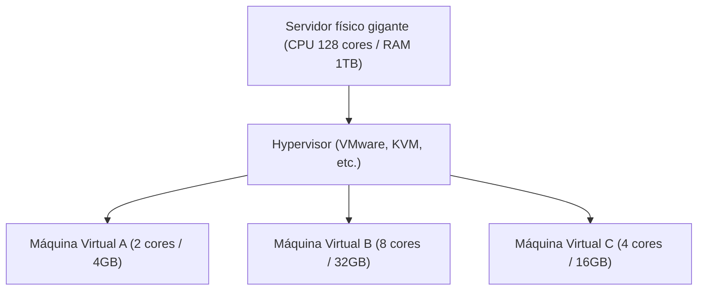

## 1. Do On-Premise para a Nuvem

No passado, quando uma empresa tentava lançar um novo serviço web ou sistema interno, precisava começar comprando a "máquina do servidor físico". A isso chamamos de "**on-premise (operação própria)**".
O on-premise levava meses desde o pedido do servidor até a instalação no data center, cabeamento e instalação do SO. Além disso, mesmo se os acessos aumentassem repentinamente, não era possível adicionar servidores imediatamente e, pelo contrário, mesmo que os acessos diminuíssem, havia o grande risco de continuar pagando os custos de compra e manutenção (como a conta de luz) do servidor.

O "**cloud computing**" (computação em nuvem) mudou radicalmente esse senso comum.
A nuvem é um serviço onde você pode alugar os recursos computacionais (CPU, memória, armazenamento, etc.) de um enorme data center do outro lado da internet, **"quando necessário", "na quantidade necessária" e "pagando apenas pelo que usar (pay-as-you-go)"**.

## 2. Três Modelos de Serviço de Nuvem (IaaS / PaaS / SaaS)

A computação em nuvem é amplamente classificada em três modelos, dependendo de "até que ponto o usuário gerencia". Vamos comparar isso ao pedido de uma pizza.

1. **IaaS (Infrastructure as a Service)**
   - **Conteúdo**: Alugar apenas a "infraestrutura", como CPU, memória e rede. A instalação do SO e de middlewares é feita por você.
   - **Exemplo da pizza**: Comprar apenas a massa da pizza e adicionar os ingredientes e assá-la no seu próprio forno em casa.
   - **Exemplos típicos**: AWS (Amazon EC2), Google Compute Engine

2. **PaaS (Platform as a Service)**
   - **Conteúdo**: Não apenas a infraestrutura, mas o SO, o banco de dados e o ambiente de execução do programa são fornecidos como um conjunto. Os desenvolvedores podem se concentrar apenas em "escrever o código".
   - **Exemplo da pizza**: Comprar uma "pizza congelada" no supermercado e apenas aquecê-la no micro-ondas em casa.
   - **Exemplos típicos**: AWS Elastic Beanstalk, Heroku, Vercel

3. **SaaS (Software as a Service)**
   - **Conteúdo**: Usar o próprio software como serviço via internet. O usuário não precisa gerenciar nada.
   - **Exemplo da pizza**: Ligar para a pizzaria, pedir a entrega de uma pizza assada e apenas comê-la.
   - **Exemplos típicos**: Gmail, Slack, Salesforce, Microsoft 365

## 3. A "Tecnologia de Virtualização" que Sustenta a Nuvem

Nos data centers dos provedores de serviços em nuvem, existem dezenas de milhares de enormes servidores físicos. No entanto, os usuários podem alugar servidores em pequenas unidades, como "2 cores de CPU e 4GB de memória".
O que possibilita isso é a "**tecnologia de virtualização (Virtualization)**".

Um software especial chamado hypervisor divide logicamente um único servidor físico e cria várias "**máquinas virtuais (VM: Virtual Machine)**".
Cada máquina virtual é independente, e se uma máquina virtual vizinha falhar, as outras não serão afetadas. Os usuários podem iniciar uma nova máquina virtual em segundos clicando em um botão na tela de gerenciamento do navegador, ou excluí-la quando não for mais necessária para interromper a cobrança.

## 4. Vantagens e Desafios Atuais da Nuvem

A migração para a nuvem tornou-se uma estratégia indispensável nos negócios modernos.

- **Velocidade e Flexibilidade**: Se tiver uma ideia, pode iniciar um servidor em poucos minutos e publicar o serviço para o mundo todo.
- **Escalabilidade (Capacidade de expansão)**: Mesmo que seu serviço seja apresentado na TV e os acessos aumentem em 100 vezes, o número de servidores aumenta automaticamente para lidar com isso (auto scaling) e pode voltar ao normal quando o pico passar.
- **Redução de Custos**: O custo inicial (initial cost) torna-se zero, pagando apenas os custos operacionais (running costs) pelo que você usar.

Por outro lado, também há desafios. A dependência excessiva de sistemas num provedor de nuvem específico (como AWS) torna difícil mudar para outra empresa, um problema conhecido como "**vendor lock-in**", além de acidentes de **vazamento de informações em grande escala** devido a erros de configuração da nuvem (como configurações de armazenamento exposto publicamente) que não param de acontecer.

## 5. Conclusão

A computação em nuvem é como a "eletricidade" ou a "água" no mundo da TI.
No passado, cada empresa construía sua própria usina (servidor), mas hoje, apenas conectando-se a uma tomada (internet), é possível usar eletricidade (recursos computacionais) de forma barata, na quantidade necessária, quando necessário.
Essa mudança de paradigma da "posse para o uso" sustenta o boom atual das startups e a evolução explosiva da tecnologia de IA.
