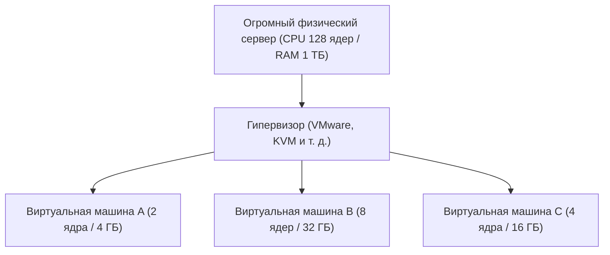

## 1. От локальной инфраструктуры к облаку

В прошлом, когда компания хотела запустить новый веб-сервис или внутреннюю систему, ей приходилось начинать с покупки «физического серверного оборудования». Это называется **локальным развертыванием (on-premises)**.
При локальном развертывании процесс от заказа серверов до их установки в центре обработки данных, прокладки кабелей и установки ОС занимал несколько месяцев. Более того, при внезапном скачке трафика было невозможно быстро добавить новые серверы, а при снижении трафика расходы на покупку серверов и их обслуживание (например, счета за электроэнергию) продолжали накапливаться, что представляло собой огромный риск.

Эту общепринятую практику в корне изменили **облачные вычисления**.
Облако — это услуга, которая позволяет арендовать вычислительные ресурсы (процессор, оперативную память, хранилище и т. д.) огромных центров обработки данных по ту сторону интернета **«когда вам это нужно», «в необходимом объеме» и «с оплатой по мере использования»**.

## 2. Три модели облачных сервисов (IaaS / PaaS / SaaS)

Облачные вычисления в целом делятся на три модели в зависимости от того, «насколько много пользователь управляет самостоятельно». Давайте сравним это с заказом пиццы.

1. **IaaS (Infrastructure as a Service)**
   - **Содержание**: Вы арендуете только «инфраструктуру», такую как процессор, память и сеть. Установку ОС и связующего ПО (middleware) вы выполняете самостоятельно.
   - **Пример с пиццей**: Вы покупаете только основу для пиццы, а начинку и запекание в домашней духовке делаете сами.
   - **Типичные примеры**: AWS (Amazon EC2), Google Compute Engine

2. **PaaS (Platform as a Service)**
   - **Содержание**: Вместе с инфраструктурой предоставляется ОС, база данных и среда выполнения программ. Разработчики могут сосредоточиться только на «написании кода».
   - **Пример с пиццей**: Вы покупаете в супермаркете «замороженную пиццу» и просто разогреваете ее дома в микроволновке.
   - **Типичные примеры**: AWS Elastic Beanstalk, Heroku, Vercel

3. **SaaS (Software as a Service)**
   - **Содержание**: Само программное обеспечение используется как сервис через интернет. Пользователю не нужно ничем управлять.
   - **Пример с пиццей**: Вы звоните в пиццерию, готовую пиццу доставляют, и вам остается только ее съесть.
   - **Типичные примеры**: Gmail, Slack, Salesforce, Microsoft 365

## 3. «Технология виртуализации», на которую опирается облако

В центрах обработки данных поставщиков облачных услуг установлены десятки тысяч огромных физических серверов. Тем не менее, пользователи могут арендовать серверы в небольших объемах, например, «2 ядра процессора и 4 ГБ памяти».
Это стало возможным благодаря **технологии виртуализации (Virtualization)**.

Специальное программное обеспечение, называемое гипервизором, логически разделяет один физический сервер и создает множество **виртуальных машин (VM: Virtual Machine)**.
Каждая виртуальная машина независима, и если соседняя виртуальная машина даст сбой, это никак на нее не повлияет. Пользователи могут запустить новую виртуальную машину за несколько секунд одним нажатием кнопки в панели управления в браузере, или удалить ее, когда она больше не нужна, чтобы прекратить тарификацию.

## 4. Преимущества облака и современные вызовы

Переход в облако стал обязательной стратегией в современном бизнесе.

- **Скорость и гибкость**: Если у вас появилась идея, вы можете запустить сервер за несколько минут и опубликовать свой сервис для всего мира.
- **Масштабируемость (Scalability)**: Даже если после упоминания на телевидении трафик увеличится в 100 раз, вы можете автоматически увеличить количество серверов для обработки нагрузки (автомасштабирование), а после пика вернуть все обратно.
- **Снижение затрат**: Первоначальные расходы (капитальные затраты) равны нулю, и остаются только операционные расходы с оплатой за фактическое использование.

С другой стороны, есть и проблемы. Чрезмерная зависимость системы от конкретного поставщика облачных услуг (например, AWS) приводит к проблеме **привязки к поставщику (Vendor Lock-in)**, затрудняющей переход к другой компании, а также продолжаются **масштабные утечки информации** из-за ошибок в настройках облака (например, неверные настройки публичного доступа к хранилищу).

## 5. Заключение

Облачные вычисления сродни «электричеству» или «водопроводу» в мире ИТ.
В прошлом каждая компания строила свою собственную электростанцию (серверы), но теперь достаточно просто подключиться к розетке (интернету), чтобы дешево использовать электричество (вычислительные ресурсы) только тогда, когда это нужно, и в необходимом объеме.
Именно эта смена парадигмы — «от владения к использованию» — служит фундаментом для современного бума стартапов и взрывного развития технологий ИИ.
