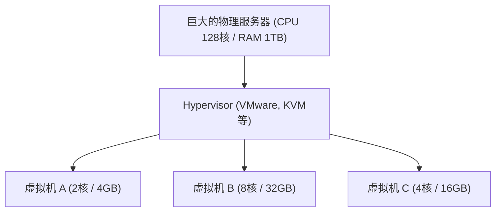

## 1. 从本地部署到云端

过去，当企业试图启动新的Web服务或内部系统时，首先需要从购买“物理服务器机器”开始。这被称为 **本地部署（自营）** 。
本地部署从订购服务器到在数据中心安装、布线、安装OS，需要花费数月的时间。此外，即使访问量激增，也无法立即增加服务器，反之，即使访问量减少，购买服务器的费用和维护费（电费等）也会持续产生，存在很大的风险。

从根本上颠覆这一常识的是 **云计算** 。
所谓云，是指一种能够 **“在需要时”** 、 **“按所需量”** 、 **“按量计费”** 地租用互联网另一端巨大数据中心的计算资源（CPU、内存、存储等）的服务。

## 2. 云的3种服务模型 (IaaS / PaaS / SaaS)

云计算根据用户“自己管理到什么程度”，大致可以分为3种模型。让我们用点披萨来比喻一下。

1. **IaaS (Infrastructure as a Service)**
   - **内容**: 仅租用CPU、内存、网络等“基础设施”。OS和中间件的安装由自己完成。
   - **披萨的例子**: 只买披萨面团，配料和烘烤在自家烤箱里自己完成的状态。
   - **代表例**: AWS (Amazon EC2), Google Compute Engine

2. **PaaS (Platform as a Service)**
   - **内容**: 不仅是基础设施，连OS、数据库、程序的运行环境都作为一套提供。开发者可以专注于“编写代码”。
   - **披萨的例子**: 在超市买“冷冻披萨”，只需在自家微波炉里加热的状态。
   - **代表例**: AWS Elastic Beanstalk, Heroku, Vercel

3. **SaaS (Software as a Service)**
   - **内容**: 通过互联网将软件本身作为服务来使用。用户无需管理任何东西。
   - **披萨的例子**: 给披萨店打电话，让人把烤好的披萨送货上门，只需吃的状态。
   - **代表例**: Gmail, Slack, Salesforce, Microsoft 365

## 3. 支撑云的“虚拟化技术”

云服务商的数据中心里并排着数以万计的巨大物理服务器。但是，用户可以以“2核CPU、4GB内存”这样的小单位来租用服务器。
实现这一点的就是 **虚拟化技术（Virtualization）** 。

被称为Hypervisor（虚拟机监控器）的特殊软件，将1台物理服务器在逻辑上进行分割，创建出多个 **虚拟机（VM: Virtual Machine）** 。
各个虚拟机是独立的，即使旁边的虚拟机崩溃也不会受到影响。用户只需在浏览器的管理页面上点击按钮，就能在几秒钟内启动新的虚拟机，或者在不需要时将其删除以停止计费。

## 4. 云的优势与现代课题

向云迁移已成为现代商业中必不可少的战略。

- **速度与灵活性**: 一旦有了想法，几分钟内就能搭建起服务器，向全世界发布服务。
- **可扩展性（Scalability）**: 即使在电视上被介绍导致访问量增加100倍，也能自动增加服务器的数量来应对（自动扩展），高峰过去后又能恢复原状。
- **降低成本**: 初始费用（Initial Cost）变为零，只剩下按使用量支付的运行成本。

另一方面，也存在一些课题。因系统过度依赖特定的云服务商（如AWS等）而导致难以切换到其他公司的 **供应商锁定（Vendor Lock-in）** 问题，以及因云配置错误（如存储公开设置错误等）导致的 **大规模信息泄露事故** 屡见不鲜。

## 5. 总结

云计算就像是IT世界中的“水电”一样。
过去，各企业都在自己建发电厂（服务器），但现在只需插上插座（互联网），就能在需要的时候、按需要的量、以低廉的价格使用电力（计算资源）。
这种“从拥有到使用”的范式转变，支撑了当今的初创企业热潮和AI技术的爆炸性进化。
