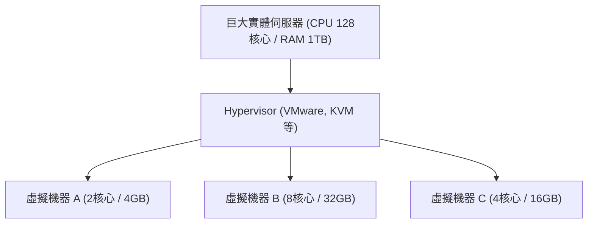

## 1. 從地端到雲端

過去，當企業想要建立新的網路服務或內部系統時，必須先從購買「實體的伺服器機器」開始。這被稱為「 **地端（自行維運）** 」。
地端部署從訂購伺服器到安裝在資料中心、佈線、安裝 OS，需要花費數個月的時間。此外，即使流量激增，也無法立即增加伺服器；反之，若流量減少，購買伺服器的費用與維護成本（如電費等）仍會持續產生，這存在著巨大的風險。

從根本上顛覆這個常識的就是「 **雲端運算** 」。
雲端是指，能夠在 **「需要的時間」「依照需要的數量」「按需付費」** 租用網際網路另一端巨大資料中心的運算資源（CPU、記憶體、儲存空間等）的服務。

## 2. 雲端的三種服務模型 (IaaS / PaaS / SaaS)

雲端運算根據使用者「自行管理的範圍」，主要分為三種模型。我們用訂購披薩來比喻吧。

1. **IaaS (Infrastructure as a Service)**
   - **內容**: 只租用 CPU、記憶體、網路等「基礎設施」。作業系統和中介軟體的安裝則由自己處理。
   - **披薩的例子**: 只買披薩餅皮，配料和烘烤都在家裡的烤箱自己動手的狀態。
   - **代表例子**: AWS (Amazon EC2), Google Compute Engine

2. **PaaS (Platform as a Service)**
   - **內容**: 除了基礎設施之外，連同 OS、資料庫和程式的執行環境都一併提供。開發者可以專注於「撰寫程式碼」。
   - **披薩的例子**: 在超市買「冷凍披薩」，回家只需用微波爐加熱即可的狀態。
   - **代表例子**: AWS Elastic Beanstalk, Heroku, Vercel

3. **SaaS (Software as a Service)**
   - **內容**: 透過網際網路將軟體本身作為服務來使用。使用者不需要管理任何東西。
   - **披薩的例子**: 打電話給披薩店，讓他們外送烤好的披薩，然後只要負責吃就好的狀態。
   - **代表例子**: Gmail, Slack, Salesforce, Microsoft 365

## 3. 支撐雲端的「虛擬化技術」

在雲端服務供應商的資料中心裡，排列著數以萬計的巨大實體伺服器。然而，使用者能以「2 核心 CPU、4GB 記憶體」這樣的小單位來租用伺服器。
實現這一點的就是「 **虛擬化技術（Virtualization）** 」。

一種被稱為 Hypervisor 的特殊軟體，將一台實體伺服器在邏輯上進行分割，創造出多個「 **虛擬機器（VM: Virtual Machine）** 」。
每個虛擬機器都是獨立的，即使旁邊的虛擬機器崩潰，也不會受到影響。使用者只需在瀏覽器的管理介面上點擊按鈕，就能在幾秒鐘內啟動新的虛擬機器，或者在不需要時將其刪除以停止計費。

## 4. 雲端的優勢與現代的挑戰

轉向雲端已經成為現代企業不可寡缺的策略。

- **速度與彈性**: 一旦有了點子，幾分鐘內就能架設好伺服器，將服務公開給全世界。
- **擴展性（Scalability）**: 即使因為電視報導而讓流量暴增 100 倍，也能自動增加伺服器數量來應對（自動擴展），並在高峰期過後恢復原狀。
- **降低成本**: 初期費用（建置成本）為零，只需支付使用多少算多少的營運成本。

另一方面，也存在著挑戰。過度依賴特定的雲端業者（如 AWS 等），導致難以轉換到其他公司的「 **供應商鎖定（Vendor Lock-in）** 」問題，以及因為雲端設定錯誤（例如儲存空間公開設定錯誤等）而導致的 **大規模資訊外洩事故** 仍層出不窮。

## 5. 總結

雲端運算就像 IT 世界裡的「電」或「自來水」。
過去各企業都是自己建立發電廠（伺服器），但現在只要插上插座（網際網路），就能在需要的時候，以低廉的價格使用所需數量的電（運算資源）。
這種「從擁有到使用」的典範轉移，支撐著現今新創企業的熱潮，以及 AI 技術爆炸性的演進。
