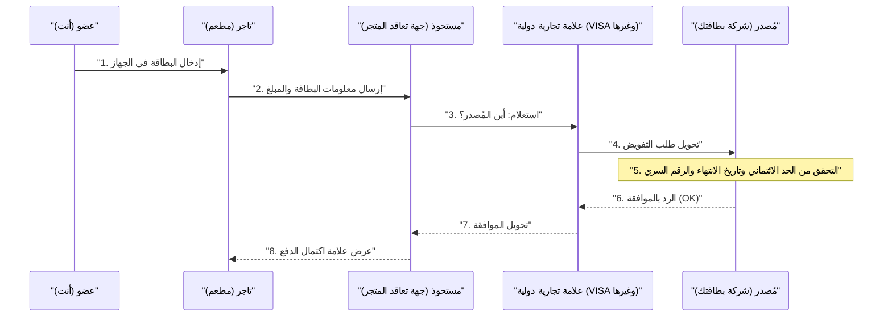

## 1. ما الذي يحدث خلال الثواني المعدودة لعملية الدفع؟

بعد تناول وجبة في مطعم، عندما تُدخل بطاقتك الائتمانية في الجهاز وتكتب الرقم السري، تظهر علامة "تمت الموافقة (اكتمل الدفع)" في غضون ثوانٍ.
بالنسبة لنا، هذا مشهد يومي مألوف، ولكن خلال هذه الثواني القليلة، يتم إجراء اتصالات بيانات معقدة تمتد عبر العالم، من جهاز المتجر إلى الشركة المصدرة للبطاقة (التي قد تكون في الجانب الآخر من الكرة الأرضية).

إذا توقفت هذه الشبكة لمدة ساعة واحدة فقط، فستقع الأنشطة الاقتصادية العالمية في فوضى عارمة. دعونا نلقي نظرة خلف الكواليس على "شبكة الدفع ببطاقات الائتمان"، والتي تتطلب استجابة سريعة وتُعد الشبكة الأقوى في العالم.

## 2. الجهات الفاعلة (نموذج الأطراف الأربعة)

لفهم آلية الدفع ببطاقات الائتمان، من الضروري معرفة **"الأطراف الأربعة"** الأساسية.

1. **حامل البطاقة (Cardholder)**: أنت. الشخص الذي يستخدم البطاقة للتسوق.
2. **التاجر (Merchant)**: المتاجر التي تقبل الدفع بالبطاقات، مثل المطاعم وAmazon.
3. **المستحوذ (Acquirer)**: الشركة التي تستقطب التجار وتوفر لهم أجهزة الدفع (شركة التعاقد مع التجار). تقوم بدفع مبيعات المتجر نيابةً عنهم.
4. **المُصدر (Issuer)**: الشركة التي تصدر لك بطاقة الائتمان وتحدد الحد الائتماني (الشركة المصدرة للبطاقة).

وتمثل **العلامات التجارية الدولية (شبكة الدفع)**، مثل VISA وMastercard، دور "الجسر الضخم" الذي يربط بين المستحوذ والمُصدر.

## 3. عملية التفويض (الموافقة الائتمانية)

في اللحظة التي تُدخل فيها البطاقة في المتجر، تبدأ عملية تُسمى **"التفويض (Authorization: الموافقة الائتمانية)"** . هذه العملية عبارة عن تحقق فوري لمعرفة "ما إذا كانت هذه البطاقة غير مزورة وهل لديها رصيد متاح كافٍ".

1. **قراءة البطاقة**: يقوم جهاز المتجر (جهاز CAT/CCT) بقراءة البيانات المشفرة من شريحة IC الخاصة بالبطاقة.
2. **شبكات مثل CAFIS**: في حالة اليابان، تصل البيانات من المتجر إلى المستحوذ عبر شبكات ترحيل محلية مثل "CAFIS" و"CARDNET".
3. **الانطلاق عبر شبكة العلامة التجارية**: ينظر المستحوذ إلى الأرقام الأولى من رقم البطاقة (رمز BIN) ويحدد أن "هذه بطاقة VISA"، ثم يرسل البيانات إلى شبكة VISA الدولية (مثل VisaNet).
4. **التقييم لدى المُصدر**: تصل البيانات إلى الكمبيوتر المضيف للشركة التي أصدرت بطاقتك (المُصدر). هنا، يتم الحساب فورياً لمعرفة "هل تجاوزت الحد الائتماني؟"، و"هل تم الإبلاغ عن سرقتها؟"، و"هل تم التقاطها بواسطة نظام كشف الاحتيال (الذكاء الاصطناعي)؟"، ثم يُرجع رمز الموافقة.
5. **الرد على المتجر**: يعود رمز الموافقة بأقصى سرعة عبر المسار الذي جاء منه، وتظهر رسالة "موافقة (OK)" على جهاز المتجر.

هذا التتابع المعقد يتم في ثوانٍ معدودة فقط.

## 4. المقاصة (Clearing) والتسوية (Settlement)

بمجرد اكتمال التفويض، **في الواقع لم يتم تحريك أي أموال بعد** . لقد تم فقط إجراء "وعد بالدفع لاحقاً (تأمين الرصيد)".
تتم العملية الفعلية لتحريك الأموال كعملية مجمعة "Batch Processing" في وقت متأخر من الليل بعد إغلاق المتجر. تُسمى هذه العمليات بـ **المقاصة (Clearing)** و **التسوية (Settlement - نقل الأموال)** .

1. **إرسال بيانات المبيعات**: يقوم المتجر بتجميع بيانات المبيعات لذلك اليوم (البيانات التي تمت الموافقة عليها) وإرسالها إلى المستحوذ.
2. **المقاصة**: يتبادل المستحوذ بيانات الحساب (بيانات المقاصة) مع كل مُصدر عبر شبكة العلامة التجارية الدولية، قائلاً "هذه هي مبيعات اليوم، لذا سأقوم بطلب الأموال".
3. **التسوية (نقل الأموال)**: اعتباراً من اليوم التالي، تعمل شبكة ما بين البنوك عبر العلامة التجارية الدولية، ويتم تحريك مئات الملايين من الأموال دفعة واحدة من الحساب المصرفي للمُصدر إلى الحساب المصرفي للمستحوذ (بعد خصم الرسوم).
4. **الدفع للمتجر والفوترة إليك**: بعد ذلك، يتم تحويل عائدات المبيعات من المستحوذ إلى المتجر، وفي الشهر التالي، يتم سحب مبلغ الاستخدام من حسابك المصرفي من قبل المُصدر.

## 5. الأمان ونظام كشف الاحتيال

في عالم بطاقات الائتمان، هناك معركة مستمرة ضد الاستخدام الاحتيالي (مثل سرقة الأرقام من قبل المتسللين).

كان من السهل في السابق إجراء "الكشط (نسخ المعلومات)" للبطاقات ذات الشريط المغناطيسي، لكن بطاقات **"شريحة IC (مواصفات EMV)"** الحالية تحتوي على كمبيوتر بالغ الصغر بداخلها يولد "تشفيرًا لمرة واحدة (Cryptogram)" في كل مرة يتم فيها الدفع، مما يجعل التزوير مستحيلاً عملياً.

كما يعمل نظام قوي لـ **الذكاء الاصطناعي (نظام كشف الاحتيال)** في الخلفية لدى المُصدر.
فهو يكتشف فوراً السلوكيات غير الطبيعية التي تخرج عن أنماط الشراء السابقة، مثل "شخص يستخدم بطاقته عادةً لشراء البقالة في طوكيو، يحاول فجأة شراء 3 أجهزة كمبيوتر باهظة الثمن على التوالي من موقع أجنبي في وقت متأخر من الليل"، ويقوم بحظر التفويض تلقائياً لمنع الضرر.

## 6. الخلاصة

شبكة الدفع ببطاقات الائتمان هي بنية تحتية للـ "ائتمان" حيث تتعاون فيها مؤسسات لا حصر لها، مثل المؤسسات المالية وشبكات الترحيل والعلامات التجارية الدولية، بموجب قواعد صارمة.

خلف اللحظة التي نمرر فيها بطاقاتنا دون تفكير، تتألق تقنيات الاتصال التي تقلل وقت الاستجابة إلى 0.1 ثانية، ومعالجة الدفعات المعقدة لتسوية الأموال، والعيون الساهرة للذكاء الاصطناعي الذي يواصل محاربة المجرمين المجهولين.
