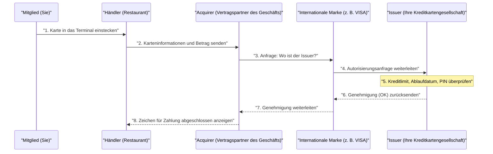

## 1. Was passiert in den wenigen Sekunden nach dem "Piep"

Wenn Sie nach einem Essen in einem Restaurant Ihre Kreditkarte in das Terminal stecken und Ihre PIN eingeben, erscheint innerhalb weniger Sekunden das Zeichen "Genehmigt (Zahlung abgeschlossen)".
Für uns ist dies ein alltäglicher Anblick, aber in diesen wenigen Sekunden findet eine komplexe Datenkommunikation über den ganzen Globus statt, vom Terminal des Geschäfts bis zum Kartenaussteller (der sich möglicherweise auf der anderen Seite der Welt befindet).

Wenn dieses Netzwerk auch nur für eine Stunde ausfallen würde, gerieten die globalen Wirtschaftsaktivitäten ins Chaos. Werfen wir einen Blick hinter die Kulissen des "Kreditkartenzahlungsnetzwerks", das das weltweit robusteste System und die schnellsten Reaktionszeiten erfordert.

## 2. Die Akteure (4-Parteien-Modell)

Um die Mechanismen von Kreditkartenzahlungen zu verstehen, müssen Sie die grundlegenden **vier Akteure (4 Parteien)** kennen.

1. **Karteninhaber (Cardholder)**: Sie. Die Person, die die Karte für Einkäufe verwendet.
2. **Händler (Merchant)**: Ein Geschäft wie ein Restaurant oder Amazon, das Kartenzahlungen akzeptiert.
3. **Acquirer (Acquirer)**: Das Unternehmen, das Händler akquiriert und ihnen Zahlungsterminals zur Verfügung stellt (Händlervertragsunternehmen). Es zahlt den Umsatz des Geschäfts im Voraus.
4. **Issuer (Issuer)**: Das Unternehmen, das Ihnen eine Kreditkarte ausstellt und Ihr Kreditlimit festlegt (Kartenaussteller).

Und die **internationalen Marken (Zahlungsnetzwerke)** wie VISA oder Mastercard spielen die Rolle einer "riesigen Brücke", die Acquirer und Issuer verbindet.

## 3. Der Prozess der Autorisierung (Kreditgenehmigung)

In dem Moment, in dem Sie Ihre Karte im Geschäft einstecken, beginnt der Prozess der **Autorisierung (Authorization: Kreditgenehmigung)**. Dabei handelt es sich um eine Echtzeitüberprüfung, um sicherzustellen, dass "diese Karte nicht gefälscht ist und einen ausreichenden Verfügungsrahmen hat".

1. **Karte lesen**: Das Terminal des Geschäfts (CAT/CCT-Terminal) liest die verschlüsselten Daten vom IC-Chip der Karte.
2. **Netzwerke wie CAFIS**: In Japan erreichen die Daten aus dem Geschäft den Acquirer über inländische Relais-Netzwerke wie "CAFIS" oder "CARDNET".
3. **Durch das Markennetzwerk rasen**: Der Acquirer betrachtet die ersten Ziffern der Kartennummer (BIN-Code), stellt fest, "Das ist eine VISA-Karte", und sendet die Daten an das internationale VISA-Netzwerk (z. B. VisaNet).
4. **Bewertung beim Issuer**: Die Daten erreichen den Host-Computer des Unternehmens, das Ihre Karte ausgestellt hat (Issuer). Hier wird sofort berechnet, ob das "Kreditlimit überschritten ist", "ein Diebstahl gemeldet wurde" oder ob "das Betrugserkennungssystem (KI) anschlägt", und ein Genehmigungscode wird zurückgegeben.
5. **Antwort an das Geschäft**: Der Genehmigungscode kehrt in rasanter Geschwindigkeit auf dem Weg zurück, auf dem er gekommen ist, und das Terminal des Geschäfts zeigt "Genehmigt (OK)" an.

Dieser komplexe Staffelauf wird in nur wenigen Sekunden durchgeführt.

## 4. Clearing (Verrechnung) und Settlement (Zahlungsabwicklung)

Zu dem Zeitpunkt, an dem die Autorisierung abgeschlossen ist, **wurde noch kein einziger Cent bewegt.** Es wurde lediglich ein "Versprechen zur späteren Zahlung (Sicherung des Rahmens)" gegeben.
Die tatsächliche Bewegung des Geldes erfolgt gesammelt als "Stapelverarbeitung" (Batch-Verarbeitung), z. B. spät nachts, nachdem die Geschäfte geschlossen haben. Dies wird als **Clearing (Verrechnung)** und **Settlement (Geldtransfer)** bezeichnet.

1. **Umsatzdaten senden**: Das Geschäft sendet die gesammelten Umsatzdaten des Tages (autorisierte Daten) an den Acquirer.
2. **Clearing (Verrechnung)**: Der Acquirer sendet Verrechnungsdaten (Clearing-Daten) über das internationale Markennetzwerk an jeden Issuer, die besagen: "Das ist der heutige Umsatz, also fordere ich das Geld an."
3. **Settlement (Geldtransfer)**: Ab dem nächsten Tag tritt das Interbankennetzwerk über die internationale Marke in Aktion, und Gelder in Höhe von Hunderten Millionen werden auf einmal vom Bankkonto des Issuers auf das Bankkonto des Acquirers überwiesen (Gebühren werden abgezogen).
4. **Einzahlung beim Geschäft und Abrechnung an Sie**: Danach wird der Umsatz vom Acquirer auf das Konto des Geschäfts überwiesen, und im darauffolgenden Monat wird der Rechnungsbetrag vom Issuer von Ihrem Bankkonto abgebucht.

## 5. Sicherheit und Betrugserkennungssysteme

In der Welt der Kreditkarten gibt es einen ständigen Kampf gegen betrügerische Nutzung (z. B. Nummerndiebstahl durch Hacker).

Während die früheren Magnetstreifenkarten leicht dem "Skimming (Kopieren von Informationen)" zum Opfer fielen, enthalten die aktuellen **IC-Chip (EMV-Spezifikation)**-Karten einen winzigen Computer im Chip. Bei jeder Zahlung wird ein "einmaliger Code (Kryptogramm)" generiert, was eine Fälschung praktisch unmöglich macht.

Zudem arbeiten hinter den Kulissen der Issuer leistungsstarke **KIs (Betrugserkennungssysteme)**.
Sie erkennen sofort abnormales Verhalten, das von früheren Kaufmustern abweicht, wie z. B. "Eine Person, die ihre Karte normalerweise nur in Supermärkten in Tokio verwendet, versucht plötzlich spät nachts, drei teure Computer auf einer ausländischen Website zu kaufen." Sie blockieren die Autorisierung automatisch, um Schäden zu verhindern.

## 6. Zusammenfassung

Das Kreditkartenzahlungsnetzwerk ist eine "Kredit"-Infrastruktur, in der unzählige Unternehmen wie Finanzinstitute, Relais-Netzwerke und internationale Marken unter strengen Regeln zusammenarbeiten.

Hinter unserer beiläufigen Aktion, eine Karte vorzuhalten, verbergen sich Kommunikationstechnologien, die eine Reaktionszeit von 0,1 Sekunden ermöglichen, komplexe Batch-Verarbeitungen für das Finanzclearing und die wachsamen Augen von KI, die weiterhin gegen unsichtbare Kriminelle kämpft.
