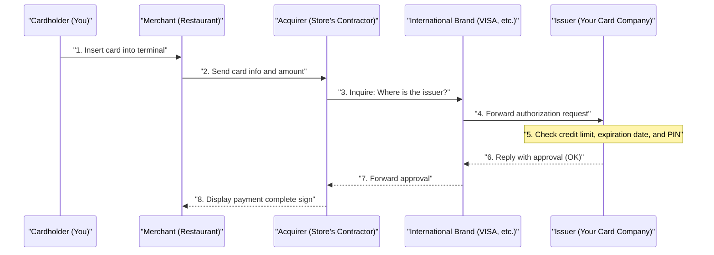

## 1. What Happens During Those Few Seconds of a "Beep"

After dining at a restaurant, when you insert your credit card into the terminal and enter your PIN, the "Approved (Payment Complete)" sign appears in just a few seconds.
For us, this is a common, everyday scene, but during these mere few seconds, complex data communication spanning the globe takes place, extending from the store's terminal to the card issuer (which might be on the other side of the planet).

If this network were to stop for even an hour, economic activities worldwide would plunge into chaos. Let's take a peek behind the scenes of the "credit card payment network," which is the most robust in the world and requires the fastest response times.

## 2. The Cast of Characters (4-Party Model)

To understand how credit card payments work, you need to know the basic "**four characters (4 parties)**".

1. **Cardholder**: That's you. The person who uses the card to make purchases.
2. **Merchant**: Stores that accept card payments, such as a restaurant or Amazon.
3. **Acquirer**: The company that develops merchants and provides them with payment terminals (merchant acquiring bank). They advance the store's sales payments.
4. **Issuer**: The company that issues your credit card and sets your credit limit (card issuing bank).

And playing the role of a "giant bridge" connecting the acquirer and the issuer are the **international brands (payment networks)**, such as VISA and Mastercard.

## 3. The Authorization Process (Credit Approval)

The process that runs the moment you insert your card at a store is called "**Authorization**". This is a real-time check to confirm, "Is this card not a counterfeit, and does it have a sufficient credit limit?"

1. **Reading the Card**: The store's terminal (CAT/CCT terminal) reads encrypted data from the card's IC chip.
2. **Networks like CAFIS**: In Japan, data from the store reaches the acquirer through domestic relay networks like "CAFIS" and "CARDNET".
3. **Racing Through the Brand Network**: The acquirer looks at the first digits of the card number (BIN code), determines that "This is a VISA card," and throws the data into VISA's international network (such as VisaNet).
4. **Judgment at the Issuer**: The data arrives at the host computer of the company that issued your card (the issuer). Here, it instantaneously calculates "Has the credit limit been exceeded?", "Has a theft report been filed?", and "Does it get flagged by the fraud detection system (AI)?", and returns an approval code.
5. **Response to the Store**: The approval code returns at breakneck speed along the path it came, and "Approved (OK)" is displayed on the store's terminal.

This incredibly complex relay is performed in just a few seconds.

## 4. Clearing and Settlement

At the point authorization is completed, **not a single cent has actually moved yet.** Only a "promise to pay later (securing the credit line)" has been made.
The actual movement of money is processed all together in a "batch process" late at night after the store closes. These are called **Clearing** and **Settlement**.

1. **Sending Sales Data**: The store sends that day's aggregated sales data (authorized data) to the acquirer.
2. **Clearing**: The acquirer sends clearing data (settlement data) via the international brand's network to each issuer, saying, "Today's sales are this much, so I'm billing you for the money."
3. **Settlement**: From the next day onwards, interbank networks operate through the international brands, and funds in units of hundreds of millions of yen move collectively from the issuers' bank accounts to the acquirers' bank accounts (fees are deducted).
4. **Deposit to the Store and Billing to You**: Afterward, the sales proceeds are transferred from the acquirer to the store, and the following month, the issuer will withdraw the billed amount from your bank account.

## 5. Security and Fraud Detection Systems

In the world of credit cards, a continuous battle against fraudulent use (such as number theft by hackers) is waged.

Former magnetic stripe cards were easy to "skim" (copy information), but current "**IC chip (EMV specification)**" cards have a microscopic computer inside the chip. Because they generate a "one-time cryptographic code (cryptogram)" for each payment, counterfeiting is virtually impossible.

Also, a powerful **AI (fraud detection system)** runs behind the scenes at the issuer.
It instantaneously detects abnormal behavior that deviates from past purchasing patterns—such as "A person who normally only uses the card for grocery shopping in Tokyo is suddenly trying to buy three expensive computers in a row on a foreign website late at night." It automatically blocks the authorization to prevent damage.

## 6. Conclusion

The credit card payment network is a "credit" infrastructure where countless companies—such as financial institutions, relay networks, and international brands—collaborate under robust rules.

Behind the scenes when we casually swipe or insert our cards, there is a communication technology working to shave off 0.1-second response times, complex batch processing for financial clearing, and the watchful eyes of AI continuously fighting unseen criminals.
